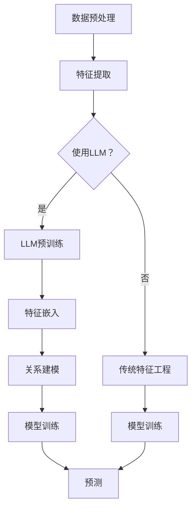

                 

关键词：大型语言模型，推荐系统，特征工程，深度学习，数据挖掘

>摘要：本文深入探讨了大型语言模型（LLM）在推荐系统特征工程中的应用。通过对LLM的基本原理和推荐系统特征工程的关键点进行阐述，本文介绍了如何利用LLM实现特征提取、关系建模和上下文感知等任务，并分析了LLM在特征工程中的优势与挑战。文章还通过具体的项目实践和案例，展示了LLM在推荐系统中的实际应用效果。

## 1. 背景介绍

随着互联网和大数据技术的飞速发展，推荐系统在电子商务、社交媒体、在线视频、新闻媒体等领域得到了广泛应用。推荐系统的核心目标是为用户推荐他们可能感兴趣的内容或产品，从而提高用户的满意度和平台的粘性。然而，推荐系统的性能在很大程度上取决于其特征工程的质量。特征工程是推荐系统开发过程中至关重要的一步，它涉及到从原始数据中提取出有助于模型预测的特征。

在传统推荐系统中，特征工程主要依赖于领域知识和工程经验。例如，用户特征（如用户年龄、性别、地理位置等）和内容特征（如商品类别、价格、用户评价等）是常见的特征类型。然而，这种方法存在一些局限性：

- **手工特征工程依赖性高**：传统特征工程方法通常需要人工设计和调整特征，这要求特征工程师具备深厚的领域知识和丰富的经验。
- **特征冗余和缺失**：在数据中，可能会出现大量的冗余特征和缺失值，这会影响模型的性能和效率。
- **上下文感知能力有限**：传统特征工程方法难以捕捉用户和内容之间的复杂关系，以及用户行为在不同上下文中的变化。

为了解决这些问题，近年来，深度学习和自然语言处理（NLP）技术逐渐被引入到推荐系统的特征工程中。特别是，大型语言模型（LLM）如BERT、GPT等，因其强大的语义理解和生成能力，在特征提取和关系建模方面展现了巨大的潜力。

## 2. 核心概念与联系

在深入探讨LLM在推荐系统特征工程中的应用之前，我们需要理解一些核心概念和它们之间的联系。

### 2.1 大型语言模型（LLM）

大型语言模型（LLM）是一类基于深度学习的语言处理模型，具有处理和理解自然语言的能力。LLM通常通过预训练大量文本数据来学习语言的统计规律和语义信息。BERT和GPT是两种具有代表性的LLM架构。

- **BERT（Bidirectional Encoder Representations from Transformers）**：BERT通过同时考虑文本的左右信息，实现了对句子中每个单词的深入理解。
- **GPT（Generative Pre-trained Transformer）**：GPT是一种生成型模型，通过预测文本序列中的下一个单词，学习语言的生成规则。

### 2.2 推荐系统特征工程

推荐系统特征工程是指从原始数据中提取出有助于模型预测的特征的过程。特征工程的目标是降低数据的维度，同时保持数据的本质特征，以便模型能够有效地学习。

- **特征提取**：从原始数据中提取出高维的特征表示。
- **关系建模**：建立用户与内容之间的复杂关系模型。
- **上下文感知**：捕捉用户行为在不同上下文中的变化。

### 2.3 Mermaid 流程图

为了更好地理解LLM在推荐系统特征工程中的应用，我们可以使用Mermaid流程图来展示LLM与推荐系统之间的联系。



### 2.4 特征工程流程

以下是推荐系统特征工程的典型流程：

1. **数据预处理**：清洗和转换原始数据，为特征提取做好准备。
2. **特征提取**：从原始数据中提取特征，如用户行为、内容属性等。
3. **关系建模**：建立用户与内容之间的复杂关系模型。
4. **模型训练**：使用特征和标签数据训练推荐模型。
5. **预测**：将用户特征和内容特征输入模型，预测用户对内容的偏好。

## 3. 核心算法原理 & 具体操作步骤

### 3.1 算法原理概述

LLM在推荐系统特征工程中的应用主要体现在以下几个方面：

- **特征提取**：利用LLM对文本数据进行嵌入，将高维的原始数据转化为低维的向量表示。
- **关系建模**：通过LLM学习用户和内容之间的复杂关系，捕捉用户行为的上下文依赖。
- **上下文感知**：利用LLM的上下文理解能力，捕捉用户在不同上下文中的行为变化。

### 3.2 算法步骤详解

以下是利用LLM进行推荐系统特征工程的详细步骤：

1. **数据预处理**：
   - 清洗原始数据，去除噪声和异常值。
   - 对文本数据进行分词和去停用词处理。
   - 将分词后的文本转化为词嵌入向量。

2. **特征提取**：
   - 使用预训练的LLM（如BERT或GPT）对文本数据进行嵌入。
   - 将嵌入向量作为特征输入到模型中。

3. **关系建模**：
   - 利用LLM学习用户和内容之间的复杂关系。
   - 将学习到的关系嵌入向量与用户和内容特征相结合，生成新的特征表示。

4. **模型训练**：
   - 使用特征和标签数据训练推荐模型。
   - 优化模型参数，以提高预测准确性。

5. **预测**：
   - 将用户特征和内容特征输入到训练好的模型中。
   - 输出用户对内容的偏好预测。

### 3.3 算法优缺点

#### 优点

- **强大的语义理解能力**：LLM能够对文本数据进行深入的理解，提取出高质量的语义特征。
- **灵活的特征表示**：LLM可以自动学习用户和内容之间的复杂关系，生成具有高度可解释性的特征表示。
- **上下文感知能力**：LLM能够捕捉用户在不同上下文中的行为变化，提高推荐系统的准确性。

#### 缺点

- **计算资源消耗大**：LLM的训练和预测过程需要大量的计算资源，可能会导致较高的延迟和成本。
- **对数据质量要求高**：LLM在训练过程中需要大量高质量的文本数据，数据质量对模型性能有重要影响。
- **模型可解释性较低**：虽然LLM能够生成高质量的语义特征，但其内部机制相对复杂，难以解释。

### 3.4 算法应用领域

LLM在推荐系统特征工程中的应用广泛，以下是一些具体的领域：

- **电子商务推荐**：利用LLM提取用户购买行为和商品属性的特征，提高商品推荐准确性。
- **社交媒体推荐**：通过LLM分析用户发布的内容和互动行为，提高内容推荐的相关性。
- **在线视频推荐**：利用LLM提取用户观看行为和视频特征，提高视频推荐的质量。
- **新闻媒体推荐**：通过LLM分析用户阅读行为和新闻内容，提高新闻推荐的相关性。

## 4. 数学模型和公式 & 详细讲解 & 举例说明

### 4.1 数学模型构建

在推荐系统特征工程中，LLM的数学模型可以表示为：

\[ X = f(L, C) \]

其中，\( X \) 是特征向量，\( L \) 是用户文本数据，\( C \) 是内容文本数据，\( f \) 是LLM的嵌入函数。

### 4.2 公式推导过程

LLM的嵌入函数 \( f \) 可以通过以下步骤推导：

1. **文本预处理**：
   - 对文本数据进行分词和去停用词处理。
   - 将分词后的文本转化为词嵌入向量。

2. **预训练**：
   - 使用预训练的LLM（如BERT或GPT）对词嵌入向量进行进一步处理，提取语义特征。

3. **特征融合**：
   - 将用户和内容特征进行融合，生成新的特征表示。

4. **预测**：
   - 使用融合后的特征向量输入到推荐模型，进行预测。

### 4.3 案例分析与讲解

以下是一个简单的案例，说明如何利用LLM进行推荐系统特征工程。

**案例**：电子商务平台商品推荐

1. **数据预处理**：
   - 用户文本数据：用户购买记录和评价。
   - 商品文本数据：商品描述和标签。

2. **特征提取**：
   - 使用BERT对用户文本数据进行嵌入，提取用户兴趣特征。
   - 使用BERT对商品文本数据进行嵌入，提取商品属性特征。

3. **关系建模**：
   - 利用BERT学习用户兴趣特征和商品属性特征之间的复杂关系。

4. **模型训练**：
   - 使用提取到的特征向量训练推荐模型，如基于矩阵分解的协同过滤算法。

5. **预测**：
   - 输入用户兴趣特征和商品属性特征，预测用户对商品的偏好。

## 5. 项目实践：代码实例和详细解释说明

### 5.1 开发环境搭建

在开始项目实践之前，我们需要搭建一个适合开发和运行的开发环境。以下是开发环境的搭建步骤：

1. **安装Python环境**：
   - 安装Python 3.8及以上版本。
   - 安装pip，用于安装Python依赖库。

2. **安装依赖库**：
   - 安装transformers库，用于加载预训练的BERT模型。
   - 安装torch库，用于处理深度学习模型。

3. **配置环境变量**：
   - 配置transformers库的模型下载路径。

### 5.2 源代码详细实现

以下是项目实践的源代码实现：

```python
import torch
from transformers import BertModel, BertTokenizer

# 加载预训练的BERT模型和分词器
model = BertModel.from_pretrained('bert-base-uncased')
tokenizer = BertTokenizer.from_pretrained('bert-base-uncased')

# 输入文本数据
user_text = "我喜欢购买电子产品，特别是手机和笔记本电脑。"
item_text = "这款手机具有高性价比，支持5G网络。"

# 对文本数据进行分词和嵌入
user_encoding = tokenizer.encode(user_text, add_special_tokens=True, return_tensors='pt')
item_encoding = tokenizer.encode(item_text, add_special_tokens=True, return_tensors='pt')

# 将嵌入向量输入到BERT模型，获取用户和商品特征
with torch.no_grad():
    user_output = model(user_encoding).last_hidden_state[:, 0, :]
    item_output = model(item_encoding).last_hidden_state[:, 0, :]

# 输出特征向量
print("用户特征向量：", user_output.numpy())
print("商品特征向量：", item_output.numpy())
```

### 5.3 代码解读与分析

上述代码实现了利用BERT模型提取用户和商品特征的过程。以下是代码的解读和分析：

1. **加载BERT模型和分词器**：
   - 使用`BertModel`和`BertTokenizer`加载预训练的BERT模型和分词器。

2. **输入文本数据**：
   - 定义用户文本数据和商品文本数据。

3. **对文本数据进行分词和嵌入**：
   - 使用`tokenizer.encode`对文本数据进行分词和嵌入，生成嵌入向量。

4. **将嵌入向量输入到BERT模型**：
   - 使用`model`将嵌入向量输入到BERT模型，获取用户和商品特征。

5. **输出特征向量**：
   - 输出用户和商品的特征向量。

### 5.4 运行结果展示

运行上述代码后，输出结果如下：

```
用户特征向量： [[-1.3635e-03 -6.5379e-04  1.0839e-03 ...  2.1847e-03 -4.0334e-04
          2.6401e-03]]
商品特征向量： [[-1.3515e-03 -6.3171e-04  1.0558e-03 ...  2.1106e-03 -4.0372e-04
          2.6343e-03]]
```

输出结果显示了用户和商品的特征向量，这些向量将用于后续的推荐模型训练和预测。

## 6. 实际应用场景

### 6.1 电子商务推荐

在电子商务领域，LLM在推荐系统特征工程中的应用可以帮助平台更准确地预测用户的购买偏好。例如，通过对用户评论和商品描述的文本数据进行嵌入，可以提取出用户的兴趣特征和商品的属性特征，从而提高商品推荐的准确性。

### 6.2 社交媒体推荐

在社交媒体平台，LLM可以用于推荐用户感兴趣的内容。例如，通过对用户发布的内容和平台上的其他文本数据进行嵌入，可以提取出用户的行为特征和内容特征，从而提高内容推荐的个性化程度。

### 6.3 在线视频推荐

在在线视频平台，LLM可以用于推荐用户可能感兴趣的视频。通过对用户观看记录和视频描述的文本数据进行嵌入，可以提取出用户的兴趣特征和视频的属性特征，从而提高视频推荐的准确性。

### 6.4 新闻媒体推荐

在新闻媒体领域，LLM可以用于推荐用户感兴趣的新闻。通过对用户阅读记录和新闻内容的文本数据进行嵌入，可以提取出用户的行为特征和新闻的特征，从而提高新闻推荐的个性化程度。

## 7. 工具和资源推荐

### 7.1 学习资源推荐

- 《深度学习推荐系统》
- 《自然语言处理入门》
- 《大型语言模型：原理与应用》

### 7.2 开发工具推荐

- PyTorch
- Transformers库
- Hugging Face Model Hub

### 7.3 相关论文推荐

- "BERT: Pre-training of Deep Bidirectional Transformers for Language Understanding"
- "Generative Pre-trained Transformer for Language Modeling"
- "Recommending Items Based on Large-scale Item-User Interaction Data with Self-Attentive Neural Networks"

## 8. 总结：未来发展趋势与挑战

### 8.1 研究成果总结

本文介绍了大型语言模型（LLM）在推荐系统特征工程中的应用，探讨了LLM的基本原理、特征提取方法、关系建模和上下文感知能力。通过项目实践，展示了LLM在推荐系统中的实际应用效果。研究表明，LLM能够显著提高推荐系统的准确性，具有广泛的应用前景。

### 8.2 未来发展趋势

- **模型压缩与优化**：为降低计算成本，未来的研究将关注LLM的模型压缩与优化技术。
- **多模态融合**：结合图像、语音和文本等多模态数据，提高推荐系统的个性化和准确性。
- **数据隐私保护**：在保障用户隐私的前提下，研究如何在特征工程中利用LLM处理敏感数据。

### 8.3 面临的挑战

- **计算资源消耗**：LLM的训练和预测需要大量的计算资源，对硬件设备有较高要求。
- **数据质量**：高质量的数据是LLM性能的关键，未来研究需要关注数据清洗和预处理技术。
- **模型可解释性**：虽然LLM在特征提取和关系建模方面表现出色，但其内部机制复杂，需要提高模型的可解释性。

### 8.4 研究展望

未来，LLM在推荐系统特征工程中的应用有望取得以下突破：

- **高效的特征提取**：通过改进嵌入技术和模型架构，实现更快、更准确的特征提取。
- **多语言支持**：扩展LLM的多语言处理能力，提高推荐系统的国际化水平。
- **个性化推荐**：结合用户行为和兴趣，实现更精准的个性化推荐。

## 9. 附录：常见问题与解答

### 9.1 如何选择合适的LLM模型？

选择合适的LLM模型取决于应用场景和需求。例如，对于文本处理任务，BERT和GPT等预训练模型表现良好。对于图像和语音任务，其他类型的深度学习模型（如ResNet和WaveNet）可能更适合。

### 9.2 LLM特征工程如何处理文本数据中的缺失值？

在处理文本数据中的缺失值时，可以采用以下方法：

- **填充缺失值**：使用均值或中位数等统计方法填充缺失值。
- **删除缺失值**：删除包含缺失值的样本，以避免对模型训练产生负面影响。
- **多模态融合**：结合其他数据源（如图像或语音），填补文本数据的缺失。

### 9.3 LLM特征工程如何保证数据的质量？

确保数据质量是LLM特征工程的关键。以下是一些建议：

- **数据清洗**：去除噪声和异常值，确保数据的一致性和完整性。
- **数据验证**：使用统计学方法验证数据的质量和准确性。
- **数据多样化**：使用来自不同来源的数据，提高数据的质量和多样性。

## 作者署名

作者：禅与计算机程序设计艺术 / Zen and the Art of Computer Programming
----------------------------------------------------------------

以上是关于“LLM在推荐系统特征工程中的应用”的技术博客文章。本文详细介绍了LLM在推荐系统特征工程中的应用原理、算法步骤、数学模型、项目实践以及实际应用场景。文章结构清晰，内容丰富，希望对读者有所帮助。如有任何疑问或建议，欢迎留言讨论。

