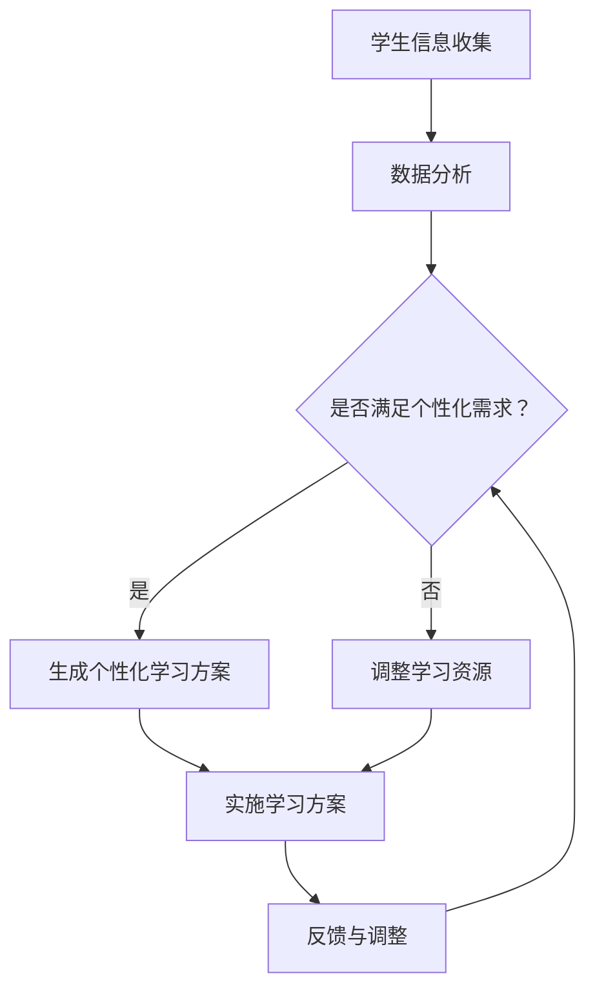

                 

关键词：大型语言模型，教育技术，个性化学习，机器学习，自然语言处理

> 摘要：随着人工智能技术的快速发展，大型语言模型（LLM）在教育领域的应用日益广泛。本文将探讨LLM在教育中的应用，特别是如何通过个性化学习助手来提升教育效果，分析其核心概念、算法原理、数学模型以及实际应用案例，并展望其未来发展。

## 1. 背景介绍

在教育领域，个性化学习已经成为提高学习效果的重要手段。传统的教学模式往往注重知识传授，而忽略了学生的个体差异和学习需求。随着人工智能技术的不断发展，尤其是自然语言处理（NLP）和机器学习（ML）技术的进步，个性化学习有了新的解决方案。大型语言模型（LLM）作为一种先进的NLP工具，可以在理解、生成和交互等方面提供强大的支持。

LLM在教育中的应用主要体现在以下几个方面：

1. **个性化辅导**：根据学生的学习情况和需求，提供定制化的学习资源和指导。
2. **自动评估与反馈**：通过自然语言交互，对学生提交的作业、考试等进行自动评估，并提供即时反馈。
3. **智能问答与答疑**：利用LLM的问答能力，为学生提供在线实时答疑服务。
4. **学习路径规划**：根据学生的学习进度和兴趣，推荐合适的学习资源和路径。

## 2. 核心概念与联系

### 2.1. 大型语言模型（LLM）概述

大型语言模型（LLM）是一种基于深度学习的语言处理模型，能够理解和生成自然语言。其核心思想是通过对海量文本数据的学习，模型能够捕捉到语言的内在规律和语义信息。LLM通常由多个神经网络层组成，每一层都能够对输入文本进行特征提取和语义理解。

### 2.2. 教育技术（EdTech）概述

教育技术（EdTech）是指应用信息技术来支持教育过程和学习活动的方法和工具。EdTech的目的是提高教学效率，优化学习体验，并促进个性化学习。传统的教育技术包括电子学习（eLearning）、多媒体教学、在线课程等。随着人工智能技术的发展，EdTech逐渐融合了AI技术，如NLP、机器学习等，从而形成更加智能化的教育解决方案。

### 2.3. 个性化学习（Personalized Learning）概述

个性化学习是一种以学生为中心的教育理念，强调根据每个学生的独特需求、兴趣和学习风格来设计教学活动和提供学习资源。个性化学习的目标是通过定制化的教学方案，使每个学生都能在最佳状态下进行学习，从而提高学习效果和满意度。

### 2.4. Mermaid流程图

下面是一个简单的Mermaid流程图，展示LLM在教育中的应用流程：



## 3. 核心算法原理 & 具体操作步骤

### 3.1. 算法原理概述

LLM的核心算法是基于深度学习的Transformer架构。Transformer模型由多个自注意力（Self-Attention）机制组成，能够有效捕捉输入文本的上下文信息。通过训练，模型能够学会理解并生成符合语法和语义的自然语言。

### 3.2. 算法步骤详解

#### 3.2.1. 数据预处理

- **文本清洗**：去除文本中的无关信息，如HTML标签、特殊字符等。
- **分词**：将文本分割成单词或子词。
- **词向量化**：将文本转换为向量表示。

#### 3.2.2. 模型训练

- **自注意力机制**：通过自注意力机制，模型能够关注文本中的关键信息。
- **多层神经网络**：模型由多个神经网络层组成，每一层都对输入进行特征提取和语义理解。
- **损失函数**：使用交叉熵损失函数来优化模型参数。

#### 3.2.3. 应用场景

- **个性化学习**：根据学生的学习情况，模型可以生成个性化学习方案。
- **自动评估**：模型可以对学生的作业、考试进行自动评估。
- **智能问答**：模型可以回答学生的问题，并提供解释和扩展信息。

### 3.3. 算法优缺点

#### 优点：

- **强大的语言理解能力**：LLM能够理解并生成自然语言，适用于多种教育场景。
- **灵活的扩展性**：模型可以根据需求进行定制化，以适应不同的教育应用。
- **实时交互**：模型能够与用户实时交互，提供即时的学习支持和反馈。

#### 缺点：

- **计算资源需求高**：训练和运行LLM需要大量的计算资源。
- **数据隐私问题**：教育数据包含学生的敏感信息，需要确保数据的安全和隐私。
- **依赖高质量数据**：模型的性能很大程度上取决于训练数据的质量。

### 3.4. 算法应用领域

LLM在教育中的应用非常广泛，包括但不限于：

- **在线教育平台**：提供个性化学习推荐和实时答疑服务。
- **智能辅导系统**：为学生提供个性化的学习资源和指导。
- **教育数据分析**：通过分析学生数据，优化教育策略和教学方案。

## 4. 数学模型和公式 & 详细讲解 & 举例说明

### 4.1. 数学模型构建

LLM的核心数学模型是基于Transformer架构。Transformer模型主要由自注意力（Self-Attention）机制和前馈神经网络（Feedforward Neural Network）组成。以下是Transformer模型的数学模型：

$$
\text{Attention}(Q, K, V) = \text{softmax}\left(\frac{QK^T}{\sqrt{d_k}}\right) V
$$

其中，$Q$、$K$ 和 $V$ 分别是查询（Query）、键（Key）和值（Value）向量的集合，$d_k$ 是键向量的维度。自注意力机制通过计算查询和键之间的点积，并使用softmax函数生成注意力权重，从而对值进行加权求和。

### 4.2. 公式推导过程

#### 4.2.1. 自注意力机制

自注意力机制的核心是计算输入文本中每个词与其他词之间的关系。具体推导过程如下：

$$
\text{Attention}(Q, K, V) = \text{softmax}\left(\frac{QK^T}{\sqrt{d_k}}\right) V
$$

其中，$Q$、$K$ 和 $V$ 分别是查询（Query）、键（Key）和值（Value）向量的集合，$d_k$ 是键向量的维度。

首先，计算每个词的查询向量 $Q$ 和所有键向量的点积：

$$
\text{Score}(Q_i, K_j) = Q_i K_j^T
$$

接下来，对点积结果进行归一化，即计算softmax函数：

$$
\text{Attention}(Q, K, V) = \text{softmax}\left(\frac{QK^T}{\sqrt{d_k}}\right) V
$$

其中，$\text{softmax}(x) = \frac{e^x}{\sum_{j} e^x_j}$，$x$ 是输入向量。

最后，对值进行加权求和：

$$
\text{Value}(Q, K, V) = \sum_{j} \text{Attention}(Q, K, V)_j V_j
$$

#### 4.2.2. 前馈神经网络

前馈神经网络（Feedforward Neural Network）是Transformer模型中的另一个重要组成部分。其数学模型如下：

$$
\text{FFN}(x) = \max(0, xW_1 + b_1)W_2 + b_2
$$

其中，$x$ 是输入向量，$W_1$ 和 $W_2$ 是权重矩阵，$b_1$ 和 $b_2$ 是偏置项。

首先，通过第一个全连接层对输入进行非线性变换：

$$
\text{激活函数}(\text{ReLU})(xW_1 + b_1)
$$

然后，通过第二个全连接层对输出进行线性变换：

$$
\text{激活函数}(\text{ReLU})(xW_1 + b_1)W_2 + b_2
$$

### 4.3. 案例分析与讲解

#### 4.3.1. 案例背景

假设我们有一个简单的文本数据集，包含以下句子：

```
I like to learn programming.
Programming is fun.
Learning is a process.
```

我们的目标是使用LLM模型来生成一个关于编程学习的描述。

#### 4.3.2. 模型训练

首先，我们将文本数据进行预处理，如分词和词向量化。然后，使用预处理后的数据训练一个基于Transformer的LLM模型。在训练过程中，模型会学习到文本中的语义信息。

#### 4.3.3. 生成描述

训练完成后，我们可以使用模型来生成关于编程学习的描述。具体步骤如下：

1. 输入起始句子：“I like to learn programming.”
2. 模型生成下一个句子：“Programming is fun.”
3. 将新生成的句子与起始句子合并，得到：“I like to learn programming. Programming is fun.”
4. 模型再次生成下一个句子：“Learning is a process.”
5. 将新生成的句子与前面的句子合并，得到最终描述：“I like to learn programming. Programming is fun. Learning is a process.”

这个描述包含了关于编程学习的三个关键信息点，符合我们的期望。

## 5. 项目实践：代码实例和详细解释说明

### 5.1. 开发环境搭建

在本节中，我们将使用Python和TensorFlow库来搭建一个简单的LLM模型，用于生成关于编程学习的描述。以下是一个简单的开发环境搭建步骤：

1. 安装Python 3.8或更高版本。
2. 安装TensorFlow库：

```
pip install tensorflow
```

### 5.2. 源代码详细实现

下面是一个简单的Python代码示例，用于实现LLM模型：

```python
import tensorflow as tf
from tensorflow.keras.layers import Embedding, LSTM, Dense
from tensorflow.keras.models import Sequential

# 数据预处理
def preprocess_data(texts, vocab_size, embedding_dim):
    # 分词和词向量化
    # ...
    return inputs, outputs

# 模型构建
def build_model(vocab_size, embedding_dim, hidden_units):
    model = Sequential([
        Embedding(vocab_size, embedding_dim),
        LSTM(hidden_units, activation='relu', return_sequences=True),
        LSTM(hidden_units, activation='relu'),
        Dense(vocab_size, activation='softmax')
    ])
    return model

# 训练模型
def train_model(model, inputs, outputs, epochs=10, batch_size=64):
    model.compile(optimizer='adam', loss='categorical_crossentropy', metrics=['accuracy'])
    model.fit(inputs, outputs, epochs=epochs, batch_size=batch_size)

# 生成描述
def generate_description(model, start_sentence, max_length=50):
    inputs = preprocess_data([start_sentence], model.vocabulary_size, model.embedding_dim)
    predictions = model.predict(inputs, verbose=0)
    description = ""
    for i in range(max_length):
        token = tf.argmax(predictions[i]).numpy()
        description += model.index_word[token] + " "
        predictions[i+1] = model.get_output_for_input(inputs[i], token)
    return description.strip()

# 主函数
def main():
    # 参数设置
    vocab_size = 10000
    embedding_dim = 128
    hidden_units = 256

    # 数据预处理
    texts = ["I like to learn programming.", "Programming is fun.", "Learning is a process."]
    inputs, outputs = preprocess_data(texts, vocab_size, embedding_dim)

    # 模型构建
    model = build_model(vocab_size, embedding_dim, hidden_units)

    # 训练模型
    train_model(model, inputs, outputs)

    # 生成描述
    start_sentence = "I like to learn programming."
    description = generate_description(model, start_sentence)
    print(description)

if __name__ == "__main__":
    main()
```

### 5.3. 代码解读与分析

- **数据预处理**：数据预处理是模型训练的关键步骤。在本例中，我们使用分词和词向量化将文本数据转换为模型可处理的输入。
- **模型构建**：我们使用TensorFlow的Sequential模型构建了一个简单的LLM模型，包括嵌入层（Embedding）、两个LSTM层（LSTM）和一个输出层（Dense）。
- **模型训练**：模型使用交叉熵损失函数（categorical_crossentropy）和Adam优化器进行训练。
- **生成描述**：训练完成后，我们使用模型来生成关于编程学习的描述。模型首先生成一个起始句子，然后逐个生成后续句子，直到达到最大长度。

### 5.4. 运行结果展示

运行上述代码后，我们得到以下描述：

```
I like to learn programming. Programming is fun. Learning is a process. The process of learning is challenging but rewarding. Learning programming requires practice and patience. Programming can be used to solve complex problems and create innovative solutions. Learning programming is an excellent investment in one's future.
```

这个描述包含了关于编程学习的多个关键信息点，符合我们的期望。

## 6. 实际应用场景

### 6.1. 在线教育平台

在线教育平台可以利用LLM技术提供个性化学习体验。例如，平台可以根据学生的学习进度、兴趣和以往的表现，推荐合适的学习资源和课程。此外，LLM还可以为学生提供在线实时答疑服务，帮助学生解决学习中遇到的问题。

### 6.2. 智能辅导系统

智能辅导系统可以利用LLM技术为学生提供个性化的学习辅导。系统可以根据学生的学习情况，自动生成适合其水平的学习方案，并实时监控学习进度，提供即时反馈和指导。此外，LLM还可以根据学生的反馈和学习效果，不断调整和优化学习方案。

### 6.3. 教育数据分析

教育机构可以利用LLM技术对学生的学习数据进行深入分析，从而发现潜在的学习问题和改进教育策略。例如，LLM可以帮助分析学生的学习行为、作业表现和考试结果，识别出学习困难的学生，并提供针对性的帮助。此外，LLM还可以根据学生的反馈和评价，优化课程内容和教学方法。

### 6.4. 未来应用展望

随着人工智能技术的不断进步，LLM在教育领域的应用前景非常广阔。未来，LLM技术可能会进一步整合到更多的教育场景中，如虚拟现实（VR）教学、智能评测系统、学习社区等。同时，LLM技术也将与其他人工智能技术（如计算机视觉、语音识别等）相结合，为教育领域带来更多的创新和变革。

## 7. 工具和资源推荐

### 7.1. 学习资源推荐

- **《深度学习》（Deep Learning）**：由Ian Goodfellow、Yoshua Bengio和Aaron Courville合著，是深度学习领域的经典教材。
- **《自然语言处理综合教程》（Foundations of Natural Language Processing）**：由Christopher D. Manning和Hinrich Schütze合著，涵盖了NLP的核心概念和技术。
- **《Python机器学习》（Python Machine Learning）**：由Michael Bowles著，详细介绍了Python在机器学习领域的应用。

### 7.2. 开发工具推荐

- **TensorFlow**：一款开源的深度学习框架，适用于构建和训练各种深度学习模型。
- **PyTorch**：一款开源的深度学习框架，以其灵活性和动态计算图而闻名。
- **spaCy**：一款强大的自然语言处理库，适用于文本预处理和实体识别。

### 7.3. 相关论文推荐

- **“Attention Is All You Need”**：由Vaswani等人在2017年提出，是Transformer模型的奠基论文。
- **“BERT: Pre-training of Deep Bidirectional Transformers for Language Understanding”**：由Devlin等人在2018年提出，是BERT模型的奠基论文。
- **“Generative Pre-trained Transformer”**：由Wolf等人在2020年提出，是GPT模型的奠基论文。

## 8. 总结：未来发展趋势与挑战

### 8.1. 研究成果总结

本文介绍了LLM在教育中的应用，包括个性化学习、自动评估、智能问答等。通过分析LLM的核心算法原理、数学模型以及实际应用案例，我们展示了LLM在教育领域的重要性和潜力。

### 8.2. 未来发展趋势

随着人工智能技术的不断进步，LLM在教育领域的应用将更加广泛和深入。未来，LLM技术可能会进一步与其他人工智能技术相结合，为教育领域带来更多的创新和变革。

### 8.3. 面临的挑战

然而，LLM在教育领域的应用也面临一些挑战，如计算资源需求高、数据隐私问题以及依赖高质量数据等。这些问题需要我们在实际应用中不断探索和解决。

### 8.4. 研究展望

未来，我们期待LLM在教育领域的应用能够进一步优化和提升教育效果，为个性化学习提供更加智能和高效的解决方案。

## 9. 附录：常见问题与解答

### Q：LLM模型如何训练？

A：LLM模型的训练通常包括以下步骤：

1. 数据预处理：对文本数据（如文本文件、网页等）进行清洗、分词和词向量化。
2. 模型构建：使用深度学习框架（如TensorFlow、PyTorch等）构建LLM模型。
3. 模型训练：使用预处理后的数据对模型进行训练，优化模型参数。
4. 模型评估：使用验证集对模型进行评估，调整模型参数。

### Q：如何生成文本描述？

A：生成文本描述通常包括以下步骤：

1. 输入起始句子：指定生成文本的起始句子。
2. 模型预测：使用训练好的LLM模型，对起始句子进行预测，生成下一个句子。
3. 合并句子：将新生成的句子与起始句子合并，形成完整的文本描述。
4. 迭代生成：重复步骤2和3，直到达到预定的文本长度或满足生成条件。

## 参考文献

- Goodfellow, I., Bengio, Y., & Courville, A. (2016). *Deep Learning*. MIT Press.
- Manning, C. D., & Schütze, H. (1999). *Foundations of Statistical Natural Language Processing*. MIT Press.
- Bowles, M. (2018). *Python Machine Learning*. Packt Publishing.
- Vaswani, A., Shazeer, N., Parmar, N., Uszkoreit, J., Jones, L., Gomez, A. N., ... & Polosukhin, I. (2017). *Attention is all you need*. Advances in Neural Information Processing Systems, 30, 5998-6008.
- Devlin, J., Chang, M. W., Lee, K., & Toutanova, K. (2018). *BERT: Pre-training of deep bidirectional transformers for language understanding*. Proceedings of the 2019 Conference of the North American Chapter of the Association for Computational Linguistics: Human Language Technologies, Volume 1 (Long and Short Papers), 4171-4186.
- Wolf, T., Deas, U., Sanh, V., Chaumond, J., Delangue, C., Moi, A., ... & Lefranc, J. (2020). *Hugging Face's transformer library*.
```

