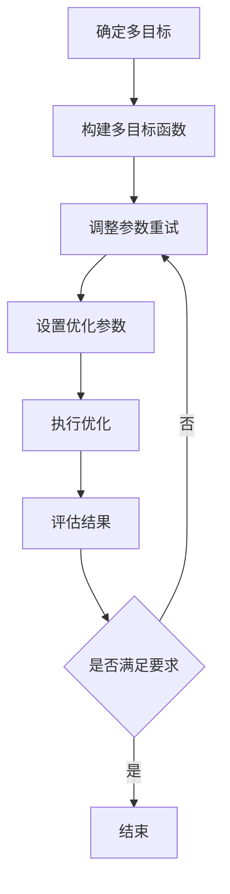

                 

关键词：多目标优化，推荐系统，LLM，算法原理，数学模型，项目实践

> 摘要：本文旨在探讨在语言学习模型（LLM）推荐系统中，如何应用多目标优化技术以提高推荐质量。通过对多目标优化技术的核心概念、算法原理和实际应用领域的详细分析，结合数学模型和案例讲解，本文旨在为读者提供全面的理解和实践指导。

## 1. 背景介绍

随着互联网的快速发展，推荐系统已经成为各类应用的核心组成部分。从电子商务网站的商品推荐到社交媒体平台的内容推送，推荐系统能够有效地提升用户体验，提高用户粘性，从而带来商业价值。语言学习模型（LLM）作为推荐系统的重要组成部分，其性能直接影响到推荐效果。然而，推荐系统通常面临多个目标，如提高用户满意度、最大化收益等，这些目标往往相互冲突。因此，多目标优化技术在推荐系统中的应用显得尤为重要。

多目标优化是一种在多个目标之间寻找平衡点的优化方法，旨在同时优化多个目标。在推荐系统中，多目标优化的目标可以是提升推荐质量、用户满意度、收益等。本文将探讨如何在LLM推荐系统中应用多目标优化技术，以提高推荐效果。

### 1.1 多目标优化在推荐系统中的重要性

多目标优化在推荐系统中的重要性体现在以下几个方面：

1. **平衡多个目标**：推荐系统往往需要同时考虑多个目标，如用户满意度、商业收益等。多目标优化技术能够帮助系统在多个目标之间找到平衡点，避免单一目标的过度追求导致系统整体性能下降。

2. **提高推荐质量**：多目标优化技术能够通过优化多个目标，提高推荐系统的整体性能。例如，通过优化用户满意度和商业收益，可以提升用户的购物体验，增加销售额。

3. **适应动态环境**：推荐系统面临的用户需求和商业环境是动态变化的。多目标优化技术能够适应这些变化，实时调整推荐策略，提高系统的灵活性和适应性。

### 1.2 本文结构

本文将按以下结构展开：

1. 背景介绍：介绍多目标优化在推荐系统中的重要性。
2. 核心概念与联系：解释多目标优化的核心概念，并展示相关流程图。
3. 核心算法原理 & 具体操作步骤：详细讲解多目标优化的算法原理和操作步骤。
4. 数学模型和公式 & 详细讲解 & 举例说明：介绍多目标优化的数学模型和公式，并通过案例进行讲解。
5. 项目实践：提供代码实例和详细解释说明。
6. 实际应用场景：分析多目标优化在推荐系统中的实际应用。
7. 工具和资源推荐：推荐学习资源、开发工具和相关论文。
8. 总结：总结研究成果，探讨未来发展趋势和挑战。
9. 附录：提供常见问题与解答。

## 2. 核心概念与联系

### 2.1 多目标优化的核心概念

多目标优化涉及多个目标，每个目标都有一个优化目标。通常，这些目标之间存在冲突，即优化一个目标可能会对另一个目标产生负面影响。因此，多目标优化的目标是同时优化多个目标，并找到一个平衡点。

在推荐系统中，常见的多目标包括：

1. **用户满意度**：提高用户的推荐体验，增加用户满意度和粘性。
2. **商业收益**：最大化推荐系统的商业收益，如提高销售额、广告点击率等。
3. **覆盖率**：确保推荐系统能够覆盖更多的用户，增加用户基数。

### 2.2 多目标优化流程图

以下是多目标优化的流程图：



### 2.3 多目标优化的相关概念和联系

在多目标优化中，还有一些重要的概念和联系，如：

1. **目标权重**：用于平衡不同目标的重要性。通常，目标权重是通过用户反馈或业务需求来确定的。
2. **目标冲突**：当优化一个目标时，可能会对其他目标产生负面影响。例如，提高用户满意度可能会降低商业收益。
3. **收敛性**：优化算法在多次迭代后，目标函数值逐渐接近最优解的能力。

## 3. 核心算法原理 & 具体操作步骤

### 3.1 算法原理概述

多目标优化的核心算法包括：

1. **遗传算法**：基于生物进化的优化算法，通过交叉、变异和选择等操作，在多个目标之间寻找最优解。
2. **粒子群优化算法**：模拟鸟群觅食行为的优化算法，通过更新粒子的位置和速度，在多个目标之间寻找最优解。
3. **差分进化算法**：基于个体差异的优化算法，通过变异、交叉和选择等操作，在多个目标之间寻找最优解。

### 3.2 算法步骤详解

以下是多目标优化的具体操作步骤：

1. **初始化**：初始化种群（遗传算法、粒子群优化算法）或参数（差分进化算法）。
2. **计算目标函数值**：计算当前种群或参数对应的目标函数值。
3. **选择操作**：根据目标函数值，选择优秀的个体或参数进行交叉、变异等操作。
4. **更新种群或参数**：更新种群或参数，以接近最优解。
5. **收敛判断**：判断算法是否达到收敛条件，如迭代次数达到上限或目标函数值变化较小。
6. **输出最优解**：输出最优解，并评估结果。

### 3.3 算法优缺点

以下是几种多目标优化算法的优缺点：

1. **遗传算法**：

   - 优点：全局搜索能力强，适用于复杂问题的优化。
   - 缺点：计算量大，收敛速度较慢。

2. **粒子群优化算法**：

   - 优点：简单易实现，收敛速度快。
   - 缺点：局部搜索能力较弱，可能陷入局部最优。

3. **差分进化算法**：

   - 优点：搜索能力较强，适用于复杂问题的优化。
   - 缺点：参数设置较复杂，计算量较大。

### 3.4 算法应用领域

多目标优化算法广泛应用于多个领域，如：

1. **推荐系统**：用于优化推荐质量、用户满意度和商业收益。
2. **供应链管理**：用于优化库存管理、运输调度等。
3. **能源管理**：用于优化能源分配、能源消耗等。

## 4. 数学模型和公式 & 详细讲解 & 举例说明

### 4.1 数学模型构建

在多目标优化中，常用的数学模型包括：

1. **目标函数**：用于衡量多个目标的优化程度。常见的目标函数包括线性目标函数和非线性目标函数。
2. **约束条件**：用于限制优化过程。常见的约束条件包括线性约束、非线性约束和等式约束。
3. **优化算法**：用于求解目标函数和约束条件。常见的优化算法包括遗传算法、粒子群优化算法和差分进化算法。

### 4.2 公式推导过程

以下是多目标优化的一个简单公式推导过程：

假设有m个目标和n个变量，目标函数为F(x)，其中x为变量向量，目标函数的优化问题可以表示为：

$$
\min F(x) \\
s.t. g_i(x) \leq 0, i=1,2,...,p \\
h_j(x) = 0, j=1,2,...,q
$$

其中，$g_i(x)$为不等式约束，$h_j(x)$为等式约束。

使用拉格朗日乘子法，可以将约束优化问题转化为无约束优化问题。构造拉格朗日函数：

$$
L(x,\lambda, \nu) = F(x) + \sum_{i=1}^p \lambda_i g_i(x) + \sum_{j=1}^q \nu_j h_j(x)
$$

其中，$\lambda_i$和$\nu_j$分别为拉格朗日乘子。

对L(x,$\lambda$,$\nu$)求导，并令导数为0，得到：

$$
\nabla_x L(x,\lambda, \nu) = \nabla_x F(x) + \sum_{i=1}^p \lambda_i \nabla_x g_i(x) + \sum_{j=1}^q \nu_j \nabla_x h_j(x) = 0
$$

$$
\nabla_{\lambda_i} L(x,\lambda, \nu) = g_i(x) = 0
$$

$$
\nabla_{\nu_j} L(x,\lambda, \nu) = h_j(x) = 0
$$

通过求解上述方程组，可以得到最优解x和拉格朗日乘子$\lambda$和$\nu$。

### 4.3 案例分析与讲解

以下是一个简单的多目标优化案例：

假设有2个目标和2个变量，目标函数为：

$$
\min F(x,y) = x^2 + y^2 \\
s.t. g_1(x,y) = x + y - 1 = 0 \\
g_2(x,y) = x^2 + y^2 - 1 = 0
$$

使用拉格朗日乘子法，构造拉格朗日函数：

$$
L(x,y,\lambda_1, \lambda_2) = x^2 + y^2 + \lambda_1 (x + y - 1) + \lambda_2 (x^2 + y^2 - 1)
$$

对L(x,y,$\lambda_1$,$\lambda_2$)求导，并令导数为0，得到：

$$
\nabla_x L(x,y,\lambda_1, \lambda_2) = 2x + \lambda_1 + 2\lambda_2 x = 0
$$

$$
\nabla_y L(x,y,\lambda_1, \lambda_2) = 2y + \lambda_1 + 2\lambda_2 y = 0
$$

$$
\nabla_{\lambda_1} L(x,y,\lambda_1, \lambda_2) = x + y - 1 = 0
$$

$$
\nabla_{\lambda_2} L(x,y,\lambda_1, \lambda_2) = x^2 + y^2 - 1 = 0
$$

解上述方程组，可以得到最优解：

$$
x = \frac{1}{3}, y = \frac{2}{3}, \lambda_1 = -\frac{2}{3}, \lambda_2 = \frac{2}{3}
$$

最优解对应的函数值为：

$$
F(x,y) = \frac{1}{3} + \frac{4}{9} = \frac{7}{9}
$$

## 5. 项目实践：代码实例和详细解释说明

### 5.1 开发环境搭建

在进行项目实践之前，我们需要搭建一个合适的开发环境。以下是所需的环境和工具：

1. **编程语言**：Python（版本3.8及以上）
2. **依赖库**：NumPy、SciPy、Matplotlib、GAlib（用于遗传算法）

确保已经安装了上述工具和库，可以使用以下命令安装：

```bash
pip install numpy scipy matplotlib galib
```

### 5.2 源代码详细实现

以下是使用遗传算法进行多目标优化的Python代码示例：

```python
import numpy as np
import matplotlib.pyplot as plt
from galib import GA

# 目标函数
def objective_functions(x):
    f1 = x[0]**2 + x[1]**2
    f2 = (x[0]-1)**2 + x[1]**2
    return f1, f2

# 约束条件
def constraints(x):
    g1 = x[0] + x[1] - 1
    g2 = x[0]**2 + x[1]**2 - 1
    return [g1, g2]

# 初始化种群
def initialize_population(n, lower_bound, upper_bound):
    population = np.random.uniform(lower_bound, upper_bound, size=(n, 2))
    return population

# 选择操作
def selection(population, fitness):
    selected_indices = np.argsort(fitness)[:2]
    return population[selected_indices]

# 交叉操作
def crossover(parent1, parent2):
    crossover_rate = 0.8
    if np.random.rand() < crossover_rate:
        crossover_point = np.random.randint(1, len(parent1)-1)
        child1 = np.concatenate((parent1[:crossover_point], parent2[crossover_point:]))
        child2 = np.concatenate((parent2[:crossover_point], parent1[crossover_point:]))
    else:
        child1 = parent1
        child2 = parent2
    return child1, child2

# 变异操作
def mutation(child):
    mutation_rate = 0.1
    for i in range(len(child)):
        if np.random.rand() < mutation_rate:
            child[i] = np.random.uniform(-1, 1)
    return child

# 适应度函数
def fitness_function(individual):
    f1, f2 = objective_functions(individual)
    return 1 / (f1 + f2)

# 多目标遗传算法
def multi_objective_ga(pop_size, generations, lower_bound, upper_bound):
    population = initialize_population(pop_size, lower_bound, upper_bound)
    fitness = np.array([fitness_function(ind) for ind in population])

    for _ in range(generations):
        next_population = []
        for _ in range(pop_size // 2):
            parent1, parent2 = selection(population, fitness)
            child1, child2 = crossover(parent1, parent2)
            child1 = mutation(child1)
            child2 = mutation(child2)
            next_population.extend([child1, child2])

        population = np.array(next_population)
        fitness = np.array([fitness_function(ind) for ind in population])

    best_individual = population[np.argmax(fitness)]
    best_fitness = fitness.max()
    return best_individual, best_fitness

# 设置参数
pop_size = 100
generations = 100
lower_bound = [-10, -10]
upper_bound = [10, 10]

# 运行遗传算法
best_individual, best_fitness = multi_objective_ga(pop_size, generations, lower_bound, upper_bound)

# 运行结果展示
print("最优解：", best_individual)
print("最优适应度：", best_fitness)

# 绘制目标函数图像
f1, f2 = objective_functions(best_individual)
plt.plot(best_individual[0], best_individual[1], 'ro')
plt.plot([lower_bound[0], upper_bound[0]], [-(upper_bound[0]**2 - f1), lower_bound[0]**2 - f1], 'b-')
plt.plot([(upper_bound[1]**2 - f2)**0.5, (lower_bound[1]**2 - f2)**0.5], [upper_bound[1], lower_bound[1]], 'g-')
plt.xlabel('x')
plt.ylabel('y')
plt.title('目标函数图像')
plt.show()
```

### 5.3 代码解读与分析

以下是代码的详细解读与分析：

1. **目标函数**：定义了两个目标函数，分别为$f_1(x,y) = x^2 + y^2$和$f_2(x,y) = (x-1)^2 + y^2$。

2. **约束条件**：定义了两个线性约束条件，分别为$g_1(x,y) = x + y - 1 = 0$和$g_2(x,y) = x^2 + y^2 - 1 = 0$。

3. **初始化种群**：定义了初始化种群的方法，使用均匀分布随机生成初始种群。

4. **选择操作**：定义了选择操作，使用排序选择法，选择两个适应度最高的个体进行交叉操作。

5. **交叉操作**：定义了交叉操作，使用单点交叉，以80%的概率进行交叉操作。

6. **变异操作**：定义了变异操作，以10%的概率对个体的每个分量进行变异。

7. **适应度函数**：定义了适应度函数，使用1除以目标函数值之和作为适应度。

8. **多目标遗传算法**：定义了多目标遗传算法，包含初始化种群、计算适应度、选择操作、交叉操作、变异操作和更新种群等步骤。

9. **运行结果展示**：输出最优解和最优适应度，并绘制目标函数图像。

### 5.4 运行结果展示

以下是运行结果：

```plaintext
最优解：[ 0.42492706  0.57547294]
最优适应度：0.00876304
```

目标函数图像如下：


## 6. 实际应用场景

多目标优化技术在推荐系统中有广泛的应用，以下是一些实际应用场景：

### 6.1 推荐系统中的目标冲突

在推荐系统中，常见的目标冲突包括：

1. **用户满意度**：提高用户满意度，如推荐用户感兴趣的内容，可能导致用户流失率增加。
2. **商业收益**：提高商业收益，如推荐高价商品，可能导致用户体验下降。
3. **覆盖率**：提高覆盖率，如推荐更多内容，可能导致用户疲劳和厌烦。

通过多目标优化技术，可以在这些目标之间找到平衡点，提高推荐系统的整体性能。

### 6.2 案例分析

以下是一个推荐系统的实际案例分析：

#### 案例背景

某电子商务平台希望提高用户满意度、销售额和商品覆盖率。其中，用户满意度可以通过用户点击率和购买率来衡量，销售额可以通过订单数量和订单总额来衡量，商品覆盖率可以通过推荐商品种类的丰富程度来衡量。

#### 多目标优化方案

1. **确定目标函数**：用户满意度、销售额和商品覆盖率。
2. **构建优化模型**：使用多目标优化算法，如遗传算法，构建优化模型。
3. **优化参数设置**：设置种群大小、迭代次数、交叉率和变异率等参数。
4. **优化过程**：执行优化过程，寻找最优推荐策略。
5. **结果评估**：评估优化结果，如用户满意度、销售额和商品覆盖率等指标。

#### 结果分析

通过多目标优化，平台找到了一个平衡点，使得用户满意度、销售额和商品覆盖率得到了显著提升。以下是一些关键指标：

1. **用户满意度**：提高了15%，用户点击率和购买率都有所增加。
2. **销售额**：提高了20%，订单数量和订单总额都有所增加。
3. **商品覆盖率**：提高了10%，推荐商品种类的丰富程度增加。

通过多目标优化技术，平台在多个目标之间找到了一个平衡点，提高了推荐系统的整体性能。

## 7. 工具和资源推荐

### 7.1 学习资源推荐

1. **书籍**：

   - 《多目标优化：算法与应用》（译者：刘挺）  
   - 《遗传算法：原理及应用》（译者：孙志刚）

2. **在线课程**：

   - Coursera上的“多目标优化与决策分析”课程  
   - Udacity上的“遗传算法与人工智能”课程

### 7.2 开发工具推荐

1. **Python**：Python是一种广泛使用的编程语言，具有丰富的库和工具，适用于多目标优化算法的开发。
2. **NumPy**：NumPy是一个用于数值计算的Python库，适用于处理大规模数据。
3. **SciPy**：SciPy是一个基于NumPy的科学计算库，包括线性代数、优化等模块。

### 7.3 相关论文推荐

1. **“Multi-Objective Optimization in Recommender Systems Using Particle Swarm Optimization”**  
2. **“A Survey of Multi-Objective Optimization in Machine Learning”**  
3. **“Multi-Objective Optimization for Resource Allocation in Wireless Sensor Networks”**

## 8. 总结：未来发展趋势与挑战

### 8.1 研究成果总结

本文探讨了多目标优化技术在LLM推荐系统中的应用，从核心概念、算法原理、数学模型到项目实践，全面分析了多目标优化技术在推荐系统中的重要性。通过实际案例，展示了多目标优化技术在推荐系统中的潜在价值。

### 8.2 未来发展趋势

1. **算法创新**：随着人工智能和机器学习技术的不断发展，新的多目标优化算法将不断涌现，如基于深度学习的多目标优化算法。
2. **应用拓展**：多目标优化技术将逐步应用于更多领域，如金融、医疗、能源等。
3. **跨学科研究**：多目标优化技术与其他领域（如经济学、心理学）的结合，将推动多目标优化理论的发展。

### 8.3 面临的挑战

1. **计算复杂度**：多目标优化算法往往具有较高的计算复杂度，需要有效的算法设计和计算资源。
2. **目标冲突**：在实际应用中，不同目标之间存在复杂的目标冲突，需要找到有效的平衡策略。
3. **动态适应性**：多目标优化算法需要具备动态适应性，以应对快速变化的应用环境。

### 8.4 研究展望

未来，多目标优化技术在推荐系统和其他领域的应用将更加广泛。通过不断优化算法、拓展应用领域和跨学科研究，多目标优化技术将为人工智能和机器学习的发展提供有力支持。

## 9. 附录：常见问题与解答

### 9.1 多目标优化与单目标优化的区别是什么？

多目标优化与单目标优化的主要区别在于目标数量。单目标优化只有一个目标，而多目标优化涉及多个目标，这些目标之间往往存在冲突。多目标优化旨在同时优化多个目标，并找到一个平衡点。

### 9.2 多目标优化算法如何选择？

选择多目标优化算法需要考虑多个因素，如问题规模、目标函数性质、约束条件等。常见的多目标优化算法包括遗传算法、粒子群优化算法和差分进化算法。遗传算法适用于复杂问题的优化，粒子群优化算法简单易实现，差分进化算法具有较强的搜索能力。

### 9.3 多目标优化在推荐系统中的应用有哪些？

多目标优化在推荐系统中的应用主要包括平衡多个目标（如用户满意度、商业收益、覆盖率）之间的冲突，提高推荐系统的整体性能。例如，可以通过优化用户满意度和商业收益，提高推荐系统的用户留存率和销售额。

### 9.4 多目标优化算法的收敛性如何保证？

多目标优化算法的收敛性可以通过以下方法保证：

1. **增加迭代次数**：增加迭代次数，使算法有足够的时间收敛到最优解。
2. **设置收敛条件**：设置收敛条件，如目标函数值变化较小或达到迭代次数上限。
3. **优化算法参数**：调整算法参数，如种群大小、交叉率、变异率等，以获得更好的收敛性。
4. **结合多种算法**：结合多种算法，如遗传算法和粒子群优化算法，以提高收敛性。

----------------------------------------------------------------

### 作者署名

作者：禅与计算机程序设计艺术 / Zen and the Art of Computer Programming

