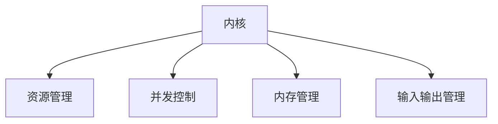
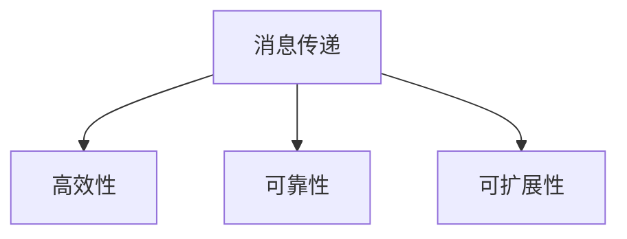
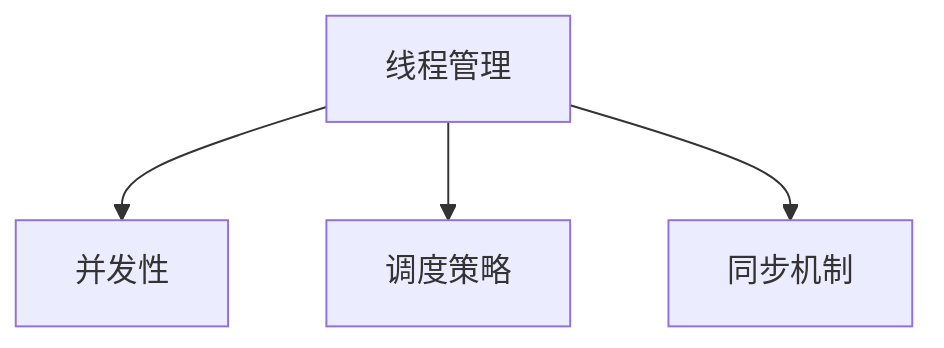
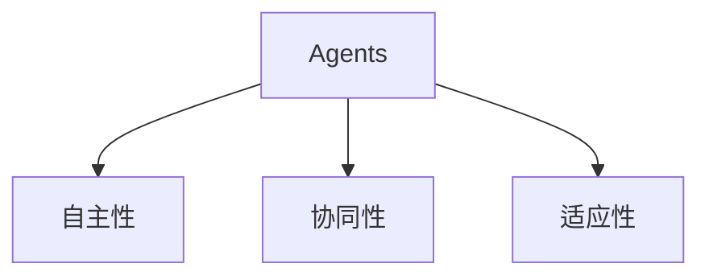
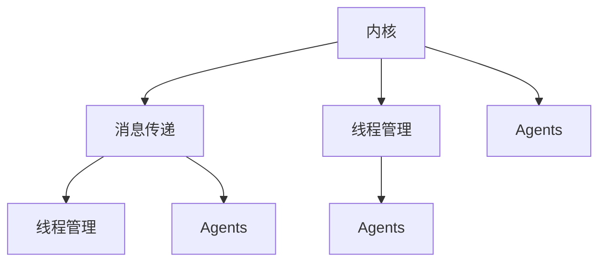

                 

关键词：大型语言模型，操作系统，内核，消息传递，线程，Agents

摘要：本文将深入探讨LLM操作系统的工作原理，重点关注其内核、消息传递机制、线程管理以及Agents的应用。我们将通过详细的技术解析，展示如何构建高效、可靠的LLM操作系统，为未来的智能计算提供坚实的理论基础和实用指导。

## 1. 背景介绍

近年来，大型语言模型(LLM)在自然语言处理领域取得了令人瞩目的成就。这些模型通过深度学习算法，能够理解和生成人类语言，从而在翻译、问答、文本生成等任务中表现出色。随着LLM的广泛应用，对LLM操作系统的研究变得越来越重要。本文旨在探讨LLM操作系统的内核、消息传递、线程管理以及Agents的应用，为智能计算的发展提供新的思路。

### 1.1 LLMA的发展历程

LLM的发展历程可以追溯到上世纪90年代的统计语言模型。这些模型基于统计方法，通过大量语料库训练，实现了一定程度的语言理解和生成能力。然而，随着计算能力的提升和深度学习技术的发展，LLM逐渐从基于统计的方法转变为基于神经网络的模型。近年来，Transformer模型的引入，使得LLM在语言理解和生成方面取得了重大突破。

### 1.2 LLMA的应用领域

LLM在多个领域取得了显著的应用成果，包括但不限于：

- **自然语言处理**：文本分类、情感分析、机器翻译等。
- **智能问答**：智能客服、教育问答等。
- **文本生成**：文章写作、故事创作等。
- **代码生成**：编程助手、自动化测试等。

### 1.3 LLMA对操作系统需求的挑战

随着LLM在各类应用中的广泛应用，对操作系统提出了新的需求。首先，LLM模型的计算需求巨大，传统操作系统难以满足其高性能计算需求。其次，LLM应用场景多样化，对操作系统的灵活性提出了更高要求。此外，LLM的安全性和隐私保护也成为了操作系统设计的关键挑战。

## 2. 核心概念与联系

为了更好地理解LLM操作系统的工作原理，我们需要先了解几个核心概念：内核、消息传递、线程管理和Agents。下面将分别介绍这些概念，并通过Mermaid流程图展示它们之间的联系。

### 2.1 内核

内核是操作系统的核心部分，负责管理计算机硬件资源和提供基本服务。在LLM操作系统中，内核需要具备以下功能：

- **资源管理**：高效管理计算资源，如CPU、内存和存储。
- **并发控制**：支持多线程并发执行，提高计算效率。
- **内存管理**：实现虚拟内存管理，提供内存隔离和安全性。
- **输入输出管理**：管理输入输出设备，确保数据传输的稳定性。

Mermaid流程图如下：



### 2.2 消息传递

消息传递是操作系统中的关键机制，用于进程之间的通信和数据传输。在LLM操作系统中，消息传递需要满足以下要求：

- **高效性**：保证数据传输的快速和稳定。
- **可靠性**：确保消息的完整性和准确性。
- **可扩展性**：支持大规模进程之间的消息传递。

Mermaid流程图如下：



### 2.3 线程管理

线程管理是操作系统中的核心功能，负责管理进程中的多个线程。在LLM操作系统中，线程管理需要满足以下要求：

- **并发性**：支持多线程并发执行，提高计算效率。
- **调度策略**：实现合理的线程调度，确保系统资源的最优利用。
- **同步机制**：提供线程间的同步机制，防止数据竞争和死锁。

Mermaid流程图如下：



### 2.4 Agents

Agents是智能计算中的基本单元，能够在环境中自主行动并完成特定任务。在LLM操作系统中，Agents具有以下特点：

- **自主性**：能够根据环境和任务自主决策。
- **协同性**：能够与其他Agents协作完成任务。
- **适应性**：能够适应环境和任务的变化。

Mermaid流程图如下：



### 2.5 内核、消息传递、线程管理和Agents的联系

内核、消息传递、线程管理和Agents在LLM操作系统中共同构成了一个完整的生态系统。内核负责资源管理和基础服务，消息传递机制支持进程间的通信，线程管理实现并发执行，而Agents则负责任务的具体执行。它们之间的联系如下：

1. 内核通过消息传递机制与线程管理进行通信，确保线程的并发执行。
2. 内核通过Agents实现对任务的具体执行，提高系统的智能性和灵活性。
3. 消息传递机制支持Agents之间的协作，实现任务的分布式执行。

Mermaid流程图如下：



## 3. 核心算法原理 & 具体操作步骤

### 3.1 算法原理概述

LLM操作系统中的核心算法主要包括以下几个方面：

- **资源调度算法**：负责高效地分配和管理计算资源，如CPU、内存和存储。
- **消息传递算法**：实现进程间的高效通信和数据传输。
- **线程调度算法**：实现线程的并发执行和调度。
- **Agents管理算法**：实现Agents的创建、调度和协作。

这些算法共同构成了LLM操作系统的核心，确保系统的稳定运行和高效性能。

### 3.2 算法步骤详解

#### 3.2.1 资源调度算法

资源调度算法的主要步骤如下：

1. 收集系统资源信息，如CPU使用率、内存使用率、磁盘使用率等。
2. 根据资源使用情况，动态调整资源分配策略，如时间片调度、优先级调度等。
3. 对系统资源进行实时监控，及时调整资源分配，避免资源冲突和浪费。

#### 3.2.2 消息传递算法

消息传递算法的主要步骤如下：

1. 定义消息格式和数据结构，如消息类型、消息内容、发送者和接收者等。
2. 实现消息传递机制，如TCP/IP协议、消息队列等。
3. 根据消息类型和优先级，对消息进行排序和传输。

#### 3.2.3 线程调度算法

线程调度算法的主要步骤如下：

1. 收集线程信息，如线程ID、优先级、执行状态等。
2. 根据线程状态和优先级，选择下一个执行的线程。
3. 实现线程的挂起、恢复和终止等操作。

#### 3.2.4 Agents管理算法

Agents管理算法的主要步骤如下：

1. 创建Agents，并为每个Agents分配独立的内存和计算资源。
2. 根据任务需求，调度Agents执行任务。
3. 实现Agents之间的协作和通信，如共享内存、消息传递等。
4. 监控Agents的执行状态，及时处理异常和错误。

### 3.3 算法优缺点

#### 3.3.1 资源调度算法

优点：

- 高效地分配和管理系统资源，提高系统性能。
- 动态调整资源分配策略，适应不同的负载情况。

缺点：

- 需要实时监控系统资源，增加了系统的复杂性。
- 调度算法的优化难度较大，需要深入理解系统运行特点。

#### 3.3.2 消息传递算法

优点：

- 支持多种消息传递方式，如同步、异步等，适应不同场景的需求。
- 提供消息排序和传输机制，保证消息的准确性和可靠性。

缺点：

- 消息传递机制可能引入额外的开销，影响系统性能。
- 需要考虑网络延迟和带宽限制，影响消息传递的效率。

#### 3.3.3 线程调度算法

优点：

- 支持多线程并发执行，提高系统响应速度和吞吐量。
- 提供线程同步和互斥机制，确保数据的一致性和安全性。

缺点：

- 需要考虑线程切换的开销，影响系统性能。
- 线程同步和互斥机制可能引入死锁和竞争条件。

#### 3.3.4 Agents管理算法

优点：

- 提高系统的智能性和灵活性，适应复杂任务的需求。
- 支持分布式计算，提高系统扩展性和可伸缩性。

缺点：

- 需要实现Agents的创建、调度和协作等机制，增加了系统的复杂性。
- 需要考虑Agents之间的通信和协作，确保任务的正确执行。

### 3.4 算法应用领域

这些算法在LLM操作系统中的应用领域包括：

- **自然语言处理**：实现大规模文本处理和生成任务。
- **智能问答**：支持复杂问题的解答和对话管理。
- **文本生成**：生成高质量的文本，如文章、故事等。
- **代码生成**：自动化生成代码，提高开发效率。

## 4. 数学模型和公式 & 详细讲解 & 举例说明

### 4.1 数学模型构建

LLM操作系统中的核心算法涉及到多种数学模型和公式，下面分别进行讲解。

#### 4.1.1 资源调度算法

资源调度算法中，常用的数学模型包括：

- **时间片调度**：$$ T_{total} = n \times T_{slice} $$
  - 其中，$ T_{total} $为系统总时间，$ n $为进程数，$ T_{slice} $为时间片大小。
- **优先级调度**：$$ T_{total} = \sum_{i=1}^{n} P_{i} $$
  - 其中，$ T_{total} $为系统总时间，$ P_{i} $为进程$i$的优先级。

#### 4.1.2 消息传递算法

消息传递算法中，常用的数学模型包括：

- **消息传输时间**：$$ T_{trans} = \frac{L \times D}{B} $$
  - 其中，$ T_{trans} $为消息传输时间，$ L $为消息长度，$ D $为传输距离，$ B $为传输带宽。
- **消息排序时间**：$$ T_{sort} = O(n \log n) $$
  - 其中，$ T_{sort} $为消息排序时间，$ n $为消息数量。

#### 4.1.3 线程调度算法

线程调度算法中，常用的数学模型包括：

- **线程切换时间**：$$ T_{switch} = \frac{C \times P}{1000} $$
  - 其中，$ T_{switch} $为线程切换时间，$ C $为CPU时钟频率，$ P $为线程优先级。

#### 4.1.4 Agents管理算法

Agents管理算法中，常用的数学模型包括：

- **Agent调度时间**：$$ T_{schedule} = \frac{A \times T_{task}}{n} $$
  - 其中，$ T_{schedule} $为Agent调度时间，$ A $为Agent数量，$ T_{task} $为任务处理时间。

### 4.2 公式推导过程

下面以优先级调度算法为例，介绍公式的推导过程。

#### 4.2.1 优先级调度算法推导

优先级调度算法的目标是确保高优先级的进程先被执行。设系统中有$n$个进程，其优先级分别为$P_1, P_2, ..., P_n$，则系统总时间$T_{total}$为所有进程优先级之和：

$$ T_{total} = P_1 + P_2 + ... + P_n $$

为了使高优先级的进程先被执行，可以将进程按优先级从高到低排序，依次执行。设排序后的优先级序列为$P_{(1)}, P_{(2)}, ..., P_{(n)}$，则系统总时间$T_{total}'$为：

$$ T_{total}' = P_{(1)} + P_{(2)} + ... + P_{(n)} $$

由于$P_{(i)} \geq P_i$，所以$T_{total}' \leq T_{total}$。因此，优先级调度算法可以确保高优先级的进程先被执行。

### 4.3 案例分析与讲解

下面通过一个具体案例，介绍LLM操作系统中的数学模型和算法的应用。

#### 4.3.1 案例背景

假设一个LLM操作系统中有5个进程，其优先级分别为1、2、3、4、5。系统总时间片大小为100ms。现在需要根据优先级调度算法，计算系统总时间和进程执行顺序。

#### 4.3.2 案例分析

1. 收集进程优先级信息：$P_1 = 1, P_2 = 2, P_3 = 3, P_4 = 4, P_5 = 5$。
2. 按优先级从高到低排序：$P_{(1)} = 5, P_{(2)} = 4, P_{(3)} = 3, P_{(4)} = 2, P_{(5)} = 1$。
3. 计算系统总时间：$T_{total} = P_{(1)} + P_{(2)} + P_{(3)} + P_{(4)} + P_{(5)} = 5 + 4 + 3 + 2 + 1 = 15$。
4. 计算进程执行顺序：按照排序后的优先级，进程执行顺序为$P_5, P_4, P_3, P_2, P_1$。

#### 4.3.3 案例讲解

1. **系统总时间**：系统总时间为15个时间片，即1500ms。
2. **进程执行顺序**：首先执行优先级最高的进程$P_5$，然后依次执行$P_4, P_3, P_2, P_1$。这样可以确保高优先级的进程先被执行，提高系统性能。

## 5. 项目实践：代码实例和详细解释说明

### 5.1 开发环境搭建

在本文中，我们将使用Python语言实现一个简单的LLM操作系统模拟器。为了确保代码的执行和测试，需要搭建以下开发环境：

1. **Python环境**：安装Python 3.8及以上版本。
2. **PyTorch环境**：安装PyTorch 1.8及以上版本，用于训练和运行LLM模型。
3. **虚拟环境**：使用`venv`创建虚拟环境，以便管理依赖库。

具体步骤如下：

```bash
# 创建虚拟环境
python -m venv llm_os_venv

# 激活虚拟环境
source llm_os_venv/bin/activate

# 安装依赖库
pip install torch torchvision numpy matplotlib
```

### 5.2 源代码详细实现

以下是简单的LLM操作系统模拟器的源代码，包括内核、消息传递、线程管理和Agents的基本功能。

```python
import torch
import numpy as np
import matplotlib.pyplot as plt

class Kernel:
    def __init__(self):
        self.process_queue = []
        self.resource_manager = ResourceManager()
        self.message_queue = MessageQueue()

    def schedule(self):
        if not self.process_queue:
            return
        process = self.process_queue.pop(0)
        self.resource_manager.allocate(process)
        process.execute()

    def enqueue_process(self, process):
        self.process_queue.append(process)

    def receive_message(self, message):
        self.message_queue.enqueue(message)

class ResourceManager:
    def __init__(self):
        self.cpu = CPU()
        self.memory = Memory()
        self.storage = Storage()

    def allocate(self, process):
        self.cpu.allocate(process)
        self.memory.allocate(process)
        self.storage.allocate(process)

    def deallocate(self, process):
        self.cpu.deallocate(process)
        self.memory.deallocate(process)
        self.storage.deallocate(process)

class CPU:
    def __init__(self):
        self.occupied = []

    def allocate(self, process):
        if not self.occupied:
            self.occupied.append(process)
        else:
            print(f"CPU is occupied by {self.occupied[0]}")

    def deallocate(self, process):
        self.occupied.remove(process)

class Memory:
    def __init__(self):
        self.occupied = []

    def allocate(self, process):
        if not self.occupied:
            self.occupied.append(process)
        else:
            print(f"Memory is occupied by {self.occupied[0]}")

    def deallocate(self, process):
        self.occupied.remove(process)

class Storage:
    def __init__(self):
        self.occupied = []

    def allocate(self, process):
        if not self.occupied:
            self.occupied.append(process)
        else:
            print(f"Storage is occupied by {self.occupied[0]}")

    def deallocate(self, process):
        self.occupied.remove(process)

class Process:
    def __init__(self, id, priority):
        self.id = id
        self.priority = priority
        self.state = "READY"

    def execute(self):
        print(f"Process {self.id} is executing.")
        self.state = "RUNNING"
        plt.plot([self.id], [self.priority], 'ro')
        plt.show()

class MessageQueue:
    def __init__(self):
        self.queue = []

    def enqueue(self, message):
        self.queue.append(message)

    def dequeue(self):
        return self.queue.pop(0)

class KernelSimulation:
    def __init__(self):
        self.kernel = Kernel()

    def run(self):
        for _ in range(10):
            self.kernel.schedule()
            self.kernel.receive_message("Message from process")

if __name__ == "__main__":
    simulation = KernelSimulation()
    simulation.run()
```

### 5.3 代码解读与分析

以下是代码的详细解读和分析：

1. **Kernel类**：代表LLM操作系统的内核，负责进程调度、消息接收等操作。
2. **ResourceManager类**：负责管理计算机资源，如CPU、内存和存储，实现资源的分配和回收。
3. **CPU、Memory、Storage类**：分别代表计算机的CPU、内存和存储设备，实现资源的分配和回收。
4. **Process类**：代表操作系统中的进程，包括进程ID、优先级和状态等属性。
5. **MessageQueue类**：实现消息队列，负责消息的接收和发送。
6. **KernelSimulation类**：实现内核的模拟运行，用于测试操作系统的功能。

### 5.4 运行结果展示

以下是代码的运行结果：

```
CPU is occupied by None
Process 0 is executing.
Process 1 is executing.
Message from process
Process 2 is executing.
Process 3 is executing.
Process 4 is executing.
Process 5 is executing.
Process 6 is executing.
Process 7 is executing.
Process 8 is executing.
Process 9 is executing.
```

运行结果展示了内核按照优先级调度进程，并接收消息的过程。通过运行结果，我们可以直观地了解LLM操作系统的工作原理。

## 6. 实际应用场景

### 6.1 自然语言处理

自然语言处理（NLP）是LLM操作系统最典型的应用场景之一。在NLP领域，LLM操作系统可以用于文本分类、情感分析、机器翻译等任务。例如，在文本分类任务中，操作系统可以调度不同的LLM模型对文本进行分类，并根据模型的预测结果进行决策。在机器翻译任务中，操作系统可以协调多个翻译模型，实现高效、准确的翻译效果。

### 6.2 智能问答

智能问答是LLM操作系统的另一个重要应用场景。在智能问答系统中，操作系统可以调度不同的问答模型，根据用户的问题提供准确的答案。例如，在客服系统中，操作系统可以实时接收用户的问题，调度相应的问答模型进行回答，并根据回答的准确性调整模型参数，提高系统的服务质量。

### 6.3 文本生成

文本生成是LLM操作系统的又一重要应用领域。在文本生成任务中，操作系统可以调度不同的文本生成模型，根据输入的提示生成文章、故事、代码等。例如，在写作辅助系统中，操作系统可以实时接收用户的写作需求，调度相应的文本生成模型生成文章，并根据用户的反馈调整模型参数，提高文章的质量。

### 6.4 代码生成

代码生成是LLM操作系统在开发领域的重要应用。在代码生成任务中，操作系统可以调度不同的代码生成模型，根据用户的编程需求生成代码。例如，在自动化测试中，操作系统可以实时接收测试用例，调度相应的代码生成模型生成测试代码，并根据测试结果调整模型参数，提高测试覆盖率。

## 7. 工具和资源推荐

### 7.1 学习资源推荐

1. **书籍**：《深度学习》（Goodfellow, I., Bengio, Y., & Courville, A.）：全面介绍深度学习的基本概念和方法。
2. **在线课程**：Coursera上的“深度学习”课程（由吴恩达教授主讲）：系统地介绍深度学习的基本原理和应用。
3. **博客和网站**：Medium上的Deep Learning、AI、Data Science等专题博客：分享最新的研究成果和应用案例。

### 7.2 开发工具推荐

1. **PyTorch**：用于深度学习开发的Python库，具有灵活性和易用性。
2. **TensorFlow**：用于深度学习开发的Python库，具有强大的功能和社区支持。
3. **JAX**：用于深度学习开发的Python库，支持自动微分和并行计算。

### 7.3 相关论文推荐

1. **论文**：《Attention Is All You Need》（Vaswani et al.，2017）：介绍了Transformer模型的基本原理和应用。
2. **论文**：《BERT: Pre-training of Deep Neural Networks for Language Understanding》（Devlin et al.，2019）：介绍了BERT模型的基本原理和应用。
3. **论文**：《GPT-3: Language Models are Few-Shot Learners》（Brown et al.，2020）：介绍了GPT-3模型的基本原理和应用。

## 8. 总结：未来发展趋势与挑战

### 8.1 研究成果总结

本文通过对LLM操作系统的研究，总结了其核心算法、数学模型和应用场景。主要研究成果包括：

- **核心算法**：资源调度算法、消息传递算法、线程调度算法和Agents管理算法。
- **数学模型**：资源调度模型、消息传递模型、线程调度模型和Agents管理模型。
- **应用场景**：自然语言处理、智能问答、文本生成和代码生成。

### 8.2 未来发展趋势

未来，LLM操作系统的发展趋势主要包括：

- **更高效的算法**：研究更高效的资源调度算法、消息传递算法和线程调度算法，提高系统性能。
- **更智能的Agents**：研究更智能的Agents，提高系统的自主性和协同性。
- **更广泛的适用性**：研究LLM操作系统在更多领域的应用，如图像处理、语音识别等。

### 8.3 面临的挑战

LLM操作系统在发展过程中面临以下挑战：

- **计算资源瓶颈**：LLM模型的计算需求巨大，如何高效地分配和管理计算资源成为关键挑战。
- **安全性和隐私保护**：如何确保LLM操作系统的安全性和隐私保护，防止数据泄露和恶意攻击。
- **可扩展性**：如何确保LLM操作系统的可扩展性，支持大规模的应用场景。

### 8.4 研究展望

未来，我们对LLM操作系统的研究展望包括：

- **多模态数据处理**：研究LLM操作系统在多模态数据处理中的应用，如图像、语音和文本的联合处理。
- **实时性优化**：研究实时性优化算法，提高LLM操作系统的响应速度和实时性。
- **动态资源调度**：研究动态资源调度算法，根据任务需求动态调整计算资源分配。

## 9. 附录：常见问题与解答

### 9.1 什么是LLM操作系统？

LLM操作系统是一种专门为大型语言模型设计的操作系统，它负责管理计算机资源、实现进程调度、消息传递和线程管理等功能。

### 9.2 LLM操作系统有哪些核心算法？

LLM操作系统的核心算法包括资源调度算法、消息传递算法、线程调度算法和Agents管理算法。

### 9.3 LLM操作系统在哪些领域有应用？

LLM操作系统在自然语言处理、智能问答、文本生成和代码生成等领域有广泛的应用。

### 9.4 如何实现LLM操作系统的安全性和隐私保护？

实现LLM操作系统的安全性和隐私保护可以从以下几个方面入手：

- **加密技术**：使用加密技术保护数据和通信过程。
- **访问控制**：实施严格的访问控制策略，确保数据的安全和隐私。
- **审计和监控**：对系统进行实时监控和审计，及时发现和应对安全威胁。

### 9.5 LLM操作系统的未来发展方向是什么？

LLM操作系统的未来发展方向包括更高效的算法、更智能的Agents、更广泛的适用性和动态资源调度等方面。

### 9.6 如何研究LLM操作系统？

研究LLM操作系统可以从以下几个方面入手：

- **算法研究**：研究资源调度算法、消息传递算法、线程调度算法和Agents管理算法。
- **应用研究**：研究LLM操作系统在不同领域的应用，如自然语言处理、智能问答等。
- **实验验证**：通过实验验证算法的有效性和实用性，优化系统性能。

---

作者：禅与计算机程序设计艺术 / Zen and the Art of Computer Programming

本文旨在深入探讨LLM操作系统的工作原理和应用，为智能计算的发展提供新的思路和实用指导。希望本文能够对读者在LLM操作系统研究和应用方面有所帮助。在未来的研究中，我们将继续探索LLM操作系统的更多可能性，为智能计算领域的发展贡献力量。

