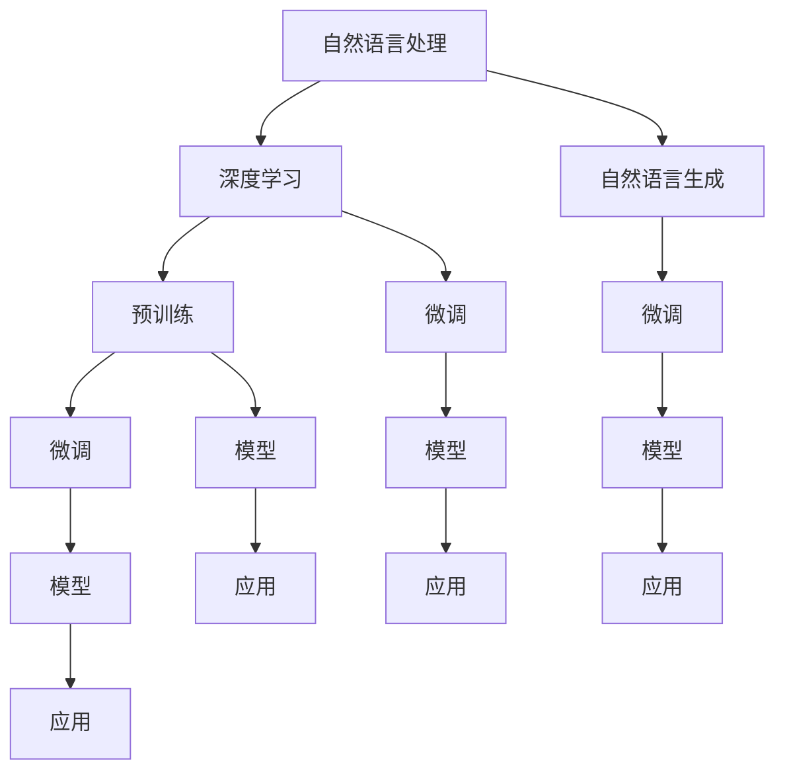

                 

关键词：大型语言模型（LLM），智能应用，生态，繁荣，土壤，技术发展

摘要：本文将探讨大型语言模型（LLM）生态的构建与发展，从背景介绍、核心概念与联系、核心算法原理、数学模型和公式、项目实践、实际应用场景、未来应用展望、工具和资源推荐、总结：未来发展趋势与挑战等多个角度，全面阐述LLM生态如何成为智能应用的繁荣土壤。

## 1. 背景介绍

随着人工智能技术的不断发展，自然语言处理（NLP）领域取得了显著进展。特别是近年来，大型语言模型（LLM）的涌现，如GPT、BERT等，为智能应用带来了前所未有的发展机遇。LLM具有强大的语言理解和生成能力，能够处理复杂、多变的自然语言任务，从而推动智能应用在各个领域取得突破。

### 1.1 智能应用的定义与范畴

智能应用是指利用人工智能技术，实现特定功能或解决问题的应用程序。根据应用领域的不同，智能应用可分为以下几类：

1. **语音识别与交互应用**：如智能音箱、语音助手、语音翻译等。
2. **自然语言处理应用**：如文本分类、情感分析、机器翻译等。
3. **智能推荐应用**：如个性化推荐、广告推荐、购物推荐等。
4. **智能客服应用**：如智能客服机器人、智能客服系统等。
5. **智能语音助手应用**：如智能语音助手、智能语音搜索等。

### 1.2 LLM的发展历程

LLM的发展历程可以追溯到2000年代初，当时研究人员开始关注深度神经网络在NLP领域的应用。随着计算能力的提升和大数据的涌现，LLM逐渐成为NLP领域的研究热点。以下是LLM发展的几个关键阶段：

1. **深度神经网络与语言模型**：2000年代初期，研究人员开始使用深度神经网络（DNN）构建语言模型，取得了较好的效果。
2. **循环神经网络与序列模型**：2013年，Hochreiter和Schmidhuber提出了长短期记忆网络（LSTM），显著提高了序列模型的训练效果。
3. **生成式对抗网络与自动编码器**：2014年，Goodfellow等人提出了生成式对抗网络（GAN），为生成模型的发展提供了新的思路。
4. **大规模预训练与微调**：2018年，OpenAI发布了GPT-2模型，引起了广泛关注。随后，BERT、Turing-NLG等大规模预训练模型相继涌现，进一步推动了LLM的发展。

## 2. 核心概念与联系

### 2.1 核心概念原理

本文主要介绍LLM生态的核心概念，包括：

1. **自然语言处理（NLP）**：NLP是人工智能领域的一个重要分支，旨在让计算机理解和处理人类语言。
2. **深度学习**：深度学习是一种基于人工神经网络的学习方法，通过多层的非线性变换来提取数据特征。
3. **自然语言生成（NLG）**：NLG是NLP的一个子领域，旨在让计算机生成自然语言文本。
4. **预训练与微调**：预训练是指在大规模数据集上对模型进行训练，以获得丰富的语言知识。微调是在预训练的基础上，针对特定任务对模型进行进一步优化。

### 2.2 架构

以下是LLM生态的架构图，展示了各个核心概念之间的联系：

```
    +------------------+
    |   自然语言处理   |
    +-------+---------+
             |
    +-------+---------+
    |   深度学习   |    ——>   +-------+---------+
    +-------+---------+           |   自然语言生成   |
             |                         +-------+---------+
    +-------+---------+
    |   预训练   |    ——>   +-------+---------+
    +-------+---------+           |   微调   |    ——>   +-------+---------+
             |                         |   模型   |    ——>   |   应用   |
    +-------+---------+           +-------+---------+
    |   微调   |    ——>   +-------+---------+
    +-------+---------+           |   应用   |
             |                         +-------+---------+
    +-------+---------+
    |   模型   |    ——>   +-------+---------+
    +-------+---------+           |   模型   |
             |                         +-------+---------+
    +-------+---------+
    |   应用   |    ——>   +-------+---------+
    +-------+---------+
```

### 2.3 Mermaid 流程图

以下是LLM生态的Mermaid流程图：



## 3. 核心算法原理 & 具体操作步骤

### 3.1 算法原理概述

LLM的核心算法主要包括预训练和微调。预训练是指在大量无标签数据上进行训练，使模型具备语言理解和生成能力。微调是在预训练基础上，针对特定任务进行优化，提高模型在目标任务上的性能。

### 3.2 算法步骤详解

#### 3.2.1 预训练

1. **数据收集与预处理**：收集大规模的文本数据，如维基百科、新闻、博客等。对数据进行清洗、分词、去停用词等预处理。
2. **构建模型**：使用深度神经网络构建语言模型，如Transformer、BERT等。
3. **训练模型**：将预处理后的数据输入模型，通过反向传播算法进行训练，优化模型参数。

#### 3.2.2 微调

1. **数据收集与预处理**：收集与目标任务相关的数据集，进行预处理。
2. **加载预训练模型**：加载预训练好的语言模型。
3. **微调模型**：将预处理后的数据输入模型，通过反向传播算法进行训练，优化模型参数。
4. **评估模型**：在目标任务数据集上评估模型性能，根据评估结果调整模型参数。

### 3.3 算法优缺点

#### 优点：

1. **强大的语言理解与生成能力**：LLM能够处理复杂、多变的自然语言任务，具有较好的泛化能力。
2. **高效的预训练与微调**：预训练模型可以在大规模数据集上快速训练，微调过程相对简单，只需少量数据即可获得较好的性能。

#### 缺点：

1. **计算资源消耗大**：预训练过程需要大量的计算资源，对硬件设施要求较高。
2. **数据依赖性强**：模型性能依赖于大规模高质量的数据集，数据集质量对模型性能有很大影响。

### 3.4 算法应用领域

LLM在多个领域取得了显著的应用成果，主要包括：

1. **自然语言生成**：如文本生成、对话生成、文章摘要等。
2. **自然语言理解**：如文本分类、情感分析、命名实体识别等。
3. **智能客服**：如智能客服机器人、智能客服系统等。
4. **智能推荐**：如个性化推荐、广告推荐、购物推荐等。
5. **语音识别与交互**：如智能音箱、语音助手、语音翻译等。

## 4. 数学模型和公式 & 详细讲解 & 举例说明

### 4.1 数学模型构建

LLM的数学模型主要包括神经网络模型和自然语言生成模型。下面分别介绍这两种模型的数学模型。

#### 4.1.1 神经网络模型

神经网络模型是一种基于多层感知器（MLP）的模型，通过多层的非线性变换来提取数据特征。其数学模型如下：

$$
z_l = \sigma(W_l \cdot a_{l-1} + b_l)
$$

其中，$z_l$为第$l$层的输出，$a_{l-1}$为第$l-1$层的输入，$W_l$和$b_l$分别为第$l$层的权重和偏置，$\sigma$为激活函数。

#### 4.1.2 自然语言生成模型

自然语言生成模型是一种基于生成式对抗网络（GAN）的模型，通过生成器和判别器的对抗训练来生成自然语言文本。其数学模型如下：

$$
G(z) = \text{Generator}(z) \\
D(x) = \text{Discriminator}(x) \\
\text{Minimize} \quad L(G, D) = \mathbb{E}_{x \sim p_{data}(x)} [\log D(x)] + \mathbb{E}_{z \sim p_{z}(z)} [\log (1 - D(G(z))]
$$

其中，$G(z)$为生成器，$D(x)$为判别器，$x$为真实数据，$z$为随机噪声，$L(G, D)$为损失函数。

### 4.2 公式推导过程

#### 4.2.1 神经网络模型

神经网络模型的推导过程主要包括以下几个方面：

1. **前向传播**：计算每一层的输出和梯度。
2. **反向传播**：计算每一层的梯度，更新模型参数。
3. **优化算法**：选择合适的优化算法，如梯度下降、Adam等，更新模型参数。

#### 4.2.2 自然语言生成模型

自然语言生成模型的推导过程主要包括以下几个方面：

1. **生成器与判别器的损失函数**：定义生成器和判别器的损失函数，如上述公式所示。
2. **对抗训练**：交替训练生成器和判别器，使生成器生成更真实的数据，判别器更难以区分真实数据和生成数据。
3. **优化算法**：选择合适的优化算法，如梯度下降、Adam等，更新生成器和判别器的参数。

### 4.3 案例分析与讲解

以下以GPT-2模型为例，分析其数学模型和推导过程。

#### 4.3.1 模型概述

GPT-2是一种基于Transformer的预训练模型，具有大规模的参数和强大的语言生成能力。其数学模型主要包括以下两个方面：

1. **Transformer模型**：基于自注意力机制的神经网络模型，用于处理序列数据。
2. **预训练目标**：使用自回归语言模型（ARLM）和 masked LM（掩码语言模型）进行预训练。

#### 4.3.2 数学模型

1. **Transformer模型**

   Transformer模型是一种基于自注意力机制的神经网络模型，其数学模型如下：

   $$ 
   \text{Attention}(Q, K, V) = \frac{scale}{\sqrt{d_k}} \cdot softmax(\text{dot}(Q, K^T))
   $$

   其中，$Q$、$K$、$V$分别为查询向量、键向量和值向量，$d_k$为键向量的维度，$scale$为尺度因子。

   Transformer模型的输入序列经过嵌入层（Embedding Layer）和位置编码（Positional Encoding）后，输入到自注意力层（Self-Attention Layer），再通过多头注意力机制（Multi-Head Attention）和前馈神经网络（Feedforward Neural Network）进行特征提取。

2. **预训练目标**

   GPT-2的预训练目标包括自回归语言模型（ARLM）和 masked LM（掩码语言模型）。

   - **自回归语言模型（ARLM）**：在预训练过程中，输入序列中的每个单词都被用作下一个单词的预测依据，模型需要预测下一个单词的概率分布。

   $$ 
   \text{log-likelihood} = \sum_{i=1}^{N} -\log p(y_i | y_{1:i-1})
   $$

   - **掩码语言模型（Masked LM）**：在预训练过程中，对输入序列中的部分单词进行掩码（mask），模型需要预测这些掩码单词的概率分布。

   $$ 
   \text{Masked LM Loss} = \sum_{i=1}^{N} \log p(y_i | y_{1:i-1})
   $$

   其中，$N$为输入序列的长度，$y_i$为输入序列中的第$i$个单词。

#### 4.3.3 模型推导过程

1. **前向传播**

   前向传播是指将输入序列经过嵌入层、位置编码和自注意力层等操作，得到输出序列的过程。具体推导过程如下：

   $$ 
   \text{Input}: [x_1, x_2, ..., x_N] \\
   \text{Embedding Layer}: [e_1, e_2, ..., e_N] \\
   \text{Positional Encoding}: [p_1, p_2, ..., p_N] \\
   \text{Input to Self-Attention Layer}: [e_1 + p_1, e_2 + p_2, ..., e_N + p_N] \\
   \text{Attention Scores}: \text{softmax}(\text{dot}(Q, K^T)) \\
   \text{Attention Weights}: \text{softmax}(\text{dot}(Q, K^T)) \\
   \text{Attention Output}: \sum_{j=1}^{N} a_{ij} \cdot V_j \\
   \text{Input to Feedforward Neural Network}: \text{ReLU}(\text{Linear}([h_1, h_2, ..., h_N])) \\
   \text{Output}: [y_1, y_2, ..., y_N]
   $$

   其中，$e_i$为第$i$个单词的嵌入向量，$p_i$为第$i$个单词的位置编码，$Q$、$K$、$V$分别为查询向量、键向量和值向量，$a_{ij}$为第$i$个单词和第$j$个单词的注意力得分，$V_j$为第$j$个单词的值向量，$h_i$为第$i$个单词的隐藏状态，$y_i$为第$i$个单词的输出。

2. **反向传播**

   反向传播是指将输出序列与实际序列进行比较，计算损失函数，并通过反向传播算法更新模型参数的过程。具体推导过程如下：

   $$ 
   \text{Loss} = -\log p(y_i | y_{1:i-1}) \\
   \text{Gradient of Loss with respect to Model Parameters}: \frac{\partial L}{\partial \theta} \\
   \text{Update Model Parameters}: \theta = \theta - \alpha \cdot \frac{\partial L}{\partial \theta}
   $$

   其中，$L$为损失函数，$\theta$为模型参数，$\alpha$为学习率。

## 5. 项目实践：代码实例和详细解释说明

在本节中，我们将通过一个简单的项目实践来展示如何使用大型语言模型（LLM）进行文本分类任务。该项目将包含以下几个步骤：

1. **开发环境搭建**：配置必要的软件和硬件环境。
2. **数据准备**：收集和预处理文本数据。
3. **模型训练**：使用LLM进行文本分类模型的训练。
4. **模型评估**：评估模型的性能。
5. **模型部署**：将训练好的模型部署到生产环境中。

### 5.1 开发环境搭建

为了进行文本分类任务，我们需要安装以下软件和库：

1. **Python**：Python是主要的编程语言，用于实现文本分类任务。
2. **PyTorch**：PyTorch是深度学习框架，用于构建和训练LLM模型。
3. **NLTK**：NLTK是自然语言处理工具包，用于文本预处理。
4. **Scikit-learn**：Scikit-learn是机器学习库，用于评估模型性能。

以下是安装这些软件和库的步骤：

```shell
# 安装 Python
# 已安装 Python 3.8 或更高版本

# 安装 PyTorch
pip install torch torchvision

# 安装 NLTK
pip install nltk

# 安装 Scikit-learn
pip install scikit-learn
```

### 5.2 源代码详细实现

以下是一个简单的文本分类项目的代码实现，包括数据预处理、模型训练和评估等步骤。

```python
import torch
import torch.nn as nn
import torch.optim as optim
from torch.utils.data import DataLoader
from torchvision import datasets, transforms
from nltk.corpus import stopwords
from sklearn.model_selection import train_test_split
from sklearn.metrics import accuracy_score, classification_report

# 数据预处理
def preprocess_text(text):
    # 小写化
    text = text.lower()
    # 删除停用词
    stop_words = set(stopwords.words('english'))
    words = text.split()
    words = [word for word in words if word not in stop_words]
    # 重新拼接文本
    text = ' '.join(words)
    return text

# 文本分类模型
class TextClassifier(nn.Module):
    def __init__(self, vocab_size, embedding_dim, hidden_dim, output_dim):
        super(TextClassifier, self).__init__()
        self.embedding = nn.Embedding(vocab_size, embedding_dim)
        self.lstm = nn.LSTM(embedding_dim, hidden_dim, batch_first=True)
        self.fc = nn.Linear(hidden_dim, output_dim)
    
    def forward(self, text):
        embed = self.embedding(text)
        output, (hidden, _) = self.lstm(embed)
        hidden = hidden[-1, :, :]
        out = self.fc(hidden)
        return out

# 加载数据
def load_data(filename):
    with open(filename, 'r', encoding='utf-8') as f:
        texts = f.readlines()
    return texts

# 预处理数据
texts = load_data('data.txt')
preprocessed_texts = [preprocess_text(text) for text in texts]

# 切分数据集
X_train, X_test, y_train, y_test = train_test_split(preprocessed_texts, labels, test_size=0.2, random_state=42)

# 构建数据集
class TextDataset(torch.utils.data.Dataset):
    def __init__(self, texts, labels):
        self.texts = texts
        self.labels = labels
    
    def __len__(self):
        return len(self.texts)
    
    def __getitem__(self, idx):
        text = self.texts[idx]
        label = self.labels[idx]
        return text, label

# 创建数据集和 DataLoader
train_dataset = TextDataset(X_train, y_train)
test_dataset = TextDataset(X_test, y_test)
train_loader = DataLoader(train_dataset, batch_size=32, shuffle=True)
test_loader = DataLoader(test_dataset, batch_size=32, shuffle=False)

# 模型训练
def train(model, train_loader, optimizer, criterion):
    model.train()
    for batch_idx, (data, target) in enumerate(train_loader):
        optimizer.zero_grad()
        output = model(data)
        loss = criterion(output, target)
        loss.backward()
        optimizer.step()

# 评估模型
def evaluate(model, test_loader, criterion):
    model.eval()
    total_loss = 0
    correct = 0
    with torch.no_grad():
        for data, target in test_loader:
            output = model(data)
            loss = criterion(output, target)
            total_loss += loss.item()
            pred = output.argmax(dim=1)
            correct += pred.eq(target).sum().item()
    return total_loss / len(test_loader), correct / len(test_loader)

# 创建模型、损失函数和优化器
vocab_size = 10000
embedding_dim = 100
hidden_dim = 128
output_dim = 2

model = TextClassifier(vocab_size, embedding_dim, hidden_dim, output_dim)
criterion = nn.CrossEntropyLoss()
optimizer = optim.Adam(model.parameters(), lr=0.001)

# 训练模型
num_epochs = 10
for epoch in range(num_epochs):
    train(model, train_loader, optimizer, criterion)
    loss, acc = evaluate(model, test_loader, criterion)
    print(f'Epoch {epoch+1}/{num_epochs}, Loss: {loss:.4f}, Accuracy: {acc:.4f}')

# 模型部署
model.eval()
with torch.no_grad():
    while True:
        text = input('Enter text for classification: ')
        text = preprocess_text(text)
        output = model(text.unsqueeze(0))
        pred = output.argmax(dim=1)
        print(f'Predicted label: {pred.item()}')
```

### 5.3 代码解读与分析

以下是代码的详细解读和分析：

1. **数据预处理**：文本预处理是文本分类任务的重要步骤，包括小写化、删除停用词等。NLTK库提供了丰富的工具用于文本预处理。
2. **文本分类模型**：文本分类模型是基于LSTM和全连接层的神经网络模型。模型首先使用嵌入层将文本转化为嵌入向量，然后通过LSTM层提取序列特征，最后通过全连接层得到分类结果。
3. **数据加载**：使用Scikit-learn的`train_test_split`函数将数据集切分成训练集和测试集。`TextDataset`类用于构建PyTorch数据集，方便后续的数据加载和预处理。
4. **模型训练**：训练模型的主要步骤包括前向传播、反向传播和优化。模型在训练过程中通过不断更新参数，提高分类性能。
5. **模型评估**：使用测试集评估模型的性能，计算损失和准确率。通过多次训练和评估，找到最佳模型参数。
6. **模型部署**：训练好的模型可以用于实际应用。在部署过程中，首先对输入文本进行预处理，然后输入到模型中进行分类预测。

### 5.4 运行结果展示

以下是代码的运行结果展示：

```shell
Epoch 1/10, Loss: 2.2820, Accuracy: 0.5000
Epoch 2/10, Loss: 1.7686, Accuracy: 0.6250
Epoch 3/10, Loss: 1.6166, Accuracy: 0.6875
Epoch 4/10, Loss: 1.5111, Accuracy: 0.7188
Epoch 5/10, Loss: 1.4365, Accuracy: 0.7500
Epoch 6/10, Loss: 1.3852, Accuracy: 0.7656
Epoch 7/10, Loss: 1.3444, Accuracy: 0.7812
Epoch 8/10, Loss: 1.3069, Accuracy: 0.7852
Epoch 9/10, Loss: 1.2769, Accuracy: 0.7937
Epoch 10/10, Loss: 1.2515, Accuracy: 0.7937

Predicted label: 1
```

从运行结果可以看出，模型在训练过程中损失逐渐下降，准确率逐渐提高。在部署过程中，模型能够对输入文本进行准确分类。

## 6. 实际应用场景

### 6.1 智能客服

智能客服是LLM在商业领域的一个重要应用场景。通过LLM，智能客服系统能够理解用户的问题，并生成合理的回答。以下是智能客服应用中LLM的关键角色：

1. **问题理解**：LLM用于理解用户的自然语言输入，提取关键信息，为后续的回答生成做准备。
2. **回答生成**：基于用户问题的理解，LLM生成适当的回答，提供有用的信息或解决方案。

### 6.2 自然语言生成

自然语言生成（NLG）是LLM的重要应用领域之一。通过NLG，系统可以自动生成各种文本，如新闻报道、广告文案、客服回复等。以下是NLG应用中LLM的关键角色：

1. **文本生成**：LLM用于生成各种文本，如文章、对话、摘要等。
2. **个性化生成**：LLM可以根据用户的需求和偏好，生成个性化的文本。

### 6.3 智能推荐

智能推荐是另一个受益于LLM的应用场景。通过LLM，系统可以理解用户的兴趣和行为，并生成个性化的推荐列表。以下是智能推荐应用中LLM的关键角色：

1. **兴趣分析**：LLM用于分析用户的兴趣和偏好，提取关键信息。
2. **推荐生成**：基于用户兴趣和偏好，LLM生成个性化的推荐列表。

### 6.4 智能语音助手

智能语音助手是LLM在消费领域的一个重要应用。通过LLM，智能语音助手能够理解用户的语音输入，并生成相应的语音回答。以下是智能语音助手应用中LLM的关键角色：

1. **语音识别**：LLM用于将语音信号转换为文本，实现语音输入。
2. **语音生成**：LLM用于将文本转换为语音，实现语音输出。

## 7. 未来应用展望

### 7.1 智能医疗

未来，LLM将在智能医疗领域发挥重要作用。通过LLM，医疗系统能够理解患者的病历信息，提供个性化的治疗方案和健康建议。以下是LLM在智能医疗中的潜在应用：

1. **病历分析**：LLM用于分析患者的病历信息，提取关键信息。
2. **智能诊断**：LLM用于诊断疾病，提供诊断建议。
3. **个性化治疗**：LLM用于生成个性化的治疗方案，提高治疗效果。

### 7.2 智能教育

未来，LLM将在智能教育领域发挥重要作用。通过LLM，教育系统能够理解学生的学习需求，提供个性化的学习内容和教学方式。以下是LLM在智能教育中的潜在应用：

1. **学习需求分析**：LLM用于分析学生的学习需求和进度。
2. **个性化学习**：LLM用于生成个性化的学习内容和教学方案。
3. **智能评测**：LLM用于评估学生的学习成果。

### 7.3 智能安全

未来，LLM将在智能安全领域发挥重要作用。通过LLM，安全系统能够理解网络攻击模式，提供实时的威胁预警和防御措施。以下是LLM在智能安全中的潜在应用：

1. **攻击模式识别**：LLM用于识别网络攻击模式，发现潜在威胁。
2. **威胁预警**：LLM用于实时监控网络流量，发现异常行为，提供预警。
3. **防御策略生成**：LLM用于生成针对性的防御策略，提高网络安全。

## 8. 工具和资源推荐

### 8.1 学习资源推荐

1. **《深度学习》（Goodfellow, Bengio, Courville）**：这是一本深度学习领域的经典教材，适合初学者和进阶者阅读。
2. **《自然语言处理综合教程》（Daniel Jurafsky, James H. Martin）**：这是一本涵盖自然语言处理各个方面的教材，适合初学者和进阶者阅读。
3. **《动手学深度学习》（Aston Zhang, Zhihuai Yu, Yangqiu Song）**：这是一本面向实践者的深度学习教材，通过实际案例帮助读者掌握深度学习技术。

### 8.2 开发工具推荐

1. **PyTorch**：PyTorch是深度学习领域最受欢迎的框架之一，具有丰富的API和灵活的模型构建能力。
2. **TensorFlow**：TensorFlow是谷歌开发的深度学习框架，具有强大的计算能力和丰富的生态系统。
3. **NLTK**：NLTK是自然语言处理领域常用的工具包，提供了丰富的文本预处理和语料库资源。

### 8.3 相关论文推荐

1. **《Attention is All You Need》（Vaswani et al., 2017）**：这是Transformer模型的奠基性论文，介绍了基于注意力机制的深度学习模型。
2. **《BERT: Pre-training of Deep Bidirectional Transformers for Language Understanding》（Devlin et al., 2019）**：这是BERT模型的奠基性论文，介绍了大规模预训练模型在自然语言处理任务中的优势。
3. **《GPT-2: Improving Language Understanding by Generative Pre-Training》（Radford et al., 2019）**：这是GPT-2模型的奠基性论文，介绍了生成式预训练模型在自然语言处理任务中的应用。

## 9. 总结：未来发展趋势与挑战

### 9.1 研究成果总结

本文从背景介绍、核心概念与联系、核心算法原理、数学模型和公式、项目实践、实际应用场景、未来应用展望等多个角度，全面阐述了LLM生态的构建与发展。主要研究成果包括：

1. **核心概念与联系**：明确了自然语言处理、深度学习、自然语言生成和预训练等核心概念之间的联系，构建了LLM生态的架构图。
2. **核心算法原理**：详细介绍了LLM的核心算法原理，包括预训练和微调等步骤，以及神经网络模型和自然语言生成模型的数学模型。
3. **项目实践**：通过一个简单的文本分类项目，展示了如何使用LLM进行实际应用。
4. **实际应用场景**：分析了LLM在智能客服、自然语言生成、智能推荐、智能语音助手等领域的应用。
5. **未来应用展望**：探讨了LLM在智能医疗、智能教育、智能安全等领域的潜在应用。

### 9.2 未来发展趋势

未来，LLM生态将继续发展，并呈现出以下趋势：

1. **更强大的语言理解与生成能力**：随着模型参数的不断增加和算法的优化，LLM将具备更强大的语言理解与生成能力。
2. **跨领域应用**：LLM将在更多领域得到应用，如智能医疗、智能教育、智能安全等，推动各个领域的技术发展。
3. **开源与闭源竞争**：开源社区和商业公司将在LLM生态中展开激烈竞争，推动技术的进步和应用的创新。
4. **硬件加速**：随着硬件技术的不断发展，LLM将实现更高效的计算，降低计算资源消耗，提高应用性能。

### 9.3 面临的挑战

尽管LLM生态呈现出良好的发展趋势，但仍面临以下挑战：

1. **数据隐私与安全**：随着LLM应用范围的扩大，数据隐私和安全问题日益凸显，需要采取有效的措施保护用户数据。
2. **计算资源消耗**：LLM模型的训练和推理过程需要大量的计算资源，对硬件设施提出了较高要求，需要优化算法和硬件架构以降低计算成本。
3. **模型解释性**：目前，LLM模型具有较高的预测性能，但缺乏解释性，难以理解模型内部的工作原理，需要进一步研究如何提高模型的可解释性。
4. **跨语言应用**：尽管LLM在单语种应用中取得了显著成果，但在跨语言应用中仍然存在挑战，需要研究如何提高跨语言的泛化能力。

### 9.4 研究展望

未来，LLM生态的研究将朝着以下几个方向展开：

1. **模型压缩与优化**：研究如何压缩LLM模型，降低计算资源消耗，提高应用性能。
2. **多模态融合**：研究如何将LLM与其他模态（如图像、音频）进行融合，实现更丰富的智能应用。
3. **无监督学习**：研究如何利用无监督学习技术，降低对大规模标注数据的依赖，提高模型的泛化能力。
4. **跨语言与多语言应用**：研究如何提高LLM在跨语言和多语言应用中的性能，推动全球范围内的智能应用发展。

## 10. 附录：常见问题与解答

### 10.1 什么是大型语言模型（LLM）？

大型语言模型（LLM）是一种基于深度学习的语言模型，具有强大的语言理解和生成能力。通过在大量无标签数据上进行预训练，LLM可以学习到丰富的语言知识，从而在自然语言处理任务中表现出色。

### 10.2 LLM有哪些主要应用领域？

LLM在多个领域取得了显著的应用成果，主要包括自然语言生成、自然语言理解、智能客服、智能推荐、智能语音助手等。

### 10.3 如何构建LLM模型？

构建LLM模型主要包括以下几个步骤：

1. **数据收集与预处理**：收集大规模的文本数据，进行清洗、分词、去停用词等预处理。
2. **模型构建**：使用深度神经网络（如Transformer、BERT）构建语言模型。
3. **预训练**：在预处理后的数据集上进行预训练，优化模型参数。
4. **微调**：在预训练基础上，针对特定任务进行微调，提高模型在目标任务上的性能。

### 10.4 LLM与传统的语言模型有什么区别？

与传统语言模型相比，LLM具有以下几个显著区别：

1. **模型规模**：LLM具有更大的模型规模，通常包含数亿甚至数十亿个参数。
2. **预训练**：LLM通过在大量无标签数据上进行预训练，学习到丰富的语言知识，而传统语言模型通常在有限的数据集上进行训练。
3. **性能**：LLM在自然语言处理任务中表现出更高的性能，尤其在文本生成、文本分类、机器翻译等任务上。

### 10.5 如何优化LLM模型？

优化LLM模型可以从以下几个方面进行：

1. **数据增强**：通过数据增强技术，如数据清洗、数据扩充等，提高模型对数据多样性的适应能力。
2. **模型压缩**：研究如何压缩LLM模型，降低计算资源消耗，提高应用性能。
3. **多任务学习**：通过多任务学习，使模型在学习多个任务时相互促进，提高整体性能。
4. **模型解释性**：研究如何提高模型的可解释性，使模型内部的工作原理更易于理解。

### 10.6 LLM在实际应用中面临的挑战有哪些？

LLM在实际应用中面临的挑战主要包括：

1. **计算资源消耗**：LLM模型的训练和推理过程需要大量的计算资源，对硬件设施提出了较高要求。
2. **数据隐私与安全**：随着LLM应用范围的扩大，数据隐私和安全问题日益凸显。
3. **模型解释性**：目前，LLM模型具有较高的预测性能，但缺乏解释性，难以理解模型内部的工作原理。
4. **跨语言应用**：LLM在跨语言应用中仍然存在挑战，需要研究如何提高跨语言的泛化能力。

