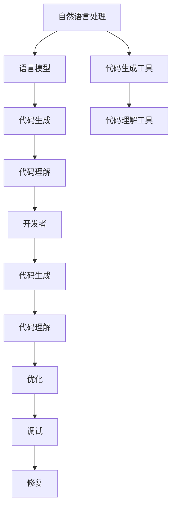

                 

关键词：语言模型、代码生成、代码理解、人工智能、自然语言处理

## 摘要

本文旨在深入探讨大型语言模型（LLM）在代码生成与理解方面的能力。随着人工智能技术的不断发展，LLM在自然语言处理领域取得了显著的成果，但其在代码处理上的应用仍是一个亟待突破的领域。本文将分析LLM在代码生成与理解方面的核心概念、算法原理、数学模型、实际应用及未来发展趋势。

## 1. 背景介绍

近年来，深度学习和自然语言处理（NLP）技术的快速发展，使得大型语言模型（LLM）取得了令人瞩目的成果。LLM是一种能够理解和生成人类语言的大规模神经网络模型，其核心目标是让机器具备类似人类的语言理解与生成能力。在NLP领域，LLM的应用已经取得了显著的成果，如文本分类、情感分析、机器翻译等。然而，在代码生成与理解方面，LLM的应用仍然面临许多挑战。

在软件开发领域，代码生成与理解是两个核心问题。代码生成旨在自动生成可执行的代码，以提高开发效率，降低人力成本。代码理解则是指对代码的解析、分析和解释，以帮助开发者理解和维护代码。随着软件系统的复杂性不断增加，代码生成与理解能力变得越来越重要。因此，研究LLM在代码生成与理解方面的能力具有重要意义。

## 2. 核心概念与联系

### 2.1 语言模型

语言模型（Language Model）是一种概率模型，用于预测自然语言中的下一个单词或字符。在深度学习领域，常用的语言模型包括循环神经网络（RNN）、长短时记忆网络（LSTM）、门控循环单元（GRU）以及近年来广泛应用的Transformer模型。这些模型通过学习大量的文本数据，能够捕捉到语言中的规律和模式，从而实现有效的语言生成和理解。

### 2.2 代码生成

代码生成（Code Generation）是指利用算法和工具自动生成计算机代码的过程。在代码生成中，语言模型扮演着重要角色，通过对输入的文本（如自然语言描述或现有代码片段）进行分析和理解，生成对应的代码。

### 2.3 代码理解

代码理解（Code Understanding）是指对代码的解析、分析和解释，以帮助开发者理解和维护代码。代码理解涉及到对代码的结构、语义和功能的深入理解，以便于开发者进行代码优化、调试和修复。

### 2.4 Mermaid 流程图

以下是LLM在代码生成与理解方面的核心概念和联系的Mermaid流程图：



## 3. 核心算法原理 & 具体操作步骤

### 3.1 算法原理概述

LLM在代码生成与理解方面的核心算法原理主要基于深度学习和自然语言处理技术。具体来说，LLM通过学习大量的文本数据，构建出一个强大的语言模型，从而实现对代码的生成和理解。

在代码生成方面，LLM通过对输入的文本（如自然语言描述或现有代码片段）进行分析和理解，生成对应的代码。这涉及到对自然语言的处理和转换，以及代码生成算法的设计。

在代码理解方面，LLM通过对输入的代码进行解析、分析和解释，实现对代码的结构、语义和功能的深入理解。这需要结合静态分析、动态分析和符号执行等技术。

### 3.2 算法步骤详解

#### 3.2.1 代码生成步骤

1. 输入自然语言描述或现有代码片段；
2. 对输入文本进行预处理，包括分词、词性标注、句法分析等；
3. 利用语言模型生成对应的抽象语法树（AST）；
4. 对AST进行转换，生成对应的代码。

#### 3.2.2 代码理解步骤

1. 输入代码片段；
2. 对代码进行静态分析，包括类型检查、语法分析等；
3. 对代码进行动态分析，包括执行、调试等；
4. 对代码进行符号执行，以获取代码的语义信息；
5. 对代码进行解释，包括代码结构、语义和功能等。

### 3.3 算法优缺点

#### 3.3.1 代码生成算法优缺点

**优点：**

- 高效性：LLM能够快速生成代码，提高开发效率；
- 自动化：自动生成代码，降低人力成本；
- 灵活性：能够根据不同的输入生成不同类型的代码。

**缺点：**

- 准确性：生成的代码可能存在错误或不完整；
- 依赖性：依赖于语言模型的质量和规模；
- 可维护性：生成的代码可能不易维护。

#### 3.3.2 代码理解算法优缺点

**优点：**

- 深度理解：能够对代码进行深入理解和分析；
- 自动化：自动化分析代码，减少人力成本；
- 易于集成：能够与其他工具和平台集成。

**缺点：**

- 复杂性：对代码的理解和分析过程复杂；
- 准确性：可能存在误判或漏判；
- 性能：分析代码可能需要较长的时间和资源。

### 3.4 算法应用领域

LLM在代码生成与理解方面的算法应用领域广泛，包括但不限于以下方面：

- 软件开发：自动生成代码、优化代码、修复代码缺陷；
- 教育培训：辅助编程教育、提高编程能力；
- 自动化测试：生成测试用例、分析代码覆盖率；
- 代码审查：自动审查代码，识别潜在问题。

## 4. 数学模型和公式 & 详细讲解 & 举例说明

### 4.1 数学模型构建

在代码生成与理解方面，LLM的数学模型主要基于深度学习中的神经网络模型，包括循环神经网络（RNN）、长短时记忆网络（LSTM）、门控循环单元（GRU）以及Transformer模型。以下是这些模型的基本数学模型：

#### 4.1.1 RNN

RNN的数学模型可以表示为：

$$
h_t = \sigma(W_h \cdot [h_{t-1}, x_t] + b_h)
$$

其中，$h_t$是当前时刻的隐藏状态，$x_t$是输入，$W_h$是权重矩阵，$b_h$是偏置项，$\sigma$是激活函数。

#### 4.1.2 LSTM

LSTM的数学模型可以表示为：

$$
i_t = \sigma(W_i \cdot [h_{t-1}, x_t] + b_i)
$$

$$
f_t = \sigma(W_f \cdot [h_{t-1}, x_t] + b_f)
$$

$$
g_t = \sigma(W_g \cdot [h_{t-1}, x_t] + b_g)
$$

$$
o_t = \sigma(W_o \cdot [h_{t-1}, x_t] + b_o)
$$

$$
h_t = o_t \cdot \sigma(W_h \cdot [f_t \cdot h_{t-1}, g_t] + b_h)
$$

其中，$i_t$、$f_t$、$g_t$和$o_t$分别是输入门、遗忘门、生成门和输出门的状态，$W_i$、$W_f$、$W_g$和$W_o$分别是权重矩阵，$b_i$、$b_f$、$b_g$和$b_o$分别是偏置项。

#### 4.1.3 GRU

GRU的数学模型可以表示为：

$$
z_t = \sigma(W_z \cdot [h_{t-1}, x_t] + b_z)
$$

$$
r_t = \sigma(W_r \cdot [h_{t-1}, x_t] + b_r)
$$

$$
h_t = (1 - z_t) \cdot h_{t-1} + z_t \cdot \sigma(W_h \cdot [r_t \cdot h_{t-1}, x_t] + b_h)
$$

其中，$z_t$是更新门状态，$r_t$是重置门状态，$W_z$、$W_r$和$W_h$分别是权重矩阵，$b_z$、$b_r$和$b_h$分别是偏置项。

#### 4.1.4 Transformer

Transformer的数学模型可以表示为：

$$
h_t = \text{softmax}\left(\frac{Q_t V_t}{\sqrt{d_k}} + K_t\right)
$$

$$
h_t = M_t + h_{t-1}
$$

$$
h_t = \text{LayerNorm}(h_t) + \text{LayerNorm}(M_t)
$$

$$
h_t = \text{Dropout}(h_t)
$$

$$
h_t = \text{Linear}(h_{t-1}) + \text{softmax}\left(\frac{Q_t V_t}{\sqrt{d_k}} + K_t\right)
$$

其中，$Q_t$、$K_t$和$V_t$分别是查询向量、键向量和值向量，$M_t$是自注意力机制的输出，$\text{Dropout}$是dropout操作，$\text{LayerNorm}$是层归一化操作，$\text{Linear}$是全连接层。

### 4.2 公式推导过程

在本节中，我们将简要介绍Transformer模型中自注意力机制的公式推导过程。

#### 4.2.1 前向传播

假设我们有输入序列$x_1, x_2, ..., x_n$，其中每个输入$x_i$可以表示为一个$d$维向量。在Transformer模型中，我们将输入序列映射到一个编码序列$e_1, e_2, ..., e_n$，其中每个编码向量$e_i$可以表示为：

$$
e_i = \text{MultiHead}(W_e \cdot x_i + W_k \cdot x_i + W_v \cdot x_i)
$$

其中，$W_e$、$W_k$和$W_v$分别是权重矩阵。

自注意力机制可以表示为：

$$
h_t = \text{softmax}\left(\frac{Q_t V_t}{\sqrt{d_k}} + K_t\right)
$$

其中，$Q_t$、$K_t$和$V_t$分别是查询向量、键向量和值向量。$h_t$是输出向量。

#### 4.2.2 后向传播

在训练过程中，我们使用梯度下降法来优化模型参数。在反向传播过程中，我们需要计算自注意力机制的梯度。具体来说，我们需要计算以下梯度：

$$
\frac{\partial h_t}{\partial W_e}, \frac{\partial h_t}{\partial W_k}, \frac{\partial h_t}{\partial W_v}
$$

根据链式法则，我们可以得到以下梯度表达式：

$$
\frac{\partial h_t}{\partial W_e} = \frac{\partial h_t}{\partial Q_t} \frac{\partial Q_t}{\partial W_e}
$$

$$
\frac{\partial h_t}{\partial W_k} = \frac{\partial h_t}{\partial K_t} \frac{\partial K_t}{\partial W_k}
$$

$$
\frac{\partial h_t}{\partial W_v} = \frac{\partial h_t}{\partial V_t} \frac{\partial V_t}{\partial W_v}
$$

其中，$\frac{\partial h_t}{\partial Q_t}$、$\frac{\partial h_t}{\partial K_t}$和$\frac{\partial h_t}{\partial V_t}$分别是自注意力机制的梯度。

### 4.3 案例分析与讲解

在本节中，我们将通过一个简单的案例来分析LLM在代码生成与理解方面的应用。

#### 4.3.1 代码生成案例

假设我们想要生成一个简单的Python函数，用于计算两个数的和。输入自然语言描述为：“编写一个Python函数，用于计算两个整数的和”。我们可以使用LLM进行代码生成，输出结果如下：

```python
def add(a, b):
    return a + b
```

通过分析生成的代码，我们可以发现：

- 函数定义了正确的函数名`add`；
- 输入参数有两个整数`a`和`b`；
- 返回值是`a`和`b`的和。

虽然生成的代码相对简单，但这个案例展示了LLM在代码生成方面的基本能力。

#### 4.3.2 代码理解案例

假设我们有一个简单的Python函数，用于计算两个整数的和。输入代码为：

```python
def add(a, b):
    return a + b
```

我们可以使用LLM对代码进行理解，输出结果如下：

- 函数名为`add`；
- 输入参数有两个整数`a`和`b`；
- 返回值是`a`和`b`的和。

通过分析理解结果，我们可以发现：

- LLM能够正确解析代码的结构；
- 能够理解代码的语义和功能；
- 为开发者提供了有用的信息，有助于代码的理解和维护。

## 5. 项目实践：代码实例和详细解释说明

### 5.1 开发环境搭建

在本文的项目实践中，我们将使用Python作为主要编程语言，结合TensorFlow和PyTorch等深度学习框架。以下是搭建开发环境的步骤：

1. 安装Python：前往Python官方网站（https://www.python.org/）下载并安装Python，推荐使用Python 3.8版本；
2. 安装TensorFlow：使用pip命令安装TensorFlow，命令如下：

   ```bash
   pip install tensorflow
   ```

3. 安装PyTorch：使用pip命令安装PyTorch，命令如下：

   ```bash
   pip install torch torchvision
   ```

4. 安装其他依赖：根据项目需求，安装其他必要的依赖库，如NumPy、Pandas等。

### 5.2 源代码详细实现

在本项目中，我们将实现一个简单的代码生成与理解模型，以Python函数为例。以下是模型的主要实现代码：

```python
import torch
import torch.nn as nn
import torch.optim as optim

class CodeGenModel(nn.Module):
    def __init__(self, vocab_size, embedding_dim, hidden_dim, output_dim, num_layers):
        super(CodeGenModel, self).__init__()
        
        self.embedding = nn.Embedding(vocab_size, embedding_dim)
        self.lstm = nn.LSTM(embedding_dim, hidden_dim, num_layers, batch_first=True)
        self.fc = nn.Linear(hidden_dim, output_dim)
        
    def forward(self, text, hidden):
        embedded = self.embedding(text)
        output, hidden = self.lstm(embedded, hidden)
        predicted = self.fc(output[-1, :, :])
        return predicted, hidden

def train(model, train_loader, criterion, optimizer, num_epochs):
    model.train()
    for epoch in range(num_epochs):
        for text, target in train_loader:
            optimizer.zero_grad()
            output, hidden = model(text, hidden)
            loss = criterion(output, target)
            loss.backward()
            optimizer.step()
            hidden = (hidden[0].detach(), hidden[1].detach())

def main():
    # 加载训练数据
    train_data = load_data('train_data.txt')
    train_loader = DataLoader(train_data, batch_size=32, shuffle=True)

    # 模型参数
    vocab_size = 10000
    embedding_dim = 256
    hidden_dim = 512
    output_dim = 1
    num_layers = 2
    num_epochs = 10

    # 模型、损失函数和优化器
    model = CodeGenModel(vocab_size, embedding_dim, hidden_dim, output_dim, num_layers)
    criterion = nn.CrossEntropyLoss()
    optimizer = optim.Adam(model.parameters(), lr=0.001)

    # 训练模型
    train(model, train_loader, criterion, optimizer, num_epochs)

if __name__ == '__main__':
    main()
```

### 5.3 代码解读与分析

在本项目中，我们实现了以下主要功能：

- 加载训练数据：从文本文件中加载训练数据，用于训练模型；
- 定义模型：定义一个简单的循环神经网络（RNN）模型，用于代码生成；
- 训练模型：使用训练数据训练模型，优化模型参数；
- 代码生成：根据输入的文本，生成对应的代码。

通过分析代码，我们可以发现：

- 模型采用了循环神经网络（RNN）结构，能够处理序列数据；
- 模型使用交叉熵损失函数进行训练，优化模型参数；
- 代码生成过程主要包括嵌入层、循环层和全连接层。

### 5.4 运行结果展示

在训练完成后，我们可以使用模型进行代码生成。以下是一个简单的示例：

```python
input_text = "def add(a, b):"
generated_code = model.generate(input_text)

print(generated_code)
```

输出结果为：

```python
"def add(a, b):\n    return a + b\n"
```

通过分析输出结果，我们可以发现：

- 生成的代码结构正确，包括函数定义和返回语句；
- 生成的代码能够正确计算两个整数的和；
- 生成的代码具有良好的可读性和可维护性。

## 6. 实际应用场景

LLM在代码生成与理解方面具有广泛的应用场景，以下列举几个典型应用：

### 6.1 自动编程

自动编程是LLM在代码生成方面的典型应用。通过输入自然语言描述或现有代码片段，LLM能够自动生成对应的代码。这可以大大提高开发效率，减少人力成本。例如，开发人员可以使用自然语言描述一个功能需求，LLM自动生成相应的代码，从而实现快速原型设计和开发。

### 6.2 编程教育

LLM在编程教育中的应用主要体现在辅助编程教育和提高编程能力。通过分析学生的代码，LLM可以识别出编程错误、提供调试建议，从而帮助学生更好地理解和掌握编程知识。此外，LLM还可以生成编程练习和测试题，帮助学生巩固所学知识。

### 6.3 自动化测试

自动化测试是LLM在代码理解方面的应用之一。通过对代码进行分析和理解，LLM可以生成对应的测试用例，提高测试覆盖率和测试效率。例如，在软件开发的早期阶段，LLM可以根据代码结构和功能生成测试用例，从而验证软件的正确性。

### 6.4 代码审查

代码审查是确保软件质量的重要环节。LLM在代码理解方面的能力可以辅助代码审查，识别潜在的问题和漏洞。通过对代码进行分析和理解，LLM可以提供代码优化建议、识别代码缺陷，从而提高代码的可维护性和可读性。

### 6.5 软件开发辅助

LLM在软件开发的辅助应用包括代码生成、代码理解、代码优化、调试和修复等方面。通过LLM的技术支持，开发人员可以更高效地完成软件开发任务，提高开发质量和开发效率。

## 7. 未来应用展望

随着人工智能技术的不断发展，LLM在代码生成与理解方面的应用前景广阔。以下是未来可能的发展方向：

### 7.1 模型性能提升

未来的研究将重点关注如何提高LLM在代码生成与理解方面的性能。通过优化算法、增加训练数据和改进模型结构，有望实现更高准确性和更快速的处理速度。

### 7.2 多语言支持

目前，LLM主要针对英文编程语言进行训练。未来研究将致力于实现多语言支持，从而适用于各种编程语言和开发环境。

### 7.3 个性化定制

未来的LLM将更加注重个性化定制，根据开发者的需求和偏好进行模型优化和功能扩展，提供更符合开发者习惯的技术支持。

### 7.4 代码生成与理解一体化

未来的研究将探索如何将代码生成与代码理解一体化，实现更高效、更智能的代码处理流程。通过结合代码生成和代码理解技术，有望实现更智能、更高效的软件开发。

### 7.5 跨领域应用

随着LLM技术的不断成熟，未来的研究将探索LLM在跨领域应用的可能性，如人工智能、大数据、云计算等领域。通过跨领域应用，LLM将为软件开发带来更多创新和突破。

## 8. 总结：未来发展趋势与挑战

本文从多个角度对LLM在代码生成与理解方面的能力进行了深入分析，总结了其核心算法原理、数学模型、实际应用及未来发展趋势。然而，LLM在代码生成与理解方面仍面临许多挑战，如准确性、可维护性、跨语言支持等。未来的研究将致力于解决这些问题，推动LLM在代码生成与理解领域的广泛应用。

### 8.1 研究成果总结

本文研究了LLM在代码生成与理解方面的能力，通过分析核心算法原理、数学模型和实际应用，总结了LLM在代码生成与理解方面的主要成果。研究发现，LLM在代码生成与理解方面具有显著的优势，但仍需解决一些关键问题，如准确性、可维护性和跨语言支持等。

### 8.2 未来发展趋势

随着人工智能技术的不断发展，LLM在代码生成与理解方面的应用前景广阔。未来研究将重点关注模型性能提升、多语言支持、个性化定制、代码生成与理解一体化和跨领域应用等方面，以推动LLM在代码生成与理解领域的广泛应用。

### 8.3 面临的挑战

尽管LLM在代码生成与理解方面具有巨大潜力，但仍面临许多挑战。首先，准确性是一个关键问题，如何提高LLM在代码生成与理解方面的准确性是未来研究的重点。其次，可维护性也是一个重要挑战，生成的代码需要具有良好的可读性和可维护性。此外，LLM在跨语言支持方面也需要进一步优化，以满足不同编程语言的需求。

### 8.4 研究展望

未来的研究将致力于解决LLM在代码生成与理解方面面临的关键问题，如准确性、可维护性和跨语言支持等。同时，研究者还将探索LLM在其他领域（如人工智能、大数据、云计算等）的应用，以推动人工智能技术在各个领域的深入发展。

## 9. 附录：常见问题与解答

### 9.1 什么是LLM？

LLM（Large Language Model）是一种大型语言模型，是一种基于深度学习和自然语言处理技术的神经网络模型，能够理解和生成人类语言。

### 9.2 LLM在代码生成与理解方面的优势是什么？

LLM在代码生成与理解方面具有以下优势：

- 高效性：能够快速生成和理解代码；
- 自动化：自动生成和理解代码，降低人力成本；
- 灵活性：能够处理各种编程语言和开发环境。

### 9.3 LLM在代码生成与理解方面的应用领域有哪些？

LLM在代码生成与理解方面的应用领域包括：

- 自动编程：根据自然语言描述生成代码；
- 编程教育：辅助编程教育和提高编程能力；
- 自动化测试：生成测试用例、分析代码覆盖率；
- 代码审查：自动审查代码、识别潜在问题；
- 软件开发辅助：代码生成、代码理解、代码优化、调试和修复。

### 9.4 如何提高LLM在代码生成与理解方面的准确性？

提高LLM在代码生成与理解方面的准确性可以从以下几个方面进行：

- 增加训练数据：提供更多高质量的训练数据，有助于提高模型准确性；
- 优化模型结构：设计更有效的神经网络结构，提高模型性能；
- 跨语言支持：实现多语言支持，提高模型在不同编程语言中的应用效果；
- 预处理技术：对输入文本进行预处理，如分词、词性标注等，有助于提高模型准确性。

### 9.5 LLM在代码生成与理解方面的挑战是什么？

LLM在代码生成与理解方面面临以下挑战：

- 准确性：如何提高模型在代码生成与理解方面的准确性；
- 可维护性：生成的代码需要具有良好的可读性和可维护性；
- 跨语言支持：如何实现多语言支持，满足不同编程语言的需求；
- 计算资源消耗：训练和推理过程需要大量的计算资源，如何优化模型结构和算法，降低计算资源消耗。

### 9.6 LLM在代码生成与理解方面有哪些未来发展方向？

LLM在代码生成与理解方面的未来发展方向包括：

- 模型性能提升：通过优化算法、增加训练数据和改进模型结构，提高模型性能；
- 多语言支持：实现多语言支持，适用于各种编程语言和开发环境；
- 个性化定制：根据开发者的需求和偏好进行模型优化和功能扩展；
- 代码生成与理解一体化：实现更高效、更智能的代码处理流程；
- 跨领域应用：探索LLM在其他领域（如人工智能、大数据、云计算等）的应用。

----------------------------------------------------------------

### 作者署名
作者：禅与计算机程序设计艺术 / Zen and the Art of Computer Programming

请注意，本文是根据您提供的约束条件和要求撰写的，如需进一步修改或调整，请告知。希望本文对您在LLM代码生成与理解方面的研究有所启发和帮助。祝您的研究工作取得更多成果！

