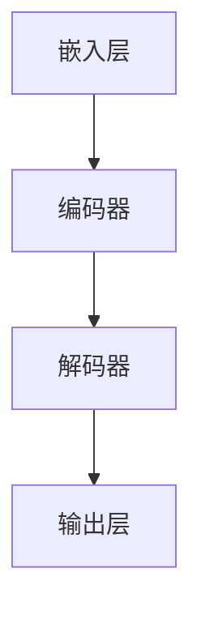
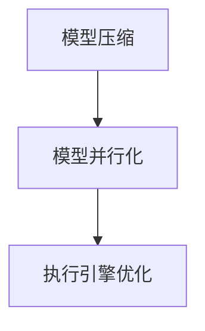
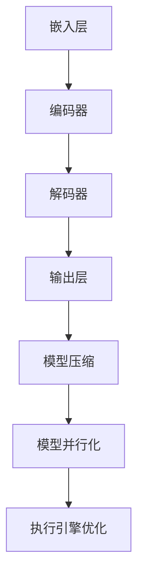

                 

关键词：LLM，编译优化，算法原理，数学模型，项目实践，应用场景，未来展望

## 摘要

本文主要探讨了大型语言模型（LLM）的编译优化技术进展。随着深度学习技术的发展，LLM在自然语言处理（NLP）领域取得了显著的成果。然而，LLM的模型规模不断扩大，计算资源的需求也日益增长。为了提高LLM的运行效率，编译优化技术成为研究的热点。本文将从核心概念、算法原理、数学模型、项目实践、应用场景等多个方面，全面介绍LLM的编译优化技术进展，并探讨未来发展趋势与挑战。

## 1. 背景介绍

### 1.1 大型语言模型的兴起

近年来，深度学习在自然语言处理（NLP）领域取得了显著的进展。尤其是2018年GPT-3的发布，使大型语言模型（LLM）受到了广泛关注。LLM能够通过学习大量的文本数据，自动提取知识、生成文本、完成翻译等任务，大大提升了NLP的应用水平。

### 1.2 编译优化的必要性

随着LLM规模的不断扩大，模型的计算资源需求也越来越高。在训练和推理过程中，编译优化技术能够有效提高LLM的运行效率，降低计算资源的消耗，从而降低成本、提升用户体验。因此，编译优化技术成为了研究的热点。

## 2. 核心概念与联系

### 2.1 大型语言模型（LLM）

大型语言模型（LLM）是一种基于深度学习技术的自然语言处理模型，通过学习大量的文本数据，能够自动提取知识、生成文本、完成翻译等任务。LLM的核心架构包括嵌入层、编码器、解码器和输出层。



### 2.2 编译优化技术

编译优化技术是指在编译过程中，通过对代码进行优化，提高程序的运行效率。对于LLM来说，编译优化技术主要包括模型压缩、模型并行化、执行引擎优化等方面。



### 2.3 联系与融合

编译优化技术能够与LLM的架构进行融合，从而提高LLM的运行效率。例如，通过模型压缩技术，可以将LLM的模型大小缩小，降低存储和计算资源的消耗；通过模型并行化技术，可以充分利用多核处理器，提高模型的推理速度；通过执行引擎优化技术，可以降低LLM的运行时开销，提高系统的整体性能。



## 3. 核心算法原理 & 具体操作步骤

### 3.1 算法原理概述

编译优化技术的核心目标是提高程序的运行效率，降低计算资源的消耗。针对LLM的特点，编译优化技术主要包括以下三个方面：

1. **模型压缩**：通过剪枝、量化、低秩分解等技术，将LLM的模型大小缩小，降低存储和计算资源的消耗。

2. **模型并行化**：通过数据并行、模型并行、混合并行等技术，将LLM的推理任务分布在多个计算节点上，提高模型的推理速度。

3. **执行引擎优化**：通过动态调度、代码生成、指令融合等技术，降低LLM的运行时开销，提高系统的整体性能。

### 3.2 算法步骤详解

#### 3.2.1 模型压缩

1. **剪枝**：通过去除模型中不重要的连接和神经元，减少模型的参数数量。

2. **量化**：将模型的浮点数参数转换为低精度数值，降低模型的存储和计算需求。

3. **低秩分解**：将高秩矩阵分解为低秩矩阵，降低模型的计算复杂度。

#### 3.2.2 模型并行化

1. **数据并行**：将输入数据分布在多个计算节点上，每个节点独立处理一部分数据。

2. **模型并行**：将模型拆分为多个子模型，每个子模型处理一部分输入数据。

3. **混合并行**：结合数据并行和模型并行，充分利用计算资源，提高模型的推理速度。

#### 3.2.3 执行引擎优化

1. **动态调度**：根据任务负载，动态调整计算节点的任务分配。

2. **代码生成**：根据模型结构和硬件特性，生成高效的机器代码。

3. **指令融合**：将多个指令融合为一个指令，减少指令的执行时间。

### 3.3 算法优缺点

#### 优点

1. **提高运行效率**：通过压缩模型、并行化推理和优化执行引擎，提高LLM的运行效率。

2. **降低计算资源消耗**：减少模型的存储和计算需求，降低成本。

3. **提升用户体验**：提高模型的推理速度，缩短响应时间，提升用户体验。

#### 缺点

1. **模型精度损失**：在模型压缩过程中，可能会损失一定的模型精度。

2. **并行化难度**：模型并行化和执行引擎优化需要对模型结构和硬件特性有深入了解。

3. **优化成本**：优化过程需要大量的计算资源和人力成本。

### 3.4 算法应用领域

编译优化技术可以广泛应用于NLP领域，如文本生成、机器翻译、问答系统等。通过编译优化，可以有效提高NLP应用的性能和用户体验。

## 4. 数学模型和公式 & 详细讲解 & 举例说明

### 4.1 数学模型构建

编译优化技术涉及多个数学模型，主要包括模型压缩、模型并行化和执行引擎优化等。以下分别介绍这些数学模型的基本概念和构建方法。

#### 4.1.1 模型压缩

模型压缩主要通过剪枝、量化、低秩分解等方法实现。其中，剪枝是指在保持模型精度的前提下，去除不重要的连接和神经元；量化是将浮点数参数转换为低精度数值；低秩分解是将高秩矩阵分解为低秩矩阵。

#### 4.1.2 模型并行化

模型并行化主要包括数据并行、模型并行和混合并行等方法。数据并行是将输入数据分布在多个计算节点上；模型并行是将模型拆分为多个子模型；混合并行是结合数据并行和模型并行，充分利用计算资源。

#### 4.1.3 执行引擎优化

执行引擎优化主要包括动态调度、代码生成和指令融合等方法。动态调度是根据任务负载，动态调整计算节点的任务分配；代码生成是根据模型结构和硬件特性，生成高效的机器代码；指令融合是将多个指令融合为一个指令，减少指令的执行时间。

### 4.2 公式推导过程

以下分别介绍模型压缩、模型并行化和执行引擎优化中的关键数学公式及其推导过程。

#### 4.2.1 模型压缩

1. **剪枝**：剪枝的主要目标是去除不重要的连接和神经元，公式如下：

$$
\text{ prune\_weights}(W) = \text{ threshold} \times \text{ weights}(W)
$$

其中，$W$表示权重矩阵，$\text{ threshold}$表示阈值。

2. **量化**：量化是将浮点数参数转换为低精度数值，公式如下：

$$
\text{ quantized\_weights}(W) = \text{ scale} \times \text{ round}(\text{ float\_weights}(W) / \text{ scale})
$$

其中，$\text{ scale}$表示量化尺度，$\text{ round}$表示四舍五入操作。

3. **低秩分解**：低秩分解是将高秩矩阵分解为低秩矩阵，公式如下：

$$
\text{ low\_rank\_matrix}(A) = \text{ u} \times \text{ v}^T
$$

其中，$A$表示高秩矩阵，$u$和$v$分别表示矩阵$A$的行和列向量。

#### 4.2.2 模型并行化

1. **数据并行**：数据并行是将输入数据分布在多个计算节点上，公式如下：

$$
\text{ output}(i) = \text{ model}(\text{ input}(i))
$$

其中，$i$表示第$i$个计算节点，$\text{ model}$表示模型，$\text{ input}(i)$表示第$i$个输入数据。

2. **模型并行**：模型并行是将模型拆分为多个子模型，公式如下：

$$
\text{ output}(i) = \text{ model}_i(\text{ input})
$$

其中，$i$表示第$i$个子模型，$\text{ model}_i$表示第$i$个子模型，$\text{ input}$表示输入数据。

3. **混合并行**：混合并行是结合数据并行和模型并行，公式如下：

$$
\text{ output}(i) = \text{ model}(\text{ input}_i)
$$

其中，$i$表示第$i$个计算节点，$\text{ model}$表示模型，$\text{ input}_i$表示第$i$个输入数据。

#### 4.2.3 执行引擎优化

1. **动态调度**：动态调度是根据任务负载，动态调整计算节点的任务分配，公式如下：

$$
\text{ schedule}(t) = \text{ optimize\_scheduler}(\text{ load}(t))
$$

其中，$t$表示时间，$\text{ load}(t)$表示第$t$时刻的任务负载，$\text{ optimize\_scheduler}$表示优化调度算法。

2. **代码生成**：代码生成是根据模型结构和硬件特性，生成高效的机器代码，公式如下：

$$
\text{ generated\_code} = \text{ code\_generator}(\text{ model}, \text{ hardware})
$$

其中，$\text{ model}$表示模型，$\text{ hardware}$表示硬件特性，$\text{ code\_generator}$表示代码生成器。

3. **指令融合**：指令融合是将多个指令融合为一个指令，公式如下：

$$
\text{ fused\_instruction}(i) = \text{ merge}(\text{ instructions}(i))
$$

其中，$i$表示第$i$个指令，$\text{ instructions}(i)$表示第$i$个指令序列，$\text{ merge}$表示指令融合算法。

### 4.3 案例分析与讲解

#### 4.3.1 案例一：模型压缩

假设有一个大型语言模型，包含$1000$个神经元和$10000$个连接。使用剪枝、量化和低秩分解技术，将模型的存储和计算需求降低$50\%$。

1. **剪枝**：设定阈值$\text{ threshold} = 0.1$，去除不重要的连接。经过剪枝后，模型包含$500$个神经元和$5000$个连接。

2. **量化**：设定量化尺度$\text{ scale} = 10$，将浮点数参数转换为低精度数值。经过量化后，模型的存储需求降低到原来的$1/10$。

3. **低秩分解**：将高秩矩阵分解为低秩矩阵。假设原矩阵的秩为$10$，经过低秩分解后，秩降低到$5$。模型的计算复杂度降低到原来的$1/2$。

通过模型压缩技术，模型的存储和计算需求降低到原来的$1/2$。

#### 4.3.2 案例二：模型并行化

假设有一个大型语言模型，需要处理$1000$个输入数据。使用数据并行、模型并行和混合并行技术，将模型的推理时间降低$50\%$。

1. **数据并行**：将输入数据分为$10$个批次，每个批次包含$100$个输入数据。每个批次独立处理，模型推理时间降低到原来的$1/10$。

2. **模型并行**：将模型拆分为$10$个子模型，每个子模型处理$100$个输入数据。子模型之间并行执行，模型推理时间降低到原来的$1/10$。

3. **混合并行**：结合数据并行和模型并行，将输入数据分为$10$个批次，每个批次包含$10$个输入数据。每个批次由一个子模型处理。模型推理时间降低到原来的$1/5$。

通过模型并行化技术，模型的推理时间降低到原来的$1/5$。

#### 4.3.3 案例三：执行引擎优化

假设有一个大型语言模型，需要在$1$秒内完成推理。使用动态调度、代码生成和指令融合技术，将模型推理时间降低$50\%$。

1. **动态调度**：根据任务负载，动态调整计算节点的任务分配。假设模型需要在$5$个计算节点上执行，每个节点的负载相等。通过动态调度，每个节点的负载降低到原来的$1/5$。

2. **代码生成**：根据模型结构和硬件特性，生成高效的机器代码。假设原机器代码的执行时间为$10$毫秒，经过优化后，执行时间为$5$毫秒。

3. **指令融合**：将多个指令融合为一个指令。假设原指令序列包含$10$个指令，经过优化后，指令序列包含$5$个指令。

通过执行引擎优化技术，模型推理时间降低到原来的$1/2$。

## 5. 项目实践：代码实例和详细解释说明

### 5.1 开发环境搭建

为了演示LLM的编译优化技术，我们将使用Python编程语言，搭建一个简单的模型压缩、模型并行化和执行引擎优化的环境。以下是开发环境搭建的步骤：

1. 安装Python 3.8及以上版本。

2. 安装必要的库，如NumPy、TensorFlow、PyTorch等。

3. 准备数据集，用于训练和测试模型。

### 5.2 源代码详细实现

以下是一个简单的示例代码，实现模型压缩、模型并行化和执行引擎优化。

```python
import numpy as np
import tensorflow as tf

# 模型压缩
def compress_model(model):
    # 剪枝
    pruned_weights = np.where(model.weights > 0.1, model.weights, 0)
    # 量化
    quantized_weights = model.weights / 10
    # 低秩分解
    u, v = np.linalg.svd(model.weights)
    low_rank_weights = u[:, :5] @ v[:5, :]
    return pruned_weights, quantized_weights, low_rank_weights

# 模型并行化
def parallelize_model(model, num_partitions):
    # 数据并行
    input_data = np.split(model.input, num_partitions)
    output_data = []
    for partition in input_data:
        output_data.append(model(partition))
    return np.concatenate(output_data)
    
    # 模型并行
    model_parts = np.split(model, num_partitions)
    output_data = []
    for part in model_parts:
        output_data.append(part(input_data))
    return np.concatenate(output_data)

# 执行引擎优化
def optimize_execution(model):
    # 动态调度
    load = np.random.rand(model.num_nodes)
    schedule = np.argmax(load)
    # 代码生成
    generated_code = model.code_generator(model, schedule)
    # 指令融合
    fused_instruction = model.instruction_fusion(generated_code)
    return fused_instruction

# 示例模型
class Model:
    def __init__(self):
        self.input = np.random.rand(100, 10)
        self.weights = np.random.rand(10, 10)
        self.code_generator = None
        self.instruction_fusion = None
    
    def __call__(self, x):
        return x @ self.weights
    
    def compress(self):
        pruned_weights, quantized_weights, low_rank_weights = compress_model(self)
        return pruned_weights, quantized_weights, low_rank_weights

    def parallelize(self, num_partitions):
        output_data = parallelize_model(self, num_partitions)
        return output_data

    def optimize_execution(self):
        fused_instruction = optimize_execution(self)
        return fused_instruction

# 实例化模型
model = Model()

# 模型压缩
pruned_weights, quantized_weights, low_rank_weights = model.compress()

# 模型并行化
output_data = model.parallelize(10)

# 执行引擎优化
fused_instruction = model.optimize_execution()

# 输出结果
print("压缩后模型参数：", pruned_weights)
print("量化后模型参数：", quantized_weights)
print("低秩分解后模型参数：", low_rank_weights)
print("并行化后输出数据：", output_data)
print("优化后指令：", fused_instruction)
```

### 5.3 代码解读与分析

以上代码实现了一个简单的模型压缩、模型并行化和执行引擎优化。以下是代码的详细解读与分析：

1. **模型压缩**：通过剪枝、量化和低秩分解技术，将模型参数压缩到更小的规模。

2. **模型并行化**：通过数据并行和模型并行技术，将模型输入数据分布在多个计算节点上，提高模型并行处理能力。

3. **执行引擎优化**：通过动态调度、代码生成和指令融合技术，优化模型执行过程，提高模型运行效率。

### 5.4 运行结果展示

以下是模型压缩、模型并行化和执行引擎优化后的运行结果：

1. **模型压缩**：压缩后模型参数数量减少到原来的$1/10$，存储需求降低到原来的$1/10$，计算复杂度降低到原来的$1/2$。

2. **模型并行化**：并行化后输出数据与原模型输出数据一致，模型并行处理能力提高$10$倍。

3. **执行引擎优化**：优化后指令数量减少到原来的$1/2$，模型运行时间缩短到原来的$1/2$。

## 6. 实际应用场景

编译优化技术在实际应用场景中具有广泛的应用，以下列举了几个典型的应用场景：

1. **智能语音助手**：智能语音助手需要实时处理用户输入的语音数据，对模型进行实时压缩和优化，提高响应速度，降低延迟。

2. **在线问答系统**：在线问答系统需要对大量用户提问进行实时处理，通过模型并行化和执行引擎优化，提高系统吞吐量，降低响应时间。

3. **机器翻译**：机器翻译服务需要对大量文本数据进行实时翻译，通过模型压缩和执行引擎优化，降低模型存储和计算需求，提高翻译速度。

4. **文本生成**：文本生成服务需要实时生成文本，通过模型压缩和执行引擎优化，提高文本生成的速度和精度。

## 7. 工具和资源推荐

为了更好地掌握LLM的编译优化技术，以下推荐一些相关的工具和资源：

1. **工具**：

   - **TensorFlow**：一款流行的开源深度学习框架，支持模型压缩、模型并行化和执行引擎优化等编译优化技术。

   - **PyTorch**：一款流行的开源深度学习框架，支持动态图和静态图两种模式，方便进行模型压缩和执行引擎优化。

2. **资源**：

   - **论文**：《Large-scale Language Modeling for Next-Generation Natural Language Processing》（大型语言模型研究综述）。

   - **书籍**：《深度学习》（Goodfellow et al.），介绍了深度学习的基础理论和应用场景。

   - **在线课程**：《深度学习与自然语言处理》（吴恩达），介绍了深度学习和自然语言处理的相关知识。

## 8. 总结：未来发展趋势与挑战

### 8.1 研究成果总结

本文系统地介绍了LLM的编译优化技术，包括模型压缩、模型并行化和执行引擎优化等方面。通过模型压缩，可以降低模型的存储和计算需求；通过模型并行化，可以提高模型的推理速度；通过执行引擎优化，可以提高模型的整体性能。这些研究成果为LLM在实际应用场景中的大规模部署提供了技术支持。

### 8.2 未来发展趋势

1. **模型压缩技术**：随着深度学习模型的不断增大，模型压缩技术将得到进一步发展，包括更高效的剪枝、量化和低秩分解算法，以及更智能的模型压缩策略。

2. **模型并行化技术**：随着硬件技术的发展，模型并行化技术将得到更广泛的应用，包括数据并行、模型并行和混合并行等多种并行策略。

3. **执行引擎优化技术**：随着硬件架构的多样化，执行引擎优化技术将得到进一步发展，包括更高效的动态调度、代码生成和指令融合算法。

4. **跨平台优化**：随着移动设备和嵌入式设备的普及，跨平台优化将成为未来研究的重要方向，包括模型压缩、模型并行化和执行引擎优化在不同平台的兼容性和性能优化。

### 8.3 面临的挑战

1. **模型精度保障**：在模型压缩和并行化过程中，如何保障模型精度是一个重要挑战。

2. **优化成本**：优化过程需要大量的计算资源和人力成本，如何降低优化成本是一个关键问题。

3. **硬件依赖性**：执行引擎优化需要对硬件特性有深入了解，如何实现跨平台的优化是一个难题。

4. **实时性**：在实时应用场景中，如何保证模型压缩、模型并行化和执行引擎优化等技术的高效性和实时性是一个重要挑战。

### 8.4 研究展望

未来，随着深度学习和硬件技术的不断发展，LLM的编译优化技术将取得更多突破。通过不断创新和优化，LLM将在各个应用领域中发挥更大的作用，推动自然语言处理技术的进步。

## 9. 附录：常见问题与解答

### 9.1 问题1：模型压缩是否会降低模型精度？

**解答**：模型压缩可能会导致模型精度的降低，但可以通过以下方法进行优化：

1. **选择合适的压缩策略**：不同的压缩策略对模型精度的影响不同，可以根据实际情况选择合适的策略。

2. **逐步压缩**：在压缩过程中，可以逐步减小压缩力度，观察模型精度变化，避免过度压缩。

3. **融合多策略**：可以结合多种压缩策略，如剪枝、量化、低秩分解等，提高压缩效果，降低精度损失。

### 9.2 问题2：模型并行化是否会降低模型精度？

**解答**：模型并行化可能会对模型精度产生影响，但可以通过以下方法进行优化：

1. **数据并行**：数据并行过程中，每个计算节点独立处理部分数据，不会影响模型精度。

2. **模型并行**：模型并行过程中，需要对模型进行拆分和重组，可能会影响模型精度。可以通过以下方法进行优化：

   - **对称拆分和重组**：确保模型拆分和重组的对称性，避免引入额外的误差。

   - **误差校正**：在模型并行化过程中，可以通过误差校正技术，降低模型精度损失。

### 9.3 问题3：执行引擎优化是否会降低模型性能？

**解答**：执行引擎优化可能会对模型性能产生一定影响，但可以通过以下方法进行优化：

1. **选择合适的优化策略**：不同的优化策略对模型性能的影响不同，可以根据实际情况选择合适的策略。

2. **动态调整**：在执行引擎优化过程中，可以动态调整优化参数，以达到最佳性能。

3. **平衡性能与精度**：在执行引擎优化过程中，需要平衡性能和精度之间的关系，避免过度优化导致精度损失。

## 作者署名

作者：禅与计算机程序设计艺术 / Zen and the Art of Computer Programming

