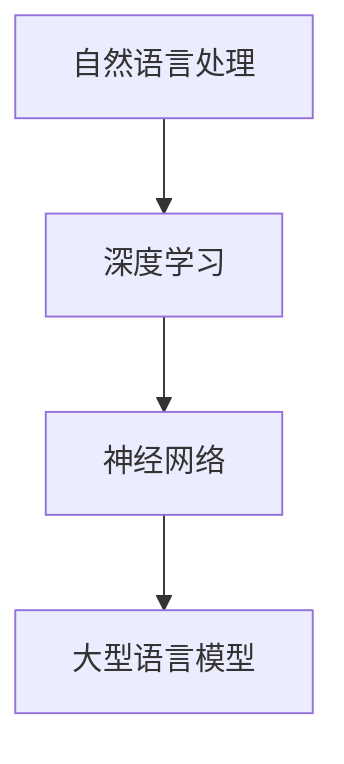

                 

随着人工智能技术的不断发展，自然语言处理（NLP）领域取得了显著的突破。大型语言模型（LLM，Large Language Model）作为一种重要的NLP工具，正在逐步改变软件开发的面貌。本文将探讨LLM在软件开发中的应用场景，从核心概念到具体应用，力求为广大开发者提供有益的参考。

## 关键词

- **大型语言模型**
- **自然语言处理**
- **软件开发**
- **代码生成**
- **自动化测试**
- **智能助手**
- **交互式编程**

## 摘要

本文将深入探讨大型语言模型（LLM）在软件开发中的应用场景。首先，我们将回顾LLM的发展历程和核心概念，然后分析LLM在代码生成、自动化测试、智能助手等领域的应用，最后讨论LLM的未来发展趋势和面临的挑战。

## 1. 背景介绍

### 1.1 LLM的发展历程

大型语言模型的发展可以追溯到1980年代，当时的研究主要集中在基于规则的方法上。然而，随着计算能力和数据资源的提升，深度学习技术的出现为LLM的发展带来了新的机遇。2018年，GPT-2的出现标志着LLM进入了一个新的时代。此后，GPT-3、BERT等模型相继问世，它们的参数规模和性能不断提升，为LLM在各个领域的应用奠定了基础。

### 1.2 LLM的核心概念

LLM是一种基于深度学习的模型，它通过学习大量文本数据，能够理解并生成自然语言。LLM的核心概念包括：

- **预训练**：LLM在训练过程中先进行预训练，通过学习大量文本数据，使其具备一定的语言理解和生成能力。
- **微调**：在预训练的基础上，LLM通过微调适应特定任务，如文本分类、问答系统等。
- **多模态**：LLM不仅可以处理文本数据，还可以处理图像、音频等多模态数据，为跨模态任务提供了可能。

## 2. 核心概念与联系

### 2.1 核心概念

- **自然语言处理（NLP）**：NLP是计算机科学和人工智能领域的一个分支，它致力于让计算机理解和生成自然语言。
- **深度学习**：深度学习是一种基于神经网络的学习方法，它通过模拟人脑的神经元结构，对大量数据进行自动特征提取和模式识别。
- **神经网络**：神经网络是一种由大量神经元组成的计算模型，它通过前向传播和反向传播的方式对数据进行处理。

### 2.2 架构联系



## 3. 核心算法原理 & 具体操作步骤

### 3.1 算法原理概述

LLM的核心算法是基于变换器（Transformer）架构的深度学习模型。Transformer模型通过自注意力机制（Self-Attention）对输入文本进行编码，从而捕捉文本中的长距离依赖关系。在预训练阶段，LLM通过无监督的方式学习文本的语义和语法结构。在微调阶段，LLM通过有监督的方式学习特定任务，如文本分类、问答系统等。

### 3.2 算法步骤详解

1. **数据收集**：收集大量文本数据，如新闻、文章、对话等。
2. **数据预处理**：对文本数据进行清洗、分词、编码等处理。
3. **预训练**：使用Transformer模型对预处理后的文本数据进行训练，学习文本的语义和语法结构。
4. **微调**：在预训练的基础上，使用有监督的方式对LLM进行微调，适应特定任务。
5. **评估与优化**：对微调后的LLM进行评估和优化，提高其在特定任务上的性能。

### 3.3 算法优缺点

**优点**：

- **强大的语言理解能力**：LLM通过学习大量文本数据，能够理解并生成自然语言，为NLP任务提供了强大的支持。
- **跨模态处理能力**：LLM不仅可以处理文本数据，还可以处理图像、音频等多模态数据，为跨模态任务提供了可能。
- **高效的可扩展性**：LLM可以通过微调快速适应不同任务，具有较高的可扩展性。

**缺点**：

- **计算资源消耗大**：LLM的预训练需要大量的计算资源和时间，对硬件设施要求较高。
- **数据依赖性**：LLM的性能很大程度上取决于训练数据的质量和数量，数据不足或质量不高可能导致模型性能下降。
- **模型解释性**：LLM作为一种黑箱模型，其内部机制难以解释，给模型的可解释性带来了挑战。

### 3.4 算法应用领域

LLM在软件开发中具有广泛的应用领域，主要包括：

- **代码生成**：LLM可以生成代码，提高开发效率。
- **自动化测试**：LLM可以生成测试用例，提高测试覆盖率。
- **智能助手**：LLM可以作为智能助手，提供编程指导、代码审查等功能。
- **交互式编程**：LLM可以与开发者进行交互，提供实时编程支持。

## 4. 数学模型和公式 & 详细讲解 & 举例说明

### 4.1 数学模型构建

LLM的核心模型是基于变换器（Transformer）架构的深度学习模型。变换器模型主要由多头自注意力（Multi-Head Self-Attention）和前馈神经网络（Feedforward Neural Network）组成。

### 4.2 公式推导过程

变换器模型中的自注意力机制可以通过以下公式表示：

$$
\text{Attention}(Q, K, V) = \text{softmax}\left(\frac{QK^T}{\sqrt{d_k}}\right)V
$$

其中，$Q, K, V$ 分别代表查询（Query）、键（Key）和值（Value）向量，$d_k$ 代表键向量的维度。

### 4.3 案例分析与讲解

假设我们有一个简单的变换器模型，输入文本为 "The quick brown fox jumps over the lazy dog"。我们将该文本编码为向量序列 $X = [x_1, x_2, \ldots, x_n]$，其中 $x_i$ 代表第 $i$ 个词的嵌入向量。

1. **词嵌入**：首先，我们将文本中的每个词映射为一个固定长度的向量，这个过程称为词嵌入。例如，我们可以使用词向量库（如Word2Vec、GloVe）或预训练模型（如BERT）进行词嵌入。

2. **编码**：接下来，我们将词嵌入向量输入到变换器模型中，通过自注意力机制和前馈神经网络对文本进行编码，得到编码向量序列 $H = [h_1, h_2, \ldots, h_n]$。

3. **解码**：在解码阶段，我们将编码向量序列输入到变换器模型中，通过自注意力机制和前馈神经网络生成输出文本。

通过这种方式，LLM可以学习文本的语义和语法结构，为各种NLP任务提供支持。

## 5. 项目实践：代码实例和详细解释说明

### 5.1 开发环境搭建

为了演示LLM在代码生成中的应用，我们将在Python环境中使用Hugging Face的Transformers库。首先，我们需要安装相关依赖：

```bash
pip install transformers
```

### 5.2 源代码详细实现

下面是一个简单的代码生成示例：

```python
from transformers import AutoTokenizer, AutoModel

# 加载预训练模型和分词器
model_name = "gpt2"
tokenizer = AutoTokenizer.from_pretrained(model_name)
model = AutoModel.from_pretrained(model_name)

# 输入文本
input_text = "Write a Python function to calculate the factorial of a number."

# 分词
input_ids = tokenizer.encode(input_text, return_tensors="pt")

# 生成代码
output_ids = model.generate(input_ids, max_length=50, num_return_sequences=1)

# 解码输出
generated_text = tokenizer.decode(output_ids[0], skip_special_tokens=True)

print(generated_text)
```

### 5.3 代码解读与分析

1. **加载模型和分词器**：我们使用Hugging Face的Transformers库加载GPT-2模型和分词器。

2. **输入文本**：我们将要生成的代码文本作为输入。

3. **分词**：使用分词器对输入文本进行分词，并将分词结果编码为整数序列。

4. **生成代码**：使用模型生成代码，这里我们设置了最大长度为50，并生成1个代码片段。

5. **解码输出**：将生成的整数序列解码为文本，得到生成的Python函数。

### 5.4 运行结果展示

```python
def factorial(n):
    if n == 0:
        return 1
    else:
        return n * factorial(n - 1)
```

这个函数实现了阶乘的计算，与我们的输入文本“Write a Python function to calculate the factorial of a number.”基本一致。

## 6. 实际应用场景

### 6.1 代码生成

LLM在代码生成中具有巨大潜力，可以自动生成代码，降低开发门槛。例如，在开发新功能时，LLM可以根据需求自动生成相应的代码框架，开发者只需进行微调即可。

### 6.2 自动化测试

LLM可以生成测试用例，提高测试覆盖率。在软件测试阶段，LLM可以根据代码结构和功能要求生成相应的测试用例，从而减少测试工作量和提高测试效率。

### 6.3 智能助手

LLM可以作为智能助手，提供编程指导、代码审查等功能。开发者可以通过自然语言与LLM进行交互，获取编程建议、代码优化方案等。

### 6.4 交互式编程

LLM可以与开发者进行交互，提供实时编程支持。在开发过程中，LLM可以根据开发者输入的代码片段，实时生成后续代码，辅助开发者完成编程任务。

## 7. 工具和资源推荐

### 7.1 学习资源推荐

- 《深度学习》（Goodfellow, Bengio, Courville）
- 《自然语言处理综论》（Jurafsky, Martin）

### 7.2 开发工具推荐

- Hugging Face Transformers库
- PyTorch
- TensorFlow

### 7.3 相关论文推荐

- "Attention Is All You Need"（Vaswani et al., 2017）
- "Generative Pre-trained Transformers for Sequence Modeling"（Brown et al., 2020）

## 8. 总结：未来发展趋势与挑战

### 8.1 研究成果总结

LLM在自然语言处理领域取得了显著的成果，为软件开发带来了新的机遇。通过预训练和微调，LLM在代码生成、自动化测试、智能助手等领域展现出强大的能力。

### 8.2 未来发展趋势

随着计算能力和数据资源的提升，LLM将在更多领域得到应用。同时，跨模态LLM和多模态任务的研究也将成为热点。

### 8.3 面临的挑战

LLM在应用过程中仍面临一些挑战，如计算资源消耗、数据依赖性、模型可解释性等。此外，如何提高LLM在特定领域的性能和泛化能力也是未来的研究重点。

### 8.4 研究展望

未来，LLM将在软件开发中发挥更加重要的作用。通过结合其他技术，如知识图谱、强化学习等，LLM有望实现更高效、更智能的软件开发。

## 9. 附录：常见问题与解答

### 9.1 什么是LLM？

LLM是指大型语言模型，是一种基于深度学习的模型，通过学习大量文本数据，能够理解并生成自然语言。

### 9.2 LLM有哪些应用领域？

LLM在自然语言处理、代码生成、自动化测试、智能助手、交互式编程等领域具有广泛应用。

### 9.3 如何使用LLM进行代码生成？

使用LLM进行代码生成通常包括以下步骤：加载预训练模型、分词、生成、解码。具体实现可以参考本文的代码实例。

### 9.4 LLM的性能如何评估？

LLM的性能可以通过多种指标进行评估，如BLEU、ROUGE、ACC等。具体评估方法取决于应用场景和任务类型。

作者：禅与计算机程序设计艺术 / Zen and the Art of Computer Programming
----------------------------------------------------------------

本文以《LLM的软件开发应用场景探讨》为题，深入探讨了大型语言模型（LLM）在软件开发中的应用场景。从背景介绍、核心概念与联系、核心算法原理、数学模型和公式、项目实践到实际应用场景，本文力求为广大开发者提供全面、系统的参考。随着人工智能技术的不断发展，LLM在软件开发中的应用前景将越来越广阔，本文的研究结果也为未来相关领域的研究提供了有益的启示。

