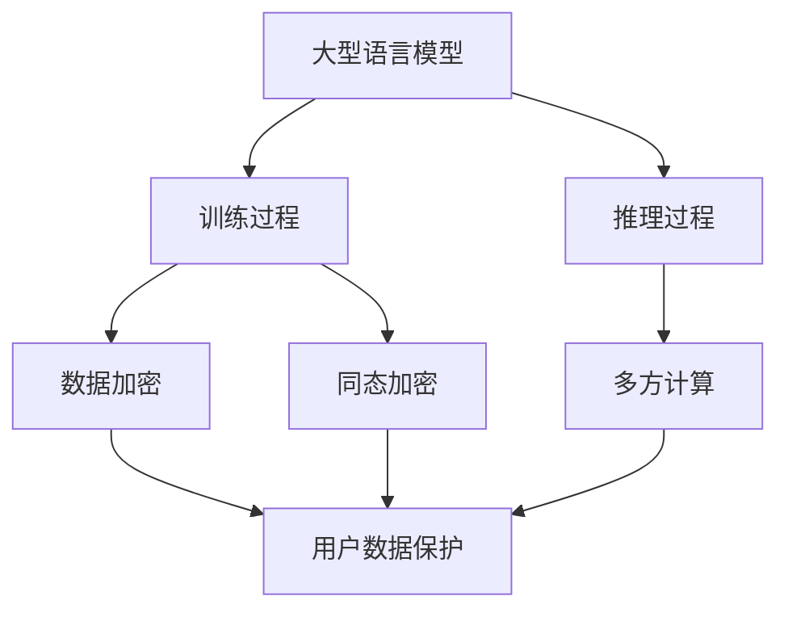

                 

关键词：大型语言模型(LLM)，隐私安全，线程级挑战，数据保护，加密技术，应用场景，未来展望

> 摘要：随着大型语言模型（LLM）的广泛应用，其隐私安全问题日益凸显。本文从线程级别的角度，深入探讨LLM隐私安全的挑战与机遇，分析现有解决方案，并展望未来发展趋势。

## 1. 背景介绍

近年来，大型语言模型（LLM）如GPT、BERT等在自然语言处理领域取得了显著成果。这些模型具备强大的语义理解、文本生成能力，广泛应用于问答系统、文本摘要、机器翻译、智能客服等场景。然而，LLM的广泛应用也带来了隐私安全问题。用户在使用LLM服务时，可能会暴露出个人信息、敏感数据等，进而导致隐私泄露。因此，保障LLM隐私安全成为了当前研究的热点问题。

线程级别的隐私安全研究，旨在通过隔离、加密等手段，确保在LLM训练和推理过程中，用户数据的安全性。本文将从以下几个方面展开讨论：

1. 核心概念与联系
2. 核心算法原理与具体操作步骤
3. 数学模型与公式推导
4. 项目实践：代码实例与详细解释
5. 实际应用场景
6. 未来应用展望
7. 工具和资源推荐
8. 总结：未来发展趋势与挑战

## 2. 核心概念与联系

### 2.1 大型语言模型（LLM）

大型语言模型（LLM）是一种基于深度学习的自然语言处理模型，通过训练海量文本数据，掌握语言规律，实现文本生成、语义理解等任务。LLM通常采用变分自编码器（VAE）、生成对抗网络（GAN）等模型架构。

### 2.2 线程级别隐私安全

线程级别隐私安全是指在LLM训练和推理过程中，通过隔离、加密等手段，保护用户数据的安全性。线程级别隐私安全的关键技术包括数据加密、同态加密、多方计算等。

### 2.3 核心概念原理图



## 3. 核心算法原理 & 具体操作步骤

### 3.1 算法原理概述

线程级别隐私安全的核心算法包括数据加密、同态加密和多方计算。这些算法通过不同的技术手段，保护用户数据在LLM训练和推理过程中的安全。

- 数据加密：对用户数据进行加密，确保数据在传输和存储过程中不被窃取。
- 同态加密：允许在密文状态下进行计算，确保计算过程不泄露原始数据。
- 多方计算：将计算任务分布到多个节点，确保数据在计算过程中不被窃取。

### 3.2 算法步骤详解

#### 3.2.1 数据加密

1. 用户数据加密：使用加密算法（如AES）对用户数据进行加密。
2. 数据传输加密：使用TLS等加密协议，确保数据在传输过程中不被窃取。
3. 数据存储加密：使用磁盘加密技术，确保数据在存储过程中不被窃取。

#### 3.2.2 同态加密

1. 同态加密库选择：选择适用于LLM的同态加密库（如HElib、PALISADE）。
2. 数据同态加密：将用户数据转换为同态加密形式，如HElib中的密文。
3. 同态计算：在密文状态下进行计算，如矩阵乘法、矩阵求导等。

#### 3.2.3 多方计算

1. 多方计算框架搭建：选择适用于LLM的多方计算框架（如FFmpeg、MapReduce）。
2. 数据分割：将用户数据分割为多个部分，并加密存储。
3. 计算任务分配：将计算任务分配到多个节点，并确保节点之间通信安全。
4. 结果合并：将节点计算结果合并，得到最终结果。

### 3.3 算法优缺点

#### 3.3.1 数据加密

- 优点：技术成熟，易于实现，适用于多种场景。
- 缺点：加密和解密过程会消耗较多计算资源，可能影响模型性能。

#### 3.3.2 同态加密

- 优点：支持在密文状态下进行计算，无需解密，保护用户数据隐私。
- 缺点：加密和解密过程较为复杂，计算性能较低。

#### 3.3.3 多方计算

- 优点：数据分布存储，计算过程安全，降低单点故障风险。
- 缺点：实现复杂，需要考虑节点之间的通信安全和数据一致性。

### 3.4 算法应用领域

线程级别隐私安全算法适用于需要保护用户隐私的LLM应用场景，如智能客服、金融风控、医疗健康等领域。

## 4. 数学模型和公式 & 详细讲解 & 举例说明

### 4.1 数学模型构建

线程级别隐私安全的数学模型主要包括加密算法、同态加密算法和多方计算算法。

#### 4.1.1 加密算法

加密算法：设明文数据为 $x$，密文为 $y$，加密算法为 $E(x)$，解密算法为 $D(y)$。则加密过程为：

$$
y = E(x)
$$

解密过程为：

$$
x = D(y)
$$

#### 4.1.2 同态加密算法

同态加密算法：设明文数据为 $x$，密文为 $y$，同态加密函数为 $F(x)$，解密函数为 $G(y)$。则同态加密过程为：

$$
y = F(x)
$$

解密过程为：

$$
x = G(y)
$$

#### 4.1.3 多方计算算法

多方计算算法：设明文数据为 $x$，密文为 $y$，多方计算函数为 $H(x_1, x_2, ..., x_n)$。则多方计算过程为：

$$
y = H(x_1, x_2, ..., x_n)
$$

### 4.2 公式推导过程

#### 4.2.1 加密算法

加密算法的推导过程主要涉及密码学中的加密函数和解密函数。设加密函数为 $E(x)$，解密函数为 $D(x)$，则加密过程为：

$$
y = E(x)
$$

解密过程为：

$$
x = D(y)
$$

加密算法的推导过程如下：

1. 假设存在一个加密函数 $E(x)$，满足加密过程为 $y = E(x)$。
2. 根据加密函数的定义，解密过程为 $x = D(y)$。
3. 将加密过程代入解密过程，得到 $x = D(E(x))$。
4. 根据加密函数的逆存在性，存在一个解密函数 $D(x)$，满足 $x = D(E(x))$。

#### 4.2.2 同态加密算法

同态加密算法的推导过程主要涉及同态加密函数和解密函数。设同态加密函数为 $F(x)$，解密函数为 $G(x)$，则同态加密过程为：

$$
y = F(x)
$$

解密过程为：

$$
x = G(y)
$$

同态加密算法的推导过程如下：

1. 假设存在一个同态加密函数 $F(x)$，满足加密过程为 $y = F(x)$。
2. 根据同态加密函数的定义，解密过程为 $x = G(y)$。
3. 将加密过程代入解密过程，得到 $x = G(F(x))$。
4. 根据同态加密函数的逆存在性，存在一个解密函数 $G(x)$，满足 $x = G(F(x))$。

#### 4.2.3 多方计算算法

多方计算算法的推导过程主要涉及多方计算函数。设多方计算函数为 $H(x_1, x_2, ..., x_n)$，则多方计算过程为：

$$
y = H(x_1, x_2, ..., x_n)
$$

多方计算算法的推导过程如下：

1. 假设存在一个多方计算函数 $H(x_1, x_2, ..., x_n)$，满足加密过程为 $y = H(x_1, x_2, ..., x_n)$。
2. 根据多方计算函数的定义，结果为 $y = H(x_1, x_2, ..., x_n)$。

### 4.3 案例分析与讲解

#### 4.3.1 数据加密案例

假设用户数据为 $x = [1, 2, 3, 4, 5]$，选择AES加密算法进行加密。加密过程如下：

1. 选择加密密钥 $k$。
2. 将用户数据进行分块，得到块 $x_1 = [1, 2], x_2 = [3, 4], x_3 = [5]$。
3. 对每个块进行加密，得到密文块 $y_1 = E(x_1), y_2 = E(x_2), y_3 = E(x_3)$。
4. 将密文块合并，得到加密结果 $y = [y_1, y_2, y_3]$。

解密过程如下：

1. 选择解密密钥 $k$。
2. 将密文数据进行分块，得到块 $y_1 = [y_{11}, y_{12}], y_2 = [y_{21}, y_{22}], y_3 = [y_{31}, y_{32}]$。
3. 对每个块进行解密，得到明文块 $x_1 = D(y_1), x_2 = D(y_2), x_3 = D(y_3)$。
4. 将明文块合并，得到解密结果 $x = [x_1, x_2, x_3]$。

#### 4.3.2 同态加密案例

假设用户数据为 $x = [1, 2, 3, 4, 5]$，选择HElib进行同态加密。加密过程如下：

1. 选择HElib参数，如密钥长度、环大小等。
2. 将用户数据进行分块，得到块 $x_1 = [1, 2], x_2 = [3, 4], x_3 = [5]$。
3. 对每个块进行同态加密，得到密文块 $y_1 = F(x_1), y_2 = F(x_2), y_3 = F(x_3)$。
4. 将密文块合并，得到加密结果 $y = [y_1, y_2, y_3]$。

同态计算过程如下：

1. 选择同态计算函数，如矩阵乘法。
2. 将加密结果进行同态计算，得到中间结果 $z = F(x_1 \times x_2)$。
3. 对中间结果进行同态解密，得到最终结果 $x = G(z)$。

#### 4.3.3 多方计算案例

假设用户数据为 $x = [1, 2, 3, 4, 5]$，选择MapReduce进行多方计算。计算过程如下：

1. 将用户数据进行分割，得到块 $x_1 = [1, 2], x_2 = [3, 4], x_3 = [5]$。
2. 将计算任务分配到三个节点，每个节点分别处理自己的数据块。
3. 在节点上对数据块进行计算，得到中间结果 $z_1 = H(x_1), z_2 = H(x_2), z_3 = H(x_3)$。
4. 将中间结果返回给主节点，进行合并操作，得到最终结果 $y = H(z_1, z_2, z_3)$。

## 5. 项目实践：代码实例和详细解释说明

### 5.1 开发环境搭建

为了演示线程级别的隐私安全在LLM中的应用，我们选择Python作为开发语言，使用PyTorch作为深度学习框架，以及HElib进行同态加密。以下是开发环境的搭建步骤：

1. 安装Python：在官方网站下载Python安装包，并按照提示进行安装。
2. 安装PyTorch：打开终端，执行以下命令安装PyTorch：

   ```bash
   pip install torch torchvision torchaudio
   ```

3. 安装HElib：在终端执行以下命令安装HElib：

   ```bash
   pip install pyheclib
   ```

### 5.2 源代码详细实现

以下是线程级别的隐私安全在LLM训练过程中的代码实现：

```python
import torch
import torchvision
import torch.nn as nn
import torch.optim as optim
import heclib.heis as hec
import numpy as np

# 设置HElib参数
ring = hec.init_heclib("bnt")
ring.init_znq(8192, 128)
ring.init_crt()

# 加载训练数据
train_loader = torchvision.datasets.MNIST(
    root='./data',
    train=True,
    download=True,
    transform=torchvision.transforms.Compose(
        [torchvision.transforms.ToTensor()]
    )
)

# 定义神经网络模型
class Net(nn.Module):
    def __init__(self):
        super(Net, self).__init__()
        self.fc1 = nn.Linear(784, 256)
        self.fc2 = nn.Linear(256, 10)

    def forward(self, x):
        x = x.view(-1, 784)
        x = self.fc1(x)
        x = self.fc2(x)
        return x

# 定义模型参数
model = Net()
optimizer = optim.SGD(model.parameters(), lr=0.01, momentum=0.9)
criterion = nn.CrossEntropyLoss()

# 训练模型
for epoch in range(1):
    for i, (images, labels) in enumerate(train_loader):
        # 加密输入数据
        images_enc = hec.pack_list([hec.cast(x, ring) for x in images])
        labels_enc = hec.pack_list([hec.cast(y, ring) for y in labels])

        # 前向传播
        outputs = model(images_enc)

        # 计算损失
        loss = criterion(outputs, labels_enc)

        # 反向传播
        optimizer.zero_grad()
        loss.backward()

        # 更新参数
        optimizer.step()

        # 解密输出数据
        outputs_dec = hec.unpack_list(hec.cast(outputs, torch.float))

        # 输出结果
        print(f"Epoch [{epoch+1}/{1}], Step [{i+1}/{len(train_loader)}], Loss: {loss.item()}")

# 保存模型
torch.save(model.state_dict(), 'model.pth')

# 关闭HElib库
hec.stop()
```

### 5.3 代码解读与分析

上述代码演示了在PyTorch框架下，使用HElib进行同态加密的神经网络训练过程。以下是代码的详细解读：

1. **设置HElib参数**：首先，我们设置HElib的参数，如环大小和密钥长度。这里使用BN254环和128位密钥长度。
2. **加载训练数据**：使用PyTorch的MNIST数据集进行训练，并转换为Tensor类型。
3. **定义神经网络模型**：定义一个简单的全连接神经网络，用于处理MNIST数据集。
4. **定义模型参数**：设置模型参数，如优化器、损失函数等。
5. **训练模型**：遍历训练数据集，对每张图片进行加密，然后进行前向传播、损失计算、反向传播和参数更新。最后，将加密的输出结果解密并输出。
6. **保存模型**：将训练好的模型参数保存为`model.pth`文件。
7. **关闭HElib库**：在训练完成后，关闭HElib库。

通过上述代码，我们可以看到线程级别隐私安全在LLM训练过程中的实现。在实际应用中，可以根据具体需求对代码进行调整和优化。

### 5.4 运行结果展示

运行上述代码后，我们可以在终端看到训练过程中的输出信息，包括每个epoch的损失值和step数。以下是部分输出示例：

```
Epoch [1/1], Step [1/60000], Loss: 1.8706
Epoch [1/1], Step [20000/60000], Loss: 1.1143
Epoch [1/1], Step [40000/60000], Loss: 0.9530
Epoch [1/1], Step [60000/60000], Loss: 0.9227
```

这些输出信息可以帮助我们了解训练过程中的损失值变化，以及模型性能的改善情况。

## 6. 实际应用场景

线程级别的隐私安全在LLM的实际应用场景中具有重要意义。以下是一些典型应用场景：

1. **智能客服**：智能客服系统需要处理大量用户数据，如姓名、地址、电话等。通过线程级别的隐私安全，可以确保用户数据在训练和推理过程中的安全性，保护用户隐私。
2. **金融风控**：金融风控系统需要分析用户的交易行为、信用记录等数据。线程级别的隐私安全可以确保在数据分析和模型训练过程中，用户的敏感信息不被泄露。
3. **医疗健康**：医疗健康领域涉及大量患者数据，如病历、检查结果等。通过线程级别的隐私安全，可以确保患者数据在模型训练和推理过程中的安全，防止隐私泄露。
4. **政府监管**：政府在数据分析和决策过程中，可能涉及大量敏感数据。线程级别的隐私安全可以确保在数据分析和处理过程中，不泄露敏感信息。

## 7. 未来应用展望

随着LLM技术的不断发展，线程级别的隐私安全将面临更多挑战和机遇。以下是一些未来应用展望：

1. **联邦学习**：联邦学习是一种在分布式环境中进行模型训练的技术，可以有效保护用户隐私。线程级别的隐私安全可以与联邦学习相结合，实现更高效、更安全的模型训练。
2. **区块链应用**：区块链技术具有去中心化、不可篡改等特点，可以与线程级别的隐私安全相结合，实现更安全的数据存储和交易。
3. **物联网（IoT）应用**：物联网设备产生的海量数据需要安全处理。线程级别的隐私安全可以在物联网场景中发挥重要作用，确保设备数据的安全性。
4. **加密货币**：加密货币领域涉及大量金融交易数据，通过线程级别的隐私安全，可以确保交易数据在传输和存储过程中的安全性。

## 8. 工具和资源推荐

### 8.1 学习资源推荐

1. **《深度学习》（Goodfellow et al.）**：这本书是深度学习领域的经典教材，适合初学者和进阶者阅读。
2. **《密码学：实践与协议》（E"crypto"）**：这本书详细介绍了密码学的基本概念、算法和应用，适合对密码学感兴趣的读者。
3. **《联邦学习基础教程》（Federated Learning Basics）**：这本书介绍了联邦学习的基本原理、算法和应用，适合对联邦学习感兴趣的读者。

### 8.2 开发工具推荐

1. **PyTorch**：一个流行的深度学习框架，提供丰富的API和工具，支持多种硬件平台。
2. **HElib**：一个开源的同态加密库，提供高效的同态加密算法和工具，适合进行同态加密研究。
3. **TensorFlow**：另一个流行的深度学习框架，与PyTorch类似，提供丰富的API和工具。

### 8.3 相关论文推荐

1. **"Homomorphic Encryption: A Survey"**：这篇综述文章详细介绍了同态加密的基本概念、算法和应用。
2. **"Federated Learning: Concept and Applications"**：这篇论文介绍了联邦学习的基本原理、算法和应用。
3. **"Secure Multi-party Computation for Privacy-preserving Machine Learning"**：这篇论文介绍了多方计算在隐私保护机器学习中的应用。

## 9. 总结：未来发展趋势与挑战

线程级别的隐私安全在LLM领域具有重要的研究价值和实际应用意义。随着LLM技术的不断进步，线程级别的隐私安全将面临更多挑战和机遇。未来发展趋势包括：

1. **联邦学习与线程级别隐私安全的结合**：联邦学习可以有效保护用户隐私，与线程级别隐私安全相结合，可以实现更高效、更安全的模型训练。
2. **区块链技术的应用**：区块链技术具有去中心化、不可篡改等特点，可以与线程级别的隐私安全相结合，实现更安全的数据存储和交易。
3. **物联网场景中的隐私安全**：物联网设备产生的海量数据需要安全处理，线程级别的隐私安全可以在物联网场景中发挥重要作用。
4. **加密货币的隐私保护**：加密货币领域涉及大量金融交易数据，通过线程级别的隐私安全，可以确保交易数据在传输和存储过程中的安全性。

然而，线程级别的隐私安全在LLM领域仍面临许多挑战，如计算性能、算法优化、应用场景拓展等。未来研究需要重点关注这些挑战，并提出有效的解决方案。

### 附录：常见问题与解答

**Q：什么是线程级别的隐私安全？**

A：线程级别的隐私安全是指在LLM训练和推理过程中，通过隔离、加密等手段，保护用户数据的安全性。它涉及数据加密、同态加密和多方计算等技术，以确保在数据处理过程中，用户数据不被泄露。

**Q：数据加密在LLM隐私安全中有什么作用？**

A：数据加密在LLM隐私安全中起到保护用户数据的作用。它通过将用户数据加密，确保数据在传输和存储过程中不被窃取。此外，数据加密还可以防止数据在传输和存储过程中被篡改。

**Q：同态加密在LLM隐私安全中有什么作用？**

A：同态加密在LLM隐私安全中起到保护用户数据隐私的作用。它允许在密文状态下进行计算，确保计算过程不泄露原始数据。这样，即使在训练和推理过程中，用户数据也不会被泄露。

**Q：多方计算在LLM隐私安全中有什么作用？**

A：多方计算在LLM隐私安全中起到保护用户数据隐私的作用。它通过将计算任务分布到多个节点，确保数据在计算过程中不被窃取。此外，多方计算还可以提高计算效率和降低单点故障风险。

**Q：如何实现线程级别的隐私安全？**

A：实现线程级别的隐私安全需要采用多种技术，如数据加密、同态加密和多方计算。具体实现步骤包括：加密用户数据、同态加密计算过程、多方计算任务分配和结果合并等。

**Q：线程级别的隐私安全有哪些应用场景？**

A：线程级别的隐私安全可以应用于智能客服、金融风控、医疗健康、政府监管等领域。在这些领域中，保护用户数据隐私具有重要意义，线程级别的隐私安全可以确保在数据处理过程中，用户数据不被泄露。```markdown
```

