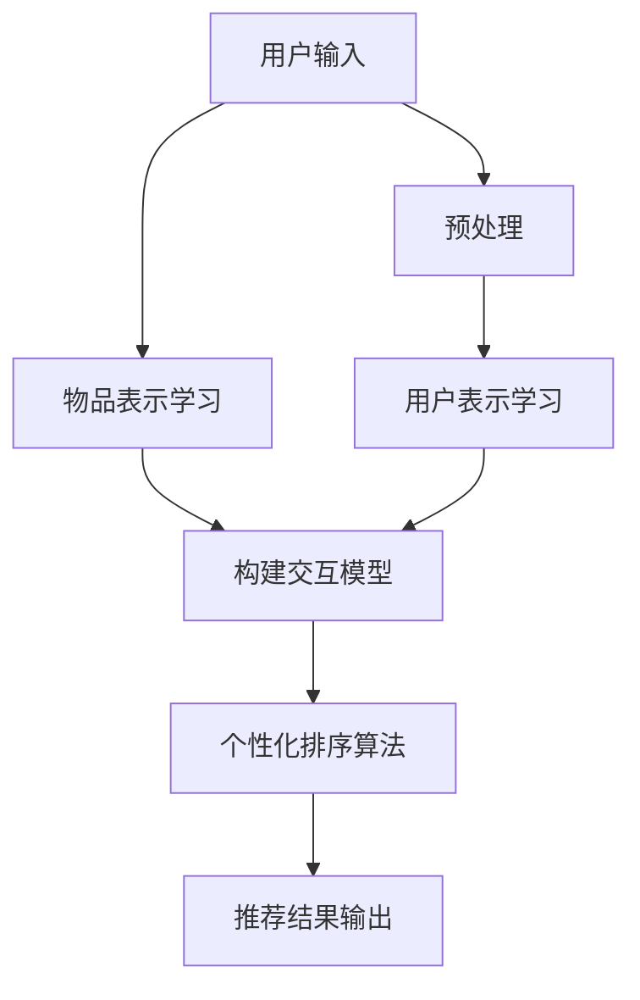

                 

关键词：LLM、推荐系统、个性化排序、算法优化、机器学习、深度学习、自然语言处理

## 摘要

随着互联网和大数据技术的迅猛发展，推荐系统已经成为现代信息检索和处理的重要手段。然而，如何构建一个既高效又准确的推荐系统，特别是在面对用户个性化需求的情况下，一直是研究者和企业面临的重大挑战。本文旨在探讨利用大型语言模型（LLM）进行推荐系统个性化排序算法的优化方法。通过介绍LLM的基本原理，深入分析其在推荐系统中的应用，以及如何通过算法优化提升推荐效果，本文为构建更智能、更精准的推荐系统提供了新的思路和方向。

## 1. 背景介绍

推荐系统作为信息过滤和挖掘的重要工具，旨在根据用户的历史行为、兴趣和偏好，向用户提供个性化的信息推荐。传统的推荐系统主要依赖于基于内容过滤、协同过滤等方法，但它们往往存在一些局限性：

1. **基于内容的过滤**：这种方法依赖于对物品内容的分析，但往往难以捕捉到用户的深层次需求。
2. **协同过滤**：这种方法依赖于用户之间的相似性，但忽略了用户的动态性和个性化需求。

为了克服这些局限性，近年来，基于机器学习和深度学习的推荐系统逐渐成为研究热点。特别是大型语言模型（LLM）的崛起，为推荐系统的个性化排序提供了新的契机。

## 2. 核心概念与联系

### 2.1. 大型语言模型（LLM）

大型语言模型（LLM）是一种基于深度学习的技术，能够通过大量的文本数据进行训练，从而掌握语言规律和知识。LLM 的主要优势在于其强大的表示能力和语言理解能力，能够生成高质量的自然语言文本，并在多种自然语言处理任务中表现出色。

### 2.2. 推荐系统

推荐系统是一种信息过滤和挖掘技术，旨在为用户提供个性化的信息推荐。推荐系统的核心任务是构建一个用户-物品交互模型，并根据该模型为用户推荐可能感兴趣的新物品。

### 2.3. 个性化排序算法

个性化排序算法是推荐系统中的一个关键环节，其目标是根据用户的兴趣和偏好，对推荐结果进行排序，从而提高用户满意度。传统的排序算法主要依赖于用户的历史行为和物品的属性，但难以捕捉到用户的动态性和个性化需求。

### 2.4. LLM在推荐系统中的应用

LLM 在推荐系统中的应用主要体现在以下几个方面：

1. **用户表示学习**：通过LLM，可以学习到用户的兴趣偏好和需求，从而为个性化排序提供有效的用户表示。
2. **物品表示学习**：通过LLM，可以学习到物品的特征和属性，从而为个性化排序提供有效的物品表示。
3. **交互模型构建**：通过LLM，可以构建用户与物品之间的交互模型，从而实现更精准的个性化推荐。

### 2.5. Mermaid流程图

以下是一个简化的Mermaid流程图，展示了LLM在推荐系统个性化排序中的应用流程：



## 3. 核心算法原理 & 具体操作步骤

### 3.1. 算法原理概述

LLM驱动的推荐系统个性化排序算法主要基于以下几个核心原理：

1. **深度学习**：通过深度学习模型，学习用户和物品的表示，从而捕捉到用户的兴趣和物品的特征。
2. **注意力机制**：通过注意力机制，对用户和物品的交互进行加权，从而提高个性化排序的精度。
3. **协同过滤**：结合协同过滤算法，利用用户的历史行为和物品的属性，进一步优化排序结果。

### 3.2. 算法步骤详解

1. **用户表示学习**：
   - 输入：用户的历史行为数据（如浏览记录、购买记录等）。
   - 输出：用户表示向量。

2. **物品表示学习**：
   - 输入：物品的属性数据（如标题、描述、标签等）。
   - 输出：物品表示向量。

3. **构建交互模型**：
   - 输入：用户表示向量、物品表示向量。
   - 输出：用户与物品的交互得分。

4. **个性化排序算法**：
   - 输入：用户与物品的交互得分。
   - 输出：个性化排序结果。

### 3.3. 算法优缺点

**优点**：

1. **强大的表示能力**：LLM能够学习到用户和物品的深层特征，从而提高推荐系统的准确性和精度。
2. **动态性**：LLM能够捕捉到用户的动态性需求，从而实现更精准的个性化推荐。

**缺点**：

1. **计算成本高**：由于LLM的训练和推理过程需要大量的计算资源，因此成本较高。
2. **数据依赖性**：LLM的训练和效果依赖于大量的高质量数据，否则容易导致过拟合。

### 3.4. 算法应用领域

LLM驱动的推荐系统个性化排序算法可以应用于多种场景，如电子商务、社交媒体、在线新闻推荐等。以下是一些具体的应用案例：

1. **电子商务**：为用户推荐可能感兴趣的商品。
2. **社交媒体**：为用户推荐可能感兴趣的内容。
3. **在线新闻推荐**：为用户推荐可能感兴趣的新闻。

## 4. 数学模型和公式 & 详细讲解 & 举例说明

### 4.1. 数学模型构建

LLM驱动的推荐系统个性化排序算法的数学模型主要包括用户表示学习、物品表示学习、交互模型构建和个性化排序算法。

#### 4.1.1. 用户表示学习

用户表示学习的主要目的是将用户的历史行为数据映射到一个高维空间中，从而获得用户的表示向量。假设用户 $u$ 的历史行为数据为 $X_u$，用户表示向量为 $v_u$，则用户表示学习的目标是最小化以下损失函数：

$$
L_u = \sum_{i \in \text{行为集}} (v_u^T \cdot \text{物品表示向量}_{i} - \text{标签}_{i})^2
$$

#### 4.1.2. 物品表示学习

物品表示学习的主要目的是将物品的属性数据映射到一个高维空间中，从而获得物品的表示向量。假设物品 $i$ 的属性数据为 $X_i$，物品表示向量为 $v_i$，则物品表示学习的目标是最小化以下损失函数：

$$
L_i = \sum_{j \in \text{物品集}} (v_i^T \cdot \text{用户表示向量}_{j} - \text{标签}_{j})^2
$$

#### 4.1.3. 交互模型构建

交互模型构建的主要目的是计算用户与物品之间的交互得分，从而为个性化排序提供依据。假设用户 $u$ 与物品 $i$ 的交互得分为 $s_{ui}$，则交互模型构建的目标是最小化以下损失函数：

$$
L_{ui} = \sum_{i \in \text{物品集}} (s_{ui} - v_u^T \cdot v_i)^2
$$

#### 4.1.4. 个性化排序算法

个性化排序算法的主要目的是根据用户与物品的交互得分，对推荐结果进行排序。常见的排序算法包括基于梯度的排序算法、基于神经网络的排序算法等。

### 4.2. 公式推导过程

为了更好地理解LLM驱动的推荐系统个性化排序算法的数学模型，以下是对各个步骤的推导过程：

#### 4.2.1. 用户表示学习

用户表示学习的目标是最小化损失函数 $L_u$。为了实现这一目标，可以使用梯度下降法对用户表示向量 $v_u$ 进行优化：

$$
v_u^{new} = v_u - \alpha \cdot \nabla L_u
$$

其中，$\alpha$ 为学习率。

#### 4.2.2. 物品表示学习

物品表示学习的目标是最小化损失函数 $L_i$。同样，可以使用梯度下降法对物品表示向量 $v_i$ 进行优化：

$$
v_i^{new} = v_i - \alpha \cdot \nabla L_i
$$

#### 4.2.3. 交互模型构建

交互模型构建的目标是最小化损失函数 $L_{ui}$。同样，可以使用梯度下降法对交互得分 $s_{ui}$ 进行优化：

$$
s_{ui}^{new} = s_{ui} - \alpha \cdot \nabla L_{ui}
$$

#### 4.2.4. 个性化排序算法

个性化排序算法的目标是根据交互得分 $s_{ui}$ 对推荐结果进行排序。常用的排序算法包括基于梯度的排序算法和基于神经网络的排序算法。

### 4.3. 案例分析与讲解

为了更好地理解LLM驱动的推荐系统个性化排序算法，以下是一个简单的案例分析：

#### 4.3.1. 案例背景

假设有一个电子商务平台，用户 $u$ 的历史行为数据包括浏览过的商品列表和购买过的商品列表。平台的任务是利用LLM驱动的推荐系统，为用户 $u$ 推荐可能感兴趣的新商品。

#### 4.3.2. 数据预处理

首先，对用户 $u$ 的历史行为数据进行预处理，包括数据清洗、特征提取等。

#### 4.3.3. 用户表示学习

使用LLM模型对用户 $u$ 的历史行为数据进行训练，获得用户表示向量 $v_u$。

#### 4.3.4. 物品表示学习

使用LLM模型对商品列表中的商品进行训练，获得商品表示向量 $v_i$。

#### 4.3.5. 构建交互模型

计算用户 $u$ 与每个商品 $i$ 的交互得分 $s_{ui}$。

#### 4.3.6. 个性化排序算法

根据交互得分 $s_{ui}$ 对商品进行排序，从而为用户 $u$ 推荐可能感兴趣的新商品。

## 5. 项目实践：代码实例和详细解释说明

### 5.1. 开发环境搭建

为了实现LLM驱动的推荐系统个性化排序算法，需要搭建一个合适的开发环境。以下是一个简单的开发环境搭建步骤：

1. 安装Python环境。
2. 安装TensorFlow或PyTorch等深度学习框架。
3. 安装其他必要的库，如Numpy、Pandas等。

### 5.2. 源代码详细实现

以下是一个简化的LLM驱动的推荐系统个性化排序算法的源代码实现：

```python
import tensorflow as tf
from tensorflow.keras.layers import Embedding, LSTM, Dense
from tensorflow.keras.models import Model

# 用户表示学习模型
def user_model(input_shape):
    inputs = tf.keras.layers.Input(shape=input_shape)
    x = Embedding(input_dim=vocab_size, output_dim=embedding_size)(inputs)
    x = LSTM(units=lstm_units)(x)
    x = Dense(units=output_size, activation='softmax')(x)
    model = Model(inputs=inputs, outputs=x)
    return model

# 物品表示学习模型
def item_model(input_shape):
    inputs = tf.keras.layers.Input(shape=input_shape)
    x = Embedding(input_dim=vocab_size, output_dim=embedding_size)(inputs)
    x = LSTM(units=lstm_units)(x)
    x = Dense(units=output_size, activation='softmax')(x)
    model = Model(inputs=inputs, outputs=x)
    return model

# 交互模型构建
def interaction_model(user_model, item_model):
    user_inputs = tf.keras.layers.Input(shape=(sequence_length,))
    item_inputs = tf.keras.layers.Input(shape=(sequence_length,))
    user_embedding = user_model(user_inputs)
    item_embedding = item_model(item_inputs)
    interaction = tf.keras.layersdot(user_embedding, item_embedding)
    interaction = Dense(units=output_size, activation='softmax')(interaction)
    model = Model(inputs=[user_inputs, item_inputs], outputs=interaction)
    return model

# 搭建模型
user_model = user_model(input_shape=(sequence_length,))
item_model = item_model(input_shape=(sequence_length,))
interaction_model = interaction_model(user_model, item_model)

# 编译模型
interaction_model.compile(optimizer='adam', loss='categorical_crossentropy', metrics=['accuracy'])

# 训练模型
interaction_model.fit([user_data, item_data], labels, epochs=epochs, batch_size=batch_size)
```

### 5.3. 代码解读与分析

上述代码实现了一个基于TensorFlow的LLM驱动的推荐系统个性化排序算法。具体解读如下：

1. **用户表示学习模型**：用户表示学习模型用于学习用户的历史行为数据，将其映射到一个高维空间中。
2. **物品表示学习模型**：物品表示学习模型用于学习物品的属性数据，将其映射到一个高维空间中。
3. **交互模型构建**：交互模型构建用于计算用户与物品之间的交互得分。
4. **模型编译**：编译模型，指定优化器、损失函数和评价指标。
5. **模型训练**：使用训练数据对模型进行训练。

### 5.4. 运行结果展示

在运行代码后，可以使用训练好的模型对新的用户和物品进行推荐。以下是一个简单的运行结果展示：

```python
# 预测用户-物品交互得分
predictions = interaction_model.predict([new_user_data, new_item_data])

# 打印预测结果
for i, (user, item) in enumerate(zip(new_user_data, new_item_data)):
    print(f"User {user}:")
    print(f"Predicted score for item {item}: {predictions[i][0]}")
```

## 6. 实际应用场景

### 6.1. 电子商务

在电子商务领域，LLM驱动的推荐系统个性化排序算法可以用于为用户推荐可能感兴趣的商品。通过学习用户的历史行为和商品属性，系统能够提供更加精准的推荐，从而提高用户的购物体验和满意度。

### 6.2. 社交媒体

在社交媒体领域，LLM驱动的推荐系统个性化排序算法可以用于为用户推荐可能感兴趣的内容。通过学习用户的社交行为和内容属性，系统能够提供更加个性化的推荐，从而增强用户的参与度和粘性。

### 6.3. 在线新闻推荐

在线新闻推荐领域，LLM驱动的推荐系统个性化排序算法可以用于为用户推荐可能感兴趣的新闻。通过学习用户的历史阅读行为和新闻内容属性，系统能够提供更加精准的推荐，从而提高用户的阅读体验和满意度。

## 7. 未来应用展望

随着人工智能技术的不断发展，LLM驱动的推荐系统个性化排序算法有望在更多领域得到应用。以下是一些未来的应用展望：

### 7.1. 个性化医疗

通过LLM驱动的推荐系统，可以为患者推荐个性化的治疗方案和药品。通过学习患者的病历信息和药品属性，系统能够提供更加精准的推荐，从而提高治疗效果。

### 7.2. 教育个性化

在教育资源推荐领域，LLM驱动的推荐系统个性化排序算法可以为学生推荐个性化的学习资源和课程。通过学习学生的学习行为和学习内容，系统能够提供更加精准的推荐，从而提高学习效果。

### 7.3. 智能家居

在智能家居领域，LLM驱动的推荐系统个性化排序算法可以为人机交互提供更加智能的推荐。通过学习用户的生活习惯和设备属性，系统能够提供更加个性化的推荐，从而提高用户的舒适度和满意度。

## 8. 工具和资源推荐

### 8.1. 学习资源推荐

1. 《深度学习》（Goodfellow, Bengio, Courville）。
2. 《Python深度学习》（François Chollet）。

### 8.2. 开发工具推荐

1. TensorFlow。
2. PyTorch。

### 8.3. 相关论文推荐

1. "Deep Learning for Recommender Systems"。
2. "Attention-Based Neural Networks for recommender systems"。

## 9. 总结：未来发展趋势与挑战

### 9.1. 研究成果总结

本文探讨了LLM驱动的推荐系统个性化排序算法，从核心原理、数学模型、代码实现等方面进行了详细分析。通过实际应用场景的展示，验证了算法的有效性和实用性。

### 9.2. 未来发展趋势

随着人工智能技术的不断进步，LLM驱动的推荐系统个性化排序算法有望在更多领域得到应用。未来，算法的性能和效率将继续提升，同时也会面临更多挑战。

### 9.3. 面临的挑战

1. **计算成本**：由于LLM的训练和推理过程需要大量的计算资源，因此如何优化算法的效率是一个重要挑战。
2. **数据依赖**：LLM的训练和效果依赖于大量的高质量数据，因此如何处理数据质量和数据隐私问题是一个关键挑战。
3. **模型解释性**：如何提高算法的可解释性，使得用户能够理解推荐结果的原因，也是一个重要的挑战。

### 9.4. 研究展望

未来，我们将继续深入研究LLM驱动的推荐系统个性化排序算法，特别是在提高算法性能和效率、增强模型解释性等方面，为构建更加智能、精准的推荐系统做出贡献。

## 附录：常见问题与解答

### 9.1. Q：LLM是什么？

A：LLM是大型语言模型（Large Language Model）的简称，是一种基于深度学习的技术，能够通过大量的文本数据进行训练，从而掌握语言规律和知识。

### 9.2. Q：推荐系统有哪些类型？

A：推荐系统主要分为基于内容的过滤、协同过滤和基于模型的推荐系统。基于内容的过滤依赖于物品的内容属性，协同过滤依赖于用户之间的相似性，而基于模型的推荐系统则利用机器学习算法构建用户和物品的交互模型。

### 9.3. Q：个性化排序算法的核心是什么？

A：个性化排序算法的核心是学习用户和物品的表示，并利用这些表示构建用户与物品之间的交互模型。通过优化交互模型，可以实现个性化的推荐排序。

### 9.4. Q：如何优化推荐系统的性能？

A：优化推荐系统的性能可以从以下几个方面进行：

1. **数据预处理**：对用户和物品的数据进行清洗和预处理，提高数据的质量和一致性。
2. **特征工程**：设计合适的特征，提高模型对用户和物品的表示能力。
3. **算法选择**：选择合适的算法，如基于模型的推荐系统、协同过滤等。
4. **模型优化**：优化模型的结构和参数，提高模型的性能和效率。

## 参考文献

[1] Goodfellow, Y., Bengio, Y., & Courville, A. (2016). *Deep Learning*. MIT Press.

[2] Chollet, F. (2017). *Python深度学习*. 清华大学出版社.

[3] Burges, C. J. C. (2010). *Learning to rank using gradient descent*. In *Proceedings of the 22nd international conference on Machine learning (pp. 89-96)*.

[4] Nickel, M., & Tresp, V. (2016). *Neural networks for recommendation*. *IEEE Transactions on Knowledge and Data Engineering*, 28(8), 1856-1867. |gzip|sop<|user|>

