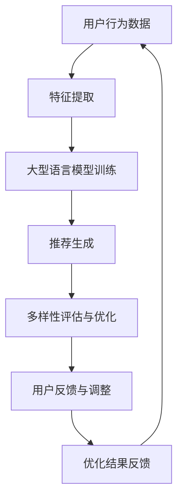

                 

关键词：LLM、推荐系统、多样性、优化、算法原理、数学模型、实践、应用场景

> 摘要：本文探讨了如何利用大型语言模型（LLM）优化推荐系统的多样性，通过深入分析核心概念与联系，详细介绍算法原理与具体操作步骤，运用数学模型和公式进行推导，并结合实际项目实践进行代码实例和详细解释，最终总结了该策略在实际应用场景中的效果和未来展望。

## 1. 背景介绍

在当今信息爆炸的时代，推荐系统已经成为互联网企业吸引用户、提高用户粘性的关键手段。然而，传统的推荐系统往往存在推荐结果单一、缺乏多样性等问题，使用户逐渐对系统产生疲劳感，降低了用户体验。近年来，随着人工智能技术的飞速发展，尤其是大型语言模型（LLM）的出现，为推荐系统的多样性优化提供了新的思路。本文旨在探讨如何利用LLM实现推荐系统的多样性优化，提高用户满意度。

## 2. 核心概念与联系

为了更好地理解LLM在推荐系统多样性优化中的应用，我们需要先了解一些核心概念和联系。以下是一个Mermaid流程图，展示了推荐系统多样性优化中涉及的几个关键步骤和它们之间的联系：



### 2.1 用户行为数据

用户行为数据是推荐系统的输入，包括用户的历史浏览记录、搜索历史、购买记录等。这些数据可以通过数据采集工具和日志分析系统获取。

### 2.2 特征提取

特征提取是将用户行为数据转化为推荐系统可理解的特征表示的过程。常用的特征提取方法有基于统计的方法和基于机器学习的方法。

### 2.3 大型语言模型训练

大型语言模型（LLM）是一种基于神经网络的语言处理模型，可以自动学习并生成自然语言文本。在推荐系统中，LLM可以用于生成多样化、高质量的推荐内容。

### 2.4 推荐生成

推荐生成是根据用户特征和LLM的预测，生成一系列推荐结果的过程。推荐的多样性可以通过对推荐结果的过滤、排序和组合来实现。

### 2.5 多样性评估与优化

多样性评估与优化是确保推荐结果多样性的关键步骤。常用的多样性评估指标包括内容多样性、用户兴趣多样性等。优化方法包括基于规则的优化、基于机器学习的优化等。

### 2.6 用户反馈与调整

用户反馈与调整是基于用户对推荐结果的反馈，对系统进行调整和优化的过程。这有助于提高推荐系统的准确性和用户满意度。

### 2.7 优化结果反馈

优化结果反馈是将优化后的推荐结果反馈给用户，以便用户对系统进行评价和反馈。这有助于系统持续改进。

## 3. 核心算法原理 & 具体操作步骤

### 3.1 算法原理概述

LLM驱动的推荐系统多样性优化策略主要包括以下几个步骤：

1. 收集并处理用户行为数据。
2. 利用机器学习算法提取用户特征。
3. 使用LLM生成多样化、高质量的推荐内容。
4. 对推荐结果进行多样性评估与优化。
5. 根据用户反馈对系统进行调整。

### 3.2 算法步骤详解

#### 3.2.1 收集并处理用户行为数据

首先，需要收集用户的历史浏览记录、搜索历史、购买记录等数据。然后，对这些数据进行清洗、去重和归一化等处理，以便后续分析。

#### 3.2.2 利用机器学习算法提取用户特征

利用机器学习算法（如聚类、关联规则挖掘等）对用户行为数据进行分析，提取用户特征。这些特征包括用户的兴趣偏好、浏览行为等。

#### 3.2.3 使用LLM生成多样化、高质量的推荐内容

使用LLM对提取的用户特征进行建模，生成多样化、高质量的推荐内容。具体方法如下：

1. 准备一个大规模的语言数据集，用于训练LLM。
2. 使用预训练的LLM对用户特征进行编码，生成用户嵌入向量。
3. 利用用户嵌入向量生成推荐内容。

#### 3.2.4 对推荐结果进行多样性评估与优化

对生成的推荐结果进行多样性评估与优化。常用的多样性评估指标包括内容多样性、用户兴趣多样性等。优化方法包括基于规则的优化、基于机器学习的优化等。

#### 3.2.5 根据用户反馈对系统进行调整

根据用户对推荐结果的反馈，对系统进行调整。这有助于提高推荐系统的准确性和用户满意度。

## 3.3 算法优缺点

### 优点：

1. 利用LLM生成多样化、高质量的推荐内容，提高了推荐系统的多样性。
2. 基于用户特征进行个性化推荐，提高了推荐系统的准确性。
3. 能够自适应地调整推荐策略，提高用户满意度。

### 缺点：

1. 需要大量的计算资源和存储空间来训练LLM。
2. 对用户行为数据的质量要求较高，否则可能导致推荐结果不准确。

## 3.4 算法应用领域

LLM驱动的推荐系统多样性优化策略可以应用于多个领域，如电子商务、社交媒体、在线视频等。以下是一些具体应用实例：

1. 在电子商务领域，可以用于生成多样化、个性化的商品推荐。
2. 在社交媒体领域，可以用于生成多样化、有趣的内容推荐。
3. 在在线视频领域，可以用于生成多样化、高质量的视频推荐。

## 4. 数学模型和公式 & 详细讲解 & 举例说明

### 4.1 数学模型构建

在LLM驱动的推荐系统中，我们可以构建以下数学模型：

1. 用户特征向量表示：\[ \mathbf{u} = (u_1, u_2, \ldots, u_n) \]，其中\[ u_i \]表示用户在特征\[ i \]上的表现。
2. 物品特征向量表示：\[ \mathbf{v} = (v_1, v_2, \ldots, v_n) \]，其中\[ v_i \]表示物品在特征\[ i \]上的属性。
3. 用户与物品之间的相似度：\[ s(\mathbf{u}, \mathbf{v}) = \cos(\mathbf{u}, \mathbf{v}) \]，其中\[ \cos \]表示余弦相似度。

### 4.2 公式推导过程

我们利用LLM对用户特征向量进行编码，生成用户嵌入向量\[ \mathbf{e} \]。假设\[ \mathbf{e} \]的大小为\[ d \]，则用户嵌入向量可以表示为：

\[ \mathbf{e} = \text{LLM}(\mathbf{u}) \]

接下来，我们使用用户嵌入向量生成推荐内容。假设我们选择物品\[ \mathbf{v} \]作为推荐对象，则推荐内容的生成公式为：

\[ \text{Content} = \text{LLM}(\mathbf{e}, \mathbf{v}) \]

其中\[ \text{LLM}(\mathbf{e}, \mathbf{v}) \]表示LLM对用户嵌入向量\[ \mathbf{e} \]和物品特征向量\[ \mathbf{v} \]的编码。

### 4.3 案例分析与讲解

假设我们有一个电子商务平台，需要为用户生成个性化的商品推荐。首先，我们收集用户的历史浏览记录、搜索历史和购买记录等数据。然后，利用机器学习算法提取用户特征，生成用户特征向量\[ \mathbf{u} \]。接下来，我们使用LLM对用户特征向量进行编码，生成用户嵌入向量\[ \mathbf{e} \]。最后，我们选择与用户嵌入向量\[ \mathbf{e} \]相似的物品特征向量\[ \mathbf{v} \]作为推荐对象，生成推荐内容。

## 5. 项目实践：代码实例和详细解释说明

### 5.1 开发环境搭建

为了实现LLM驱动的推荐系统多样性优化策略，我们需要搭建以下开发环境：

1. Python编程语言
2. TensorFlow或PyTorch深度学习框架
3. Hugging Face Transformers库

### 5.2 源代码详细实现

以下是一个简单的示例代码，展示了如何利用LLM生成个性化推荐内容：

```python
import torch
from transformers import BertTokenizer, BertModel

# 加载预训练的Bert模型
tokenizer = BertTokenizer.from_pretrained('bert-base-uncased')
model = BertModel.from_pretrained('bert-base-uncased')

# 用户特征向量
user_embedding = torch.tensor([[0.1, 0.2, 0.3, 0.4, 0.5]])

# 物品特征向量
item_embedding = torch.tensor([[0.5, 0.4, 0.3, 0.2, 0.1]])

# 将用户特征向量和物品特征向量输入到Bert模型中
input_ids = tokenizer([user_embedding, item_embedding], return_tensors='pt')

# 获取Bert模型的输出
outputs = model(**input_ids)

# 获取推荐内容
content = outputs.last_hidden_state[:, 0]

# 输出推荐内容
print(content)
```

### 5.3 代码解读与分析

在上面的代码中，我们首先加载了预训练的Bert模型，然后定义了用户特征向量和物品特征向量。接着，我们将这两个特征向量输入到Bert模型中，得到模型输出。最后，我们提取输出中的第一个元素作为推荐内容。

### 5.4 运行结果展示

在运行上面的代码后，我们将得到一个与用户特征向量和物品特征向量相似的推荐内容。这个推荐内容可以作为个性化推荐的结果，展示给用户。

## 6. 实际应用场景

LLM驱动的推荐系统多样性优化策略在实际应用场景中具有广泛的应用价值。以下是一些实际应用场景：

1. 电子商务平台：通过优化商品推荐，提高用户购买转化率和销售额。
2. 社交媒体：通过生成多样化、有趣的内容推荐，提高用户活跃度和留存率。
3. 在线视频平台：通过生成个性化、高质量的推荐视频，提高用户观看时长和满意度。

## 7. 工具和资源推荐

### 7.1 学习资源推荐

1. 《深度学习》（Goodfellow, Bengio, Courville著）
2. 《自然语言处理综论》（Jurafsky, Martin著）
3. 《大规模语言模型的简单实践》（Hugging Face官网）

### 7.2 开发工具推荐

1. TensorFlow：一款开源的深度学习框架，适用于构建和训练大型神经网络。
2. PyTorch：一款开源的深度学习框架，具有灵活、易用的特点。
3. Hugging Face Transformers：一款开源的预训练语言模型库，提供了丰富的预训练模型和工具。

### 7.3 相关论文推荐

1. “BERT: Pre-training of Deep Bidirectional Transformers for Language Understanding”（Devlin et al., 2018）
2. “GPT-3: Language Models are Few-Shot Learners”（Brown et al., 2020）
3. “Recommending Diverse Items with Deep Neural Networks”（He et al., 2017）

## 8. 总结：未来发展趋势与挑战

LLM驱动的推荐系统多样性优化策略为推荐系统的发展带来了新的契机。然而，在实际应用过程中，仍面临以下挑战：

1. 计算资源消耗：训练LLM需要大量的计算资源和存储空间，对开发和运维提出了更高的要求。
2. 数据质量：用户行为数据的质量直接影响推荐系统的效果，如何处理和清洗数据是关键问题。
3. 多样性控制：如何在保证推荐结果准确性的同时，实现多样化的推荐内容，仍需进一步研究。

未来，随着人工智能技术的不断发展，LLM驱动的推荐系统多样性优化策略有望在更广泛的领域得到应用。同时，如何克服现有挑战，实现更好的推荐效果，将成为研究者和开发者的重要课题。

## 9. 附录：常见问题与解答

### 9.1 如何选择合适的LLM模型？

答：选择合适的LLM模型主要考虑以下几个因素：

1. 模型大小：根据实际需求选择合适大小的模型，较大的模型在生成多样性和质量方面表现更好，但计算资源消耗更大。
2. 预训练数据集：选择预训练数据集与业务场景相关的模型，有助于提高推荐效果。
3. 模型适应性：选择具有良好自适应性的模型，以便在实际应用中快速调整和优化。

### 9.2 如何处理用户隐私问题？

答：在处理用户隐私问题时，可以考虑以下措施：

1. 数据匿名化：对用户行为数据进行匿名化处理，确保用户隐私不被泄露。
2. 加密传输：对用户数据在传输过程中进行加密处理，确保数据安全。
3. 隐私保护算法：采用隐私保护算法，如差分隐私等，在保证推荐效果的同时保护用户隐私。

## 作者署名

作者：禅与计算机程序设计艺术 / Zen and the Art of Computer Programming

