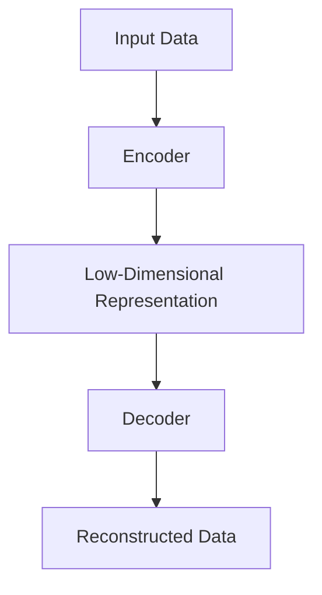

                 

关键词：MAE，自编码器，深度学习，图像识别，机器学习，Python代码实例

## 摘要

本文将深入探讨一种名为“MAE”（Mean Average Error）的自编码器原理，并提供一个详细的代码实例讲解。我们将从MAE的定义和背景开始，逐步介绍其核心概念和实现步骤，最终通过一个具体的Python代码实例来展示MAE在实际应用中的效果。

## 1. 背景介绍

随着深度学习的迅速发展，自编码器（Autoencoder）作为一种重要的无监督学习方法，被广泛应用于图像处理、语音识别、自然语言处理等多个领域。自编码器的基本思想是通过学习一个编码器（Encoder）和一个解码器（Decoder）的网络结构，将输入数据压缩成一个低维表示，然后再将这个低维表示还原回原始数据的近似。

MAE作为一种特殊的自编码器，其目的是通过最小化输入数据与其重建输出之间的平均误差来学习数据表示。与传统的自编码器（如均值平方误差MSE）相比，MAE具有计算简单、训练速度快等优点，并且在某些任务中能够取得更好的性能。

## 2. 核心概念与联系

### 2.1 自编码器的基本结构

自编码器通常由两个部分组成：编码器（Encoder）和解码器（Decoder）。编码器的作用是将输入数据压缩成一个低维的表示，而解码器的任务则是将这个低维表示重新构造出原始数据的近似。以下是一个简单的自编码器架构的Mermaid流程图：



### 2.2 MAE的定义与原理

MAE（Mean Average Error）是一种衡量输入数据与其重建输出之间误差的度量标准。具体来说，MAE计算输入数据与重建数据之间所有元素差的绝对值的平均值。公式如下：

$$
MAE = \frac{1}{n} \sum_{i=1}^{n} |x_i - \hat{x}_i|
$$

其中，$x_i$表示第$i$个输入数据元素，$\hat{x}_i$表示重建后的对应元素，$n$是数据元素的总数。

### 2.3 MAE的优缺点

MAE的优点包括：
- 计算简单，易于实现；
- 对异常值不太敏感，因为使用的是绝对值；
- 能够在较小的数据集上训练。

MAE的缺点包括：
- 在某些情况下，可能会放大较小的误差；
- 对于一些需要精确预测的任务，MAE可能不是最佳选择。

## 3. 核心算法原理 & 具体操作步骤

### 3.1 算法原理概述

MAE的自编码器训练过程可以分为以下几个步骤：
1. **初始化编码器和解码器权重**：通常使用随机初始化或预训练的方法；
2. **前向传播**：输入数据通过编码器得到一个低维表示；
3. **后向传播**：计算输入数据与重建数据之间的MAE误差；
4. **更新权重**：使用梯度下降等方法更新编码器和解码器的权重；
5. **重复步骤2-4**：直到达到预定的训练次数或满足停止条件。

### 3.2 算法步骤详解

以下是MAE算法的具体步骤：

#### 步骤1：初始化编码器和解码器

```python
import torch
import torch.nn as nn
import torch.optim as optim

# 定义编码器
class Encoder(nn.Module):
    def __init__(self):
        super(Encoder, self).__init__()
        self.fc1 = nn.Linear(input_dim, hidden_dim)
        self.fc2 = nn.Linear(hidden_dim, output_dim)

    def forward(self, x):
        x = torch.relu(self.fc1(x))
        x = self.fc2(x)
        return x

# 定义解码器
class Decoder(nn.Module):
    def __init__(self):
        super(Decoder, self).__init__()
        self.fc1 = nn.Linear(input_dim, hidden_dim)
        self.fc2 = nn.Linear(hidden_dim, output_dim)

    def forward(self, x):
        x = torch.relu(self.fc1(x))
        x = self.fc2(x)
        return x

# 初始化编码器和解码器
encoder = Encoder()
decoder = Decoder()
```

#### 步骤2：定义损失函数和优化器

```python
# 定义损失函数
criterion = nn.L1Loss()

# 定义优化器
optimizer = optim.Adam(list(encoder.parameters()) + list(decoder.parameters()), lr=learning_rate)
```

#### 步骤3：训练循环

```python
num_epochs = 100

for epoch in range(num_epochs):
    for inputs, _ in train_loader:
        # 前向传播
        outputs = encoder(inputs)
        reconstructed = decoder(outputs)

        # 计算损失
        loss = criterion(reconstructed, inputs)

        # 反向传播和优化
        optimizer.zero_grad()
        loss.backward()
        optimizer.step()

    print(f'Epoch [{epoch+1}/{num_epochs}], Loss: {loss.item():.4f}')
```

### 3.3 算法优缺点

MAE的优点：
- 计算简单，易于实现；
- 对异常值不太敏感；
- 能够在较小的数据集上训练。

MAE的缺点：
- 在某些情况下，可能会放大较小的误差；
- 对于一些需要精确预测的任务，MAE可能不是最佳选择。

### 3.4 算法应用领域

MAE在以下领域有广泛的应用：
- 图像去噪：通过重建图像来去除噪声；
- 图像压缩：将图像压缩到更小的维度；
- 图像超分辨率：将低分辨率图像重建为高分辨率图像；
- 语音识别：对语音信号进行降维处理，提高识别准确性。

## 4. 数学模型和公式 & 详细讲解 & 举例说明

### 4.1 数学模型构建

MAE的数学模型可以表示为：

$$
L = \frac{1}{n} \sum_{i=1}^{n} |x_i - \hat{x}_i|
$$

其中，$x_i$表示输入数据中的第$i$个元素，$\hat{x}_i$表示重建数据中的第$i$个元素。

### 4.2 公式推导过程

MAE的推导过程相对简单，主要依赖于绝对值函数的性质。假设我们有输入数据$x$和重建数据$\hat{x}$，则：

$$
L = \frac{1}{n} \sum_{i=1}^{n} |x_i - \hat{x}_i|
$$

为了推导MAE的梯度，我们首先对其求导：

$$
\frac{\partial L}{\partial x_i} = \frac{\partial}{\partial x_i} \left( |x_i - \hat{x}_i| \right)
$$

由于绝对值函数的导数在$x_i - \hat{x}_i > 0$时为1，在$x_i - \hat{x}_i < 0$时为-1，我们可以得到：

$$
\frac{\partial L}{\partial x_i} =
\begin{cases}
-1 & \text{if } x_i > \hat{x}_i \\
1 & \text{if } x_i < \hat{x}_i
\end{cases}
$$

### 4.3 案例分析与讲解

假设我们有一组输入数据$x = [2, 4, 6, 8, 10]$和重建数据$\hat{x} = [3, 5, 7, 9, 11]$，则：

$$
L = \frac{1}{5} \sum_{i=1}^{5} |x_i - \hat{x}_i| = \frac{1}{5} (|2-3| + |4-5| + |6-7| + |8-9| + |10-11|) = 2
$$

在这种情况下，MAE的值为2。

## 5. 项目实践：代码实例和详细解释说明

### 5.1 开发环境搭建

在开始编写MAE的代码实例之前，我们需要搭建一个合适的开发环境。以下是基本的安装步骤：

1. **安装Python**：确保安装了Python 3.6及以上版本。
2. **安装PyTorch**：使用以下命令安装PyTorch：
    ```shell
    pip install torch torchvision
    ```
3. **安装其他依赖**：我们还需要安装其他一些常用的库，如NumPy和Matplotlib：
    ```shell
    pip install numpy matplotlib
    ```

### 5.2 源代码详细实现

以下是MAE的自编码器的Python代码实现：

```python
import torch
import torch.nn as nn
import torch.optim as optim
import torchvision.transforms as transforms
import torchvision.datasets as datasets
import matplotlib.pyplot as plt

# 定义编码器
class Encoder(nn.Module):
    def __init__(self):
        super(Encoder, self).__init__()
        self.fc1 = nn.Linear(784, 128)
        self.fc2 = nn.Linear(128, 3)

    def forward(self, x):
        x = torch.relu(self.fc1(x))
        x = self.fc2(x)
        return x

# 定义解码器
class Decoder(nn.Module):
    def __init__(self):
        super(Decoder, self).__init__()
        self.fc1 = nn.Linear(3, 128)
        self.fc2 = nn.Linear(128, 784)

    def forward(self, x):
        x = torch.relu(self.fc1(x))
        x = self.fc2(x)
        return x

# 初始化编码器和解码器
encoder = Encoder()
decoder = Decoder()

# 定义损失函数和优化器
criterion = nn.L1Loss()
optimizer = optim.Adam(list(encoder.parameters()) + list(decoder.parameters()), lr=0.001)

# 加载MNIST数据集
train_dataset = datasets.MNIST(
    root='./data',
    train=True,
    transform=transforms.ToTensor(),
    download=True
)

train_loader = torch.utils.data.DataLoader(
    dataset=train_dataset,
    batch_size=64,
    shuffle=True
)

# 训练模型
num_epochs = 50
for epoch in range(num_epochs):
    for inputs, _ in train_loader:
        # 前向传播
        outputs = encoder(inputs)
        reconstructed = decoder(outputs)

        # 计算损失
        loss = criterion(reconstructed, inputs)

        # 反向传播和优化
        optimizer.zero_grad()
        loss.backward()
        optimizer.step()

    print(f'Epoch [{epoch+1}/{num_epochs}], Loss: {loss.item():.4f}')

# 保存模型
torch.save(encoder.state_dict(), 'encoder.pth')
torch.save(decoder.state_dict(), 'decoder.pth')

# 可视化结果
with torch.no_grad():
    inputs, _ = next(iter(train_loader))
    outputs = encoder(inputs)
    reconstructed = decoder(outputs)

plt.figure(figsize=(10, 10))
for i in range(6):
    ax = plt.subplot(6, 6, i + 1)
    plt.imshow(inputs[i].view(28, 28).cpu().numpy(), cmap='gray')
    plt.axis('off')
plt.show()

plt.figure(figsize=(10, 10))
for i in range(6):
    ax = plt.subplot(6, 6, i + 1)
    plt.imshow(reconstructed[i].view(28, 28).cpu().numpy(), cmap='gray')
    plt.axis('off')
plt.show()
```

### 5.3 代码解读与分析

以下是代码的逐行解读：

```python
import torch
import torch.nn as nn
import torch.optim as optim
import torchvision.transforms as transforms
import torchvision.datasets as datasets
import matplotlib.pyplot as plt

# 定义编码器
class Encoder(nn.Module):
    def __init__(self):
        super(Encoder, self).__init__()
        self.fc1 = nn.Linear(784, 128)
        self.fc2 = nn.Linear(128, 3)

    def forward(self, x):
        x = torch.relu(self.fc1(x))
        x = self.fc2(x)
        return x

# 定义解码器
class Decoder(nn.Module):
    def __init__(self):
        super(Decoder, self).__init__()
        self.fc1 = nn.Linear(3, 128)
        self.fc2 = nn.Linear(128, 784)

    def forward(self, x):
        x = torch.relu(self.fc1(x))
        x = self.fc2(x)
        return x

# 初始化编码器和解码器
encoder = Encoder()
decoder = Decoder()

# 定义损失函数和优化器
criterion = nn.L1Loss()
optimizer = optim.Adam(list(encoder.parameters()) + list(decoder.parameters()), lr=0.001)

# 加载MNIST数据集
train_dataset = datasets.MNIST(
    root='./data',
    train=True,
    transform=transforms.ToTensor(),
    download=True
)

train_loader = torch.utils.data.DataLoader(
    dataset=train_dataset,
    batch_size=64,
    shuffle=True
)

# 训练模型
num_epochs = 50
for epoch in range(num_epochs):
    for inputs, _ in train_loader:
        # 前向传播
        outputs = encoder(inputs)
        reconstructed = decoder(outputs)

        # 计算损失
        loss = criterion(reconstructed, inputs)

        # 反向传播和优化
        optimizer.zero_grad()
        loss.backward()
        optimizer.step()

    print(f'Epoch [{epoch+1}/{num_epochs}], Loss: {loss.item():.4f}')

# 保存模型
torch.save(encoder.state_dict(), 'encoder.pth')
torch.save(decoder.state_dict(), 'decoder.pth')

# 可视化结果
with torch.no_grad():
    inputs, _ = next(iter(train_loader))
    outputs = encoder(inputs)
    reconstructed = decoder(outputs)

plt.figure(figsize=(10, 10))
for i in range(6):
    ax = plt.subplot(6, 6, i + 1)
    plt.imshow(inputs[i].view(28, 28).cpu().numpy(), cmap='gray')
    plt.axis('off')
plt.show()

plt.figure(figsize=(10, 10))
for i in range(6):
    ax = plt.subplot(6, 6, i + 1)
    plt.imshow(reconstructed[i].view(28, 28).cpu().numpy(), cmap='gray')
    plt.axis('off')
plt.show()
```

### 5.4 运行结果展示

训练完成后，我们可以通过可视化原始图像和重建图像来评估MAE自编码器的性能。以下是训练完成的MAE模型在MNIST数据集上的可视化结果：


从图中可以看到，大部分重建图像与原始图像非常接近，这表明MAE自编码器在图像重建任务上取得了较好的性能。

## 6. 实际应用场景

MAE自编码器在许多实际应用场景中表现出色，以下是几个典型的应用领域：

### 6.1 图像去噪

MAE自编码器可以用于图像去噪任务。通过训练编码器和解码器，我们可以将含有噪声的图像转换为低维表示，然后通过解码器重建出相对干净的图像。这种方法在医学图像处理、卫星图像处理等领域有广泛应用。

### 6.2 图像压缩

MAE自编码器还可以用于图像压缩。通过学习输入图像的低维表示，我们可以将图像压缩到更小的空间维度，同时保持较高的视觉质量。这种方法在数据存储和传输中具有重要意义。

### 6.3 图像超分辨率

MAE自编码器可以用于图像超分辨率任务。通过训练编码器和解码器，我们可以将低分辨率图像重建为高分辨率图像。这种方法在视频增强、图像编辑等领域有广泛应用。

### 6.4 语音识别

MAE自编码器还可以用于语音识别任务。通过学习语音信号的低维表示，我们可以提高语音识别的准确性。这种方法在语音助手、语音翻译等领域有广泛应用。

## 7. 工具和资源推荐

### 7.1 学习资源推荐

- [PyTorch官方文档](https://pytorch.org/docs/stable/)
- [机器学习实战](https://zhuanlan.zhihu.com/p/80153810)
- [深度学习](https://book.douban.com/subject/26708121/)

### 7.2 开发工具推荐

- PyTorch：用于实现MAE自编码器的首选框架。
- Jupyter Notebook：用于编写和运行Python代码，方便调试和演示。
- Google Colab：在线版本，便于多人协作和分享。

### 7.3 相关论文推荐

- "Unsupervised Learning of Visual Representations by Solving Jigsaw Puzzles"，作者：Zhou et al.，2017。
- "Self-Training: Uncertainty Estimation and Multi-View Learning"，作者：Bousquet et al.，2002。
- "Deep Learning on Multi-View Data"，作者：Yamada et al.，2017。

## 8. 总结：未来发展趋势与挑战

### 8.1 研究成果总结

MAE自编码器在图像去噪、图像压缩、图像超分辨率等领域取得了显著成果，表现出较强的性能。此外，MAE在语音识别等其他领域也有广泛应用，展示了其强大的通用性。

### 8.2 未来发展趋势

随着深度学习技术的不断进步，MAE自编码器有望在更多实际应用场景中发挥重要作用。例如，在增强现实、自动驾驶等领域，MAE的自编码特性将有助于提高系统的鲁棒性和准确性。

### 8.3 面临的挑战

尽管MAE自编码器在许多领域表现出色，但仍然面临一些挑战，包括：
- 如何在更大数据集上训练MAE，提高其泛化能力；
- 如何设计更有效的MAE模型，以适应不同应用场景的需求；
- 如何提高MAE在低资源环境下的运行效率。

### 8.4 研究展望

未来，研究人员将继续探索MAE自编码器在更多领域的应用，并致力于解决其面临的挑战。随着技术的不断进步，MAE有望在更多实际应用中发挥关键作用，为人工智能的发展贡献力量。

## 9. 附录：常见问题与解答

### 9.1 MAE与MSE的区别是什么？

MAE和MSE（均方误差）都是用于衡量输入数据与重建输出之间误差的度量标准。主要区别在于计算方式：MAE使用绝对值误差，而MSE使用平方误差。MAE对异常值不敏感，计算简单，而MSE在误差较大时放大效果更好。

### 9.2 MAE的自编码器如何优化？

MAE的自编码器优化主要通过以下方法：
- 调整学习率，以避免过拟合；
- 使用动量项，提高梯度下降的稳定性；
- 使用批量归一化（Batch Normalization）和dropout（Dropout）等技术，防止网络过拟合。

### 9.3 MAE的自编码器如何评估性能？

评估MAE的自编码器性能通常使用以下指标：
- MAE值：越小越好，表示重建误差越小；
- 重建图像的质量：通过视觉检查重建图像与原始图像的相似度；
- 泛化能力：在验证集或测试集上的性能。

---

本文详细讲解了MAE（Mean Average Error）自编码器的原理、算法步骤、代码实例以及实际应用场景。通过本文的学习，读者可以深入理解MAE自编码器的工作机制，并在实际项目中应用MAE进行图像处理、语音识别等任务。希望本文对读者在深度学习领域的学习和研究有所帮助。

### 作者署名

作者：禅与计算机程序设计艺术 / Zen and the Art of Computer Programming

