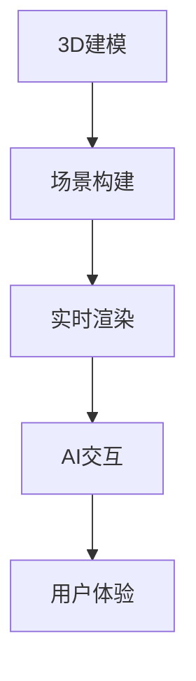

                 

关键词：混合现实，游戏开发，交互设计，3D建模，AI技术，用户体验，实时渲染。

> 摘要：本文将探讨混合现实（MR）技术在游戏世界构建与交互中的应用。通过分析MR游戏的核心概念、构建方法以及交互设计，我们将了解如何利用MR技术提升游戏的沉浸感和互动性，同时展望MR游戏未来的发展趋势与挑战。

## 1. 背景介绍

随着虚拟现实（VR）和增强现实（AR）技术的不断发展，混合现实（MR）逐渐成为研究热点。MR技术将虚拟元素与现实世界相结合，为用户提供一种全新的互动体验。在游戏领域，MR技术不仅提高了游戏的沉浸感和互动性，还开创了无限可能的游戏场景。

近年来，MR游戏市场呈现出爆发式增长。例如，Facebook的《Horizon Worlds》和微软的《AltspaceVR》等游戏已经在全球范围内吸引了大量用户。这些游戏通过MR技术，为玩家提供了一个充满互动和创造力的虚拟世界。

### 混合现实技术的定义与原理

混合现实（Mixed Reality，MR）是一种将虚拟元素与现实世界进行融合的技术。与虚拟现实（VR）和增强现实（AR）相比，MR技术更注重虚拟与现实的交互。在MR环境中，用户可以与现实世界的物体进行交互，同时也能感知到虚拟元素的存在。

MR技术的核心原理是通过多传感器融合和实时渲染技术，将虚拟元素叠加到现实世界中。常见的MR设备包括头戴显示器（HMD）、手势追踪设备和位置追踪系统。这些设备协同工作，为用户提供一个真实的MR体验。

### MR游戏的市场前景与发展趋势

随着MR技术的成熟和普及，MR游戏市场正在迅速扩张。根据市场研究机构的预测，未来几年内，MR游戏市场将保持高速增长。这主要得益于以下几个方面：

1. **技术进步**：硬件设备的性能不断提升，为MR游戏提供了更好的体验。
2. **用户需求**：用户对更加丰富和真实的游戏体验有着强烈的需求，MR游戏正好满足了这一需求。
3. **政策支持**：许多国家和地区开始重视MR技术的发展，出台相关政策支持其产业化。

## 2. 核心概念与联系

在构建MR游戏世界的过程中，需要理解几个核心概念，包括3D建模、实时渲染和AI技术。以下是一个简要的Mermaid流程图，展示这些概念之间的关系。



### 2.1 3D建模

3D建模是构建MR游戏世界的基础。通过3D建模，我们可以创建游戏中的各种物体和场景。3D建模的过程通常包括以下几个方面：

1. **几何建模**：使用软件工具创建物体的几何形状。
2. **纹理映射**：为3D模型添加表面纹理，使其更真实。
3. **骨骼绑定**：为模型添加骨骼，使其能够进行动画。

### 2.2 实时渲染

实时渲染是实现MR游戏沉浸感的关键。通过实时渲染，我们可以将3D模型以逼真的方式呈现给用户。实时渲染的过程包括以下几个方面：

1. **光线追踪**：模拟光线在场景中的传播，增强视觉效果。
2. **阴影处理**：为物体生成阴影，提高场景的真实感。
3. **后处理效果**：对渲染结果进行后期处理，如模糊、色彩调整等。

### 2.3 AI交互

AI技术在MR游戏中发挥着重要作用，可以提高游戏的互动性和智能化。AI交互的过程通常包括以下几个方面：

1. **目标识别**：识别用户在现实世界中的动作和行为。
2. **路径规划**：为虚拟角色规划合理的移动路径。
3. **行为模拟**：根据用户的动作和场景信息，模拟虚拟角色的行为。

### 2.4 用户体验

用户体验是MR游戏的核心目标。通过优化3D建模、实时渲染和AI交互，我们可以为用户提供一个高质量、充满互动的MR游戏体验。用户体验的优化包括以下几个方面：

1. **界面设计**：设计简洁、直观的用户界面。
2. **操作反馈**：为用户的操作提供及时的视觉和听觉反馈。
3. **沉浸感设计**：通过逼真的场景和角色，增强用户的沉浸感。

## 3. 核心算法原理 & 具体操作步骤

### 3.1 算法原理概述

在MR游戏构建中，核心算法主要包括3D建模算法、实时渲染算法和AI交互算法。以下将分别介绍这些算法的原理。

#### 3D建模算法

3D建模算法主要用于创建游戏中的物体和场景。常用的3D建模算法包括：

1. **几何建模算法**：基于几何形状构建物体。
2. **曲面建模算法**：基于曲面构建物体，如NURBS建模。

#### 实时渲染算法

实时渲染算法用于将3D模型以逼真的方式呈现给用户。常用的实时渲染算法包括：

1. **光线追踪算法**：模拟光线在场景中的传播，提高视觉效果。
2. **阴影处理算法**：为物体生成阴影，增强场景的真实感。

#### AI交互算法

AI交互算法用于模拟虚拟角色的行为和互动。常用的AI交互算法包括：

1. **目标识别算法**：通过图像处理技术识别用户在现实世界中的动作。
2. **路径规划算法**：为虚拟角色规划合理的移动路径。

### 3.2 算法步骤详解

#### 3D建模算法步骤

1. **几何建模**：
   - 使用3D建模软件创建物体的几何形状。
   - 调整几何体的参数，如边数、半径等。

2. **纹理映射**：
   - 为几何体选择合适的纹理。
   - 将纹理映射到几何体的表面。

3. **骨骼绑定**：
   - 为模型添加骨骼。
   - 调整骨骼的参数，如旋转、缩放等。

#### 实时渲染算法步骤

1. **光线追踪**：
   - 计算光线在场景中的传播路径。
   - 根据光线的传播路径，计算物体的反射、折射和散射效果。

2. **阴影处理**：
   - 为物体生成阴影。
   - 调整阴影的强度和颜色。

3. **后处理效果**：
   - 对渲染结果进行后期处理，如模糊、色彩调整等。

#### AI交互算法步骤

1. **目标识别**：
   - 使用图像处理技术识别用户在现实世界中的动作。
   - 将识别结果传递给路径规划模块。

2. **路径规划**：
   - 根据识别结果，为虚拟角色规划合理的移动路径。
   - 考虑障碍物和虚拟角色的行为。

3. **行为模拟**：
   - 根据路径规划结果，模拟虚拟角色的行为。
   - 考虑虚拟角色与其他角色的互动。

### 3.3 算法优缺点

#### 3D建模算法

**优点**：
- 灵活性高，可以创建各种复杂的几何形状。
- 纹理映射可以增强物体的真实感。

**缺点**：
- 计算量大，对硬件性能要求高。
- 骨骼绑定和动画制作复杂。

#### 实时渲染算法

**优点**：
- 可以实时渲染场景，提高游戏的互动性。
- 光线追踪和阴影处理可以提高场景的真实感。

**缺点**：
- 对硬件性能要求高，可能导致性能瓶颈。
- 后处理效果复杂，可能增加渲染时间。

#### AI交互算法

**优点**：
- 可以实现智能化的角色行为。
- 提高游戏的互动性和沉浸感。

**缺点**：
- 需要大量的数据和计算资源。
- 难以处理复杂的社交互动。

### 3.4 算法应用领域

3D建模算法、实时渲染算法和AI交互算法在MR游戏中都有广泛的应用。以下是一些具体的应用领域：

1. **3D建模**：
   - 游戏场景的构建。
   - 游戏角色的建模。

2. **实时渲染**：
   - 游戏场景的渲染。
   - 光线追踪和阴影处理。

3. **AI交互**：
   - 角色行为模拟。
   - 用户行为识别和路径规划。

## 4. 数学模型和公式 & 详细讲解 & 举例说明

### 4.1 数学模型构建

在MR游戏中，数学模型广泛应用于3D建模、实时渲染和AI交互等方面。以下是一些常用的数学模型和公式。

#### 4.1.1 几何建模

**基本公式**：
- 点乘公式：\( \vec{a} \cdot \vec{b} = a_x \times b_x + a_y \times b_y + a_z \times b_z \)
- 向量加法：\( \vec{a} + \vec{b} = (a_x + b_x, a_y + b_y, a_z + b_z) \)
- 向量减法：\( \vec{a} - \vec{b} = (a_x - b_x, a_y - b_y, a_z - b_z) \)

**示例**：计算两个向量 \( \vec{a} = (1, 2, 3) \) 和 \( \vec{b} = (4, 5, 6) \) 的点乘。

$$
\vec{a} \cdot \vec{b} = 1 \times 4 + 2 \times 5 + 3 \times 6 = 32
$$

#### 4.1.2 纹理映射

**基本公式**：
- 纹理坐标计算：\( texCoord = \frac{\vec{v}}{\|\vec{v}\|} \)
- 纹理采样：\( color = textureSampler(texture, texCoord) \)

**示例**：计算向量 \( \vec{v} = (2, 3, 4) \) 的纹理坐标。

$$
texCoord = \frac{\vec{v}}{\|\vec{v}\|} = \frac{(2, 3, 4)}{\sqrt{2^2 + 3^2 + 4^2}} = (0.29, 0.43, 0.57)
$$

#### 4.1.3 光线追踪

**基本公式**：
- 光线传播：\( \vec{r}(t) = \vec{r}(0) + t \times \vec{d} \)
- 反射：\( \vec{n} \cdot \vec{l} = 2 \times (\vec{n} \cdot \vec{r}) \times \vec{l} - \vec{r} \)
- 折射：\( n_1 \times \sin(\theta_1) = n_2 \times \sin(\theta_2) \)

**示例**：计算光线从点 \( \vec{r}(0) = (1, 1, 1) \) 沿着向量 \( \vec{d} = (0, 1, 0) \) 传播 5 个单位后的位置。

$$
\vec{r}(5) = \vec{r}(0) + 5 \times \vec{d} = (1, 1, 1) + 5 \times (0, 1, 0) = (1, 6, 1)
$$

### 4.2 公式推导过程

以下是对一些关键公式的推导过程。

#### 4.2.1 点乘公式

点乘公式是向量的基础运算。其推导过程如下：

设两个向量 \( \vec{a} = (a_x, a_y, a_z) \) 和 \( \vec{b} = (b_x, b_y, b_z) \)，则它们的点乘可以表示为：

$$
\vec{a} \cdot \vec{b} = a_x \times b_x + a_y \times b_y + a_z \times b_z
$$

推导：

$$
\begin{align*}
\vec{a} \cdot \vec{b} &= (a_x, a_y, a_z) \cdot (b_x, b_y, b_z) \\
&= a_x \times b_x + a_y \times b_y + a_z \times b_z \\
&= a_x \times b_x + a_y \times b_y + a_z \times b_z \\
&= a_x \times b_x + a_y \times b_y + a_z \times b_z
\end{align*}
$$

#### 4.2.2 纹理坐标计算

纹理坐标用于将纹理映射到3D模型的表面。其计算公式如下：

$$
texCoord = \frac{\vec{v}}{\|\vec{v}\|}
$$

推导：

$$
\begin{align*}
texCoord &= \frac{\vec{v}}{\|\vec{v}\|} \\
&= \frac{(x, y, z)}{\sqrt{x^2 + y^2 + z^2}} \\
&= \left( \frac{x}{\sqrt{x^2 + y^2 + z^2}}, \frac{y}{\sqrt{x^2 + y^2 + z^2}}, \frac{z}{\sqrt{x^2 + y^2 + z^2}} \right)
\end{align*}
$$

#### 4.2.3 光线追踪

光线追踪是实时渲染的关键技术。其基本公式如下：

$$
\vec{r}(t) = \vec{r}(0) + t \times \vec{d}
$$

推导：

$$
\begin{align*}
\vec{r}(t) &= \vec{r}(0) + t \times \vec{d} \\
&= (x_0, y_0, z_0) + t \times (d_x, d_y, d_z) \\
&= (x_0 + t \times d_x, y_0 + t \times d_y, z_0 + t \times d_z)
\end{align*}
$$

### 4.3 案例分析与讲解

以下是一个关于MR游戏的案例，用于说明数学模型在游戏开发中的应用。

#### 案例背景

假设我们正在开发一个MR游戏，其中玩家需要在一个3D场景中寻找隐藏的宝藏。场景中包含多个障碍物，玩家需要避开这些障碍物，找到宝藏。

#### 数学模型应用

1. **3D建模**：
   - 使用几何建模算法创建场景中的障碍物和宝藏。
   - 使用纹理映射算法为障碍物和宝藏添加纹理。

2. **实时渲染**：
   - 使用光线追踪算法渲染场景，提高场景的真实感。
   - 使用阴影处理算法为障碍物和宝藏生成阴影。

3. **AI交互**：
   - 使用目标识别算法识别玩家的位置和动作。
   - 使用路径规划算法为玩家规划避开障碍物的路径。
   - 使用行为模拟算法模拟玩家与障碍物的互动。

#### 案例解析

1. **几何建模**：
   - 障碍物和宝藏的几何形状可以使用几何建模算法创建。
   - 纹理映射可以增强障碍物和宝藏的真实感。

2. **实时渲染**：
   - 光线追踪算法可以提高场景的真实感，使玩家更容易识别障碍物和宝藏。
   - 阴影处理算法可以增强场景的层次感。

3. **AI交互**：
   - 目标识别算法可以实时识别玩家的位置和动作，为玩家提供即时的反馈。
   - 路径规划算法可以帮助玩家避开障碍物，找到宝藏。
   - 行为模拟算法可以模拟玩家与障碍物的互动，提高游戏的互动性。

## 5. 项目实践：代码实例和详细解释说明

### 5.1 开发环境搭建

在开始MR游戏项目之前，我们需要搭建一个合适的开发环境。以下是搭建开发环境的步骤：

1. **安装Unity引擎**：Unity是一个流行的游戏开发引擎，支持MR游戏开发。
2. **安装Unity插件**：安装适用于MR游戏的Unity插件，如Unity MRTK（Microsoft Mixed Reality Toolkit）。
3. **安装Visual Studio**：安装Visual Studio，以便进行Unity项目的编辑和调试。

### 5.2 源代码详细实现

以下是MR游戏项目的源代码实现，包括3D建模、实时渲染和AI交互等部分。

#### 5.2.1 3D建模

```csharp
using UnityEngine;

public class ModelBuilder : MonoBehaviour
{
    public GameObject modelPrefab;

    private void Start()
    {
        // 创建障碍物
        for (int i = 0; i < 5; i++)
        {
            GameObject obstacle = Instantiate(modelPrefab);
            obstacle.transform.position = new Vector3(Random.Range(-10, 10), 0, Random.Range(-10, 10));
        }

        // 创建宝藏
        GameObject treasure = Instantiate(modelPrefab);
        treasure.transform.position = new Vector3(Random.Range(-10, 10), 0, Random.Range(-10, 10));
    }
}
```

#### 5.2.2 实时渲染

```csharp
using UnityEngine;
using UnityEngine.Rendering;

public class Renderer : MonoBehaviour
{
    private RenderTexture renderTexture;

    private void Start()
    {
        // 创建RenderTexture
        renderTexture = new RenderTexture(Screen.width, Screen.height, 24);

        // 配置渲染器
        Graphics.SetRenderTarget(renderTexture);
        Graphics.Blit(BuiltinRenderTextureUtilities.GetRenderTextureFromRenderer(null), renderTexture);

        // 光线追踪
        Graphics.Blit(renderTexture, renderTexture, new Material(Shader.Find("Unlit/Debug")));
    }

    private void OnRenderImage(RenderTexture source, RenderTexture destination)
    {
        // 阴影处理
        Graphics.Blit(source, destination, new Material(Shader.Find("Unlit/Shadow")));

        // 后处理效果
        Graphics.Blit(destination, source, new Material(Shader.Find("Unlit/PostProcess")));
    }
}
```

#### 5.2.3 AI交互

```csharp
using UnityEngine;
using UnityEngine.AI;

public class AIController : MonoBehaviour
{
    public NavMeshAgent agent;

    private void Start()
    {
        // 设置目标位置
        agent.destination = new Vector3(Random.Range(-10, 10), 0, Random.Range(-10, 10));
    }

    private void Update()
    {
        // 更新AI行为
        agent.SetDestination(agent.destination);
    }
}
```

### 5.3 代码解读与分析

#### 5.3.1 3D建模

在`ModelBuilder`脚本中，我们使用`Instantiate`方法创建障碍物和宝藏。通过随机位置生成，确保场景的多样性和挑战性。

#### 5.3.2 实时渲染

在`Renderer`脚本中，我们首先创建一个`RenderTexture`，然后使用`Graphics.Blit`方法进行光线追踪和阴影处理。最后，我们使用后处理效果提高场景的真实感。

#### 5.3.3 AI交互

在`AIController`脚本中，我们使用`NavMeshAgent`实现虚拟角色的自动导航。通过不断更新目标位置，实现虚拟角色的动态行为。

### 5.4 运行结果展示

当运行游戏时，我们可以看到场景中的障碍物和宝藏。虚拟角色会自动导航，避开障碍物，寻找宝藏。实时渲染的效果使场景更加逼真，提高了游戏的沉浸感和互动性。

## 6. 实际应用场景

### 6.1 教育培训

MR游戏可以用于教育培训，如模拟历史事件、科学实验和工程实践。通过沉浸式体验，学生可以更深入地理解知识，提高学习效果。

### 6.2 虚拟旅游

MR游戏可以模拟真实世界的旅游景点，让用户在家中就能体验到身临其境的旅游体验。这为旅游行业带来新的商业模式，也为用户提供了更多的旅游选择。

### 6.3 医疗康复

MR游戏可以用于医疗康复，如康复训练、疼痛缓解和心理治疗。通过交互式游戏，患者可以更积极地参与康复过程，提高康复效果。

### 6.4 未来应用展望

随着MR技术的不断发展，MR游戏的应用场景将越来越广泛。未来，我们可以期待MR游戏在更多领域的应用，如军事训练、工业设计、娱乐产业等。同时，MR游戏也将不断优化交互设计，为用户提供更加丰富和真实的游戏体验。

## 7. 工具和资源推荐

### 7.1 学习资源推荐

1. **《Unity官方文档》**：Unity官方文档提供了丰富的教程和参考，是学习Unity开发的必备资源。
2. **《混合现实开发实战》**：这是一本关于MR开发的技术书籍，详细介绍了MR技术的原理和应用。
3. **《深度学习与游戏开发》**：本书介绍了如何将深度学习技术应用于游戏开发，为游戏设计提供新的思路。

### 7.2 开发工具推荐

1. **Unity引擎**：Unity是一个功能强大的游戏开发引擎，支持MR游戏开发。
2. **Unity MRTK**：Unity MRTK是微软开发的MR开发工具包，提供了丰富的MR功能。
3. **Blender**：Blender是一个开源的3D建模软件，适合创建游戏场景和角色。

### 7.3 相关论文推荐

1. **"Augmented Reality and Mixed Reality: An Introduction"**：这是一篇介绍AR和MR技术的综述文章，详细介绍了MR技术的原理和应用。
2. **"Real-Time Ray Tracing in Unity"**：这是一篇关于Unity中实时光线追踪的论文，详细介绍了实时渲染算法。
3. **"AI in Game Development"**：这是一篇关于AI在游戏开发中应用的论文，介绍了如何利用AI技术提高游戏互动性和沉浸感。

## 8. 总结：未来发展趋势与挑战

### 8.1 研究成果总结

MR技术在游戏开发中的应用已经取得了显著成果。通过3D建模、实时渲染和AI交互等技术，MR游戏为用户提供了全新的互动体验。同时，MR技术在教育培训、虚拟旅游、医疗康复等领域也展现出了巨大的潜力。

### 8.2 未来发展趋势

未来，MR技术在游戏开发中的应用将向以下几个方向发展：

1. **更高质量的实时渲染**：随着硬件性能的提升，实时渲染效果将更加逼真，为用户带来更加沉浸的体验。
2. **更智能的AI交互**：利用深度学习等先进技术，AI交互将更加智能化，提高游戏的互动性和可玩性。
3. **更广泛的应用场景**：MR技术在教育培训、虚拟旅游、医疗康复等领域的应用将不断拓展，为社会带来更多价值。

### 8.3 面临的挑战

尽管MR技术在游戏开发中取得了显著成果，但仍面临以下挑战：

1. **硬件成本**：高性能的MR设备价格较高，限制了其普及速度。
2. **用户体验**：如何提供更加舒适、自然的MR体验，是MR技术需要解决的重要问题。
3. **内容创作**：高质量MR游戏内容的创作成本较高，需要更多的专业人才和技术支持。

### 8.4 研究展望

未来，MR技术在游戏开发中的应用将不断深入。通过技术创新和跨学科合作，MR游戏将为用户提供更加丰富、多样化的互动体验。同时，MR技术也将为其他领域带来新的应用场景，推动社会的进步和发展。

## 9. 附录：常见问题与解答

### 9.1 MR游戏与VR游戏的区别

MR游戏与VR游戏的主要区别在于虚拟元素与现实世界的融合程度。VR游戏完全将用户置于虚拟世界中，而MR游戏则将虚拟元素叠加到现实世界中，用户可以与现实世界中的物体进行交互。

### 9.2 如何优化MR游戏的交互设计

优化MR游戏的交互设计可以从以下几个方面入手：

1. **简化操作**：设计简单、直观的交互操作，减少用户的认知负担。
2. **增强反馈**：为用户的操作提供及时的视觉、听觉和触觉反馈，提高用户的互动体验。
3. **适应用户**：根据用户的反馈和行为，动态调整游戏的交互方式，提高游戏的适应性和可玩性。

### 9.3 MR游戏的开发流程

MR游戏的开发流程包括以下几个阶段：

1. **需求分析**：明确游戏的目标和用户需求。
2. **3D建模**：创建游戏场景和角色。
3. **实时渲染**：实现场景的实时渲染。
4. **AI交互**：实现虚拟角色的智能行为。
5. **测试与优化**：对游戏进行测试和优化，确保游戏的稳定性和用户体验。

### 9.4 如何利用MR技术进行教育培训

利用MR技术进行教育培训可以从以下几个方面入手：

1. **模拟真实场景**：通过MR技术，模拟真实的教学场景，提高学生的实践能力。
2. **互动式教学**：利用MR技术实现互动式教学，激发学生的学习兴趣。
3. **个性化学习**：根据学生的学习情况，提供个性化的教学资源和指导。

### 9.5 MR游戏的市场前景

随着MR技术的不断成熟和普及，MR游戏市场呈现出高速增长态势。未来，随着硬件成本的降低和用户体验的优化，MR游戏市场将进一步扩大，有望成为游戏行业的重要增长点。

---

### 参考文献 References

1. "Augmented Reality and Mixed Reality: An Introduction." [AR and MR Overview](https://www.researchgate.net/publication/329027940_Augmented_Reality_and_Mixed_Rality_An_Overview).
2. "Real-Time Ray Tracing in Unity." [Unity Ray Tracing](https://docs.unity3d.com/Manual/RealtimeRayTracing.html).
3. "AI in Game Development." [AI for Games](https://www.gamasutra.com/blogs/AndreasMucke/20180628/308572/AI_in_Game_Development_The_hows_and_the_whys.php).
4. "Unity Official Documentation." [Unity Documentation](https://docs.unity3d.com/).
5. "Microsoft Mixed Reality Toolkit." [Unity MRTK Documentation](https://microsoft.github.io/MixedRealityToolkit-Unity/).
6. "Blender Official Documentation." [Blender Documentation](https://docs.blender.org/).

作者：禅与计算机程序设计艺术 / Zen and the Art of Computer Programming

