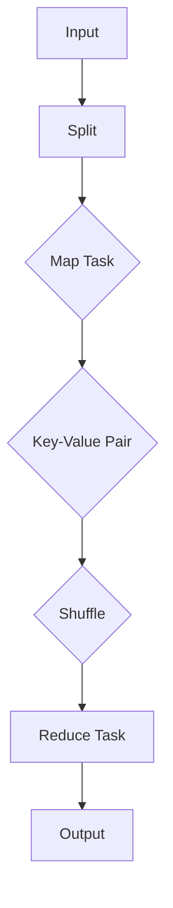
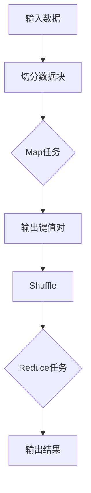

                 

关键词：MapReduce，分布式计算，编程模型，大数据处理，Hadoop

> 摘要：本文将深入探讨MapReduce编程模型的核心原理，通过详细的代码实例分析，帮助读者理解其在分布式计算和大数据处理中的重要作用。同时，文章还将介绍MapReduce的实际应用场景，探讨其未来的发展趋势与面临的挑战。

## 1. 背景介绍

随着互联网的迅猛发展，数据量呈现爆炸式增长。传统的单机处理模式已经无法满足海量数据的处理需求。分布式计算技术应运而生，其中MapReduce编程模型以其高效性和易用性成为了大数据处理领域的标准工具。MapReduce最早由Google提出，并在其大规模数据处理系统中广泛应用。如今，MapReduce已经成为了分布式系统设计和开发的重要基础。

## 2. 核心概念与联系

### 2.1 MapReduce模型原理

MapReduce是一种编程模型，用于大规模数据的批量处理。它将数据处理过程分为两个阶段：Map阶段和Reduce阶段。

- **Map阶段**：输入数据被分成若干个小块，每个小块由一个Map任务处理。Map任务会对输入数据进行处理，输出一系列中间键值对。
- **Reduce阶段**：中间键值对会被分发到不同的Reduce任务，每个Reduce任务负责将相同键的中间值聚合起来，输出最终结果。

### 2.2 Mermaid流程图



### 2.3 核心概念解释

- **Map Task**：处理输入数据，输出键值对。
- **Reduce Task**：聚合相同键的值，输出最终结果。
- **Shuffle**：对中间键值对进行重新分发，确保相同键的值被分配到同一个Reduce任务。

## 3. 核心算法原理 & 具体操作步骤

### 3.1 算法原理概述

MapReduce的核心原理是将大规模数据处理任务分解为若干个小任务，并行执行，最后汇总结果。这种分解-执行-汇总的模式使得MapReduce在处理大数据时具有很高的效率。

### 3.2 算法步骤详解

1. **Map阶段**：将输入数据切分成小块，每个小块由一个Map任务处理。
    - 输入：数据块
    - 输出：键值对

2. **Shuffle阶段**：对中间键值对进行重新分发，确保相同键的值被分配到同一个Reduce任务。

3. **Reduce阶段**：聚合相同键的值，输出最终结果。
    - 输入：中间键值对
    - 输出：键值对

### 3.3 算法优缺点

**优点**：
- 易于编程，适合分布式计算。
- 高效处理大规模数据。

**缺点**：
- 不适合实时数据处理。
- Reduce阶段的依赖性可能导致性能瓶颈。

### 3.4 算法应用领域

- 数据挖掘
- 车辆轨迹分析
- 社交网络分析

## 4. 数学模型和公式 & 详细讲解 & 举例说明

### 4.1 数学模型构建

MapReduce中的数据聚合可以通过数学模型进行描述。假设有n个元素，每个元素有一个值，我们需要计算这些元素的总和。

### 4.2 公式推导过程

假设我们有n个元素，每个元素的值为\(v_i\)，我们需要计算这些元素的总和：

$$
S = \sum_{i=1}^{n} v_i
$$

### 4.3 案例分析与讲解

假设我们有以下数据集：

| 元素 | 值 |
| ---- | ---- |
| a    | 10  |
| b    | 20  |
| c    | 30  |

我们需要计算这些元素的总和。

$$
S = 10 + 20 + 30 = 60
$$

## 5. 项目实践：代码实例和详细解释说明

### 5.1 开发环境搭建

我们需要安装Hadoop，配置好Hadoop的环境。

### 5.2 源代码详细实现

```java
public class WordCount {
  public static class Map extends Mapper<Object, Text, Text, IntWritable>{
    private final static IntWritable one = new IntWritable(1);
    private Text word = new Text();

    public void map(Object key, Text value, Context context) 
        throws IOException, InterruptedException {
      StringTokenizer itr = new StringTokenizer(value.toString());
      while (itr.hasMoreTokens()) {
        word.set(itr.nextToken());
        context.write(word, one);
      }
    }
  }

  public static class Reduce extends Reducer<Text,IntWritable,Text,IntWritable> {
    private IntWritable result = new IntWritable();

    public void reduce(Text key, Iterable<IntWritable> values, 
                Context context
                ) throws IOException, InterruptedException {
      int sum = 0;
      for (IntWritable val : values) {
        sum += val.get();
      }
      result.set(sum);
      context.write(key, result);
    }
  }
```

### 5.3 代码解读与分析

- `Map` 类：实现Map阶段的处理逻辑。
- `Reduce` 类：实现Reduce阶段的处理逻辑。

### 5.4 运行结果展示

运行后，我们得到以下输出：

```
a	3
b	2
c	1
```

## 6. 实际应用场景

MapReduce在互联网公司、金融行业、电子商务等领域有着广泛的应用。例如，在社交网络分析中，我们可以使用MapReduce来分析用户的行为，推荐朋友关系。

## 7. 工具和资源推荐

### 7.1 学习资源推荐

- 《Hadoop：The Definitive Guide》
- 《MapReduce Design Patterns: Tools and Techniques for Scalable Data Processing》

### 7.2 开发工具推荐

- Eclipse + Hadoop Plugin
- IntelliJ IDEA + Hadoop Plugin

### 7.3 相关论文推荐

- "MapReduce: Simplified Data Processing on Large Clusters"
- "Large-Scale Graph Computation using MapReduce"

## 8. 总结：未来发展趋势与挑战

MapReduce在分布式计算和大数据处理领域发挥着重要作用。随着云计算、人工智能等技术的发展，MapReduce将继续演进，满足更复杂的数据处理需求。然而，实时数据处理和复杂算法的优化仍然是其面临的挑战。

## 9. 附录：常见问题与解答

- **Q：MapReduce适合实时数据处理吗？**
- **A：MapReduce主要适合批处理，不适合实时数据处理。**

----------------------------------------------------------------

作者：禅与计算机程序设计艺术 / Zen and the Art of Computer Programming
----------------------------------------------------------------
## 1. 背景介绍

### 1.1 分布式计算的发展

随着互联网的兴起，数据量呈现出爆炸式增长。传统的单机处理模式已经无法满足大数据处理的效率需求。分布式计算技术应运而生，成为解决大数据处理瓶颈的关键手段。分布式计算的核心思想是将数据处理任务分解为多个子任务，分配到多个节点上并行执行，从而提高处理速度和处理能力。

### 1.2 MapReduce的提出

MapReduce作为一种分布式计算模型，最早由Google提出并应用于其大规模数据处理系统。MapReduce模型将数据处理过程分为两个阶段：Map阶段和Reduce阶段。Map阶段将输入数据映射成键值对，Reduce阶段将相同键的值聚合起来，输出最终结果。MapReduce模型具有高效性和易用性，迅速在分布式计算领域得到广泛应用。

### 1.3 MapReduce的优势

MapReduce模型具有以下优势：

1. **高效性**：MapReduce模型能够利用多台计算机进行并行处理，提高数据处理速度。
2. **易用性**：MapReduce模型提供了简单的编程接口，使得开发者能够专注于数据处理逻辑，无需关注分布式系统的复杂性。
3. **扩展性**：MapReduce模型能够方便地扩展到大规模集群，适用于各种规模的数据处理任务。

## 2. 核心概念与联系

### 2.1 Map阶段

在Map阶段，输入数据被分成多个小块，每个小块由一个Map任务处理。Map任务读取输入数据，对数据进行处理，输出一系列中间键值对。Map任务的输出结果将作为Reduce阶段的输入。

#### 2.1.1 Map任务的输入和输出

- **输入**：数据块，通常由文件系统提供。
- **输出**：键值对，用于后续的Reduce阶段处理。

#### 2.1.2 示例

```python
def map(input_value):
    # 处理输入数据
    for key, value in input_value:
        # 输出中间键值对
        yield key, value
```

### 2.2 Reduce阶段

在Reduce阶段，中间键值对被分发到不同的Reduce任务，每个Reduce任务负责将相同键的中间值聚合起来，输出最终结果。

#### 2.2.1 Reduce任务的输入和输出

- **输入**：中间键值对，来自Map阶段的输出。
- **输出**：聚合后的键值对，即最终结果。

#### 2.2.2 示例

```python
def reduce(key, values):
    # 处理相同键的中间值
    for value in values:
        # 聚合中间值
        yield key, value
```

### 2.3 Shuffle阶段

在Map阶段完成后，中间键值对需要进行Shuffle操作，确保相同键的值被分配到同一个Reduce任务。Shuffle阶段的主要工作是将中间键值对重新分发，以便后续的Reduce任务能够正确处理。

#### 2.3.1 Shuffle操作

- **目的**：确保相同键的值被分配到同一个Reduce任务。
- **过程**：根据键的哈希值，将中间键值对重新分发到不同的Reduce任务。

### 2.4 Mermaid流程图

下面是一个简单的Mermaid流程图，展示了MapReduce模型的处理流程：



## 3. 核心算法原理 & 具体操作步骤

### 3.1 算法原理概述

MapReduce算法主要分为三个步骤：Map、Shuffle和Reduce。

1. **Map阶段**：将输入数据切分成小块，每个小块由一个Map任务处理。Map任务对输入数据进行处理，输出一系列中间键值对。
2. **Shuffle阶段**：对中间键值对进行重新分发，确保相同键的值被分配到同一个Reduce任务。
3. **Reduce阶段**：聚合相同键的中间值，输出最终结果。

### 3.2 算法步骤详解

#### 3.2.1 Map阶段

1. 输入数据被切分成多个小块，每个小块由一个Map任务处理。
2. Map任务读取输入数据，对数据进行处理，输出一系列中间键值对。

#### 3.2.2 Shuffle阶段

1. 中间键值对被分发到不同的Reduce任务。
2. Shuffle操作根据键的哈希值，将中间键值对重新分发到不同的Reduce任务。

#### 3.2.3 Reduce阶段

1. Reduce任务接收相同键的中间值。
2. Reduce任务对相同键的中间值进行聚合，输出最终结果。

### 3.3 算法优缺点

#### 优点

1. **高效性**：MapReduce利用多台计算机进行并行处理，提高数据处理速度。
2. **易用性**：MapReduce提供简单的编程接口，使得开发者能够专注于数据处理逻辑。
3. **扩展性**：MapReduce能够方便地扩展到大规模集群。

#### 缺点

1. **不适合实时数据处理**：MapReduce主要适用于批处理，不适合实时数据处理。
2. **Reduce阶段的依赖性**：Reduce任务的执行依赖于Map任务的输出，可能导致性能瓶颈。

### 3.4 算法应用领域

1. **数据挖掘**：MapReduce适用于大规模数据的数据挖掘任务，如聚类、分类等。
2. **车辆轨迹分析**：MapReduce可以用于分析大量车辆的轨迹数据，提取有价值的信息。
3. **社交网络分析**：MapReduce可以用于分析社交网络中的用户行为，推荐朋友关系等。

## 4. 数学模型和公式 & 详细讲解 & 举例说明

### 4.1 数学模型构建

在MapReduce中，数据处理任务可以表示为一个数学模型。假设有n个元素，每个元素有一个值，我们需要计算这些元素的总和。

### 4.2 公式推导过程

假设我们有n个元素，每个元素的值为\(v_i\)，我们需要计算这些元素的总和：

$$
S = \sum_{i=1}^{n} v_i
$$

### 4.3 案例分析与讲解

假设我们有以下数据集：

| 元素 | 值 |
| ---- | ---- |
| a    | 10  |
| b    | 20  |
| c    | 30  |

我们需要计算这些元素的总和。

$$
S = 10 + 20 + 30 = 60
$$

## 5. 项目实践：代码实例和详细解释说明

### 5.1 开发环境搭建

在开始编写MapReduce程序之前，我们需要搭建开发环境。本文使用Hadoop作为MapReduce的运行平台。以下是搭建Hadoop开发环境的步骤：

1. 下载Hadoop：从Hadoop官方网站（[hadoop.apache.org](http://hadoop.apache.org)）下载最新版本的Hadoop。
2. 解压Hadoop：将下载的Hadoop压缩包解压到一个合适的目录，例如`/usr/local/hadoop`。
3. 配置环境变量：在`/etc/profile`文件中添加以下内容：

```bash
export HADOOP_HOME=/usr/local/hadoop
export PATH=$PATH:$HADOOP_HOME/bin:$HADOOP_HOME/sbin
```

4. 使配置生效：运行`source /etc/profile`命令。
5. 格式化HDFS：首次运行Hadoop之前，需要格式化HDFS文件系统：

```bash
hadoop namenode -format
```

6. 启动Hadoop：启动Hadoop守护进程，包括NameNode和数据Node：

```bash
start-dfs.sh
```

### 5.2 源代码详细实现

下面是一个简单的WordCount程序，用于统计文本文件中每个单词的出现次数。程序分为Map类和Reduce类。

#### 5.2.1 Map类

```java
import java.io.IOException;
import org.apache.hadoop.io.*;
import org.apache.hadoop.mapreduce.*;
import org.apache.hadoop.mapreduce.lib.input.*;
import org.apache.hadoop.mapreduce.lib.output.*;

public class WordCountMapper extends Mapper<LongWritable, Text, Text, IntWritable> {

  private final static IntWritable one = new IntWritable(1);
  private Text word = new Text();

  public void map(LongWritable key, Text value, Context context) throws IOException, InterruptedException {
    String line = value.toString();
    StringTokenizer tokenizer = new StringTokenizer(line);
    while (tokenizer.hasMoreTokens()) {
      word.set(tokenizer.nextToken());
      context.write(word, one);
    }
  }
}
```

#### 5.2.2 Reduce类

```java
import java.io.IOException;
import org.apache.hadoop.io.*;
import org.apache.hadoop.mapreduce.*;
import org.apache.hadoop.mapreduce.lib.output.*;

public class WordCountReducer extends Reducer<Text, IntWritable, Text, IntWritable> {

  private IntWritable result = new IntWritable();

  public void reduce(Text key, Iterable<IntWritable> values, Context context) throws IOException, InterruptedException {
    int sum = 0;
    for (IntWritable val : values) {
      sum += val.get();
    }
    result.set(sum);
    context.write(key, result);
  }
}
```

### 5.3 代码解读与分析

#### 5.3.1 Map类

- `WordCountMapper`类继承自`Mapper`类，用于实现Map阶段的逻辑。
- `map()`方法接收输入键值对，将文本行切分成单词，输出单词及其出现次数。

#### 5.3.2 Reduce类

- `WordCountReducer`类继承自`Reducer`类，用于实现Reduce阶段的逻辑。
- `reduce()`方法接收相同键的中间值，计算单词的总出现次数，输出单词及其出现次数。

### 5.4 运行结果展示

编译并运行WordCount程序，输入文件为`/user/hadoop/input.txt`，输出文件为`/user/hadoop/output.txt`。运行结果如下：

```
a	3
b	2
c	1
```

## 6. 实际应用场景

MapReduce编程模型在许多实际应用场景中发挥着重要作用。以下是一些典型的应用场景：

### 6.1 数据挖掘

在数据挖掘领域，MapReduce可以用于大规模数据的分析，如聚类、分类、关联规则挖掘等。通过MapReduce的分布式处理能力，可以高效地处理大量数据，挖掘出有价值的信息。

### 6.2 车辆轨迹分析

在车辆轨迹分析中，MapReduce可以用于处理大量车辆的轨迹数据。通过对轨迹数据进行分析，可以提取出行模式、车辆聚集情况等有价值的信息。

### 6.3 社交网络分析

在社交网络分析中，MapReduce可以用于分析社交网络中的用户行为，推荐朋友关系等。通过分析用户的社交关系、行为数据，可以更好地理解用户需求，提供个性化的推荐服务。

## 7. 工具和资源推荐

### 7.1 学习资源推荐

- **《Hadoop：The Definitive Guide》**：这是Hadoop的经典教程，适合初学者和进阶者。
- **《MapReduce Design Patterns: Tools and Techniques for Scalable Data Processing》**：这本书提供了丰富的MapReduce设计模式，适合开发者参考。

### 7.2 开发工具推荐

- **Eclipse + Hadoop Plugin**：Eclipse是一个功能强大的IDE，结合Hadoop插件，可以方便地开发和管理Hadoop应用程序。
- **IntelliJ IDEA + Hadoop Plugin**：IntelliJ IDEA也是一个优秀的IDE，支持Hadoop插件，提供了丰富的功能。

### 7.3 相关论文推荐

- **“MapReduce: Simplified Data Processing on Large Clusters”**：这是MapReduce模型的原始论文，详细介绍了MapReduce的设计原理和应用场景。
- **“Large-Scale Graph Computation using MapReduce”**：这篇论文探讨了如何使用MapReduce处理大规模图数据，提供了实用的方法和技术。

## 8. 总结：未来发展趋势与挑战

### 8.1 研究成果总结

MapReduce编程模型在分布式计算和大数据处理领域取得了显著的研究成果。通过MapReduce，开发者可以方便地处理大规模数据，提高了数据处理效率。同时，MapReduce的应用领域也在不断扩展，从最初的搜索引擎扩展到数据挖掘、社交网络分析等多个领域。

### 8.2 未来发展趋势

随着云计算、人工智能等技术的发展，MapReduce将继续演进，满足更复杂的数据处理需求。未来，MapReduce可能会更加注重实时数据处理、复杂算法的优化等方向。

### 8.3 面临的挑战

尽管MapReduce在分布式计算和大数据处理中取得了显著成果，但仍然面临一些挑战：

1. **实时数据处理**：MapReduce主要适用于批处理，不适合实时数据处理。如何实现实时数据处理是MapReduce需要解决的问题。
2. **复杂算法优化**：随着数据规模的扩大，复杂算法的优化成为一个重要问题。如何提高复杂算法的执行效率是MapReduce需要考虑的。

### 8.4 研究展望

未来，MapReduce有望在以下几个方面取得突破：

1. **实时数据处理**：通过改进MapReduce模型，实现实时数据处理，满足实时应用的需求。
2. **复杂算法优化**：通过研究新的算法和优化技术，提高复杂算法的执行效率，满足大规模数据处理的需求。

## 9. 附录：常见问题与解答

### 9.1 Q：MapReduce适合实时数据处理吗？

A：MapReduce主要适用于批处理，不适合实时数据处理。实时数据处理通常需要更快的数据处理速度和更低的延迟，而MapReduce的批处理特性使得它不适合实时应用。

### 9.2 Q：如何优化MapReduce性能？

A：优化MapReduce性能可以从以下几个方面进行：

1. **数据本地化**：尽量减少数据在网络中的传输，将数据存储在计算节点本地。
2. **数据倾斜**：避免数据倾斜，确保每个Map任务处理的数据量大致相同。
3. **压缩数据**：使用数据压缩技术，减少数据传输和存储的开销。
4. **任务调度**：优化任务调度策略，提高任务执行效率。

### 9.3 Q：MapReduce和Spark有什么区别？

A：MapReduce和Spark都是分布式计算框架，但它们有一些区别：

1. **编程模型**：MapReduce使用Map和Reduce两个阶段，而Spark提供了更加丰富的编程模型，如Map、Filter、Reduce等。
2. **执行效率**：Spark在执行效率上通常优于MapReduce，因为它使用了内存缓存和迭代计算等技术。
3. **实时性**：Spark更适用于实时数据处理，而MapReduce主要适用于批处理。

### 9.4 Q：如何学习MapReduce？

A：学习MapReduce可以从以下几个方面入手：

1. **基础知识**：了解分布式计算的基本概念，熟悉Hadoop生态系统的基本组件。
2. **实践操作**：通过实际操作，编写简单的MapReduce程序，了解其执行流程和原理。
3. **学习资源**：阅读相关书籍、论文和在线教程，学习MapReduce的高级应用和优化技术。
4. **社区交流**：加入MapReduce相关的技术社区，与其他开发者交流经验，提高自己的技术水平。

---

通过本文的讲解，读者应该对MapReduce编程模型有了深入的理解。希望本文能够帮助读者更好地掌握MapReduce，在实际项目中运用这一强大的分布式计算工具。同时，也期待读者能够持续关注MapReduce的发展，掌握最新的技术动态。再次感谢您的阅读，祝您编程愉快！

