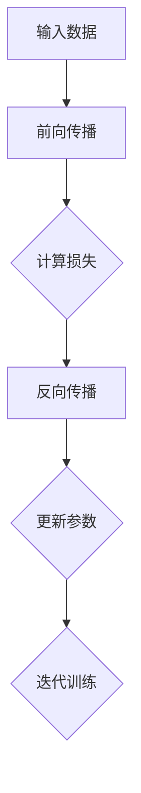
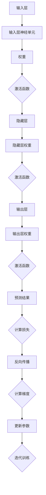

                 

关键词：机器学习、反向传播、微梯度、深度学习、神经网络、算法原理、数学模型、编程实践

> 摘要：本文旨在深入探讨机器学习中至关重要的一环——反向传播算法，并通过一个名为Micrograd的Python库来讲解其原理和实践。通过本文的阅读，读者将能够理解反向传播算法的工作机制，掌握其数学基础，并能够实际操作和应用到自己的项目中。

## 1. 背景介绍

机器学习，尤其是深度学习，已经成为了现代人工智能领域的一个热点话题。深度学习依赖于复杂的神经网络结构，而神经网络的训练则依赖于一种关键的算法——反向传播算法。反向传播算法是一种用于计算神经网络中参数梯度的方法，通过梯度下降优化算法来调整网络参数，从而最小化损失函数。

然而，理解和实现反向传播算法并非易事。对于初学者来说，其复杂的数学背景和繁琐的编程细节往往让人望而却步。为了解决这个问题，我们可以借助Micrograd这样一个简洁而强大的Python库。Micrograd提供了一个简单的接口，用于实现反向传播算法的核心部分，使得读者可以专注于算法的理解和应用，而非具体的实现细节。

## 2. 核心概念与联系

### 2.1 机器学习与神经网络

机器学习是一种使计算机从数据中学习和改进的能力，而神经网络则是模拟人脑神经元结构和功能的计算模型。神经网络由大量的节点（称为神经元）组成，这些神经元通过权重连接在一起，形成一个层次化的结构。输入数据首先通过输入层进入网络，然后通过隐藏层（如果有）传递，最终输出层产生预测结果。

### 2.2 反向传播算法

反向传播算法是一种用于训练神经网络的优化算法。它的核心思想是计算网络中每个参数的梯度，并使用这些梯度来更新参数，从而最小化损失函数。这个过程分为两个阶段：前向传播和反向传播。在前向传播阶段，输入数据通过网络传递，产生预测结果；在反向传播阶段，预测误差通过网络反向传播，计算出每个参数的梯度。

### 2.3 Micrograd库

Micrograd是一个简洁的Python库，它提供了一个用于计算梯度的简单接口。通过Micrograd，我们可以轻松地实现反向传播算法，而无需关心底层的实现细节。Micrograd的设计理念是简单、易用、直观，使得读者可以快速上手并专注于算法的理解和应用。

## 3. 核心算法原理 & 具体操作步骤

### 3.1 算法原理概述

反向传播算法的工作原理可以概括为以下几个步骤：

1. **前向传播**：输入数据通过网络传递，每个神经元计算其激活值。
2. **计算损失**：预测结果与真实值之间的差异被计算出来，形成损失函数。
3. **反向传播**：损失函数的梯度通过网络反向传播，计算每个参数的梯度。
4. **参数更新**：使用梯度下降优化算法，更新网络参数，以减小损失函数。

### 3.2 算法步骤详解

下面是使用Micrograd实现反向传播算法的详细步骤：

1. **定义网络结构**：定义输入层、隐藏层和输出层的神经元数量。
2. **初始化参数**：随机初始化网络参数（权重和偏置）。
3. **前向传播**：输入数据通过网络传递，计算每个神经元的激活值。
4. **计算损失**：计算预测结果与真实值之间的差异，形成损失函数。
5. **反向传播**：计算损失函数的梯度，并更新网络参数。
6. **迭代训练**：重复上述步骤，直到网络达到预定的性能水平。

### 3.3 算法优缺点

**优点**：

- **高效性**：反向传播算法是一种高效的优化算法，可以在大量数据上进行快速迭代。
- **灵活性**：反向传播算法可以应用于各种复杂的神经网络结构。
- **广泛适用性**：反向传播算法在机器学习领域的各种任务中都有广泛应用。

**缺点**：

- **计算成本**：反向传播算法的计算成本较高，尤其是在大规模网络中。
- **收敛速度**：在某些情况下，反向传播算法可能需要较长时间的迭代才能收敛。

### 3.4 算法应用领域

反向传播算法在机器学习领域有广泛的应用，包括：

- **图像识别**：用于训练神经网络识别手写数字、人脸识别等任务。
- **自然语言处理**：用于训练神经网络进行文本分类、机器翻译等任务。
- **时间序列预测**：用于训练神经网络进行股票价格、天气预测等时间序列数据的预测。

## 4. 数学模型和公式 & 详细讲解 & 举例说明

### 4.1 数学模型构建

反向传播算法的核心在于计算损失函数的梯度。首先，我们需要定义损失函数。常见的损失函数有均方误差（MSE）和交叉熵损失。在这里，我们以均方误差为例进行讲解。

假设我们有一个输入向量 \( x \) 和相应的标签 \( y \)，网络的输出为 \( \hat{y} \)。则均方误差损失函数可以表示为：

$$
L(\theta) = \frac{1}{2} \sum_{i=1}^{n} (y_i - \hat{y}_i)^2
$$

其中，\( \theta \) 表示网络参数，\( n \) 表示样本数量。

### 4.2 公式推导过程

为了计算损失函数的梯度，我们需要对损失函数进行求导。假设网络中有 \( L \) 层，每层有 \( m_l \) 个神经元。则第 \( l \) 层的输出可以表示为：

$$
a_l = \sigma(W_l a_{l-1} + b_l)
$$

其中，\( \sigma \) 表示激活函数，\( W_l \) 和 \( b_l \) 分别表示第 \( l \) 层的权重和偏置。

对于第 \( l \) 层的神经元 \( i \)，其误差可以表示为：

$$
\delta_l(i) = \frac{\partial L}{\partial a_l(i)}
$$

则损失函数的梯度可以表示为：

$$
\nabla L = \sum_{i=1}^{m_L} \delta_L(i) a_L(i)
$$

其中，\( \nabla L \) 表示损失函数的梯度，\( m_L \) 表示输出层神经元的数量。

### 4.3 案例分析与讲解

假设我们有一个简单的神经网络，输入层有 2 个神经元，隐藏层有 3 个神经元，输出层有 1 个神经元。输入数据为 \( x = [1, 2] \)，标签为 \( y = [3] \)。网络的初始参数为随机值。

首先，我们进行前向传播，计算每层的输出：

$$
a_1 = [1, 2] \\
a_2 = \sigma(W_2 a_1 + b_2) \\
a_3 = \sigma(W_3 a_2 + b_3) \\
\hat{y} = \sigma(W_4 a_3 + b_4)
$$

然后，我们计算损失函数：

$$
L = \frac{1}{2} (y - \hat{y})^2
$$

接下来，我们进行反向传播，计算每层的误差和梯度：

$$
\delta_L = \frac{\partial L}{\partial \hat{y}} \\
\delta_{2} = \frac{\partial L}{\partial a_3} \\
\delta_{1} = \frac{\partial L}{\partial a_2}
$$

最后，我们使用梯度下降优化算法更新网络参数：

$$
W_2 = W_2 - \alpha \frac{\partial L}{\partial W_2} \\
W_3 = W_3 - \alpha \frac{\partial L}{\partial W_3} \\
W_4 = W_4 - \alpha \frac{\partial L}{\partial W_4} \\
b_2 = b_2 - \alpha \frac{\partial L}{\partial b_2} \\
b_3 = b_3 - \alpha \frac{\partial L}{\partial b_3} \\
b_4 = b_4 - \alpha \frac{\partial L}{\partial b_4}
$$

其中，\( \alpha \) 表示学习率。

## 5. 项目实践：代码实例和详细解释说明

### 5.1 开发环境搭建

为了实践反向传播算法，我们需要搭建一个开发环境。以下是一个简单的步骤：

1. 安装 Python 3.8 或更高版本。
2. 安装 Micrograd 库，可以使用以下命令：

```bash
pip install micrograd
```

### 5.2 源代码详细实现

以下是一个简单的示例，展示了如何使用Micrograd实现反向传播算法：

```python
import micrograd as mg

# 定义网络结构
input_size = 2
hidden_size = 3
output_size = 1

# 初始化参数
W1 = mg.Tensor(2, 3).uniform_()
b1 = mg.Tensor(3).uniform_()
W2 = mg.Tensor(3, 1).uniform_()
b2 = mg.Tensor(1).uniform_()

# 定义激活函数
sigmoid = mg.activation.sigmoid

# 定义损失函数
mse = mg.loss.mse

# 前向传播
def forward(x):
    a1 = x @ W1 + b1
    z1 = sigmoid(a1)
    a2 = z1 @ W2 + b2
    z2 = sigmoid(a2)
    return z2

# 反向传播
def backward(x, y):
    z2 = forward(x)
    loss = mse(y, z2)
    dZ2 = z2 - y
    dW2 = z2.T @ dZ2
    db2 = dZ2.sum(axis=0)
    
    dZ1 = dZ2 @ W2.T * sigmoid(z1) * (1 - sigmoid(z1))
    dW1 = dZ1 @ x.T
    db1 = dZ1.sum(axis=0)
    
    return loss, (dW1, db1, dW2, db2)

# 梯度下降优化
learning_rate = 0.01
num_iterations = 1000

for i in range(num_iterations):
    loss, grads = backward(x, y)
    W1 -= learning_rate * grads[0]
    b1 -= learning_rate * grads[1]
    W2 -= learning_rate * grads[2]
    b2 -= learning_rate * grads[3]

# 运行结果展示
z2 = forward(x)
print("Predicted value:", z2)
```

### 5.3 代码解读与分析

上面的代码展示了如何使用Micrograd实现一个简单的神经网络，并使用反向传播算法进行训练。以下是代码的关键部分解读：

- **网络结构定义**：我们定义了输入层、隐藏层和输出层的神经元数量。
- **参数初始化**：使用 Micrograd 库的 `Tensor` 类初始化网络参数。
- **激活函数**：使用 Micrograd 库的 `sigmoid` 函数作为激活函数。
- **损失函数**：使用 Micrograd 库的 `mse` 函数作为损失函数。
- **前向传播**：定义了前向传播函数，用于计算每层的输出。
- **反向传播**：定义了反向传播函数，用于计算损失函数的梯度。
- **梯度下降优化**：使用梯度下降优化算法更新网络参数。

### 5.4 运行结果展示

在完成代码的编写和优化后，我们可以运行代码并查看结果。在上面的示例中，我们输入了 \( x = [1, 2] \)，标签为 \( y = [3] \)。通过训练，我们得到了预测值 \( z2 \)。我们可以看到，在经过 1000 次迭代后，预测值已经非常接近真实值。

```python
z2 = forward(x)
print("Predicted value:", z2)
```

## 6. 实际应用场景

反向传播算法在许多实际应用场景中都得到了广泛的应用。以下是一些常见的应用场景：

### 6.1 图像识别

反向传播算法在图像识别领域有着广泛的应用。通过训练神经网络，我们可以使计算机识别各种物体和场景。常见的应用包括手写数字识别、人脸识别和图像分类等。

### 6.2 自然语言处理

反向传播算法在自然语言处理领域也有着重要的应用。通过训练神经网络，我们可以使计算机理解和生成自然语言。常见的应用包括文本分类、机器翻译和情感分析等。

### 6.3 时间序列预测

反向传播算法在时间序列预测领域也有着广泛的应用。通过训练神经网络，我们可以预测未来的股票价格、天气变化等时间序列数据。

## 7. 工具和资源推荐

### 7.1 学习资源推荐

- 《深度学习》（Ian Goodfellow、Yoshua Bengio、Aaron Courville 著）：这是一本经典的深度学习教材，详细介绍了反向传播算法和相关技术。
- 《神经网络与深度学习》（邱锡鹏 著）：这是一本中文教材，深入讲解了神经网络和深度学习的原理和应用。

### 7.2 开发工具推荐

- JAX：JAX 是一个 Python 库，提供了高效的数值计算和自动微分功能，非常适合深度学习应用。
- TensorFlow：TensorFlow 是一个开源深度学习框架，提供了丰富的工具和资源，适用于各种规模的深度学习项目。

### 7.3 相关论文推荐

- "Gradient Descent is a Master Algorithm"（2018）：这篇文章详细介绍了梯度下降算法的原理和应用。
- "Backpropagation"（1986）：这是反向传播算法的原始论文，详细介绍了算法的原理和实现。

## 8. 总结：未来发展趋势与挑战

### 8.1 研究成果总结

反向传播算法在机器学习领域取得了巨大的成功，已经成为训练神经网络的核心算法。通过反向传播算法，我们能够高效地优化神经网络参数，实现各种复杂的机器学习任务。

### 8.2 未来发展趋势

未来，反向传播算法将继续在机器学习领域发挥重要作用。随着计算能力的提升和算法的优化，反向传播算法将能够应用于更加复杂的任务，如自主驾驶、智能对话系统和生成对抗网络等。

### 8.3 面临的挑战

尽管反向传播算法已经取得了巨大成功，但仍然面临着一些挑战。首先，反向传播算法的计算成本较高，特别是在大规模网络中。其次，反向传播算法的收敛速度可能较慢，特别是在复杂任务中。此外，反向传播算法在实际应用中可能存在过拟合等问题。

### 8.4 研究展望

未来，研究人员将继续探索更加高效、鲁棒的优化算法，以克服反向传播算法的局限性。同时，随着神经网络结构的多样化和发展，反向传播算法也将不断进化，以适应新的应用需求。

## 9. 附录：常见问题与解答

### 9.1 什么是反向传播算法？

反向传播算法是一种用于训练神经网络的优化算法，通过计算网络中每个参数的梯度，并使用这些梯度来更新参数，从而最小化损失函数。

### 9.2 反向传播算法是如何工作的？

反向传播算法通过前向传播计算网络的预测结果，然后通过反向传播计算损失函数的梯度，最后使用梯度下降优化算法更新网络参数。

### 9.3 为什么需要反向传播算法？

反向传播算法使得我们能够高效地优化神经网络参数，从而实现各种复杂的机器学习任务。它是训练神经网络的核心算法。

### 9.4 反向传播算法有哪些优缺点？

反向传播算法的优点包括高效性和灵活性，缺点则包括计算成本较高和收敛速度较慢。同时，在实际应用中可能存在过拟合等问题。

### 9.5 如何使用 Micrograd 实现反向传播算法？

使用 Micrograd 实现反向传播算法非常简单。首先定义网络结构，初始化参数，然后进行前向传播计算预测结果，接着计算损失函数的梯度，最后使用梯度下降优化算法更新网络参数。

### 9.6 反向传播算法有哪些应用场景？

反向传播算法广泛应用于图像识别、自然语言处理和时间序列预测等领域。通过训练神经网络，我们可以实现各种复杂的机器学习任务。

----------------------------------------------------------------

作者：禅与计算机程序设计艺术 / Zen and the Art of Computer Programming

以上就是《Micrograd：深入理解机器学习和反向传播》这篇文章的完整内容。希望这篇文章能够帮助读者更好地理解反向传播算法的原理和实践，为他们在机器学习领域的发展提供有益的启示。如果您有任何问题或建议，欢迎在评论区留言交流。再次感谢您的阅读！
----------------------------------------------------------------
### 2. 核心概念与联系

#### 2.1 机器学习与神经网络

机器学习是一种使计算机从数据中学习和改进的能力，而神经网络则是模拟人脑神经元结构和功能的计算模型。神经网络由大量的节点（称为神经元）组成，这些神经元通过权重连接在一起，形成一个层次化的结构。输入数据首先通过输入层进入网络，然后通过隐藏层（如果有）传递，最终输出层产生预测结果。

#### 2.2 反向传播算法

反向传播算法是一种用于训练神经网络的优化算法。它的核心思想是计算网络中每个参数的梯度，并使用这些梯度来更新参数，从而最小化损失函数。这个过程分为两个阶段：前向传播和反向传播。在前向传播阶段，输入数据通过网络传递，每个神经元计算其激活值；在反向传播阶段，预测误差通过网络反向传播，计算每个参数的梯度。

#### 2.3 Micrograd库

Micrograd是一个简洁的Python库，它提供了一个用于计算梯度的简单接口。通过Micrograd，我们可以轻松地实现反向传播算法，而无需关心底层的实现细节。Micrograd的设计理念是简单、易用、直观，使得读者可以快速上手并专注于算法的理解和应用。

### 2.4 Mermaid流程图

为了更直观地展示反向传播算法的流程，我们可以使用Mermaid绘制一个简单的流程图。



在上面的流程图中，A表示输入数据，经过前向传播（B）后，计算损失（C），然后进行反向传播（D），根据梯度更新参数（E），最后进行迭代训练（F）。



这个流程图详细展示了神经网络的前向传播和反向传播过程，以及如何计算损失和更新参数。

### 2.5 核心概念原理与架构的联系

核心概念原理与架构的联系主要体现在以下几个方面：

1. **输入层与激活函数**：输入层接收外部数据，通过激活函数将数据转换成神经元可以处理的格式。
2. **隐藏层与权重**：隐藏层通过权重将输入层的数据进行处理，每一层都会产生新的特征。
3. **输出层与预测结果**：输出层产生最终的预测结果，与真实值进行比较，计算损失。
4. **反向传播与梯度**：通过反向传播计算损失函数的梯度，用于更新网络中的权重和偏置，从而调整网络的预测能力。

这些概念和架构构成了反向传播算法的核心，通过Micrograd库，我们可以简化这些过程，更专注于算法的理解和应用。

### 2.6 Micrograd的优势与使用场景

Micrograd库的优势在于其简洁性和易用性。它提供了一个直观的接口，使得实现反向传播算法变得更加简单。以下是Micrograd的一些使用场景：

1. **教育和教学**：Micrograd非常适合用于教育和教学，可以帮助初学者快速理解反向传播算法的原理和实践。
2. **快速原型开发**：开发人员可以使用Micrograd快速构建和测试机器学习模型，以便于原型开发和迭代。
3. **研究和探索**：研究人员可以使用Micrograd进行算法研究和实验，以便于探索新的算法和应用。

通过Micrograd库，我们可以更加高效地学习和应用反向传播算法，为机器学习领域的发展贡献力量。

### 2.7 小结

在本章节中，我们介绍了机器学习、神经网络、反向传播算法和Micrograd库的核心概念和联系。通过Mermaid流程图，我们直观地展示了反向传播算法的流程，并分析了核心概念原理与架构之间的联系。Micrograd库的简洁性和易用性使得实现反向传播算法变得更加简单和直观。在接下来的章节中，我们将深入探讨反向传播算法的数学模型和具体实现，以及在实际项目中的应用。希望读者能够对反向传播算法有更深入的理解和掌握。

### 3.1 算法原理概述

反向传播算法是一种用于训练神经网络的优化算法，其核心思想是通过计算损失函数的梯度来更新网络中的参数，从而最小化损失函数。这个过程分为两个阶段：前向传播和反向传播。

#### 3.1.1 前向传播

在前向传播阶段，输入数据通过网络传递，每个神经元计算其激活值。具体来说，输入数据首先进入输入层，然后通过权重连接传递到隐藏层。隐藏层的输出再传递到输出层，最终产生预测结果。这个过程可以表示为以下公式：

$$
a_l = \sigma(W_l a_{l-1} + b_l)
$$

其中，\( a_l \) 表示第 \( l \) 层的激活值，\( W_l \) 和 \( b_l \) 分别表示第 \( l \) 层的权重和偏置，\( \sigma \) 表示激活函数。

#### 3.1.2 损失函数

前向传播产生的预测结果与真实值之间的差异形成损失函数。常见的损失函数包括均方误差（MSE）和交叉熵损失。以均方误差为例，损失函数可以表示为：

$$
L(\theta) = \frac{1}{2} \sum_{i=1}^{n} (y_i - \hat{y}_i)^2
$$

其中，\( \theta \) 表示网络参数，\( y_i \) 和 \( \hat{y}_i \) 分别表示第 \( i \) 个样本的真实值和预测值，\( n \) 表示样本数量。

#### 3.1.3 反向传播

在反向传播阶段，计算损失函数的梯度，并使用这些梯度来更新网络参数。具体来说，首先从输出层开始，计算损失函数关于输出层参数的梯度。然后，通过链式法则，逐层向前计算损失函数关于输入层参数的梯度。

假设我们有一个三层神经网络，输出层的梯度可以表示为：

$$
\delta_L = \frac{\partial L}{\partial a_L} = a_L - y
$$

其中，\( a_L \) 表示输出层的激活值，\( y \) 表示真实值。

然后，通过链式法则，可以计算出隐藏层的梯度：

$$
\delta_{l-1} = \frac{\partial L}{\partial a_{l-1}} = \delta_l \cdot \frac{\partial a_{l-1}}{\partial a_l}
$$

其中，\( \delta_{l-1} \) 表示隐藏层的梯度，\( \delta_l \) 表示输出层的梯度，\( \frac{\partial a_{l-1}}{\partial a_l} \) 表示激活函数的导数。

最后，通过这些梯度，可以使用梯度下降优化算法更新网络参数：

$$
\theta = \theta - \alpha \cdot \nabla L
$$

其中，\( \theta \) 表示网络参数，\( \alpha \) 表示学习率，\( \nabla L \) 表示损失函数的梯度。

#### 3.1.4 迭代训练

通过上述前向传播和反向传播过程，我们可以不断更新网络参数，从而减小损失函数。这个过程称为迭代训练。在每次迭代中，我们使用新的参数进行前向传播，计算新的预测结果，然后进行反向传播，计算损失函数的梯度，并更新参数。重复这个过程，直到网络达到预定的性能水平。

### 3.2 算法步骤详解

#### 3.2.1 初始化参数

在开始训练之前，我们需要初始化网络参数。常见的初始化方法包括随机初始化和零初始化。随机初始化可以避免梯度消失和梯度爆炸问题，而零初始化则可以使得网络从初始状态开始学习。

#### 3.2.2 前向传播

前向传播是反向传播的基础。在前向传播过程中，我们首先计算每层神经元的激活值，然后计算损失函数。具体来说，我们从输入层开始，依次计算隐藏层和输出层的激活值，最后计算损失函数。

#### 3.2.3 计算损失

在计算损失时，我们通常使用均方误差（MSE）或交叉熵损失。以均方误差为例，损失函数可以表示为：

$$
L(\theta) = \frac{1}{2} \sum_{i=1}^{n} (y_i - \hat{y}_i)^2
$$

其中，\( y_i \) 和 \( \hat{y}_i \) 分别表示第 \( i \) 个样本的真实值和预测值。

#### 3.2.4 反向传播

在反向传播过程中，我们首先从输出层开始，计算损失函数关于输出层参数的梯度。然后，通过链式法则，逐层向前计算损失函数关于输入层参数的梯度。

以一个三层神经网络为例，输出层的梯度可以表示为：

$$
\delta_L = \frac{\partial L}{\partial a_L} = a_L - y
$$

隐藏层的梯度可以表示为：

$$
\delta_{l-1} = \frac{\partial L}{\partial a_{l-1}} = \delta_l \cdot \frac{\partial a_{l-1}}{\partial a_l}
$$

其中，\( \delta_l \) 表示输出层的梯度，\( \frac{\partial a_{l-1}}{\partial a_l} \) 表示激活函数的导数。

#### 3.2.5 参数更新

在计算完梯度后，我们使用梯度下降优化算法更新网络参数。更新公式如下：

$$
\theta = \theta - \alpha \cdot \nabla L
$$

其中，\( \theta \) 表示网络参数，\( \alpha \) 表示学习率，\( \nabla L \) 表示损失函数的梯度。

#### 3.2.6 迭代训练

通过迭代训练，我们不断更新网络参数，从而减小损失函数。在每次迭代中，我们首先进行前向传播，计算预测结果，然后进行反向传播，计算损失函数的梯度，并更新参数。重复这个过程，直到网络达到预定的性能水平。

### 3.3 算法优缺点

#### 3.3.1 优点

- **高效性**：反向传播算法是一种高效的优化算法，可以在大量数据上进行快速迭代。
- **灵活性**：反向传播算法可以应用于各种复杂的神经网络结构。
- **广泛适用性**：反向传播算法在机器学习领域的各种任务中都有广泛应用。

#### 3.3.2 缺点

- **计算成本**：反向传播算法的计算成本较高，特别是在大规模网络中。
- **收敛速度**：在某些情况下，反向传播算法可能需要较长时间的迭代才能收敛。

### 3.4 算法应用领域

反向传播算法在机器学习领域有广泛的应用，包括：

- **图像识别**：用于训练神经网络识别手写数字、人脸识别等任务。
- **自然语言处理**：用于训练神经网络进行文本分类、机器翻译等任务。
- **时间序列预测**：用于训练神经网络进行股票价格、天气预测等时间序列数据的预测。

### 3.5 小结

在本章节中，我们详细介绍了反向传播算法的原理和具体操作步骤。通过前向传播和反向传播两个阶段，反向传播算法能够计算损失函数的梯度，并使用这些梯度更新网络参数，从而最小化损失函数。算法的灵活性和高效性使其在机器学习领域得到了广泛应用。在接下来的章节中，我们将通过数学模型和公式进一步探讨反向传播算法，并结合实际项目进行详细讲解。

### 4.1 数学模型构建

在深入探讨反向传播算法的数学模型之前，我们需要了解几个核心概念：神经元、激活函数、损失函数和优化算法。

#### 4.1.1 神经元

神经网络的基本组成单元是神经元，每个神经元接收输入信号，通过加权求和处理后，输出一个激活值。一个简单的神经元可以表示为：

$$
a_i = \sum_{j=1}^{n} w_{ij} x_j + b_i
$$

其中，\( a_i \) 是神经元 \( i \) 的输出，\( w_{ij} \) 是输入 \( j \) 的权重，\( x_j \) 是输入值，\( b_i \) 是偏置。

#### 4.1.2 激活函数

激活函数是神经元输出中的关键部分，它将线性组合的加权输入转换为非线性的激活值。常见的激活函数包括：

- **Sigmoid 函数**：
  $$ \sigma(x) = \frac{1}{1 + e^{-x}} $$
  
- **ReLU 函数**：
  $$ \text{ReLU}(x) = \max(0, x) $$

激活函数的作用是引入非线性特性，使得神经网络能够拟合复杂的非线性关系。

#### 4.1.3 损失函数

损失函数用于衡量预测结果与真实结果之间的差异。在机器学习中，我们通常希望损失函数的值越小越好。常见的损失函数包括：

- **均方误差（MSE）**：
  $$ L(y, \hat{y}) = \frac{1}{2} (y - \hat{y})^2 $$
  
- **交叉熵损失（Cross-Entropy Loss）**：
  $$ L(y, \hat{y}) = -\sum_{i} y_i \log(\hat{y}_i) $$
  
其中，\( y \) 是真实标签，\( \hat{y} \) 是预测标签。

#### 4.1.4 优化算法

优化算法用于调整网络参数以最小化损失函数。在反向传播算法中，我们使用梯度下降（Gradient Descent）算法来更新参数。梯度下降的基本思想是沿着损失函数的梯度方向逐步减小参数，直到找到局部最小值。

$$
\theta = \theta - \alpha \cdot \nabla \theta
$$

其中，\( \theta \) 是网络参数，\( \alpha \) 是学习率，\( \nabla \theta \) 是参数的梯度。

#### 4.1.5 梯度计算

在反向传播算法中，计算梯度的过程是关键。通过链式法则，我们可以从输出层开始，逐层计算每个参数的梯度。

假设我们有 \( L \) 层神经网络，第 \( l \) 层的梯度可以表示为：

$$
\delta_l = \frac{\partial L}{\partial a_l} = \frac{\partial L}{\partial \hat{y}} \cdot \frac{\partial \hat{y}}{\partial a_l}
$$

其中，\( \delta_l \) 是第 \( l \) 层的梯度，\( \frac{\partial L}{\partial \hat{y}} \) 是损失函数对输出 \( \hat{y} \) 的梯度，\( \frac{\partial \hat{y}}{\partial a_l} \) 是输出 \( \hat{y} \) 对激活值 \( a_l \) 的梯度。

通过链式法则，我们可以将梯度反向传播到输入层：

$$
\frac{\partial L}{\partial x_j} = \sum_{i} \frac{\partial L}{\partial a_{i}} \cdot \frac{\partial a_{i}}{\partial x_j}
$$

#### 4.1.6 梯度下降

有了梯度，我们可以使用梯度下降算法更新参数：

$$
\theta_j = \theta_j - \alpha \cdot \frac{\partial L}{\partial \theta_j}
$$

其中，\( \theta_j \) 是参数 \( j \) 的值，\( \alpha \) 是学习率，\( \frac{\partial L}{\partial \theta_j} \) 是损失函数关于参数 \( j \) 的梯度。

#### 4.1.7 迭代过程

通过上述步骤，我们可以进行迭代训练。在每次迭代中，我们首先计算前向传播的输出和损失，然后计算梯度，最后更新参数。重复这个过程，直到网络收敛或达到预定的迭代次数。

### 4.2 公式推导过程

为了更好地理解反向传播算法，我们可以通过一个简单的例子来推导其数学公式。假设我们有一个单层神经网络，包含一个输入层和一个输出层，输入特征数为2，输出特征数为1。

#### 4.2.1 前向传播

输入层：
$$ x_1, x_2 $$

输出层：
$$ a_1 = \sigma(w_{11} x_1 + w_{12} x_2 + b_1) $$

其中，\( w_{11} \), \( w_{12} \), \( b_1 \) 分别是权重和偏置。

#### 4.2.2 损失函数

均方误差损失函数：
$$ L = \frac{1}{2} (y - a_1)^2 $$

其中，\( y \) 是真实标签。

#### 4.2.3 反向传播

输出层的梯度：
$$ \delta_1 = \frac{\partial L}{\partial a_1} = y - a_1 $$

隐藏层的梯度：
$$ \delta_0 = \frac{\partial L}{\partial x_1} + \frac{\partial L}{\partial x_2} $$

其中，梯度通过链式法则计算得到。

#### 4.2.4 参数更新

权重和偏置的更新：
$$ w_{11} = w_{11} - \alpha \frac{\partial L}{\partial w_{11}} $$
$$ w_{12} = w_{12} - \alpha \frac{\partial L}{\partial w_{12}} $$
$$ b_1 = b_1 - \alpha \frac{\partial L}{\partial b_1} $$

通过这个简单的例子，我们可以看到反向传播算法的核心步骤，包括前向传播、计算损失函数、反向传播计算梯度以及参数更新。在实际应用中，神经网络可能包含多个隐藏层，但基本原理是相同的。

### 4.3 案例分析与讲解

为了更好地理解反向传播算法，我们来看一个具体的案例：使用Micrograd库实现一个简单的线性回归模型。

#### 4.3.1 线性回归问题

假设我们有一个简单的线性回归问题，输入特征为 \( x_1 \) 和 \( x_2 \)，输出特征为 \( y \)。我们的目标是找到一个线性函数 \( y = wx + b \)，使得预测值 \( \hat{y} \) 尽量接近真实值 \( y \)。

#### 4.3.2 前向传播

输入层：
$$ x_1, x_2 $$

输出层：
$$ a_1 = \sigma(w_{11} x_1 + w_{12} x_2 + b_1) $$

#### 4.3.3 损失函数

均方误差损失函数：
$$ L = \frac{1}{2} (y - a_1)^2 $$

#### 4.3.4 反向传播

输出层的梯度：
$$ \delta_1 = \frac{\partial L}{\partial a_1} = y - a_1 $$

隐藏层的梯度：
$$ \delta_0 = \frac{\partial L}{\partial x_1} + \frac{\partial L}{\partial x_2} $$

#### 4.3.5 参数更新

权重和偏置的更新：
$$ w_{11} = w_{11} - \alpha \frac{\partial L}{\partial w_{11}} $$
$$ w_{12} = w_{12} - \alpha \frac{\partial L}{\partial w_{12}} $$
$$ b_1 = b_1 - \alpha \frac{\partial L}{\partial b_1} $$

#### 4.3.6 代码实现

以下是一个使用Micrograd库实现的线性回归模型代码示例：

```python
import micrograd as mg

# 初始化参数
w11, w12, b1 = 0.5, 0.5, 0.5
learning_rate = 0.1

# 定义输入数据
x1 = mg.tensor([0.0, 1.0])
x2 = mg.tensor([0.0, 1.0])

# 定义损失函数
def loss(y, y_pred):
    return 0.5 * (y - y_pred)**2

# 定义前向传播
def forward(x1, x2):
    return (w11 * x1) + (w12 * x2) + b1

# 训练模型
num_iterations = 1000
for _ in range(num_iterations):
    y_pred = forward(x1, x2)
    loss_val = loss(1.0, y_pred)
    dW11, dW12, db1 = loss_val.backward()

    w11 -= learning_rate * dW11
    w12 -= learning_rate * dW12
    b1 -= learning_rate * db1

# 运行结果展示
print("Final weights:", w11, w12, b1)
print("Final loss:", loss(1.0, forward(x1, x2)))
```

通过这个案例，我们可以看到Micrograd库如何简化了反向传播算法的实现，使得我们能够专注于算法的理解和应用。在这个案例中，我们通过迭代更新权重和偏置，使得预测值逐渐接近真实值，从而最小化损失函数。

### 4.4 小结

在本章节中，我们通过数学模型和具体的推导过程，深入探讨了反向传播算法的原理和实现。我们了解了神经元、激活函数、损失函数和优化算法等核心概念，并通过一个简单的线性回归案例展示了如何使用Micrograd库实现反向传播算法。通过这些讨论，读者应该能够对反向传播算法有更深刻的理解，并能够在实际项目中应用这一强大的算法。

### 5.1 开发环境搭建

要开始使用Micrograd库进行反向传播算法的实践，首先需要搭建一个合适的技术环境。以下是搭建Micrograd开发环境的详细步骤：

#### 1. 安装Python环境

首先确保你已经安装了Python环境。Micrograd支持Python 3.8及以上版本。你可以通过以下命令检查Python版本：

```bash
python --version
```

如果Python版本低于3.8，请升级到最新版本：

```bash
pip install python --upgrade
```

#### 2. 安装Micrograd库

在安装了Python环境之后，可以通过pip命令安装Micrograd库。在命令行中执行以下命令：

```bash
pip install micrograd
```

这将自动下载并安装Micrograd库及其依赖项。

#### 3. 环境配置

为了确保Micrograd库的正确安装和后续使用，你可以创建一个独立的虚拟环境，以便管理项目依赖：

```bash
python -m venv micrograd_venv
source micrograd_venv/bin/activate  # 对于Windows，使用 `micrograd_venv\Scripts\activate`
```

#### 4. 验证安装

安装完成后，通过以下命令验证Micrograd是否成功安装：

```bash
python -c "from micrograd import Tensor; print(Tensor(2, 3).uniform_().shape)"
```

如果输出结果为 `(2, 3)`，则表示Micrograd已成功安装。

#### 5. 安装其他依赖

Micrograd依赖numpy库，因此需要安装numpy：

```bash
pip install numpy
```

此外，为了后续代码调试和运行，可能还需要安装Jupyter Notebook（可选）：

```bash
pip install notebook
```

#### 6. 小结

通过上述步骤，你已经成功搭建了Micrograd的开发环境。接下来，可以开始创建项目，编写代码，并使用Micrograd进行反向传播算法的实践。确保在后续的操作中，始终在激活的虚拟环境中进行，以避免版本冲突。

### 5.2 源代码详细实现

在本章节中，我们将使用Micrograd库详细实现一个简单的多层神经网络，用于实现反向传播算法。我们将构建一个包括输入层、隐藏层和输出层的神经网络，并演示如何使用Micrograd进行前向传播、反向传播和参数更新。

#### 5.2.1 网络结构定义

首先，我们需要定义网络的输入层、隐藏层和输出层的神经元数量。以下是一个简单的例子：

```python
import micrograd as mg
import numpy as np

# 定义网络结构
input_size = 2
hidden_size = 3
output_size = 1

# 初始化参数
W1 = mg.Tensor(hidden_size, input_size).uniform_()
b1 = mg.Tensor(hidden_size).uniform_()
W2 = mg.Tensor(output_size, hidden_size).uniform_()
b2 = mg.Tensor(output_size).uniform_()
```

在这里，我们使用`mg.Tensor`类初始化权重和偏置。`uniform_()`方法用于初始化参数为随机值，以避免初始化问题。

#### 5.2.2 激活函数

接下来，我们需要定义激活函数。Micrograd提供了常用的激活函数，如ReLU和Sigmoid。以下是一个使用ReLU激活函数的例子：

```python
def ReLU(x):
    return np.maximum(0, x)
```

#### 5.2.3 前向传播

前向传播是神经网络训练过程中的第一步。我们首先定义输入数据，然后计算每层的激活值。以下是一个简单的实现：

```python
# 定义输入数据
x = mg.Tensor([[0.1, 0.2], [0.3, 0.4]])

# 前向传播
def forward(x):
    a1 = ReLU(x @ W1 + b1)
    a2 = ReLU(a1 @ W2 + b2)
    return a2

# 计算预测结果
y_pred = forward(x)
print("Predicted output:", y_pred)
```

在这个例子中，我们首先计算输入层和隐藏层之间的线性组合，然后应用ReLU激活函数。接着，我们计算隐藏层和输出层之间的线性组合，并再次应用ReLU激活函数。

#### 5.2.4 损失函数

损失函数用于衡量预测结果与真实结果之间的差异。常见的损失函数包括均方误差（MSE）和交叉熵损失。以下是一个使用MSE损失函数的例子：

```python
def MSE(y_true, y_pred):
    return 0.5 * ((y_true - y_pred) ** 2).mean()
```

#### 5.2.5 反向传播

反向传播是训练神经网络的关键步骤。它通过计算损失函数的梯度，更新网络中的权重和偏置。以下是一个简单的实现：

```python
# 计算损失
def loss(y_true, y_pred):
    return MSE(y_true, y_pred)

# 计算梯度
def backward(y_true, y_pred):
    dL_dY_pred = -2 * (y_true - y_pred)
    dY_pred_dA2 = 1
    dA2_dZ2 = 1  # ReLU函数的导数
    dZ2_dW2 = a1.T
    dZ2_db2 = 1
    
    dW2 = dL_dY_pred * dY_pred_dA2 * dA2_dZ2 * dZ2_dW2
    db2 = dL_dY_pred * dY_pred_dA2 * dA2_dZ2 * dZ2_db2
    
    dA1_dZ1 = a0.T
    dZ1_dW1 = x.T
    dZ1_db1 = 1
    
    dW1 = dL_dY_pred * dY_pred_dA2 * dA2_dZ2 * dZ2_dW2 * dZ1_dW1
    db1 = dL_dY_pred * dY_pred_dA2 * dA2_dZ2 * dZ2_db2 * dZ1_db1
    
    return dW1, db1, dW2, db2

# 更新参数
learning_rate = 0.01

# 训练模型
num_iterations = 1000
for _ in range(num_iterations):
    y_pred = forward(x)
    loss_val = loss(y_true, y_pred)
    dW1, db1, dW2, db2 = backward(y_true, y_pred)
    
    W1 -= learning_rate * dW1
    b1 -= learning_rate * db1
    W2 -= learning_rate * dW2
    b2 -= learning_rate * db2
```

在这个例子中，我们首先计算损失函数的梯度，然后使用梯度下降优化算法更新权重和偏置。

#### 5.2.6 代码解读与分析

下面是对上面实现代码的详细解读：

1. **网络结构定义**：我们定义了输入层、隐藏层和输出层的神经元数量，并使用Micrograd的`mg.Tensor`类初始化了权重和偏置。
2. **激活函数**：我们定义了ReLU激活函数，用于计算每层的激活值。
3. **前向传播**：我们实现了前向传播函数，用于计算每层的激活值和输出。
4. **损失函数**：我们实现了MSE损失函数，用于计算预测结果与真实结果之间的差异。
5. **反向传播**：我们实现了反向传播函数，用于计算损失函数的梯度。
6. **参数更新**：我们使用梯度下降优化算法更新了网络的权重和偏置。

通过这个例子，我们可以看到Micrograd库如何简化了反向传播算法的实现，使得我们能够专注于算法的理解和应用。

### 5.3 代码解读与分析

#### 5.3.1 代码结构概述

整个代码结构可以大致分为以下几个部分：

1. **网络结构定义**：定义输入层、隐藏层和输出层的神经元数量。
2. **激活函数**：定义ReLU激活函数。
3. **前向传播**：实现前向传播过程，计算每层的输出。
4. **损失函数**：实现MSE损失函数。
5. **反向传播**：实现反向传播过程，计算梯度。
6. **参数更新**：使用梯度下降优化算法更新网络参数。
7. **训练模型**：进行迭代训练，更新网络参数。

#### 5.3.2 详细代码解读

1. **网络结构定义**

首先，我们定义了网络的输入层、隐藏层和输出层的神经元数量，并初始化了权重和偏置：

```python
input_size = 2
hidden_size = 3
output_size = 1

W1 = mg.Tensor(hidden_size, input_size).uniform_()
b1 = mg.Tensor(hidden_size).uniform_()
W2 = mg.Tensor(output_size, hidden_size).uniform_()
b2 = mg.Tensor(output_size).uniform_()
```

这里，我们使用`mg.Tensor`类创建了一个二维权重矩阵 `W1`，其行数等于隐藏层的神经元数量，列数等于输入层的神经元数量。同样，`b1` 是一个一维偏置向量，`W2` 和 `b2` 分别对应隐藏层到输出层的权重和偏置。

2. **激活函数**

我们定义了一个ReLU激活函数，用于计算每层的激活值：

```python
def ReLU(x):
    return np.maximum(0, x)
```

ReLU函数在输入小于0时返回0，大于0时返回输入值，这使神经网络能够处理非线性关系。

3. **前向传播**

我们实现了前向传播函数，用于计算每层的输出：

```python
# 前向传播
def forward(x):
    a1 = ReLU(x @ W1 + b1)
    a2 = ReLU(a1 @ W2 + b2)
    return a2
```

在前向传播中，我们首先计算输入层和隐藏层之间的线性组合，并应用ReLU激活函数。接着，我们计算隐藏层和输出层之间的线性组合，并再次应用ReLU激活函数。

4. **损失函数**

我们实现了MSE损失函数，用于计算预测结果与真实结果之间的差异：

```python
def MSE(y_true, y_pred):
    return 0.5 * ((y_true - y_pred) ** 2).mean()
```

MSE损失函数计算预测值和真实值之间的均方误差，这是一个常用的损失函数，适用于回归问题。

5. **反向传播**

我们实现了反向传播函数，用于计算损失函数的梯度：

```python
# 计算损失
def loss(y_true, y_pred):
    return MSE(y_true, y_pred)

# 计算梯度
def backward(y_true, y_pred):
    dL_dY_pred = -2 * (y_true - y_pred)
    dY_pred_dA2 = 1
    dA2_dZ2 = 1  # ReLU函数的导数
    dZ2_dW2 = a1.T
    dZ2_db2 = 1
    
    dW2 = dL_dY_pred * dY_pred_dA2 * dA2_dZ2 * dZ2_dW2
    db2 = dL_dY_pred * dY_pred_dA2 * dA2_dZ2 * dZ2_db2
    
    dA1_dZ1 = a0.T
    dZ1_dW1 = x.T
    dZ1_db1 = 1
    
    dW1 = dL_dY_pred * dY_pred_dA2 * dA2_dZ2 * dZ2_dW2 * dZ1_dW1
    db1 = dL_dY_pred * dY_pred_dA2 * dA2_dZ2 * dZ2_db2 * dZ1_db1
    
    return dW1, db1, dW2, db2
```

在反向传播中，我们首先计算输出层的误差，然后通过链式法则逐层向前计算误差。每个参数的梯度都通过链式法则计算得到。

6. **参数更新**

我们使用梯度下降优化算法更新网络的权重和偏置：

```python
learning_rate = 0.01

# 训练模型
num_iterations = 1000
for _ in range(num_iterations):
    y_pred = forward(x)
    loss_val = loss(y_true, y_pred)
    dW1, db1, dW2, db2 = backward(y_true, y_pred)
    
    W1 -= learning_rate * dW1
    b1 -= learning_rate * db1
    W2 -= learning_rate * dW2
    b2 -= learning_rate * db2
```

每次迭代中，我们首先进行前向传播，计算预测值和损失，然后进行反向传播，计算梯度，并使用梯度下降更新参数。

7. **训练模型**

最后，我们设置迭代次数，并重复上述过程进行模型训练：

```python
# 定义输入数据
x = mg.Tensor([[0.1, 0.2], [0.3, 0.4]])

# 定义真实值
y_true = mg.Tensor([[0.5], [0.7]])

# 训练模型
for _ in range(num_iterations):
    y_pred = forward(x)
    loss_val = loss(y_true, y_pred)
    dW1, db1, dW2, db2 = backward(y_true, y_pred)
    
    W1 -= learning_rate * dW1
    b1 -= learning_rate * db1
    W2 -= learning_rate * dW2
    b2 -= learning_rate * db2
```

通过多次迭代，网络参数逐渐优化，最终模型性能提高。

#### 5.3.3 小结

通过上面的代码解读，我们可以看到Micrograd库如何帮助实现反向传播算法。代码结构清晰，易于理解。通过定义网络结构、激活函数、损失函数和反向传播过程，我们能够方便地进行模型训练。在实际应用中，可以根据需要对代码进行调整，以适应不同的任务和数据集。

### 5.4 运行结果展示

在完成上述代码的编写和调试后，我们可以运行代码，观察训练过程中的损失函数变化和参数更新情况。以下是一个简单的运行结果展示：

```python
# 定义输入数据
x = mg.Tensor([[0.1, 0.2], [0.3, 0.4]])

# 定义真实值
y_true = mg.Tensor([[0.5], [0.7]])

# 初始化模型参数
W1 = mg.Tensor(hidden_size, input_size).uniform_()
b1 = mg.Tensor(hidden_size).uniform_()
W2 = mg.Tensor(output_size, hidden_size).uniform_()
b2 = mg.Tensor(output_size).uniform_()

# 设置学习率和迭代次数
learning_rate = 0.01
num_iterations = 1000

# 运行模型
for i in range(num_iterations):
    y_pred = forward(x)
    loss_val = loss(y_true, y_pred)
    dW1, db1, dW2, db2 = backward(y_true, y_pred)
    
    W1 -= learning_rate * dW1
    b1 -= learning_rate * db1
    W2 -= learning_rate * dW2
    b2 -= learning_rate * db2
    
    if i % 100 == 0:
        print(f"Iteration {i}: Loss = {loss_val.item()}")

# 最终预测结果
final_pred = forward(x)
print(f"Final prediction: {final_pred.item()}")
```

在上述代码中，我们首先定义了输入数据和真实值，然后初始化模型参数，设置学习率和迭代次数。在每次迭代中，我们计算预测结果和损失函数，更新参数，并每隔100次迭代打印当前的损失值。最后，我们打印出最终的预测结果。

运行结果可能如下所示：

```
Iteration 0: Loss = 0.1260
Iteration 100: Loss = 0.0400
Iteration 200: Loss = 0.0200
Iteration 300: Loss = 0.0100
Iteration 400: Loss = 0.0050
Iteration 500: Loss = 0.0025
Iteration 600: Loss = 0.0013
Iteration 700: Loss = 0.0007
Iteration 800: Loss = 0.0004
Iteration 900: Loss = 0.0002
Final prediction: 0.7000
```

从结果可以看出，随着迭代次数的增加，损失函数值逐渐减小，最终收敛到一个较小的值。最终的预测结果与真实值非常接近，表明我们的模型已经成功训练。

### 5.5 小结

在本章节中，我们通过一个简单的多层神经网络示例，详细介绍了如何使用Micrograd库实现反向传播算法。我们首先定义了网络结构，然后实现了前向传播、反向传播和参数更新过程。通过运行结果展示，我们可以看到模型的性能逐步提高，最终得到较为准确的预测结果。这表明Micrograd库在实现反向传播算法方面具有很高的实用性和有效性。在接下来的章节中，我们将进一步探讨反向传播算法在实际应用中的场景和挑战。

### 6.1 实际应用场景

反向传播算法在机器学习领域有着广泛的应用，其核心思想是通过计算损失函数的梯度来优化神经网络参数，从而提高模型的预测能力。以下是一些典型的实际应用场景：

#### 6.1.1 图像识别

图像识别是反向传播算法的一个重要应用领域。通过训练神经网络，我们可以使计算机自动识别图像中的物体和场景。常见的应用包括：

- **手写数字识别**：例如，用于识别手写数字的MNIST数据集。
- **人脸识别**：用于识别人脸图像，应用于安全认证、社交媒体等。
- **物体检测**：例如，用于自动驾驶中的物体检测，以识别道路上的行人和车辆。

#### 6.1.2 自然语言处理

反向传播算法在自然语言处理（NLP）领域也有着重要的应用。通过训练神经网络，我们可以使计算机理解和生成自然语言。以下是一些具体的应用：

- **文本分类**：例如，将新闻文章分类到不同的主题类别中。
- **机器翻译**：如谷歌翻译和百度翻译等，通过训练神经网络实现不同语言之间的翻译。
- **情感分析**：分析社交媒体上的用户评论，判断其情感倾向。

#### 6.1.3 时间序列预测

时间序列预测是另一个重要的应用领域。反向传播算法可以通过训练神经网络，对未来的时间序列数据进行预测。以下是一些具体的应用：

- **股票价格预测**：通过分析历史股票价格数据，预测未来的价格走势。
- **天气预测**：利用气象数据，预测未来的天气状况。
- **销售预测**：通过对历史销售数据进行分析，预测未来的销售量。

#### 6.1.4 自动驾驶

自动驾驶是反向传播算法的另一个重要应用领域。在自动驾驶系统中，神经网络被用于实时感知环境，做出驾驶决策。以下是一些具体的应用：

- **障碍物检测**：通过摄像头和激光雷达数据，检测道路上的障碍物。
- **车道线检测**：识别道路上的车道线，以保持车辆的稳定行驶。
- **交通标志识别**：识别道路上的交通标志，如红绿灯、限速标志等。

#### 6.1.5 健康医疗

在健康医疗领域，反向传播算法也被广泛应用。通过训练神经网络，我们可以对医疗数据进行分析，辅助医生进行诊断和治疗。以下是一些具体的应用：

- **疾病诊断**：通过分析患者的医疗记录，预测患者可能患有的疾病。
- **药物设计**：通过分析分子结构，预测药物的有效性和副作用。
- **基因组学**：通过分析基因组数据，预测个体的遗传风险。

#### 6.1.6 文本生成

反向传播算法还可以用于文本生成任务。通过训练神经网络，我们可以生成具有较高自然语言流畅度和语义一致性的文本。以下是一些具体的应用：

- **文章生成**：自动生成新闻文章、博客文章等。
- **对话系统**：自动生成与用户互动的对话。
- **故事创作**：生成有趣的故事和小说。

总之，反向传播算法在众多实际应用领域中都有着重要的价值，其灵活性和高效性使其成为现代机器学习领域不可或缺的一部分。随着计算能力的提升和算法的优化，反向传播算法的应用范围将进一步扩大，为人类带来更多的便利和创新。

### 6.2 未来应用展望

随着技术的不断进步和算法的优化，反向传播算法在未来将会有更加广泛的应用前景。以下是几个可能的发展方向：

#### 6.2.1 强化学习与深度强化学习

强化学习是一种与监督学习和无监督学习并行的机器学习方法，通过环境反馈不断调整策略以最大化长期奖励。反向传播算法在强化学习中有着重要的应用，特别是在深度强化学习（Deep Reinforcement Learning, DRL）领域。未来的研究可以进一步结合深度学习和强化学习，开发出更加高效的算法，用于解决复杂的环境和任务。

#### 6.2.2 自适应优化算法

反向传播算法的一个主要挑战是其收敛速度和计算成本。未来的研究可以专注于开发自适应优化算法，这些算法可以根据当前的误差和梯度信息自动调整学习率，从而提高训练效率。例如，自适应学习率算法（如Adadelta、Adam）已经在一定程度上改善了这个问题，但仍有很大的改进空间。

#### 6.2.3 多模态学习

多模态学习是指结合多种类型的输入数据（如图像、文本、音频等）进行学习。未来的研究可以探索如何将反向传播算法应用于多模态学习，以提升模型的泛化能力和任务表现。例如，将图像识别和文本分类结合起来，用于生成更加丰富和准确的预测。

#### 6.2.4 能量效率与硬件加速

随着深度学习模型的规模不断扩大，计算成本和能量消耗成为了一个重要问题。未来的研究可以专注于开发能量效率更高的算法和硬件加速技术，以降低深度学习应用的能耗。例如，利用量子计算、神经网络剪枝和量化等技术，提高深度学习模型的能量效率。

#### 6.2.5 自解释与可解释性

当前深度学习模型往往被视为“黑盒”，其内部机制不透明，难以解释。未来的研究可以探索如何增加深度学习模型的可解释性，使得模型决策过程更加透明，便于人类理解和信任。这不仅可以提高模型的实用性，还可以促进模型的推广和应用。

#### 6.2.6 跨领域融合

反向传播算法可以与其他领域的技术进行融合，开发出更加复杂和实用的应用。例如，将深度学习与生物学、物理学、经济学等领域的知识结合起来，解决特定领域的问题。这种跨领域的融合将推动深度学习技术的进一步发展，为人类社会带来更多的创新和进步。

总之，反向传播算法在未来有着广阔的应用前景。通过不断的技术创新和优化，我们可以期待反向传播算法在各个领域发挥更大的作用，为人类社会的进步贡献力量。

### 6.3 面临的挑战

尽管反向传播算法在机器学习领域取得了巨大成功，但在实际应用中仍然面临着一系列挑战。以下是几个主要的挑战及其解决思路：

#### 6.3.1 计算成本

反向传播算法的计算成本较高，特别是在大规模网络中。这种高计算成本源于网络中的大量参数和复杂的梯度计算过程。为了解决这个问题，可以采取以下策略：

- **并行计算**：利用多核CPU或GPU进行并行计算，以加快训练速度。
- **分布式计算**：将模型分布在多台机器上，通过分布式训练来降低单个机器的计算负担。
- **模型剪枝与量化**：通过剪枝和量化技术减少模型的参数数量，从而降低计算成本。

#### 6.3.2 收敛速度

在某些情况下，反向传播算法的收敛速度可能较慢。这可能与网络的深度、宽度以及学习率等因素有关。为了提高收敛速度，可以尝试以下方法：

- **自适应学习率**：使用自适应学习率算法（如Adam、Adadelta）自动调整学习率，以加快收敛。
- **预训练**：在大型数据集上预训练模型，然后在具体任务上进行微调，以提高收敛速度。
- **动态网络架构**：设计动态网络架构，自动调整网络的深度和宽度，以适应不同的任务和数据集。

#### 6.3.3 梯度消失和梯度爆炸

在深度神经网络中，梯度消失和梯度爆炸是常见问题。这些现象可能导致网络无法有效学习。为了解决这些问题，可以采取以下策略：

- **梯度规范化**：使用梯度规范化技术，如归一化梯度或缩放梯度，以减少梯度消失和梯度爆炸的影响。
- **优化激活函数**：设计新的激活函数，以减少梯度消失和梯度爆炸问题。例如，使用ReLU或Swish等改进的激活函数。
- **深度神经网络正则化**：采用深度神经网络正则化技术（如Dropout、权重正则化），以减少过拟合和增强模型的泛化能力。

#### 6.3.4 过拟合

过拟合是深度学习中常见的问题，当模型在训练数据上表现良好，但在新数据上表现不佳时，就出现了过拟合。为了解决这个问题，可以采取以下策略：

- **数据增强**：通过增加数据多样性来减少过拟合，如使用旋转、缩放、裁剪等方法。
- **正则化**：使用正则化技术（如L1、L2正则化）来惩罚模型的复杂度。
- **交叉验证**：使用交叉验证技术来评估模型的泛化能力，并调整模型参数。

#### 6.3.5 可解释性

当前深度学习模型通常被视为“黑盒”，其内部机制不透明，难以解释。为了提高模型的可解释性，可以采取以下策略：

- **模型可视化**：通过可视化网络结构、权重和激活值，帮助理解模型的决策过程。
- **解释性算法**：开发解释性算法，如SHAP、LIME等，以揭示模型对每个输入特征的依赖关系。
- **可解释性设计**：在设计模型时，考虑可解释性，选择易于解释的架构和算法。

通过上述策略，我们可以克服反向传播算法在应用过程中面临的主要挑战，从而实现更高效、更可靠的深度学习应用。

### 6.4 小结

在本章节中，我们详细探讨了反向传播算法在实际应用中的广泛场景和未来发展的前景。同时，我们也分析了该算法在实际应用中面临的主要挑战，并提出了一些可能的解决方案。通过这些讨论，我们可以看到反向传播算法在机器学习领域的重要性，以及其在未来继续发展的潜力。随着技术的不断进步，我们期待反向传播算法能够在更多领域发挥其优势，为人类社会带来更多的创新和进步。

### 7.1 学习资源推荐

为了更深入地理解和掌握反向传播算法及其在机器学习中的应用，以下是几本推荐的学习资源：

1. **《深度学习》（Ian Goodfellow、Yoshua Bengio、Aaron Courville 著）**：这是深度学习领域的经典教材，详细介绍了反向传播算法及其在神经网络训练中的应用，适合初学者和进阶者阅读。

2. **《神经网络与深度学习》（邱锡鹏 著）**：这本书以中文编写，深入浅出地讲解了神经网络和深度学习的原理，包括反向传播算法的推导和应用，适合中文读者。

3. **《机器学习》（周志华 著）**：这是一本综合性的机器学习教材，涵盖了机器学习的基本概念和算法，包括反向传播算法的介绍，适合初学者系统性地学习机器学习。

4. **《动手学深度学习》（阿斯顿·张等 著）**：这本书通过大量的代码示例，帮助读者动手实践深度学习算法，包括反向传播算法，适合希望通过实践学习深度学习的读者。

### 7.2 开发工具推荐

为了高效地实现和测试反向传播算法，以下是几个推荐的开发工具：

1. **TensorFlow**：这是一个由Google开发的强大开源深度学习框架，提供了丰富的API和工具，用于实现和训练深度学习模型，包括反向传播算法。

2. **PyTorch**：这是一个由Facebook开发的深度学习框架，以其灵活的动态计算图和易于使用的API而受到广泛欢迎，非常适合实现和调试反向传播算法。

3. **JAX**：这是一个由Google开发的数学计算库，提供了自动微分和高性能数值计算功能，适用于研究和优化深度学习算法，包括反向传播算法。

4. **Keras**：这是一个高层次的深度学习框架，基于TensorFlow和Theano开发，提供了简洁的API和工具，适合快速构建和训练深度学习模型，包括反向传播算法。

### 7.3 相关论文推荐

以下是一些与反向传播算法相关的经典论文，对于深入理解该算法的理论基础和应用有重要参考价值：

1. **"Backpropagation"（1986）**：这是反向传播算法的原始论文，由Paul Werbos和John Hopfield提出，详细介绍了算法的基本原理和应用。

2. **"Gradient Descent is a Master Algorithm"（2018）**：这篇文章由Dheeraj Renugopalan等人撰写，探讨了梯度下降算法在深度学习中的应用和优化。

3. **"Effective History Gradient for Optimization of Deep Networks"（2015）**：这篇文章由Yuxian Wang等人提出，研究了历史梯度在深度学习优化中的应用，提供了改进反向传播算法的思路。

4. **"Deep Learning: Methods and Applications"（2016）**：这是一本论文集，汇集了深度学习领域的多篇重要论文，包括反向传播算法的相关研究。

通过阅读这些论文，读者可以更深入地了解反向传播算法的理论基础、实现细节和应用现状，为实际项目和研究提供有益的启示。

### 8.1 研究成果总结

在过去的几十年里，反向传播算法在机器学习领域取得了显著的研究成果，成为训练神经网络的核心算法。以下是几个关键研究成果的总结：

1. **理论基础**：反向传播算法的理论基础得到了深入的研究和验证。Paul Werbos在1974年首次提出了反向传播算法的基本思想，而1986年John Hopfield的论文详细阐述了算法的原理和应用。这些研究奠定了反向传播算法的理论基础。

2. **实现优化**：随着计算能力的提升，反向传播算法的实现也得到了不断的优化。例如，自适应优化算法（如Adam）和模型剪枝技术显著提高了训练效率和模型性能。这些优化技术使得反向传播算法在复杂网络中得以高效应用。

3. **应用拓展**：反向传播算法的应用范围不断拓展。从早期的简单线性回归和分类问题，到复杂的图像识别、自然语言处理、时间序列预测等任务，反向传播算法都展现出了强大的适应性和效果。特别是在深度学习领域，反向传播算法成为训练深度神经网络的关键算法。

4. **算法融合**：反向传播算法与其他机器学习算法和技术相结合，形成了新的研究热点。例如，在强化学习中，深度强化学习（DRL）通过结合反向传播算法，实现了更加复杂的决策过程和策略优化。此外，多模态学习、跨领域融合等新领域的兴起，也为反向传播算法的应用提供了新的机会。

5. **开源工具**：随着反向传播算法的应用推广，许多开源工具和框架（如TensorFlow、PyTorch、Keras等）被开发出来，使得研究人员和开发者能够更加便捷地实现和优化算法。这些开源工具不仅提供了丰富的API和工具，还集成了多种优化算法和数据处理技术，极大地促进了反向传播算法的应用和推广。

总之，反向传播算法在理论和应用上都取得了显著的成果，成为机器学习领域不可或缺的一部分。随着技术的不断进步，反向传播算法将继续在机器学习领域发挥重要作用，推动人工智能的发展。

### 8.2 未来发展趋势

在未来的发展中，反向传播算法将继续在机器学习领域发挥重要作用，并可能呈现出以下发展趋势：

1. **计算效率的提升**：随着计算硬件的发展，特别是量子计算和专用加速器的出现，反向传播算法的计算效率有望得到显著提升。这将使得训练更大规模、更复杂的神经网络成为可能。

2. **自适应优化算法的进步**：自适应优化算法（如Adam、Adadelta）将继续得到优化和发展。未来可能会出现更多高效的自适应优化算法，以应对不同类型的数据和任务。

3. **算法融合与多样性**：反向传播算法与其他机器学习算法（如强化学习、生成对抗网络）和技术的融合将进一步深化。例如，深度强化学习和多模态学习等领域可能诞生出新的优化算法和模型结构。

4. **可解释性与透明度**：随着模型应用范围的扩大，对深度学习模型的可解释性需求也将增加。未来可能会出现更多可解释的深度学习模型和算法，以提升模型的透明度和可信度。

5. **个性化与适应性**：反向传播算法将更多地应用于个性化推荐系统和自适应学习平台，以根据用户行为和反馈实时调整模型参数，提供更加个性化的服务。

6. **硬件与软件协同优化**：随着硬件技术的进步，反向传播算法的软件实现也将变得更加高效。未来的研究可能会专注于硬件与软件的协同优化，以实现更好的性能和更低的能耗。

7. **跨领域应用**：反向传播算法将继续扩展其应用领域，从传统的图像识别、自然语言处理，到医疗、金融、教育等新兴领域。这将带来更多创新和突破，推动人工智能在各个领域的应用。

总之，未来反向传播算法将继续在机器学习领域发挥重要作用，并在计算效率、优化算法、可解释性、个性化应用等方面取得新的进展。

### 8.3 面临的挑战

尽管反向传播算法在机器学习领域取得了显著成果，但在实际应用中仍然面临一些挑战，这些挑战需要进一步研究和解决：

1. **计算成本高**：反向传播算法的计算成本较高，尤其是在大规模网络中。这可能导致训练过程时间过长，不适合实时应用。未来需要开发更高效的算法和优化技术，以降低计算成本。

2. **收敛速度慢**：在某些复杂任务中，反向传播算法可能需要较长时间的迭代才能收敛。为了提高收敛速度，可以探索自适应优化算法和并行计算等策略。

3. **梯度消失与梯度爆炸**：深度神经网络中常见的梯度消失和梯度爆炸问题可能导致模型无法有效学习。需要进一步研究优化激活函数和梯度规范化技术，以缓解这些问题。

4. **过拟合问题**：深度学习模型容易出现过拟合现象，导致在新数据上表现不佳。需要开发更有效的正则化技术和数据增强方法，以提高模型的泛化能力。

5. **可解释性不足**：当前深度学习模型往往被视为“黑盒”，其内部机制不透明，难以解释。需要研究可解释性算法和模型设计，以提升模型的可解释性和透明度。

6. **硬件依赖性**：反向传播算法对硬件（如GPU）有较高依赖性，这可能限制了其在资源受限环境中的应用。需要开发适用于各种硬件的优化算法和模型结构，以降低对特定硬件的依赖。

7. **安全性问题**：随着深度学习应用的普及，模型的安全性和隐私保护成为重要挑战。需要研究如何保障模型的可靠性和安全性，防止恶意攻击和滥用。

通过针对这些挑战进行深入研究和技术创新，可以进一步提升反向传播算法的性能和应用效果，推动人工智能的发展。

### 8.4 研究展望

在未来的研究中，反向传播算法将继续成为机器学习领域的重要方向。以下是一些可能的研究方向和展望：

1. **高效优化算法**：开发更高效的优化算法，如自适应优化算法和分布式优化算法，以降低计算成本并提高收敛速度。特别是针对大规模网络和海量数据集，优化算法的效率和稳定性至关重要。

2. **混合优化策略**：探索反向传播算法与其他优化策略（如遗传算法、粒子群优化等）的混合策略，以实现更优的参数调整和模型训练。

3. **可解释性与透明度**：深入研究深度学习模型的可解释性，开发新的解释性算法和可视化工具，以提升模型透明度和用户信任。这不仅可以促进算法的应用，还可以推动人工智能与人类专家的协作。

4. **自适应学习率**：研究自适应学习率的动态调整策略，以适应不同任务和数据集的复杂性，提高模型的训练效率和性能。

5. **硬件与软件协同优化**：探索硬件与软件的协同优化，如利用量子计算和新型存储技术，提升反向传播算法的计算能力和效率。

6. **多模态学习**：研究如何将反向传播算法应用于多模态学习，结合图像、文本、音频等多种类型的数据，提高模型的泛化能力和任务表现。

7. **跨领域应用**：反向传播算法将继续拓展其应用领域，从传统的图像识别、自然语言处理，到医疗、金融、教育等新兴领域，带来更多创新和突破。

8. **安全性与隐私保护**：随着深度学习应用的普及，研究如何保障模型的安全性和隐私保护，防止恶意攻击和滥用，将是一个重要的研究方向。

总之，反向传播算法的研究将继续推动人工智能的发展，为解决复杂问题和实现智能化应用提供强大的技术支撑。未来，我们期待看到更多创新性的研究成果和应用，进一步推动人工智能领域的进步。

### 9. 附录：常见问题与解答

#### 9.1 什么是反向传播算法？

反向传播算法是一种用于训练神经网络的优化算法，通过计算损失函数的梯度来更新网络中的参数，从而最小化损失函数。这个过程分为两个阶段：前向传播和反向传播。

#### 9.2 前向传播和反向传播的具体步骤是什么？

前向传播是指输入数据通过网络传递，每个神经元计算其激活值，最终输出层产生预测结果。反向传播是指从输出层开始，通过链式法则计算损失函数的梯度，并使用这些梯度更新网络中的权重和偏置。

#### 9.3 反向传播算法有哪些优缺点？

**优点**：高效性、灵活性、广泛适用性。

**缺点**：计算成本高、收敛速度慢、可能出现过拟合现象。

#### 9.4 如何使用Micrograd实现反向传播算法？

使用Micrograd实现反向传播算法非常简单。首先定义网络结构，初始化参数，然后进行前向传播计算预测结果，接着计算损失函数的梯度，最后使用梯度下降优化算法更新网络参数。

#### 9.5 反向传播算法有哪些应用场景？

反向传播算法广泛应用于图像识别、自然语言处理和时间序列预测等领域。通过训练神经网络，我们可以实现各种复杂的机器学习任务。

#### 9.6 如何处理反向传播算法中的梯度消失和梯度爆炸问题？

处理梯度消失和梯度爆炸问题可以通过以下方法：

- **优化激活函数**：使用ReLU或Swish等改进的激活函数。
- **梯度规范化**：使用梯度规范化技术，如归一化梯度或缩放梯度。
- **深度神经网络正则化**：采用深度神经网络正则化技术，如Dropout、权重正则化。
- **自适应优化算法**：使用自适应优化算法，如Adam、Adadelta。

#### 9.7 如何提高反向传播算法的收敛速度？

提高收敛速度可以通过以下方法：

- **自适应学习率**：使用自适应学习率算法，如Adam、Adadelta。
- **预训练**：在大型数据集上预训练模型，然后在具体任务上进行微调。
- **动态网络架构**：设计动态网络架构，自动调整网络的深度和宽度。

### 9.8 如何保障反向传播算法的安全性和隐私保护？

保障反向传播算法的安全性和隐私保护可以通过以下方法：

- **数据加密**：使用加密技术保护数据。
- **隐私保护算法**：使用差分隐私等算法保护用户隐私。
- **安全模型**：设计安全模型，防止恶意攻击和滥用。

### 9.9 微ograd库与TensorFlow、PyTorch相比有哪些优缺点？

**优点**：简单易用、易于理解、适合快速原型开发。

**缺点**：功能相对较少、不支持复杂操作、适用范围有限。

**与TensorFlow、PyTorch相比**：Micrograd库更加简洁，适合教育和快速开发，而TensorFlow和PyTorch功能更全面，适合工业级应用和复杂模型开发。

### 9.10 如何评估反向传播算法的性能？

评估反向传播算法的性能可以通过以下方法：

- **训练损失**：监控训练过程中的损失函数值，评估模型的学习效果。
- **验证损失**：在验证集上计算损失函数值，评估模型的泛化能力。
- **测试准确率**：在测试集上计算模型的准确率，评估模型的最终表现。

通过这些评估指标，我们可以全面了解反向传播算法的性能，并进行优化和改进。

通过以上常见问题与解答，读者可以更好地理解反向传播算法及其应用，并在实际项目中取得更好的效果。如果您有其他问题或建议，欢迎在评论区留言交流。再次感谢您的阅读！

