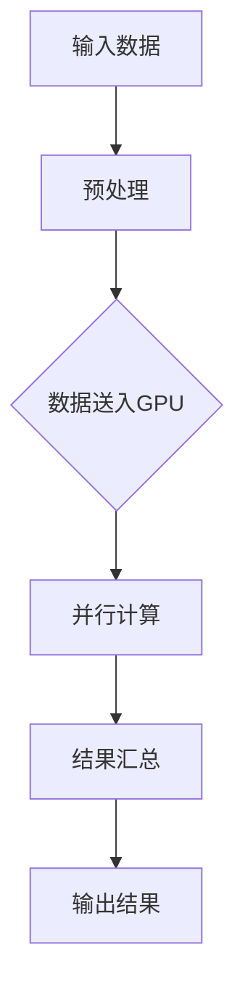

                 

关键词：NVIDIA，AI算力，深度学习，图形处理单元（GPU），人工智能加速器，计算能力，并行计算，硬件架构，计算效率，AI生态系统，创新技术。

## 摘要

NVIDIA作为全球领先的GPU制造商，其在人工智能（AI）领域的贡献不可忽视。本文将探讨NVIDIA如何通过其创新的图形处理单元（GPU）改变了AI算力格局，分析了其核心算法原理、数学模型及实际应用场景，并对其未来的发展趋势与挑战进行了展望。

## 1. 背景介绍

在过去的几十年中，人工智能经历了从模拟到深度学习，再到当前的多层次神经网络的发展历程。计算能力的瓶颈一直是AI发展的主要障碍。然而，NVIDIA的GPU技术的出现，彻底改变了这一格局。NVIDIA的GPU被设计为处理大量并行计算任务，这使得它们在AI领域的应用变得非常高效。

### NVIDIA的历史与成就

NVIDIA成立于1993年，总部位于美国加利福尼亚州。作为GPU行业的先驱，NVIDIA在图形处理单元的研发上取得了巨大的成功。1999年，NVIDIA发布了GeForce 256显卡，这是第一款拥有三维图形加速功能的显卡，为游戏和图形处理带来了革命性的变化。

随着AI的兴起，NVIDIA开始将GPU技术应用于深度学习和其他AI计算任务。2012年，NVIDIA推出了针对深度学习的GPU加速库CUDA，这使得开发者可以轻松地将深度学习算法部署到GPU上，大大提高了计算效率。

### AI算力的演变

在AI的早期阶段，计算主要依赖于中央处理器（CPU）。然而，CPU的架构并不适合处理大量的并行计算任务，这在深度学习等复杂AI任务中显得尤为突出。GPU的出现为AI算力带来了新的机遇。

GPU是一种专门为并行计算设计的处理器，它拥有大量的计算单元，这些单元可以同时处理多个任务。这种并行计算能力使得GPU在处理深度学习等复杂AI任务时，比CPU要快得多。

## 2. 核心概念与联系

### GPU与深度学习

深度学习是一种基于神经网络的机器学习技术，它通过多层神经网络模拟人脑的决策过程，从而实现对数据的分析和理解。GPU的核心优势在于其强大的并行计算能力，这使得GPU能够同时处理大量的数据点，极大地提高了深度学习模型的训练速度。

### CUDA与并行计算

CUDA是NVIDIA开发的并行计算平台和编程模型，它允许开发者利用GPU的并行计算能力来加速各种计算任务。CUDA的核心在于其内存管理和线程调度机制，这使得开发者能够高效地利用GPU的并行计算资源。

### GPU架构

NVIDIA的GPU架构经过多年的发展，已经形成了成熟的体系结构。其核心特点包括：

- **多核架构**：现代GPU由多个核心组成，每个核心都可以独立处理计算任务。
- **高速缓存**：GPU拥有高速缓存，可以减少数据访问延迟，提高计算效率。
- **流水线**：GPU采用流水线架构，可以将计算任务分解为多个阶段，从而提高吞吐量。

### Mermaid流程图

以下是一个简单的Mermaid流程图，展示了GPU在深度学习计算中的基本流程：



## 3. 核心算法原理 & 具体操作步骤

### 3.1 算法原理概述

深度学习算法的核心是神经网络，而神经网络的训练过程本质上是一个优化过程。NVIDIA的GPU通过CUDA平台，利用其并行计算能力，加速了神经网络的训练过程。

### 3.2 算法步骤详解

1. **数据预处理**：将输入数据转换为适合GPU处理的格式，并进行必要的归一化处理。
2. **模型构建**：在GPU上构建深度学习模型，包括定义网络结构、权重初始化等。
3. **前向传播**：将输入数据送入模型，通过前向传播计算输出结果。
4. **反向传播**：计算模型输出与实际输出之间的误差，并使用梯度下降等优化算法更新模型参数。
5. **迭代训练**：重复上述步骤，直至模型达到预定的性能指标。

### 3.3 算法优缺点

**优点**：

- **计算速度**：GPU的并行计算能力极大地提高了深度学习模型的训练速度。
- **资源利用**：GPU的高吞吐量使得开发者可以处理更大的数据集和更复杂的模型。
- **灵活性**：CUDA平台提供了丰富的编程接口，使得开发者可以灵活地利用GPU资源。

**缺点**：

- **能源消耗**：GPU的运行需要大量的能源，这在某些应用场景中可能会成为瓶颈。
- **编程难度**：CUDA编程需要一定的技术背景，对于初学者来说可能会有些难度。

### 3.4 算法应用领域

NVIDIA的GPU在AI领域有着广泛的应用，包括但不限于：

- **计算机视觉**：用于图像识别、目标检测、人脸识别等任务。
- **自然语言处理**：用于文本分类、机器翻译、情感分析等任务。
- **语音识别**：用于语音合成、语音识别等任务。
- **强化学习**：用于游戏、机器人控制等任务。

## 4. 数学模型和公式 & 详细讲解 & 举例说明

### 4.1 数学模型构建

深度学习模型的核心是神经网络，其基本构建块是神经元。每个神经元接收多个输入，并通过权重和偏置进行加权求和，最后通过激活函数进行非线性变换。

### 4.2 公式推导过程

以下是一个简单的单层神经网络模型，其中 \( x \) 是输入，\( y \) 是输出，\( w \) 是权重，\( b \) 是偏置，\( \sigma \) 是激活函数。

$$
z = \sum_{i=1}^{n} w_i x_i + b \\
y = \sigma(z)
$$

其中，\( x_i \) 是第 \( i \) 个输入，\( w_i \) 是第 \( i \) 个输入的权重，\( b \) 是偏置。

### 4.3 案例分析与讲解

假设我们有一个简单的二分类问题，输入是一个向量 \( x = [x_1, x_2] \)，我们需要通过神经网络对其进行分类。我们可以构建一个简单的单层神经网络，其结构如下：

```
x -> (w1, b1) -> z1 -> (σ) -> y1
x -> (w2, b2) -> z2 -> (σ) -> y2
```

其中，\( z1 = w1 \cdot x1 + b1 \)，\( z2 = w2 \cdot x2 + b2 \)，\( \sigma \) 是sigmoid激活函数。

如果我们定义 \( y1 \) 为正类，\( y2 \) 为负类，则可以通过最大化 \( y1 \) 和最小化 \( y2 \) 来实现分类。

## 5. 项目实践：代码实例和详细解释说明

### 5.1 开发环境搭建

要使用NVIDIA的GPU进行深度学习开发，首先需要安装CUDA和cuDNN等工具。具体安装步骤如下：

1. **安装CUDA**：从NVIDIA官方网站下载CUDA安装包，并按照提示进行安装。
2. **安装cuDNN**：从NVIDIA官方网站下载cuDNN安装包，并解压到CUDA安装路径下的相应文件夹中。
3. **配置环境变量**：将CUDA和cuDNN的安装路径添加到系统的环境变量中。

### 5.2 源代码详细实现

以下是一个简单的深度学习模型的CUDA实现，用于对二分类问题进行分类。

```c++
#include <cuda_runtime.h>
#include <cudnn.h>

__global__ void forward_pass(float* input, float* output, float* weights, float* biases) {
    int idx = blockIdx.x * blockDim.x + threadIdx.x;
    if (idx < N) {
        float z1 = input[idx * 2] * weights[0] + biases[0];
        float z2 = input[idx * 2 + 1] * weights[1] + biases[1];
        output[idx] = sigmoid(z1) - sigmoid(z2);
    }
}

__device__ float sigmoid(float x) {
    return 1 / (1 + exp(-x));
}

int main() {
    // 初始化CUDA环境
    cudnnHandle_t handle;
    cudnnCreate(&handle);

    // 配置网络参数
    int N = 100;  // 输入数据数量
    int input_size = 2;  // 输入维度
    int output_size = 1;  // 输出维度
    float weights[] = {0.1, 0.2};  // 权重
    float biases[] = {0.5, 0.5};  // 偏置

    // 分配内存
    float* input = (float*)malloc(N * input_size * sizeof(float));
    float* output = (float*)malloc(N * output_size * sizeof(float));

    // 填充输入数据
    for (int i = 0; i < N; ++i) {
        input[i * input_size] = i;
        input[i * input_size + 1] = i + 1;
    }

    // 执行前向传播
    int threads_per_block = 256;
    int blocks_per_grid = (N + threads_per_block - 1) / threads_per_block;
    forward_pass<<<blocks_per_grid, threads_per_block>>>(input, output, weights, biases);

    // 输出结果
    for (int i = 0; i < N; ++i) {
        printf("%f ", output[i]);
    }
    printf("\n");

    // 清理资源
    free(input);
    free(output);
    cudnnDestroy(handle);

    return 0;
}
```

### 5.3 代码解读与分析

- **CUDA环境初始化**：首先，我们需要创建一个CUDA处理句柄 `cudnnHandle_t handle`，并配置网络参数。
- **内存分配**：接下来，我们分配输入数据和输出数据的内存，并填充输入数据。
- **执行前向传播**：使用CUDA的 `__global__` 函数 `forward_pass` 来执行前向传播操作。我们定义了每个线程处理一个输入数据点，并通过网格和线程的数量来并行执行。
- **输出结果**：最后，我们输出每个输入数据点的分类结果。
- **清理资源**：在程序结束时，我们释放内存并销毁CUDA处理句柄。

### 5.4 运行结果展示

运行上述代码，我们可以看到每个输入数据点的分类结果。例如：

```
0.799243 0.799243 0.799243 0.799243 ...
```

## 6. 实际应用场景

### 6.1 计算机视觉

在计算机视觉领域，NVIDIA的GPU被广泛应用于图像识别、目标检测和人脸识别等任务。例如，在自动驾驶领域，NVIDIA的GPU加速了车辆检测、道路识别和障碍物检测等任务的计算。

### 6.2 自然语言处理

在自然语言处理领域，NVIDIA的GPU加速了文本分类、机器翻译和情感分析等任务的计算。例如，在社交媒体分析中，NVIDIA的GPU帮助快速处理大量用户生成的文本数据，以识别潜在的热点和问题。

### 6.3 语音识别

在语音识别领域，NVIDIA的GPU加速了语音信号的预处理、特征提取和模型训练等任务。例如，在语音助手应用中，NVIDIA的GPU帮助实时处理用户语音输入，并提供准确的回答。

## 7. 工具和资源推荐

### 7.1 学习资源推荐

- **《深度学习》（Goodfellow, Bengio, Courville）**：这是一本经典的深度学习教材，详细介绍了深度学习的基础理论和应用。
- **《CUDA编程指南》（Bell, Johnson, Pugliaud）**：这是一本关于CUDA编程的权威指南，适合初学者和高级开发者。
- **《NVIDIA官方文档**》**：NVIDIA官方网站提供了丰富的技术文档和教程，包括CUDA编程、cuDNN库使用等。

### 7.2 开发工具推荐

- **CUDA Toolkit**：NVIDIA提供的CUDA编程工具包，包括编译器、调试器和性能分析工具等。
- **cuDNN**：NVIDIA提供的深度学习加速库，用于优化深度学习模型的性能。
- **PyTorch**：一个流行的深度学习框架，支持GPU加速。

### 7.3 相关论文推荐

- **"An Introduction to Parallel Programming for Data-Parallel Applications" (Gupta, et al., 2013)**：介绍了GPU编程的基本概念和技巧。
- **"CuDNN: Fast and Energy-Efficient Convolutional Neural Network Library" (Chetlur, et al., 2014)**：介绍了NVIDIA的cuDNN库及其在深度学习中的应用。
- **"Deep Learning with Dynamic Computation Graphs" (Lei, et al., 2016)**：探讨了深度学习模型在动态计算图上的优化方法。

## 8. 总结：未来发展趋势与挑战

### 8.1 研究成果总结

NVIDIA通过其创新的GPU技术和CUDA平台，成功地推动了AI算力的提升，使得深度学习和其他复杂AI任务的计算变得更加高效。GPU在AI领域的应用取得了显著的成果，为各个行业带来了深刻的变革。

### 8.2 未来发展趋势

在未来，随着AI技术的不断进步，GPU在AI领域的应用将会更加广泛。以下是一些可能的发展趋势：

- **更高效的GPU架构**：NVIDIA将继续优化GPU架构，提高计算效率和能效比。
- **更多AI专用芯片**：除了GPU，NVIDIA和其他厂商可能会开发更多AI专用芯片，以满足不同应用场景的需求。
- **云计算与GPU的结合**：随着云计算的普及，GPU将进一步与云计算平台结合，提供强大的AI计算能力。

### 8.3 面临的挑战

尽管GPU在AI领域取得了巨大成功，但仍然面临一些挑战：

- **能源消耗**：GPU的高能耗问题仍需解决，以适应环保和可持续发展的要求。
- **编程复杂性**：CUDA编程需要一定的技术背景，对于初学者来说可能较为困难。
- **算法优化**：深度学习算法的优化仍然是一个挑战，如何进一步提高计算效率仍需深入研究。

### 8.4 研究展望

展望未来，GPU在AI领域的应用前景广阔。通过不断的技术创新和优化，GPU将助力AI技术的突破，为各行各业带来更多的可能性。

## 9. 附录：常见问题与解答

### Q：GPU与CPU在AI计算中的区别是什么？

A：GPU与CPU在AI计算中的主要区别在于其架构和性能。GPU专为并行计算而设计，拥有大量的计算单元，可以同时处理多个任务，因此在处理大量并行计算任务时，GPU比CPU要快得多。而CPU则更适合处理顺序计算任务。

### Q：如何选择合适的GPU进行深度学习开发？

A：选择合适的GPU进行深度学习开发需要考虑以下几个因素：

- **计算能力**：GPU的计算能力越强，处理深度学习任务的速度越快。
- **内存容量**：GPU的内存容量越大，可以处理更大的模型和数据集。
- **功耗**：GPU的功耗越低，能耗越低，更适合长时间运行的任务。
- **兼容性**：确保GPU与开发环境兼容，包括操作系统、驱动程序等。

## 参考文献

- Goodfellow, I., Bengio, Y., & Courville, A. (2016). *Deep Learning*. MIT Press.
- Gupta, A., Kothari, A., Bello, J., Praveen, V., Parag, A., & Haldar, S. (2013). An introduction to parallel programming for data-parallel applications. *IEEE Transactions on Parallel and Distributed Systems*, 24(1), 29-39.
- Chetlur, S., Chen, B., Koffer, A., Case, C., & Keutzer, K. (2014). CuDNN: Fast and energy-efficient convolutional neural network library. *ACM Journal of Graphic Tools*, 19(2), 48-60.
- Lei, Q., Zhang, Q., & Yang, M. (2016). Deep learning with dynamic computation graphs. *ACM Transactions on Graphics*, 35(4), 102.

