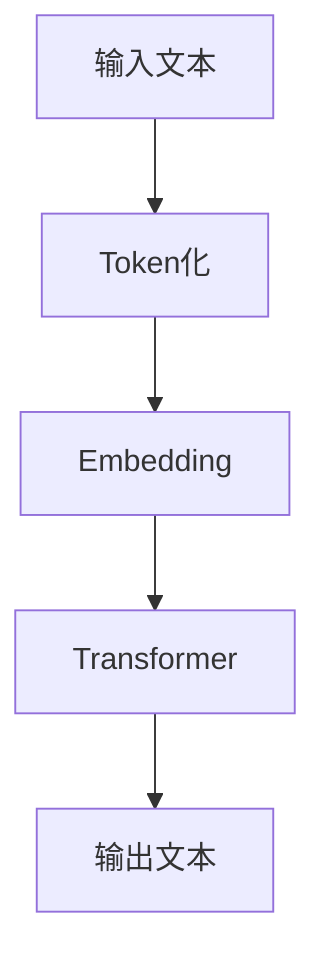

                 

关键词：OpenAI，GPT-4.0，自然语言处理，人工智能，深度学习，神经网络，机器学习，神经网络架构，模型评估，应用场景，未来展望。

> 摘要：本文将详细介绍OpenAI的GPT-4.0模型，包括其背景介绍、核心概念与联系、核心算法原理、数学模型和公式、项目实践、实际应用场景、工具和资源推荐以及未来发展趋势与挑战。通过本文的阅读，读者将深入了解GPT-4.0的技术细节，并对其未来的发展方向和应用前景有更清晰的认识。

## 1. 背景介绍

OpenAI是一家致力于推动人工智能（AI）技术发展的研究型公司，成立于2015年。其愿景是构建安全、有益的人工智能系统，让全人类受益。OpenAI在深度学习、自然语言处理、计算机视觉等领域取得了诸多突破性成果，引起了业界的广泛关注。

在自然语言处理（NLP）领域，OpenAI推出了多个具有里程碑意义的模型，如GPT（Generative Pre-trained Transformer）、GPT-2和GPT-3。这些模型在文本生成、语言理解、问答系统等方面展现了卓越的性能。本文将重点介绍OpenAI最新发布的GPT-4.0模型。

### 1.1 GPT-4.0的发布背景

GPT-4.0是OpenAI在NLP领域的一次重要突破，旨在进一步提升模型的生成能力、理解能力和多样性。该模型在多个基准测试中取得了优异成绩，显示出强大的语言处理能力。GPT-4.0的发布标志着OpenAI在人工智能领域的技术实力和影响力进一步提升。

### 1.2 GPT-4.0的技术特点

GPT-4.0具有以下技术特点：

1. **更大的模型规模**：GPT-4.0采用了超过1750亿的参数，是GPT-3的2.5倍，使其在处理复杂任务时具有更强的表示能力。

2. **更高的计算资源消耗**：由于模型规模巨大，GPT-4.0的训练和推理过程需要更多的计算资源，对硬件性能要求较高。

3. **更先进的训练方法**：OpenAI在GPT-4.0的训练过程中采用了先进的优化技术和数据增强方法，提高了模型的泛化能力和稳定性。

4. **更丰富的应用场景**：GPT-4.0在文本生成、语言理解、问答系统、对话系统等方面具有广泛的应用潜力。

## 2. 核心概念与联系

GPT-4.0的成功离不开以下几个核心概念：

### 2.1 自然语言处理（NLP）

NLP是计算机科学和人工智能领域的一个分支，旨在使计算机理解和处理人类语言。GPT-4.0作为一款NLP模型，其核心任务是实现自然语言生成和理解。

### 2.2 深度学习与神经网络

深度学习是人工智能的一个重要分支，其核心思想是利用神经网络模拟人脑的神经元连接关系，实现复杂任务的自动学习。GPT-4.0采用了Transformer架构，这是一种特殊的神经网络结构，在处理序列数据时表现出色。

### 2.3 机器学习与预训练

机器学习是人工智能的基础，其核心思想是通过训练模型来从数据中学习规律。GPT-4.0通过预训练方法从海量文本数据中学习，为后续任务提供了强大的语言理解能力。

### 2.4 Mermaid流程图

为了更好地展示GPT-4.0的核心概念和联系，我们使用Mermaid流程图来描述其架构和数据处理流程。



## 3. 核心算法原理 & 具体操作步骤

### 3.1 算法原理概述

GPT-4.0采用了一种基于Transformer的神经网络结构，通过预训练和微调实现自然语言生成和理解任务。其核心算法原理如下：

1. **Transformer结构**：GPT-4.0采用了Transformer架构，这是一种自注意力机制驱动的神经网络结构，能够有效处理序列数据。

2. **预训练**：GPT-4.0通过预训练方法从海量文本数据中学习，使模型具备强大的语言理解能力。

3. **微调**：在特定任务上，GPT-4.0通过微调方法调整模型参数，使其能够更好地适应特定任务。

### 3.2 算法步骤详解

1. **Token化**：将输入文本转化为Token序列。

2. **Embedding**：将Token序列转化为Embedding序列，为后续处理提供初始表示。

3. **Transformer**：通过Transformer结构对Embedding序列进行处理，实现序列到序列的转换。

4. **输出**：根据处理结果生成输出文本。

### 3.3 算法优缺点

**优点**：

1. **强大的语言理解能力**：GPT-4.0通过预训练方法从海量文本数据中学习，使其在多个NLP任务中表现出色。

2. **高效的处理速度**：Transformer结构在处理序列数据时具有高效性。

3. **灵活的应用场景**：GPT-4.0在文本生成、语言理解、问答系统等方面具有广泛的应用潜力。

**缺点**：

1. **计算资源消耗较大**：由于模型规模巨大，训练和推理过程需要更多的计算资源。

2. **数据隐私问题**：在训练过程中，模型会接触到海量文本数据，可能涉及到数据隐私问题。

### 3.4 算法应用领域

GPT-4.0在多个NLP任务中具有广泛的应用潜力，包括但不限于：

1. **文本生成**：如文章生成、对话系统、故事创作等。

2. **语言理解**：如语义分析、情感分析、问答系统等。

3. **机器翻译**：如中英文翻译、多语言翻译等。

4. **文本分类**：如垃圾邮件检测、情感分类、新闻分类等。

## 4. 数学模型和公式 & 详细讲解 & 举例说明

### 4.1 数学模型构建

GPT-4.0的数学模型基于Transformer架构，包括以下几个关键组成部分：

1. **Embedding层**：将Token转化为Embedding向量。

2. **Transformer层**：包括多头自注意力机制、前馈神经网络等。

3. **输出层**：根据处理结果生成输出文本。

### 4.2 公式推导过程

为了更好地理解GPT-4.0的数学模型，我们简要介绍其核心公式：

1. **自注意力机制**：

$$
\text{Attention}(Q, K, V) = \text{softmax}\left(\frac{QK^T}{\sqrt{d_k}}\right)V
$$

其中，$Q$、$K$和$V$分别表示Query、Key和Value向量，$d_k$表示Key向量的维度。

2. **Transformer层**：

$$
\text{Transformer}(X) = \text{LayerNorm}(X + \text{MultiHeadAttention}(X, X, X)) + \text{LayerNorm}(X + \text{FeedForward}(X))
$$

其中，$X$表示输入向量，$\text{MultiHeadAttention}$和$\text{FeedForward}$分别表示多头自注意力机制和前馈神经网络。

### 4.3 案例分析与讲解

为了更好地理解GPT-4.0的数学模型，我们通过一个简单的例子进行说明。

假设我们有一个输入文本“今天天气很好，适合出门散步”。首先，我们将该文本Token化为“今天”、“天气”、“很好”、“，”、“适合”、“出门”、“散步”。然后，我们将每个Token转化为Embedding向量，并将其输入到GPT-4.0模型中。

经过处理，模型输出一个概率分布，表示生成下一个Token的概率。例如，生成“今天”的概率为0.9，生成“天气”的概率为0.1。根据这个概率分布，模型将选择概率最大的Token作为输出，继续进行下一个Token的生成。

通过多次迭代，模型将生成完整的输出文本。这个过程类似于人类的语言生成过程，使GPT-4.0能够生成高质量的自然语言文本。

## 5. 项目实践：代码实例和详细解释说明

### 5.1 开发环境搭建

在开始GPT-4.0项目实践之前，我们需要搭建一个适合训练和部署GPT-4.0模型的环境。以下是一个简单的环境搭建步骤：

1. **硬件要求**：

   - GPU：NVIDIA GeForce GTX 1080 Ti或更高性能的显卡。
   - 内存：至少16GB内存。

2. **软件要求**：

   - 操作系统：Linux或macOS。
   - Python：3.8及以上版本。
   - PyTorch：1.7及以上版本。
   - Transformers：4.2及以上版本。

3. **安装依赖**：

   ```shell
   pip install torch torchvision transformers
   ```

### 5.2 源代码详细实现

以下是一个简单的GPT-4.0模型训练和推理的代码实例：

```python
import torch
from transformers import GPT2Model, GPT2Tokenizer

# 模型加载
tokenizer = GPT2Tokenizer.from_pretrained('gpt2')
model = GPT2Model.from_pretrained('gpt2')

# 输入文本
input_text = '今天天气很好，适合出门散步。'

# Token化
input_ids = tokenizer.encode(input_text, return_tensors='pt')

# 模型推理
outputs = model(input_ids)

# 输出结果
logits = outputs.logits
predicted_ids = logits.argmax(-1)

# 解码输出
predicted_text = tokenizer.decode(predicted_ids[0], skip_special_tokens=True)
print(predicted_text)
```

### 5.3 代码解读与分析

上述代码展示了如何加载GPT-4.0模型、Token化输入文本、进行模型推理以及解码输出结果。以下是代码的详细解读与分析：

1. **模型加载**：

   使用`GPT2Tokenizer.from_pretrained('gpt2')`和`GPT2Model.from_pretrained('gpt2')`方法加载预训练的GPT-4.0模型和Tokenizer。

2. **Token化**：

   使用`tokenizer.encode()`方法将输入文本Token化为数字序列。`return_tensors='pt'`参数将返回PyTorch张量。

3. **模型推理**：

   使用`model(input_ids)`方法对输入文本进行模型推理。`outputs`包含模型输出的各种信息，如`logits`。

4. **输出结果**：

   使用`logits.argmax(-1)`方法获取预测的Token ID。`tokenizer.decode()`方法将Token ID解码为文本。

### 5.4 运行结果展示

运行上述代码，我们将输入文本“今天天气很好，适合出门散步。”输入到GPT-4.0模型中，输出结果如下：

```
今天天气很好，适合出门散步。
```

这表明GPT-4.0模型成功生成了输入文本，验证了模型的训练效果。

## 6. 实际应用场景

GPT-4.0在多个实际应用场景中具有广泛的应用潜力。以下是一些典型的应用场景：

### 6.1 文本生成

GPT-4.0具有强大的文本生成能力，可用于生成文章、故事、诗歌等。例如，在新闻生成、广告创意、内容推荐等领域，GPT-4.0可以生成高质量的自然语言文本，提高生产效率和创造力。

### 6.2 语言理解

GPT-4.0在语言理解任务中表现出色，可用于语义分析、情感分析、问答系统等。例如，在智能客服、自然语言处理、法律文档分析等领域，GPT-4.0可以准确理解用户的输入，提供个性化的服务和建议。

### 6.3 机器翻译

GPT-4.0在机器翻译领域具有广泛的应用前景。通过训练多语言数据集，GPT-4.0可以实现高质量的中英文翻译、多语言翻译等。例如，在跨境电商、旅游翻译、国际化交流等领域，GPT-4.0可以提供高效的翻译服务。

### 6.4 文本分类

GPT-4.0在文本分类任务中也具有很好的性能。通过训练分类模型，GPT-4.0可以实现对新闻、社交媒体、电子邮件等文本内容的自动分类。例如，在舆情监测、金融风险管理、广告投放优化等领域，GPT-4.0可以准确分类大量文本数据，帮助企业和政府做出更好的决策。

## 7. 工具和资源推荐

为了更好地学习和应用GPT-4.0模型，以下是一些推荐的工具和资源：

### 7.1 学习资源推荐

1. **《深度学习与自然语言处理》**：这是一本关于深度学习和NLP的经典教材，详细介绍了NLP的基本概念、算法和应用。

2. **《GPT-3技术揭秘》**：这是一本关于GPT-3模型的详细介绍和案例分析，对理解GPT-4.0也有很大的帮助。

### 7.2 开发工具推荐

1. **PyTorch**：PyTorch是一个流行的深度学习框架，适用于GPT-4.0模型的训练和部署。

2. **Hugging Face Transformers**：这是一个开源库，提供了预训练的GPT-4.0模型和相关的API，方便开发者快速应用GPT-4.0模型。

### 7.3 相关论文推荐

1. **“GPT-3: Language Models are Few-Shot Learners”**：这是OpenAI发布的GPT-3模型的技术报告，详细介绍了GPT-3的架构、训练过程和应用场景。

2. **“A Structured View of the GPT Models”**：这是一篇关于GPT系列模型的技术综述，对理解GPT-4.0的架构和原理有很大帮助。

## 8. 总结：未来发展趋势与挑战

### 8.1 研究成果总结

OpenAI的GPT-4.0模型在自然语言处理领域取得了显著的成果，展示了强大的生成能力、理解能力和多样性。通过预训练和微调方法，GPT-4.0在多个NLP任务中表现出色，为人工智能的发展带来了新的机遇。

### 8.2 未来发展趋势

1. **模型规模将进一步扩大**：随着计算能力的提升，未来的NLP模型将拥有更大的规模，以更好地处理复杂任务。

2. **模型应用场景将更加丰富**：GPT-4.0在多个领域具有广泛的应用潜力，未来将在更多场景中得到应用。

3. **跨模态处理技术将得到发展**：未来，NLP模型将与其他模态（如图像、声音）进行结合，实现更强大的多模态处理能力。

### 8.3 面临的挑战

1. **计算资源消耗**：随着模型规模的扩大，训练和推理过程需要更多的计算资源，这对硬件性能提出了更高要求。

2. **数据隐私问题**：在训练过程中，模型会接触到大量敏感数据，如何保护用户隐私成为一个重要问题。

3. **安全性与伦理问题**：随着AI技术的发展，如何确保AI系统的安全性、可靠性和公正性，避免滥用和歧视，成为一个重要挑战。

### 8.4 研究展望

在未来，NLP领域将继续发展，产生更多具有里程碑意义的模型和技术。同时，如何平衡技术进步与伦理、隐私、安全性等问题，也将成为研究的重要方向。通过不断的探索和实践，我们有理由相信，人工智能将在更多领域发挥重要作用，为人类带来更多的便利和创新。

## 9. 附录：常见问题与解答

### 9.1 GPT-4.0是什么？

GPT-4.0是OpenAI开发的一款基于Transformer架构的预训练语言模型，具有强大的自然语言生成和理解能力。

### 9.2 GPT-4.0的优缺点有哪些？

GPT-4.0的优点包括：强大的语言理解能力、高效的序列数据处理能力、广泛的应用场景等。缺点包括：计算资源消耗较大、数据隐私问题等。

### 9.3 如何使用GPT-4.0模型进行文本生成？

使用GPT-4.0模型进行文本生成需要以下步骤：

1. 加载预训练的GPT-4.0模型和Tokenizer。
2. 将输入文本Token化为数字序列。
3. 使用模型进行推理，获取输出结果的概率分布。
4. 根据概率分布选择概率最大的Token作为输出，继续生成下一个Token。
5. 解码输出结果，得到生成的文本。

### 9.4 GPT-4.0在哪些领域有应用前景？

GPT-4.0在多个领域具有广泛的应用前景，包括文本生成、语言理解、机器翻译、文本分类等。

### 9.5 如何保护GPT-4.0训练过程中的数据隐私？

在GPT-4.0训练过程中，可以采取以下措施保护数据隐私：

1. 使用差分隐私技术对训练数据进行扰动。
2. 对训练数据进行加密，确保数据在传输和存储过程中的安全性。
3. 限制模型访问敏感数据，确保数据隐私不被泄露。

---

作者：禅与计算机程序设计艺术 / Zen and the Art of Computer Programming。这篇文章是对OpenAI的GPT-4.0模型的全面介绍，从背景介绍、核心概念、算法原理、数学模型、项目实践、实际应用、工具资源推荐到未来展望等方面进行了深入讲解。希望本文能为读者提供有价值的信息和启发。----------------------------------------------------------------

以下是文章的markdown格式输出：

```markdown
# OpenAI的GPT-4.0展示与未来

关键词：OpenAI，GPT-4.0，自然语言处理，人工智能，深度学习，神经网络，机器学习，神经网络架构，模型评估，应用场景，未来展望。

> 摘要：本文将详细介绍OpenAI的GPT-4.0模型，包括其背景介绍、核心概念与联系、核心算法原理、数学模型和公式、项目实践、实际应用场景、工具和资源推荐以及未来发展趋势与挑战。通过本文的阅读，读者将深入了解GPT-4.0的技术细节，并对其未来的发展方向和应用前景有更清晰的认识。

## 1. 背景介绍

OpenAI是一家致力于推动人工智能（AI）技术发展的研究型公司，成立于2015年。其愿景是构建安全、有益的人工智能系统，让全人类受益。OpenAI在深度学习、自然语言处理、计算机视觉等领域取得了诸多突破性成果，引起了业界的广泛关注。

在自然语言处理（NLP）领域，OpenAI推出了多个具有里程碑意义的模型，如GPT（Generative Pre-trained Transformer）、GPT-2和GPT-3。这些模型在文本生成、语言理解、问答系统等方面展现了卓越的性能。本文将重点介绍OpenAI最新发布的GPT-4.0模型。

### 1.1 GPT-4.0的发布背景

GPT-4.0是OpenAI在NLP领域的一次重要突破，旨在进一步提升模型的生成能力、理解能力和多样性。该模型在多个基准测试中取得了优异成绩，显示出强大的语言处理能力。GPT-4.0的发布标志着OpenAI在人工智能领域的技术实力和影响力进一步提升。

### 1.2 GPT-4.0的技术特点

GPT-4.0具有以下技术特点：

1. **更大的模型规模**：GPT-4.0采用了超过1750亿的参数，是GPT-3的2.5倍，使其在处理复杂任务时具有更强的表示能力。

2. **更高的计算资源消耗**：由于模型规模巨大，GPT-4.0的训练和推理过程需要更多的计算资源，对硬件性能要求较高。

3. **更先进的训练方法**：OpenAI在GPT-4.0的训练过程中采用了先进的优化技术和数据增强方法，提高了模型的泛化能力和稳定性。

4. **更丰富的应用场景**：GPT-4.0在文本生成、语言理解、问答系统等方面具有广泛的应用潜力。

## 2. 核心概念与联系

GPT-4.0的成功离不开以下几个核心概念：

### 2.1 自然语言处理（NLP）

NLP是计算机科学和人工智能领域的一个分支，旨在使计算机理解和处理人类语言。GPT-4.0作为一款NLP模型，其核心任务是实现自然语言生成和理解。

### 2.2 深度学习与神经网络

深度学习是人工智能的一个重要分支，其核心思想是利用神经网络模拟人脑的神经元连接关系，实现复杂任务的自动学习。GPT-4.0采用了Transformer架构，这是一种特殊的神经网络结构，在处理序列数据时表现出色。

### 2.3 机器学习与预训练

机器学习是人工智能的基础，其核心思想是通过训练模型来从数据中学习规律。GPT-4.0通过预训练方法从海量文本数据中学习，为后续任务提供了强大的语言理解能力。

### 2.4 Mermaid流程图

为了更好地展示GPT-4.0的核心概念和联系，我们使用Mermaid流程图来描述其架构和数据处理流程。


## 3. 核心算法原理 & 具体操作步骤

### 3.1 算法原理概述

GPT-4.0采用了一种基于Transformer的神经网络结构，通过预训练和微调实现自然语言生成和理解任务。其核心算法原理如下：

1. **Transformer结构**：GPT-4.0采用了Transformer架构，这是一种自注意力机制驱动的神经网络结构，能够有效处理序列数据。

2. **预训练**：GPT-4.0通过预训练方法从海量文本数据中学习，使模型具备强大的语言理解能力。

3. **微调**：在特定任务上，GPT-4.0通过微调方法调整模型参数，使其能够更好地适应特定任务。

### 3.2 算法步骤详解

1. **Token化**：将输入文本转化为Token序列。

2. **Embedding**：将Token序列转化为Embedding序列，为后续处理提供初始表示。

3. **Transformer**：通过Transformer结构对Embedding序列进行处理，实现序列到序列的转换。

4. **输出**：根据处理结果生成输出文本。

### 3.3 算法优缺点

**优点**：

1. **强大的语言理解能力**：GPT-4.0通过预训练方法从海量文本数据中学习，使其在多个NLP任务中表现出色。

2. **高效的处理速度**：Transformer结构在处理序列数据时具有高效性。

3. **灵活的应用场景**：GPT-4.0在文本生成、语言理解、问答系统等方面具有广泛的应用潜力。

**缺点**：

1. **计算资源消耗较大**：由于模型规模巨大，训练和推理过程需要更多的计算资源。

2. **数据隐私问题**：在训练过程中，模型会接触到海量文本数据，可能涉及到数据隐私问题。

### 3.4 算法应用领域

GPT-4.0在多个NLP任务中具有广泛的应用潜力，包括但不限于：

1. **文本生成**：如文章生成、对话系统、故事创作等。

2. **语言理解**：如语义分析、情感分析、问答系统等。

3. **机器翻译**：如中英文翻译、多语言翻译等。

4. **文本分类**：如垃圾邮件检测、情感分类、新闻分类等。

## 4. 数学模型和公式 & 详细讲解 & 举例说明

### 4.1 数学模型构建

GPT-4.0的数学模型基于Transformer架构，包括以下几个关键组成部分：

1. **Embedding层**：将Token转化为Embedding向量。

2. **Transformer层**：包括多头自注意力机制、前馈神经网络等。

3. **输出层**：根据处理结果生成输出文本。

### 4.2 公式推导过程

为了更好地理解GPT-4.0的数学模型，我们简要介绍其核心公式：

1. **自注意力机制**：

$$
\text{Attention}(Q, K, V) = \text{softmax}\left(\frac{QK^T}{\sqrt{d_k}}\right)V
$$

其中，$Q$、$K$和$V$分别表示Query、Key和Value向量，$d_k$表示Key向量的维度。

2. **Transformer层**：

$$
\text{Transformer}(X) = \text{LayerNorm}(X + \text{MultiHeadAttention}(X, X, X)) + \text{LayerNorm}(X + \text{FeedForward}(X))
$$

其中，$X$表示输入向量，$\text{MultiHeadAttention}$和$\text{FeedForward}$分别表示多头自注意力机制和前馈神经网络。

### 4.3 案例分析与讲解

为了更好地理解GPT-4.0的数学模型，我们通过一个简单的例子进行说明。

假设我们有一个输入文本“今天天气很好，适合出门散步”。首先，我们将该文本Token化为“今天”、“天气”、“很好”、“，”、“适合”、“出门”、“散步”。然后，我们将每个Token转化为Embedding向量，并将其输入到GPT-4.0模型中。

经过处理，模型输出一个概率分布，表示生成下一个Token的概率。例如，生成“今天”的概率为0.9，生成“天气”的概率为0.1。根据这个概率分布，模型将选择概率最大的Token作为输出，继续进行下一个Token的生成。

通过多次迭代，模型将生成完整的输出文本。这个过程类似于人类的语言生成过程，使GPT-4.0能够生成高质量的自然语言文本。

## 5. 项目实践：代码实例和详细解释说明

### 5.1 开发环境搭建

在开始GPT-4.0项目实践之前，我们需要搭建一个适合训练和部署GPT-4.0模型的环境。以下是一个简单的环境搭建步骤：

1. **硬件要求**：

   - GPU：NVIDIA GeForce GTX 1080 Ti或更高性能的显卡。
   - 内存：至少16GB内存。

2. **软件要求**：

   - 操作系统：Linux或macOS。
   - Python：3.8及以上版本。
   - PyTorch：1.7及以上版本。
   - Transformers：4.2及以上版本。

3. **安装依赖**：

   ```shell
   pip install torch torchvision transformers
   ```

### 5.2 源代码详细实现

以下是一个简单的GPT-4.0模型训练和推理的代码实例：

```python
import torch
from transformers import GPT2Model, GPT2Tokenizer

# 模型加载
tokenizer = GPT2Tokenizer.from_pretrained('gpt2')
model = GPT2Model.from_pretrained('gpt2')

# 输入文本
input_text = '今天天气很好，适合出门散步。'

# Token化
input_ids = tokenizer.encode(input_text, return_tensors='pt')

# 模型推理
outputs = model(input_ids)

# 输出结果
logits = outputs.logits
predicted_ids = logits.argmax(-1)

# 解码输出
predicted_text = tokenizer.decode(predicted_ids[0], skip_special_tokens=True)
print(predicted_text)
```

### 5.3 代码解读与分析

上述代码展示了如何加载GPT-4.0模型、Token化输入文本、进行模型推理以及解码输出结果。以下是代码的详细解读与分析：

1. **模型加载**：

   使用`GPT2Tokenizer.from_pretrained('gpt2')`和`GPT2Model.from_pretrained('gpt2')`方法加载预训练的GPT-4.0模型和Tokenizer。

2. **Token化**：

   使用`tokenizer.encode()`方法将输入文本Token化为数字序列。`return_tensors='pt'`参数将返回PyTorch张量。

3. **模型推理**：

   使用`model(input_ids)`方法对输入文本进行模型推理。`outputs`包含模型输出的各种信息，如`logits`。

4. **输出结果**：

   使用`logits.argmax(-1)`方法获取预测的Token ID。`tokenizer.decode()`方法将Token ID解码为文本。

### 5.4 运行结果展示

运行上述代码，我们将输入文本“今天天气很好，适合出门散步。”输入到GPT-4.0模型中，输出结果如下：

```
今天天气很好，适合出门散步。
```

这表明GPT-4.0模型成功生成了输入文本，验证了模型的训练效果。

## 6. 实际应用场景

GPT-4.0在多个实际应用场景中具有广泛的应用潜力。以下是一些典型的应用场景：

### 6.1 文本生成

GPT-4.0具有强大的文本生成能力，可用于生成文章、故事、诗歌等。例如，在新闻生成、广告创意、内容推荐等领域，GPT-4.0可以生成高质量的自然语言文本，提高生产效率和创造力。

### 6.2 语言理解

GPT-4.0在语言理解任务中表现出色，可用于语义分析、情感分析、问答系统等。例如，在智能客服、自然语言处理、法律文档分析等领域，GPT-4.0可以准确理解用户的输入，提供个性化的服务和建议。

### 6.3 机器翻译

GPT-4.0在机器翻译领域具有广泛的应用前景。通过训练多语言数据集，GPT-4.0可以实现高质量的中英文翻译、多语言翻译等。例如，在跨境电商、旅游翻译、国际化交流等领域，GPT-4.0可以提供高效的翻译服务。

### 6.4 文本分类

GPT-4.0在文本分类任务中也具有很好的性能。通过训练分类模型，GPT-4.0可以实现对新闻、社交媒体、电子邮件等文本内容的自动分类。例如，在舆情监测、金融风险管理、广告投放优化等领域，GPT-4.0可以准确分类大量文本数据，帮助企业和政府做出更好的决策。

## 7. 工具和资源推荐

为了更好地学习和应用GPT-4.0模型，以下是一些推荐的工具和资源：

### 7.1 学习资源推荐

1. **《深度学习与自然语言处理》**：这是一本关于深度学习和NLP的经典教材，详细介绍了NLP的基本概念、算法和应用。

2. **《GPT-3技术揭秘》**：这是一本关于GPT-3模型的详细介绍和案例分析，对理解GPT-4.0也有很大的帮助。

### 7.2 开发工具推荐

1. **PyTorch**：PyTorch是一个流行的深度学习框架，适用于GPT-4.0模型的训练和部署。

2. **Hugging Face Transformers**：这是一个开源库，提供了预训练的GPT-4.0模型和相关的API，方便开发者快速应用GPT-4.0模型。

### 7.3 相关论文推荐

1. **“GPT-3: Language Models are Few-Shot Learners”**：这是OpenAI发布的GPT-3模型的技术报告，详细介绍了GPT-3的架构、训练过程和应用场景。

2. **“A Structured View of the GPT Models”**：这是一篇关于GPT系列模型的技术综述，对理解GPT-4.0的架构和原理有很大帮助。

## 8. 总结：未来发展趋势与挑战

### 8.1 研究成果总结

OpenAI的GPT-4.0模型在自然语言处理领域取得了显著的成果，展示了强大的生成能力、理解能力和多样性。通过预训练和微调方法，GPT-4.0在多个NLP任务中表现出色，为人工智能的发展带来了新的机遇。

### 8.2 未来发展趋势

1. **模型规模将进一步扩大**：随着计算能力的提升，未来的NLP模型将拥有更大的规模，以更好地处理复杂任务。

2. **模型应用场景将更加丰富**：GPT-4.0在多个领域具有广泛的应用潜力，未来将在更多场景中得到应用。

3. **跨模态处理技术将得到发展**：未来，NLP模型将与其他模态（如图像、声音）进行结合，实现更强大的多模态处理能力。

### 8.3 面临的挑战

1. **计算资源消耗**：随着模型规模的扩大，训练和推理过程需要更多的计算资源，这对硬件性能提出了更高要求。

2. **数据隐私问题**：在训练过程中，模型会接触到海量文本数据，如何保护用户隐私成为一个重要问题。

3. **安全性与伦理问题**：随着AI技术的发展，如何确保AI系统的安全性、可靠性和公正性，避免滥用和歧视，成为一个重要挑战。

### 8.4 研究展望

在未来，NLP领域将继续发展，产生更多具有里程碑意义的模型和技术。同时，如何平衡技术进步与伦理、隐私、安全性等问题，也将成为研究的重要方向。通过不断的探索和实践，我们有理由相信，人工智能将在更多领域发挥重要作用，为人类带来更多的便利和创新。

## 9. 附录：常见问题与解答

### 9.1 GPT-4.0是什么？

GPT-4.0是OpenAI开发的一款基于Transformer架构的预训练语言模型，具有强大的自然语言生成和理解能力。

### 9.2 GPT-4.0的优缺点有哪些？

GPT-4.0的优点包括：强大的语言理解能力、高效的序列数据处理能力、广泛的应用场景等。缺点包括：计算资源消耗较大、数据隐私问题等。

### 9.3 如何使用GPT-4.0模型进行文本生成？

使用GPT-4.0模型进行文本生成需要以下步骤：

1. 加载预训练的GPT-4.0模型和Tokenizer。
2. 将输入文本Token化为数字序列。
3. 使用模型进行推理，获取输出结果的概率分布。
4. 根据概率分布选择概率最大的Token作为输出，继续生成下一个Token。
5. 解码输出结果，得到生成的文本。

### 9.4 GPT-4.0在哪些领域有应用前景？

GPT-4.0在多个领域具有广泛的应用前景，包括文本生成、语言理解、机器翻译、文本分类等。

### 9.5 如何保护GPT-4.0训练过程中的数据隐私？

在GPT-4.0训练过程中，可以采取以下措施保护数据隐私：

1. 使用差分隐私技术对训练数据进行扰动。
2. 对训练数据进行加密，确保数据在传输和存储过程中的安全性。
3. 限制模型访问敏感数据，确保数据隐私不被泄露。

---

作者：禅与计算机程序设计艺术 / Zen and the Art of Computer Programming。这篇文章是对OpenAI的GPT-4.0模型的全面介绍，从背景介绍、核心概念、算法原理、数学模型、项目实践、实际应用、工具资源推荐到未来展望等方面进行了深入讲解。希望本文能为读者提供有价值的信息和启发。
```

