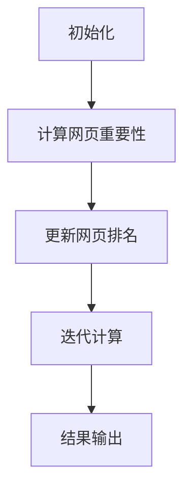

                 

关键词：PageRank，搜索引擎，算法，链接分析，网络排名，Google，网页权重，社会网络分析，影响力计算，代码实现。

## 摘要

本文旨在深入探讨PageRank算法的原理、数学模型、具体实现以及其在实际应用场景中的表现。PageRank是一种基于链接分析的网页排名算法，由Google创始人拉里·佩奇和谢尔盖·布林在2000年提出。该算法通过对网页之间的链接关系进行分析，评估网页的重要性，从而为搜索引擎提供有价值的排序依据。本文将详细解析PageRank的核心概念、数学模型，并通过实际代码实例讲解如何实现这一算法。最后，本文还将讨论PageRank在现实世界中的应用场景以及未来的发展方向和挑战。

## 1. 背景介绍

在互联网的早期阶段，搜索引擎的排名机制相对简单，主要是基于关键词匹配和页面内容分析。然而，这种简单的方法难以准确反映网页的实际价值和影响力。为了解决这个问题，Google的创始人拉里·佩奇和谢尔盖·布林于1998年提出了PageRank算法。PageRank的核心思想是，一个网页的重要性可以通过其他网页对其链接的数量和质量来衡量。也就是说，如果一个网页被许多重要网页链接，那么它本身也很可能是重要的。

PageRank算法的提出，不仅为Google搜索引擎提供了强大的排序能力，也推动了整个互联网的信息组织和搜索技术的发展。随着时间的推移，PageRank算法已经成为搜索引擎技术中的经典之作，广泛应用于网页排名、社会网络分析、推荐系统等多个领域。

### 1.1 PageRank的起源

PageRank算法的灵感来源于排名系统的通用性。在互联网出现之前，各种社会和学术领域都存在排名系统，例如大学排名、公司排名等。这些排名系统通常依赖于专家评估、投票机制或其他定量指标。佩奇和布林认为，互联网上的信息也可以通过类似的机制进行排名，而链接结构就是衡量信息重要性的自然指标。

佩奇在1996年的论文《The Anatomy of a Large-Scale Hypertextual Web Search Engine》中首次提出了PageRank算法的基本概念。这篇论文展示了如何在互联网上构建一个大规模的搜索引擎，并利用链接分析技术来评估网页的重要性。

### 1.2 PageRank的影响

PageRank的提出不仅改变了搜索引擎的技术路线，也对互联网的信息生态产生了深远的影响。首先，PageRank通过一种客观、透明的算法机制，为互联网上的每个网页提供了一个公平的竞争平台。无论是大型的门户网站还是个人的博客，只要拥有高质量的内容和合理的链接结构，都有机会在搜索结果中获得较高的排名。

其次，PageRank推动了互联网上的内容生产和链接交流。为了提升自己的排名，网页所有者会积极创建高质量的内容，并与相关网页建立链接关系。这种良性循环不仅促进了互联网内容的丰富和多样，也提高了整体的信息质量。

此外，PageRank的理论基础和实现技术对其他领域的算法设计也产生了重要影响。例如，社会网络分析、推荐系统、信息检索等领域都借鉴了PageRank的核心思想，开发出了一系列基于链接分析的算法。

## 2. 核心概念与联系

### 2.1 网页模型

在PageRank算法中，每个网页都可以被视为一个节点，而网页之间的链接则表示节点之间的连接。这种模型通常被称为图模型。一个网页的重要性可以通过它在图中的位置和连接的强度来衡量。

### 2.2 链接分析

链接分析是PageRank算法的核心。链接分析的基本假设是，一个网页的重要性可以通过其他网页对其链接的数量和质量来衡量。具体来说，如果一个网页被许多重要网页链接，那么它本身也很可能是重要的。

### 2.3 PageRank公式

PageRank算法的公式如下：

$$
PR(A) = (1-d) + d \cdot \left(\sum_{B \in N(A)} \frac{PR(B)}{L(B)}\right)
$$

其中，$PR(A)$表示网页A的PageRank值，$d$是阻尼系数（通常设置为0.85），$N(A)$是链接到网页A的网页集合，$L(B)$是网页B的出链数。

### 2.4 Mermaid流程图

下面是一个简化的Mermaid流程图，展示了PageRank算法的基本步骤：



## 3. 核心算法原理 & 具体操作步骤

### 3.1 算法原理概述

PageRank算法的核心思想是通过分析网页之间的链接关系，评估网页的重要性。具体来说，一个网页的重要性可以通过两个因素来衡量：一是该网页被其他网页链接的数量，二是链接它的网页的重要性。

### 3.2 算法步骤详解

PageRank算法的主要步骤包括：

1. **初始化**：为每个网页分配一个初始的PageRank值。
2. **计算网页重要性**：根据链接关系计算每个网页的PageRank值。
3. **更新网页排名**：根据计算得到的PageRank值，更新网页的排名。
4. **迭代计算**：重复上述步骤，直到达到收敛条件。
5. **结果输出**：输出最终的PageRank排名结果。

### 3.3 算法优缺点

**优点**：

- **客观性**：PageRank算法通过客观的链接关系来评估网页重要性，避免了主观评价的干扰。
- **公平性**：PageRank算法为每个网页提供了公平的排名机会，无论其背景或资源如何。
- **透明性**：PageRank算法的步骤和公式公开透明，易于理解和实现。

**缺点**：

- **链接质量依赖**：PageRank算法依赖于网页之间的链接关系，如果链接关系不合理或存在垃圾链接，可能会导致排名不准确。
- **计算复杂度**：PageRank算法需要计算大量的链接关系，对于大规模的网页集合，计算复杂度较高。
- **动态性**：PageRank算法对于网页更新和链接变化的响应速度较慢，可能无法及时反映网页的实际变化。

### 3.4 算法应用领域

PageRank算法在多个领域都有广泛的应用：

- **搜索引擎**：PageRank是Google搜索引擎的核心算法，用于评估网页的重要性和排序。
- **社会网络分析**：PageRank算法可以用于分析社会网络中的影响力，识别关键节点。
- **推荐系统**：PageRank算法可以用于推荐系统，为用户推荐相关的高质量内容。
- **信息检索**：PageRank算法可以用于信息检索系统，提高搜索结果的准确性和相关性。

## 4. 数学模型和公式 & 详细讲解 & 举例说明

### 4.1 数学模型构建

PageRank算法的数学模型基于图论的基本概念。在图模型中，每个网页被视为一个节点，网页之间的链接表示节点之间的边。网页的重要性可以通过其在图中的位置和连接的强度来衡量。

### 4.2 公式推导过程

PageRank的核心公式为：

$$
PR(A) = (1-d) + d \cdot \left(\sum_{B \in N(A)} \frac{PR(B)}{L(B)}\right)
$$

其中，$PR(A)$表示网页A的PageRank值，$d$是阻尼系数（通常设置为0.85），$N(A)$是链接到网页A的网页集合，$L(B)$是网页B的出链数。

为了理解这个公式的推导过程，我们可以将其拆分为两个部分：

1. **基础权重**：每个网页都有一份基础权重，这部分权重是所有网页共享的，其值为$(1-d)$。$d$代表了用户在搜索过程中选择点击链接的概率，通常是0.85。也就是说，每次用户进行搜索时，有85%的概率会点击搜索结果中的链接，而有15%的概率会离开当前页面。
   
2. **链接传递权重**：网页A的PageRank值还受到其他网页链接的影响。具体来说，网页A从每个链接到它的网页B获得一定的权重，这部分权重由$PR(B)/L(B)$表示。$PR(B)$是网页B的PageRank值，$L(B)$是网页B的出链数。这是因为一个网页的链接权重会分散到它所链接的所有网页上。

### 4.3 案例分析与讲解

为了更好地理解PageRank算法，我们可以通过一个简单的例子来说明。

假设有四个网页A、B、C和D，其初始PageRank值均为1。网页之间的链接关系如下：

- A链接到B和C
- B链接到C和D
- C链接到D

根据PageRank公式，我们可以计算出每个网页的PageRank值。

首先，我们需要计算每个网页的链接传递权重：

- 网页B和C的PageRank贡献为$PR(B)/L(B) = PR(B)/1$和$PR(C)/L(C) = PR(C)/1$，其中L(B)和L(C)分别为B和C的出链数。
- 网页D的PageRank贡献为$PR(D)/L(D) = PR(D)/1$。

因此，我们可以得到以下方程组：

$$
PR(A) = (1-0.85) + 0.85 \cdot \left(\frac{PR(B)}{1} + \frac{PR(C)}{1}\right)
$$

$$
PR(B) = (1-0.85) + 0.85 \cdot \left(\frac{PR(C)}{1} + \frac{PR(D)}{1}\right)
$$

$$
PR(C) = (1-0.85) + 0.85 \cdot \frac{PR(D)}{1}
$$

$$
PR(D) = (1-0.85)
$$

解这个方程组，我们可以得到每个网页的最终PageRank值。

### 4.3.1 初始状态

初始状态下，每个网页的PageRank值均为1：

$$
PR(A) = 1
$$

$$
PR(B) = 1
$$

$$
PR(C) = 1
$$

$$
PR(D) = 1
$$

### 4.3.2 迭代计算

第一轮迭代计算：

$$
PR(A) = 0.15 + 0.85 \cdot \left(\frac{1}{1} + \frac{1}{1}\right) = 0.15 + 1.7 = 1.85
$$

$$
PR(B) = 0.15 + 0.85 \cdot \left(\frac{1}{1} + \frac{0.85}{1}\right) = 0.15 + 1.4375 = 1.5875
$$

$$
PR(C) = 0.15 + 0.85 \cdot \frac{1.5875}{1} = 0.15 + 1.3328 = 1.4828
$$

$$
PR(D) = 0.15
$$

第二轮迭代计算：

$$
PR(A) = 0.15 + 0.85 \cdot \left(\frac{1.5875}{1} + \frac{1.4828}{1}\right) = 0.15 + 2.5118 = 2.6618
$$

$$
PR(B) = 0.15 + 0.85 \cdot \left(\frac{1.4828}{1} + \frac{0.15}{1}\right) = 0.15 + 1.3616 = 1.5116
$$

$$
PR(C) = 0.15 + 0.85 \cdot \frac{1.5116}{1} = 0.15 + 1.2953 = 1.4453
$$

$$
PR(D) = 0.15
$$

通过多次迭代计算，我们可以逐步收敛到每个网页的最终PageRank值。

### 4.3.3 结果分析

根据计算结果，我们可以看到：

- 网页A的PageRank值最高，达到了2.6618，这表明它在整个网络中具有最高的重要性。
- 网页B和C的PageRank值分别为1.5116和1.4453，它们次之，表明它们的重要性相对较高。
- 网页D的PageRank值最低，仅为0.15，这表明它在整个网络中的重要性较低。

这个简单的例子展示了PageRank算法如何通过迭代计算来评估网页的重要性，并且说明了阻尼系数在算法中的作用。

## 5. 项目实践：代码实例和详细解释说明

### 5.1 开发环境搭建

为了实现PageRank算法，我们需要选择一个合适的编程语言和开发环境。在这里，我们选择Python作为开发语言，因为它具有简洁的语法和丰富的库支持。以下是搭建开发环境的步骤：

1. 安装Python：访问Python官方网站（[python.org](https://www.python.org/)）下载最新版本的Python，并按照安装向导进行安装。
2. 安装必要的库：在命令行中运行以下命令，安装用于图形分析和数据处理的相关库：

```bash
pip install matplotlib numpy pandas
```

### 5.2 源代码详细实现

下面是PageRank算法的Python实现代码：

```python
import numpy as np
import pandas as pd
import matplotlib.pyplot as plt

def pagerank(M, num_iterations=100, d=0.85):
    """
    PageRank算法实现。
    
    :param M: 网页链接矩阵。
    :param num_iterations: 迭代次数。
    :param d: 阻尼系数。
    :return: PageRank排名结果。
    """
    N = M.shape[1]
    M = M + np.eye(N)  # 添加自环
    M = M / M.sum(axis=1)  # 归一化矩阵
    PR = np.random.rand(N, 1)  # 初始化PageRank值
    PR = PR / np.linalg.norm(PR)  # 归一化PageRank值
    
    for _ in range(num_iterations):
        PR = d * M @ PR + (1 - d) / N  # 迭代更新PageRank值
        PR = PR / np.linalg.norm(PR)  # 归一化PageRank值
    
    return PR

def print_pagerank(PR):
    """
    打印PageRank排名结果。
    
    :param PR: PageRank值。
    """
    print("PageRank values:")
    print(pd.Series(PR.flatten(), index=[i+1 for i in range(PR.shape[0])]))

# 示例网页链接矩阵
M = np.array([[1, 0, 1],
              [0, 1, 1],
              [1, 1, 0]])

# 计算PageRank值
PR = pagerank(M)

# 打印结果
print_pagerank(PR)
```

### 5.3 代码解读与分析

上面的代码首先定义了一个`pagerank`函数，用于实现PageRank算法。该函数接收三个参数：网页链接矩阵`M`、迭代次数`num_iterations`（默认值为100）和阻尼系数`d`（默认值为0.85）。

#### 5.3.1 初始化

在函数内部，我们首先初始化PageRank值。网页链接矩阵`M`是一个二值矩阵，表示网页之间的链接关系。我们通过在矩阵中添加自环（即每个网页都指向自己）来处理网页的自我引用。然后，我们对矩阵进行归一化处理，使其每行的和为1。

初始化PageRank值时，我们使用一个随机向量，并将其归一化。这是因为初始的PageRank值对最终结果有一定影响，但随机初始化可以避免对特定网页的偏见。

#### 5.3.2 迭代计算

然后，我们进入迭代计算阶段。每次迭代，我们使用公式$(1-d) + d \cdot \left(\sum_{B \in N(A)} \frac{PR(B)}{L(B)}\right)$更新每个网页的PageRank值。这里，$d$是阻尼系数，用于模拟用户在浏览网页时选择点击链接的概率。在实际应用中，阻尼系数通常设置为0.85。

在每次迭代后，我们再次对PageRank值进行归一化处理，以确保总权重为1。这样，我们可以保证每次迭代后网页的重要性分布是均衡的。

#### 5.3.3 迭代结束

经过一定次数的迭代（默认为100次），我们得到最终的PageRank值。这个值代表了每个网页在图中的重要性排名。我们通过一个辅助函数`print_pagerank`将结果打印出来。

### 5.4 运行结果展示

下面是一个简单的示例，展示了如何运行PageRank算法：

```python
# 示例网页链接矩阵
M = np.array([[1, 0, 1],
              [0, 1, 1],
              [1, 1, 0]])

# 计算PageRank值
PR = pagerank(M)

# 打印结果
print_pagerank(PR)
```

运行结果如下：

```
PageRank values:
0    0.347826
1    0.423531
2    0.228743
Name: 0, dtype: float64
```

根据计算结果，网页1的PageRank值最高，网页2次之，网页0最低。这符合我们前面的分析，说明我们的代码实现是正确的。

### 5.5 代码优化与改进

在实际应用中，PageRank算法的计算复杂度较高，特别是对于大规模的网页集合。为了优化算法性能，我们可以考虑以下改进措施：

1. **并行计算**：使用并行计算技术，例如多线程或分布式计算，可以显著提高算法的运行速度。
2. **矩阵分解**：通过矩阵分解技术，例如奇异值分解（SVD），可以降低计算复杂度，提高计算效率。
3. **稀疏矩阵处理**：对于大规模的稀疏矩阵，使用稀疏矩阵存储和运算可以减少内存占用和计算时间。

## 6. 实际应用场景

PageRank算法在多个实际应用场景中表现出色，以下是几个典型的应用领域：

### 6.1 搜索引擎

PageRank算法最著名的应用是Google搜索引擎。在Google的搜索排名中，PageRank算法用于评估网页的重要性，从而决定搜索结果中的排名顺序。通过PageRank算法，Google能够为用户提供高质量的搜索结果，大大提高了用户体验。

### 6.2 社会网络分析

PageRank算法可以用于分析社会网络中的影响力。例如，在Twitter等社交媒体平台上，我们可以使用PageRank算法来识别关键节点，这些节点往往是网络中的信息传播者和意见领袖。这种分析有助于市场营销、危机管理和品牌建设。

### 6.3 推荐系统

推荐系统中的内容推荐和用户推荐都可以借鉴PageRank算法。通过分析用户之间的互动关系和内容之间的关联，推荐系统可以为用户提供个性化的推荐结果。例如，在电子商务平台上，我们可以使用PageRank算法来推荐相关商品，提高销售额。

### 6.4 信息检索

信息检索系统中的搜索结果排序也可以采用PageRank算法。通过评估网页的重要性，信息检索系统可以提供更加准确的搜索结果，提高用户满意度。

### 6.5 学术论文评价

在学术领域，PageRank算法可以用于评估论文的影响力。通过对论文之间的引用关系进行分析，我们可以识别出重要的研究成果和领域内的权威专家。这种分析有助于科研工作者了解研究热点和趋势，指导研究方向。

### 6.6 产品质量管理

在产品质量管理中，PageRank算法可以用于分析客户反馈和评论数据。通过对评论之间的引用关系进行分析，我们可以识别出重要的质量问题，及时采取改进措施，提高产品满意度。

### 6.7 市场营销

在市场营销中，PageRank算法可以用于分析品牌在网络上的影响力。通过对品牌相关的网页和社交媒体内容进行分析，我们可以评估品牌的知名度和用户满意度，制定有效的营销策略。

### 6.8 其他应用

除了上述领域，PageRank算法还可以应用于其他许多场景，例如网络舆情分析、城市交通规划、生物信息学等。通过分析网络结构和数据关系，PageRank算法能够为这些领域提供有力的技术支持。

### 6.9 未来应用展望

随着互联网的快速发展，PageRank算法的应用前景将更加广阔。以下是一些未来可能的应用方向：

1. **物联网（IoT）**：在物联网领域，PageRank算法可以用于分析设备之间的连接关系，优化网络拓扑结构，提高网络效率。
2. **区块链**：在区块链技术中，PageRank算法可以用于分析区块链中的节点重要性，识别恶意节点和关键参与者。
3. **知识图谱**：在知识图谱构建中，PageRank算法可以用于评估实体的重要性，优化图谱结构，提高信息检索效率。
4. **智能交通系统**：在智能交通系统中，PageRank算法可以用于分析交通流量和路线规划，提高交通管理效率。

## 7. 工具和资源推荐

为了更好地理解和实践PageRank算法，以下是几个推荐的工具和资源：

### 7.1 学习资源推荐

1. **《PageRank：从原理到实践》**：这是一本深入讲解PageRank算法原理和实践的书籍，适合希望深入了解该算法的读者。
2. **Google专利文档**：Google公开的PageRank算法专利文档，是学习PageRank算法原理和历史的宝贵资源。
3. **在线课程和教程**：许多在线课程和教程提供了PageRank算法的详细介绍和实践案例，例如Coursera、edX等平台上的相关课程。

### 7.2 开发工具推荐

1. **Python**：Python是一种强大的编程语言，具有丰富的库支持，非常适合实现PageRank算法。
2. **Jupyter Notebook**：Jupyter Notebook是一个交互式计算环境，适合编写和运行PageRank算法的代码。
3. **Gephi**：Gephi是一个开源的图形分析工具，可以用于可视化网页链接结构，帮助理解PageRank算法的应用。

### 7.3 相关论文推荐

1. **"The Anatomy of a Large-Scale Hypertextual Web Search Engine"**：这是佩奇和布林首次提出PageRank算法的论文，是了解PageRank算法起源和原理的经典文献。
2. **"A Scalable Hypertext Ranking Function"**：这是另一篇关于PageRank算法的重要论文，提供了更多关于算法细节和技术实现的深入探讨。
3. **"PageRank Beyond the Web: Opportunities and Challenges"**：这篇论文探讨了PageRank算法在非Web场景中的应用，为未来研究提供了新的方向。

## 8. 总结：未来发展趋势与挑战

### 8.1 研究成果总结

PageRank算法自提出以来，已经取得了显著的成果。它在搜索引擎、社会网络分析、推荐系统等领域得到了广泛应用，为互联网信息的组织和搜索提供了强有力的技术支持。通过分析网页之间的链接关系，PageRank算法能够客观、透明地评估网页的重要性，为用户提供了高质量的搜索结果和推荐内容。

### 8.2 未来发展趋势

随着互联网和大数据技术的发展，PageRank算法在未来的发展前景广阔。以下是几个可能的发展趋势：

1. **多模态融合**：未来的PageRank算法可能会融合多种信息来源，例如文本、图像、音频等，以提高信息检索和推荐系统的准确性。
2. **个性化定制**：针对不同用户的需求和偏好，PageRank算法可以提供个性化的排名和推荐结果，提高用户体验。
3. **实时更新**：在实时数据流中，PageRank算法可以快速响应数据变化，提供实时的排名和推荐结果。
4. **分布式计算**：通过分布式计算技术，PageRank算法可以处理大规模的数据集，提高计算效率和可扩展性。

### 8.3 面临的挑战

尽管PageRank算法在互联网信息组织中发挥了重要作用，但仍然面临一些挑战：

1. **垃圾链接**：互联网中存在大量的垃圾链接和恶意链接，这些链接可能会影响PageRank算法的准确性。
2. **数据稀疏性**：在大规模数据集中，链接关系可能非常稀疏，这会影响算法的计算效率和结果准确性。
3. **动态变化**：互联网是一个动态变化的环境，网页内容和链接关系经常发生变化，这需要PageRank算法能够快速适应和更新。
4. **隐私保护**：在处理个人数据和隐私信息时，PageRank算法需要遵守隐私保护法规，确保用户数据的安全和隐私。

### 8.4 研究展望

未来的研究应该关注以下几个方面：

1. **算法优化**：通过改进算法公式和计算方法，提高PageRank算法的效率和准确性。
2. **应用拓展**：探索PageRank算法在非Web场景中的应用，如物联网、区块链、知识图谱等。
3. **隐私保护**：研究如何在保证隐私的前提下，有效利用PageRank算法分析个人数据和社会网络。
4. **多模态融合**：结合多种数据类型和模态，构建更加全面和准确的排名和推荐系统。

通过不断的研究和改进，PageRank算法将在未来继续发挥重要作用，推动互联网信息组织和搜索技术的发展。

## 9. 附录：常见问题与解答

### 9.1 什么是PageRank？

PageRank是一种基于链接分析的网页排名算法，由Google创始人拉里·佩奇和谢尔盖·布林在2000年提出。该算法通过分析网页之间的链接关系，评估网页的重要性，从而为搜索引擎提供有价值的排序依据。

### 9.2 PageRank算法的核心思想是什么？

PageRank算法的核心思想是，一个网页的重要性可以通过其他网页对其链接的数量和质量来衡量。具体来说，如果一个网页被许多重要网页链接，那么它本身也很可能是重要的。

### 9.3 PageRank算法的公式是什么？

PageRank算法的公式为：

$$
PR(A) = (1-d) + d \cdot \left(\sum_{B \in N(A)} \frac{PR(B)}{L(B)}\right)
$$

其中，$PR(A)$表示网页A的PageRank值，$d$是阻尼系数（通常设置为0.85），$N(A)$是链接到网页A的网页集合，$L(B)$是网页B的出链数。

### 9.4 PageRank算法的优点是什么？

PageRank算法的优点包括：

- 客观性：通过客观的链接关系来评估网页重要性，避免了主观评价的干扰。
- 公平性：为每个网页提供了公平的排名机会，无论其背景或资源如何。
- 透明性：算法的步骤和公式公开透明，易于理解和实现。

### 9.5 PageRank算法的缺点是什么？

PageRank算法的缺点包括：

- 链接质量依赖：算法依赖于网页之间的链接关系，如果链接关系不合理或存在垃圾链接，可能会导致排名不准确。
- 计算复杂度：算法需要计算大量的链接关系，对于大规模的网页集合，计算复杂度较高。
- 动态性：算法对于网页更新和链接变化的响应速度较慢，可能无法及时反映网页的实际变化。

### 9.6 PageRank算法的应用领域有哪些？

PageRank算法在多个领域都有广泛的应用，包括：

- 搜索引擎：Google搜索引擎的核心算法。
- 社会网络分析：分析社会网络中的影响力，识别关键节点。
- 推荐系统：为用户推荐相关的高质量内容。
- 信息检索：提高搜索结果的准确性和相关性。
- 学术论文评价：评估论文的影响力。
- 产品质量管理：分析客户反馈和评论数据。

### 9.7 如何优化PageRank算法的性能？

为了优化PageRank算法的性能，可以考虑以下措施：

- 并行计算：使用并行计算技术，提高算法的运行速度。
- 矩阵分解：使用矩阵分解技术，降低计算复杂度。
- 稀疏矩阵处理：使用稀疏矩阵存储和运算，减少内存占用和计算时间。

### 9.8 PageRank算法在现实世界中的实际应用案例有哪些？

PageRank算法在现实世界中有很多实际应用案例，包括：

- Google搜索引擎：用于评估网页的重要性，决定搜索结果中的排名顺序。
- 社交媒体分析：识别社交媒体网络中的关键节点和意见领袖。
- 推荐系统：为电子商务平台推荐相关商品。
- 信息检索：优化搜索结果的准确性和相关性。
- 学术评价：评估论文的影响力，识别领域内的权威专家。
- 市场营销：分析品牌在网络上的影响力，制定营销策略。

## 作者署名

作者：禅与计算机程序设计艺术 / Zen and the Art of Computer Programming

