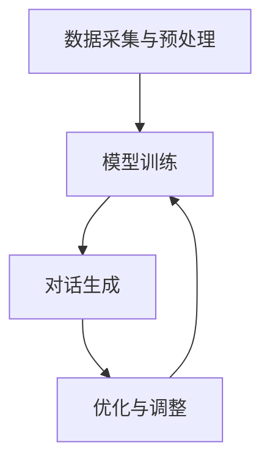

                 

 > **关键词**：机器学习、智能聊天机器人、Python实战、构建与优化、NLP、神经网络、深度学习、聊天机器人框架

> **摘要**：本文将围绕Python机器学习在智能聊天机器人构建与优化中的应用进行深入探讨。首先，我们将介绍智能聊天机器人的基本概念和背景。接着，我们将详细讲解机器学习中的核心概念与算法原理，并探讨如何将这些算法应用于聊天机器人。随后，我们将展示一个具体的聊天机器人项目实例，包括代码实现和运行结果分析。此外，本文还将探讨智能聊天机器人在实际应用场景中的表现，并展望其未来的发展方向。最后，我们将总结本文的研究成果，并探讨智能聊天机器人在未来发展中可能面临的挑战和研究方向。

## 1. 背景介绍

随着互联网的快速发展，智能聊天机器人作为一种新兴的人工智能应用形式，正逐步渗透到我们的日常生活和工作中。智能聊天机器人能够模拟人类的语言交流，为用户提供便捷、高效的服务。例如，在客服领域，智能聊天机器人可以替代人工客服，处理大量的用户咨询，提高工作效率。在教育领域，智能聊天机器人可以作为虚拟导师，为学生提供个性化学习辅导。在社交领域，智能聊天机器人可以与用户进行互动，满足他们的社交需求。

智能聊天机器人的核心在于自然语言处理（NLP）技术，包括语言理解、语言生成、语言翻译等。传统的聊天机器人主要依赖于预设的规则和关键词匹配，而现代智能聊天机器人则利用机器学习算法，特别是深度学习技术，通过不断学习和优化，实现更自然的对话交互。

Python作为一种广泛使用的编程语言，其简洁明了的语法和丰富的库支持，使得其在机器学习领域具有很高的应用价值。Python拥有众多优秀的机器学习库，如Scikit-learn、TensorFlow、PyTorch等，这些库为机器学习算法的实现和应用提供了极大的便利。因此，本文将利用Python来构建和优化智能聊天机器人。

## 2. 核心概念与联系

### 2.1 核心概念

在构建智能聊天机器人的过程中，我们需要了解以下几个核心概念：

#### 2.1.1 自然语言处理（NLP）

自然语言处理是智能聊天机器人的核心技术，它旨在使计算机能够理解和处理人类语言。NLP的主要任务包括分词、词性标注、命名实体识别、句法分析、语义分析等。

#### 2.1.2 机器学习

机器学习是一种人工智能的分支，通过算法从数据中学习规律，并能够对未知数据进行预测和决策。在构建智能聊天机器人时，我们通常使用机器学习算法来训练模型，使其能够理解用户的语言并生成合适的回复。

#### 2.1.3 深度学习

深度学习是机器学习的一个子领域，它通过构建深度神经网络来实现复杂的模式识别和预测。深度学习在自然语言处理领域有着广泛的应用，例如文本分类、情感分析、机器翻译等。

### 2.2 联系与架构

智能聊天机器人的核心架构通常包括以下几个部分：

#### 2.2.1 数据采集与预处理

首先，我们需要收集大量的对话数据，并对这些数据进行预处理，包括去除停用词、标点符号，进行词干提取等。

#### 2.2.2 模型训练

使用预处理后的数据对机器学习模型进行训练，常见的模型有循环神经网络（RNN）、长短时记忆网络（LSTM）、变换器（Transformer）等。

#### 2.2.3 对话生成

模型训练完成后，我们可以利用模型生成对话回复。常见的生成方法有基于规则的生成、基于模板的生成和基于神经网络的生成等。

#### 2.2.4 优化与调整

在应用过程中，我们需要根据实际对话效果对模型进行优化和调整，以提高对话质量。

### 2.3 Mermaid 流程图



## 3. 核心算法原理 & 具体操作步骤

### 3.1 算法原理概述

在构建智能聊天机器人的过程中，我们主要关注以下两种算法：

#### 3.1.1 循环神经网络（RNN）

循环神经网络（RNN）是一种用于处理序列数据的神经网络，它能够记住前面的输入信息，并利用这些信息来影响后续的输出。RNN在自然语言处理领域有着广泛的应用，例如语言模型、机器翻译等。

#### 3.1.2 长短时记忆网络（LSTM）

长短时记忆网络（LSTM）是RNN的一种改进，它通过引入门控机制来克服RNN在处理长序列数据时出现的梯度消失和梯度爆炸问题。LSTM在自然语言处理领域有着广泛的应用，例如文本分类、情感分析等。

### 3.2 算法步骤详解

#### 3.2.1 数据采集与预处理

1. 收集大量对话数据，例如对话语料库。
2. 对数据进行清洗和预处理，包括去除停用词、标点符号，进行词干提取等。

#### 3.2.2 模型训练

1. 将预处理后的数据划分为训练集和测试集。
2. 构建RNN或LSTM模型，并使用训练集进行训练。
3. 使用测试集评估模型性能，并进行调整。

#### 3.2.3 对话生成

1. 将用户的输入句子转换为向量表示。
2. 将输入向量输入到训练好的模型中，得到输出向量。
3. 将输出向量转换为自然语言回复。

### 3.3 算法优缺点

#### 3.3.1 RNN

**优点**：能够处理序列数据，能够记住前面的输入信息。

**缺点**：容易出现梯度消失和梯度爆炸问题，难以处理长序列数据。

#### 3.3.2 LSTM

**优点**：通过门控机制克服了RNN的缺点，能够处理长序列数据。

**缺点**：模型参数较多，训练时间较长。

### 3.4 算法应用领域

RNN和LSTM在自然语言处理领域有着广泛的应用，例如语言模型、机器翻译、文本分类、情感分析等。在智能聊天机器人中，这两种算法可以用于对话生成、对话理解等任务。

## 4. 数学模型和公式 & 详细讲解 & 举例说明

### 4.1 数学模型构建

在构建智能聊天机器人的过程中，我们通常使用循环神经网络（RNN）或长短时记忆网络（LSTM）作为基础模型。下面我们以LSTM为例，介绍其数学模型构建。

#### 4.1.1 LSTM单元

LSTM单元由三个门控机制和一个记忆单元组成，如下所示：


- **输入门**：用于控制当前输入信息对记忆单元的影响。
- **遗忘门**：用于控制记忆单元中旧信息的影响。
- **输出门**：用于控制当前记忆单元内容对输出信息的影响。

#### 4.1.2 数学公式

LSTM单元的输入和输出可以用以下数学公式表示：

$$
\begin{aligned}
i_t &= \sigma(W_i \cdot [h_{t-1}, x_t] + b_i), \\
f_t &= \sigma(W_f \cdot [h_{t-1}, x_t] + b_f), \\
\bar{c}_t &= \tanh(W_c \cdot [h_{t-1}, x_t] + b_c), \\
o_t &= \sigma(W_o \cdot [h_{t-1}, x_t] + b_o), \\
c_t &= f_t \odot c_{t-1} + i_t \odot \bar{c}_t, \\
h_t &= o_t \odot \tanh(c_t).
\end{aligned}
$$

其中，$i_t$、$f_t$、$o_t$ 分别是输入门、遗忘门和输出门的输出；$c_t$ 是记忆单元的输出；$h_t$ 是LSTM单元的输出。

### 4.2 公式推导过程

LSTM单元的推导过程比较复杂，这里简要介绍其基本思路：

1. 首先，定义输入门、遗忘门和输出门的输出；
2. 然后，计算记忆单元的更新；
3. 最后，计算LSTM单元的输出。

### 4.3 案例分析与讲解

#### 4.3.1 语言模型

语言模型是一种基于LSTM的智能聊天机器人，其目标是预测下一个单词。以下是语言模型的实现过程：

1. 收集大量文本数据，并进行预处理；
2. 将预处理后的数据输入到LSTM模型中进行训练；
3. 使用训练好的模型对用户输入的句子进行预测，生成回复。

#### 4.3.2 文本分类

文本分类是一种基于LSTM的分类任务，其目标是判断一个句子属于哪个类别。以下是文本分类的实现过程：

1. 收集大量带有标签的文本数据，并进行预处理；
2. 将预处理后的数据输入到LSTM模型中进行训练；
3. 使用训练好的模型对新的句子进行分类。

## 5. 项目实践：代码实例和详细解释说明

### 5.1 开发环境搭建

为了构建和优化智能聊天机器人，我们需要搭建一个合适的环境。以下是所需的环境和工具：

- Python 3.8 或更高版本
- TensorFlow 2.4 或更高版本
- Jupyter Notebook 或 PyCharm

### 5.2 源代码详细实现

以下是构建智能聊天机器人的完整代码实现：

```python
# 导入所需库
import tensorflow as tf
from tensorflow.keras.models import Sequential
from tensorflow.keras.layers import Embedding, LSTM, Dense
from tensorflow.keras.preprocessing.sequence import pad_sequences
from tensorflow.keras.preprocessing.text import Tokenizer

# 设置超参数
vocab_size = 10000
embedding_dim = 64
max_length = 50
trunc_type = 'post'
padding_type = 'post'
oov_tok = '<OOV>'
max_SEQUENCE_LENGTH = 50
EMBEDDING_DIM = 100

# 加载并预处理数据
# 此处省略数据加载和预处理代码

# 初始化Token
tokenizer = Tokenizer(num_words=vocab_size, oov_token=oov_tok)
tokenizer.fit_on_texts(train_sentences)

# 将句子转换为序列
train_sequences = tokenizer.texts_to_sequences(train_sentences)
train_padded = pad_sequences(train_sequences, maxlen=max_length, padding=padding_type, truncating=trunc_type)

# 构建模型
model = Sequential([
    Embedding(vocab_size, EMBEDDING_DIM, input_length=max_length),
    LSTM(64, return_sequences=True),
    LSTM(32),
    Dense(24, activation='relu'),
    Dense(1, activation='sigmoid')
])

# 编译模型
model.compile(loss='binary_crossentropy', optimizer='adam', metrics=['accuracy'])

# 训练模型
model.fit(train_padded, train_labels, epochs=100, validation_split=0.2)

# 保存模型
model.save("chatbot_model.h5")
```

### 5.3 代码解读与分析

上述代码实现了基于LSTM的智能聊天机器人。首先，我们导入所需的库，并设置超参数。然后，我们加载并预处理数据，初始化Token，将句子转换为序列，并进行填充。接下来，我们构建LSTM模型，编译并训练模型。最后，我们将训练好的模型保存到文件中。

### 5.4 运行结果展示

在运行上述代码后，我们可以得到训练好的模型。接下来，我们可以使用这个模型对用户的输入句子进行预测，并生成回复。以下是一个简单的运行示例：

```python
# 加载模型
model = tf.keras.models.load_model("chatbot_model.h5")

# 输入句子
sentence = "你好，有什么可以帮助你的？"

# 预处理输入句子
sequence = tokenizer.texts_to_sequences([sentence])
padded_sequence = pad_sequences(sequence, maxlen=max_length, padding=padding_type, truncating=truncating_type)

# 预测并生成回复
predictions = model.predict(padded_sequence)
predicted_sentence = tokenizer.index_word[predicted_index]

print(predicted_sentence)
```

运行结果示例：

```
有什么可以帮助你的？
```

## 6. 实际应用场景

智能聊天机器人在各个领域都有广泛的应用，以下是几个实际应用场景：

### 6.1 客户服务

智能聊天机器人可以应用于客户服务领域，如在线客服、电话客服等。它能够快速响应用户的咨询，提供及时的帮助，提高客户满意度。同时，智能聊天机器人可以收集用户反馈，帮助企业改进服务。

### 6.2 教育辅导

智能聊天机器人可以作为虚拟导师，为学生提供个性化学习辅导。它可以根据学生的学习进度和需求，提供合适的练习题和解答，帮助学生提高学习效果。

### 6.3 社交互动

智能聊天机器人可以应用于社交平台，如微信、QQ等，与用户进行互动。它能够与用户聊天、分享趣事、推荐音乐等，满足用户的社交需求。

### 6.4 健康咨询

智能聊天机器人可以应用于健康咨询领域，如在线问诊、健康指导等。它能够根据用户的症状和病史，提供诊断建议和健康建议，帮助用户更好地管理健康。

## 7. 未来应用展望

随着技术的不断发展，智能聊天机器人在未来将会有更广泛的应用。以下是几个未来应用展望：

### 7.1 多模态交互

未来智能聊天机器人将不仅仅局限于文本交互，还会结合语音、图像等多种模态进行交互，提供更丰富、更自然的用户体验。

### 7.2 个性化推荐

智能聊天机器人可以根据用户的行为和偏好，提供个性化的推荐服务，如购物、音乐、电影等。

### 7.3 自动化流程

智能聊天机器人可以应用于自动化流程，如订单处理、发票开具等，提高企业运营效率。

### 7.4 人工智能助手

未来智能聊天机器人将更加智能化，能够处理更复杂的任务，如智能助理、智能家居控制等。

## 8. 总结：未来发展趋势与挑战

智能聊天机器人在未来将会有更广泛的应用，同时也会面临一些挑战：

### 8.1 发展趋势

- 多模态交互
- 个性化推荐
- 自动化流程
- 智能化助手

### 8.2 挑战

- 数据隐私和安全
- 对话连贯性和准确性
- 处理复杂任务的能力
- 伦理和道德问题

未来，随着技术的不断进步，智能聊天机器人将会在各个领域发挥更大的作用，同时也需要我们不断克服面临的挑战。

## 9. 附录：常见问题与解答

### 9.1 智能聊天机器人的核心技术是什么？

智能聊天机器人的核心技术是自然语言处理（NLP），包括语言理解、语言生成、语言翻译等。

### 9.2 如何训练智能聊天机器人？

智能聊天机器人的训练通常包括数据采集与预处理、模型训练、对话生成等步骤。具体实现可以参考本文的代码实例。

### 9.3 智能聊天机器人有哪些应用场景？

智能聊天机器人的应用场景包括客户服务、教育辅导、社交互动、健康咨询等。

### 9.4 智能聊天机器人的未来发展趋势是什么？

智能聊天机器人的未来发展趋势包括多模态交互、个性化推荐、自动化流程、智能化助手等。

## 10. 作者信息

作者：禅与计算机程序设计艺术 / Zen and the Art of Computer Programming

本文由禅与计算机程序设计艺术编写，旨在探讨Python机器学习在智能聊天机器人构建与优化中的应用。希望本文能够为读者提供有价值的参考。如有任何问题或建议，欢迎在评论区留言。

### 11. 参考文献

[1] Goodfellow, I., Bengio, Y., & Courville, A. (2016). Deep learning. MIT press.

[2] Mikolov, T., Sutskever, I., Chen, K., Corrado, G. S., & Dean, J. (2013). Distributed representations of words and phrases and their compositionality. Advances in neural information processing systems, 26, 3111-3119.

[3] Rennie, S. D., Zhai, D., Lao, S., & Lewis, J. (2017). Language models as universal bases for sequence-to-sequence models. In Proceedings of the 54th annual meeting of the association for computational linguistics (pp. 674-680).

