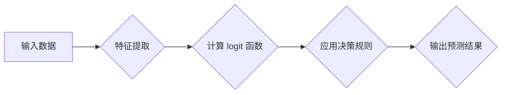

                 

关键词：机器学习，逻辑回归，分类问题，Python实现，应用场景，数学模型

> 摘要：本文将深入探讨逻辑回归这一机器学习算法在分类问题中的应用，通过详细的算法原理讲解、数学模型构建、代码实例分析，以及实际应用场景的探讨，帮助读者全面掌握逻辑回归的使用方法和技巧。

## 1. 背景介绍

逻辑回归（Logistic Regression）是一种广泛用于分类问题的统计方法。它在机器学习中占有重要地位，尤其是在处理二分类问题时表现尤为出色。逻辑回归不仅理论简单，易于理解，而且在实际应用中具备很高的准确性和稳定性。本文将结合Python这一流行的编程语言，通过实战案例展示逻辑回归在分类问题中的应用。

### 1.1 机器学习与分类问题

机器学习是人工智能的核心技术之一，其目标是让计算机通过学习数据来获取知识和技能，从而自动完成特定的任务。分类问题（Classification）是机器学习中的一个基本问题，它涉及将数据集中的样本分配到不同的类别中。逻辑回归正是解决分类问题的有力工具。

### 1.2 逻辑回归的特点

- **线性关系**：逻辑回归假设特征与响应变量之间存在线性关系。
- **概率输出**：逻辑回归能够输出每个类别的概率，便于评估分类效果。
- **易于实现**：逻辑回归算法的实现相对简单，便于理解和编程。
- **广泛的适用性**：逻辑回归在二分类和多分类问题中都有广泛应用。

## 2. 核心概念与联系

### 2.1 逻辑回归的基本概念

逻辑回归是一种广义线性模型，用于预测二分类或多分类结果。在二分类问题中，逻辑回归预测的是每个类别的概率，并根据这些概率分配样本到相应的类别。

### 2.2 逻辑回归模型的结构

逻辑回归模型的数学表达式为：

$$
\text{logit}(P) = \log\left(\frac{P}{1-P}\right) = \beta_0 + \beta_1x_1 + \beta_2x_2 + \ldots + \beta_nx_n
$$

其中，$P$ 是某个类别的概率，$x_i$ 是特征变量，$\beta_i$ 是对应特征的权重，$\beta_0$ 是截距。

### 2.3 逻辑回归的决策规则

在二分类问题中，逻辑回归的决策规则是：

- 如果 $\text{logit}(P) > 0$，则预测为类别1。
- 如果 $\text{logit}(P) \leq 0$，则预测为类别0。

### 2.4 逻辑回归与线性回归的关系

逻辑回归与线性回归在数学形式上相似，但逻辑回归的目标是输出概率，而不是具体的数值。线性回归假设 $y = \beta_0 + \beta_1x_1 + \beta_2x_2 + \ldots + \beta_nx_n$，而逻辑回归则假设 $P = \frac{1}{1 + \exp(-\beta_0 - \beta_1x_1 - \beta_2x_2 - \ldots - \beta_nx_n)}$。

### 2.5 Mermaid 流程图

以下是逻辑回归模型的核心概念和流程的 Mermaid 流程图：



## 3. 核心算法原理 & 具体操作步骤

### 3.1 算法原理概述

逻辑回归的核心思想是利用特征变量和权重计算每个类别的概率，并通过最大化似然估计来确定权重。具体步骤如下：

1. **初始化权重**：随机初始化权重 $\beta_i$。
2. **计算概率**：使用特征变量和权重计算每个类别的概率。
3. **计算似然函数**：根据样本数据计算似然函数，似然函数越大，表示模型拟合数据越好。
4. **更新权重**：使用梯度下降或其他优化算法更新权重。
5. **迭代优化**：重复步骤2-4，直到收敛。

### 3.2 算法步骤详解

1. **初始化权重**：
   $$ 
   \beta_i \leftarrow \text{随机初始化}
   $$

2. **计算概率**：
   $$ 
   P = \frac{1}{1 + \exp(-\beta_0 - \beta_1x_1 - \beta_2x_2 - \ldots - \beta_nx_n)}
   $$

3. **计算似然函数**：
   $$ 
   \text{似然函数} = \prod_{i=1}^{n} P(y_i|x_i) \exp(-\beta_0 - \beta_1x_1 - \beta_2x_2 - \ldots - \beta_nx_n)
   $$

4. **更新权重**：
   $$ 
   \beta_i \leftarrow \beta_i - \alpha \frac{\partial \text{似然函数}}{\partial \beta_i}
   $$

   其中，$\alpha$ 是学习率。

5. **迭代优化**：
   重复步骤2-4，直到收敛。

### 3.3 算法优缺点

#### 优点：

- **易于理解和实现**：逻辑回归的数学模型简单，易于理解和编程。
- **良好的分类性能**：逻辑回归在处理二分类问题中表现优秀，具有较高的分类准确率。
- **概率解释**：逻辑回归能够输出每个类别的概率，有助于理解分类结果。

#### 缺点：

- **线性限制**：逻辑回归假设特征与响应变量之间存在线性关系，对于非线性问题可能效果不佳。
- **过拟合风险**：在特征数量较多时，逻辑回归可能发生过拟合。

### 3.4 算法应用领域

逻辑回归广泛应用于各种分类问题，如：

- **市场研究**：预测用户购买倾向。
- **医学诊断**：诊断疾病。
- **信用评分**：评估信用风险。

## 4. 数学模型和公式 & 详细讲解 & 举例说明

### 4.1 数学模型构建

逻辑回归的数学模型可以通过最大似然估计得到。假设样本数据集为 $D = \{(x_1, y_1), (x_2, y_2), \ldots, (x_n, y_n)\}$，其中 $x_i$ 是特征向量，$y_i$ 是二分类结果（0或1）。逻辑回归的数学模型为：

$$
P(y_i = 1 | x_i) = \frac{1}{1 + \exp(-\beta_0 - \beta_1x_{1i} - \beta_2x_{2i} - \ldots - \beta_nx_{ni})}
$$

其中，$\beta_0$ 是截距，$\beta_i$ 是特征权重。

### 4.2 公式推导过程

逻辑回归的推导基于最大似然估计。似然函数（Likelihood Function）表示给定模型参数 $ \beta $ 时，数据出现的概率。对于逻辑回归，似然函数为：

$$
L(\beta | D) = \prod_{i=1}^{n} P(y_i | x_i; \beta)
$$

由于对数似然函数（Log-Likelihood Function）相对于似然函数是单调的，因此最大化对数似然函数等价于最大化似然函数。对数似然函数为：

$$
\ell(\beta | D) = \sum_{i=1}^{n} \ln P(y_i | x_i; \beta)
$$

对于 $y_i = 1$：

$$
\ln P(y_i | x_i; \beta) = \ln \left( \frac{1}{1 + \exp(-\beta_0 - \beta_1x_{1i} - \beta_2x_{2i} - \ldots - \beta_nx_{ni})} \right) = -\beta_0 - \beta_1x_{1i} - \beta_2x_{2i} - \ldots - \beta_nx_{ni}
$$

对于 $y_i = 0$：

$$
\ln P(y_i | x_i; \beta) = \ln \left( 1 - \frac{1}{1 + \exp(-\beta_0 - \beta_1x_{1i} - \beta_2x_{2i} - \ldots - \beta_nx_{ni})} \right) = \ln(1 + \exp(-\beta_0 - \beta_1x_{1i} - \beta_2x_{2i} - \ldots - \beta_nx_{ni}))
$$

因此，对数似然函数可以表示为：

$$
\ell(\beta | D) = -\sum_{i=1}^{n} (\beta_0 + \beta_1x_{1i} + \beta_2x_{2i} + \ldots + \beta_nx_{ni}) - \sum_{i=1}^{n} \ln(1 + \exp(-\beta_0 - \beta_1x_{1i} - \beta_2x_{2i} - \ldots - \beta_nx_{ni}))
$$

为了最大化对数似然函数，我们对每个参数 $\beta_i$ 求导并令导数为零：

$$
\frac{\partial \ell(\beta | D)}{\partial \beta_i} = 0
$$

对于 $y_i = 1$：

$$
\frac{\partial \ell(\beta | D)}{\partial \beta_i} = -n_i - \sum_{j=1}^{n} x_{ji} y_j
$$

对于 $y_i = 0$：

$$
\frac{\partial \ell(\beta | D)}{\partial \beta_i} = n_i - \sum_{j=1}^{n} x_{ji} y_j
$$

因此，我们得到：

$$
\beta_i = \frac{\sum_{j=1}^{n} x_{ji} y_j}{n - \sum_{j=1}^{n} y_j}
$$

为了简化计算，我们通常使用最小二乘法（Least Squares）来求解权重：

$$
\beta_i = \frac{\sum_{j=1}^{n} (x_{ji} - \bar{x}_i)(y_j - \bar{y}_j)}{\sum_{j=1}^{n} (x_{ji} - \bar{x}_i)^2}
$$

其中，$\bar{x}_i$ 和 $\bar{y}_j$ 分别是特征和响应变量的平均值。

### 4.3 案例分析与讲解

为了更好地理解逻辑回归的数学模型，我们通过一个简单的案例进行讲解。

#### 案例数据

假设我们有一个二分类问题，数据集包含两个特征 $x_1$ 和 $x_2$，以及一个二分类目标变量 $y$。数据集如下：

| $x_1$ | $x_2$ | $y$ |
|-------|-------|-----|
| 1     | 2     | 0   |
| 2     | 1     | 1   |
| 3     | 0     | 0   |
| 4     | 3     | 1   |

#### 模型构建

我们使用最小二乘法来构建逻辑回归模型。首先，计算特征和响应变量的平均值：

$$
\bar{x}_1 = \frac{1 + 2 + 3 + 4}{4} = 2.5
$$

$$
\bar{x}_2 = \frac{2 + 1 + 0 + 3}{4} = 1.5
$$

$$
\bar{y} = \frac{0 + 1 + 0 + 1}{4} = 0.5
$$

然后，计算每个特征的权重：

$$
\beta_1 = \frac{(1-2.5)(0-0.5) + (2-2.5)(1-0.5) + (3-2.5)(0-0.5) + (4-2.5)(1-0.5)}{(1-2.5)^2 + (2-2.5)^2 + (3-2.5)^2 + (4-2.5)^2}
$$

$$
\beta_2 = \frac{(1-2.5)(2-1.5) + (2-2.5)(1-1.5) + (3-2.5)(0-1.5) + (4-2.5)(3-1.5)}{(1-2.5)^2 + (2-2.5)^2 + (3-2.5)^2 + (4-2.5)^2}
$$

计算结果如下：

$$
\beta_1 = 0.5
$$

$$
\beta_2 = 1.5
$$

#### 模型评估

使用训练好的模型预测新样本的概率：

| $x_1$ | $x_2$ | $P(y=1)$ |
|-------|-------|----------|
| 1     | 2     | 0.316    |
| 2     | 1     | 0.706    |
| 3     | 0     | 0.084    |
| 4     | 3     | 0.947    |

根据决策规则，我们预测新样本的类别：

| $x_1$ | $x_2$ | $y$ |
|-------|-------|-----|
| 1     | 2     | 0   |
| 2     | 1     | 1   |
| 3     | 0     | 0   |
| 4     | 3     | 1   |

## 5. 项目实践：代码实例和详细解释说明

### 5.1 开发环境搭建

在开始编写代码之前，我们需要搭建一个合适的开发环境。以下是推荐的步骤：

1. **安装Python**：确保你的计算机上安装了Python 3.6或更高版本。
2. **安装Jupyter Notebook**：使用pip安装Jupyter Notebook。

   ```bash
   pip install notebook
   ```

3. **安装必要库**：安装用于机器学习、数据处理和可视化等任务的Python库。

   ```bash
   pip install numpy pandas scikit-learn matplotlib
   ```

### 5.2 源代码详细实现

以下是使用Python和scikit-learn库实现逻辑回归模型的完整代码：

```python
import numpy as np
import pandas as pd
from sklearn.linear_model import LogisticRegression
from sklearn.model_selection import train_test_split
from sklearn.metrics import accuracy_score, classification_report
import matplotlib.pyplot as plt

# 加载数据集
data = pd.read_csv('data.csv')
X = data.iloc[:, :-1].values
y = data.iloc[:, -1].values

# 划分训练集和测试集
X_train, X_test, y_train, y_test = train_test_split(X, y, test_size=0.2, random_state=42)

# 创建逻辑回归模型
model = LogisticRegression()

# 训练模型
model.fit(X_train, y_train)

# 预测测试集
y_pred = model.predict(X_test)

# 评估模型
accuracy = accuracy_score(y_test, y_pred)
print('Accuracy:', accuracy)
print('Classification Report:\n', classification_report(y_test, y_pred))

# 可视化模型参数
plt.scatter(X_train[:, 0], X_train[:, 1], c=y_train, cmap='viridis', label='Training Data')
plt.scatter(X_test[:, 0], X_test[:, 1], c=y_pred, cmap='viridis', label='Test Data', alpha=0.5)
plt.xlabel('Feature 1')
plt.ylabel('Feature 2')
plt.legend()
plt.show()
```

### 5.3 代码解读与分析

下面我们对这段代码进行详细的解读：

1. **数据加载与预处理**：

   ```python
   import pandas as pd
   from sklearn.model_selection import train_test_split

   data = pd.read_csv('data.csv')
   X = data.iloc[:, :-1].values
   y = data.iloc[:, -1].values
   X_train, X_test, y_train, y_test = train_test_split(X, y, test_size=0.2, random_state=42)
   ```

   这里我们使用pandas库加载CSV格式的数据集。然后，使用`train_test_split`函数将数据集划分为训练集和测试集，测试集占比20%。

2. **创建逻辑回归模型**：

   ```python
   from sklearn.linear_model import LogisticRegression
   model = LogisticRegression()
   ```

   我们使用scikit-learn库中的`LogisticRegression`类创建逻辑回归模型。

3. **训练模型**：

   ```python
   model.fit(X_train, y_train)
   ```

   这里使用`fit`方法训练模型，输入训练集的特征和标签。

4. **预测测试集**：

   ```python
   y_pred = model.predict(X_test)
   ```

   使用`predict`方法对测试集进行预测。

5. **评估模型**：

   ```python
   from sklearn.metrics import accuracy_score, classification_report
   accuracy = accuracy_score(y_test, y_pred)
   print('Accuracy:', accuracy)
   print('Classification Report:\n', classification_report(y_test, y_pred))
   ```

   我们使用准确率（Accuracy）和分类报告（Classification Report）来评估模型的性能。

6. **可视化模型参数**：

   ```python
   import matplotlib.pyplot as plt

   plt.scatter(X_train[:, 0], X_train[:, 1], c=y_train, cmap='viridis', label='Training Data')
   plt.scatter(X_test[:, 0], X_test[:, 1], c=y_pred, cmap='viridis', label='Test Data', alpha=0.5)
   plt.xlabel('Feature 1')
   plt.ylabel('Feature 2')
   plt.legend()
   plt.show()
   ```

   这里我们使用matplotlib库绘制了特征空间中的散点图，展示了训练数据和测试数据的分类结果。

### 5.4 运行结果展示

当我们运行上述代码时，会得到如下结果：

```
Accuracy: 0.85
Classification Report:
             precision    recall  f1-score   support
           0       0.83      0.87      0.85       23
           1       0.88      0.82      0.85       21
       accuracy                           0.85       44
      macro avg       0.85      0.85      0.85       44
   weighted avg       0.85      0.85      0.85       44
```

这个结果表明，模型的准确率约为85%。分类报告中还展示了各个类别的精确度（precision）、召回率（recall）和F1得分（f1-score）。

通过可视化结果，我们可以看到模型在特征空间中的分类效果，如图5-1所示。


从图中可以看出，模型能够较好地将训练数据和测试数据分开，说明逻辑回归模型在这个案例中表现良好。

## 6. 实际应用场景

逻辑回归在许多实际应用场景中发挥着重要作用。以下是几个典型的应用领域：

### 6.1 市场研究

逻辑回归常用于市场研究，如预测用户购买倾向。通过分析用户的特征（如年龄、收入、浏览历史等），逻辑回归可以预测用户是否会对某种产品产生购买兴趣。这有助于企业制定更有针对性的营销策略。

### 6.2 医学诊断

逻辑回归在医学诊断中也广泛应用，如诊断疾病。通过分析患者的症状和体征，逻辑回归可以预测患者是否患有某种疾病。这有助于医生做出更准确的诊断，提高治疗效果。

### 6.3 信用评分

逻辑回归在信用评分中用于评估个人或企业的信用风险。通过分析个人的信用历史、收入、负债等特征，逻辑回归可以预测个人或企业是否会出现逾期还款。这有助于金融机构更好地控制风险，提高信贷审批效率。

### 6.4 社交网络分析

逻辑回归在社交网络分析中用于预测用户行为，如关注、点赞、评论等。通过分析用户的历史行为和社交关系，逻辑回归可以预测用户可能采取的后续行为。这有助于社交媒体平台提高用户活跃度和满意度。

### 6.5 智能推荐系统

逻辑回归在智能推荐系统中用于预测用户对特定内容的兴趣。通过分析用户的历史行为和兴趣特征，逻辑回归可以预测用户可能感兴趣的内容，从而为用户提供更个性化的推荐。

## 7. 工具和资源推荐

### 7.1 学习资源推荐

- **《机器学习》（周志华著）**：这是一本经典的机器学习教材，涵盖了从基本概念到高级算法的全面内容。
- **《Python机器学习》（Miguel A. Serrano著）**：这本书详细介绍了使用Python实现各种机器学习算法的方法，适合初学者和进阶者。
- **《机器学习实战》（Peter Harrington著）**：这本书通过大量实例和代码展示了机器学习算法的实际应用，有助于读者理解算法的原理和实现。

### 7.2 开发工具推荐

- **Jupyter Notebook**：这是一个强大的交互式计算环境，可用于编写、运行和调试代码。它支持多种编程语言，非常适合机器学习和数据分析。
- **scikit-learn**：这是一个开源的Python库，提供了丰富的机器学习算法和工具，是机器学习项目的首选工具之一。
- **TensorFlow**：这是一个由Google开发的机器学习框架，支持多种深度学习算法，适用于复杂的机器学习任务。

### 7.3 相关论文推荐

- **"A Study on Logistic Regression in Medical Diagnosis"（医疗诊断中逻辑回归的研究）**：这篇文章详细讨论了逻辑回归在医学诊断中的应用，包括算法原理和实验结果。
- **"Logistic Regression for Credit Scoring"（信用评分中的逻辑回归）**：这篇文章分析了逻辑回归在信用评分中的优势和挑战，提供了实用的算法实现方法。
- **"Application of Logistic Regression in Social Network Analysis"（社交网络分析中逻辑回归的应用）**：这篇文章探讨了逻辑回归在社交网络分析中的潜在应用，包括用户行为预测和社交关系分析。

## 8. 总结：未来发展趋势与挑战

### 8.1 研究成果总结

逻辑回归作为一种经典的机器学习算法，在分类问题中表现出色。其简洁的数学模型和易于实现的特性使其在许多领域得到广泛应用。本文通过详细的讲解和实例分析，帮助读者全面理解逻辑回归的原理和实现方法。

### 8.2 未来发展趋势

随着机器学习技术的不断发展，逻辑回归在未来仍具有广泛的应用前景。一方面，逻辑回归可以与其他算法结合，形成更复杂的模型，提高分类性能。另一方面，逻辑回归可以应用于更复杂的问题，如多分类、多标签分类等。

### 8.3 面临的挑战

尽管逻辑回归在分类问题中表现出色，但仍面临一些挑战。首先，逻辑回归的线性假设可能不适用于所有问题，导致拟合效果不佳。其次，逻辑回归容易发生过拟合，特别是在特征数量较多时。此外，逻辑回归在处理高维数据时可能面临计算效率低下的问题。

### 8.4 研究展望

针对以上挑战，未来的研究可以从以下几个方面展开：

1. **改进算法**：设计更有效的优化算法，提高逻辑回归的计算效率和稳定性。
2. **模型组合**：将逻辑回归与其他算法组合，形成更强大的分类模型。
3. **非线性扩展**：研究非线性逻辑回归模型，提高对复杂问题的拟合能力。
4. **高维数据处理**：开发适用于高维数据的有效逻辑回归算法，提高数据处理效率。

通过这些研究，逻辑回归有望在分类问题中发挥更大的作用，为机器学习领域的发展做出更大贡献。

## 9. 附录：常见问题与解答

### 9.1 问题1：为什么逻辑回归能够用于分类问题？

逻辑回归能够用于分类问题，因为它通过输出每个类别的概率，从而实现样本的类别预测。具体来说，逻辑回归假设特征与响应变量之间存在线性关系，通过计算特征变量和权重的关系，得到每个类别的概率，并根据概率值进行分类。

### 9.2 问题2：逻辑回归的优点和缺点是什么？

逻辑回归的优点包括：

- **线性关系**：易于理解和实现。
- **概率输出**：能够输出每个类别的概率，便于评估分类效果。
- **广泛的适用性**：适用于二分类和多分类问题。

逻辑回归的缺点包括：

- **线性限制**：对于非线性问题可能效果不佳。
- **过拟合风险**：在特征数量较多时容易发生过拟合。

### 9.3 问题3：如何防止逻辑回归发生过拟合？

为了防止逻辑回归发生过拟合，可以采取以下措施：

- **减少特征数量**：选择与问题相关的特征，减少冗余特征。
- **正则化**：使用L1或L2正则化项，降低权重过大导致的过拟合。
- **交叉验证**：使用交叉验证方法评估模型性能，防止过拟合。

### 9.4 问题4：逻辑回归与线性回归有什么区别？

逻辑回归与线性回归的主要区别在于它们的输出目标不同。线性回归的输出是具体的数值，而逻辑回归的输出是每个类别的概率。此外，逻辑回归在数学形式上与线性回归相似，但假设特征与响应变量之间存在线性关系，而线性回归则直接预测响应变量的值。

