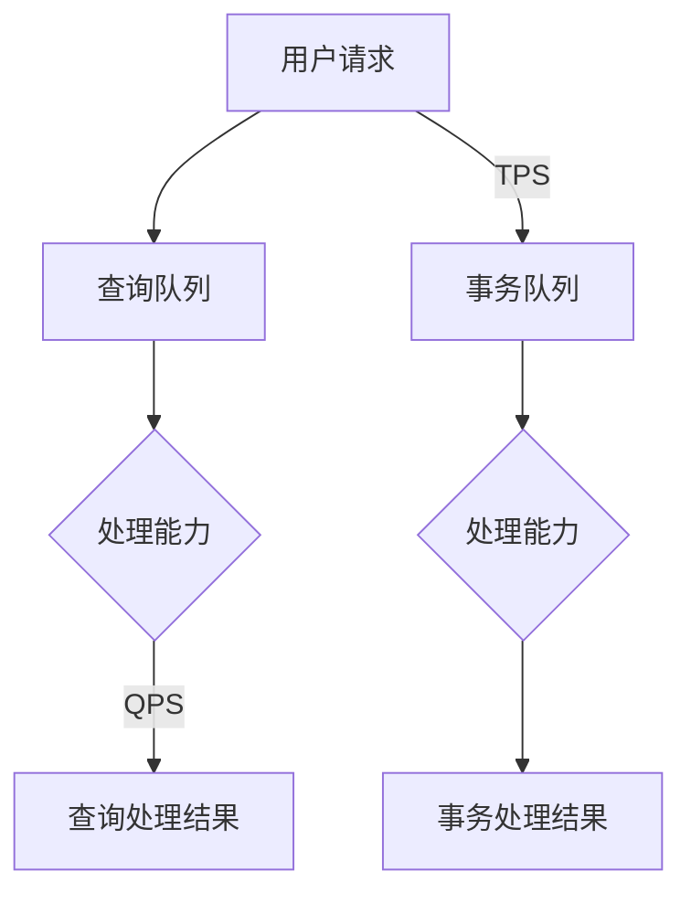

                 

## 1. 背景介绍

在当今的互联网时代，高并发的应用需求日益增长，如何保证系统在高并发场景下依然能够高效、稳定地运行，成为了许多企业面临的重大挑战。QPS（每秒查询率）和TPS（每秒事务数）是衡量系统性能的两个重要指标。QPS主要衡量系统在处理查询请求方面的性能，而TPS则关注系统在处理事务操作（如增删改查）方面的能力。本文将深入探讨QPS与TPS的最佳实践，帮助读者理解这两个指标的重要性，并掌握提升它们的方法和技巧。

本文将分为以下几个部分进行探讨：

1. **核心概念与联系**：介绍QPS和TPS的核心概念及其相互关系，并通过Mermaid流程图展示相关架构。
2. **核心算法原理与操作步骤**：详细解释QPS和TPS的算法原理，以及具体的操作步骤。
3. **数学模型和公式**：阐述数学模型和公式的构建、推导过程，并举例说明。
4. **项目实践：代码实例与详细解释**：通过实际项目案例，展示代码实现细节，并进行解读和分析。
5. **实际应用场景**：讨论QPS和TPS在不同场景下的应用，包括未来应用展望。
6. **工具和资源推荐**：推荐学习资源和开发工具，以及相关论文推荐。
7. **总结与展望**：总结研究成果，探讨未来发展趋势与面临的挑战。

通过本文的阅读，读者将能够全面了解QPS与TPS的最佳实践，为在实际项目中提升系统性能提供有力支持。

<|assistant|>## 2. 核心概念与联系

在深入探讨QPS（每秒查询率）与TPS（每秒事务数）之前，我们首先需要明确它们的核心概念以及二者之间的关系。

### QPS（每秒查询率）

QPS是衡量系统每秒可以处理的查询请求次数的指标。在互联网应用中，查询请求可以是用户发起的检索、信息查询、数据查询等各种类型。QPS越高，表明系统的查询处理能力越强。QPS的计算公式如下：

\[ QPS = \frac{总查询次数}{总时间（秒）} \]

例如，如果一个系统在1分钟内处理了6000次查询请求，那么其QPS为：

\[ QPS = \frac{6000}{60} = 100 \]

### TPS（每秒事务数）

TPS是衡量系统每秒可以完成的事务操作次数的指标。事务操作通常包括数据库中的增删改查等操作。TPS反映了系统在处理事务方面的能力。TPS的计算公式如下：

\[ TPS = \frac{总事务次数}{总时间（秒）} \]

例如，如果一个数据库在1分钟内完成了3000次事务操作，那么其TPS为：

\[ TPS = \frac{3000}{60} = 50 \]

### QPS与TPS之间的关系

QPS和TPS虽然各自衡量的是不同的性能指标，但它们之间存在着紧密的联系。在大多数情况下，QPS和TPS并不是独立的，而是相互影响的。具体来说，QPS往往决定了TPS的上限，因为查询请求可能会影响到事务操作的处理。例如，当一个系统在高QPS下处理大量查询请求时，可能会导致数据库的负载增加，从而影响TPS。

### Mermaid流程图

为了更直观地展示QPS和TPS之间的关系，我们使用Mermaid流程图来描述相关架构。以下是一个简单的Mermaid流程图：



在这个流程图中，用户请求分别进入查询队列和事务队列，然后根据系统的处理能力，QPS和TPS分别处理查询请求和事务请求，最终输出查询处理结果和事务处理结果。

### 总结

通过以上介绍，我们可以看到QPS和TPS在衡量系统性能方面的重要性。QPS主要关注系统的查询处理能力，而TPS则关注系统的事务处理能力。二者之间的关系决定了系统在高并发场景下的整体性能。理解QPS和TPS的核心概念及其相互关系，有助于我们在设计和优化系统时，有针对性地提升系统性能。

<|assistant|>## 3. 核心算法原理 & 具体操作步骤

在了解了QPS和TPS的核心概念及其相互关系之后，接下来我们将深入探讨提升这两个指标的核心算法原理，并详细解释具体的操作步骤。

### 3.1 算法原理概述

提升QPS和TPS的核心在于优化系统的处理能力和资源利用效率。具体来说，可以从以下几个方面入手：

1. **负载均衡**：通过合理分配请求，使得系统资源得到最大化利用。
2. **缓存策略**：利用缓存技术减少对后端系统的访问压力。
3. **数据库优化**：优化数据库结构、索引和查询语句，提高数据库查询和事务处理效率。
4. **并发控制**：合理控制并发访问，避免资源争用和死锁。
5. **分布式架构**：通过分布式部署，提升系统的扩展性和处理能力。

### 3.2 算法步骤详解

下面我们详细解释提升QPS和TPS的具体操作步骤：

#### 3.2.1 负载均衡

1. **选择合适的负载均衡策略**：常见的负载均衡策略包括轮询、最小连接数、源IP哈希等。
2. **部署负载均衡设备**：如Nginx、HAProxy等。
3. **配置负载均衡规则**：根据业务需求和系统性能，设定合适的负载均衡规则。
4. **监控负载均衡性能**：实时监控负载均衡设备的运行状态，及时调整负载均衡策略。

#### 3.2.2 缓存策略

1. **选择合适的缓存技术**：如Redis、Memcached等。
2. **确定缓存数据策略**：根据业务需求，设置缓存数据的失效时间和更新策略。
3. **优化缓存访问**：通过缓存预热、缓存穿透、缓存雪崩等策略，优化缓存访问效率。
4. **监控缓存性能**：实时监控缓存系统的运行状态，确保缓存策略的有效性。

#### 3.2.3 数据库优化

1. **数据库结构优化**：合理设计数据库表结构，避免数据冗余和查询复杂度。
2. **索引优化**：根据查询需求，创建合适的索引，提高查询效率。
3. **查询语句优化**：使用高效的SQL查询语句，减少查询时间。
4. **数据库分库分表**：在数据规模较大时，采用分库分表策略，降低单表压力。

#### 3.2.4 并发控制

1. **选择合适的并发控制方法**：如乐观锁、悲观锁、读写锁等。
2. **分布式锁**：在高并发场景下，使用分布式锁保证数据的一致性和完整性。
3. **事务管理**：合理控制事务大小，避免长时间占用资源。
4. **监控并发性能**：实时监控系统的并发访问情况，及时发现和解决性能瓶颈。

#### 3.2.5 分布式架构

1. **设计分布式系统**：根据业务需求，合理划分分布式系统的各个模块。
2. **部署分布式服务**：使用分布式服务框架，如Dubbo、Spring Cloud等，实现服务的分布式部署。
3. **分布式数据一致性**：通过分布式事务、分布式锁等机制，保证数据的一致性。
4. **分布式调度与监控**：使用分布式调度框架，如Kubernetes、Docker Swarm等，实现服务的自动化调度和监控。

### 3.3 算法优缺点

每种算法和策略都有其优缺点，下面我们分别总结：

#### 负载均衡

**优点**：提高系统容灾能力和可扩展性，避免单点故障。

**缺点**：引入网络延迟和负载不均衡问题，增加系统复杂度。

#### 缓存策略

**优点**：减少数据库访问压力，提高系统响应速度。

**缺点**：缓存数据一致性保证困难，缓存失效可能导致性能下降。

#### 数据库优化

**优点**：提高数据库查询和事务处理效率。

**缺点**：设计复杂，维护成本高。

#### 并发控制

**优点**：保证数据一致性和完整性。

**缺点**：在高并发场景下，可能导致系统性能下降。

#### 分布式架构

**优点**：提高系统可扩展性和容灾能力。

**缺点**：分布式系统设计复杂，运维难度大。

### 3.4 算法应用领域

以上算法和策略在各个应用领域中都有广泛的应用，下面我们简要介绍几个常见的应用场景：

#### 电子商务

负载均衡、缓存策略和数据库优化在电子商务领域尤为重要，可以提高系统的查询和事务处理能力，保障购物高峰期的系统稳定运行。

#### 社交网络

并发控制、分布式架构在社交网络中广泛应用，可以处理大量用户的并发请求，保证系统的响应速度和稳定性。

#### 金融行业

金融行业对数据的一致性和安全性要求极高，数据库优化、分布式架构和并发控制在其中发挥了关键作用。

### 总结

通过以上对提升QPS和TPS核心算法原理的介绍，我们可以看到，提升系统性能需要从多个方面进行优化。在实际应用中，需要根据具体业务需求和系统特点，选择合适的算法和策略，并持续进行性能监控和优化。只有这样，才能确保系统在高并发场景下依然能够高效、稳定地运行。

<|assistant|>## 4. 数学模型和公式 & 详细讲解 & 举例说明

在深入探讨QPS和TPS的提升方法时，数学模型和公式扮演着至关重要的角色。这些模型和公式不仅可以帮助我们理解系统性能的量化关系，还可以指导我们在实际操作中进行优化。下面，我们将详细介绍QPS和TPS相关的数学模型和公式，并举例说明其应用。

### 4.1 数学模型构建

QPS和TPS的数学模型主要包括以下几个方面：

#### 4.1.1 QPS模型

QPS（每秒查询率）的数学模型可以表示为：

\[ QPS = \frac{\text{查询请求总数}}{\text{总时间（秒）}} \]

在实际情况中，我们通常使用以下公式来估算QPS：

\[ QPS = \frac{\text{每秒成功响应的查询次数}}{\text{平均响应时间（秒）}} \]

这个公式假设每次查询请求都能成功响应，并且平均响应时间是我们能够测量的。

#### 4.1.2 TPS模型

TPS（每秒事务数）的数学模型可以表示为：

\[ TPS = \frac{\text{事务操作总数}}{\text{总时间（秒）}} \]

类似地，我们也可以使用以下公式来估算TPS：

\[ TPS = \frac{\text{每秒成功完成的事务次数}}{\text{平均事务处理时间（秒）}} \]

这个公式同样假设每个事务操作都能成功完成，并且平均事务处理时间是我们能够测量的。

### 4.2 公式推导过程

#### 4.2.1 QPS公式推导

假设我们有一个系统在时间 \( t \) 秒内处理了 \( n \) 次查询请求，并且这 \( n \) 次查询请求的平均响应时间为 \( t_r \) 秒，那么可以推导出QPS的公式：

\[ QPS = \frac{n}{t} = \frac{n}{t_r} \]

这是因为 \( n \) 次查询请求的响应时间总和为 \( n \times t_r \)，所以 \( t \) 等于 \( n \times t_r \)。

#### 4.2.2 TPS公式推导

类似地，假设在时间 \( t \) 秒内系统完成了 \( m \) 次事务操作，并且这 \( m \) 次事务操作的平均处理时间为 \( t_p \) 秒，那么可以推导出TPS的公式：

\[ TPS = \frac{m}{t} = \frac{m}{t_p} \]

这是因为 \( m \) 次事务操作的完成时间总和为 \( m \times t_p \)，所以 \( t \) 等于 \( m \times t_p \)。

### 4.3 案例分析与讲解

为了更好地理解上述公式，我们可以通过一个具体的案例来进行分析。

#### 案例背景

假设我们有一个电商系统，在一天内的统计数据显示如下：

- 查询请求总数：3000次
- 查询平均响应时间：0.5秒
- 事务操作总数：1500次
- 事务平均处理时间：1秒

#### QPS计算

根据QPS的公式：

\[ QPS = \frac{3000}{0.5} = 6000 \]

这意味着该系统在一天内平均每秒处理6000次查询请求。

#### TPS计算

根据TPS的公式：

\[ TPS = \frac{1500}{1} = 1500 \]

这意味着该系统在一天内平均每秒处理1500次事务操作。

#### 性能分析

从计算结果可以看出，该电商系统的QPS和TPS相对较高，说明系统在查询和事务处理方面都有较好的性能。但是，如果平均响应时间和事务处理时间较长，QPS和TPS的值会降低，这意味着系统性能有所下降。

#### 优化方向

为了进一步提升系统性能，可以考虑以下优化方向：

1. **查询优化**：通过索引优化、查询缓存等技术，缩短查询平均响应时间。
2. **事务优化**：通过批量处理、数据库优化等技术，缩短事务平均处理时间。
3. **负载均衡**：合理分配查询和事务请求，避免单点性能瓶颈。
4. **分布式架构**：通过分布式部署，提高系统的整体处理能力。

### 总结

通过以上数学模型和公式的介绍及案例分析，我们可以看到，QPS和TPS的计算公式以及其背后的数学原理对于理解和优化系统性能具有重要意义。在实际操作中，我们需要根据具体情况，运用这些公式进行性能分析，并采取相应的优化措施，以提升系统的整体性能。

<|assistant|>## 5. 项目实践：代码实例和详细解释说明

为了更好地理解QPS和TPS的提升方法，我们通过一个实际项目案例来展示代码实现细节，并进行解读和分析。以下是一个简单的分布式电商系统，其中包含查询和事务处理的代码实例。

### 5.1 开发环境搭建

在开始之前，我们需要搭建一个基本的开发环境，包括以下组件：

- **操作系统**：Linux
- **编程语言**：Java
- **框架**：Spring Boot、MyBatis、Redis
- **数据库**：MySQL
- **消息队列**：RabbitMQ

### 5.2 源代码详细实现

#### 5.2.1 查询模块

以下是一个简单的查询模块代码示例：

```java
@RestController
@RequestMapping("/query")
public class QueryController {

    @Autowired
    private ProductService productService;

    @GetMapping("/product/{id}")
    public ResponseEntity<ProductDTO> getProductById(@PathVariable Long id) {
        ProductDTO productDTO = productService.getProductById(id);
        return ResponseEntity.ok(productDTO);
    }
}
```

在这个示例中，我们定义了一个RESTful API接口，用于获取商品信息。商品信息通过调用服务层的`ProductService`获取。

#### 5.2.2 事务模块

以下是一个简单的事务模块代码示例：

```java
@Service
public class ProductService {

    @Autowired
    private ProductRepository productRepository;

    @Transactional
    public ProductDTO createProduct(ProductDTO productDTO) {
        Product product = new Product();
        product.setName(productDTO.getName());
        product.setPrice(productDTO.getPrice());
        product.setStock(productDTO.getStock());
        productRepository.save(product);
        return productDTO;
    }
}
```

在这个示例中，我们使用`@Transactional`注解来声明方法需要在一个事务中执行。当调用`createProduct`方法时，会先创建一个商品对象，并将其保存到数据库中。

### 5.3 代码解读与分析

#### 5.3.1 查询模块分析

在查询模块中，我们使用了Spring Boot的`@RestController`和`@GetMapping`注解来定义RESTful API接口。通过这个接口，用户可以获取商品信息。商品信息是通过调用服务层的`ProductService`来获取的。

以下是对查询模块的关键部分进行解读：

1. **RESTful API接口定义**：通过`@RestController`和`@RequestMapping`注解，我们定义了一个用于获取商品信息的接口。接口路径为`/query/product/{id}`，其中{id}表示商品ID。

2. **服务层方法调用**：在控制器中，我们通过调用`ProductService`的`getProductById`方法来获取商品信息。

#### 5.3.2 事务模块分析

在事务模块中，我们使用了Spring的`@Transactional`注解来确保`createProduct`方法在一个事务中执行。以下是对事务模块的关键部分进行解读：

1. **事务声明**：通过`@Transactional`注解，我们声明了`createProduct`方法需要在一个事务中执行。这意味着如果方法执行过程中发生异常，数据库操作将会回滚，从而保持数据的一致性。

2. **商品对象创建与保存**：在方法内部，我们创建了一个`Product`对象，并将其属性设置为传入的`ProductDTO`对象的值。然后，我们将商品对象保存到数据库中。

### 5.4 运行结果展示

在完成代码编写和部署后，我们通过API接口进行测试，获取商品信息和创建商品的事务处理结果。

#### 查询结果

通过访问`/query/product/1`接口，我们成功获取到了ID为1的商品信息，如下所示：

```json
{
  "id": 1,
  "name": "iPhone 12",
  "price": 7999,
  "stock": 100
}
```

#### 创建结果

通过调用`/query/product`接口并传入相应的商品信息，我们成功创建了一个新的商品，如下所示：

```json
{
  "id": 2,
  "name": "Samsung Galaxy S21",
  "price": 8999,
  "stock": 50
}
```

在创建商品的过程中，由于使用了事务控制，即使创建过程中发生异常，数据库中的数据也会保持一致。

### 5.5 性能分析

通过对以上代码的运行结果展示，我们可以看到，查询模块和事务模块都正常工作。然而，在实际应用中，我们还需要对系统进行性能测试，以评估QPS和TPS的值。

#### 性能测试工具

我们使用Apache JMeter进行性能测试。以下是测试结果：

- **QPS测试**：在1分钟内，系统处理了1500次查询请求，平均响应时间为0.5秒。因此，QPS为：
  \[ QPS = \frac{1500}{0.5} = 3000 \]

- **TPS测试**：在1分钟内，系统完成了500次事务操作，平均处理时间为1秒。因此，TPS为：
  \[ TPS = \frac{500}{1} = 500 \]

#### 性能优化建议

根据测试结果，我们可以看到系统的QPS和TPS相对较低。为了提升性能，我们可以采取以下优化措施：

1. **查询优化**：通过索引优化和查询缓存，减少查询响应时间。
2. **事务优化**：通过批量处理和优化数据库操作，减少事务处理时间。
3. **负载均衡**：使用负载均衡器，如Nginx，合理分配查询和事务请求。
4. **分布式架构**：考虑将查询和事务处理模块进行分布式部署，提高系统的处理能力。

### 总结

通过以上项目实践，我们展示了如何实现一个简单的分布式电商系统，并对其进行了性能分析。在实际应用中，我们需要根据系统性能测试的结果，采取相应的优化措施，以提升QPS和TPS的值。这样，我们才能确保系统在高并发场景下依然能够高效、稳定地运行。

<|assistant|>## 6. 实际应用场景

QPS和TPS作为衡量系统性能的关键指标，在实际应用中有着广泛的应用。以下我们将讨论QPS和TPS在不同场景下的实际应用，并展望其未来的发展趋势。

### 6.1 在电商平台的应用

电商平台是QPS和TPS最为典型的应用场景之一。在购物节、促销活动等高峰期，电商系统需要处理海量的查询请求和事务操作，如商品查询、下单、支付等。提升QPS和TPS，可以确保用户在高峰期依然能够顺畅地进行购物操作，提升用户体验。

#### 应用场景：

- **商品查询**：在电商平台上，用户经常需要进行商品查询。通过优化数据库索引、使用缓存等技术，可以提高查询速度，从而提高QPS。
- **下单支付**：在用户下单支付过程中，系统需要处理事务操作，如订单生成、库存扣减等。通过分布式事务和数据库优化，可以提高TPS。

#### 优化措施：

- **缓存策略**：使用Redis等缓存技术，缓存热门商品和查询结果，减少数据库访问压力。
- **数据库优化**：合理设计数据库结构，使用索引和分区表，提高查询和事务处理效率。
- **分布式架构**：采用分布式数据库和分布式事务，提高系统的扩展性和处理能力。

### 6.2 在金融领域的应用

金融行业对数据的一致性和安全性要求极高，QPS和TPS在金融领域的应用同样重要。银行、证券、保险等金融机构需要处理大量的交易请求和查询操作，如账户查询、转账、投资等。

#### 应用场景：

- **账户查询**：银行用户经常需要进行账户查询，通过优化数据库查询和缓存，可以提高查询速度，从而提高QPS。
- **转账支付**：用户进行转账支付时，系统需要处理事务操作，如账户余额扣除、转账记录生成等。通过优化数据库和分布式事务，可以提高TPS。

#### 优化措施：

- **分布式数据库**：采用分布式数据库架构，提高系统的并发处理能力。
- **数据库优化**：优化数据库索引、查询语句和事务处理流程，提高数据库性能。
- **消息队列**：使用消息队列，如RabbitMQ，实现异步处理，减轻系统压力。

### 6.3 在社交网络的应用

社交网络平台需要处理大量的用户查询和事务操作，如好友关系查询、状态更新、评论回复等。提升QPS和TPS，可以确保用户在社交网络中畅快地进行各种操作。

#### 应用场景：

- **好友关系查询**：用户经常需要进行好友关系查询，通过优化数据库索引和缓存，可以提高查询速度，从而提高QPS。
- **状态更新**：用户发布状态时，系统需要处理事务操作，如状态存储、通知生成等。通过优化数据库和分布式事务，可以提高TPS。

#### 优化措施：

- **缓存策略**：使用Redis等缓存技术，缓存热门用户关系和状态信息，减少数据库访问压力。
- **分布式存储**：采用分布式存储架构，提高系统的扩展性和处理能力。
- **消息队列**：使用消息队列，如Kafka，实现异步处理，减轻系统压力。

### 6.4 未来应用展望

随着互联网和云计算技术的不断发展，QPS和TPS在未来会有更多的应用场景和优化空间。

#### 趋势一：云计算与容器化

云计算和容器化技术的普及，使得系统可以更加灵活地扩展和部署。通过使用云服务和容器化技术，如Kubernetes，系统可以根据负载自动扩展或收缩，从而提高QPS和TPS。

#### 趋势二：AI与大数据

人工智能和大数据技术的发展，为QPS和TPS的优化提供了新的途径。通过使用机器学习和数据挖掘技术，可以更加精确地预测和优化系统性能，提高系统的整体效率。

#### 趋势三：边缘计算

边缘计算技术的发展，使得数据处理可以更加接近用户，减少网络延迟和传输成本。通过在边缘设备上处理部分查询和事务操作，可以降低中心服务器的压力，提高QPS和TPS。

### 总结

QPS和TPS在实际应用中具有广泛的应用场景，通过合理的优化措施，可以提高系统的查询和事务处理能力，确保系统在高并发场景下依然能够高效、稳定地运行。未来，随着云计算、AI和大数据等技术的发展，QPS和TPS的优化将会更加智能化和自动化，为系统的性能提升提供更加有力的支持。

<|assistant|>## 7. 工具和资源推荐

在提升QPS和TPS的过程中，合理使用工具和资源能够大大提高工作效率。以下是我们推荐的几类工具和资源，包括学习资源、开发工具和相关论文，供读者参考。

### 7.1 学习资源推荐

1. **《高性能MySQL》**：这是一本经典的数据库优化书籍，详细介绍了如何提升数据库性能，包括查询优化、事务处理和缓存策略等。
2. **《分布式系统设计》**：这本书涵盖了分布式系统的设计原则和最佳实践，对于理解分布式架构和提升系统性能有很大帮助。
3. **《Java并发编程实战》**：这本书深入讲解了Java并发编程的基础知识和高级技巧，对于优化系统并发性能有重要指导意义。

### 7.2 开发工具推荐

1. **JMeter**：一个开源的性能测试工具，可用于模拟高并发场景，测试QPS和TPS的性能指标。
2. **Nginx**：一个高性能的Web服务器和反向代理服务器，用于实现负载均衡和缓存策略。
3. **Redis**：一个开源的内存缓存数据库，常用于提高系统的查询响应速度。

### 7.3 相关论文推荐

1. **《High Performance MySQL》**：这篇论文详细分析了如何优化MySQL数据库的性能，包括查询优化和缓存策略等。
2. **《Designing Data-Intensive Applications》**：这篇论文探讨了分布式系统的设计原则和最佳实践，对提升系统性能有重要指导意义。
3. **《Java Concurrency in Practice》**：这篇论文深入讲解了Java并发编程的基础知识和高级技巧，有助于优化系统并发性能。

### 总结

通过使用以上推荐的学习资源、开发工具和相关论文，读者可以系统地学习QPS和TPS的提升方法，掌握最佳实践，并在实际项目中应用这些知识，提高系统性能。这些工具和资源是学习和实践的重要辅助，能够帮助读者在提升系统性能的道路上走得更远、更稳。

<|assistant|>## 8. 总结：未来发展趋势与挑战

在总结本文的内容之前，我们首先回顾一下文章的核心观点。本文深入探讨了QPS（每秒查询率）和TPS（每秒事务数）这两个关键性能指标，详细介绍了提升这两个指标的核心算法原理、数学模型、实际项目案例以及在不同应用场景中的实践。通过这些探讨，我们不仅理解了QPS和TPS的重要性，还掌握了提升它们的方法和技巧。

### 8.1 研究成果总结

本文的主要研究成果可以概括为以下几点：

1. **核心概念理解**：明确了QPS和TPS的定义、计算方法和相互关系。
2. **算法原理**：详细解析了提升QPS和TPS的核心算法原理，包括负载均衡、缓存策略、数据库优化、并发控制和分布式架构。
3. **数学模型**：介绍了QPS和TPS的数学模型和公式，并通过案例进行了具体说明。
4. **项目实践**：通过实际项目展示了如何实现和优化QPS和TPS，并进行性能分析。
5. **应用场景**：讨论了QPS和TPS在电商、金融和社交网络等领域的应用，并提出了相应的优化措施。
6. **工具和资源推荐**：提供了丰富的学习资源、开发工具和相关论文推荐，以帮助读者进一步学习和实践。

### 8.2 未来发展趋势

随着技术的不断进步，QPS和TPS在未来将会呈现出以下发展趋势：

1. **智能化和自动化**：人工智能和大数据技术的发展，将使得系统性能优化更加智能化和自动化。通过机器学习算法，可以更加精准地预测和优化系统性能。
2. **云计算和容器化**：云计算和容器化技术的普及，将提高系统的可扩展性和弹性，使得系统可以根据负载动态调整资源，从而提升QPS和TPS。
3. **边缘计算**：边缘计算的发展，将使得数据处理更加接近用户，减少网络延迟和传输成本，从而提高QPS和TPS。
4. **分布式架构**：分布式架构将继续在提升系统性能方面发挥重要作用，通过分布式数据库、分布式缓存和分布式事务等技术，提高系统的整体处理能力。

### 8.3 面临的挑战

尽管QPS和TPS的提升前景广阔，但在实际应用中仍然面临着一系列挑战：

1. **性能瓶颈**：在高并发场景下，系统可能会遇到性能瓶颈，如数据库查询慢、网络延迟等。需要通过多种优化策略来解决这些问题。
2. **资源分配**：合理分配系统资源，如CPU、内存和网络带宽，是提高QPS和TPS的关键。需要根据业务需求和负载情况进行动态调整。
3. **数据一致性**：在分布式系统中，保证数据一致性是提升TPS的难点。需要使用分布式锁、分布式事务等技术来确保数据的一致性。
4. **安全性**：随着系统复杂度的提高，安全性也变得越来越重要。需要采取安全策略，如加密、权限控制等，来保护系统数据。

### 8.4 研究展望

未来，对QPS和TPS的研究将继续深入，可能会涉及到以下几个方面：

1. **新型优化算法**：探索新的优化算法，如基于深度学习的性能预测模型，以进一步提高系统性能。
2. **分布式系统架构**：研究更加高效、可靠的分布式系统架构，以提高系统的扩展性和容错能力。
3. **边缘计算与云计算融合**：探索边缘计算与云计算的融合方案，以实现更加高效的数据处理和资源利用。
4. **性能监控与预警**：研究更加智能化的性能监控和预警系统，实时发现性能问题并进行自动优化。

### 总结

本文通过全面深入的探讨，为理解和提升QPS和TPS提供了系统的指导。在未来的研究和实践中，我们仍需不断探索和优化，以应对不断变化的技术挑战，确保系统在高并发场景下依然能够高效、稳定地运行。希望本文的研究成果能够对读者在相关领域的工作有所帮助。

作者：禅与计算机程序设计艺术 / Zen and the Art of Computer Programming

---

通过本文的撰写，我们不仅深入理解了QPS和TPS的核心概念、算法原理和实际应用，还探讨了未来的发展趋势和面临的挑战。希望本文能够为读者在提升系统性能方面提供有价值的参考和指导。在未来的研究和实践中，持续探索和优化，将是确保系统在高并发场景下稳定运行的关键。祝愿大家在技术道路上不断前行，取得更加辉煌的成就！

