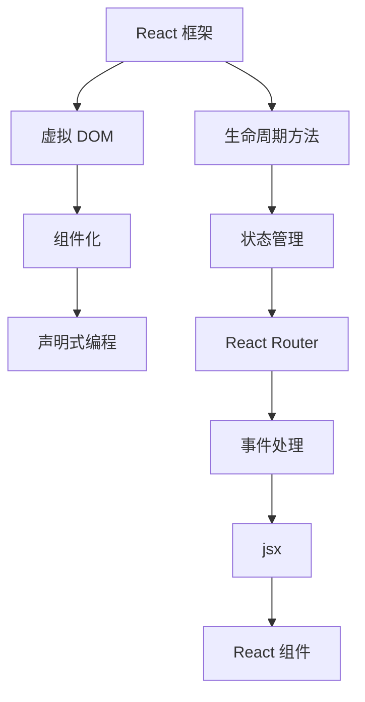

                 

React 是一个用于构建用户界面的 JavaScript 库，它具有组件化、声明式编程和高效更新等特点，使得开发者能够更加高效地构建动态的用户界面。本文将介绍 React 框架的基本概念、核心原理、常用组件、以及如何在项目中应用 React。

## 文章关键词

React、前端开发、动态用户界面、组件化、声明式编程

## 文章摘要

本文首先介绍了 React 框架的背景和核心概念，包括虚拟 DOM、组件化、声明式编程等。接着，详细讲解了 React 的核心组件，如 React.Component、React.PureComponent、函数式组件等，并介绍了如何使用 JSX 来编写 React 代码。然后，本文介绍了 React 的生命周期方法和状态管理，以及如何使用 React Router 进行路由管理。最后，本文通过一个简单的示例项目，展示了如何使用 React 来构建一个动态用户界面。

## 1. 背景介绍

随着互联网的快速发展，前端开发变得越来越复杂。传统的手动操作 DOM 的方式已经无法满足现代 Web 应用程序的需求。为了提高开发效率和用户体验，React 框架应运而生。React 由 Facebook 开发，并已成为前端开发的基石之一。React 的主要目标是提高前端开发者的生产力，使得开发者能够更加关注业务逻辑，而不是底层的 DOM 操作。

React 的核心概念包括虚拟 DOM、组件化、声明式编程等。虚拟 DOM 是 React 的一个核心特性，它通过将实际的 DOM 操作抽象化，使得开发者能够更加高效地更新 UI。组件化则使得开发者可以将 UI 拆分成多个可复用的组件，从而提高代码的可维护性和可扩展性。声明式编程则使得开发者能够更加直观地描述 UI 的状态和行为。

## 2. 核心概念与联系

下面我们将介绍 React 的核心概念，并通过一个 Mermaid 流程图来展示它们之间的联系。



### 2.1 虚拟 DOM

虚拟 DOM 是 React 的一个核心特性。它是一个内存中的数据结构，用来保存实际的 DOM 结构。当组件的状态或属性发生变化时，React 会使用虚拟 DOM 来生成一个新的渲染树，并与旧的渲染树进行比较。通过这种方式，React 只会更新实际需要更新的部分，从而提高更新效率。

### 2.2 组件化

React 的组件化使得开发者可以将 UI 拆分成多个可复用的组件。每个组件都有自己的状态和生命周期方法，可以独立开发、测试和部署。组件化不仅提高了代码的可维护性，还使得开发者可以更加专注于业务逻辑，而不是底层的 DOM 操作。

### 2.3 声明式编程

声明式编程使得开发者能够更加直观地描述 UI 的状态和行为。在 React 中，开发者只需要关注 UI 的变化，而无需关注具体的更新过程。React 会自动处理 UI 的更新，从而提高开发效率和代码的可读性。

### 2.4 生命周期方法

生命周期方法是 React 组件在创建、更新、销毁等过程中执行的一系列方法。通过生命周期方法，开发者可以更好地控制组件的状态和行为，从而实现更复杂的逻辑。

### 2.5 状态管理

状态管理是 React 应用程序中的一个重要概念。它涉及如何管理组件的状态，包括数据的获取、更新和共享。React 提供了多种状态管理解决方案，如 React.PureComponent、函数式组件和 Redux 等。

### 2.6 React Router

React Router 是 React 的一个路由管理库。它允许开发者根据不同的路径来渲染不同的组件，从而实现单页面应用程序（Single Page Application, SPA）。

### 2.7 JSX

JSX 是 JavaScript XML 的缩写，它是一种基于 JavaScript 的语法扩展。通过 JSX，开发者可以使用类似 HTML 的语法来编写 React 组件的模板。JSX 最终会被 Babel 转换为 JavaScript 代码。

## 3. 核心算法原理 & 具体操作步骤

### 3.1 算法原理概述

React 的核心算法原理主要包括以下几个方面：

1. 虚拟 DOM：React 使用虚拟 DOM 来模拟实际的 DOM 结构。当组件的状态或属性发生变化时，React 会使用虚拟 DOM 来生成一个新的渲染树，并与旧的渲染树进行比较，从而确定需要更新的部分。
2. 渲染优化：React 通过 Diff 算法来优化渲染过程。Diff 算法能够快速找出渲染树中变化的部分，从而减少不必要的渲染操作。
3. 事件处理：React 使用事件代理（Event Delegation）来处理事件。通过将所有的事件绑定到 document 上，React 能够更高效地处理事件。

### 3.2 算法步骤详解

1. 初始化：当创建一个 React 组件时，React 会为其创建一个虚拟 DOM 实例，并将其挂载到实际的 DOM 上。
2. 更新：当组件的状态或属性发生变化时，React 会使用虚拟 DOM 来生成一个新的渲染树，并与旧的渲染树进行比较。比较过程主要包括以下步骤：
   - 找出两个渲染树中不同的节点。
   - 更新不同的节点。
   - 删除已删除的节点。
   - 添加新的节点。
3. 渲染：完成更新后，React 会将新的渲染树渲染到实际的 DOM 上，从而更新 UI。
4. 事件处理：React 使用事件代理来处理事件。具体步骤如下：
   - 将所有的事件绑定到 document 上。
   - 当事件发生时，React 会根据事件的目标节点找到对应的事件处理函数。
   - 执行事件处理函数，并根据需要更新组件的状态。

### 3.3 算法优缺点

**优点：**
1. 高效更新：React 的虚拟 DOM 和 Diff 算法能够高效地更新 UI，从而减少渲染次数。
2. 组件化：React 的组件化使得开发者能够更好地组织代码，提高代码的可维护性和可复用性。
3. 声明式编程：React 的声明式编程使得开发者能够更加直观地描述 UI 的状态和行为。

**缺点：**
1. 学习曲线：React 的语法和概念相对复杂，需要开发者投入更多的时间来学习。
2. 性能开销：尽管 React 的更新机制相对高效，但在某些情况下，仍然存在一定的性能开销。

### 3.4 算法应用领域

React 主要应用于前端开发领域，特别是在构建单页面应用程序（SPA）和复杂交互式用户界面时，React 显示出强大的优势。React 已经成为前端开发的基石之一，被广泛应用于各类 Web 应用程序。

## 4. 数学模型和公式 & 详细讲解 & 举例说明

React 的核心算法原理涉及到多种数学模型和公式，如 Diff 算法、事件处理机制等。以下将对这些数学模型和公式进行详细讲解，并通过举例来说明它们的实际应用。

### 4.1 数学模型构建

在 React 中，Diff 算法是核心的数学模型之一。Diff 算法用于比较两个虚拟 DOM 树，并找出它们之间的差异。Diff 算法的核心思想是：通过比较节点的类型、属性和子节点，找出两个树之间的差异，并更新实际的 DOM。

Diff 算法的基本步骤如下：

1. 比较节点的类型：如果两个节点的类型不同，则直接替换节点。
2. 比较节点的属性：如果两个节点的属性不同，则更新节点的属性。
3. 比较子节点：如果两个节点的子节点数量相同，则递归比较子节点；如果子节点数量不同，则删除多余的子节点或添加新的子节点。

### 4.2 公式推导过程

在 Diff 算法中，涉及多个数学公式。以下是对这些公式的推导过程：

假设有两个虚拟 DOM 树 A 和 B，它们具有相同的结构。我们需要比较这两个树，并找出它们之间的差异。

1. 节点比较公式：  
   $$ compareNode(A, B) = (A \text{ 的类型} == B \text{ 的类型}) \land (A \text{ 的属性} == B \text{ 的属性}) $$

2. 子节点比较公式：  
   $$ compareChildren(A, B) = (\text{子节点数量相同}) \land (A \text{ 的子节点} == B \text{ 的子节点}) $$

3. 删除节点公式：  
   $$ deleteNode(A, B) = (A \text{ 的类型} \neq B \text{ 的类型}) \lor (A \text{ 的属性} \neq B \text{ 的属性}) \lor (A \text{ 的子节点数量} > B \text{ 的子节点数量}) $$

4. 添加节点公式：  
   $$ addNode(A, B) = (A \text{ 的类型} \neq B \text{ 的类型}) \lor (A \text{ 的属性} \neq B \text{ 的属性}) \lor (A \text{ 的子节点数量} < B \text{ 的子节点数量}) $$

### 4.3 案例分析与讲解

假设有两个虚拟 DOM 树 A 和 B，它们如下所示：

```javascript
// 虚拟 DOM 树 A
{
  "type": "div",
  "props": {
    "className": "container",
    "children": [
      {
        "type": "h1",
        "props": {
          "children": "Hello World"
        }
      },
      {
        "type": "p",
        "props": {
          "children": "This is a paragraph."
        }
      }
    ]
  }
}

// 虚拟 DOM 树 B
{
  "type": "div",
  "props": {
    "className": "container",
    "children": [
      {
        "type": "h1",
        "props": {
          "children": "Hello React"
        }
      },
      {
        "type": "p",
        "props": {
          "children": "This is a new paragraph."
        }
      }
    ]
  }
}
```

我们需要比较这两个树，并找出它们之间的差异。

1. 比较节点类型：  
   $$ compareNode(A, B) = (A \text{ 的类型} == B \text{ 的类型}) \land (A \text{ 的属性} == B \text{ 的属性}) = (div == div) \land ({className:"container"} == {className:"container"}) = true $$

2. 比较子节点：  
   $$ compareChildren(A, B) = (\text{子节点数量相同}) \land (A \text{ 的子节点} == B \text{ 的子节点}) = (2 == 2) \land ({h1, p} == {h1, p}) = true $$

3. 比较 h1 节点：  
   $$ compareNode(A.children[0], B.children[0]) = (A.children[0] \text{ 的类型} == B.children[0] \text{ 的类型}) \land (A.children[0] \text{ 的属性} == B.children[0] \text{ 的属性}) = (h1 == h1) \land ({children:"Hello World"} == {children:"Hello React"}) = false $$

4. 比较 p 节点：  
   $$ compareNode(A.children[1], B.children[1]) = (A.children[1] \text{ 的类型} == B.children[1] \text{ 的类型}) \land (A.children[1] \text{ 的属性} == B.children[1] \text{ 的属性}) = (p == p) \land ({children:"This is a paragraph."} == {children:"This is a new paragraph."}) = false $$

根据上述比较结果，我们可以得出以下结论：

- h1 节点的 children 属性发生了变化。
- p 节点的 children 属性发生了变化。

因此，React 会更新实际的 DOM，将 h1 节点的 children 属性更新为 "Hello React"，将 p 节点的 children 属性更新为 "This is a new paragraph"。

## 5. 项目实践：代码实例和详细解释说明

在本节中，我们将通过一个简单的 React 项目来展示如何构建动态用户界面。该项目将包括一个简单的表单和用于验证用户输入的 React 组件。

### 5.1 开发环境搭建

首先，确保你已经安装了 Node.js 和 npm。然后，按照以下步骤搭建开发环境：

1. 创建一个新的 React 应用程序：

```bash
npx create-react-app my-app
```

2. 进入项目目录：

```bash
cd my-app
```

3. 安装 React Router：

```bash
npm install react-router-dom
```

### 5.2 源代码详细实现

接下来，我们将实现一个简单的表单组件，用于收集用户名和密码，并在提交时验证用户输入。

**src/components/LoginForm.js**

```javascript
import React, { useState } from 'react';

function LoginForm() {
  const [username, setUsername] = useState('');
  const [password, setPassword] = useState('');
  const [errors, setErrors] = useState({});

  const handleSubmit = (e) => {
    e.preventDefault();
    const errors = validate({ username, password });
    setErrors(errors);
  };

  const validate = ({ username, password }) => {
    const errors = {};
    if (!username) errors.username = 'Username is required';
    if (!password) errors.password = 'Password is required';
    return errors;
  };

  return (
    <form onSubmit={handleSubmit}>
      <div>
        <label htmlFor="username">Username:</label>
        <input
          type="text"
          id="username"
          value={username}
          onChange={(e) => setUsername(e.target.value)}
        />
        {errors.username && <p>{errors.username}</p>}
      </div>
      <div>
        <label htmlFor="password">Password:</label>
        <input
          type="password"
          id="password"
          value={password}
          onChange={(e) => setPassword(e.target.value)}
        />
        {errors.password && <p>{errors.password}</p>}
      </div>
      <button type="submit">Login</button>
    </form>
  );
}

export default LoginForm;
```

**src/App.js**

```javascript
import React from 'react';
import './App.css';
import LoginForm from './components/LoginForm';
import { BrowserRouter as Router, Route, Switch } from 'react-router-dom';

function App() {
  return (
    <Router>
      <div className="App">
        <Switch>
          <Route path="/" exact component={LoginForm} />
          {/* 这里可以添加更多路由 */}
        </Switch>
      </div>
    </Router>
  );
}

export default App;
```

### 5.3 代码解读与分析

在这个示例中，我们创建了一个 `LoginForm` 组件，用于收集用户名和密码，并在用户提交表单时验证输入。以下是代码的详细解读：

1. **状态管理**：我们使用了 `useState` 钩子来管理 `username`、`password` 和 `errors` 的状态。`useState` 钩子允许我们在组件中创建和更新状态。

2. **表单处理**：`handleSubmit` 函数在表单提交时被调用。它首先阻止了表单的默认提交行为，然后调用 `validate` 函数来验证用户输入。

3. **输入验证**：`validate` 函数检查 `username` 和 `password` 是否为空，并在错误时返回一个包含错误信息的对象。

4. **错误显示**：如果 `errors` 对象包含错误信息，我们将错误信息显示在输入字段旁边。这使用了一个简单的条件渲染语句。

5. **React Router**：我们使用了 React Router 来管理应用程序的路由。在这个示例中，我们只定义了一个路由，但可以轻松地添加更多路由。

### 5.4 运行结果展示

通过运行应用程序，我们可以在浏览器中看到一个简单的登录表单。当用户尝试提交空的用户名或密码时，会显示相应的错误信息。


## 6. 实际应用场景

React 框架在现实世界的 Web 应用程序中有着广泛的应用。以下是一些常见的应用场景：

1. **单页面应用程序（SPA）**：React 非常适合构建单页面应用程序，其中用户与页面的交互主要是通过 AJAX 调用来动态加载数据。这种模式提供了更好的用户体验，因为页面不会重新加载，用户可以无缝地浏览不同的页面。

2. **企业级应用**：许多大型企业应用都使用 React 来构建用户界面，如管理后台、客户关系管理系统（CRM）和电子商务网站。React 的组件化特性和声明式编程使得开发者可以更加高效地开发、测试和部署大型应用。

3. **实时更新应用**：React 的虚拟 DOM 和 Diff 算法使得实时更新应用成为可能。这种模式在社交媒体应用、在线协作工具和游戏等领域中非常受欢迎。

4. **移动应用**：React Native 是 React 的一个版本，它允许开发者使用 JavaScript 来构建移动应用。React Native 使用了 React 的核心概念，但提供了原生组件，从而提供了更好的性能和用户体验。

## 7. 未来应用展望

随着技术的不断发展，React 框架在未来将继续发挥重要作用。以下是一些可能的发展趋势和挑战：

1. **性能优化**：React 将继续优化其核心算法，以提供更好的性能。这包括改进 Diff 算法、减少内存占用和提升渲染速度。

2. **生态系统的扩展**：React 的生态系统将继续扩展，包括更多的工具、库和框架。这将使得开发者能够更加灵活地构建应用程序。

3. **跨平台开发**：React Native 的成功表明了跨平台开发的潜力。未来，React 可能会进一步扩展到其他平台，如桌面应用和物联网（IoT）。

4. **学习曲线**：尽管 React 提供了许多优势，但其学习曲线仍然较高。为了降低学习成本，社区可能会开发更多的教学资源和工具。

5. **与现有技术的集成**：React 将需要与现有的前端框架和库（如 Vue.js、Angular）进行更好的集成，以便开发者能够灵活地选择技术栈。

## 8. 工具和资源推荐

为了更好地学习和使用 React，以下是一些建议的工具和资源：

### 8.1 学习资源推荐

1. **官方文档**：React 的官方文档是一个非常好的学习资源，涵盖了 React 的核心概念、API 和最佳实践。
2. **在线教程**：许多在线平台提供了免费的 React 教程，如 FreeCodeCamp、FrontendMasters 和 Udemy。
3. **书籍**：有几本关于 React 的优秀书籍，如《React Up & Running》、《Learning React for JavaScript Developers》和《You Don't Know JS: ES6 & Beyond》。

### 8.2 开发工具推荐

1. **Visual Studio Code**：Visual Studio Code 是一个功能强大的代码编辑器，它支持 React 开发，并提供了许多插件。
2. **Webpack**：Webpack 是一个模块打包工具，用于构建和打包 React 应用程序。它允许开发者使用各种模块化方法和加载器。
3. **React DevTools**：React DevTools 是一个浏览器扩展程序，用于调试 React 应用程序。它提供了丰富的功能，如检查组件状态、调试渲染过程等。

### 8.3 相关论文推荐

1. **React: A JavaScript Library for Building User Interfaces**：这是 React 的创始人 Jordan Walke 于 2013 年发表的一篇论文，详细介绍了 React 的设计理念和核心概念。
2. **Virtual DOM**: Faux Virtual DOM**: 从根本上说，是 React DevTools 的作者 Andrew Clark 写的一篇关于虚拟 DOM 的深入探讨。

## 9. 总结：未来发展趋势与挑战

React 框架在过去几年中取得了巨大的成功，并已成为前端开发的基石之一。然而，随着技术的不断进步，React 也面临着一些挑战和机遇。

**未来发展趋势：**

1. **性能优化**：React 将继续优化其核心算法，以提供更好的性能和用户体验。
2. **生态系统扩展**：React 的生态系统将继续扩展，包括更多的工具、库和框架。
3. **跨平台开发**：React Native 和其他跨平台解决方案将继续发展，为开发者提供更广泛的应用场景。
4. **与现有技术的集成**：React 将需要与现有的前端框架和库进行更好的集成，以便开发者能够灵活地选择技术栈。

**面临的挑战：**

1. **学习曲线**：React 的学习曲线较高，为了降低学习成本，社区需要开发更多的教学资源和工具。
2. **复杂性问题**：随着应用程序的复杂度增加，React 的使用也可能变得更加复杂。开发者需要掌握更多的概念和技巧来应对这些问题。

**研究展望：**

React 的未来仍然充满了机遇和挑战。通过不断地优化性能、扩展生态系统和与现有技术的集成，React 将继续为前端开发带来巨大的价值。同时，社区需要共同努力，降低学习成本，帮助更多开发者掌握这一强大的工具。

## 附录：常见问题与解答

### Q: React 是如何进行组件化的？

A: React 通过将 UI 拆分成多个可复用的组件来实现组件化。每个组件都有自己的状态和生命周期方法，可以独立开发、测试和部署。

### Q: 为什么 React 使用虚拟 DOM？

A: React 使用虚拟 DOM 来提高更新 UI 的效率。通过将实际的 DOM 操作抽象化，React 只会更新实际需要更新的部分，从而减少渲染次数。

### Q: React 的生命周期方法有哪些？

A: React 的生命周期方法包括 `componentDidMount`、`componentDidUpdate`、`componentWillUnmount` 等。这些方法在组件的创建、更新和销毁过程中被调用，用于执行一些特定的逻辑。

### Q: 如何在 React 中管理状态？

A: React 提供了多种状态管理解决方案，如 `useState` 钩子、`useReducer` 钩子和 Redux。开发者可以根据具体需求选择合适的状态管理方法。

### Q: 为什么使用 React Router？

A: React Router 是 React 的一个路由管理库，它允许开发者根据不同的路径来渲染不同的组件，从而实现单页面应用程序（SPA）。React Router 提供了简单、灵活的路由管理功能，使得开发者可以更加专注于业务逻辑。

### Q: 如何优化 React 应用程序的性能？

A: 优化 React 应用程序的性能可以从多个方面入手，包括使用虚拟 DOM、避免不必要的渲染、使用 React.memo 和 useCallback 等。此外，还可以使用 Webpack 和 Code Splitting 等技术来提高应用程序的加载速度。

## 作者署名

作者：禅与计算机程序设计艺术 / Zen and the Art of Computer Programming


