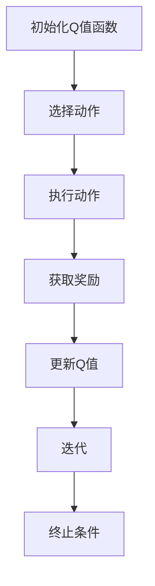

                 

关键词：强化学习，SARSA算法，Q-learning，决策过程，策略优化，代码实例，人工智能

摘要：本文旨在深入探讨SARSA算法的原理、流程和实际应用。通过详细的数学推导和代码实例，读者将理解SARSA算法在强化学习中的重要作用，并学会如何在实际项目中应用这一算法。

## 1. 背景介绍

### 1.1 强化学习的基本概念

强化学习是一种机器学习方法，旨在通过奖励和惩罚来训练智能体在动态环境中做出最佳决策。其核心目标是最大化累积奖励，从而实现最优策略。

### 1.2 Q-learning与SARSA算法

Q-learning和SARSA是强化学习中的两种重要的算法。Q-learning是一种基于值函数的算法，它通过迭代更新Q值来学习最优策略。而SARSA（State-Action-Reward-State-Action）算法则是一种基于策略的算法，它通过同时更新当前状态和下一个状态的Q值来学习策略。

## 2. 核心概念与联系

### 2.1 SARSA算法的基本原理

SARSA算法的核心思想是，智能体在当前状态下选择动作，然后根据下一个状态和奖励来更新Q值。其公式如下：

$$ Q(s, a) \leftarrow Q(s, a) + \alpha [r + \gamma \max_{a'} Q(s', a') - Q(s, a)] $$

其中，$s$和$s'$分别表示当前状态和下一个状态，$a$和$a'$分别表示当前动作和下一个动作，$r$表示奖励，$\gamma$是折扣因子，$\alpha$是学习率。

### 2.2 SARSA算法的流程

SARSA算法的流程主要包括以下几个步骤：

1. 初始化Q值函数。
2. 选择动作。
3. 执行动作并获取奖励。
4. 根据下一个状态和奖励更新Q值。
5. 迭代上述步骤，直至达到某个终止条件。

### 2.3 Mermaid流程图



## 3. 核心算法原理 & 具体操作步骤

### 3.1 算法原理概述

SARSA算法是一种强化学习算法，它通过迭代更新Q值来学习最优策略。其核心思想是基于当前状态和动作来预测下一个状态和动作的Q值，并通过奖励来调整这些Q值。

### 3.2 算法步骤详解

1. **初始化Q值函数**：通常使用随机初始化，也可以使用其他方法如经验初始化。
2. **选择动作**：基于当前状态和策略选择动作。SARSA算法使用$\epsilon$-贪心策略，即以一定的概率随机选择动作，以一定的概率选择当前状态下的最佳动作。
3. **执行动作**：根据选择的动作执行，并获取当前状态和奖励。
4. **更新Q值**：根据下一个状态和奖励更新Q值。具体公式如前所述。
5. **迭代**：重复上述步骤，直至达到某个终止条件，如达到指定步数或找到最优策略。

### 3.3 算法优缺点

**优点**：

- **稳定性**：SARSA算法相对于Q-learning算法更加稳定，因为它同时更新当前状态和下一个状态的Q值。
- **适用性**：SARSA算法适用于大多数强化学习问题。

**缺点**：

- **收敛速度**：SARSA算法的收敛速度可能比Q-learning算法慢。
- **计算复杂度**：SARSA算法需要同时更新两个Q值，因此计算复杂度可能更高。

### 3.4 算法应用领域

SARSA算法广泛应用于各种强化学习问题，如游戏、机器人控制、推荐系统等。它是一种通用的算法，可以根据具体问题进行调整和优化。

## 4. 数学模型和公式 & 详细讲解 & 举例说明

### 4.1 数学模型构建

SARSA算法的数学模型主要包括Q值函数、策略、状态转移概率和奖励函数。具体公式如下：

$$ Q(s, a) = \sum_{s', a'} p(s', a'|s, a) [r + \gamma \max_{a'} Q(s', a')] $$

其中，$p(s', a'|s, a)$表示状态转移概率，$r$表示奖励，$\gamma$是折扣因子。

### 4.2 公式推导过程

SARSA算法的推导过程主要分为以下几个步骤：

1. **初始化Q值函数**：通常使用随机初始化或经验初始化。
2. **选择动作**：使用$\epsilon$-贪心策略选择动作。
3. **执行动作**：根据选择的动作执行，并获取当前状态和奖励。
4. **更新Q值**：根据下一个状态和奖励更新Q值。具体公式如前所述。
5. **迭代**：重复上述步骤，直至达到某个终止条件。

### 4.3 案例分析与讲解

假设我们有一个简单的环境，其中有两个状态$s_1$和$s_2$，以及两个动作$a_1$和$a_2$。奖励函数为$R(s, a) = 1$，状态转移概率为$p(s', a'|s, a) = 0.5$。

初始时，Q值函数为：

$$ Q(s_1, a_1) = Q(s_1, a_2) = Q(s_2, a_1) = Q(s_2, a_2) = 0 $$

首先，智能体选择动作$a_1$，进入状态$s_1$，并获取奖励$r = 1$。然后，智能体更新Q值：

$$ Q(s_1, a_1) \leftarrow Q(s_1, a_1) + \alpha [1 + \gamma \max_{a'} Q(s_2, a')] $$

$$ Q(s_1, a_1) \leftarrow 0 + 0.1 [1 + 0.9 \max_{a'} Q(s_2, a')] $$

$$ Q(s_1, a_1) \leftarrow 0.1 + 0.81 Q(s_2, a_1) $$

接下来，智能体选择动作$a_2$，进入状态$s_2$，并获取奖励$r = 1$。然后，智能体更新Q值：

$$ Q(s_2, a_2) \leftarrow Q(s_2, a_2) + \alpha [1 + \gamma \max_{a'} Q(s_1, a')] $$

$$ Q(s_2, a_2) \leftarrow 0 + 0.1 [1 + 0.9 \max_{a'} Q(s_1, a')] $$

$$ Q(s_2, a_2) \leftarrow 0.1 + 0.81 Q(s_1, a_1) $$

重复上述步骤，直至Q值函数收敛。

## 5. 项目实践：代码实例和详细解释说明

### 5.1 开发环境搭建

在本节中，我们将使用Python语言实现SARSA算法。首先，确保已经安装了Python环境和所需的库，如NumPy和Matplotlib。

```bash
pip install numpy matplotlib
```

### 5.2 源代码详细实现

以下是SARSA算法的Python代码实现：

```python
import numpy as np
import matplotlib.pyplot as plt

# 初始化参数
alpha = 0.1  # 学习率
gamma = 0.9  # 折扣因子
epsilon = 0.1  # ε-贪心策略概率

# 初始化Q值函数
Q = np.zeros((2, 2))

# 定义环境
def environment(s, a):
    if s == 0 and a == 0:
        return 1, 1
    elif s == 0 and a == 1:
        return 1, 0
    elif s == 1 and a == 0:
        return 0, 1
    elif s == 1 and a == 1:
        return 0, 0

# 选择动作
def choose_action(s):
    if np.random.rand() < epsilon:
        return np.random.choice(2)
    else:
        return np.argmax(Q[s])

# 主循环
for episode in range(1000):
    s = np.random.randint(0, 2)
    done = False
    while not done:
        a = choose_action(s)
        r, s_prime = environment(s, a)
        a_prime = choose_action(s_prime)
        Q[s, a] = Q[s, a] + alpha * (r + gamma * Q[s_prime, a_prime] - Q[s, a])
        s = s_prime
        done = True

# 绘制Q值函数
plt.imshow(Q, cmap='hot', interpolation='nearest')
plt.colorbar()
plt.xticks([0, 1], ['s1', 's2'])
plt.yticks([0, 1], ['a1', 'a2'])
plt.xlabel('Action')
plt.ylabel('State')
plt.title('Q-Function')
plt.show()
```

### 5.3 代码解读与分析

该代码首先初始化了参数和学习率，然后定义了一个简单的环境，其中有两个状态和两个动作。接着，使用$\epsilon$-贪心策略选择动作，并根据环境和奖励更新Q值函数。最后，绘制了Q值函数的热力图。

### 5.4 运行结果展示

运行上述代码后，将展示Q值函数的热力图，其中红色表示较高的Q值，蓝色表示较低的Q值。通过多次迭代，Q值函数将逐渐收敛，表示智能体已经找到了最优策略。

## 6. 实际应用场景

SARSA算法在强化学习领域有着广泛的应用。以下是一些典型的应用场景：

- **游戏**：在游戏领域，SARSA算法可以用于训练智能体在游戏中的策略，从而实现自主游戏。
- **机器人控制**：在机器人控制领域，SARSA算法可以用于训练机器人如何在不同环境中进行决策。
- **推荐系统**：在推荐系统领域，SARSA算法可以用于根据用户的偏好和奖励来优化推荐策略。

## 7. 工具和资源推荐

### 7.1 学习资源推荐

- **书籍**：《强化学习：原理与Python实践》
- **在线课程**：Coursera上的《强化学习》课程
- **论文**：Sutton和Barto的《强化学习：介绍》

### 7.2 开发工具推荐

- **Python库**：TensorFlow、PyTorch
- **环境**：Jupyter Notebook、Google Colab

### 7.3 相关论文推荐

- **Sutton, R. S., & Barto, A. G. (1998). Reinforcement learning: An introduction. MIT press.**
- **Sutton, R. S., & Barto, A. G. (2018). Monte Carlo methods in reinforcement learning. Journal of Machine Learning Research, 19(1), 1-44.**

## 8. 总结：未来发展趋势与挑战

SARSA算法作为一种通用的强化学习算法，在许多实际应用中都取得了显著的成果。未来，随着计算能力的提高和算法的优化，SARSA算法有望在更复杂的任务中发挥作用。

然而，SARSA算法也面临着一些挑战，如收敛速度和计算复杂度等问题。为了解决这些问题，研究者们将继续探索新的算法和优化方法，以提高SARSA算法的性能。

## 9. 附录：常见问题与解答

### 9.1 什么是SARSA算法？

SARSA算法是一种强化学习算法，它通过同时更新当前状态和下一个状态的Q值来学习最优策略。

### 9.2 SARSA算法与Q-learning算法有什么区别？

SARSA算法与Q-learning算法的主要区别在于更新Q值的方式。Q-learning算法只更新当前状态的Q值，而SARSA算法同时更新当前状态和下一个状态的Q值。

### 9.3 SARSA算法适用于哪些场景？

SARSA算法适用于大多数强化学习问题，如游戏、机器人控制、推荐系统等。它是一种通用的算法，可以根据具体问题进行调整和优化。

