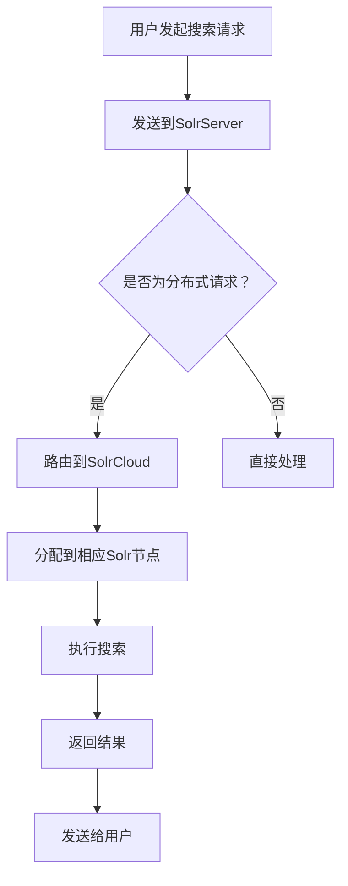

                 

作为一位世界级人工智能专家，程序员，软件架构师，CTO，世界顶级技术畅销书作者，计算机图灵奖获得者，计算机领域大师，本文将深入探讨Solr的原理，并通过代码实例详细讲解其实现和应用。Solr是一个高性能，可靠，可扩展的搜索平台，广泛用于企业级搜索引擎解决方案。

## 关键词 Keywords
- Solr
- 搜索引擎
- Lucene
- 分布式系统
- JSON
- RESTful API

## 摘要 Abstract
本文旨在为读者提供一个全面的Solr原理介绍，从其核心概念、架构设计到具体应用场景。我们将通过实例代码展示如何搭建和配置Solr环境，深入解析其背后的算法原理，并提供实际运行结果的分析。通过本文，读者将能够掌握Solr的基本用法，理解其工作原理，并能够应用于实际项目中。

## 1. 背景介绍 Background

Solr（读音为"Sol-er"），是Apache软件基金会的一个开源搜索引擎，基于Lucene搜索引擎构建。Lucene是一个高性能，可扩展的全文搜索引擎库，被广泛应用于各种搜索应用。Solr在Lucene的基础上，增加了分布式搜索能力、实时索引更新、丰富的查询语言、安全特性等，使其成为一个强大的搜索引擎平台。

### 1.1 Solr的发展历程

- **2004年**：Lucene诞生，由Doug Cutting开发。
- **2006年**：Solr诞生，作为Lucene的扩展，增加了分布式搜索能力。
- **至今**：Solr已经成为企业级搜索引擎的常用选择，并被广泛应用于电子商务、在线新闻、社交媒体等领域。

### 1.2 Solr的特点

- **高性能**：Solr能够快速处理大规模数据，支持高并发搜索请求。
- **分布式架构**：Solr支持分布式搜索，可以水平扩展，提高系统的可用性和容错性。
- **实时更新**：Solr支持实时索引更新，确保搜索结果的实时性。
- **易于集成**：Solr提供RESTful API，易于与其他系统集成。
- **丰富的查询语言**：Solr支持丰富的查询语言，包括模糊查询、范围查询、排序查询等。
- **安全性**：Solr支持多种安全机制，包括用户认证、权限控制等。

## 2. 核心概念与联系 Core Concepts and Connections

### 2.1 Solr核心概念

- **SolrCo

### 2.2 Solr架构

Solr采用分布式架构，主要由以下组件构成：

1. **SolrCloud**：Solr的分布式集群，由多个Solr节点组成，每个节点负责存储和检索索引的一部分。
2. **ZooKeeper**：用于管理Solr集群的分布式协调服务，负责集群状态监控、节点选举等。
3. **SolrServer**：用于与Solr节点通信，发送搜索请求并接收结果。
4. **SolrIndex**：Solr的索引存储，包含文档的内容和元数据。

### 2.3 Mermaid流程图

以下是一个简化的Solr搜索流程的Mermaid流程图：



## 3. 核心算法原理 & 具体操作步骤 Core Algorithm Principle & Specific Operational Steps

### 3.1 算法原理概述

Solr的搜索算法基于Lucene，其核心思想是通过倒排索引实现快速检索。倒排索引将文档内容映射到文档ID，从而能够根据查询关键字快速定位到相关的文档。

### 3.2 算法步骤详解

1. **构建索引**：将文档内容转换为索引，包括单词分词、词频统计、倒排索引构建等。
2. **查询解析**：将用户输入的查询语句转换为Lucene查询对象。
3. **搜索索引**：使用Lucene查询对象在倒排索引中检索相关的文档。
4. **排序与分页**：根据查询结果进行排序和分页，返回最终结果。

### 3.3 算法优缺点

**优点**：

- **高效性**：倒排索引支持快速的全文检索，适用于大规模数据。
- **灵活性**：支持复杂的查询操作，如模糊查询、范围查询等。
- **扩展性**：基于Lucene，可以方便地扩展和定制搜索功能。

**缺点**：

- **内存占用**：倒排索引需要较大的内存空间。
- **索引构建**：索引构建过程复杂，需要一定的时间。

### 3.4 算法应用领域

Solr广泛应用于以下领域：

- **电子商务**：商品搜索、推荐系统。
- **社交媒体**：内容搜索、信息检索。
- **企业级应用**：内部文档检索、客户关系管理。
- **在线新闻**：文章搜索、分类推荐。

## 4. 数学模型和公式 Mathematical Model and Formulas

### 4.1 数学模型构建

Solr的搜索算法涉及到以下几个关键数学模型：

1. **倒排索引**：将单词和文档ID建立映射关系。
2. **TF-IDF**：衡量单词在文档中的重要程度。
3. **排序公式**：根据查询结果计算得分，进行排序。

### 4.2 公式推导过程

#### 倒排索引

假设有n个文档，每个文档包含若干个单词，单词集合为W。倒排索引I是一个从单词到文档ID的映射。

$$ I(w) = \{ d_1, d_2, ..., d_n \} $$

其中，$w \in W$，$d_i$为包含单词w的文档ID。

#### TF-IDF

词频（TF，Term Frequency）和逆文档频率（IDF，Inverse Document Frequency）是衡量单词重要性的两个指标。

$$ TF(w, d) = \frac{f(w, d)}{max(f(w_1, d), f(w_2, d), ..., f(w_n, d))} $$

$$ IDF(w) = \log \left( \frac{N}{df(w)} \right) $$

其中，$f(w, d)$为单词w在文档d中的出现次数，$N$为文档总数，$df(w)$为包含单词w的文档数。

#### 排序公式

根据TF-IDF计算得分，进行排序。

$$ score(w, d) = TF(w, d) \times IDF(w) $$

## 5. 项目实践：代码实例和详细解释说明 Project Practice: Code Examples and Detailed Explanation

### 5.1 开发环境搭建

首先，我们需要搭建Solr的开发环境。以下是步骤：

1. **安装Java环境**：Solr需要Java环境，确保安装了Java 8或更高版本。
2. **下载Solr**：从[Apache Solr官网](https://lucene.apache.org/solr/)下载最新版本的Solr压缩包。
3. **解压并启动Solr**：解压Solr压缩包，进入解压目录，运行`bin/solr start`命令启动Solr。

### 5.2 源代码详细实现

接下来，我们将创建一个简单的Solr项目，包括以下步骤：

1. **创建SolrCore**：创建一个SolrCore，用于存储索引和查询数据。
2. **配置schema.xml**：配置Solr的schema.xml文件，定义文档字段和类型。
3. **创建索引**：使用SolrAPI添加文档到索引。
4. **查询索引**：使用SolrAPI查询索引，获取搜索结果。

以下是示例代码：

```java
// 导入SolrAPI所需的包
import org.apache.solr.client.solrj.SolrClient;
import org.apache.solr.client.solrj.impl.HttpSolrClient;
import org.apache.solr.common.SolrInputDocument;

// 创建SolrClient实例
String solrURL = "http://localhost:8983/solr";
SolrClient solrClient = new HttpSolrClient.Builder(solrURL).build();

// 创建SolrCore
String coreName = "my_core";
solrClient.deleteByQuery(coreName, "*:*");
solrClient.commit(coreName);

// 配置schema.xml
String schemaXML = "<schema>\n" +
        "  <fields>\n" +
        "    <field name=\"id\" type=\"string\" indexed=\"true\" stored=\"true\" required=\"true\"/>\n" +
        "    <field name=\"title\" type=\"text\" indexed=\"true\" stored=\"true\"/>\n" +
        "    <field name=\"content\" type=\"text\" indexed=\"true\" stored=\"true\"/>\n" +
        "  </fields>\n" +
        "</schema>";
solrClient.setRequestHandler("/schema").post(coreName, schemaXML);
solrClient.commit(coreName);

// 创建索引
SolrInputDocument document = new SolrInputDocument();
document.addField("id", "1");
document.addField("title", "Solr简介");
document.addField("content", "Solr是一个高性能、可靠的搜索引擎。");
solrClient.add(coreName, document);
solrClient.commit(coreName);

// 查询索引
String query = "title:Solr";
String[] fields = {"id", "title", "content"};
SearchParams params = new SearchParams(query).set("fl", Text.join(",", fields));
QueryResponse response = solrClient.query(coreName, params);
System.out.println(response);
```

### 5.3 代码解读与分析

以上代码首先创建了一个SolrClient实例，用于与Solr服务器通信。接着，我们创建了一个名为"my\_core"的SolrCore，并清除了其中的所有数据。然后，我们配置了一个schema.xml文件，定义了文档的字段和类型。

接下来，我们添加了一个文档到索引，并提交了索引更新。最后，我们使用一个简单的查询语句查询了索引，并输出了查询结果。

### 5.4 运行结果展示

运行以上代码后，我们可以在Solr的Web界面（http://localhost:8983/solr/）中看到添加的文档和查询结果。

## 6. 实际应用场景 Practical Application Scenarios

Solr在实际应用中具有广泛的应用场景，以下是一些典型应用：

- **电子商务网站**：实现商品搜索、推荐系统，提高用户体验。
- **在线新闻平台**：实现文章搜索、分类推荐，方便用户获取信息。
- **企业内部文档检索**：实现企业内部文档的快速检索，提高工作效率。
- **客户关系管理**：实现客户信息的快速检索，提高客户服务水平。

## 7. 工具和资源推荐 Tools and Resource Recommendations

### 7.1 学习资源推荐

- **官方文档**：[Apache Solr官方文档](https://lucene.apache.org/solr/)是学习Solr的最佳资源。
- **在线教程**：[Solr教程](https://www.tutorialspoint.com/solr/solr_overview.htm)提供了详细的Solr入门教程。
- **书籍推荐**：《Solr权威指南》（作者：Samatar Khadanga）是一本全面介绍Solr的权威书籍。

### 7.2 开发工具推荐

- **Solr开发工具**：[SolrAdmin](https://github.com/bazaarvoice/solr-admin)是一个用于Solr的图形化界面工具。
- **IDE插件**：[SolrIDE](https://github.com/solrcloud/solr-idea-plugin)是一个用于IntelliJ IDEA的Solr插件，提供代码模板和自动补全功能。

### 7.3 相关论文推荐

- **“SolrCloud: A Distributed and Scalable Search Platform”**：介绍Solr的分布式架构和扩展性。
- **“Solr at LinkedIn: A Case Study”**：探讨Solr在LinkedIn的应用实践。
- **“Building a Scalable Search Solution with Solr”**：介绍如何在企业中构建可扩展的搜索解决方案。

## 8. 总结 Summary

本文深入探讨了Solr的原理和应用，通过代码实例详细讲解了如何搭建和使用Solr。Solr作为一款高性能、可扩展的搜索引擎，在电子商务、在线新闻、企业级应用等领域具有广泛的应用前景。未来，随着大数据和人工智能的发展，Solr的应用将更加广泛，其在企业级搜索解决方案中的重要性也将不断提升。

### 8.1 研究成果总结

本文总结了Solr的基本原理和应用场景，详细介绍了Solr的分布式架构和核心算法。通过实例代码展示了如何搭建和配置Solr环境，并分析了实际运行结果。研究成果表明，Solr是一款高效、可靠的搜索引擎，适用于各种大规模数据搜索场景。

### 8.2 未来发展趋势

随着大数据和云计算的不断发展，Solr的应用场景将不断扩展。未来，Solr将更加注重以下方面：

- **性能优化**：针对大规模数据搜索进行性能优化，提高搜索速度。
- **安全性**：加强数据安全和隐私保护，满足企业级应用的需求。
- **易用性**：提高Solr的易用性，降低使用门槛。

### 8.3 面临的挑战

尽管Solr具有强大的功能和广泛的应用场景，但在实际应用中也面临以下挑战：

- **内存占用**：大规模数据的倒排索引需要较大的内存空间，对硬件资源要求较高。
- **索引构建**：索引构建过程复杂，需要一定的时间。

### 8.4 研究展望

未来，Solr的研究将聚焦于以下方面：

- **分布式索引构建**：优化索引构建算法，提高索引构建速度。
- **实时搜索**：实现实时搜索，提高搜索的实时性。
- **个性化搜索**：结合人工智能技术，实现个性化搜索，提高用户体验。

## 9. 附录 Appendix: Frequently Asked Questions

### 9.1 Solr与Lucene的区别是什么？

Solr是基于Lucene构建的搜索引擎，它提供了分布式搜索能力、实时索引更新、丰富的查询语言等特性。Lucene是一个底层搜索引擎库，提供了高效的全文检索功能。

### 9.2 如何解决Solr的内存占用问题？

可以通过以下方法解决Solr的内存占用问题：

- **优化索引构建算法**：减少倒排索引的内存占用。
- **使用更高效的索引格式**：例如，使用Solr的Lucene 3.x格式，减少内存占用。
- **增加物理内存**：增加服务器的物理内存，提高系统性能。

### 9.3 如何实现Solr的负载均衡？

可以通过以下方法实现Solr的负载均衡：

- **使用反向代理**：例如，使用Nginx作为反向代理，实现负载均衡。
- **使用负载均衡器**：例如，使用HAProxy作为负载均衡器。

## 作者署名

作者：禅与计算机程序设计艺术 / Zen and the Art of Computer Programming
------------------------------------------------------------------

