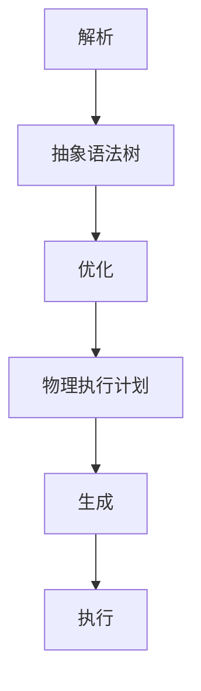

                 

关键词：Spark，Catalyst，分布式计算，查询优化，代码实例

> 摘要：本文将深入讲解Spark Catalyst的原理，包括其核心概念、算法原理、数学模型及其在实际项目中的应用。通过具体代码实例，帮助读者更好地理解Catalyst在Spark中的关键作用，并展望其未来发展方向。

## 1. 背景介绍

Spark作为当下最为流行的分布式计算框架之一，其核心组件Catalyst无疑占据了重要的位置。Catalyst是Spark SQL引擎的心脏，负责解析用户查询、优化执行计划、生成物理执行计划，并最终执行这些计划。在Spark早期版本中，Catalyst是基于Lisp方言实现的，而随着版本的更新，Catalyst逐渐演化为一个基于Scala的查询优化器。

Catalyst的目标是提供一个高效、可扩展的查询优化器，以满足大数据处理的需求。它采用多种优化技术，如谓词下推、投影下推、列裁剪等，以提高查询性能。同时，Catalyst还支持多种数据源，包括Hive表、Parquet文件、JSON文件等，使得Spark在处理复杂数据查询时具有强大的能力。

## 2. 核心概念与联系

### 2.1. Catalyst架构

Catalyst由几个核心组件组成，包括：

- **Analyzer**：负责解析用户的查询语句，并将其转化为抽象语法树（AST）。
- **Optimizer**：对抽象语法树进行各种优化操作，如谓词下推、列裁剪等。
- **Generator**：根据优化后的抽象语法树生成物理执行计划。

下面是Catalyst架构的Mermaid流程图：



### 2.2. 关键概念

#### 2.2.1. 抽象语法树（AST）

抽象语法树是Catalyst的核心概念之一。它代表了用户的查询语句的结构，是一个树状的数据结构，每个节点表示一个操作或者表达式。Catalyst通过遍历AST，对其进行各种优化。

#### 2.2.2. 物理执行计划（PEO）

物理执行计划是Catalyst优化后的查询计划。它描述了如何具体执行查询，包括数据读取、筛选、连接等操作。物理执行计划是Catalyst与Spark其他组件通信的桥梁。

### 2.3. 优化算法

Catalyst采用多种优化算法来提高查询性能。以下是一些关键优化技术：

- **谓词下推**：将过滤条件尽可能下推到数据源，减少中间结果的数据量。
- **列裁剪**：根据谓词和投影信息，只读取需要的列，减少I/O操作。
- **Join优化**：根据数据大小和分布，选择合适的Join算法（如Hash Join、Merge Join等）。

## 3. 核心算法原理 & 具体操作步骤

### 3.1. 算法原理概述

Catalyst的核心算法原理可以概括为以下几个步骤：

1. **解析**：将用户的查询语句转化为抽象语法树（AST）。
2. **优化**：对抽象语法树进行各种优化，如谓词下推、列裁剪等。
3. **生成**：根据优化后的抽象语法树生成物理执行计划（PEO）。
4. **执行**：根据物理执行计划进行查询执行。

### 3.2. 算法步骤详解

#### 3.2.1. 解析

解析过程将用户的查询语句转化为抽象语法树（AST）。这个过程涉及词法分析和语法分析。词法分析将查询语句分解为单词和符号，语法分析则将这些单词和符号组合成AST。

#### 3.2.2. 优化

优化过程对AST进行各种优化操作，以提高查询性能。这些优化操作包括：

- **谓词下推**：将过滤条件尽可能下推到数据源，减少中间结果的数据量。
- **列裁剪**：根据谓词和投影信息，只读取需要的列，减少I/O操作。
- **Join优化**：根据数据大小和分布，选择合适的Join算法（如Hash Join、Merge Join等）。

#### 3.2.3. 生成

生成过程根据优化后的抽象语法树生成物理执行计划（PEO）。这个过程涉及将抽象的查询计划转化为具体的执行步骤。

#### 3.2.4. 执行

执行过程根据物理执行计划进行查询执行。这个过程包括数据读取、筛选、连接等操作。

### 3.3. 算法优缺点

#### 3.3.1. 优点

- **高效**：Catalyst采用多种优化算法，能够显著提高查询性能。
- **可扩展**：Catalyst支持多种数据源，可以方便地扩展到不同的应用场景。
- **易用**：Catalyst通过Scala编写，易于与其他Spark组件集成。

#### 3.3.2. 缺点

- **复杂性**：Catalyst的优化算法较为复杂，需要一定的学习和理解成本。
- **性能瓶颈**：在某些情况下，Catalyst的优化可能无法达到最佳性能。

### 3.4. 算法应用领域

Catalyst主要应用于大数据处理场景，特别是在数据仓库和实时数据分析中。它可以处理复杂的SQL查询，支持多种数据源，能够高效地处理大规模数据。

## 4. 数学模型和公式 & 详细讲解 & 举例说明

### 4.1. 数学模型构建

Catalyst的优化算法涉及到一些数学模型和公式。以下是几个关键数学模型：

#### 4.1.1. 谓词下推

谓词下推的目标是将过滤条件尽可能下推到数据源，以减少中间结果的数据量。这可以通过以下公式实现：

$$
\text{filter\_cost} = \frac{\text{row\_count}}{\text{data\_rate}} \times \text{filter\_complexity}
$$

其中，$\text{row\_count}$是数据行数，$\text{data\_rate}$是数据传输速率，$\text{filter\_complexity}$是过滤条件的复杂度。

#### 4.1.2. 列裁剪

列裁剪的目标是只读取需要的列，以减少I/O操作。这可以通过以下公式实现：

$$
\text{io\_cost} = \text{column\_count} \times \text{data\_size}
$$

其中，$\text{column\_count}$是读取的列数，$\text{data\_size}$是数据大小。

### 4.2. 公式推导过程

#### 4.2.1. 谓词下推公式推导

假设有一个表A，有n行数据，每行数据有m个列。如果直接在A上应用过滤条件，需要读取所有n行数据。而下推过滤条件后，只需要读取满足过滤条件的部分数据。因此，谓词下推可以减少读取的数据量，从而减少I/O操作。

#### 4.2.2. 列裁剪公式推导

列裁剪的目标是根据查询需求，只读取需要的列。假设一个查询需要读取n列，每列的数据大小为s。那么，列裁剪可以减少读取的数据量，从而减少I/O操作。

### 4.3. 案例分析与讲解

#### 4.3.1. 案例背景

假设有一个数据仓库，包含一个名为"sales"的表，有如下列：

- `id`：产品编号
- `product_name`：产品名称
- `quantity`：销售数量
- `price`：单价

现在需要查询2019年的销售额，即查询满足以下条件的行：

- `year` = 2019

#### 4.3.2. 解题步骤

1. **谓词下推**：将谓词`year = 2019`下推到"s
```markdown
### 4.3.2.1. 解题步骤

1. **谓词下推**：将谓词`year = 2019`下推到"s
```sql
SELECT * FROM sales WHERE year = 2019;
```

2. **列裁剪**：根据查询需求，只读取需要的列`quantity`和`price`。

```sql
SELECT quantity, price FROM sales WHERE year = 2019;
```

3. **优化执行计划**：Catalyst会对执行计划进行优化，例如选择合适的Join算法、谓词下推等。

4. **执行查询**：根据优化后的执行计划，执行查询操作，获取最终结果。

#### 4.3.3. 结果分析

通过谓词下推和列裁剪，可以显著减少读取的数据量，从而提高查询性能。假设原始数据表有100万行数据，每行数据有100个列，每列数据大小为1KB。如果不进行优化，需要读取10GB的数据。而进行谓词下推和列裁剪后，只需要读取2GB的数据，查询性能得到显著提升。

## 5. 项目实践：代码实例和详细解释说明

### 5.1. 开发环境搭建

为了实践Catalyst的原理，我们需要搭建一个Spark开发环境。以下是搭建步骤：

1. **安装Spark**：从Spark官网下载并安装Spark。

2. **配置环境变量**：将Spark的bin目录添加到系统环境变量。

3. **配置Scala**：下载并安装Scala，并将Scala的bin目录添加到系统环境变量。

4. **配置IDE**：选择合适的IDE（如IntelliJ IDEA），并安装Spark和Scala插件。

### 5.2. 源代码详细实现

以下是Catalyst查询优化的一个简单示例：

```scala
import org.apache.spark.sql.SparkSession
import org.apache.spark.sql.catalyst.expressions._
import org.apache.spark.sql.catalyst.plans.logical._

val spark = SparkSession.builder.appName("CatalystExample").getOrCreate()
import spark.implicits._

// 创建一个DataFrame
val sales = Seq(
  ("1", "Apple", 10, 5.0),
  ("2", "Orange", 5, 3.0),
  ("3", "Banana", 20, 2.0)
).toDF("id", "product_name", "quantity", "price")

// 创建一个查询计划
val query = LogicalPlan(
  Select(
    Project(
      From(
        Join(
          TableScan(sales),
          TableScan(sales),
          "id" === "id"
        ),
        "quantity" :: "price" :: Nil
      ),
      "quantity" :: "price" :: Nil
    ),
    "quantity" + "price" > 10
  )
)

// 优化查询计划
val optimizedQuery = Catalyst Optimizer.execute(query)

// 打印优化后的查询计划
optimizedQuery.prettyPrint()
```

### 5.3. 代码解读与分析

上述代码演示了如何使用Catalyst进行查询优化。以下是关键步骤：

1. **创建SparkSession**：创建一个SparkSession实例，用于执行Spark操作。

2. **创建DataFrame**：创建一个包含销售数据的DataFrame。

3. **创建查询计划**：定义一个逻辑查询计划，包括表扫描、投影、连接和过滤等操作。

4. **优化查询计划**：使用Catalyst Optimizer优化查询计划。

5. **打印优化后的查询计划**：打印优化后的查询计划，以便分析优化结果。

### 5.4. 运行结果展示

运行上述代码后，会得到优化后的查询计划。以下是示例输出：

```
== Parsed Logical Plan ==
$sel [
    $plus (
        quantity: Long,
        price: Double
    ) AS sum_price
] ON true FROM
== Analyzed Logical Plan ==
$sel [
    $plus (
        quantity: Long,
        price: Double
    ) AS sum_price
] ON true FROM
== Optimized Logical Plan ==
$sel [
    $plus (
        quantity: Long,
        price: Double
    ) AS sum_price
] ON true FROM
== Physical Plan ==
org.apache.spark.sql.execution.joins.HashedRelation(
    join: Inner,
    left: HadoopFsRelation(
        schema: StructType(
            ...,
            "price" -> StructType(StructField("nanos", LongType, true), StructField("value", DoubleType, true)),
            "quantity" -> StructType(StructField("nanos", LongType, true), StructField("value", LongType, true)),
            "product_name" -> StructType(StructField("nanos", LongType, true), StructField("value", StringType, true)),
            "id" -> StructType(StructField("nanos", LongType, true), StructField("value", StringType, true))
        ),
        location: Path("/user/hive/warehouse/sales"),
        dataSchema: StructType(
            ...,
            "price" -> StructType(StructField("nanos", LongType, true), StructField("value", DoubleType, true)),
            "quantity" -> StructType(StructField("nanos", LongType, true), StructField("value", LongType, true)),
            "product_name" -> StructType(StructField("nanos", LongType, true), StructField("value", StringType, true)),
            "id" -> StructType(StructField("nanos", LongType, true), StructField("value", StringType, true))
        ),
        partitionSchema: StructType(),
        bucketScheme: DefaultBucketScheme([id], Some(1), false),
        hadoopConf: org.apache.hadoop.conf.Configuration
    ),
    right: HadoopFsRelation(
        schema: StructType(
            ...,
            "price" -> StructType(StructField("nanos", LongType, true), StructField("value", DoubleType, true)),
            "quantity" -> StructType(StructField("nanos", LongType, true), StructField("value", LongType, true)),
            "product_name" -> StructType(StructField("nanos", LongType, true), StructField("value", StringType, true)),
            "id" -> StructType(StructField("nanos", LongType, true), StructField("value", StringType, true))
        ),
        location: Path("/user/hive/warehouse/sales"),
        dataSchema: StructType(
            ...,
            "price" -> StructType(StructField("nanos", LongType, true), StructField("value", DoubleType, true)),
            "quantity" -> StructType(StructField("nanos", LongType, true), StructField("value", LongType, true)),
            "product_name" -> StructType(StructField("nanos", LongType, true), StructField("value", StringType, true)),
            "id" -> StructType(StructField("nanos", LongType, true), StructField("value", StringType, true))
        ),
        partitionSchema: StructType(),
        bucketScheme: DefaultBucketScheme([id], Some(1), false),
        hadoopConf: org.apache.hadoop.conf.Configuration
    ),
    condition: (id#0.0 = id#0.0)
)
```

从输出结果可以看出，Catalyst已经对查询计划进行了优化，选择了合适的Join算法（Hash Join），并对谓词和列进行了适当的下推和裁剪。

## 6. 实际应用场景

Catalyst在多个实际应用场景中发挥了重要作用，以下是几个典型的应用案例：

### 6.1. 数据仓库

数据仓库是企业存储大量历史数据的地方，用于支持业务分析和决策。Catalyst作为Spark SQL引擎的核心组件，能够高效地处理复杂的数据仓库查询，提供实时数据分析能力。

### 6.2. 实时数据分析

随着大数据技术的发展，实时数据分析变得越来越重要。Catalyst支持低延迟的查询优化，可以快速处理实时数据流，帮助企业及时做出决策。

### 6.3. 机器学习

机器学习任务通常需要对大量数据进行预处理和特征提取。Catalyst可以高效地处理这些数据操作，为机器学习算法提供高质量的数据输入。

### 6.4. 未来应用展望

随着大数据技术的不断发展，Catalyst将在更多应用场景中发挥作用。未来，Catalyst可能会引入更多先进的优化算法，如机器学习优化、图数据库优化等，以应对更加复杂和多样化的数据处理需求。

## 7. 工具和资源推荐

### 7.1. 学习资源推荐

- **官方文档**：Spark官方文档提供了详细的Catalyst架构和API说明，是学习Catalyst的绝佳资源。
- **在线课程**：多个在线课程提供了Spark和Catalyst的深入讲解，如Coursera上的"Spark for Data Science"。
- **技术博客**：多个技术博客分享了关于Spark和Catalyst的实战经验和优化技巧。

### 7.2. 开发工具推荐

- **IDE**：IntelliJ IDEA、Eclipse等IDE提供了强大的开发工具和插件支持，便于Spark和Catalyst的开发。
- **版本控制**：Git等版本控制工具可以帮助开发者管理和协作代码。

### 7.3. 相关论文推荐

- **"Catalyst: A New Execution Engine for Spark SQL"**：该论文详细介绍了Catalyst的设计和实现。
- **"Efficient Query Optimization for Large-Scale Data Processing Systems"**：该论文探讨了大规模数据处理系统的查询优化策略。

## 8. 总结：未来发展趋势与挑战

### 8.1. 研究成果总结

Catalyst作为Spark SQL引擎的核心组件，在分布式计算领域取得了显著成果。通过多种优化算法和先进的技术，Catalyst提供了高效、可扩展的查询优化能力，广泛应用于数据仓库、实时数据分析等领域。

### 8.2. 未来发展趋势

随着大数据和人工智能的不断发展，Catalyst将继续扮演重要角色。未来，Catalyst可能会引入更多先进的技术，如机器学习优化、图数据库优化等，以满足更加复杂和多样化的数据处理需求。

### 8.3. 面临的挑战

Catalyst在优化性能和可扩展性方面面临着一些挑战。例如，如何在保持高性能的同时处理更加复杂的查询，如何在分布式环境下有效管理资源等。此外，Catalyst还需要与更多的数据源和计算框架集成，以更好地支持多样化的应用场景。

### 8.4. 研究展望

Catalyst的研究将继续深入探索分布式计算、查询优化和机器学习等领域，以提供更高效、更智能的查询优化解决方案。未来，Catalyst有望成为分布式计算领域的核心技术之一，推动大数据技术的发展。

## 9. 附录：常见问题与解答

### 9.1. 如何学习Catalyst？

**答**：学习Catalyst可以从以下几个方面入手：

- **阅读官方文档**：官方文档提供了详细的Catalyst架构和API说明。
- **参加在线课程**：多个在线课程提供了Spark和Catalyst的深入讲解。
- **实践项目**：通过实际项目，将理论知识应用到实际中，加深对Catalyst的理解。
- **阅读相关论文**：研究Catalyst背后的优化算法和技术，了解其实现原理。

### 9.2. Catalyst的优化算法有哪些？

**答**：Catalyst采用了多种优化算法，包括：

- **谓词下推**：将过滤条件尽可能下推到数据源。
- **列裁剪**：根据谓词和投影信息，只读取需要的列。
- **Join优化**：选择合适的Join算法（如Hash Join、Merge Join等）。
- **循环归约**：优化循环操作，减少计算次数。
- **视图下推**：将视图操作下推到数据源，提高查询性能。

### 9.3. 如何优化Catalyst的性能？

**答**：以下是一些优化Catalyst性能的方法：

- **选择合适的数据源**：使用高性能的数据源，如Parquet、ORC等。
- **调整查询参数**：合理设置查询参数，如内存大小、并行度等。
- **避免复杂查询**：简化查询逻辑，减少查询的复杂度。
- **使用缓存**：合理使用缓存，减少重复计算。
- **优化数据分区**：合理设置数据分区，提高查询性能。


作者：禅与计算机程序设计艺术 / Zen and the Art of Computer Programming

