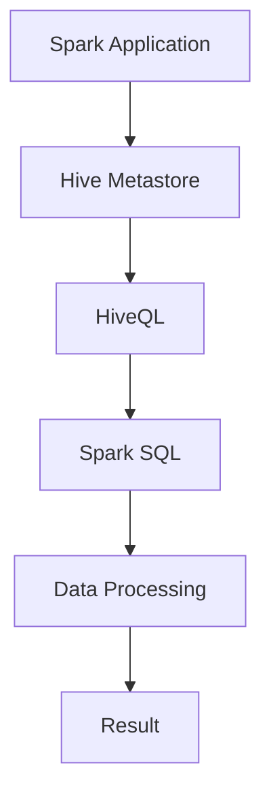

                 

关键词：Spark, Hive, 数据处理，分布式计算，集成，性能优化，大数据平台，技术博客

> 摘要：本文将深入探讨Spark与Hive的整合原理，通过具体的代码实例，详细介绍它们在分布式数据处理中的应用，分析整合过程中的性能优化方法，并展望其未来发展趋势。

## 1. 背景介绍

随着大数据时代的到来，分布式数据处理技术得到了广泛的应用和快速发展。Apache Spark 和 Apache Hive 是两大分布式数据处理框架，它们各自具有独特的优势和用途，但如何将两者有效整合，发挥最大性能，是数据工程师面临的一大挑战。

Apache Spark 是一个开源的分布式计算系统，提供了高效、易用的数据分析和处理能力，支持内存计算和磁盘计算，适用于实时数据处理、机器学习、交互式查询等场景。

Apache Hive 是基于Hadoop的一个数据仓库工具，可以将结构化数据映射为表，并提供SQL查询接口，适用于数据汇总、报告生成、数据分析等场景。

## 2. 核心概念与联系

### 2.1 Spark与Hive的核心概念

- **Spark**：Spark 是一个基于内存的分布式数据处理引擎，具有高效、灵活、易于使用等特点。其主要组件包括：Spark Core、Spark SQL、Spark Streaming、MLlib、GraphX。
  - **Spark Core**：提供内存抽象和任务调度功能，是Spark运行的基础。
  - **Spark SQL**：提供类似SQL的查询接口，支持结构化数据存储和查询。
  - **Spark Streaming**：提供实时数据处理能力，支持高吞吐量的实时流处理。
  - **MLlib**：提供机器学习算法和工具，支持基于数据的机器学习应用。
  - **GraphX**：提供图处理算法和工具，支持大规模图计算。

- **Hive**：Hive 是一个基于Hadoop的分布式数据仓库，提供SQL查询接口，支持大规模数据的存储和查询。其主要组件包括：HiveQL（查询语言）、HiveServer2（服务器组件）、Hive Metastore（元数据存储）。

### 2.2 Spark与Hive的整合原理

Spark 和 Hive 可以通过两种方式进行整合：

- **通过Hive SQL直接访问Hive表**：Spark SQL 可以直接访问Hive表，进行数据查询和处理。这种方法简单易用，但性能可能受到Hive SQL查询引擎的限制。

- **通过Hive on Spark**：Hive on Spark 允许将Hive作业提交给Spark执行，充分利用Spark的高性能分布式计算能力。这种方法可以显著提升查询性能，但需要额外的配置和管理。

### 2.3 Mermaid流程图

以下是一个简化的Spark与Hive整合的Mermaid流程图：



## 3. 核心算法原理 & 具体操作步骤

### 3.1 算法原理概述

Spark和Hive整合的核心算法原理是分布式数据处理。通过将数据分布在多个节点上，并利用并行计算技术，可以提高数据处理的速度和效率。

### 3.2 算法步骤详解

1. **数据读取**：从Hive表中读取数据，将其转换为Spark DataFrame。

2. **数据处理**：使用Spark SQL对DataFrame进行查询、转换等操作。

3. **数据写入**：将处理后的数据写入Hive表或其他存储系统。

### 3.3 算法优缺点

- **优点**：
  - 高性能：利用Spark的高性能分布式计算能力，可以显著提升数据处理速度。
  - 易用性：通过Spark SQL，可以像使用普通SQL一样进行复杂的数据查询和处理。

- **缺点**：
  - 复杂性：整合Spark和Hive需要一定的技术背景和配置管理能力。
  - 性能瓶颈：在某些情况下，Hive SQL查询引擎可能成为性能瓶颈。

### 3.4 算法应用领域

Spark与Hive的整合广泛应用于大数据处理、实时数据流处理、机器学习等领域。例如，在电商行业，可以用于用户行为分析、推荐系统等场景；在金融行业，可以用于交易数据分析、风险控制等场景。

## 4. 数学模型和公式 & 详细讲解 & 举例说明

### 4.1 数学模型构建

在分布式数据处理中，常用的数学模型是MapReduce模型。MapReduce 模型由两个操作组成：Map（映射）和 Reduce（归约）。其基本思想是将大规模数据集拆分成多个小块，并行处理，然后将结果合并。

### 4.2 公式推导过程

MapReduce 模型的公式推导如下：

1. **Map 阶段**：

   对于每个输入数据项 $x$，执行映射操作 $f(x)$，生成一个中间键值对 $(k_1, v_1)$。

2. **Shuffle 阶段**：

   根据中间键值对的键 $k_1$，将它们分发给不同的 Reduce 任务。

3. **Reduce 阶段**：

   对于相同键的中间值 $v_1$，执行归约操作 $g(v_1)$，生成最终的输出键值对 $(k_2, v_2)$。

### 4.3 案例分析与讲解

假设有一个数据集 {1, 2, 3, 4, 5}，需要计算每个数的平方和。

1. **Map 阶段**：

   输入数据项：1, 2, 3, 4, 5
   
   映射操作：$f(x) = x^2$

   输出中间键值对：(1, 1), (2, 4), (3, 9), (4, 16), (5, 25)

2. **Shuffle 阶段**：

   根据键进行分发，每个 Reduce 任务处理一组键值对。

3. **Reduce 阶段**：

   输入中间键值对：(1, 1), (2, 4), (3, 9), (4, 16), (5, 25)

   归约操作：$g(v_1) = \sum v_1$

   输出最终结果：(1, 55)

## 5. 项目实践：代码实例和详细解释说明

### 5.1 开发环境搭建

1. **安装Hadoop和Spark**：在服务器上安装Hadoop和Spark，并配置Hadoop和Spark的环境变量。

2. **启动Hadoop和Spark**：启动Hadoop的NameNode、DataNode和Spark的Master、Worker。

3. **配置Hive**：将Hive的依赖添加到Spark的classpath中，并配置Hive的元数据存储。

### 5.2 源代码详细实现

以下是一个简单的Spark与Hive整合的示例代码：

```python
from pyspark.sql import SparkSession

# 创建Spark会话
spark = SparkSession.builder \
    .appName("SparkHiveIntegration") \
    .getOrCreate()

# 读取Hive表
df = spark.read.table("example_table")

# 对DataFrame进行操作
df = df.select("col1", "col2").where(df["col1"] > 10)

# 将DataFrame写入Hive表
df.write.mode("overwrite").saveAsTable("new_table")

# 关闭Spark会话
spark.stop()
```

### 5.3 代码解读与分析

- **SparkSession**：创建Spark会话，用于执行Spark操作。
- **read.table**：读取Hive表，将其转换为DataFrame。
- **select**：选择需要的列，并对数据进行过滤。
- **write.saveAsTable**：将DataFrame写入Hive表。

### 5.4 运行结果展示

在运行示例代码后，Hive中的`new_table`将包含满足条件的`col1`和`col2`列的数据。

## 6. 实际应用场景

### 6.1 电商用户行为分析

在电商行业，Spark与Hive整合可以用于用户行为分析。例如，通过分析用户浏览、购买等行为数据，可以识别潜在客户、优化推荐系统等。

### 6.2 金融交易数据分析

在金融行业，Spark与Hive整合可以用于交易数据分析。例如，通过分析交易数据，可以识别异常交易、监控风险等。

### 6.3 医疗数据分析

在医疗行业，Spark与Hive整合可以用于医疗数据分析。例如，通过分析患者数据，可以识别疾病风险、优化治疗方案等。

## 7. 工具和资源推荐

### 7.1 学习资源推荐

- 《Spark: The Definitive Guide》
- 《Hadoop: The Definitive Guide》
- 《Big Data Processing with Spark》

### 7.2 开发工具推荐

- IntelliJ IDEA
- PyCharm

### 7.3 相关论文推荐

- "A Survey of Apache Spark: Architecture and Use Cases"
- "Hive on Spark: Performance Analysis and Optimization"
- "Integrating Apache Spark and Apache Hive for Big Data Analytics"

## 8. 总结：未来发展趋势与挑战

### 8.1 研究成果总结

- Spark和Hive的整合技术取得了显著进展，提供了高效、灵活的分布式数据处理能力。
- 多种整合方法（如Hive on Spark、Spark SQL on Hive）被广泛应用，满足了不同场景的需求。

### 8.2 未来发展趋势

- Spark和Hive将继续优化和扩展，提高性能和易用性。
- 新的整合方法和技术（如Spark 3.0的动态查询优化、Hive 3.0的存储引擎优化）将进一步提高性能。
- 更多行业将采用Spark和Hive整合技术，推动大数据处理技术的发展。

### 8.3 面临的挑战

- 性能优化：如何在更复杂的场景下进一步提高性能，仍是一个挑战。
- 易用性：如何降低整合难度，使更多开发者能够快速上手，也是一个挑战。
- 数据安全：在分布式数据处理过程中，如何保障数据安全和隐私，也是一个重要挑战。

### 8.4 研究展望

- Spark和Hive将继续发展，推动大数据处理技术的进步。
- 新的分布式数据处理框架和技术将不断涌现，为大数据处理提供更多可能性。
- 数据处理领域将更加关注实时性、安全性和易用性，以满足不同场景的需求。

## 9. 附录：常见问题与解答

### 9.1 Spark与Hive整合的优势是什么？

Spark与Hive整合的优势包括：

- 高性能：利用Spark的高性能分布式计算能力，提高数据处理速度。
- 易用性：通过Spark SQL，可以像使用普通SQL一样进行复杂的数据查询和处理。
- 灵活性：可以根据需求选择不同的整合方法，满足不同场景的需求。

### 9.2 如何优化Spark与Hive整合的性能？

优化Spark与Hive整合性能的方法包括：

- 选择合适的整合方法：根据场景选择最适合的整合方法（如Hive on Spark、Spark SQL on Hive）。
- 数据预处理：对数据集进行预处理，减少数据传输和计算负担。
- 索引和分区：使用合适的索引和分区策略，提高查询性能。
- 资源调度：合理配置计算资源，提高资源利用率。

### 9.3 Spark与Hive整合的适用场景有哪些？

Spark与Hive整合适用于以下场景：

- 大规模数据处理：如电商用户行为分析、金融交易数据分析等。
- 实时数据处理：如实时流处理、交互式查询等。
- 数据仓库：如数据汇总、报告生成、数据分析等。

本文由禅与计算机程序设计艺术 / Zen and the Art of Computer Programming 撰写。如果您有任何疑问或建议，欢迎在评论区留言。感谢您的阅读！
----------------------------------------------------------------

### 结语 Conclusion

通过本文，我们深入探讨了Spark与Hive的整合原理，介绍了它们在分布式数据处理中的应用。我们还通过具体的代码实例，详细讲解了整合过程中的关键步骤和性能优化方法。希望本文能帮助您更好地理解和掌握Spark与Hive整合技术，为您的数据处理项目带来更多价值。

在未来的大数据处理领域，Spark与Hive的整合将继续发挥重要作用。随着技术的不断进步，我们有望看到更多高效、灵活的整合方法和应用场景的出现。同时，我们也面临着性能优化、易用性和数据安全等挑战，这需要我们持续关注和研究。

如果您对Spark与Hive整合有任何疑问或见解，欢迎在评论区留言，与广大读者一起交流讨论。感谢您的关注和支持！禅与计算机程序设计艺术 / Zen and the Art of Computer Programming 再次感谢您的阅读。期待与您在未来的技术交流中再次相遇！

