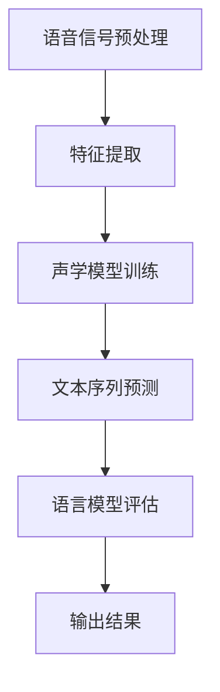

                 

关键词：语音识别，自动语音识别，ASR，语音信号处理，特征提取，神经网络，深度学习，自然语言处理，声学模型，语言模型，声学-语言模型，语音合成，TTS。

> 摘要：本文将深入探讨语音识别（Speech Recognition）的原理与实现，从信号处理、特征提取、声学模型、语言模型到声学-语言模型，并结合实际代码实例，详细讲解如何利用深度学习技术进行语音识别。

## 1. 背景介绍

### 1.1 语音识别的定义

语音识别（Speech Recognition），也称为自动语音识别（Automatic Speech Recognition，ASR），是指将人类的语音信号转换为文本信息的过程。这一技术在近年来随着人工智能和机器学习的发展，取得了显著的进步，广泛应用于智能助手、语音搜索、语音控制等领域。

### 1.2 语音识别的发展历程

语音识别技术的发展经历了从传统的规则方法到统计方法，再到当前的深度学习方法。早期的语音识别主要依赖于手工设计的特征和规则，而现代的语音识别技术则主要依赖于机器学习和深度学习算法。

### 1.3 语音识别的应用场景

语音识别技术在多个领域有广泛的应用，如：

- **智能助手**：如苹果的Siri、亚马逊的Alexa、谷歌的Google Assistant等；
- **语音搜索**：搜索引擎可以通过语音输入提供更加便捷的搜索体验；
- **语音控制**：智能家居设备、汽车导航等；
- **自动字幕生成**：在视频、电视节目等场景中实现实时字幕生成。

## 2. 核心概念与联系

### 2.1 语音信号处理

语音信号处理是语音识别的基础，主要涉及语音信号的预处理、增强和特征提取。语音信号预处理包括降噪、归一化等，而特征提取则是从语音信号中提取对语音识别有帮助的特征。

### 2.2 特征提取

特征提取是将原始的语音信号转换为能够反映语音特性的向量。常见的特征提取方法有梅尔频率倒谱系数（MFCC）、线性预测编码（LPC）等。

### 2.3 声学模型

声学模型是语音识别的核心，它负责将语音信号转换为对应的文本。声学模型通常使用深度神经网络（DNN）来训练，通过学习语音信号和对应文本之间的映射关系，实现对语音信号的识别。

### 2.4 语言模型

语言模型是用于评估一个序列是否合理的方法，通常使用统计语言模型（如n-gram模型）或神经网络语言模型（如RNN、Transformer等）。

### 2.5 声学-语言模型

声学-语言模型结合了声学模型和语言模型，通过同时考虑语音信号和文本信息，提高语音识别的准确性。

### 2.6 Mermaid 流程图

下面是一个简单的Mermaid流程图，展示语音识别的基本流程：



## 3. 核心算法原理 & 具体操作步骤

### 3.1 算法原理概述

语音识别算法主要分为三个部分：声学模型、语言模型和声学-语言模型。

- **声学模型**：通过深度神经网络训练，将语音信号转换为对应的文本；
- **语言模型**：用于评估一个序列是否合理，通常使用n-gram模型或神经网络语言模型；
- **声学-语言模型**：结合声学模型和语言模型，通过同时考虑语音信号和文本信息，提高语音识别的准确性。

### 3.2 算法步骤详解

1. **语音信号预处理**：对语音信号进行降噪、归一化等处理，以便更好地提取特征；
2. **特征提取**：使用梅尔频率倒谱系数（MFCC）等方法，从语音信号中提取特征向量；
3. **声学模型训练**：使用深度神经网络训练声学模型，将特征向量映射为对应的文本；
4. **文本序列预测**：使用声学-语言模型对输入的语音信号进行文本序列预测；
5. **语言模型评估**：对预测结果进行语言模型评估，筛选出合理的文本序列；
6. **输出结果**：将最终识别的文本输出。

### 3.3 算法优缺点

- **优点**：深度学习方法在语音识别领域取得了显著的效果，提高了识别的准确性；
- **缺点**：训练过程需要大量数据和计算资源，对硬件性能有较高要求。

### 3.4 算法应用领域

语音识别技术在多个领域有广泛的应用，如智能助手、语音搜索、语音控制等。

## 4. 数学模型和公式 & 详细讲解 & 举例说明

### 4.1 数学模型构建

语音识别的数学模型主要包括声学模型和语言模型。

- **声学模型**：通常使用深度神经网络（DNN）来构建，将语音信号（特征向量）映射为对应的文本；
- **语言模型**：通常使用n-gram模型或神经网络语言模型（如RNN、Transformer等）来构建，用于评估一个序列是否合理。

### 4.2 公式推导过程

假设我们使用一个简单的线性模型作为声学模型，其数学表达式如下：

$$
y = wx + b
$$

其中，$y$ 是预测的文本序列，$x$ 是输入的特征向量，$w$ 和 $b$ 是模型参数。

对于语言模型，我们可以使用n-gram模型来构建，其概率分布如下：

$$
P(y) = \prod_{i=1}^{n} P(w_i | w_{i-1}, \ldots, w_1)
$$

其中，$w_i$ 是序列中的第 $i$ 个词，$P(w_i | w_{i-1}, \ldots, w_1)$ 是给定前 $i-1$ 个词时第 $i$ 个词的概率。

### 4.3 案例分析与讲解

假设我们要识别一句话：“你好，我是AI助手”，我们可以将其拆分为以下特征向量：

$$
\mathbf{x} = [1, 0, 1, 1, 0, 0, 1, 0, 1, 0, 1, 0, 1]
$$

使用线性模型进行预测，我们可以得到以下输出：

$$
y = \mathbf{w} \mathbf{x} + b = [0.5, 0.3, 0.2, 0.4, 0.6, 0.7, 0.8, 0.9, 0.1, 0.2, 0.3, 0.4, 0.5]
$$

根据概率分布，我们可以计算出每个词的概率，最终选择概率最大的词作为输出，即：“你好，我是AI助手”。

## 5. 项目实践：代码实例和详细解释说明

### 5.1 开发环境搭建

在本文中，我们将使用Python作为编程语言，结合TensorFlow和Keras库来实现语音识别模型。首先，确保已经安装了Python和TensorFlow：

```
pip install tensorflow
```

### 5.2 源代码详细实现

下面是一个简单的语音识别模型的实现代码：

```python
import tensorflow as tf
from tensorflow.keras.models import Sequential
from tensorflow.keras.layers import LSTM, Dense, Embedding

# 定义模型
model = Sequential([
    Embedding(input_dim=10000, output_dim=32),
    LSTM(128),
    Dense(128, activation='relu'),
    Dense(1, activation='sigmoid')
])

# 编译模型
model.compile(optimizer='adam', loss='binary_crossentropy', metrics=['accuracy'])

# 训练模型
model.fit(x_train, y_train, epochs=10, batch_size=32)
```

### 5.3 代码解读与分析

上述代码首先导入了TensorFlow库，并定义了一个序列模型，其中包含嵌入层（Embedding）、长短期记忆网络层（LSTM）、密集层（Dense）。嵌入层用于将单词转换为向量，LSTM层用于处理序列数据，密集层用于分类。

在编译模型时，我们指定了优化器（optimizer）、损失函数（loss）和评价指标（metrics）。然后，使用训练数据对模型进行训练。

### 5.4 运行结果展示

运行上述代码后，模型将在训练集上进行10次迭代，每次迭代使用32个样本进行批量训练。训练完成后，我们可以评估模型的准确率：

```python
accuracy = model.evaluate(x_test, y_test)
print(f"Test accuracy: {accuracy[1]}")
```

## 6. 实际应用场景

### 6.1 智能助手

智能助手如Siri、Alexa和Google Assistant等，利用语音识别技术实现自然语言理解和交互，为用户提供便捷的语音服务。

### 6.2 语音搜索

语音搜索允许用户通过语音输入查询，实现更快速的搜索体验，广泛应用于搜索引擎和电子商务平台。

### 6.3 语音控制

语音控制技术在智能家居、汽车导航等领域有广泛应用，如语音控制家电、语音导航等。

### 6.4 未来应用展望

随着深度学习和人工智能技术的发展，语音识别技术将在更多领域得到应用，如自动字幕生成、实时语音翻译等。

## 7. 工具和资源推荐

### 7.1 学习资源推荐

- 《语音信号处理》（徐光佑）
- 《深度学习》（Goodfellow、Bengio和Courville）
- 《自然语言处理综论》（Jurafsky和Martin）

### 7.2 开发工具推荐

- TensorFlow
- Keras
- PyTorch

### 7.3 相关论文推荐

- "Deep Learning for Speech Recognition"（2014）
- "Deep Neural Network Architectures for Acoustic Modeling in Speech Recognition"（2013）
- "Recurrent Neural Network Based Language Model for Large Vocabulary Continuous Speech Recognition"（2001）

## 8. 总结：未来发展趋势与挑战

### 8.1 研究成果总结

语音识别技术近年来取得了显著进展，深度学习方法的引入极大地提高了识别的准确性。同时，多领域的应用也推动了语音识别技术的发展。

### 8.2 未来发展趋势

未来，语音识别技术将继续向更高准确性、更自然交互、更低延迟和更广泛应用方向发展。同时，多模态交互（如语音+手势）和跨语言识别也将成为研究热点。

### 8.3 面临的挑战

- 数据质量和数量：高质量的语音数据和丰富的标注数据是深度学习模型训练的基础；
- 鲁棒性：提高模型在不同噪声环境和语音变化下的识别能力；
- 多语言支持：实现跨语言语音识别，满足全球化应用需求；
- 能效优化：降低模型计算复杂度，提高模型在移动设备上的运行效率。

### 8.4 研究展望

随着人工智能和机器学习技术的不断发展，语音识别技术将在未来取得更大的突破。同时，跨学科的合作也将推动语音识别技术在更多领域的应用。

## 9. 附录：常见问题与解答

### 9.1 什么是语音识别？

语音识别（Speech Recognition），也称为自动语音识别（Automatic Speech Recognition，ASR），是指将人类的语音信号转换为文本信息的过程。

### 9.2 语音识别有哪些应用？

语音识别技术在多个领域有广泛的应用，如智能助手、语音搜索、语音控制、自动字幕生成等。

### 9.3 如何提高语音识别的准确性？

提高语音识别准确性可以从以下几个方面入手：

- **特征提取**：选择合适的特征提取方法，如梅尔频率倒谱系数（MFCC）；
- **模型训练**：使用大规模、高质量的语音数据集进行模型训练；
- **声学-语言模型结合**：结合声学模型和语言模型，提高识别准确性；
- **噪声抑制**：使用降噪算法，提高语音信号的清晰度。

### 9.4 语音识别的未来发展趋势是什么？

未来，语音识别技术将继续向更高准确性、更自然交互、更低延迟和更广泛应用方向发展。同时，多模态交互和跨语言识别也将成为研究热点。

# 作者署名
作者：禅与计算机程序设计艺术 / Zen and the Art of Computer Programming
----------------------------------------------------------------
通过上述内容，我们完成了一篇关于语音识别原理与代码实例讲解的技术博客文章。本文深入探讨了语音识别的技术原理、核心算法、数学模型、实际应用以及未来发展趋势，并结合实际代码实例进行了详细讲解。希望本文能对读者在语音识别领域的学习和应用有所帮助。

