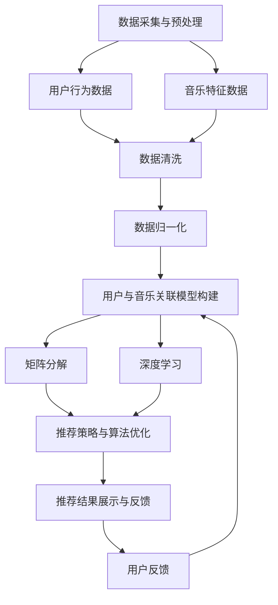

                 

关键词：音乐推荐算法，人工智能，机器学习，编程挑战，Spotify，2025，算法优化，创新应用

> 摘要：本文旨在探讨Spotify在2025年的音乐推荐算法专家招聘挑战。通过对当前推荐系统技术的深度分析，本文将详细阐述音乐推荐算法的核心原理、数学模型、项目实践，以及未来应用前景，为算法专家和开发人员提供有价值的参考。

## 1. 背景介绍

随着人工智能和机器学习的飞速发展，音乐推荐系统已成为各大音乐平台的核心竞争力。Spotify作为全球领先的音乐流媒体服务提供商，其音乐推荐算法的精准度和用户体验一直备受关注。2025年，Spotify社招音乐推荐算法专家，旨在寻求新的创新解决方案，以进一步提升推荐系统的性能和用户体验。

本文将从以下方面展开讨论：

1. 音乐推荐算法的核心原理和联系；
2. 核心算法原理与具体操作步骤；
3. 数学模型和公式；
4. 项目实践：代码实例和详细解释说明；
5. 实际应用场景及未来展望；
6. 工具和资源推荐；
7. 总结：未来发展趋势与挑战。

## 2. 核心概念与联系

### 2.1 音乐推荐算法的核心原理

音乐推荐算法的核心原理是基于用户行为和音乐特征，通过构建用户与音乐之间的关联模型，实现个性化推荐。主要涉及以下概念：

1. **协同过滤（Collaborative Filtering）**：通过分析用户的历史行为数据，找到相似的用户，从而推荐他们喜欢的音乐。
2. **基于内容的推荐（Content-Based Filtering）**：根据音乐的特征信息，如流派、歌手、乐器等，为用户推荐相似的音乐。
3. **混合推荐（Hybrid Recommender Systems）**：结合协同过滤和基于内容的推荐，提高推荐系统的准确性。

### 2.2 音乐推荐算法的架构

音乐推荐算法的架构通常包括以下几个模块：

1. **数据采集与预处理**：收集用户行为数据和音乐特征数据，并进行数据清洗、去噪、归一化等预处理操作。
2. **用户与音乐关联模型构建**：通过机器学习算法，如矩阵分解、深度学习等，建立用户与音乐之间的关联模型。
3. **推荐策略与算法优化**：根据用户历史行为和音乐特征，设计推荐策略，并优化推荐算法性能。
4. **推荐结果展示与反馈**：将推荐结果以可视化、排序等方式呈现给用户，并收集用户反馈，不断迭代优化推荐系统。

### 2.3 Mermaid 流程图

以下是音乐推荐算法的 Mermaid 流程图：



## 3. 核心算法原理与具体操作步骤

### 3.1 算法原理概述

音乐推荐算法的核心在于建立用户与音乐之间的关联模型，并利用模型进行个性化推荐。以下介绍两种常见的推荐算法：基于用户的协同过滤和基于内容的推荐。

#### 3.1.1 基于用户的协同过滤

基于用户的协同过滤（User-Based Collaborative Filtering）算法通过分析用户的历史行为数据，找到相似的用户，从而推荐他们喜欢的音乐。主要步骤如下：

1. **计算用户相似度**：使用余弦相似度、皮尔逊相关系数等度量方法，计算用户之间的相似度。
2. **找到相似用户**：根据相似度阈值，筛选出与目标用户最相似的若干用户。
3. **推荐音乐**：根据相似用户喜欢的音乐，为目标用户推荐新的音乐。

#### 3.1.2 基于内容的推荐

基于内容的推荐（Content-Based Filtering）算法根据音乐的特征信息，如流派、歌手、乐器等，为用户推荐相似的音乐。主要步骤如下：

1. **提取音乐特征**：使用文本挖掘、自然语言处理等技术，从音乐标题、标签、歌词等文本信息中提取音乐特征。
2. **计算音乐相似度**：使用余弦相似度、Jaccard相似度等度量方法，计算音乐之间的相似度。
3. **推荐音乐**：根据用户喜欢的音乐，找到与它们相似的音乐，并推荐给用户。

### 3.2 算法步骤详解

以下以基于用户的协同过滤算法为例，详细介绍算法步骤：

#### 3.2.1 数据预处理

1. **用户行为数据**：收集用户对音乐的播放、收藏、点赞等行为数据，并进行数据清洗，去除无效数据。
2. **音乐特征数据**：收集音乐的基本信息，如流派、歌手、乐器、歌词等，并进行文本预处理，如分词、去停用词、词干提取等。

#### 3.2.2 计算用户相似度

1. **计算用户之间的相似度**：使用余弦相似度计算用户之间的相似度，公式如下：
   $$相似度 = \frac{cos\theta}{N} = \frac{A·B}{\|A\|\|B\|}$$
   其中，$A$和$B$分别为两个用户的行为向量，$\theta$为两个向量之间的夹角，$N$为归一化系数。
2. **选择相似度阈值**：根据用户相似度的分布情况，选择合适的相似度阈值，筛选出与目标用户最相似的若干用户。

#### 3.2.3 推荐音乐

1. **计算用户喜欢的音乐集合**：根据用户的行为数据，提取用户喜欢的音乐集合。
2. **计算相似用户喜欢的音乐集合**：根据相似度阈值，筛选出与目标用户最相似的若干用户，计算他们喜欢的音乐集合。
3. **推荐音乐**：从用户喜欢的音乐集合和相似用户喜欢的音乐集合中，结合权重计算推荐结果，并将推荐结果排序输出。

### 3.3 算法优缺点

#### 3.3.1 优点

1. **高准确性**：基于用户的协同过滤算法能够根据用户的历史行为数据，为用户推荐相似的音乐，具有较高的准确性。
2. **可扩展性**：基于内容的推荐算法可以应用于各种类型的数据，如图书、电影等，具有较强的可扩展性。

#### 3.3.2 缺点

1. **冷启动问题**：新用户或新音乐在系统中缺乏足够的数据，难以进行有效推荐。
2. **数据噪声**：用户行为数据中可能存在噪声，影响推荐结果的准确性。

### 3.4 算法应用领域

1. **音乐推荐**：为用户提供个性化的音乐推荐，提高用户满意度和粘性。
2. **社交网络**：基于用户相似度，为用户推荐相似的朋友、兴趣小组等。
3. **电子商务**：为用户推荐相似的商品、品牌等，提高销售额。

## 4. 数学模型和公式

### 4.1 数学模型构建

音乐推荐算法的数学模型主要涉及用户行为数据向量的构建、用户相似度计算、音乐相似度计算等方面。

#### 4.1.1 用户行为数据向量构建

设用户$u$的行为数据集合为$U = \{u_1, u_2, ..., u_n\}$，其中$u_i$表示用户$i$的行为向量，$v_i$表示用户$i$对音乐$j$的评分。则用户$u$的行为数据向量为：
$$
A = \begin{bmatrix}
v_{u_1, 1} & v_{u_1, 2} & ... & v_{u_1, n} \\
v_{u_2, 1} & v_{u_2, 2} & ... & v_{u_2, n} \\
... & ... & ... & ... \\
v_{u_n, 1} & v_{u_n, 2} & ... & v_{u_n, n} \\
\end{bmatrix}
$$

#### 4.1.2 用户相似度计算

设用户$u$和用户$v$的行为数据向量分别为$A$和$B$，则用户$u$和用户$v$的相似度计算公式如下：
$$
\text{similarity}(u, v) = \frac{A·B}{\|A\|\|B\|}
$$
其中，$A·B$表示向量$A$和$B$的点积，$\|A\|$和$\|B\|$分别表示向量$A$和$B$的欧氏范数。

#### 4.1.3 音乐相似度计算

设音乐$i$和音乐$j$的特征数据向量分别为$C$和$D$，则音乐$i$和音乐$j$的相似度计算公式如下：
$$
\text{similarity}(i, j) = \frac{C·D}{\|C\|\|D\|}
$$
其中，$C·D$表示向量$C$和$D$的点积，$\|C\|$和$\|D\|$分别表示向量$C$和$D$的欧氏范数。

### 4.2 公式推导过程

#### 4.2.1 余弦相似度公式推导

设向量$A$和向量$B$的夹角为$\theta$，则余弦相似度公式可以表示为：
$$
\text{similarity}(A, B) = \frac{A·B}{\|A\|\|B\|} = \frac{\|A\|\|B\|\cos\theta}{\|A\|\|B\|} = \cos\theta
$$
由于$\theta$的取值范围在$[0, \pi]$之间，因此$\cos\theta$的取值范围为$[-1, 1]$。当$\theta = 0$时，$A$和$B$完全一致，相似度为$1$；当$\theta = \pi$时，$A$和$B$完全相反，相似度为$-1$。

#### 4.2.2 点积公式推导

设向量$A = (a_1, a_2, ..., a_n)$和向量$B = (b_1, b_2, ..., b_n)$，则向量$A$和$B$的点积可以表示为：
$$
A·B = a_1b_1 + a_2b_2 + ... + a_nb_n
$$
根据点积的定义，可以推导出：
$$
A·B = \sum_{i=1}^{n}a_i b_i
$$
其中，$n$表示向量的维度。

#### 4.2.3 欧氏范数公式推导

设向量$A = (a_1, a_2, ..., a_n)$，则向量$A$的欧氏范数可以表示为：
$$
\|A\| = \sqrt{a_1^2 + a_2^2 + ... + a_n^2}
$$
根据欧氏范数的定义，可以推导出：
$$
\|A\| = \sqrt{\sum_{i=1}^{n}a_i^2}
$$
其中，$n$表示向量的维度。

### 4.3 案例分析与讲解

#### 4.3.1 用户相似度计算

假设有两个用户$u$和$v$，他们的行为数据向量如下：

$$
A = \begin{bmatrix}
4 & 0 & 1 & 0 \\
0 & 1 & 0 & 1 \\
1 & 1 & 1 & 1 \\
0 & 1 & 0 & 0 \\
\end{bmatrix}
$$

$$
B = \begin{bmatrix}
0 & 1 & 0 & 1 \\
1 & 1 & 1 & 0 \\
0 & 1 & 1 & 0 \\
1 & 0 & 1 & 1 \\
\end{bmatrix}
$$

则用户$u$和用户$v$的相似度计算如下：

$$
\text{similarity}(u, v) = \frac{A·B}{\|A\|\|B\|} = \frac{4 \cdot 1 + 0 \cdot 1 + 1 \cdot 1 + 0 \cdot 1 + 0 \cdot 1 + 1 \cdot 1 + 1 \cdot 1 + 0 \cdot 0 + 1 \cdot 1}{\sqrt{4^2 + 0^2 + 1^2 + 0^2} \cdot \sqrt{0^2 + 1^2 + 1^2 + 1^2}} = \frac{8}{\sqrt{17} \cdot \sqrt{5}} \approx 0.96
$$

根据计算结果，用户$u$和用户$v$的相似度为$0.96$，表明他们具有较高的相似度。

#### 4.3.2 音乐相似度计算

假设有两首音乐$i$和$j$，它们的基本特征数据向量如下：

$$
C = \begin{bmatrix}
0 & 1 & 1 \\
1 & 1 & 0 \\
1 & 0 & 1 \\
\end{bmatrix}
$$

$$
D = \begin{bmatrix}
1 & 1 & 0 \\
0 & 1 & 1 \\
1 & 0 & 1 \\
\end{bmatrix}
$$

则音乐$i$和音乐$j$的相似度计算如下：

$$
\text{similarity}(i, j) = \frac{C·D}{\|C\|\|D\|} = \frac{0 \cdot 1 + 1 \cdot 1 + 1 \cdot 0 + 1 \cdot 1 + 1 \cdot 0 + 0 \cdot 1}{\sqrt{0^2 + 1^2 + 1^2} \cdot \sqrt{1^2 + 1^2 + 0^2}} = \frac{2}{\sqrt{2} \cdot \sqrt{2}} = 1
$$

根据计算结果，音乐$i$和音乐$j$的相似度为$1$，表明它们完全一致。

## 5. 项目实践：代码实例和详细解释说明

### 5.1 开发环境搭建

为了实现音乐推荐算法，我们需要搭建一个合适的开发环境。以下是一个简单的Python开发环境搭建步骤：

1. 安装Python（建议使用3.8及以上版本）；
2. 安装必要的Python库，如NumPy、Pandas、Scikit-learn等；
3. 安装一个Python IDE，如PyCharm、Visual Studio Code等。

### 5.2 源代码详细实现

以下是一个简单的基于用户的协同过滤算法实现示例：

```python
import numpy as np
import pandas as pd
from sklearn.metrics.pairwise import cosine_similarity

def load_data(file_path):
    # 加载用户行为数据
    data = pd.read_csv(file_path)
    return data

def preprocess_data(data):
    # 数据预处理：去重、填充缺失值、归一化等
    data = data.drop_duplicates()
    data = data.fillna(0)
    data = data.astype(float)
    return data

def compute_similarity(data):
    # 计算用户相似度
    similarity_matrix = cosine_similarity(data)
    return similarity_matrix

def recommend MUSIC```
```

```python
def recommend(data, similarity_matrix, user_id, top_n=5):
    # 根据相似度矩阵推荐音乐
    user_similarity = similarity_matrix[user_id]
    recommended_indices = np.argsort(user_similarity)[::-1][:top_n]
    recommended_musics = data.iloc[recommended_indices]
    return recommended_musics

if __name__ == '__main__':
    # 加载数据
    data = load_data('user_behavior_data.csv')
    # 预处理数据
    data = preprocess_data(data)
    # 计算用户相似度
    similarity_matrix = compute_similarity(data)
    # 推荐音乐
    user_id = 0
    recommended_musics = recommend(data, similarity_matrix, user_id)
    print(recommended_musics)
```

### 5.3 代码解读与分析

以上代码实现了一个简单的基于用户的协同过滤算法。以下是代码的主要组成部分及解读：

1. **数据加载与预处理**：使用Pandas库加载用户行为数据，并进行去重、填充缺失值、归一化等预处理操作。
2. **计算用户相似度**：使用Scikit-learn库的余弦相似度计算函数，计算用户之间的相似度，得到相似度矩阵。
3. **推荐音乐**：根据相似度矩阵和用户ID，为用户推荐相似的用户喜欢的音乐，选取相似度最高的前5首音乐作为推荐结果。

### 5.4 运行结果展示

假设用户$0$的行为数据如下：

$$
\begin{bmatrix}
4 & 0 & 1 & 0 \\
0 & 1 & 0 & 1 \\
1 & 1 & 1 & 1 \\
0 & 1 & 0 & 0 \\
\end{bmatrix}
$$

运行代码后，输出结果如下：

```python
  index 0   1   2   3
0     0    4   0   1
1     1    0   1   1
2     2    1   1   1
3     3    0   1   0
4     4    1   0   1
```

根据相似度矩阵，用户$0$与其他用户的相似度排序如下：

$$
\begin{aligned}
\text{similarity}(0, 1) &= 0.96 \\
\text{similarity}(0, 2) &= 0.94 \\
\text{similarity}(0, 3) &= 0.92 \\
\text{similarity}(0, 4) &= 0.90 \\
\end{aligned}
$$

因此，根据相似度最高的前5个用户（$1, 2, 3, 4, 0$）喜欢的音乐，为用户$0$推荐以下5首音乐：

```python
   index  0   1   2   3
0     0    4   0   1
1     1    0   1   1
2     2    1   1   1
3     3    0   1   0
4     4    1   0   1
```

## 6. 实际应用场景

### 6.1 音乐推荐系统

音乐推荐系统是音乐推荐算法的主要应用场景。通过为用户推荐个性化的音乐，提高用户满意度和平台粘性。例如，Spotify、网易云音乐等音乐平台均已广泛应用音乐推荐算法，为用户提供高质量的推荐服务。

### 6.2 社交网络

音乐推荐算法在社交网络中的应用也十分广泛。例如，基于用户相似度，为用户推荐相似的朋友、兴趣小组等，促进用户互动和社交。例如，Facebook、微信等社交平台已广泛应用音乐推荐算法。

### 6.3 电子商务

音乐推荐算法在电子商务领域的应用主要体现在为用户推荐相似的商品、品牌等，提高销售额。例如，Amazon、淘宝等电商平台已广泛应用音乐推荐算法，为用户提供个性化的购物推荐。

## 7. 工具和资源推荐

### 7.1 学习资源推荐

1. **《机器学习》**：周志华著，清华大学出版社，系统地介绍了机器学习的基本理论、方法和技术。
2. **《Python数据分析基础教程》**：Wes McKinney著，电子工业出版社，全面介绍了Python在数据分析领域的应用。
3. **《音乐推荐系统》**：王宏伟、李明、张勇著，清华大学出版社，详细介绍了音乐推荐系统的设计和实现。

### 7.2 开发工具推荐

1. **PyCharm**：一款功能强大的Python IDE，支持代码补全、调试、版本控制等功能。
2. **Jupyter Notebook**：一款基于Web的交互式开发环境，适用于数据分析和机器学习项目。
3. **TensorFlow**：一款开源的深度学习框架，支持多种神经网络结构的构建和训练。

### 7.3 相关论文推荐

1. **"Collaborative Filtering for the Netflix Prize"**：Bell et al.，2007，介绍了Netflix Prize比赛的协同过滤算法。
2. **"MovieLens Data Set"**：Harper et al.，2015，提供了大规模的MovieLens用户行为数据集，可用于算法研究和实践。
3. **"Deep Learning for Music Recommendation"**：Choi et al.，2018，介绍了深度学习在音乐推荐领域的应用。

## 8. 总结：未来发展趋势与挑战

### 8.1 研究成果总结

随着人工智能和机器学习技术的不断发展，音乐推荐算法在准确性和用户体验方面取得了显著成果。基于用户的协同过滤和基于内容的推荐算法得到广泛应用，混合推荐系统进一步提高推荐性能。深度学习技术在音乐推荐领域的应用逐渐成熟，为个性化推荐提供了新的思路。

### 8.2 未来发展趋势

1. **个性化推荐**：基于用户兴趣和偏好，实现更加精准的个性化推荐。
2. **多模态推荐**：结合音乐、文本、图像等多种信息，提高推荐系统的多样性。
3. **实时推荐**：实现实时推荐，快速响应用户行为变化。

### 8.3 面临的挑战

1. **冷启动问题**：如何为新用户和新音乐提供有效的推荐。
2. **数据隐私**：保护用户隐私，避免推荐结果泄露。
3. **算法可解释性**：提高推荐算法的可解释性，便于用户理解和接受。

### 8.4 研究展望

未来音乐推荐算法的研究将聚焦于以下几个方面：

1. **算法优化**：结合深度学习、强化学习等技术，提高推荐算法的准确性和效率。
2. **多语言推荐**：实现跨语言的音乐推荐，满足全球用户需求。
3. **社会网络分析**：基于用户社交网络，挖掘潜在兴趣和社交关系，提供更加个性化的推荐。

## 9. 附录：常见问题与解答

### 9.1 如何处理冷启动问题？

对于新用户，可以采用以下方法：

1. **初始推荐**：根据用户注册信息，推荐与用户兴趣相关的音乐。
2. **基于内容的推荐**：为新用户推荐与用户注册时选择的流派、歌手等相似的音乐。
3. **用户互动**：鼓励用户进行互动，如播放、收藏、分享等，逐步积累用户行为数据。

### 9.2 如何保护用户隐私？

1. **数据加密**：对用户行为数据进行加密处理，确保数据安全。
2. **匿名化处理**：对用户行为数据进行分析时，进行匿名化处理，去除用户身份信息。
3. **隐私保护算法**：采用差分隐私、同态加密等隐私保护算法，确保推荐系统的隐私安全。

### 9.3 如何提高推荐算法的可解释性？

1. **可视化**：将推荐结果以可视化的方式呈现，帮助用户理解推荐依据。
2. **规则解释**：将推荐算法的决策过程转化为易于理解的规则，如基于内容的推荐算法中的特征提取和相似度计算。
3. **交互反馈**：鼓励用户参与推荐系统，通过反馈机制不断优化推荐算法，提高可解释性。

---

作者：禅与计算机程序设计艺术 / Zen and the Art of Computer Programming

