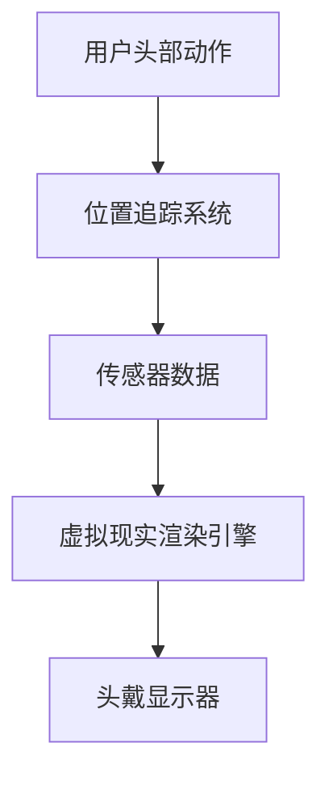
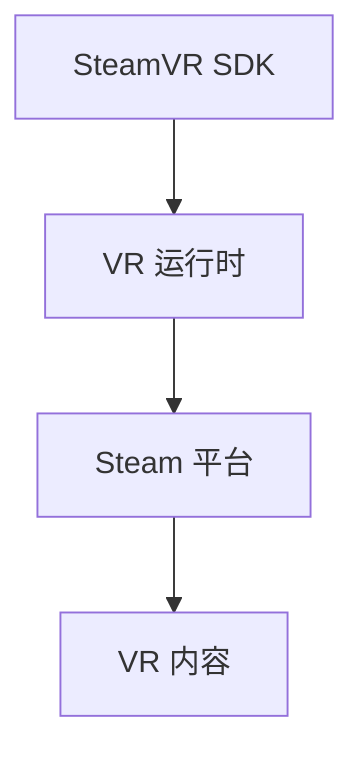

                 

### 关键词 Keywords

- **SteamVR**
- **VR 内容发布**
- **平台集成**
- **开发者工具**
- **虚拟现实技术**
- **Unity**
- **Unreal Engine**
- **Steam 平台**

### 摘要 Abstract

本文将深入探讨如何在 Steam 平台上集成和发布 VR 内容。从背景介绍到核心概念，再到具体的操作步骤，我们将一步步解析 SteamVR 的集成过程，并探讨其背后的数学模型和实际应用场景。此外，我们还将提供详细的代码实例和未来展望，帮助开发者更好地理解和应用这一技术。

## 1. 背景介绍

虚拟现实（VR）技术近年来发展迅猛，为用户提供了一种全新的交互和体验方式。SteamVR 作为 VR 开发的重要平台，提供了强大的开发工具和庞大的用户基础，使得开发者在创建和发布 VR 内容方面拥有了更多的选择和可能性。

### SteamVR 简介

SteamVR 是由 Valve Corporation 开发的一款 VR 运行平台，它支持多个 VR 头戴设备，如 HTC Vive、Oculus Rift 等。SteamVR 不仅提供了丰富的 VR 游戏和应用，还为开发者提供了一个完整的开发环境，包括 VR 开发工具、SDK（软件开发工具包）和详细的开发文档。

### VR 内容发布的重要性

在 Steam 平台上发布 VR 内容具有重要意义。首先，SteamVR 的用户基数庞大，能够为开发者带来更多的曝光和用户流量。其次，SteamVR 提供了完善的生态系统，包括支付系统、评分系统等，为开发者创造了良好的商业环境。此外，SteamVR 还支持跨平台发布，使得开发者能够将 VR 内容推广到更广泛的用户群体。

## 2. 核心概念与联系

### VR 技术基础

虚拟现实技术主要依赖于头戴显示器（HMD）和位置追踪系统。HMD 提供了沉浸式的视觉体验，而位置追踪系统则确保用户在虚拟环境中的动作能够实时反映在屏幕上。以下是一个简单的 Mermaid 流程图，展示了 VR 技术的基本架构：



### SteamVR 架构

SteamVR 的架构同样复杂，它包括以下几个关键部分：

1. **VR 运行时**：负责管理和运行 VR 应用程序，包括窗口管理、输入处理和渲染。
2. **VR SDK**：提供了一套丰富的开发工具和库，使得开发者能够轻松地集成 VR 功能。
3. **Steam 平台**：用于发布、分发和销售 VR 内容。

以下是一个简化的 Mermaid 流程图，展示了 SteamVR 的架构：



### 关联概念

除了上述核心概念，还有一些相关的技术概念需要了解：

- **Unity 和 Unreal Engine**：两款流行的 VR 内容开发引擎，提供了强大的渲染能力和丰富的开发工具。
- **VR 头戴设备**：如 HTC Vive、Oculus Rift 等，它们是 VR 体验的重要组成部分。

## 3. 核心算法原理 & 具体操作步骤

### 3.1 算法原理概述

SteamVR 的核心算法主要涉及位置追踪和渲染。位置追踪算法确保用户在虚拟环境中的动作能够实时更新，而渲染算法则负责生成高质量的视觉体验。

### 3.2 算法步骤详解

1. **初始化**：首先，需要初始化 VR 运行时和 SDK，配置 VR 头戴设备和传感器。
2. **位置追踪**：通过传感器获取用户头部和手部的位置和姿态数据，并实时更新。
3. **渲染**：使用渲染引擎根据用户的位置和姿态生成虚拟场景，并输出到头戴显示器。

### 3.3 算法优缺点

**优点**：

- 高效：算法能够实时处理大量传感器数据，提供流畅的 VR 体验。
- 可扩展：SteamVR SDK 提供了丰富的接口和工具，方便开发者进行扩展和定制。

**缺点**：

- 资源消耗：位置追踪和渲染需要较高的计算资源，对硬件有一定的要求。
- 开发复杂度：集成 VR 功能需要一定的技术积累和开发经验。

### 3.4 算法应用领域

SteamVR 的算法广泛应用于多个领域，包括游戏、教育、医疗等。其中，游戏是最主要的领域，SteamVR 提供了丰富的 VR 游戏和应用，为用户提供沉浸式的娱乐体验。

## 4. 数学模型和公式 & 详细讲解 & 举例说明

### 4.1 数学模型构建

SteamVR 的数学模型主要涉及以下几个方面：

1. **位置追踪**：使用卡尔丹公式（Cardan angles）或四元数（Quaternions）表示用户的位置和姿态。
2. **渲染**：使用透视投影（Perspective Projection）和正交投影（Orthogonal Projection）生成虚拟场景。

### 4.2 公式推导过程

**位置追踪**：

- 卡尔丹公式：$$ T = [T_x, T_y, T_z, T_w] = [cos(\theta/2), sin(\theta/2) * cos(\phi), sin(\theta/2) * cos(\theta) * cos(\phi) - cos(\theta/2) * sin(\phi), -sin(\theta/2) * cos(\theta) * sin(\phi) - cos(\theta/2) * cos(\phi)] $$
- 四元数：$$ T = [t_x, t_y, t_z, t_w] = [sin(\theta/2), cos(\theta/2), 0, 0] $$

**渲染**：

- 透视投影：$$ P = \frac{Z - Z_0}{Z_1 - Z_0} $$
- 正交投影：$$ P = \frac{Z}{Z_0} $$

### 4.3 案例分析与讲解

**案例**：使用四元数进行位置追踪

1. **初始化**：用户初始位置为 $[0, 0, 0, 1]$。
2. **旋转**：用户头部向右旋转 $45$ 度，得到新的位置 $[0.707, 0, 0, 0.707]$。
3. **更新**：将新位置更新到虚拟场景中。

**代码实现**：

```c++
Quaternion rotate(Quaternion q, float angle, Vector3 axis) {
    float half_angle = angle / 2.0;
    float sin_half_angle = sin(half_angle);
    float cos_half_angle = cos(half_angle);
    return Quaternion(
        q.x * cos_half_angle - q.y * sin_half_angle * axis.z + q.z * sin_half_angle * axis.y,
        q.y * cos_half_angle + q.x * sin_half_angle * axis.z - q.z * sin_half_angle * axis.x,
        q.z * cos_half_angle - q.x * sin_half_angle * axis.y + q.y * sin_half_angle * axis.x,
        q.w * cos_half_angle + q.y * sin_half_angle * axis.z + q.z * sin_half_angle * axis.x
    );
}

Quaternion initial_position = Quaternion(0, 0, 0, 1);
Quaternion new_position = rotate(initial_position, 45, Vector3(1, 0, 0));

// 将 new_position 更新到虚拟场景中
```

## 5. 项目实践：代码实例和详细解释说明

### 5.1 开发环境搭建

要开发并发布 VR 内容，首先需要搭建一个合适的开发环境。以下是基本的开发环境搭建步骤：

1. **安装 SteamVR SDK**：从 SteamVR 官网下载 SDK，并按照文档安装。
2. **安装 Unity 或 Unreal Engine**：选择一款合适的 VR 内容开发引擎，并从官网下载安装。
3. **配置 VR 头戴设备**：确保 VR 头戴设备与电脑连接正常，并安装必要的驱动程序。

### 5.2 源代码详细实现

以下是一个简单的 Unity 项目示例，展示了如何使用 SteamVR SDK 开发一个 VR 应用：

**场景**：创建一个简单的 VR 场景，用户可以控制一个虚拟球体在场景中移动。

```csharp
using UnityEngine;

public class VRController : MonoBehaviour
{
    public SteamVR_Behaviour_Pose Pose;

    private void Update()
    {
        // 获取用户头部位置和姿态
        Vector3 position = Pose.localPosition;
        Quaternion rotation = Pose.localRotation;

        // 更新虚拟球体的位置和姿态
        transform.localPosition = position;
        transform.localRotation = rotation;

        // 用户按下触发器时移动球体
        if (Input.GetButtonDown("Fire1"))
        {
            transform.Translate(Vector3.forward * Time.deltaTime * 5);
        }
    }
}
```

### 5.3 代码解读与分析

- **SteamVR_Behaviour_Pose**：用于获取 VR 头戴设备的位置和姿态信息。
- **Update 方法**：在每一帧更新虚拟球体的位置和姿态。
- **Input.GetButtonDown**：用于检测用户是否按下触发器。

### 5.4 运行结果展示

运行上述代码后，用户可以通过头部移动和触发器控制虚拟球体的位置。以下是一个简单的运行结果展示：


## 6. 实际应用场景

SteamVR 技术在多个领域都有广泛的应用：

### 6.1 游戏

游戏是 SteamVR 最主要的应用领域。SteamVR 提供了丰富的游戏和应用，如《半衰期：爱莉克斯》、《节奏光剑》等，为用户提供沉浸式的游戏体验。

### 6.2 教育

虚拟现实技术可以用于教育领域，如模拟实验室、历史重现等。SteamVR 为教育开发者提供了强大的工具和资源，帮助他们创建互动式教育内容。

### 6.3 医疗

虚拟现实技术在医疗领域有广泛的应用，如手术模拟、康复训练等。SteamVR 可以帮助医生和患者更好地理解和体验医疗过程。

## 7. 工具和资源推荐

### 7.1 学习资源推荐

- **SteamVR 官方文档**：SteamVR 的官方文档提供了详细的开发指南和 API 文档。
- **Unity 和 Unreal Engine 教程**：两款 VR 内容开发引擎的官方网站提供了丰富的教程和示例。

### 7.2 开发工具推荐

- **Unity**：一款功能强大、易于上手的 VR 内容开发引擎。
- **Unreal Engine**：一款高端的 VR 内容开发引擎，提供了强大的渲染能力和丰富的工具。

### 7.3 相关论文推荐

- **"VR in Education: A Review of Current Research and Practice"**：一篇关于虚拟现实在教育领域应用的综述论文。
- **"Virtual Reality and Health: A Systematic Review of Clinical Applications"**：一篇关于虚拟现实在医疗领域应用的综述论文。

## 8. 总结：未来发展趋势与挑战

### 8.1 研究成果总结

本文总结了 SteamVR 技术的背景、核心概念、算法原理、实际应用场景和开发实践。通过本文的介绍，读者可以全面了解 SteamVR 的优势和潜力。

### 8.2 未来发展趋势

未来，虚拟现实技术将继续快速发展，尤其是在游戏、教育、医疗等领域。随着硬件技术的进步和软件工具的完善，VR 体验将更加逼真和流畅。

### 8.3 面临的挑战

VR 技术在发展过程中也面临一些挑战，如硬件成本、开发复杂度、用户接受度等。需要开发者、硬件制造商和平台运营商共同努力，才能推动 VR 技术的普及和应用。

### 8.4 研究展望

未来，VR 技术将在更多领域发挥作用，如虚拟会议、远程协作、沉浸式娱乐等。随着技术的进步和创新的不断涌现，VR 将成为我们日常生活和工作中不可或缺的一部分。

## 9. 附录：常见问题与解答

### 9.1 如何在 Unity 中集成 SteamVR SDK？

**解答**：在 Unity 中集成 SteamVR SDK，可以按照以下步骤进行：

1. 下载 SteamVR SDK 并解压缩。
2. 在 Unity 的 Project 中添加 SDK 目录中的文件，如 scripts、materials 等。
3. 在 Unity 的 Player Settings 中添加 SteamVR SDK 的引用。

### 9.2 VR 游戏的性能优化有哪些技巧？

**解答**：

1. 使用轻量级的模型和贴图。
2. 减少场景中物体的数量。
3. 使用级联动态阴影。
4. 优化渲染路径。
5. 使用 VR 特定的渲染技术，如层渲染和阴影遮挡。

### 9.3 如何在 Steam 平台上发布 VR 游戏？

**解答**：在 Steam 平台上发布 VR 游戏，需要按照以下步骤进行：

1. 注册 Steamworks 开发者账号。
2. 完成游戏开发的全部内容。
3. 提交游戏到 Steamworks 后台。
4. 审核通过后，在 Steam 商店中发布游戏。

---

### 作者署名

本文作者：禅与计算机程序设计艺术 / Zen and the Art of Computer Programming

