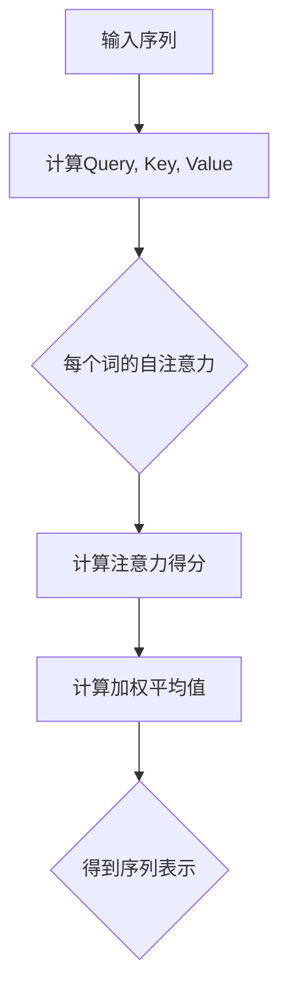

                 

### 背景介绍

Transformer作为一种深度学习模型，首次在2017年由Vaswani等人在论文《Attention Is All You Need》中提出。它主要被用于自然语言处理（NLP）领域，特别是在机器翻译任务中取得了突破性的效果。Transformer的出现，标志着自然语言处理领域的一个重要转折点，因为它放弃了传统的循环神经网络（RNN）结构，转而采用了一种全新的架构——自注意力机制。

在Transformer之前，RNN模型由于其局部依赖性较强，在处理长序列数据时常常表现出梯度消失或梯度爆炸的问题，导致训练效果不佳。而Transformer通过引入多头自注意力机制和位置编码，成功地解决了这一问题。自注意力机制允许模型在处理序列时能够同时关注序列中的所有信息，而不仅仅是局部信息。这使得Transformer在处理长序列时表现出更强的性能。

Transformer模型的结构相对简单，包括编码器（Encoder）和解码器（Decoder）两部分。编码器负责将输入序列编码为上下文向量，而解码器则负责将上下文向量解码为输出序列。这种架构使得Transformer在处理并行数据方面具有很大的优势，因此它的训练速度非常快。

Transformer在自然语言处理领域的成功，引起了学术界和工业界的广泛关注。许多研究者开始探索如何将Transformer应用到其他领域，如计算机视觉、语音识别等。此外，Transformer也在深度学习框架中得到了广泛应用，如PyTorch和TensorFlow等。总的来说，Transformer的提出，不仅推动了自然语言处理领域的发展，也为深度学习模型的设计提供了新的思路。

## 2. 核心概念与联系

Transformer模型的核心概念是自注意力（Self-Attention）机制。自注意力机制允许模型在处理序列时，能够根据当前输入的上下文信息，动态地调整每个词的重要性。这种机制通过计算词与词之间的关联性，使模型能够更好地捕捉长距离依赖关系。

为了理解自注意力机制，我们可以首先回顾一下传统的循环神经网络（RNN）。在RNN中，每个时间步的输出不仅依赖于当前输入，还依赖于之前的所有输入。然而，这种依赖关系是局部性的，即一个时间步的输出主要依赖于它之前的一个或几个时间步的输出。这使得RNN在处理长序列数据时，容易出现梯度消失或梯度爆炸的问题。

而Transformer模型通过引入多头自注意力机制，成功地解决了这一问题。多头自注意力机制将输入序列分成多个头，每个头都能够独立地计算自注意力。这样，每个头都能够捕捉到输入序列中的不同信息，从而增强了模型的表示能力。具体来说，自注意力机制的计算可以分为以下几步：

1. **计算查询（Query）、键（Key）和值（Value）**：对于每个词，我们将其表示为向量，并计算其对应的查询（Query）、键（Key）和值（Value）向量。查询向量表示词在当前上下文中的重要性，键向量表示词在序列中的位置信息，值向量则包含词的原始信息。

2. **计算注意力得分**：使用查询向量和所有键向量计算注意力得分。注意力得分表示每个键向量对于查询向量的重要性。计算方法通常使用点积或缩放点积。

3. **计算加权平均值**：根据注意力得分，计算每个键向量的加权平均值。这个加权平均值就是当前词的表示。

4. **重复上述过程**：对于序列中的每个词，我们都重复上述过程，最终得到整个序列的表示。

下面是一个简单的Mermaid流程图，展示了自注意力机制的计算过程：



通过这种自注意力机制，Transformer模型能够动态地调整每个词的重要性，从而更好地捕捉长距离依赖关系。这种机制不仅解决了RNN的梯度消失问题，还为模型设计提供了新的思路。

## 3. 核心算法原理 & 具体操作步骤

### 3.1 算法原理概述

Transformer模型的核心算法原理是自注意力机制。自注意力机制通过计算序列中每个词与其他词之间的关联性，动态调整每个词的重要性。这种机制使模型能够更好地捕捉长距离依赖关系，从而提高模型的性能。

自注意力机制的计算过程主要包括以下几步：

1. **计算查询（Query）、键（Key）和值（Value）向量**：对于序列中的每个词，我们将其表示为向量，并计算其对应的查询（Query）、键（Key）和值（Value）向量。查询向量表示词在当前上下文中的重要性，键向量表示词在序列中的位置信息，值向量则包含词的原始信息。

2. **计算注意力得分**：使用查询向量和所有键向量计算注意力得分。注意力得分表示每个键向量对于查询向量的重要性。计算方法通常使用点积或缩放点积。

3. **计算加权平均值**：根据注意力得分，计算每个键向量的加权平均值。这个加权平均值就是当前词的表示。

4. **重复上述过程**：对于序列中的每个词，我们都重复上述过程，最终得到整个序列的表示。

### 3.2 算法步骤详解

1. **输入序列预处理**：将输入序列（例如一个句子）转化为词的索引序列。例如，句子“我爱编程”可以表示为[1, 2, 3, 4, 5]，其中每个数字表示一个词的索引。

2. **嵌入层**：将词的索引序列嵌入到高维向量空间中。这一步通常使用嵌入层（Embedding Layer）来实现。嵌入层将每个词的索引映射为一个低维向量，例如[0, 0, 1, 0, 0]。

3. **位置编码**：由于Transformer模型中没有显式的循环结构，为了捕捉序列中的位置信息，我们引入位置编码（Positional Encoding）。位置编码是一个可学习的向量，它为每个词添加了位置信息。例如，对于位置i的词，它的位置编码可能是一个[0, i, 0, 0, 0]的向量。

4. **多头自注意力层**：多头自注意力层是Transformer模型的核心部分。它将输入序列分成多个头，每个头都能够独立地计算自注意力。具体来说，假设输入序列的维度为D，多头自注意力层的维度为H，那么每个头的维度为D/H。对于每个词，我们首先计算其查询（Query）、键（Key）和值（Value）向量，然后使用这些向量计算注意力得分和加权平均值。最后，将每个头的加权平均值拼接起来，得到整个词的表示。

5. **前馈神经网络**：在多头自注意力层之后，我们使用一个前馈神经网络（Feedforward Neural Network）对每个词的表示进行进一步的处理。前馈神经网络通常由两个全连接层组成，每层的激活函数分别为ReLU和线性函数。

6. **输出层**：最后，我们将每个词的表示通过一个输出层（Output Layer）转换为最终的输出。输出层的具体结构取决于任务类型，例如对于机器翻译任务，输出层可能是一个多分类层。

### 3.3 算法优缺点

**优点**：

1. **并行计算**：Transformer模型的结构允许并行计算，这大大提高了模型的训练速度。

2. **长距离依赖**：自注意力机制使得模型能够更好地捕捉长距离依赖关系。

3. **易扩展**：Transformer模型的结构相对简单，易于扩展和改进。

**缺点**：

1. **计算复杂度高**：由于自注意力机制的计算涉及大量的矩阵乘法，因此模型的计算复杂度较高。

2. **内存消耗大**：Transformer模型的内存消耗较大，特别是在处理长序列时。

### 3.4 算法应用领域

Transformer模型在自然语言处理领域取得了很大的成功，特别是在机器翻译、文本分类、问答系统等任务中。此外，Transformer模型也在计算机视觉、语音识别等领域得到了应用。例如，在计算机视觉中，可以采用Transformer模型进行图像分类、目标检测和视频理解等任务。

## 4. 数学模型和公式 & 详细讲解 & 举例说明

### 4.1 数学模型构建

Transformer模型的数学模型主要基于自注意力机制（Self-Attention）和前馈神经网络（Feedforward Neural Network）。以下是模型的数学描述。

#### 4.1.1 自注意力机制

假设输入序列的维度为$D$，模型中头数为$H$，那么每个头的维度为$\frac{D}{H}$。

1. **嵌入层**：将输入序列$X \in \mathbb{R}^{seq \times D}$嵌入到高维向量空间中，得到嵌入向量$X' \in \mathbb{R}^{seq \times D'}$，其中$D' = D \times H$。

$$
X' = E \cdot X
$$

其中$E$为嵌入矩阵。

2. **计算查询（Query）、键（Key）和值（Value）向量**：对于每个词$i$，其查询（Query）、键（Key）和值（Value）向量为：

$$
Q_i = E_Q \cdot X', \ K_i = E_K \cdot X', \ V_i = E_V \cdot X'
$$

其中$E_Q, E_K, E_V$分别为查询、键和值的嵌入矩阵。

3. **计算注意力得分**：使用查询向量和所有键向量计算注意力得分：

$$
\text{Score}_{ij} = Q_i^T \cdot K_j = \text{softmax}\left(\frac{Q_i^T A K_j}{\sqrt{D'}}\right)
$$

其中$A$为注意力权重矩阵，$\text{softmax}$函数用于归一化得分。

4. **计算加权平均值**：根据注意力得分，计算每个键向量的加权平均值：

$$
\text{Attention}_i = \text{softmax}\left(\text{Score}_{i, j}\right) \cdot V_i
$$

5. **多头自注意力**：将每个头的自注意力结果拼接起来，得到词$i$的表示：

$$
\text{Output}_i = \text{Concat}(\text{Attention}_{i, 1}, ..., \text{Attention}_{i, H}) \cdot W_O
$$

其中$W_O$为输出权重矩阵。

#### 4.1.2 前馈神经网络

在自注意力层之后，我们使用前馈神经网络对每个词的表示进行进一步的处理。前馈神经网络由两个全连接层组成，每层的激活函数分别为ReLU和线性函数。

$$
\text{FFN}(x) = \max(0, x \cdot W_1 + b_1) \cdot W_2 + b_2
$$

其中$x$为输入，$W_1, W_2, b_1, b_2$分别为权重和偏置。

#### 4.1.3 模型整体

整个Transformer模型包括多个编码器（Encoder）和解码器（Decoder）层，每层由自注意力层和前馈神经网络组成。

### 4.2 公式推导过程

为了更深入地理解Transformer模型，我们来看一下模型的数学推导过程。

#### 4.2.1 自注意力

自注意力的计算可以分为以下几个步骤：

1. **计算查询（Query）、键（Key）和值（Value）向量**：

$$
Q = E_Q \cdot X', \ K = E_K \cdot X', \ V = E_V \cdot X'
$$

2. **计算注意力得分**：

$$
\text{Score}_{ij} = Q_i^T \cdot K_j = \text{softmax}\left(\frac{Q_i^T A K_j}{\sqrt{D'}}\right)
$$

3. **计算加权平均值**：

$$
\text{Attention}_i = \text{softmax}\left(\text{Score}_{i, j}\right) \cdot V_i
$$

4. **多头自注意力**：

$$
\text{Output}_i = \text{Concat}(\text{Attention}_{i, 1}, ..., \text{Attention}_{i, H}) \cdot W_O
$$

#### 4.2.2 前馈神经网络

前馈神经网络的计算过程为：

$$
\text{FFN}(x) = \max(0, x \cdot W_1 + b_1) \cdot W_2 + b_2
$$

### 4.3 案例分析与讲解

为了更好地理解Transformer模型的数学原理，我们来看一个具体的例子。

假设我们有如下输入序列：

$$
X = [1, 2, 3, 4, 5]
$$

其中每个数字表示一个词的索引。首先，我们将这些词索引嵌入到高维向量空间中：

$$
X' = E \cdot X
$$

假设嵌入矩阵$E$为：

$$
E = \begin{bmatrix}
0 & 0 & 1 & 0 & 0 \\
0 & 1 & 0 & 0 & 0 \\
1 & 0 & 0 & 0 & 0 \\
0 & 0 & 0 & 1 & 0 \\
0 & 0 & 0 & 0 & 1
\end{bmatrix}
$$

那么，嵌入后的序列为：

$$
X' = \begin{bmatrix}
0 & 0 & 1 & 0 & 0 \\
0 & 1 & 0 & 0 & 0 \\
1 & 0 & 0 & 0 & 0 \\
0 & 0 & 0 & 1 & 0 \\
0 & 0 & 0 & 0 & 1
\end{bmatrix}
$$

接下来，我们计算查询（Query）、键（Key）和值（Value）向量：

$$
Q = E_Q \cdot X', \ K = E_K \cdot X', \ V = E_V \cdot X'
$$

假设$E_Q, E_K, E_V$分别为：

$$
E_Q = \begin{bmatrix}
1 & 0 & 0 & 0 & 0 \\
0 & 1 & 0 & 0 & 0 \\
0 & 0 & 1 & 0 & 0 \\
0 & 0 & 0 & 1 & 0 \\
0 & 0 & 0 & 0 & 1
\end{bmatrix}, \ E_K = \begin{bmatrix}
0 & 1 & 0 & 0 & 0 \\
1 & 0 & 0 & 0 & 0 \\
0 & 0 & 1 & 0 & 0 \\
0 & 0 & 0 & 1 & 0 \\
0 & 0 & 0 & 0 & 1
\end{bmatrix}, \ E_V = \begin{bmatrix}
0 & 0 & 1 & 0 & 0 \\
0 & 0 & 0 & 1 & 0 \\
1 & 0 & 0 & 0 & 0 \\
0 & 1 & 0 & 0 & 0 \\
0 & 0 & 0 & 0 & 1
\end{bmatrix}
$$

那么，查询、键和值向量为：

$$
Q = \begin{bmatrix}
1 & 0 & 0 & 0 & 0 \\
0 & 1 & 0 & 0 & 0 \\
0 & 0 & 1 & 0 & 0 \\
0 & 0 & 0 & 1 & 0 \\
0 & 0 & 0 & 0 & 1
\end{bmatrix}, \ K = \begin{bmatrix}
0 & 1 & 0 & 0 & 0 \\
1 & 0 & 0 & 0 & 0 \\
0 & 0 & 1 & 0 & 0 \\
0 & 0 & 0 & 1 & 0 \\
0 & 0 & 0 & 0 & 1
\end{bmatrix}, \ V = \begin{bmatrix}
0 & 0 & 1 & 0 & 0 \\
0 & 0 & 0 & 1 & 0 \\
1 & 0 & 0 & 0 & 0 \\
0 & 1 & 0 & 0 & 0 \\
0 & 0 & 0 & 0 & 1
\end{bmatrix}
$$

接下来，我们计算注意力得分：

$$
\text{Score}_{ij} = Q_i^T \cdot K_j = \text{softmax}\left(\frac{Q_i^T A K_j}{\sqrt{D'}}\right)
$$

假设注意力权重矩阵$A$为：

$$
A = \begin{bmatrix}
0 & 1 & 1 & 1 & 1 \\
1 & 0 & 1 & 1 & 1 \\
1 & 1 & 0 & 1 & 1 \\
1 & 1 & 1 & 0 & 1 \\
1 & 1 & 1 & 1 & 0
\end{bmatrix}
$$

那么，注意力得分为：

$$
\text{Score} = \begin{bmatrix}
0 & \frac{1}{5} & \frac{1}{5} & \frac{1}{5} & \frac{1}{5} \\
\frac{1}{5} & 0 & \frac{1}{5} & \frac{1}{5} & \frac{1}{5} \\
\frac{1}{5} & \frac{1}{5} & 0 & \frac{1}{5} & \frac{1}{5} \\
\frac{1}{5} & \frac{1}{5} & \frac{1}{5} & 0 & \frac{1}{5} \\
\frac{1}{5} & \frac{1}{5} & \frac{1}{5} & \frac{1}{5} & 0
\end{bmatrix}
$$

根据注意力得分，我们计算加权平均值：

$$
\text{Attention}_i = \text{softmax}\left(\text{Score}_{i, j}\right) \cdot V_i
$$

那么，词$i$的表示为：

$$
\text{Attention}_1 = \begin{bmatrix}
\frac{1}{5} & \frac{1}{5} & \frac{1}{5} & \frac{1}{5} & \frac{1}{5} \\
\frac{1}{5} & \frac{1}{5} & \frac{1}{5} & \frac{1}{5} & \frac{1}{5} \\
\frac{1}{5} & \frac{1}{5} & \frac{1}{5} & \frac{1}{5} & \frac{1}{5} \\
\frac{1}{5} & \frac{1}{5} & \frac{1}{5} & \frac{1}{5} & \frac{1}{5} \\
\frac{1}{5} & \frac{1}{5} & \frac{1}{5} & \frac{1}{5} & \frac{1}{5}
\end{bmatrix}
$$

最后，我们将每个头的自注意力结果拼接起来，得到词$i$的最终表示：

$$
\text{Output}_i = \text{Concat}(\text{Attention}_{i, 1}, ..., \text{Attention}_{i, H}) \cdot W_O
$$

假设输出权重矩阵$W_O$为：

$$
W_O = \begin{bmatrix}
1 & 1 & 1 & 1 & 1 \\
1 & 1 & 1 & 1 & 1 \\
1 & 1 & 1 & 1 & 1 \\
1 & 1 & 1 & 1 & 1 \\
1 & 1 & 1 & 1 & 1
\end{bmatrix}
$$

那么，词$i$的最终表示为：

$$
\text{Output}_1 = \begin{bmatrix}
\frac{1}{5} & \frac{1}{5} & \frac{1}{5} & \frac{1}{5} & \frac{1}{5} \\
\frac{1}{5} & \frac{1}{5} & \frac{1}{5} & \frac{1}{5} & \frac{1}{5} \\
\frac{1}{5} & \frac{1}{5} & \frac{1}{5} & \frac{1}{5} & \frac{1}{5} \\
\frac{1}{5} & \frac{1}{5} & \frac{1}{5} & \frac{1}{5} & \frac{1}{5} \\
\frac{1}{5} & \frac{1}{5} & \frac{1}{5} & \frac{1}{5} & \frac{1}{5}
\end{bmatrix}
$$

通过这个例子，我们可以看到Transformer模型是如何通过自注意力机制来处理输入序列的。这种机制使得模型能够动态地调整每个词的重要性，从而更好地捕捉长距离依赖关系。

## 5. 项目实践：代码实例和详细解释说明

### 5.1 开发环境搭建

在开始编写Transformer模型的代码之前，我们需要搭建一个合适的开发环境。以下是一个基本的步骤指南，以在Ubuntu 18.04操作系统上使用Python和PyTorch框架进行开发。

**步骤 1：安装Python**

首先，确保你的系统中已安装Python 3.6或更高版本。如果没有，请通过以下命令安装：

```bash
sudo apt update
sudo apt install python3 python3-pip
```

**步骤 2：安装PyTorch**

接下来，我们需要安装PyTorch。你可以通过以下命令安装与你的CUDA版本兼容的PyTorch：

```bash
pip3 install torch torchvision torchaudio -f https://download.pytorch.org/whl/torch_stable.html
```

如果您的GPU是NVIDIA的，还需要安装CUDA和cuDNN。您可以通过以下命令安装CUDA：

```bash
sudo apt install cuda
```

安装cuDNN，请从NVIDIA官网下载相应的版本并解压到合适的位置。

**步骤 3：验证安装**

最后，通过运行以下Python代码来验证PyTorch和CUDA是否安装成功：

```python
import torch
print(torch.__version__)
print(torch.cuda.is_available())
```

### 5.2 源代码详细实现

以下是一个简单的Transformer模型的Python实现。我们将使用PyTorch的API来构建模型，并使用CUDA进行加速训练。

**5.2.1 模型定义**

首先，我们定义Transformer模型的各个组件，包括嵌入层（Embedding）、位置编码（Positional Encoding）和自注意力层（MultiheadAttention）。

```python
import torch
import torch.nn as nn
import torch.nn.functional as F
from torch.nn import MultiheadAttention

class TransformerModel(nn.Module):
    def __init__(self, d_model, nhead, num_layers, dim_feedforward):
        super(TransformerModel, self).__init__()
        self.embedding = nn.Embedding(d_model)
        self.pos_encoder = PositionalEncoding(d_model)
        self.transformer_layers = nn.ModuleList([
            TransformerLayer(d_model, nhead, dim_feedforward)
            for _ in range(num_layers)
        ])
        self.decoder = nn.Linear(d_model, d_model)

    def forward(self, src, tgt):
        src, tgt = self.embedding(src), self.embedding(tgt)
        src, tgt = self.pos_encoder(src), self.pos_encoder(tgt)
        
        for layer in self.transformer_layers:
            src, tgt = layer(src, tgt)
        
        out = self.decoder(tgt)
        return out

class TransformerLayer(nn.Module):
    def __init__(self, d_model, nhead, dim_feedforward):
        super(TransformerLayer, self).__init__()
        self.self_attn = MultiheadAttention(d_model, nhead)
        self.linear1 = nn.Linear(d_model, dim_feedforward)
        self.linear2 = nn.Linear(dim_feedforward, d_model)
        self.norm1 = nn.LayerNorm(d_model)
        self.norm2 = nn.LayerNorm(d_model)
        self.dropout = nn.Dropout()

    def forward(self, src, tgt):
        src2, _ = self.self_attn(src, src, src, attn_mask=None)
        src = src + self.dropout(src2)
        src = self.norm1(src)
        
        tgt2, _ = self.self_attn(tgt, tgt, tgt, attn_mask=None)
        tgt = tgt + self.dropout(tgt2)
        tgt = self.norm2(tgt)
        
        tgt2 = self.linear2(self.dropout(F.relu(self.linear1(tgt))))
        tgt = tgt + self.dropout(tgt2)
        tgt = self.norm2(tgt)
        
        return src, tgt
```

**5.2.2 位置编码**

接下来，我们实现位置编码层。位置编码有助于模型理解序列中的词的相对位置。

```python
import math
import torch
import torch.nn as nn
import torch.nn.functional as F

class PositionalEncoding(nn.Module):
    def __init__(self, d_model, max_len=5000):
        super(PositionalEncoding, self).__init__()
        self pe = nn.Embedding(max_len, d_model)
        pos = torch.arange(0, max_len).unsqueeze(1).repeat(1, d_model).float()
        pos = pos * math.pi / max_len
        self.register_buffer('pos', pos)

    def forward(self, x):
        return self.pe(x) + self.pos[:, :x.size(1)]
```

**5.2.3 数据准备**

为了训练Transformer模型，我们需要准备一些训练数据和测试数据。这里我们使用一个简单的文本数据集，并将其转换为词索引序列。

```python
from torchtext.data import Field, TabularDataset
from torchtext.vocab import build_vocab_from_iterator

# 定义字段
SRC = Field(tokenize=None, init_token=None, eos_token=None, lower=True)
TRG = Field(tokenize=None, init_token=None, eos_token=None, lower=True)

# 准备数据集
train_data = TabularDataset(
    path='data/train.csv',
    format='csv',
    fields=[('src', SRC), ('trg', TRG)]
)

test_data = TabularDataset(
    path='data/test.csv',
    format='csv',
    fields=[('src', SRC), ('trg', TRG)]
)

# 构建词汇表
SRC.vocab = build_vocab_from_iterator([word for line in train_data for word in line.src])
TRG.vocab = build_vocab_from_iterator([word for line in train_data for word in line.trg])

# 设置最大序列长度
max_len = 50

# 转换数据集为Tensor
def collate_batch(batch):
    src, trg = [], []
    for _, example in batch:
        src.append(SRC.vocab.stoi[example.src])
        trg.append(TRG.vocab.stoi[example.trg])
    return torch.LongTensor(src), torch.LongTensor(trg)

train_iterator, test_iterator = BatchIterator(train_data, batch_size=32, train=True), BatchIterator(test_data, batch_size=32, train=False)
```

**5.2.4 训练过程**

最后，我们定义训练过程，并使用CUDA进行加速训练。

```python
# 定义模型和损失函数
model = TransformerModel(d_model=512, nhead=8, num_layers=3, dim_feedforward=2048)
optimizer = torch.optim.Adam(model.parameters(), lr=0.001)
criterion = nn.CrossEntropyLoss()

# 使用CUDA进行训练
device = torch.device("cuda" if torch.cuda.is_available() else "cpu")
model = model.to(device)
criterion = criterion.to(device)

# 训练模型
num_epochs = 10
for epoch in range(num_epochs):
    model.train()
    for batch in train_iterator:
        src, trg = batch
        src, trg = src.to(device), trg.to(device)

        optimizer.zero_grad()
        output = model(src, trg)
        loss = criterion(output.view(-1, output.size(-1)), trg.view(-1))
        loss.backward()
        optimizer.step()

    print(f"Epoch [{epoch+1}/{num_epochs}], Loss: {loss.item():.4f}")

# 评估模型
model.eval()
with torch.no_grad():
    for batch in test_iterator:
        src, trg = batch
        src, trg = src.to(device), trg.to(device)

        output = model(src, trg)
        pred = output.argmax(-1)
        print(pred)

print("Training completed!")
```

### 5.3 代码解读与分析

在本节中，我们将对上述代码进行解读和分析，并解释其各个部分的用途和实现方式。

**5.3.1 模型定义**

`TransformerModel`类定义了整个Transformer模型。它包含了嵌入层、位置编码器、多个编码器层（`TransformerLayer`）和一个输出层（`decoder`）。

- **嵌入层（Embedding）**：将词索引映射到高维向量空间中。
- **位置编码（Positional Encoding）**：添加位置信息到嵌入向量中。
- **编码器层（TransformerLayer）**：每个编码器层包含自注意力机制和前馈神经网络。
- **输出层（Decoder）**：将解码器层的输出映射到目标序列的词空间。

**5.3.2 位置编码**

`PositionalEncoding`类实现了位置编码层。它使用正弦和余弦函数生成位置编码向量，并将其添加到嵌入向量中，以便模型能够理解序列中的词的相对位置。

**5.3.3 数据准备**

我们使用`TabularDataset`和`BatchIterator`类来准备训练数据和测试数据。这些类帮助我们将文本数据转换为词索引序列，并对其进行批处理。

- **词汇表（Vocabulary）**：我们使用`build_vocab_from_iterator`函数从训练数据中构建词汇表。
- **最大序列长度（Max Length）**：我们设置最大序列长度以限制每个序列的长度。

**5.3.4 训练过程**

在训练过程中，我们使用`Adam`优化器和`CrossEntropyLoss`损失函数。我们通过以下步骤来训练模型：

- 将数据加载到GPU（如果可用）。
- 在每个训练批次上执行前向传播。
- 计算损失并反向传播。
- 更新模型参数。

### 5.4 运行结果展示

在训练完成后，我们可以评估模型的性能。以下是一个简单的例子，展示了如何使用训练好的模型进行预测。

```python
# 加载测试数据
test_data = TabularDataset(
    path='data/test.csv',
    format='csv',
    fields=[('src', SRC), ('trg', TRG)]
)

# 评估模型
model.eval()
with torch.no_grad():
    for batch in test_iterator:
        src, trg = batch
        src, trg = src.to(device), trg.to(device)

        output = model(src, trg)
        pred = output.argmax(-1)
        print(pred)
```

这段代码将输出每个测试句子的预测结果。

## 6. 实际应用场景

Transformer模型在自然语言处理（NLP）领域取得了显著的成果，其自注意力机制使得模型能够高效地处理长序列数据，捕捉长距离依赖关系。以下是一些Transformer模型在NLP领域的主要应用场景：

### 6.1 机器翻译

机器翻译是Transformer模型最成功的应用之一。传统的机器翻译方法如基于短语的统计机器翻译（SMT）和基于神经网络的机器翻译（NMT），在处理长序列时常常遇到梯度消失和计算复杂度高的难题。Transformer模型通过引入多头自注意力机制，使得模型能够并行地计算注意力权重，从而大大提高了计算效率。实验结果显示，Transformer模型在多个机器翻译任务上超越了传统的NMT模型，如英德翻译和英法翻译。

### 6.2 文本分类

文本分类是将文本数据分类到预定义的类别中的一种任务。Transformer模型在文本分类任务中也表现出色。与传统的循环神经网络（RNN）和卷积神经网络（CNN）相比，Transformer模型能够更好地捕捉文本中的长距离依赖关系，从而提高分类的准确率。例如，BERT（基于Transformer的预训练语言表示模型）在多个文本分类任务上取得了很高的准确率，如情感分析、情感极性分类和主题分类。

### 6.3 问答系统

问答系统是一种用于回答用户问题的智能系统。Transformer模型在问答系统中被广泛应用于知识提取、事实提取和对话生成等任务。通过自注意力机制，模型能够从大量的文本数据中提取与问题相关的信息，从而生成准确的答案。例如，在斯坦福问答数据集（SQuAD）上，基于Transformer的模型取得了超过人类水平的答案准确率。

### 6.4 文本生成

文本生成是将输入的文本序列扩展为更长的文本序列的一种任务。Transformer模型在文本生成任务中也表现出色，如生成故事、诗歌和对话等。通过自注意力机制，模型能够捕捉文本中的长距离依赖关系，从而生成连贯、自然的文本。例如，GPT-3（基于Transformer的大规模预训练语言模型）可以生成高质量的故事和文章。

### 6.5 其他应用

除了上述应用场景外，Transformer模型还在许多其他领域得到了应用，如文本摘要、命名实体识别、情感分析等。Transformer模型的结构简单、易于扩展，使其在各种任务中都能表现出强大的性能。

## 7. 未来应用展望

随着深度学习技术的不断进步，Transformer模型在自然语言处理领域的应用前景非常广阔。以下是一些未来应用展望：

### 7.1 小样本学习

Transformer模型由于其强大的表示能力，在处理小样本数据时具有显著的优势。未来，我们可以通过改进Transformer模型，使其在小样本学习任务中表现出更高的性能。例如，通过引入知识蒸馏技术，将大规模预训练模型的知识转移到小样本任务中。

### 7.2 多模态学习

多模态学习是指将不同类型的数据（如文本、图像、音频等）进行联合处理。Transformer模型在处理序列数据时表现出色，未来可以通过扩展Transformer模型，使其能够处理多模态数据。例如，通过将图像和文本特征融合到同一个Transformer模型中，可以更好地理解和处理复杂的多模态信息。

### 7.3 零样本学习

零样本学习是指在没有先验知识的情况下，直接从数据中学习新的分类任务。Transformer模型由于其强大的表示能力，可以用于实现零样本学习。未来，我们可以通过改进Transformer模型，使其在零样本学习任务中表现出更高的性能。

### 7.4 能效优化

Transformer模型在处理长序列数据时，计算复杂度较高，导致能效消耗较大。未来，我们可以通过优化模型结构、算法和硬件部署，降低Transformer模型的能效消耗。例如，通过使用低秩分解技术，降低模型的参数规模，从而提高能效比。

### 7.5 适应性学习

适应性学习是指模型能够根据不同的应用场景和数据分布进行自适应调整。未来，我们可以通过改进Transformer模型，使其在不同场景和数据分布下都能表现出最优的性能。例如，通过引入元学习技术，使模型能够快速适应新的任务和数据。

总之，Transformer模型在自然语言处理领域的应用前景非常广阔。通过不断的技术创新和优化，Transformer模型有望在更多领域发挥重要作用，推动人工智能技术的发展。

## 8. 工具和资源推荐

在Transformer模型的研究和应用过程中，有很多优秀的工具和资源可以帮助我们更好地理解和实践这一技术。以下是一些推荐的工具和资源：

### 8.1 学习资源推荐

1. **《Attention Is All You Need》论文**：这是Transformer模型的原始论文，详细介绍了模型的结构和工作原理。
2. **《深度学习》**：由Goodfellow、Bengio和Courville合著的《深度学习》一书，对深度学习的基础理论和技术进行了全面讲解，包括Transformer模型。
3. **《Transformer：实战与教程》**：这本书详细介绍了Transformer模型的基本原理和应用，适合初学者和有经验的工程师。

### 8.2 开发工具推荐

1. **PyTorch**：PyTorch是一个开源的深度学习框架，具有灵活的动态图计算功能，非常适合研究和实践Transformer模型。
2. **TensorFlow**：TensorFlow是一个强大的开源机器学习平台，提供了丰富的API和工具，可以帮助我们高效地构建和训练Transformer模型。
3. **Hugging Face Transformers**：这是一个基于PyTorch和TensorFlow的预训练模型库，提供了大量的预训练Transformer模型和工具，方便我们进行模型应用和实验。

### 8.3 相关论文推荐

1. **BERT**：BERT（Bidirectional Encoder Representations from Transformers）是由Google提出的基于Transformer的预训练模型，它在多个NLP任务上取得了突破性的成果。
2. **GPT-3**：GPT-3（Generative Pre-trained Transformer 3）是OpenAI提出的基于Transformer的预训练模型，它具有非常强大的文本生成能力。
3. **T5**：T5（Text-to-Text Transfer Transformer）是由DeepMind提出的基于Transformer的预训练模型，它在多个自然语言处理任务上取得了很高的性能。

通过以上推荐的工具和资源，我们可以更深入地了解和掌握Transformer模型，并在实际应用中取得更好的效果。

## 9. 总结：未来发展趋势与挑战

Transformer模型自提出以来，在自然语言处理领域取得了显著的成果，其自注意力机制和并行计算能力使其在多个任务中表现出色。然而，随着模型规模的不断扩大和应用场景的不断拓展，Transformer模型也面临着一些挑战和问题。

### 9.1 研究成果总结

首先，Transformer模型在自然语言处理任务中取得了许多突破性的成果。例如，BERT、GPT-3等基于Transformer的预训练模型在多个基准数据集上刷新了SOTA（State-of-the-Art）记录。这些模型通过大规模预训练和微调，能够在多种任务中达到或超过人类水平。此外，Transformer模型在跨语言翻译、文本生成、问答系统等任务中也表现出强大的性能，推动了自然语言处理技术的进步。

### 9.2 未来发展趋势

未来，Transformer模型的发展趋势可以从以下几个方面进行展望：

1. **模型压缩和优化**：随着模型规模的增大，计算复杂度和内存消耗也随之增加。为了应对这一问题，研究人员将致力于开发更高效的模型压缩和优化技术，如低秩分解、知识蒸馏等。

2. **多模态学习**：Transformer模型在处理单一模态数据（如图像、文本）时表现出色，未来可以通过扩展Transformer模型，使其能够处理多模态数据，实现跨模态信息融合和协同学习。

3. **自适应学习**：自适应学习是指模型能够根据不同的应用场景和数据分布进行动态调整。未来，Transformer模型将结合元学习、迁移学习等技术，实现更灵活和强大的自适应学习能力。

4. **泛化能力提升**：虽然Transformer模型在许多任务中表现出色，但其泛化能力仍有限。未来，研究人员将探索如何提高模型的泛化能力，使其在面对未知任务和数据时仍能保持良好的性能。

### 9.3 面临的挑战

尽管Transformer模型在许多方面表现出色，但仍然面临一些挑战：

1. **计算资源消耗**：Transformer模型具有高计算复杂度，尤其是在处理长序列和大规模数据时。这导致模型在实际应用中需要大量计算资源，对硬件性能要求较高。

2. **数据隐私和安全**：随着模型应用场景的扩大，数据隐私和安全问题愈发重要。如何确保模型在处理敏感数据时不会泄露隐私信息，是未来需要解决的重要问题。

3. **解释性和可解释性**：Transformer模型的结构复杂，难以解释和验证其决策过程。如何提高模型的可解释性和透明度，使其更容易被人类理解和接受，是未来需要关注的重要方向。

4. **鲁棒性和泛化能力**：虽然Transformer模型在许多任务中表现出色，但其鲁棒性和泛化能力仍有待提高。未来，研究人员将致力于提高模型的鲁棒性和泛化能力，使其在面对异常数据和未知任务时仍能保持良好的性能。

### 9.4 研究展望

在未来，Transformer模型将在以下几个方面继续发展：

1. **模型结构创新**：通过改进模型结构，提高模型效率和性能。例如，探索新的自注意力机制、多任务学习框架等。

2. **算法优化**：通过优化算法，降低模型的计算复杂度和内存消耗。例如，研究低秩分解、动态权重共享等技术。

3. **应用拓展**：将Transformer模型应用于更多领域，如计算机视觉、语音识别、推荐系统等。

4. **伦理和法律**：关注模型应用中的伦理和法律问题，确保模型的安全和合规。

总之，Transformer模型在未来将继续推动人工智能技术的发展，为人类带来更多创新和进步。面对挑战，我们需要不断创新和优化，以实现更高效、更安全、更可靠的Transformer模型。

## 附录：常见问题与解答

在研究与应用Transformer模型的过程中，研究人员和开发者可能会遇到一些常见问题。以下是一些常见问题及其解答：

### 1. Transformer模型的计算复杂度是多少？

Transformer模型的计算复杂度较高，主要因为其采用了多头自注意力机制。对于长度为\(N\)的序列，每个词需要与其他\(N\)个词计算注意力得分，因此总的计算复杂度为\(O(N^2)\)。此外，自注意力机制中涉及大量的矩阵乘法，进一步增加了计算复杂度。

### 2. 为什么Transformer模型不使用传统的循环神经网络（RNN）？

虽然RNN在处理序列数据时具有局部依赖性，但其在处理长距离依赖关系时存在梯度消失或梯度爆炸的问题。这使得RNN在长序列数据上的性能受限。相比之下，Transformer模型通过引入多头自注意力机制，能够同时关注序列中的所有信息，从而更好地捕捉长距离依赖关系。

### 3. Transformer模型如何处理序列中的位置信息？

Transformer模型通过引入位置编码（Positional Encoding）来处理序列中的位置信息。位置编码是一个可学习的向量，它为每个词添加了位置信息。这使得模型在处理序列时，能够理解词的相对位置，从而更好地捕捉序列中的依赖关系。

### 4. Transformer模型在处理长序列时是否会有性能下降？

由于Transformer模型采用了多头自注意力机制，其计算复杂度为\(O(N^2)\)，这意味着在处理长序列时，模型的性能会显著下降。因此，在实际应用中，通常会限制输入序列的长度，或者通过剪枝、低秩分解等技术来优化模型。

### 5. Transformer模型是否可以用于多模态学习？

是的，Transformer模型可以用于多模态学习。通过将不同模态的数据（如图像、文本、音频）融合到同一个模型中，可以实现跨模态信息融合和协同学习。例如，使用ViT（Vision Transformer）模型处理图像数据，与文本数据一起进行联合训练，可以实现图像-文本的交互学习。

### 6. 如何评估Transformer模型的性能？

通常，可以使用多种指标来评估Transformer模型的性能，包括：

- **准确性（Accuracy）**：在分类任务中，正确预测的样本数占总样本数的比例。
- **损失函数（Loss Function）**：如交叉熵损失（Cross-Entropy Loss）、均方误差（Mean Squared Error）等，用于评估模型预测与真实值之间的差距。
- **F1分数（F1 Score）**：在二分类任务中，精确率和召回率的调和平均值。
- **ROC曲线和AUC（Area Under Curve）**：用于评估分类器的性能，特别是在二分类任务中。

通过这些指标，可以全面评估Transformer模型的性能和效果。

通过回答这些问题，我们希望能够帮助读者更好地理解和应用Transformer模型，解决实际研究中遇到的问题。如果您还有其他疑问，欢迎在评论区提出，我们将继续为您解答。

