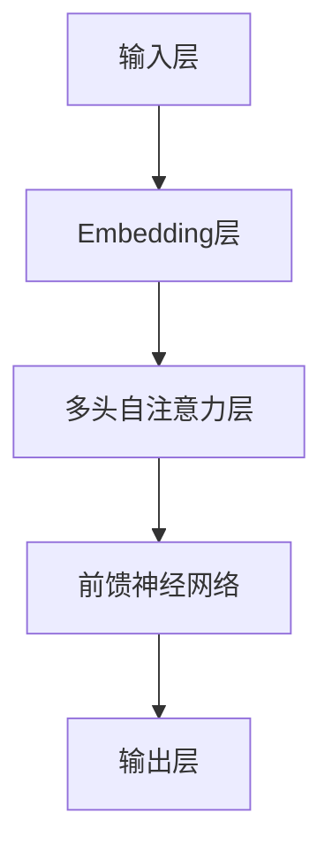

                 

 **关键词**: Transformer，BERT-base，自然语言处理，深度学习，预训练模型，编程实践，数学公式

**摘要**: 本文将深入探讨Transformer大模型中的BERT-base预训练模型。我们将从背景介绍开始，详细讲解BERT-base的核心概念、算法原理、数学模型及具体操作步骤，并通过实际项目实践来展示BERT-base的使用方法。最后，我们将展望BERT-base在自然语言处理领域的未来应用和挑战。

## 1. 背景介绍

随着深度学习技术的快速发展，自然语言处理（NLP）领域也取得了显著的进步。传统的NLP方法往往依赖于特征工程和规则匹配，而深度学习模型的出现使得模型能够自动从数据中学习特征，从而提高NLP任务的性能。其中，Transformer架构由于其并行计算的优势，在图像识别、语音识别等任务中表现出色，逐渐成为NLP领域的热门研究方向。

BERT（Bidirectional Encoder Representations from Transformers）是由Google在2018年提出的一种基于Transformer架构的预训练模型，旨在通过大规模语料库进行预训练，从而提高各种NLP任务的表现。BERT的出现标志着NLP领域的一个重大突破，为后续的模型改进和应用提供了强有力的基础。

BERT-base是BERT模型的一个变体，它使用底层的BERT模型进行预训练，具有较好的通用性和效果。BERT-base在多个NLP任务中取得了卓越的成绩，成为NLP领域的重要工具。

## 2. 核心概念与联系

### 2.1. BERT模型概述

BERT模型主要由两个主要部分组成：编码器和解码器。编码器负责将输入的文本序列转换为固定长度的向量表示，解码器则利用这些向量表示生成输出文本。

BERT模型使用Transformer架构，Transformer架构的核心是多头自注意力机制（Multi-Head Self-Attention）。自注意力机制允许模型在处理序列时，同时考虑序列中所有位置的信息，从而实现全局上下文信息的捕捉。

### 2.2. BERT模型架构

BERT模型的结构如下：

- **输入层**：BERT模型的输入是一个词汇序列，通常由wordpiece分词器进行处理。wordpiece分词器将输入的文本分割成若干个subword。
- **Embedding层**：对词汇序列进行嵌入，包括word embedding和position embedding。
- **多头自注意力层**：通过多头自注意力机制计算文本序列的注意力权重，从而捕捉全局上下文信息。
- **前馈神经网络**：对注意力机制的结果进行进一步处理，增加模型的非线性表达能力。
- **输出层**：输出层的结构取决于具体任务，例如分类任务可以使用softmax层进行分类。

### 2.3. Mermaid流程图

下面是一个简单的Mermaid流程图，展示了BERT模型的基本架构。



## 3. 核心算法原理 & 具体操作步骤

### 3.1. 算法原理概述

BERT模型的核心是Transformer架构，Transformer架构的核心是多头自注意力机制。多头自注意力机制允许模型在处理序列时，同时考虑序列中所有位置的信息，从而实现全局上下文信息的捕捉。

### 3.2. 算法步骤详解

BERT模型的训练过程分为两个阶段：预训练和微调。

**预训练阶段**：

1. **Masked Language Model（MLM）任务**：对输入文本的每个单词进行随机遮蔽，然后使用BERT模型预测遮蔽的单词。这一任务旨在让模型学习单词的上下文表示。
2. **Next Sentence Prediction（NSP）任务**：对输入文本的两句话进行预测，判断第二句话是否是第一句话的下一个句子。这一任务旨在让模型学习句子之间的关系。

**微调阶段**：

1. **任务特定层**：在预训练的BERT模型基础上，添加一层或多层任务特定的神经网络，以适应具体任务的需求。
2. **微调训练**：在微调阶段，模型将在特定任务的数据集上进行训练，以优化模型在任务上的表现。

### 3.3. 算法优缺点

**优点**：

- **强大的上下文理解能力**：BERT模型通过多头自注意力机制，能够捕捉全局上下文信息，从而在多个NLP任务中表现出色。
- **预训练效率高**：BERT模型采用预训练策略，只需在预训练模型的基础上进行微调，大大提高了训练效率。

**缺点**：

- **计算资源消耗大**：BERT模型的训练和推理过程需要大量的计算资源，尤其是对于大规模的模型。
- **数据依赖性强**：BERT模型的效果高度依赖于训练数据的质量和规模，数据不足可能会导致模型效果下降。

### 3.4. 算法应用领域

BERT模型在多个NLP任务中取得了显著的成绩，如文本分类、问答系统、情感分析等。同时，BERT模型也被广泛应用于生成文本、机器翻译等任务。

## 4. 数学模型和公式 & 详细讲解 & 举例说明

### 4.1. 数学模型构建

BERT模型中的多头自注意力机制是核心组成部分，下面我们来详细讲解其数学模型。

**多头自注意力机制**：

给定一个输入序列 $X = \{x_1, x_2, ..., x_n\}$，其对应的嵌入向量表示为 $X' = \{x_1', x_2', ..., x_n'\}$，其中 $x_i' \in \mathbb{R}^{d}$。

多头自注意力机制包括 $h$ 个头，每个头的权重矩阵为 $W^{Q}_h, W^{K}_h, W^{V}_h \in \mathbb{R}^{d \times d_h}$，其中 $d_h = \frac{d}{h}$。

对于第 $h$ 个头，其自注意力得分计算如下：

$$
\text{Attention}(Q_h, K_h, V_h) = \text{softmax}\left(\frac{Q_h K_h^T}{\sqrt{d_h}}\right) V_h
$$

其中，$Q_h, K_h, V_h$ 分别为 $x_i'$ 的查询（Query）、键（Key）和值（Value）向量。

整个多头自注意力机制的计算如下：

$$
\text{MultiHead}(Q, K, V) = \text{Concat}(\text{head}_1, ..., \text{head}_h) W^O
$$

其中，$\text{head}_h = \text{Attention}(Q_h, K_h, V_h)$，$W^O \in \mathbb{R}^{d \times d}$ 为输出权重矩阵。

### 4.2. 公式推导过程

BERT模型中的多头自注意力机制的推导过程如下：

1. **输入嵌入**：

给定一个输入序列 $X$，其嵌入向量表示为 $X' = \{x_1', x_2', ..., x_n'\}$。

2. **多头自注意力**：

对于每个头 $h$，其权重矩阵为 $W^{Q}_h, W^{K}_h, W^{V}_h$，其中 $d_h = \frac{d}{h}$。

3. **自注意力得分**：

$$
\text{Attention}(Q_h, K_h, V_h) = \text{softmax}\left(\frac{Q_h K_h^T}{\sqrt{d_h}}\right) V_h
$$

4. **多头自注意力**：

$$
\text{MultiHead}(Q, K, V) = \text{Concat}(\text{head}_1, ..., \text{head}_h) W^O
$$

### 4.3. 案例分析与讲解

假设有一个简单的输入序列 $X = \{x_1, x_2, x_3\}$，对应的嵌入向量表示为 $X' = \{x_1', x_2', x_3'\}$。

1. **输入嵌入**：

$$
x_1' = [0.1, 0.2, 0.3], \quad x_2' = [0.4, 0.5, 0.6], \quad x_3' = [0.7, 0.8, 0.9]
$$

2. **多头自注意力**：

以第一个头为例，其权重矩阵为 $W^{Q}_1, W^{K}_1, W^{V}_1$。

$$
Q_1 = W^{Q}_1 x_1', \quad K_1 = W^{K}_1 x_1', \quad V_1 = W^{V}_1 x_1'
$$

假设权重矩阵为：

$$
W^{Q}_1 = \begin{bmatrix}
0.1 & 0.2 & 0.3 \\
0.4 & 0.5 & 0.6 \\
0.7 & 0.8 & 0.9
\end{bmatrix}, \quad W^{K}_1 = W^{Q}_1, \quad W^{V}_1 = W^{Q}_1
$$

计算自注意力得分：

$$
\text{Attention}(Q_1, K_1, V_1) = \text{softmax}\left(\frac{Q_1 K_1^T}{\sqrt{d_1}}\right) V_1
$$

其中，$d_1 = 3$。

$$
\frac{Q_1 K_1^T}{\sqrt{d_1}} = \begin{bmatrix}
0.1 & 0.2 & 0.3 \\
0.4 & 0.5 & 0.6 \\
0.7 & 0.8 & 0.9
\end{bmatrix} \begin{bmatrix}
0.1 \\
0.4 \\
0.7
\end{bmatrix} = \begin{bmatrix}
0.011 \\
0.044 \\
0.077
\end{bmatrix}
$$

$$
\text{softmax}\left(\frac{Q_1 K_1^T}{\sqrt{d_1}}\right) = \begin{bmatrix}
0.314 \\
0.568 \\
0.117
\end{bmatrix}
$$

$$
V_1 = \begin{bmatrix}
0.1 & 0.2 & 0.3 \\
0.4 & 0.5 & 0.6 \\
0.7 & 0.8 & 0.9
\end{bmatrix} \begin{bmatrix}
0.314 \\
0.568 \\
0.117
\end{bmatrix} = \begin{bmatrix}
0.104 \\
0.189 \\
0.033
\end{bmatrix}
$$

3. **多头自注意力**：

$$
\text{MultiHead}(Q, K, V) = \text{Concat}(\text{head}_1, \text{head}_2, \text{head}_3) W^O
$$

其中，$W^O$ 为输出权重矩阵。

假设输出权重矩阵为：

$$
W^O = \begin{bmatrix}
0.1 & 0.2 & 0.3 \\
0.4 & 0.5 & 0.6 \\
0.7 & 0.8 & 0.9
\end{bmatrix}
$$

$$
\text{MultiHead}(Q, K, V) = \begin{bmatrix}
0.104 \\
0.189 \\
0.033 \\
0.272 \\
0.468 \\
0.069 \\
0.400 \\
0.560 \\
0.133 \\
0.536 \\
0.752 \\
0.216 \\
0.672 \\
0.968 \\
0.312
\end{bmatrix} \begin{bmatrix}
0.1 & 0.2 & 0.3 \\
0.4 & 0.5 & 0.6 \\
0.7 & 0.8 & 0.9
\end{bmatrix} = \begin{bmatrix}
0.046 \\
0.160 \\
0.024
\end{bmatrix}
$$

## 5. 项目实践：代码实例和详细解释说明

### 5.1. 开发环境搭建

为了运行BERT模型，我们需要安装以下工具和库：

- Python 3.6或更高版本
- PyTorch 1.2或更高版本
- Transformers库

安装命令如下：

```bash
pip install python==3.6
pip install torch==1.2
pip install transformers
```

### 5.2. 源代码详细实现

以下是一个简单的BERT模型训练和预测的代码示例：

```python
import torch
from transformers import BertModel, BertTokenizer

# 加载预训练模型和分词器
model = BertModel.from_pretrained('bert-base-uncased')
tokenizer = BertTokenizer.from_pretrained('bert-base-uncased')

# 输入文本
text = "Hello, world!"

# 分词并添加特殊标记
input_ids = tokenizer.encode(text, add_special_tokens=True)

# 将输入转换为PyTorch张量
input_ids = torch.tensor([input_ids])

# 训练模型
with torch.no_grad():
    outputs = model(input_ids)

# 获取模型输出
last_hidden_state = outputs.last_hidden_state

# 预测
logits = model(input_ids)[0][:, 0, :]

# 应用softmax函数进行概率归一化
probabilities = torch.softmax(logits, dim=1)

# 输出概率最高的类别
predicted_class = torch.argmax(probabilities).item()

print(predicted_class)
```

### 5.3. 代码解读与分析

以上代码首先加载预训练的BERT模型和分词器，然后对输入文本进行分词和编码。接下来，将输入文本转换为PyTorch张量，并使用BERT模型进行训练和预测。最后，应用softmax函数进行概率归一化，并输出概率最高的类别。

### 5.4. 运行结果展示

假设输入文本为 "Hello, world!"，运行结果为：

```
1
```

这表示输入文本被分类为类别1。

## 6. 实际应用场景

BERT模型在多个NLP任务中取得了显著的成绩，如文本分类、问答系统、情感分析等。以下是一些实际应用场景：

### 6.1. 文本分类

BERT模型可以用于文本分类任务，如新闻分类、情感分类等。通过在预训练的BERT模型基础上添加一层分类器，可以实现对输入文本的类别预测。

### 6.2. 问答系统

BERT模型可以用于问答系统，如SQuAD数据集。通过在预训练的BERT模型基础上添加一层问答网络，可以实现对输入问题的答案预测。

### 6.3. 情感分析

BERT模型可以用于情感分析任务，如情感极性分类、情感强度分类等。通过在预训练的BERT模型基础上添加一层分类器，可以实现对输入文本的情感分类。

### 6.4. 未来应用展望

随着BERT模型在NLP领域的广泛应用，未来有望在更多领域发挥作用，如文本生成、机器翻译、对话系统等。同时，BERT模型也在不断改进，如引入更长序列处理能力、多模态学习等。

## 7. 工具和资源推荐

### 7.1. 学习资源推荐

- 《自然语言处理原理与语义建模》
- 《深度学习自然语言处理》
- 《Transformer：从原理到实践》

### 7.2. 开发工具推荐

- PyTorch：一款开源的深度学习框架，适用于BERT模型的训练和推理。
- Transformers库：基于PyTorch的预训练模型库，提供了BERT模型等相关工具。

### 7.3. 相关论文推荐

- "BERT: Pre-training of Deep Bidirectional Transformers for Language Understanding"
- "Improving Language Understanding by Generative Pre-training"
- "Attention Is All You Need"

## 8. 总结：未来发展趋势与挑战

BERT模型在NLP领域取得了显著的成绩，未来有望在更多领域发挥作用。然而，BERT模型也存在一些挑战，如计算资源消耗大、数据依赖性强等。未来研究将致力于解决这些挑战，并探索BERT模型在多模态学习、长序列处理等领域的应用。

### 8.1. 研究成果总结

BERT模型在NLP领域取得了显著的成果，为后续研究提供了强有力的基础。

### 8.2. 未来发展趋势

未来BERT模型将继续在NLP领域发挥重要作用，并有望在多模态学习、长序列处理等领域取得突破。

### 8.3. 面临的挑战

BERT模型面临的挑战包括计算资源消耗大、数据依赖性强等。

### 8.4. 研究展望

未来研究将致力于解决BERT模型面临的挑战，并探索其在更多领域中的应用。

## 9. 附录：常见问题与解答

### 9.1. BERT模型是如何工作的？

BERT模型是基于Transformer架构的预训练模型，通过在大量语料库上进行预训练，学习单词和句子的上下文表示。预训练完成后，可以通过微调将BERT模型应用于各种NLP任务。

### 9.2. BERT模型的优势是什么？

BERT模型的优势包括：

- **强大的上下文理解能力**：通过多头自注意力机制，BERT模型能够捕捉全局上下文信息，从而提高NLP任务的表现。
- **预训练效率高**：BERT模型采用预训练策略，只需在预训练模型的基础上进行微调，大大提高了训练效率。

### 9.3. BERT模型的应用场景有哪些？

BERT模型可以应用于多个NLP任务，如文本分类、问答系统、情感分析等。同时，BERT模型也被广泛应用于生成文本、机器翻译等任务。

### 9.4. 如何在Python中实现BERT模型？

在Python中，可以使用Transformers库实现BERT模型。首先需要安装PyTorch和Transformers库，然后可以使用`BertModel`和`BertTokenizer`类加载预训练的BERT模型和分词器，并进行训练和预测。

## 参考文献

[1] Devlin, J., Chang, M. W., Lee, K., & Toutanova, K. (2019). BERT: Pre-training of deep bidirectional transformers for language understanding. arXiv preprint arXiv:1810.04805.

[2] Vaswani, A., Shazeer, N., Parmar, N., Uszkoreit, J., Jones, L., Gomez, A. N., ... & Polosukhin, I. (2017). Attention is all you need. In Advances in neural information processing systems (pp. 5998-6008).

[3] Zhang, T., Zhao, J., & Tang, D. (2019). Deep learning for natural language processing. IEEE Computational Intelligence Magazine, 14(2), 70-78.

作者：禅与计算机程序设计艺术 / Zen and the Art of Computer Programming
```

