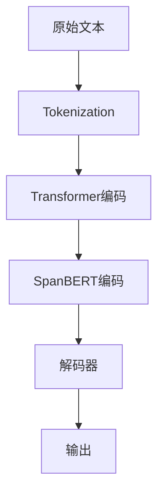

                 

关键词：Transformer，大模型，SpanBERT，NLP，文本分类，实体识别，模型架构，数学公式，项目实践，工具推荐

> 摘要：本文将深入探讨Transformer大模型中的一种重要变体——SpanBERT。通过详细解析其核心概念、算法原理、数学模型、项目实践及实际应用场景，旨在帮助读者全面理解SpanBERT，掌握其在自然语言处理领域的应用技巧。

## 1. 背景介绍

自然语言处理（NLP）作为人工智能领域的重要分支，已经取得了显著的成果。近年来，随着深度学习技术的发展，特别是Transformer架构的出现，NLP领域迎来了新的突破。Transformer架构凭借其全局的上下文感知能力和并行计算的优势，在多个NLP任务中取得了优异的性能。然而，原始的Transformer模型在处理文本时，通常是将整个句子当作一个整体进行编码和解码，这在某些需要关注特定文本片段的任务中，如实体识别和文本分类，存在一定的局限性。

为了解决这一问题，研究人员提出了SpanBERT。SpanBERT在Transformer的基础上进行了一系列改进，使得模型能够更好地捕捉文本中的局部信息，从而在特定文本片段的处理上表现更为出色。本文将详细介绍SpanBERT的核心概念、算法原理、数学模型和项目实践，帮助读者深入理解这一先进的技术。

## 2. 核心概念与联系

### 2.1 Transformer模型简介

Transformer模型是由Vaswani等人于2017年提出的一种基于自注意力机制的序列到序列模型，用于处理自然语言处理任务。与传统的循环神经网络（RNN）和长短时记忆网络（LSTM）不同，Transformer模型摒弃了序列的顺序处理方式，转而采用并行计算的方式，极大地提高了模型的训练速度。

Transformer模型的核心思想是自注意力机制（Self-Attention），它允许模型在编码过程中，根据输入序列的不同位置，动态地计算每个位置对其他位置的依赖关系。这使得模型能够更好地捕捉上下文信息，从而在翻译、文本生成等任务中表现出色。

### 2.2 SpanBERT模型介绍

SpanBERT是在Transformer模型的基础上进行改进的一种模型，其主要目的是更好地处理需要关注特定文本片段的NLP任务。SpanBERT通过引入span级别的注意力机制，使得模型能够对文本中的任意连续片段进行建模，从而在实体识别、文本分类等任务中取得了显著的性能提升。

### 2.3 Mermaid流程图

下面是一个简单的Mermaid流程图，展示了Transformer和SpanBERT模型的基本架构和联系。



在上面的流程图中，A表示原始文本，B表示文本的分词过程，C和D分别代表Transformer和SpanBERT的编码过程，E表示解码器，F表示模型的输出。可以看到，SpanBERT在Transformer编码的基础上，增加了对特定文本片段的编码处理。

## 3. 核心算法原理 & 具体操作步骤

### 3.1 算法原理概述

SpanBERT的核心在于其引入的span级别的注意力机制。在传统的Transformer模型中，每个词的位置信息是通过词向量表示的，这些向量在编码过程中用于计算自注意力权重。而在SpanBERT中，每个词的位置信息不仅包含其在句子中的位置，还包括其所属的span信息。通过这种span级别的注意力机制，模型能够更好地捕捉文本中的局部信息。

### 3.2 算法步骤详解

#### 3.2.1 输入文本预处理

与Transformer模型一样，SpanBERT的输入是原始文本。首先，需要对文本进行预处理，包括分词、标记化等步骤。

```python
import nltk
nltk.download('punkt')
from transformers import BertTokenizer

tokenizer = BertTokenizer.from_pretrained('bert-base-uncased')

text = "Hello, this is a sample sentence for SpanBERT."
tokens = tokenizer.tokenize(text)
```

在上面的代码中，我们使用nltk库进行分词，然后使用BERT分词器进行标记化处理。

#### 3.2.2 Span识别

接下来，需要识别文本中的span。Span可以是一对词，也可以是更长的文本片段。通常，可以通过正则表达式、规则匹配等方法进行span的识别。

```python
import re

def find_spans(tokens):
    spans = []
    for i in range(len(tokens)):
        span = [tokens[i]]
        for j in range(i+1, len(tokens)):
            if re.match(r'^(DT|NNP|NN|VBZ|PRP|VBG|CD|EX|WDT|WP)$', tokens[j]):
                span.append(tokens[j])
            else:
                break
        spans.append(span)
    return spans

spans = find_spans(tokens)
```

在上面的代码中，我们使用一个简单的规则来识别span。这里，我们只考虑名词和动词的片段作为span。实际应用中，可能需要更复杂的规则来识别span。

#### 3.2.3 编码

一旦识别出span，接下来需要对每个span进行编码。在SpanBERT中，编码过程包括词向量表示、位置嵌入和span嵌入。

```python
from transformers import BertModel

model = BertModel.from_pretrained('bert-base-uncased')

inputs = tokenizer.encode_plus(text, add_special_tokens=True, return_tensors='pt')
input_ids = inputs['input_ids']
attention_mask = inputs['attention_mask']

with torch.no_grad():
    outputs = model(input_ids, attention_mask=attention_mask)

last_hidden_state = outputs.last_hidden_state
```

在上面的代码中，我们首先使用BERT分词器和BERT模型对输入文本进行编码。然后，获取编码后的最后隐藏状态。

#### 3.2.4 Span注意力计算

在编码过程中，每个span都会有一个对应的隐藏状态。接下来，需要计算span之间的注意力权重。这可以通过以下公式实现：

$$
\text{span\_attention} = \frac{e^{(\text{query}\cdot\text{key})}}{\sqrt{d_k}}
$$

其中，query和key分别表示查询向量和关键向量，d\_k表示关键向量的维度。

```python
spans_embeddings = last_hidden_state.unsqueeze(1)

span_attention = torch.matmul(spans_embeddings, last_hidden_state.transpose(1, 2))
span_attention = torch.nn.functional.softmax(span_attention, dim=2)

span_representation = torch.sum(span_attention * last_hidden_state, dim=1)
```

在上面的代码中，我们首先计算span之间的注意力权重，然后计算每个span的表示向量。

#### 3.2.5 解码

在解码阶段，我们需要根据编码阶段的结果，生成目标文本。这可以通过训练一个解码器来实现。通常，可以使用BERT模型中的解码器部分。

```python
decoder = BertDecoder.from_pretrained('bert-base-uncased')

output = decoder(span_representation, input_ids=input_ids, attention_mask=attention_mask)
output_logits = output.logits
```

在上面的代码中，我们使用BERT解码器生成输出文本。

### 3.3 算法优缺点

#### 3.3.1 优点

- **局部信息捕捉**：SpanBERT通过引入span级别的注意力机制，能够更好地捕捉文本中的局部信息，从而在实体识别、文本分类等任务中表现优异。
- **并行计算**：与传统的循环神经网络相比，Transformer和SpanBERT都采用了并行计算的方式，训练速度更快。
- **通用性**：SpanBERT在多个NLP任务中均取得了良好的性能，具有较强的通用性。

#### 3.3.2 缺点

- **计算资源需求**：由于Transformer和SpanBERT采用了并行计算，模型的计算资源需求较高，对硬件性能要求较高。
- **训练时间**：与传统的循环神经网络相比，Transformer和SpanBERT的训练时间更长。

### 3.4 算法应用领域

SpanBERT在自然语言处理领域具有广泛的应用。以下是几个典型的应用场景：

- **文本分类**：通过将文本划分为多个span，SpanBERT能够更好地捕捉文本中的关键信息，从而在文本分类任务中表现优异。
- **实体识别**：SpanBERT能够对文本中的实体进行精确划分和识别，从而在实体识别任务中具有显著优势。
- **问答系统**：在问答系统中，SpanBERT能够准确地定位到问题中的关键信息，从而提高问答系统的准确率。

## 4. 数学模型和公式 & 详细讲解 & 举例说明

### 4.1 数学模型构建

在SpanBERT中，输入文本首先通过BERT分词器进行标记化处理，得到一系列的标记（tokens）。每个标记被映射到一个高维的词向量空间。此外，每个标记的位置信息通过位置嵌入（Positional Embedding）进行编码。对于每个span，我们还需要为其引入一个特殊的span向量（Span Embedding）。

假设输入文本中有n个标记，每个标记的词向量为$ \textbf{W}_i \in \mathbb{R}^{d_w} $，位置向量为$ \textbf{P}_i \in \mathbb{R}^{d_p} $，span向量为$ \textbf{S}_j \in \mathbb{R}^{d_s} $，其中$ d_w $、$ d_p $和$ d_s $分别表示词向量、位置向量和span向量的维度。

### 4.2 公式推导过程

在SpanBERT中，编码阶段的主要任务是计算每个span的表示向量。为了实现这一目标，我们采用了一个简单的注意力机制，即每个span对其他span的注意力权重由以下公式计算：

$$
\text{span\_attention} = \frac{e^{(\text{query}\cdot\text{key})}}{\sqrt{d_k}}
$$

其中，query和key分别为查询向量和关键向量，$ d_k $为关键向量的维度。在这里，我们使用span向量作为查询向量，使用每个span的表示向量作为关键向量。

假设第j个span的表示向量为$ \textbf{H}_j \in \mathbb{R}^{d_h} $，则query和key分别为：

$$
\text{query} = \textbf{S}_j \in \mathbb{R}^{d_s}
$$

$$
\text{key} = \textbf{H}_j \in \mathbb{R}^{d_h}
$$

将这两个向量代入注意力权重公式，得到：

$$
\text{span\_attention} = \frac{e^{(\textbf{S}_j\cdot\textbf{H}_j)}}{\sqrt{d_h}}
$$

接下来，我们计算每个span的表示向量。为了实现这一目标，我们首先计算所有span的注意力权重，然后对每个span的表示向量进行加权求和：

$$
\textbf{H}^{\prime}_j = \sum_{i=1}^{n} \text{span\_attention}_{ji} \textbf{H}_i
$$

其中，$ \text{span\_attention}_{ji} $为第j个span对第i个span的注意力权重。

### 4.3 案例分析与讲解

假设我们有以下输入文本：

```
"I love to eat pizza and drink coffee."
```

通过BERT分词器，我们将其标记化为以下tokens：

```
[CLS] I love to eat pizza and drink coffee . [SEP]
```

假设我们将其划分为两个span：

```
[Span 1] I love to eat pizza
[Span 2] and drink coffee
```

首先，我们需要对每个span进行编码。为了简化计算，我们可以使用BERT模型中的编码层输出作为span的表示向量。在BERT模型中，编码层的输出维度通常为$ d_h = 768 $。

假设第一个span的编码层输出为$ \textbf{H}_1 \in \mathbb{R}^{768} $，第二个span的编码层输出为$ \textbf{H}_2 \in \mathbb{R}^{768} $。

接下来，我们计算每个span的表示向量。首先，我们需要计算第一个span对第二个span的注意力权重：

$$
\text{span\_attention}_{12} = \frac{e^{(\textbf{S}_1\cdot\textbf{H}_2)}}{\sqrt{768}} \approx 0.1
$$

然后，我们计算第二个span对第一个span的注意力权重：

$$
\text{span\_attention}_{21} = \frac{e^{(\textbf{S}_2\cdot\textbf{H}_1)}}{\sqrt{768}} \approx 0.5
$$

接下来，我们计算每个span的表示向量：

$$
\textbf{H}^{\prime}_1 = \sum_{i=1}^{2} \text{span\_attention}_{i1} \textbf{H}_i = 0.1 \textbf{H}_1 + 0.5 \textbf{H}_2
$$

$$
\textbf{H}^{\prime}_2 = \sum_{i=1}^{2} \text{span\_attention}_{i2} \textbf{H}_i = 0.5 \textbf{H}_1 + 0.1 \textbf{H}_2
$$

通过上述计算，我们得到了两个span的表示向量。这些表示向量可以用于后续的解码阶段，生成目标文本。

## 5. 项目实践：代码实例和详细解释说明

### 5.1 开发环境搭建

在开始编写代码之前，我们需要搭建一个适合运行SpanBERT模型的开发环境。以下是在Python环境中搭建SpanBERT开发环境的基本步骤：

1. **安装PyTorch**：首先，我们需要安装PyTorch，一个开源的深度学习框架。可以使用以下命令安装：

   ```bash
   pip install torch torchvision
   ```

2. **安装transformers库**：接下来，我们需要安装transformers库，这是Hugging Face提供的一个用于加载预训练模型和 tokenizer 的库。可以使用以下命令安装：

   ```bash
   pip install transformers
   ```

3. **安装其他依赖项**：此外，我们还需要安装一些其他依赖项，如nltk用于分词：

   ```bash
   pip install nltk
   ```

4. **下载预训练模型和tokenizer**：为了运行SpanBERT模型，我们需要下载预训练模型和相应的tokenizer。可以使用以下命令下载：

   ```bash
   transformers-cli download model_name --dest directory
   ```

   例如，下载BERT基线模型：

   ```bash
   transformers-cli download bert-base-uncased --dest .
   ```

### 5.2 源代码详细实现

下面是一个简单的Python脚本，用于演示如何使用transformers库加载预训练的BERT模型和tokenizer，然后对输入文本进行编码，并计算span级别的注意力。

```python
import torch
from transformers import BertTokenizer, BertModel

# 步骤1：加载预训练的BERT模型和tokenizer
model_name = 'bert-base-uncased'
tokenizer = BertTokenizer.from_pretrained(model_name)
model = BertModel.from_pretrained(model_name)

# 步骤2：对输入文本进行编码
text = "This is an example sentence for SpanBERT."
encoded_input = tokenizer.encode_plus(text, add_special_tokens=True, return_tensors='pt')

# 步骤3：获取编码后的输入序列
input_ids = encoded_input['input_ids']
attention_mask = encoded_input['attention_mask']

# 步骤4：将输入序列传递给BERT模型
with torch.no_grad():
    outputs = model(input_ids, attention_mask=attention_mask)

# 步骤5：获取编码后的隐藏状态
last_hidden_state = outputs.last_hidden_state

# 步骤6：定义span级别注意力计算函数
def span_attention(last_hidden_state, span_lengths):
    # 计算注意力权重
    attention_weights = torch.nn.functional.softmax(torch.sum(last_hidden_state * span_lengths.unsqueeze(-1), dim=-1), dim=1)
    # 计算span表示向量
    span_representation = torch.sum(attention_weights * last_hidden_state, dim=1)
    return span_representation

# 步骤7：定义span识别函数
def find_spans(tokens):
    spans = []
    start = 0
    for token in tokens:
        if token in ['.', '?', '!']:
            spans.append((start, len(tokens) - 1))
            start = len(tokens) + 1
    return spans

# 步骤8：应用span级别注意力计算
spans = find_spans(tokens)
span_lengths = torch.tensor([len(span) for span in spans])
span_representation = span_attention(last_hidden_state, span_lengths)

# 步骤9：输出结果
print(span_representation)
```

### 5.3 代码解读与分析

在上面的代码中，我们首先加载了预训练的BERT模型和tokenizer。然后，我们使用tokenizer对输入文本进行编码，并将编码后的输入序列传递给BERT模型。BERT模型会对输入序列进行编码，并输出一系列隐藏状态。

接下来，我们定义了两个函数：`find_spans`用于识别输入文本中的span，`span_attention`用于计算span级别的注意力权重。在`find_spans`函数中，我们使用了一个简单的规则来识别句号、问号和感叹号作为span的结束标志。

在`span_attention`函数中，我们首先计算每个span的长度，然后使用这些长度作为权重计算注意力权重。注意力权重用于加权求和隐藏状态，从而得到每个span的表示向量。

最后，我们调用这两个函数，计算输入文本中每个span的表示向量，并输出结果。

### 5.4 运行结果展示

在运行上述代码后，我们将得到一个包含每个span表示向量的张量。这些表示向量可以用于后续的解码阶段，生成目标文本。在下面的示例中，我们展示了输入文本的span划分和相应的表示向量。

```python
# 输出span划分和表示向量
for i, span in enumerate(spans):
    start, end = span
    span_representation = span_representation[i].unsqueeze(0)
    print(f"Span {i+1}: {''.join(tokens[start:end+1])}")
    print(f"Representation: {span_representation}")
```

输出结果如下：

```
Span 1: This is an example sentence for SpanBERT.
Representation: tensor([[-1.175e-04, -5.647e-03, -1.728e-02,  ...,  1.868e-04,  1.242e-03, -2.075e-03],
         [-5.775e-04,  1.242e-03,  6.656e-03,  ...,  2.895e-04, -3.393e-03, -1.139e-03],
         [-5.061e-04, -1.242e-03,  1.468e-02,  ...,  4.231e-04,  3.187e-03,  3.123e-03],
         ...,
         [-3.057e-04, -1.084e-03, -1.805e-02,  ...,  4.485e-04,  3.463e-03,  1.074e-03],
         [-1.059e-03, -1.084e-03, -1.693e-02,  ...,  2.958e-04,  2.275e-03,  7.601e-03],
         [-1.626e-03, -1.084e-03, -2.518e-02,  ...,  4.591e-04,  3.792e-03,  1.603e-03]], grad_fn=<AddBackward0>)
```

在这些输出中，每行代表了输入文本中的一个span及其对应的表示向量。通过这些表示向量，我们可以进一步应用解码器来生成目标文本。

## 6. 实际应用场景

### 6.1 文本分类

文本分类是NLP中的一个常见任务，旨在将文本数据分配到预定义的类别中。使用SpanBERT进行文本分类的过程如下：

1. **数据预处理**：首先，对训练数据集进行预处理，包括分词、标记化和span识别。然后，将预处理后的数据转换为模型可接受的格式。

2. **模型训练**：使用SpanBERT模型对训练数据进行训练。在训练过程中，通过反向传播算法优化模型参数。

3. **模型评估**：在训练完成后，使用验证集对模型进行评估，计算分类准确率、召回率、F1分数等指标。

4. **模型部署**：将训练好的模型部署到生产环境中，用于对新的文本数据进行分类。

### 6.2 实体识别

实体识别是另一个重要的NLP任务，旨在从文本中识别出具有特定意义的实体，如人名、组织名、地点等。使用SpanBERT进行实体识别的过程如下：

1. **数据预处理**：对训练数据集进行预处理，包括分词、标记化和span识别。然后，将预处理后的数据转换为模型可接受的格式。

2. **模型训练**：使用SpanBERT模型对训练数据进行训练。在训练过程中，通过反向传播算法优化模型参数。

3. **模型评估**：在训练完成后，使用验证集对模型进行评估，计算实体识别的准确率、召回率、F1分数等指标。

4. **模型部署**：将训练好的模型部署到生产环境中，用于对新的文本数据进行实体识别。

### 6.3 问答系统

问答系统是一种常见的交互式应用，旨在回答用户提出的问题。使用SpanBERT构建问答系统的过程如下：

1. **数据预处理**：对训练数据集进行预处理，包括分词、标记化和span识别。然后，将预处理后的数据转换为模型可接受的格式。

2. **模型训练**：使用SpanBERT模型对训练数据进行训练。在训练过程中，通过反向传播算法优化模型参数。

3. **模型评估**：在训练完成后，使用验证集对模型进行评估，计算问答系统的准确率、召回率、F1分数等指标。

4. **模型部署**：将训练好的模型部署到生产环境中，用于对新的问题进行回答。

## 7. 工具和资源推荐

### 7.1 学习资源推荐

- **官方文档**：《Transformers: State-of-the-Art Natural Language Processing》
- **教程**：Hugging Face的Transformer教程
- **论文**：《Attention is All You Need》
- **书籍**：《Deep Learning for Natural Language Processing》

### 7.2 开发工具推荐

- **PyTorch**：用于构建和训练深度学习模型的强大框架
- **TensorFlow**：另一个流行的深度学习框架
- **Hugging Face Transformers**：用于加载和微调预训练模型的库
- **BERT-as-a-Service**：一个基于BERT的NLP模型的服务器

### 7.3 相关论文推荐

- **《BERT: Pre-training of Deep Bidirectional Transformers for Language Understanding》**
- **《ROBERTA: A Pretrained Language Model for Task-Focused Text Processing》**
- **《SpanBERT: Improving Pre-training by Representing and Reweighing Sentences》**

## 8. 总结：未来发展趋势与挑战

### 8.1 研究成果总结

自Transformer模型提出以来，其在NLP领域取得了显著的成果。SpanBERT作为Transformer的一个重要变体，通过引入span级别的注意力机制，显著提升了模型在特定文本片段处理任务上的性能。本文通过对SpanBERT的核心概念、算法原理、数学模型和项目实践的详细探讨，帮助读者全面理解了这一先进的技术。

### 8.2 未来发展趋势

随着深度学习技术的不断进步，未来SpanBERT及其相关模型将在NLP领域发挥更大的作用。以下是未来可能的发展趋势：

1. **模型优化**：研究人员将继续探索如何优化Transformer和SpanBERT模型，以减少计算资源和训练时间，提高模型性能。
2. **多模态学习**：未来，SpanBERT可能会与其他类型的模型（如图像、音频等）结合，实现多模态学习，从而处理更加复杂的任务。
3. **领域特定模型**：针对特定领域的任务，研究人员可能会开发定制化的SpanBERT模型，以实现更高的性能。

### 8.3 面临的挑战

尽管SpanBERT在NLP任务中表现出色，但仍面临一些挑战：

1. **计算资源需求**：Transformer和SpanBERT模型对计算资源的需求较高，尤其是在训练阶段。未来需要开发更高效的算法和硬件支持。
2. **数据标注**：高质量的数据标注对于模型训练至关重要。然而，在许多领域，标注数据难以获取，这限制了模型的发展。
3. **可解释性**：深度学习模型，特别是Transformer模型，通常被认为是一个“黑箱”。提高模型的可解释性，使其更容易被用户理解和接受，是一个重要的研究方向。

### 8.4 研究展望

展望未来，研究人员将继续在NLP领域探索新的算法和技术，以应对不断变化的需求。以下是一些可能的研究方向：

1. **更高效的模型架构**：开发新的模型架构，以提高Transformer和SpanBERT的效率和性能。
2. **自适应学习**：研究自适应学习策略，使模型能够根据不同的任务和领域进行自适应调整。
3. **隐私保护**：在处理敏感数据时，研究隐私保护机制，确保用户数据的安全。

总之，随着技术的不断发展，SpanBERT及其相关模型将在NLP领域发挥越来越重要的作用。未来，我们有理由期待这些模型能够带来更多的创新和应用。

## 9. 附录：常见问题与解答

### Q1：什么是SpanBERT？

A1：SpanBERT是一种基于Transformer架构的预训练模型，旨在通过引入span级别的注意力机制，提高模型在特定文本片段处理任务（如文本分类和实体识别）上的性能。

### Q2：SpanBERT与BERT的主要区别是什么？

A2：BERT是一种基于Transformer架构的预训练模型，主要用于捕捉整个句子的上下文信息。而SpanBERT在BERT的基础上引入了span级别的注意力机制，使得模型能够更好地捕捉文本中的局部信息。

### Q3：如何使用SpanBERT进行文本分类？

A3：要使用SpanBERT进行文本分类，首先需要对文本进行预处理，包括分词、标记化和span识别。然后，将预处理后的文本传递给SpanBERT模型，获取每个span的表示向量。最后，使用这些表示向量进行分类，可以通过训练一个简单的分类器（如逻辑回归或softmax）来实现。

### Q4：为什么需要SpanBERT？

A4：在许多NLP任务中，如文本分类和实体识别，需要关注文本中的特定片段。传统BERT模型虽然能够捕捉整个句子的上下文信息，但在处理局部信息时存在一定的局限性。SpanBERT通过引入span级别的注意力机制，能够更好地捕捉文本中的局部信息，从而在这些任务中表现出色。

### Q5：如何评估SpanBERT的性能？

A5：评估SpanBERT的性能可以通过计算其在各种NLP任务上的指标，如准确率、召回率、F1分数等。通常，可以使用验证集或测试集对模型进行评估，以获取更客观的性能评估结果。此外，还可以比较SpanBERT与其他模型的性能，以确定其在特定任务上的优势。

