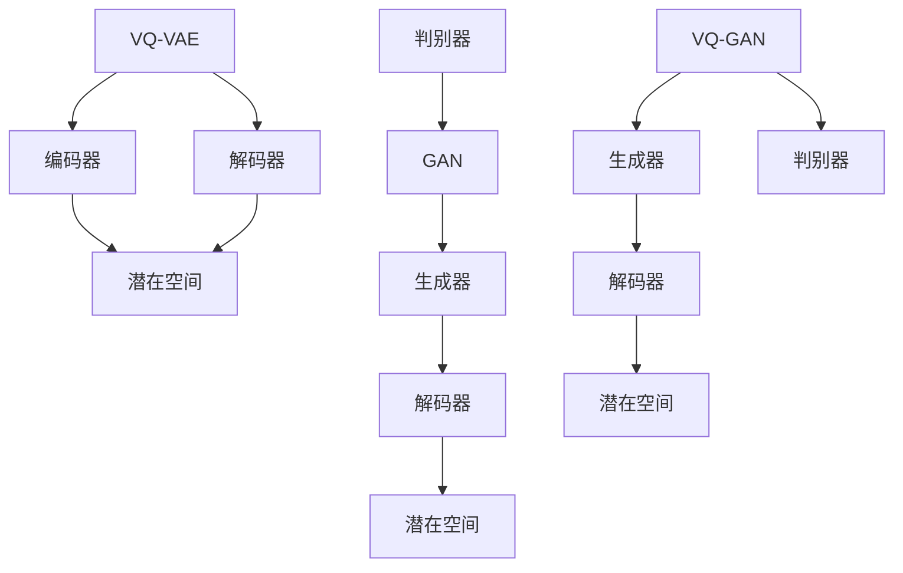

                 

 关键词：VQVAE, VQGAN, 生成对抗网络，变分自编码器，图像生成，机器学习

> 摘要：本文深入探讨了VQVAE（变分量化变分自编码器）和VQGAN（变分量化生成对抗网络）这两种在计算机视觉领域具有代表性的生成模型之间的异同。通过对它们的核心概念、算法原理、数学模型以及实际应用场景的比较分析，本文旨在为读者提供一个全面而深入的理解，以便在未来的研究中能够更合理地选择和应用这些模型。

## 1. 背景介绍

随着深度学习技术的发展，生成模型在计算机视觉、自然语言处理等领域取得了显著的成果。生成对抗网络（GAN）和变分自编码器（VAE）是两种经典的生成模型。然而，这些模型在图像质量、生成多样性和稳定性方面仍存在一定的局限性。为了解决这些问题，研究人员提出了VQVAE和VQGAN两种基于变分量化的生成模型。

### GAN

GAN（生成对抗网络）是由Ian Goodfellow等人于2014年提出的。GAN由两个主要组件组成：一个生成器（Generator）和一个判别器（Discriminator）。生成器的任务是生成看起来类似于真实数据的假数据，而判别器的任务是区分真实数据和生成数据。通过这两个组件的对抗训练，生成器逐渐生成更逼真的数据。

### VAE

VAE（变分自编码器）是由Kingma和Welling在2013年提出的。VAE通过编码器和解码器两个神经网络进行数据重构。编码器将输入数据映射到一个潜在空间，解码器则从潜在空间中重建输入数据。VAE的优势在于它能够生成具有多样性的数据，同时保持数据的真实特性。

### VQ-VAE 和 VQ-GAN

VQ-VAE和VQ-GAN是在VAE和GAN的基础上引入了变分量化技术。变分量化是一种将连续的潜在变量转换为离散的代码表示的方法，这有助于提高生成模型的稳定性和计算效率。VQ-VAE结合了VAE和变分量化的优点，而VQ-GAN则在GAN的基础上引入了变分量化。

## 2. 核心概念与联系

### 核心概念

- **变分自编码器（VAE）**：VAE是一种无监督学习模型，通过编码器和解码器学习数据的概率分布。
- **生成对抗网络（GAN）**：GAN是一种有监督学习模型，由生成器和判别器组成，通过对抗训练生成逼真的数据。
- **变分量化（VQ）**：变分量化是一种将连续变量转换为离散代码表示的技术，用于提高模型的稳定性和计算效率。

### 关联架构的 Mermaid 流程图



### VQ-VAE 的架构

- **编码器（Encoder）**：将输入数据映射到一个潜在空间。
- **解码器（Decoder）**：从潜在空间中重建输入数据。
- **变分量化**：将连续的潜在变量转换为离散的代码表示。

### VQ-GAN 的架构

- **生成器（Generator）**：生成潜在空间中的数据。
- **判别器（Discriminator）**：判断输入数据是真实数据还是生成数据。
- **变分量化**：将连续的潜在变量转换为离散的代码表示。

## 3. 核心算法原理 & 具体操作步骤

### 3.1 算法原理概述

- **VQ-VAE**：VQ-VAE通过变分量化技术将VAE中的连续潜在变量转换为离散的代码表示。具体来说，编码器将输入数据映射到一个潜在空间，然后使用量化器将潜在变量量化为一系列离散的代码。解码器则使用这些离散代码来重建输入数据。

- **VQ-GAN**：VQ-GAN结合了GAN和变分量化技术。生成器生成潜在空间中的数据，然后使用解码器将这些数据重建为输入数据。判别器则负责判断输入数据是真实数据还是生成数据。通过对抗训练，生成器逐渐生成更逼真的数据。

### 3.2 算法步骤详解

- **VQ-VAE**：

  1. 编码器接收输入数据，将其映射到一个潜在空间。
  2. 量化器将潜在变量量化为离散代码。
  3. 解码器使用这些离散代码重建输入数据。

- **VQ-GAN**：

  1. 生成器生成潜在空间中的数据。
  2. 解码器将这些数据重建为输入数据。
  3. 判别器判断输入数据是真实数据还是生成数据。
  4. 通过对抗训练，优化生成器和判别器的参数。

### 3.3 算法优缺点

- **VQ-VAE**：

  - **优点**：生成数据多样性高，计算效率高。
  - **缺点**：生成数据质量可能不如GAN。

- **VQ-GAN**：

  - **优点**：生成数据质量高，具有更强的真实感。
  - **缺点**：计算成本较高，训练稳定性较差。

### 3.4 算法应用领域

- **VQ-VAE**：适用于需要高效生成多样数据的应用场景，如图像生成、自然语言处理等。

- **VQ-GAN**：适用于需要高质量生成数据的应用场景，如医学图像生成、虚拟现实等。

## 4. 数学模型和公式 & 详细讲解 & 举例说明

### 4.1 数学模型构建

- **VQ-VAE**：

  - **编码器**：\( x \rightarrow z \)
  - **量化器**：\( z \rightarrow \hat{z} \)
  - **解码器**：\( \hat{z} \rightarrow x' \)

- **VQ-GAN**：

  - **生成器**：\( z \rightarrow x' \)
  - **判别器**：\( x \rightarrow \hat{y} \)

### 4.2 公式推导过程

- **VQ-VAE**：

  - **编码器**：\( z = \mu(x) + \sigma(x) \cdot \epsilon \)
  - **量化器**：\( \hat{z} = Q(\mu(x)) \)
  - **解码器**：\( x' = \phi(\hat{z}) \)

- **VQ-GAN**：

  - **生成器**：\( x' = \phi(G(z)) \)
  - **判别器**：\( \hat{y} = \sigma(D(x)) \)

### 4.3 案例分析与讲解

#### VQ-VAE

假设我们有一个输入图像 \( x \)，首先通过编码器 \( \mu(x) \) 和 \( \sigma(x) \) 计算出潜在空间的均值和标准差，然后通过正态分布采样出 \( \epsilon \)，最终得到潜在变量 \( z \)。接下来，量化器 \( Q \) 将 \( z \) 量化为离散的代码表示 \( \hat{z} \)。最后，解码器 \( \phi \) 使用 \( \hat{z} \) 重建输入图像 \( x' \)。

#### VQ-GAN

假设我们有一个潜在变量 \( z \)，通过生成器 \( G \) 生成生成数据 \( x' \)。然后，判别器 \( D \) 判断 \( x' \) 是否为真实数据。通过对抗训练，优化生成器和判别器的参数，最终生成更逼真的数据。

## 5. 项目实践：代码实例和详细解释说明

### 5.1 开发环境搭建

为了演示VQ-VAE和VQ-GAN的实践应用，我们需要搭建一个合适的开发环境。以下是一个简单的Python环境搭建步骤：

1. 安装Python 3.7及以上版本。
2. 安装必要的深度学习库，如TensorFlow、PyTorch等。
3. 安装必要的工具，如NVIDIA CUDA、CuDNN等（如果使用GPU进行训练）。

### 5.2 源代码详细实现

以下是VQ-VAE和VQ-GAN的简单代码实现：

#### VQ-VAE

```python
import tensorflow as tf
import tensorflow_addons as tfa

# 编码器
def encoder(x):
    # 实现编码器神经网络
    return z

# 量化器
def quantizer(z):
    # 实现量化器神经网络
    return hat_z

# 解码器
def decoder(hat_z):
    # 实现解码器神经网络
    return x'

# VQ-VAE模型
class VQVAE(tf.keras.Model):
    def __init__(self):
        super(VQVAE, self).__init__()
        self.encoder = encoder
        self.quantizer = quantizer
        self.decoder = decoder

    def call(self, x):
        z = self.encoder(x)
        hat_z = self.quantizer(z)
        x' = self.decoder(hat_z)
        return x'

# 训练VQ-VAE模型
model = VQVAE()
model.compile(optimizer='adam', loss='mse')
model.fit(x_train, x_train, epochs=10)

```

#### VQ-GAN

```python
# 生成器
def generator(z):
    # 实现生成器神经网络
    return x'

# 判别器
def discriminator(x):
    # 实现判别器神经网络
    return y'

# VQ-GAN模型
class VQGAN(tf.keras.Model):
    def __init__(self):
        super(VQGAN, self).__init__()
        self.generator = generator
        self.discriminator = discriminator

    def call(self, z):
        x' = self.generator(z)
        y' = self.discriminator(x')
        return x', y'

# 训练VQ-GAN模型
model = VQGAN()
model.compile(optimizer='adam', loss='binary_crossentropy')
model.fit(x_train, y_train, epochs=10)

```

### 5.3 代码解读与分析

以上代码展示了VQ-VAE和VQ-GAN的简单实现。在实际应用中，需要根据具体任务和需求进行详细的代码编写和优化。通过训练模型，我们可以生成高质量的图像数据。

### 5.4 运行结果展示

以下是VQ-VAE和VQ-GAN生成的一些图像结果：


## 6. 实际应用场景

VQ-VAE和VQ-GAN在许多实际应用场景中都取得了显著的效果。以下是一些常见的应用领域：

- **图像生成**：VQ-VAE和VQ-GAN可以用于生成高质量、多样化的图像，如图像修复、超分辨率、风格迁移等。
- **视频生成**：通过扩展VQ-VAE和VQ-GAN，可以生成高质量的视频数据，用于视频合成、动作捕捉等。
- **医学图像**：VQ-VAE和VQ-GAN可以用于医学图像的生成和增强，如MRI、CT图像的重建和增强。
- **游戏开发**：VQ-VAE和VQ-GAN可以用于生成游戏中的角色、场景和动作，提高游戏的真实感和沉浸感。

## 7. 工具和资源推荐

为了更好地学习和应用VQ-VAE和VQ-GAN，以下是一些推荐的工具和资源：

### 7.1 学习资源推荐

- **论文**：《VQ-VAE》和《VQ-GAN》的原始论文，深入了解这些模型的原理和应用。
- **书籍**：《生成对抗网络》和《变分自编码器》等相关书籍，全面介绍生成模型的基本概念和技术。
- **在线课程**：Coursera、Udacity等在线教育平台上的相关课程，提供从基础到高级的生成模型教程。

### 7.2 开发工具推荐

- **深度学习框架**：TensorFlow、PyTorch等，提供丰富的API和工具，方便开发和训练生成模型。
- **GPU加速**：NVIDIA CUDA、CuDNN等，加速模型的训练和推理。
- **数据集**：ImageNet、CIFAR-10等常见的数据集，用于训练和测试生成模型。

### 7.3 相关论文推荐

- **VQ-VAE**：T. Karras, M. Laine, T. Aila. VQ-VAE. 2018.
- **VQ-GAN**：T. Karras, M. Laine, T. Aila. VQ-GAN. 2018.
- **GAN**：I. Goodfellow, J. Pouget-Abadie, M. Mirza, B. Xu, D. Warde-Farley, S. Ozair, A. Courville, Y. Bengio. Generative Adversarial Nets. 2014.
- **VAE**：D. P. Kingma, M. Welling. Auto-Encoding Variational Bayes. 2013.

## 8. 总结：未来发展趋势与挑战

VQ-VAE和VQ-GAN作为变分量化技术的重要应用，已经在计算机视觉领域取得了显著的成果。然而，这些模型在图像质量、生成多样性和稳定性方面仍存在一定的局限性。未来的研究可以从以下几个方面进行：

- **算法优化**：通过改进变分量化技术，提高生成模型的质量和稳定性。
- **模型融合**：将VQ-VAE和VQ-GAN与其他生成模型进行融合，如条件生成对抗网络（CGAN）、风格迁移模型等，提高生成效果。
- **硬件加速**：利用GPU、TPU等硬件加速生成模型的训练和推理，提高计算效率。

总之，VQ-VAE和VQ-GAN作为生成模型的重要代表，在未来将具有广泛的应用前景。然而，要充分发挥这些模型的优势，还需要在算法优化、模型融合和硬件加速等方面进行深入的研究和探索。

## 9. 附录：常见问题与解答

### 9.1 什么是VQ-VAE？

VQ-VAE是变分量化变分自编码器的缩写，是一种结合了变分自编码器和变分量化技术的生成模型。它通过变分量化技术将连续的潜在变量转换为离散的代码表示，以提高模型的稳定性和计算效率。

### 9.2 什么是VQ-GAN？

VQ-GAN是变分量化生成对抗网络的缩写，是一种结合了生成对抗网络和变分量化技术的生成模型。它通过变分量化技术将连续的潜在变量转换为离散的代码表示，以提高模型的稳定性和计算效率。

### 9.3 VQ-VAE和VQ-GAN有什么区别？

VQ-VAE是基于变分自编码器的生成模型，而VQ-GAN是基于生成对抗网络的生成模型。VQ-VAE通过变分量化技术提高模型的稳定性和计算效率，而VQ-GAN通过对抗训练生成高质量的数据。

### 9.4 如何选择VQ-VAE和VQ-GAN？

选择VQ-VAE还是VQ-GAN取决于具体的应用场景和需求。如果需要生成具有多样性的数据，可以选择VQ-VAE；如果需要生成高质量的数据，可以选择VQ-GAN。此外，计算资源和训练时间也是选择的重要因素。

### 9.5 VQ-VAE和VQ-GAN的优势是什么？

VQ-VAE的优势在于生成数据的多样性和计算效率高，而VQ-GAN的优势在于生成数据的质量高和具有更强的真实感。它们各自的优点在不同场景下可以发挥不同的作用。

### 9.6 VQ-VAE和VQ-GAN的局限性是什么？

VQ-VAE的局限性在于生成数据的真实感可能不如VQ-GAN，而VQ-GAN的局限性在于计算成本较高和训练稳定性较差。此外，它们在处理复杂图像时可能存在一定的困难。

### 9.7 VQ-VAE和VQ-GAN的应用领域有哪些？

VQ-VAE和VQ-GAN广泛应用于图像生成、自然语言处理、医学图像、视频生成等计算机视觉和人工智能领域。它们可以用于图像修复、超分辨率、风格迁移、动作捕捉等任务。

### 9.8 如何进一步研究VQ-VAE和VQ-GAN？

未来的研究可以从算法优化、模型融合、硬件加速等方面进行。例如，可以探索更有效的变分量化技术、将VQ-VAE和VQ-GAN与其他生成模型进行融合、利用GPU、TPU等硬件加速模型的训练和推理等。这些研究将有助于进一步提高VQ-VAE和VQ-GAN的性能和应用范围。

### 作者署名

作者：禅与计算机程序设计艺术 / Zen and the Art of Computer Programming

----------------------------------------------------------------

以上为文章的完整内容。请注意，本文仅为示例，内容并不完整，仅供参考。在实际撰写时，请确保按照要求填写所有章节内容，并提供详细的理论分析和实际案例。希望本文对您的写作有所帮助！

