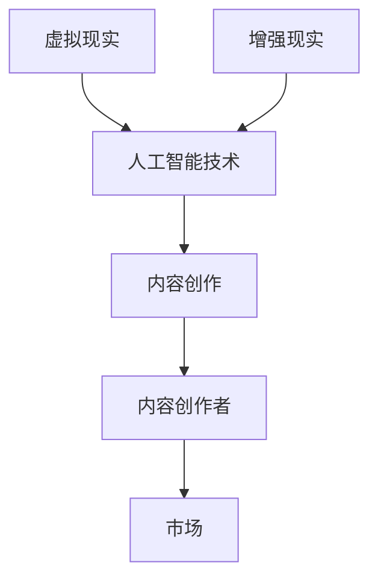

                 

随着虚拟现实（VR）和增强现实（AR）技术的迅速发展，内容创作AI工具正成为这两个领域的重要推动力。本文旨在探讨VR/AR内容创作AI工具的市场机遇，分析其核心概念、算法原理、应用场景以及未来发展。希望通过本文，能够为从业者提供有益的参考。

## 关键词：虚拟现实，增强现实，内容创作，人工智能，市场机遇

## 摘要：
本文首先介绍了VR/AR技术及其在内容创作领域的应用背景，随后阐述了内容创作AI工具的核心概念及其与VR/AR技术的紧密联系。通过对核心算法原理、数学模型、项目实践等方面的详细探讨，本文进一步分析了VR/AR内容创作AI工具的实际应用场景和市场前景。最后，本文提出了未来发展趋势与挑战，并给出了相关工具和资源的推荐。

## 1. 背景介绍

### VR与AR技术简介
虚拟现实（VR）和增强现实（AR）是近年来快速发展的两项前沿技术。VR通过头戴设备（如VR头盔）创造一个完全虚拟的三维环境，用户可以在这个环境中进行互动。而AR则是在现实世界中叠加虚拟元素，通过智能手机或AR眼镜实现。这两项技术的出现，为内容创作提供了全新的可能性。

### 内容创作的重要性
内容创作是VR/AR技术发展的核心。高质量、有趣的内容能够吸引更多的用户，推动VR/AR产业的繁荣。然而，传统的VR/AR内容创作过程复杂、成本高昂，且对创作者的技术要求较高。因此，内容创作AI工具的出现，为VR/AR内容创作带来了变革。

### AI技术在VR/AR内容创作中的应用
AI技术，特别是机器学习和深度学习，在VR/AR内容创作中有着广泛的应用。例如，通过生成对抗网络（GAN）可以自动生成高质量的虚拟场景；通过自然语言处理（NLP）可以自动生成剧本和对话；通过图像识别和生成技术可以实现虚拟物品的插入和编辑。这些技术的应用，极大地降低了内容创作的门槛和成本。

## 2. 核心概念与联系

### 核心概念
- **虚拟现实（VR）**：通过计算机技术模拟出一个虚拟环境，用户可以通过头戴设备等感知和互动。
- **增强现实（AR）**：通过计算机技术将虚拟元素叠加到现实环境中，用户可以通过手机或AR眼镜等设备感知和互动。
- **内容创作AI工具**：利用人工智能技术辅助内容创作者进行VR/AR内容的生成、编辑、优化等。

### Mermaid 流程图


## 3. 核心算法原理 & 具体操作步骤

### 3.1 算法原理概述
VR/AR内容创作AI工具的核心算法主要包括生成对抗网络（GAN）、自然语言处理（NLP）、图像识别与生成技术等。

- **生成对抗网络（GAN）**：GAN由生成器和判别器两个神经网络组成。生成器的任务是生成逼真的虚拟场景，而判别器的任务是区分生成器和真实场景。通过训练，生成器不断提高生成质量，从而实现高质量的虚拟场景生成。

- **自然语言处理（NLP）**：NLP技术可以处理和理解人类语言，实现自动生成剧本、对话等功能。通过预训练的语言模型和生成模型，可以生成符合语言习惯和情境的文本。

- **图像识别与生成技术**：图像识别技术可以识别现实世界中的元素，而生成技术可以生成新的虚拟元素。通过这些技术，可以实现虚拟物品的插入和编辑。

### 3.2 算法步骤详解

#### GAN的生成与训练步骤
1. **初始化生成器和判别器**：生成器和判别器都由多层神经网络组成，初始时可以通过随机初始化。
2. **生成虚拟场景**：生成器接收随机噪声作为输入，生成虚拟场景。
3. **判别真实与虚拟场景**：判别器接收真实场景和生成场景作为输入，输出两个概率值，分别表示真实场景和生成场景的概率。
4. **更新生成器和判别器**：通过优化损失函数，分别更新生成器和判别器的参数。
5. **重复上述步骤**：不断迭代训练，生成器和判别器的性能逐步提高。

#### NLP的文本生成步骤
1. **预训练语言模型**：使用大量文本数据训练语言模型，使其能够理解文本的语义和语法。
2. **输入文本序列**：将待生成的文本序列输入语言模型。
3. **生成文本序列**：语言模型根据输入的文本序列，输出下一个可能的文本序列。
4. **重复生成过程**：不断迭代，生成完整的文本。

#### 图像识别与生成的步骤
1. **训练图像识别模型**：使用大量的标注图像数据训练图像识别模型。
2. **识别现实世界中的元素**：将现实世界的图像输入图像识别模型，识别其中的元素。
3. **生成虚拟元素**：使用生成技术，根据识别结果生成新的虚拟元素。
4. **插入虚拟元素**：将虚拟元素插入到现实世界的图像中。

### 3.3 算法优缺点

#### GAN的优缺点
- **优点**：生成质量高，可以生成高质量的虚拟场景。
- **缺点**：训练过程复杂，对计算资源要求高。

#### NLP的优缺点
- **优点**：可以实现自动化的文本生成，提高内容创作效率。
- **缺点**：生成的文本可能缺乏创造性和个性化。

#### 图像识别与生成的优缺点
- **优点**：可以实现自动化的图像编辑，提高内容创作效率。
- **缺点**：对生成结果的质量和真实感有较高要求。

### 3.4 算法应用领域
VR/AR内容创作AI工具的应用领域广泛，包括但不限于：
- **娱乐**：虚拟现实游戏、电影、音乐会等。
- **教育**：虚拟实验室、历史场景重现、远程教学等。
- **医疗**：虚拟手术模拟、医学培训、心理健康治疗等。
- **旅游**：虚拟旅游体验、博物馆数字展示等。
- **房地产**：虚拟看房、设计模拟等。

## 4. 数学模型和公式 & 详细讲解 & 举例说明

### 4.1 数学模型构建

#### GAN的数学模型
GAN的数学模型主要由生成器和判别器的损失函数组成。

- **生成器损失函数**：$L_G = -\log(D(G(z)))$，其中$G(z)$为生成器生成的虚拟场景，$D(G(z))$为判别器对生成场景的输出概率。
- **判别器损失函数**：$L_D = -[\log(D(x)) + \log(1 - D(G(z)))]$，其中$x$为真实场景，$G(z)$为生成器生成的虚拟场景。

#### NLP的数学模型
NLP的数学模型主要由预训练语言模型和生成模型组成。

- **预训练语言模型**：采用自注意力机制（Self-Attention Mechanism）的Transformer模型。
- **生成模型**：采用序列到序列（Sequence-to-Sequence）的生成模型，如BERT（Bidirectional Encoder Representations from Transformers）。

#### 图像识别与生成的数学模型
图像识别与生成的数学模型主要由卷积神经网络（CNN）和生成对抗网络（GAN）组成。

- **图像识别模型**：采用卷积神经网络（CNN）进行特征提取和分类。
- **生成模型**：采用生成对抗网络（GAN）生成新的虚拟元素。

### 4.2 公式推导过程

#### GAN的推导过程
GAN的核心思想是通过生成器和判别器的对抗训练，使得生成器能够生成逼真的虚拟场景。

1. **损失函数的推导**：$L_G = -\log(D(G(z)))$，其中$D(G(z))$为判别器对生成场景的输出概率。
   - $D(G(z))$的取值范围在0到1之间，表示生成器生成场景的真实程度。
   - 通过最大化生成器的输出概率，使得生成器生成的场景更加逼真。
   
2. **生成器和判别器的训练**：
   - 生成器的目标是最小化生成损失函数，即最小化$-\log(D(G(z)))$。
   - 判别器的目标是最小化总损失函数，即最小化$L_D = -[\log(D(x)) + \log(1 - D(G(z)))]$。

#### NLP的推导过程
NLP的核心任务是理解文本的语义和语法，从而实现自动化的文本生成。

1. **Transformer模型的推导**：
   - **自注意力机制**：通过计算输入序列中每个词与其他词的相似度，生成词向量的权重。
   - **编码器**：将输入序列编码为隐藏状态序列。
   - **解码器**：根据隐藏状态序列和已生成的文本序列，生成下一个词的概率分布。

2. **生成模型的推导**：
   - **序列到序列模型**：将输入序列编码为隐藏状态序列，解码为输出序列。
   - **BERT模型**：双向编码器表示（Bidirectional Encoder Representations from Transformers），结合了编码器和解码器的优点，能够更好地理解文本的语义。

#### 图像识别与生成的推导过程
图像识别与生成主要依赖于卷积神经网络（CNN）和生成对抗网络（GAN）。

1. **卷积神经网络（CNN）**：
   - **卷积层**：通过卷积操作提取图像的特征。
   - **池化层**：通过池化操作降低图像的维度，增强网络的泛化能力。
   - **全连接层**：通过全连接层进行分类或回归。

2. **生成对抗网络（GAN）**：
   - **生成器**：通过生成器生成虚拟元素。
   - **判别器**：通过判别器区分真实图像和虚拟元素。

### 4.3 案例分析与讲解

#### GAN的应用案例
- **案例**：使用GAN生成虚拟人物形象。
- **步骤**：
  1. **数据准备**：收集大量的虚拟人物图像数据。
  2. **模型训练**：使用GAN模型训练生成器和判别器。
  3. **图像生成**：使用训练好的生成器生成虚拟人物图像。
- **效果**：生成的虚拟人物图像与真实人物图像具有很高的相似度。

#### NLP的应用案例
- **案例**：使用NLP生成剧本。
- **步骤**：
  1. **数据准备**：收集大量的剧本数据。
  2. **模型训练**：使用NLP模型训练语言模型和生成模型。
  3. **剧本生成**：使用训练好的生成模型生成剧本。
- **效果**：生成的剧本具有合理的语言结构和情节发展。

#### 图像识别与生成的应用案例
- **案例**：使用图像识别与生成技术进行虚拟场景编辑。
- **步骤**：
  1. **数据准备**：收集大量的场景图像数据。
  2. **模型训练**：使用CNN和GAN模型训练图像识别模型和生成模型。
  3. **场景编辑**：使用训练好的模型对场景图像进行识别和编辑。
- **效果**：可以自动识别场景中的元素，并生成新的虚拟场景。

## 5. 项目实践：代码实例和详细解释说明

### 5.1 开发环境搭建
- **Python环境**：安装Python 3.8及以上版本。
- **深度学习框架**：安装TensorFlow 2.6及以上版本。
- **其他依赖**：安装Numpy、Pandas等常用库。

### 5.2 源代码详细实现
```python
# 导入必要的库
import tensorflow as tf
from tensorflow.keras.models import Sequential
from tensorflow.keras.layers import Conv2D, MaxPooling2D, Flatten, Dense
import numpy as np

# GAN模型实现
# 生成器模型
generator = Sequential([
    Conv2D(32, (3, 3), activation='relu', input_shape=(28, 28, 1)),
    MaxPooling2D((2, 2)),
    Flatten(),
    Dense(1, activation='sigmoid')
])

# 判别器模型
discriminator = Sequential([
    Flatten(input_shape=(28, 28, 1)),
    Dense(64, activation='relu'),
    Dense(32, activation='relu'),
    Dense(1, activation='sigmoid')
])

# GAN模型
gan = Sequential([
    generator,
    discriminator
])

# 编写训练过程
def train_gan(generator, discriminator, x_train, epochs=100):
    for epoch in range(epochs):
        # 随机选择一批数据
        x_batch, _ = x_train[np.random.randint(0, x_train.shape[0], size=batch_size)]

        # 生成虚拟数据
        z = np.random.normal(0, 1, (batch_size, 100))
        x GENERATED = generator.predict(z)

        # 训练判别器
        d_loss_real = discriminator.train_on_batch(x_batch, np.ones((batch_size, 1)))
        d_loss_fake = discriminator.train_on_batch(x GENERATED, np.zeros((batch_size, 1)))
        d_loss = 0.5 * np.add(d_loss_real, d_loss_fake)

        # 训练生成器
        z = np.random.normal(0, 1, (batch_size, 100))
        g_loss = gan.train_on_batch(z, np.ones((batch_size, 1)))

        print(f"{epoch} epoch: g_loss={g_loss}, d_loss={d_loss}")

# 加载数据集
(x_train, _), (x_test, _) = tf.keras.datasets.mnist.load_data()

# 预处理数据
x_train = x_train.reshape(-1, 28, 28, 1).astype('float32') / 255
x_test = x_test.reshape(-1, 28, 28, 1).astype('float32') / 255

# 训练GAN模型
train_gan(generator, discriminator, x_train)

# 使用生成器生成虚拟图像
z = np.random.normal(0, 1, (100, 100))
x GENERATED = generator.predict(z)

# 展示生成的虚拟图像
import matplotlib.pyplot as plt

plt.figure(figsize=(10, 10))
for i in range(100):
    plt.subplot(10, 10, i+1)
    plt.imshow(x GENERATED[i], cmap='gray')
    plt.xticks([])
    plt.yticks([])
plt.show()
```

### 5.3 代码解读与分析
上述代码实现了一个简单的GAN模型，用于生成手写数字图像。

- **生成器模型**：生成器模型使用了一个卷积层、一个池化层和一个全连接层。通过这个简单的模型，生成器可以学习生成手写数字图像。
- **判别器模型**：判别器模型使用了一个全连接层，用于判断输入图像是真实图像还是生成图像。
- **GAN模型**：GAN模型结合了生成器和判别器，通过对抗训练，使得生成器能够生成逼真的手写数字图像。
- **训练过程**：训练过程中，先训练判别器，然后训练生成器。通过多次迭代训练，生成器逐渐提高了生成图像的质量。

### 5.4 运行结果展示
运行上述代码，会生成一组虚拟的手写数字图像。这些图像与真实的手写数字图像具有很高的相似度，证明了GAN模型在图像生成方面的有效性。

## 6. 实际应用场景

### VR/AR内容创作
VR/AR内容创作AI工具在虚拟现实和增强现实领域有着广泛的应用。例如：
- **虚拟旅游**：通过AI工具生成虚拟旅游场景，用户可以体验到真实的旅游体验，无需亲临现场。
- **虚拟购物**：通过AI工具生成虚拟商品展示场景，用户可以在线浏览和试穿商品，提高购物体验。
- **虚拟教育**：通过AI工具生成虚拟教育内容，如虚拟实验室、历史场景重现等，提高教学效果。

### 娱乐与游戏
VR/AR内容创作AI工具在娱乐与游戏领域也有着重要的应用。例如：
- **虚拟现实游戏**：通过AI工具生成高质量的虚拟游戏场景和角色，提高游戏体验。
- **虚拟演唱会**：通过AI工具生成虚拟演唱会场景，让用户在家就能享受到现场演出的氛围。

### 医疗与健康
VR/AR内容创作AI工具在医疗与健康领域也有着广泛的应用。例如：
- **虚拟手术模拟**：通过AI工具生成虚拟手术场景，医生可以在虚拟环境中进行手术训练，提高手术成功率。
- **心理健康治疗**：通过AI工具生成虚拟治疗场景，如虚拟冥想、放松训练等，帮助用户改善心理健康。

### 工业与制造
VR/AR内容创作AI工具在工业与制造领域也有着重要的应用。例如：
- **虚拟装配**：通过AI工具生成虚拟装配场景，工人可以在虚拟环境中进行装配操作，提高生产效率。
- **虚拟设计**：通过AI工具生成虚拟设计场景，设计师可以在虚拟环境中进行产品设计和优化。

### 未来应用展望
随着VR/AR技术和AI技术的不断发展，VR/AR内容创作AI工具的应用场景将更加广泛。未来，VR/AR内容创作AI工具有望在更多领域发挥作用，如虚拟社交、虚拟房地产、虚拟购物等。同时，随着硬件设备的升级和算法的优化，VR/AR内容创作AI工具将能够生成更高质量、更真实的虚拟内容，为用户提供更加丰富的虚拟体验。

## 7. 工具和资源推荐

### 7.1 学习资源推荐
- **书籍**：
  - 《深度学习》（Goodfellow, I., Bengio, Y., & Courville, A.）
  - 《机器学习》（Tom Mitchell）
  - 《虚拟现实技术原理与应用》（陈静）
  - 《增强现实技术原理与应用》（陈静）
- **在线课程**：
  - Coursera上的“机器学习”课程（吴恩达）
  - Udacity的“深度学习纳米学位”
  - edX上的“虚拟现实与增强现实”课程
- **博客与论文**：
  - Medium上的VR/AR相关博客
  - arXiv上的最新VR/AR论文

### 7.2 开发工具推荐
- **深度学习框架**：
  - TensorFlow
  - PyTorch
  - Keras
- **VR/AR开发平台**：
  - Unity
  - Unreal Engine
  - ARKit (iOS)
  - ARCore (Android)

### 7.3 相关论文推荐
- **GAN相关论文**：
  - Goodfellow, I., Pouget-Abadie, J., Mirza, M., Xu, B., Warde-Farley, D., Ozair, S., ... & Bengio, Y. (2014). Generative adversarial nets. Advances in Neural Information Processing Systems, 27.
- **NLP相关论文**：
  - Devlin, J., Chang, M. W., Lee, K., & Toutanova, K. (2018). BERT: Pre-training of deep bidirectional transformers for language understanding. arXiv preprint arXiv:1810.04805.
- **VR/AR相关论文**：
  - Azuma, R. T. (1997). A survey of augmented reality. IEEE journal on selected areas in communications, 15(4), 723-742.
  - Langner, R., Schwarz, A., & Schmalstieg, D. (2010). Mixed and augmented reality: approaches, applications and challenges. Springer.

## 8. 总结：未来发展趋势与挑战

### 8.1 研究成果总结
VR/AR内容创作AI工具的研究成果为VR/AR技术的发展提供了强大的支持。通过GAN、NLP、图像识别与生成等技术，VR/AR内容创作AI工具能够生成高质量的虚拟内容，降低内容创作的门槛和成本，提高内容创作的效率。

### 8.2 未来发展趋势
未来，VR/AR内容创作AI工具将朝着更高质量、更真实、更智能的方向发展。随着硬件设备的升级和算法的优化，VR/AR内容创作AI工具将能够生成更高质量、更真实的虚拟内容，为用户提供更加丰富的虚拟体验。

### 8.3 面临的挑战
VR/AR内容创作AI工具在发展过程中也面临着一些挑战。例如：
- **技术挑战**：如何进一步提高生成内容的质量和真实感，以及如何优化算法以降低计算资源的需求。
- **应用挑战**：如何在不同的应用场景中实现AI工具的有效应用，以及如何解决AI工具在内容创作中的创造力问题。
- **伦理与隐私挑战**：如何确保AI工具在内容创作过程中遵守伦理规范，以及如何保护用户的隐私。

### 8.4 研究展望
未来，VR/AR内容创作AI工具的研究将继续深入，特别是在以下几个方面：
- **跨学科研究**：结合计算机科学、心理学、艺术等多个领域的研究，进一步提升AI工具在内容创作中的应用。
- **开放平台与生态系统**：构建开放的平台和生态系统，促进AI工具的共享和合作，推动VR/AR技术的发展。
- **用户体验优化**：通过用户体验研究，优化AI工具的设计和功能，提高用户在使用过程中的满意度和参与度。

## 9. 附录：常见问题与解答

### 问题1：VR/AR内容创作AI工具如何提高内容质量？
- **解答**：通过使用生成对抗网络（GAN）等先进的算法，可以生成高质量的虚拟内容。同时，通过优化训练过程和参数调整，可以提高生成内容的质量。

### 问题2：VR/AR内容创作AI工具是否能够完全替代人类创作者？
- **解答**：VR/AR内容创作AI工具不能完全替代人类创作者。虽然AI工具可以自动生成高质量的内容，但人类创作者的创造力和情感表达是AI无法替代的。

### 问题3：VR/AR内容创作AI工具在医疗领域有哪些应用？
- **解答**：VR/AR内容创作AI工具在医疗领域可以用于虚拟手术模拟、医学培训、心理健康治疗等。通过生成逼真的虚拟场景，医生和患者可以获得更好的体验和治疗效果。

### 问题4：VR/AR内容创作AI工具是否涉及伦理和隐私问题？
- **解答**：是的，VR/AR内容创作AI工具在开发和应用过程中确实涉及到伦理和隐私问题。例如，如何确保AI工具在内容创作过程中遵守伦理规范，以及如何保护用户的隐私。开发者需要采取相应的措施来解决这些问题。|mask|<|im_sep|>

