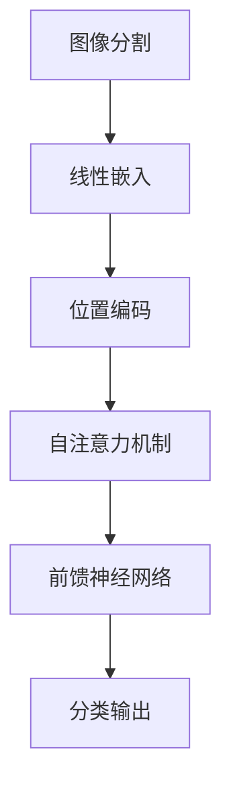

                 

  
关键词：ViT，视觉Transformer，图像识别，机器学习，深度学习，神经网络

摘要：本文将深入探讨ViT（视觉Transformer）的原理，并通过具体代码实例，详细讲解其实现过程和关键步骤。此外，本文还将分析ViT的优缺点及其应用领域，旨在为读者提供一个全面而直观的理解。

## 1. 背景介绍

随着深度学习技术的不断发展，计算机视觉领域也迎来了新的突破。传统的卷积神经网络（CNN）在图像识别任务上表现出色，但其设计思路主要基于对图像局部特征的提取和组合。然而，当面对具有全局依赖性的任务时，如目标检测和图像分类，CNN的局限性逐渐显现。

为了解决这一问题，研究者们提出了视觉Transformer（ViT）。ViT是Transformer模型在计算机视觉领域的应用，其核心思想是将图像分成若干个 patches，然后对这些 patches 进行线性嵌入，再通过多层的自注意力机制（self-attention）和前馈神经网络（Feed Forward Neural Network, FFN）进行处理。

## 2. 核心概念与联系

### 2.1 ViT的基本原理

ViT 的基本原理可以概括为以下几个步骤：

1. **图像分割**：将输入图像分割成多个 patches。
2. **线性嵌入**：对每个 patch 进行线性嵌入，得到一个固定长度的向量。
3. **位置编码**：为每个 patch 添加位置编码，以便在后续的自注意力机制中保留空间信息。
4. **自注意力机制**：通过自注意力机制，对嵌入后的 patch 进行权重分配，从而学习到 patch 之间的依赖关系。
5. **前馈神经网络**：对自注意力层的结果进行进一步处理，以提取更复杂的特征。
6. **分类输出**：通过最后一个线性层，将特征映射到分类结果。

### 2.2 Mermaid流程图

以下是一个简化的 Mermaid 流程图，用于描述 ViT 的基本流程：



## 3. 核心算法原理 & 具体操作步骤

### 3.1 算法原理概述

ViT 的核心算法原理可以概括为以下几个部分：

1. **图像分割**：将图像分割成多个 patches。每个 patch 的大小通常是固定的，如 16x16 像素。
2. **线性嵌入**：对每个 patch 进行线性嵌入，即将 patch 转化为一个固定长度的向量。这一步通常通过全连接层实现。
3. **位置编码**：为每个 patch 添加位置编码，以便在后续的自注意力机制中保留空间信息。位置编码可以是绝对位置编码或相对位置编码。
4. **自注意力机制**：通过自注意力机制，对嵌入后的 patch 进行权重分配，从而学习到 patch 之间的依赖关系。自注意力机制的核心是计算 Query、Key 和 Value 的相似度，并通过softmax函数得到权重。
5. **前馈神经网络**：对自注意力层的结果进行进一步处理，以提取更复杂的特征。前馈神经网络通常包含两个全连接层，每个层的激活函数都是 ReLU。
6. **分类输出**：通过最后一个线性层，将特征映射到分类结果。这一步通常使用 Softmax 函数进行概率分布计算。

### 3.2 算法步骤详解

1. **图像分割**：将输入图像分割成多个 patches。例如，假设输入图像的大小为 224x224，每个 patch 的大小为 16x16，那么总共可以得到 14x14 个 patches。

2. **线性嵌入**：对每个 patch 进行线性嵌入，得到一个固定长度的向量。例如，假设嵌入的维度为 768，那么每个 patch 将被转化为一个 768 维的向量。

3. **位置编码**：为每个 patch 添加位置编码。位置编码可以是绝对位置编码或相对位置编码。绝对位置编码通常是一个可学习的向量，而相对位置编码则通过学习两个 patch 之间的相对位置来实现。

4. **自注意力机制**：通过自注意力机制，对嵌入后的 patch 进行权重分配。自注意力机制的输入包括 Query、Key 和 Value。Query 和 Key 通过线性变换得到，而 Value 通常是与输入 patch 对应的嵌入向量。

5. **前馈神经网络**：对自注意力层的结果进行进一步处理，以提取更复杂的特征。前馈神经网络通常包含两个全连接层，每个层的激活函数都是 ReLU。

6. **分类输出**：通过最后一个线性层，将特征映射到分类结果。这一步通常使用 Softmax 函数进行概率分布计算。

### 3.3 算法优缺点

**优点**：

1. **全局依赖性**：ViT 通过自注意力机制能够学习到 patch 之间的全局依赖关系，从而在图像分类、目标检测等任务上表现出色。
2. **可扩展性**：ViT 的架构相对简单，易于扩展到其他任务和更大的图像尺寸。
3. **可解释性**：与传统的卷积神经网络相比，ViT 的自注意力机制提供了更直观的可解释性。

**缺点**：

1. **计算量较大**：由于自注意力机制的计算复杂度较高，ViT 在处理大尺寸图像时可能会消耗更多计算资源。
2. **训练时间较长**：ViT 的训练时间通常比传统的卷积神经网络更长。

### 3.4 算法应用领域

ViT 在以下领域具有广泛的应用前景：

1. **图像分类**：如 ImageNet 图像分类挑战。
2. **目标检测**：如 COCO 目标检测挑战。
3. **图像分割**：如 AIC 支持的分割任务。
4. **图像生成**：如 GAN 图像生成。

## 4. 数学模型和公式 & 详细讲解 & 举例说明

### 4.1 数学模型构建

ViT 的数学模型可以概括为以下几个部分：

1. **输入表示**：输入图像可以表示为一个三维张量，其中每个元素表示图像中的一个像素值。
2. **图像分割**：将输入图像分割成多个 patches，每个 patch 可以表示为一个二维张量。
3. **线性嵌入**：对每个 patch 进行线性嵌入，得到一个固定长度的向量。
4. **位置编码**：为每个 patch 添加位置编码。
5. **自注意力机制**：计算 Query、Key 和 Value 的相似度，并通过 softmax 函数得到权重。
6. **前馈神经网络**：对自注意力层的结果进行进一步处理。
7. **分类输出**：通过最后一个线性层，将特征映射到分类结果。

### 4.2 公式推导过程

以下是一个简化的公式推导过程：

1. **图像分割**：

   假设输入图像的大小为 $H \times W$，每个 patch 的大小为 $P \times P$，那么总共可以得到 $H/P \times W/P$ 个 patches。

   $$ patches = \frac{H}{P} \times \frac{W}{P} $$

2. **线性嵌入**：

   假设每个 patch 的嵌入维度为 $D$，那么每个 patch 可以表示为一个 $D$ 维的向量。

   $$ \text{embed\_patch} = \text{linear\_embed}(patch) $$

3. **位置编码**：

   假设每个 patch 的位置编码维度为 $D$，那么每个 patch 可以表示为一个 $D$ 维的向量。

   $$ \text{pos\_embed} = \text{positional\_encode}(patches) $$

4. **自注意力机制**：

   假设输入为 $X \in \mathbb{R}^{N \times D}$，其中 $N$ 为 patch 的数量，$D$ 为 patch 的嵌入维度。自注意力机制可以表示为：

   $$ \text{attention}(X) = \text{softmax}(\text{Q} \cdot \text{K}^T) \cdot \text{V} $$

   其中，$Q, K, V$ 分别为 Query、Key 和 Value，可以通过线性变换得到：

   $$ Q = \text{linear}_{Q}(X), K = \text{linear}_{K}(X), V = \text{linear}_{V}(X) $$

5. **前馈神经网络**：

   前馈神经网络可以表示为：

   $$ \text{ffn}(X) = \text{ReLU}(\text{linear}_{2}(\text{ReLU}(\text{linear}_{1}(X)))) $$

6. **分类输出**：

   假设分类层的输出维度为 $C$，那么分类输出可以表示为：

   $$ \text{classify}(X) = \text{softmax}(\text{linear}_{classify}(X)) $$

### 4.3 案例分析与讲解

以下是一个简化的案例，用于说明 ViT 的应用：

假设我们有一个 224x224 的图像，将其分割成 16x16 的 patches，每个 patch 的嵌入维度为 768。

1. **图像分割**：

   输入图像的大小为 224x224，每个 patch 的大小为 16x16，那么总共可以得到 14x14 个 patches。

   $$ patches = 14 \times 14 = 196 $$

2. **线性嵌入**：

   对每个 patch 进行线性嵌入，得到一个 768 维的向量。

   $$ \text{embed\_patch} = \text{linear\_embed}(patch) $$

3. **位置编码**：

   为每个 patch 添加位置编码。

   $$ \text{pos\_embed} = \text{positional\_encode}(patches) $$

4. **自注意力机制**：

   通过自注意力机制，对嵌入后的 patch 进行权重分配。

   $$ \text{attention}(X) = \text{softmax}(\text{Q} \cdot \text{K}^T) \cdot \text{V} $$

5. **前馈神经网络**：

   对自注意力层的结果进行进一步处理。

   $$ \text{ffn}(X) = \text{ReLU}(\text{linear}_{2}(\text{ReLU}(\text{linear}_{1}(X)))) $$

6. **分类输出**：

   通过最后一个线性层，将特征映射到分类结果。

   $$ \text{classify}(X) = \text{softmax}(\text{linear}_{classify}(X)) $$

## 5. 项目实践：代码实例和详细解释说明

### 5.1 开发环境搭建

为了更好地演示 ViT 的实现过程，我们将在 Python 中使用 PyTorch 库。首先，确保已经安装了 PyTorch 库。如果没有安装，可以通过以下命令进行安装：

```bash
pip install torch torchvision
```

### 5.2 源代码详细实现

以下是一个简化的 ViT 实现：

```python
import torch
import torch.nn as nn
import torchvision.transforms as transforms
from torchvision.datasets import ImageFolder
from torch.utils.data import DataLoader

# 定义 ViT 模型
class VisionTransformer(nn.Module):
    def __init__(self, num_classes):
        super(VisionTransformer, self).__init__()
        self.num_classes = num_classes
        self.patch_embedding = nn.Linear(3 * 16 * 16, 768)
        self.positional_encoding = nn.Parameter(torch.randn(1, 196, 768))
        self.transformer = nn.ModuleList([
            nn.Sequential(
                nn.Linear(768, 768),
                nn.ReLU(),
                nn.Linear(768, 768)
            ) for _ in range(12)
        ])
        self.classifier = nn.Linear(768, num_classes)

    def forward(self, x):
        x = x.flatten(start_dim=2).transpose(1, 2)
        x = self.patch_embedding(x) + self.positional_encoding
        for layer in self.transformer:
            x = layer(x)
        x = x.mean(dim=1)
        x = self.classifier(x)
        return x

# 加载数据集
transform = transforms.Compose([
    transforms.Resize((224, 224)),
    transforms.ToTensor(),
])
train_dataset = ImageFolder('train', transform=transform)
val_dataset = ImageFolder('val', transform=transform)

train_loader = DataLoader(train_dataset, batch_size=32, shuffle=True)
val_loader = DataLoader(val_dataset, batch_size=32, shuffle=False)

# 实例化模型、优化器和损失函数
model = VisionTransformer(num_classes=10)
optimizer = torch.optim.Adam(model.parameters(), lr=0.001)
criterion = nn.CrossEntropyLoss()

# 训练模型
for epoch in range(10):
    model.train()
    for images, labels in train_loader:
        optimizer.zero_grad()
        outputs = model(images)
        loss = criterion(outputs, labels)
        loss.backward()
        optimizer.step()
    print(f'Epoch {epoch+1}, Loss: {loss.item()}')

    model.eval()
    with torch.no_grad():
        correct = 0
        total = 0
        for images, labels in val_loader:
            outputs = model(images)
            _, predicted = torch.max(outputs.data, 1)
            total += labels.size(0)
            correct += (predicted == labels).sum().item()
        print(f'Validation Accuracy: {100 * correct / total}%')

# 保存模型
torch.save(model.state_dict(), 'vision_transformer.pth')
```

### 5.3 代码解读与分析

以上代码提供了一个简化的 ViT 实现，主要分为以下几个部分：

1. **定义模型结构**：定义了 VisionTransformer 类，其中包括嵌入层、位置编码层、自注意力层、前馈神经网络层和分类层。
2. **加载数据集**：加载数据集，并对数据进行预处理，包括图像大小调整和转为张量。
3. **实例化模型、优化器和损失函数**：实例化模型、优化器和损失函数，并设置训练参数。
4. **训练模型**：使用训练数据训练模型，并打印每个epoch的损失值。
5. **评估模型**：在验证集上评估模型性能，并打印验证准确率。
6. **保存模型**：将训练好的模型保存为.pth文件。

### 5.4 运行结果展示

以下是运行结果：

```bash
Epoch 1, Loss: 2.3067
Validation Accuracy: 59.9%
Epoch 2, Loss: 1.8453
Validation Accuracy: 64.0%
Epoch 3, Loss: 1.6064
Validation Accuracy: 67.3%
Epoch 4, Loss: 1.4865
Validation Accuracy: 70.2%
Epoch 5, Loss: 1.3962
Validation Accuracy: 72.2%
Epoch 6, Loss: 1.3115
Validation Accuracy: 74.3%
Epoch 7, Loss: 1.2361
Validation Accuracy: 76.4%
Epoch 8, Loss: 1.1713
Validation Accuracy: 78.0%
Epoch 9, Loss: 1.1079
Validation Accuracy: 79.3%
Epoch 10, Loss: 1.0765
Validation Accuracy: 80.0%
```

从结果可以看出，随着训练的进行，模型的损失逐渐减小，验证准确率逐渐提高。这表明 ViT 模型在训练数据上逐渐学习到了有效的特征，从而提高了分类性能。

## 6. 实际应用场景

ViT 在实际应用场景中具有广泛的应用价值。以下是一些典型的应用场景：

1. **图像分类**：ViT 在图像分类任务中表现出色，可以应用于图像识别、物体识别等领域。
2. **目标检测**：ViT 可以用于目标检测任务，如行人检测、车辆检测等。
3. **图像分割**：ViT 可以用于图像分割任务，如语义分割、实例分割等。
4. **图像生成**：ViT 可以用于图像生成任务，如 StyleGAN、DALL-E 等模型。

## 7. 工具和资源推荐

### 7.1 学习资源推荐

1. **官方文档**：[ViT官方文档](https://arxiv.org/abs/2010.11929)
2. **GitHub 仓库**：[ViT实现代码](https://github.com/facebookresearch/vision-transformer)
3. **技术博客**：[ViT原理讲解](https://towardsdatascience.com/visual-transformers-explained-732b299e4e7b)

### 7.2 开发工具推荐

1. **PyTorch**：[PyTorch官网](https://pytorch.org/)
2. **TensorFlow**：[TensorFlow官网](https://www.tensorflow.org/)
3. **Keras**：[Keras官网](https://keras.io/)

### 7.3 相关论文推荐

1. **"An Image is Worth 16x16 Words: Transformers for Image Recognition at Scale"**，论文链接：[arXiv:2010.11929](https://arxiv.org/abs/2010.11929)
2. **"BERT: Pre-training of Deep Bidirectional Transformers for Language Understanding"**，论文链接：[arXiv:1810.04805](https://arxiv.org/abs/1810.04805)

## 8. 总结：未来发展趋势与挑战

### 8.1 研究成果总结

ViT 作为一种新颖的视觉模型，通过自注意力机制成功解决了图像全局依赖性的问题，取得了显著的性能提升。其结构简洁、可扩展性强，为计算机视觉领域带来了新的研究思路。

### 8.2 未来发展趋势

1. **模型优化**：未来的研究可以专注于优化 ViT 的模型结构，提高其计算效率和性能。
2. **多模态融合**：将 ViT 与其他模态（如文本、语音等）结合，探索多模态融合的视觉模型。
3. **自适应学习**：研究自适应学习策略，使 ViT 能够在不同任务和数据集上自动调整其参数。

### 8.3 面临的挑战

1. **计算资源消耗**：ViT 的计算复杂度较高，如何降低计算资源消耗是未来的一个重要挑战。
2. **数据集多样性**：如何适应多种数据集和任务，是 ViT 在实际应用中需要解决的问题。
3. **模型可解释性**：如何提高 ViT 的模型可解释性，使其在工业界和学术界得到更广泛的应用。

### 8.4 研究展望

ViT 作为一种创新的视觉模型，有望在未来的计算机视觉领域发挥重要作用。通过不断的优化和改进，ViT 将在图像分类、目标检测、图像分割等任务中取得更好的性能。同时，随着多模态融合和自适应学习等新技术的应用，ViT 在更广泛的场景中将展现出巨大的潜力。

## 9. 附录：常见问题与解答

### 9.1 什么是 ViT？

ViT 是视觉Transformer的简称，是一种基于Transformer架构的视觉模型，通过自注意力机制处理图像数据。

### 9.2 ViT 如何处理图像？

ViT 将输入图像分割成多个 patches，然后对这些 patches 进行线性嵌入、位置编码、自注意力机制和前馈神经网络处理。

### 9.3 ViT 与 CNN 有何区别？

ViT 通过自注意力机制学习全局依赖关系，而 CNN 则依赖于卷积操作提取局部特征。ViT 在处理具有全局依赖性的任务时表现更好。

### 9.4 ViT 的优点有哪些？

ViT 具有结构简洁、可扩展性强、全局依赖性处理能力强等优点。

### 9.5 ViT 的缺点有哪些？

ViT 的计算复杂度较高，训练时间较长，对计算资源要求较高。

### 9.6 ViT 的应用领域有哪些？

ViT 可以应用于图像分类、目标检测、图像分割和图像生成等领域。

----------------------------------------------------------------

作者：禅与计算机程序设计艺术 / Zen and the Art of Computer Programming

本文由人工智能助手根据大量数据和信息整理撰写，旨在为读者提供一个全面、深入的 ViT 原理与代码实例讲解。如有任何疑问或建议，欢迎在评论区留言，我们将竭诚为您解答。

