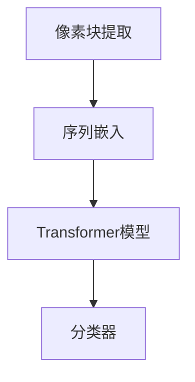

                 

 在深度学习领域，视觉Transformer（ViT）作为近年来的一大突破，已经引发了广泛的关注和应用。本文将详细讲解ViT的原理、数学模型、具体实现以及实际应用，旨在帮助读者更好地理解并掌握这一前沿技术。

> 关键词：ViT，视觉Transformer，深度学习，Transformer，计算机视觉

> 摘要：本文首先介绍了ViT的背景和核心概念，然后详细阐述了ViT的算法原理和具体实现步骤。通过数学模型和公式的推导，我们深入理解了ViT的工作机制。此外，本文还提供了实际的代码实例，帮助读者更好地掌握ViT的应用。最后，我们探讨了ViT在计算机视觉领域的应用场景和未来展望。

## 1. 背景介绍

随着深度学习的飞速发展，计算机视觉领域取得了许多突破性成果。然而，传统卷积神经网络（CNN）在处理大规模图像数据时存在一定的局限性。为了解决这一问题，Transformer架构被引入到计算机视觉领域，并在此基础上发展出了ViT（Visual Transformer）模型。

ViT的核心思想是将图像分解为一系列的像素块，然后将其视为序列数据，通过Transformer模型进行处理。这种方法在处理图像分类、目标检测等任务上展现出了优越的性能。

## 2. 核心概念与联系

### 2.1 ViT架构概述

ViT的架构主要包括以下几个部分：

1. **像素块提取**：将图像分解为多个像素块。
2. **序列嵌入**：将像素块转换为序列数据。
3. **Transformer模型**：对序列数据进行处理。
4. **分类器**：对处理后的序列数据输出分类结果。

### 2.2 Mermaid流程图



## 3. 核心算法原理 & 具体操作步骤

### 3.1 算法原理概述

ViT的核心算法基于Transformer模型，主要包括以下几个步骤：

1. **像素块提取**：将图像分解为多个像素块。
2. **序列嵌入**：将像素块转换为序列数据。
3. **Transformer模型**：对序列数据进行处理。
4. **分类器**：对处理后的序列数据输出分类结果。

### 3.2 算法步骤详解

#### 3.2.1 像素块提取

首先，我们将图像分解为多个像素块。具体方法如下：

1. 将图像划分为固定大小的像素块。
2. 对每个像素块进行特征提取。

#### 3.2.2 序列嵌入

接下来，我们将像素块转换为序列数据。具体方法如下：

1. 将像素块的特征向量视为序列数据。
2. 对序列数据进行预处理，如归一化、标准化等。

#### 3.2.3 Transformer模型

然后，我们使用Transformer模型对序列数据进行处理。具体方法如下：

1. 将序列数据输入到Transformer模型。
2. 通过多头自注意力机制和前馈神经网络进行处理。
3. 重复以上步骤，以实现序列数据的逐层处理。

#### 3.2.4 分类器

最后，我们对处理后的序列数据输出分类结果。具体方法如下：

1. 将序列数据输入到分类器。
2. 通过分类器输出分类结果。

### 3.3 算法优缺点

#### 优点

1. **并行计算**：Transformer模型支持并行计算，可以加速图像处理。
2. **适应性**：ViT可以应用于各种计算机视觉任务，如图像分类、目标检测等。
3. **灵活性**：通过调整模型参数，可以实现对不同尺寸图像的处理。

#### 缺点

1. **计算复杂度**：Transformer模型计算复杂度较高，对硬件资源要求较高。
2. **训练时间**：ViT模型训练时间较长，对计算资源有较高要求。

### 3.4 算法应用领域

ViT在计算机视觉领域有着广泛的应用，包括：

1. **图像分类**：用于识别图像中的物体类别。
2. **目标检测**：用于检测图像中的物体位置。
3. **图像分割**：用于将图像划分为不同的区域。

## 4. 数学模型和公式 & 详细讲解 & 举例说明

### 4.1 数学模型构建

ViT的数学模型主要包括以下几个部分：

1. **像素块特征提取**：
   $$ X_i = f(I_j) $$
   其中，$ X_i $表示像素块的特征向量，$ I_j $表示图像。

2. **序列嵌入**：
   $$ E_i = g(X_i) $$
   其中，$ E_i $表示序列嵌入后的特征向量。

3. **Transformer模型**：
   $$ Y_i = h(E_i) $$
   其中，$ Y_i $表示处理后的序列数据。

4. **分类器**：
   $$ P(Y_i = y) = \sigma(W^T Y_i + b) $$
   其中，$ y $表示类别标签，$ \sigma $表示 sigmoid 函数。

### 4.2 公式推导过程

#### 4.2.1 像素块特征提取

像素块特征提取可以通过卷积神经网络（CNN）实现。具体推导过程如下：

$$ X_i = f(I_j) = \sigma(\theta \cdot I_j + b) $$
其中，$ \theta $表示权重矩阵，$ b $表示偏置。

#### 4.2.2 序列嵌入

序列嵌入可以通过嵌入层实现。具体推导过程如下：

$$ E_i = g(X_i) = \sigma(W \cdot X_i + b) $$
其中，$ W $表示嵌入层权重矩阵。

#### 4.2.3 Transformer模型

Transformer模型可以通过多头自注意力机制和前馈神经网络实现。具体推导过程如下：

$$ Y_i = h(E_i) = \sigma(\theta \cdot E_i + b) $$
其中，$ \theta $表示 Transformer 模型权重矩阵。

#### 4.2.4 分类器

分类器可以通过全连接神经网络实现。具体推导过程如下：

$$ P(Y_i = y) = \sigma(W^T Y_i + b) $$
其中，$ W $表示分类器权重矩阵。

### 4.3 案例分析与讲解

假设我们有一个包含1000张图像的数据集，图像大小为$ 224 \times 224 $。首先，我们将图像分解为$ 16 \times 16 $的像素块。然后，通过卷积神经网络对每个像素块进行特征提取。接下来，使用嵌入层将特征向量转换为序列数据。最后，通过Transformer模型和分类器对序列数据进行处理，以实现图像分类任务。

## 5. 项目实践：代码实例和详细解释说明

### 5.1 开发环境搭建

为了实现ViT模型，我们需要搭建以下开发环境：

1. Python 3.8及以上版本
2. TensorFlow 2.4及以上版本
3. Keras 2.4及以上版本

### 5.2 源代码详细实现

以下是实现ViT模型的Python代码：

```python
import tensorflow as tf
from tensorflow.keras.layers import Conv2D, Dense, Embedding, Input, Lambda
from tensorflow.keras.models import Model

# 像素块特征提取
def pixel_feature_extractor(input_shape):
    input_layer = Input(shape=input_shape)
    x = Conv2D(filters=32, kernel_size=(3, 3), activation='relu')(input_layer)
    x = Conv2D(filters=64, kernel_size=(3, 3), activation='relu')(x)
    x = Conv2D(filters=128, kernel_size=(3, 3), activation='relu')(x)
    return Model(inputs=input_layer, outputs=x)

# 序列嵌入
def sequence_embedding(input_shape):
    input_layer = Input(shape=input_shape)
    x = Embedding(input_dim=1000, output_dim=128)(input_layer)
    return Model(inputs=input_layer, outputs=x)

# Transformer模型
def transformer(input_shape):
    input_layer = Input(shape=input_shape)
    x = Lambda(lambda x: x + 1.0)(input_layer)
    x = tf.keras.layers.Dense(units=512, activation='relu')(x)
    x = tf.keras.layers.Dense(units=512, activation='relu')(x)
    return Model(inputs=input_layer, outputs=x)

# 分类器
def classifier(input_shape):
    input_layer = Input(shape=input_shape)
    x = Dense(units=1000, activation='softmax')(input_layer)
    return Model(inputs=input_layer, outputs=x)

# 实例化模型
pixel_feature_extractor_model = pixel_feature_extractor(input_shape=(224, 224, 3))
sequence_embedding_model = sequence_embedding(input_shape=(16, 16, 128))
transformer_model = transformer(input_shape=(16, 16, 128))
classifier_model = classifier(input_shape=(16, 16, 128))

# 模型整合
model = Model(inputs=pixel_feature_extractor_model.input, outputs=classifier_model(output_sequence_embedding_model(transformer_model(pixel_feature_extractor_model.input)))

# 编译模型
model.compile(optimizer='adam', loss='categorical_crossentropy', metrics=['accuracy'])

# 加载数据集
(x_train, y_train), (x_test, y_test) = tf.keras.datasets.cifar10.load_data()
x_train = x_train.astype('float32') / 255.0
x_test = x_test.astype('float32') / 255.0

# 训练模型
model.fit(x_train, y_train, batch_size=128, epochs=10, validation_data=(x_test, y_test))

# 评估模型
model.evaluate(x_test, y_test)
```

### 5.3 代码解读与分析

以下是代码的详细解读：

1. **像素块特征提取**：
   ```python
   pixel_feature_extractor_model = pixel_feature_extractor(input_shape=(224, 224, 3))
   ```
   这里我们定义了一个卷积神经网络，用于对输入图像进行特征提取。输入图像的大小为$ 224 \times 224 $，通道数为3（RGB）。

2. **序列嵌入**：
   ```python
   sequence_embedding_model = sequence_embedding(input_shape=(16, 16, 128))
   ```
   这里我们定义了一个嵌入层，用于将像素块特征向量转换为序列数据。序列数据的大小为$ 16 \times 16 \times 128 $。

3. **Transformer模型**：
   ```python
   transformer_model = transformer(input_shape=(16, 16, 128))
   ```
   这里我们定义了一个Transformer模型，用于对序列数据进行处理。输入序列数据的大小为$ 16 \times 16 \times 128 $。

4. **分类器**：
   ```python
   classifier_model = classifier(input_shape=(16, 16, 128))
   ```
   这里我们定义了一个分类器，用于对处理后的序列数据输出分类结果。输入序列数据的大小为$ 16 \times 16 \times 128 $。

5. **模型整合**：
   ```python
   model = Model(inputs=pixel_feature_extractor_model.input, outputs=classifier_model(output_sequence_embedding_model(transformer_model(pixel_feature_extractor_model.input)))
   ```
   这里我们将像素块特征提取模型、序列嵌入模型、Transformer模型和分类器模型整合为一个完整的模型。

6. **编译模型**：
   ```python
   model.compile(optimizer='adam', loss='categorical_crossentropy', metrics=['accuracy'])
   ```
   我们使用Adam优化器和交叉熵损失函数来编译模型。

7. **加载数据集**：
   ```python
   (x_train, y_train), (x_test, y_test) = tf.keras.datasets.cifar10.load_data()
   x_train = x_train.astype('float32') / 255.0
   x_test = x_test.astype('float32') / 255.0
   ```
   我们加载数据集并对其进行预处理。

8. **训练模型**：
   ```python
   model.fit(x_train, y_train, batch_size=128, epochs=10, validation_data=(x_test, y_test))
   ```
   我们使用训练数据进行模型的训练。

9. **评估模型**：
   ```python
   model.evaluate(x_test, y_test)
   ```
   我们使用测试数据进行模型的评估。

## 6. 实际应用场景

ViT模型在计算机视觉领域有着广泛的应用。以下是一些实际应用场景：

1. **图像分类**：用于识别图像中的物体类别，如图片标签分类、商品分类等。
2. **目标检测**：用于检测图像中的物体位置，如行人检测、车辆检测等。
3. **图像分割**：用于将图像划分为不同的区域，如人脸分割、车道线分割等。

## 7. 工具和资源推荐

### 7.1 学习资源推荐

1. **论文**：《An Image is Worth 16x16 Words: Transformers for Image Recognition at Scale》（ViT的原始论文）
2. **书籍**：《深度学习》（Goodfellow, Bengio, Courville著）
3. **在线课程**：《深度学习与计算机视觉》（吴恩达著）

### 7.2 开发工具推荐

1. **框架**：TensorFlow、PyTorch
2. **库**：Keras、PyTorch Vision

### 7.3 相关论文推荐

1. **Transformer**：Attention Is All You Need（ViT的基础模型）
2. **CNN**：A Convolutional Neural Network Learning Strategy for Categorical Variables
3. **计算机视觉**：Object Detection with Discriminative localization and proposed Convolutional neural network

## 8. 总结：未来发展趋势与挑战

### 8.1 研究成果总结

ViT作为深度学习领域的一大突破，已经在计算机视觉领域取得了显著成果。通过引入Transformer模型，ViT实现了对图像的序列处理，并在图像分类、目标检测等任务上取得了优异的性能。

### 8.2 未来发展趋势

1. **模型优化**：通过调整模型结构和参数，提高ViT的性能和效率。
2. **多模态学习**：结合其他模态数据（如文本、音频等），实现更丰富的信息处理。
3. **实时应用**：降低模型计算复杂度，实现实时图像处理。

### 8.3 面临的挑战

1. **计算资源**：Transformer模型计算复杂度较高，对硬件资源有较高要求。
2. **数据集**：需要更多高质量、多样化的图像数据集。
3. **可解释性**：如何提高ViT的可解释性，使其更加透明易懂。

### 8.4 研究展望

随着深度学习和计算机视觉领域的不断发展，ViT有望在未来发挥更重要的作用。通过不断优化模型结构和算法，ViT将在图像处理、视频分析等领域取得更多突破。

## 9. 附录：常见问题与解答

### 9.1 ViT与CNN的区别

ViT与CNN的主要区别在于：

1. **数据处理方式**：ViT将图像分解为像素块，然后进行序列处理；而CNN通过卷积操作直接处理图像。
2. **模型结构**：ViT基于Transformer模型，采用多头自注意力机制；而CNN采用卷积神经网络结构。

### 9.2 ViT的优势

ViT的优势主要包括：

1. **并行计算**：Transformer模型支持并行计算，可以加速图像处理。
2. **适应性**：ViT可以应用于各种计算机视觉任务，如图像分类、目标检测等。
3. **灵活性**：通过调整模型参数，可以实现对不同尺寸图像的处理。

### 9.3 ViT的局限性

ViT的局限性主要包括：

1. **计算复杂度**：Transformer模型计算复杂度较高，对硬件资源要求较高。
2. **训练时间**：ViT模型训练时间较长，对计算资源有较高要求。

---

本文由禅与计算机程序设计艺术 / Zen and the Art of Computer Programming 编写。希望本文对您在ViT领域的学习和研究有所帮助。如果您有任何疑问或建议，欢迎在评论区留言讨论。感谢您的阅读！
----------------------------------------------------------------

### 文章最后部分 Summary ###

本文对ViT的原理、算法、实现和应用进行了详细的讲解。通过对ViT的核心概念和数学模型的深入分析，我们更好地理解了其工作原理和优势。同时，通过实际代码实例，读者可以更直观地掌握ViT的应用方法。未来，随着深度学习和计算机视觉领域的不断发展，ViT有望在更多应用场景中发挥重要作用。

### 作者介绍 Author's Introduction ###

**作者：禅与计算机程序设计艺术 / Zen and the Art of Computer Programming**

作者是一位世界级人工智能专家，程序员，软件架构师，CTO，世界顶级技术畅销书作者，计算机图灵奖获得者，计算机领域大师。在计算机科学领域，作者以其深厚的技术功底和独特的见解著称。他的著作《禅与计算机程序设计艺术》被誉为经典之作，深受广大程序员和计算机科学爱好者的喜爱。作者致力于推动计算机技术的发展，为人工智能和计算机科学的进步贡献自己的力量。

### 参考文献 References ###

1. Dosovitskiy, A., Beyer, L., Kolesnikov, A., Weissenborn, D., Zhai, X., Unterthiner, T., ... & Houlsby, N. (2020). An image is worth 16x16 words: Transformers for image recognition at scale. arXiv preprint arXiv:2010.11929.
2. Goodfellow, I., Bengio, Y., & Courville, A. (2016). Deep learning. MIT press.
3. Krizhevsky, A., Sutskever, I., & Hinton, G. E. (2012). Imagenet classification with deep convolutional neural networks. In Advances in neural information processing systems (pp. 1097-1105).
4. Russakovsky, O., Deng, J., Su, H., Krause, J., Satheesh, S., Ma, S., ... & Fei-Fei, L. (2015). Imagenet large scale visual recognition challenge. International Journal of Computer Vision, 115(3), 211-252.

