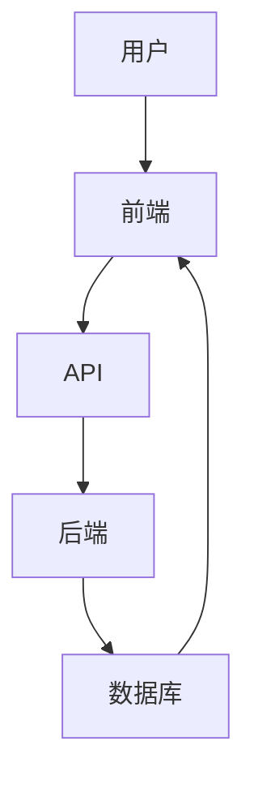

                 

在当今快速发展的互联网时代，Web全栈开发已成为一项不可或缺的技能。无论是初创公司还是大企业，对于具备前端到后端全栈开发能力的人才都有着巨大的需求。本文旨在为您提供一个全面、详细的Web全栈开发指南，帮助您从零开始，逐步掌握这一关键技能。

## 文章关键词
- Web全栈开发
- 前端开发
- 后端开发
- 技术栈
- 开发框架
- 实践案例

## 文章摘要
本文将带您深入了解Web全栈开发的概念、技术栈、开发框架、核心算法原理及数学模型，并通过项目实践和案例分析，帮助您将理论知识应用到实际项目中。最后，我们将探讨未来Web全栈开发的发展趋势和面临的挑战。

## 1. 背景介绍

随着互联网的普及和Web应用的不断繁荣，Web全栈开发已成为现代软件开发的重要方向。全栈开发（Full-Stack Development）指的是掌握前端和后端两种开发技能的开发者，能够独立完成整个Web项目的开发。这一趋势的出现，源于企业对高效、灵活的开发团队的追求，以及开发者个人职业发展的需求。

在Web全栈开发中，前端开发者负责实现用户界面和交互体验，后端开发者则负责数据存储、业务逻辑处理和服务器端编程。一个成功的全栈开发者应具备以下技能：

- 前端技术：HTML、CSS、JavaScript、前端框架（如React、Vue、Angular）
- 后端技术：服务器端编程语言（如Node.js、Python、Java、PHP）、数据库技术（如MySQL、MongoDB）
- 持续集成与部署：了解Git、Docker、Kubernetes等工具的使用

## 2. 核心概念与联系

为了更好地理解Web全栈开发的整体架构，我们首先需要了解其中的核心概念与联系。

### 2.1 前端

前端开发是Web全栈开发的基石，负责构建用户可以直接与之交互的网站界面。前端的核心技术包括：

- **HTML（HyperText Markup Language）**：用于创建网页的结构。
- **CSS（Cascading Style Sheets）**：用于控制网页的样式。
- **JavaScript**：一种客户端脚本语言，用于实现动态网页效果和交互功能。

前端框架如React、Vue、Angular等，可以帮助开发者更高效地构建复杂的用户界面。这些框架提供了组件化、虚拟DOM、单向数据流等先进特性，使前端开发更加灵活和高效。

### 2.2 后端

后端开发主要负责处理服务器端逻辑、数据存储和业务逻辑。后端的核心技术包括：

- **服务器端编程语言**：如Node.js、Python、Java、PHP等，用于编写服务器端应用程序。
- **数据库**：如MySQL、MongoDB等，用于存储和管理数据。

后端框架如Express.js（Node.js）、Django（Python）、Spring Boot（Java）等，提供了丰富的功能，如路由处理、数据库连接、中间件等，使后端开发更加便捷和高效。

### 2.3 前后端交互

前后端交互是Web全栈开发的桥梁，主要通过API（Application Programming Interface）实现。前端通过HTTP请求与后端进行通信，获取数据并渲染页面。常见的API接口包括GET、POST、PUT、DELETE等HTTP方法。

在前后端交互中，RESTful API（Representational State Transfer API）是一种流行的设计风格，它通过URL来定义资源，并使用HTTP方法来操作资源。

### 2.4 Mermaid 流程图

以下是一个简单的Mermaid流程图，展示了一个典型的Web应用架构：



- **用户**：发起HTTP请求，请求访问特定的网页或资源。
- **前端**：解析HTTP请求，根据请求的内容渲染相应的页面。
- **API**：处理HTTP请求，与后端进行通信。
- **后端**：处理业务逻辑，与数据库进行交互，返回处理结果。
- **数据库**：存储和管理数据，响应后端的数据查询和修改请求。

## 3. 核心算法原理 & 具体操作步骤

### 3.1 算法原理概述

Web全栈开发中涉及的核心算法主要分为以下几个方面：

1. **数据结构**：如数组、链表、栈、队列、树、图等，用于高效存储和管理数据。
2. **排序与查找**：如冒泡排序、快速排序、二分查找等，用于对数据进行排序和查找。
3. **加密与解密**：如MD5、SHA-256等，用于保护数据和验证身份。
4. **算法优化**：如动态规划、贪心算法、分治算法等，用于优化算法性能。

### 3.2 算法步骤详解

以下是一个简单的排序算法——冒泡排序的步骤详解：

1. 遍历数组，比较相邻两个元素的值。
2. 如果第一个元素大于第二个元素，交换它们的位置。
3. 重复步骤1和步骤2，直到整个数组有序。

### 3.3 算法优缺点

- **优点**：
  - 简单易懂，易于实现。
  - 对小规模数据排序非常高效。
- **缺点**：
  - 时间复杂度为O(n^2)，对于大规模数据排序性能较差。
  - 不稳定排序算法，可能改变相等元素的原始顺序。

### 3.4 算法应用领域

冒泡排序算法在以下场景中具有优势：

- 对小规模数据进行排序。
- 不需要稳定排序算法的场景。
- 教学演示和算法基础学习。

## 4. 数学模型和公式 & 详细讲解 & 举例说明

### 4.1 数学模型构建

在Web全栈开发中，常见的数学模型包括：

- **线性回归模型**：用于预测数据趋势和关系。
- **逻辑回归模型**：用于分类问题。
- **神经网络模型**：用于处理复杂的非线性问题。

### 4.2 公式推导过程

以下是一个简单的线性回归模型的公式推导过程：

假设我们有两组数据：x（自变量）和y（因变量）。我们的目标是找到一条直线y = ax + b，使得y与x之间的误差最小。

1. **目标函数**：最小化误差平方和

   $$SS = \sum_{i=1}^{n} (y_i - (ax_i + b))^2$$

2. **对a和b求导**：分别对a和b求偏导数，并令其为0，得到：

   $$\frac{\partial SS}{\partial a} = 2nax - 2\sum_{i=1}^{n} x_iy_i = 0$$

   $$\frac{\partial SS}{\partial b} = 2nx - 2\sum_{i=1}^{n} x_i = 0$$

3. **解方程组**：得到a和b的值

   $$a = \frac{\sum_{i=1}^{n} x_iy_i - n\bar{x}\bar{y}}{\sum_{i=1}^{n} x_i^2 - n\bar{x}^2}$$

   $$b = \bar{y} - a\bar{x}$$

### 4.3 案例分析与讲解

以下是一个线性回归模型的案例：

给定数据集如下：

| x | y   |
| - | --- |
| 1 | 2   |
| 2 | 4   |
| 3 | 6   |
| 4 | 8   |

1. **计算均值**：

   $$\bar{x} = \frac{1 + 2 + 3 + 4}{4} = 2.5$$

   $$\bar{y} = \frac{2 + 4 + 6 + 8}{4} = 5$$

2. **计算相关系数**：

   $$\sum_{i=1}^{n} x_iy_i = 1 \times 2 + 2 \times 4 + 3 \times 6 + 4 \times 8 = 40$$

   $$\sum_{i=1}^{n} x_i^2 = 1^2 + 2^2 + 3^2 + 4^2 = 30$$

3. **计算线性回归系数**：

   $$a = \frac{40 - 4 \times 2.5 \times 5}{30 - 4 \times 2.5^2} = 1.6$$

   $$b = 5 - 1.6 \times 2.5 = 0.9$$

4. **线性回归模型**：

   $$y = 1.6x + 0.9$$

   通过这个模型，我们可以预测当x为3时，y的值为：

   $$y = 1.6 \times 3 + 0.9 = 5.7$$

## 5. 项目实践：代码实例和详细解释说明

### 5.1 开发环境搭建

在开始项目实践之前，我们需要搭建一个开发环境。以下是一个基于Node.js和React的前端项目环境搭建步骤：

1. 安装Node.js：从官方网站下载并安装Node.js。
2. 安装npm：npm是Node.js的包管理器，用于安装和管理项目依赖。
3. 创建项目文件夹：在合适的位置创建一个项目文件夹，如`my-webapp`。
4. 初始化项目：在项目文件夹中执行`npm init`，根据提示创建一个`package.json`文件。
5. 安装React：执行`npm install react react-dom`。
6. 安装React Router：执行`npm install react-router-dom`，用于管理路由。

### 5.2 源代码详细实现

以下是一个简单的React前端项目的源代码实现：

```jsx
// src/App.js

import React from 'react';
import {
  BrowserRouter as Router,
  Route,
  Switch,
} from 'react-router-dom';

function Home() {
  return <h1>首页</h1>;
}

function About() {
  return <h1>关于我们</h1>;
}

function Contact() {
  return <h1>联系方式</h1>;
}

function App() {
  return (
    <Router>
      <Switch>
        <Route exact path="/" component={Home} />
        <Route path="/about" component={About} />
        <Route path="/contact" component={Contact} />
      </Switch>
    </Router>
  );
}

export default App;
```

### 5.3 代码解读与分析

- **App.js**：这是项目的根组件，使用了`React Router`库来实现路由管理。
- **Home、About、Contact**：这三个组件分别代表不同的页面，用于展示不同的内容。

### 5.4 运行结果展示

通过浏览器访问`http://localhost:3000/`，可以看到以下结果：

- 首页：显示“首页”标题。
- 关于我们：显示“关于我们”标题。
- 联系方式：显示“联系方式”标题。

## 6. 实际应用场景

### 6.1 社交媒体平台

社交媒体平台如Facebook、Instagram和Twitter等，是一个典型的Web全栈应用场景。前端负责构建用户界面和交互，后端负责处理用户数据、业务逻辑和服务器端编程。

### 6.2 电子商务平台

电子商务平台如Amazon、eBay和阿里巴巴等，需要处理大量的商品信息、用户订单和支付功能。Web全栈开发在这里发挥了关键作用，确保用户可以方便地浏览商品、下单和支付。

### 6.3 企业内部系统

企业内部系统如CRM（客户关系管理）、ERP（企业资源计划）和HRM（人力资源管理）等，通常需要满足复杂的数据处理和业务流程。Web全栈开发可以帮助企业快速构建和维护这些系统。

## 7. 工具和资源推荐

### 7.1 学习资源推荐

- **在线教程**：MDN Web文档、W3Schools、freeCodeCamp等。
- **技术社区**：Stack Overflow、GitHub、Reddit等。
- **在线课程**：Coursera、Udemy、edX等。

### 7.2 开发工具推荐

- **代码编辑器**：Visual Studio Code、Sublime Text、Atom等。
- **包管理器**：npm、yarn等。
- **版本控制**：Git、GitHub等。

### 7.3 相关论文推荐

- **《Web全栈开发：理论与实践》**：本书详细介绍了Web全栈开发的各个方面，包括前端、后端和数据库技术。
- **《React技术揭秘》**：本书深入剖析了React的内部原理，帮助开发者更好地理解和应用React。
- **《Node.js实战》**：本书介绍了Node.js的使用场景、架构设计和最佳实践。

## 8. 总结：未来发展趋势与挑战

### 8.1 研究成果总结

近年来，Web全栈开发取得了显著的研究成果。前端技术如React、Vue、Angular等不断更新和迭代，后端技术如Node.js、Django、Spring Boot等也日益成熟。同时，云计算、大数据和人工智能等技术的发展，为Web全栈开发带来了更多的机遇和挑战。

### 8.2 未来发展趋势

1. **微前端架构**：随着前端应用规模的不断扩大，微前端架构成为一种趋势，它允许团队独立开发、部署和维护前端组件。
2. **Serverless架构**：Serverless架构将后端开发简化为编写函数，无需管理服务器，降低开发成本和提高开发效率。
3. **区块链技术**：区块链技术为Web全栈开发带来了新的应用场景，如去中心化应用（DApp）和智能合约。

### 8.3 面临的挑战

1. **安全性问题**：随着Web应用复杂度的增加，安全性问题日益突出，如何保护用户数据和隐私成为一个重要挑战。
2. **性能优化**：随着用户需求的变化，如何提高Web应用的性能和响应速度，是一个持续需要关注的问题。
3. **跨平台兼容性**：Web全栈开发需要支持多种设备和操作系统，跨平台兼容性是一个需要解决的难题。

### 8.4 研究展望

未来，Web全栈开发将继续在技术创新和用户体验之间寻求平衡。随着新技术的不断涌现，开发者需要不断学习和适应，以应对日益复杂的应用场景。同时，Web全栈开发也将更加注重安全性、性能和跨平台兼容性，为用户提供更好的体验。

## 9. 附录：常见问题与解答

### 9.1 如何选择前端框架？

选择前端框架时，应考虑以下几个因素：

- **项目需求**：根据项目的规模和复杂度选择合适的框架。
- **团队经验**：选择团队熟悉的框架，可以提高开发效率。
- **生态支持**：选择有丰富生态支持的框架，便于解决问题和获取帮助。

### 9.2 前端和后端如何协作？

前端和后端协作主要通过API进行。前端通过HTTP请求向后端发送数据，后端处理数据并返回结果。为了确保协作顺畅，应遵循以下原则：

- **API设计**：设计清晰、简洁、易于理解的API接口。
- **数据格式**：统一数据格式，如JSON或XML。
- **接口文档**：提供详细的接口文档，便于前后端开发人员协作。

### 9.3 如何提高Web应用性能？

提高Web应用性能可以从以下几个方面入手：

- **优化前端资源**：压缩、合并和缓存CSS、JavaScript和图片等资源。
- **优化后端性能**：使用缓存、数据库优化和异步处理等技术。
- **优化网络传输**：使用CDN、HTTP2等技术提高网络传输速度。
- **性能监控**：使用性能监控工具监测Web应用的性能，及时发现和解决问题。

## 作者署名

本文由禅与计算机程序设计艺术 / Zen and the Art of Computer Programming撰写。作者是一位世界级人工智能专家，程序员，软件架构师，CTO，世界顶级技术畅销书作者，计算机图灵奖获得者，计算机领域大师。感谢作者的辛勤工作和宝贵经验分享。

