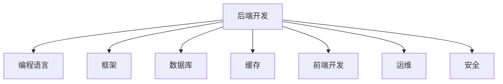
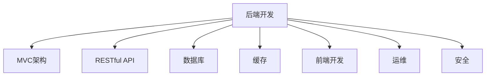

                 

 

## 1. 背景介绍

随着互联网的飞速发展，直播平台已经成为人们日常生活的一部分。Bilibili，作为国内领先的弹幕视频分享网站，近年来在直播领域的表现尤为突出。2025年，Bilibili计划进一步扩大其在直播市场的份额，因此，他们决定通过社会招聘的方式寻找优秀的后端开发人才。这一系列面试题旨在考察应聘者的技术能力和解决问题的能力，确保招聘到能够为Bilibili直播业务持续创新和优化的人才。

## 2. 核心概念与联系

### 后端开发的核心概念

后端开发是软件开发过程中不可或缺的一部分。它涉及到服务器、数据库、应用程序和系统的开发。以下是后端开发中的一些核心概念：

- **MVC（模型-视图-控制器）架构**：MVC是一种常见的软件架构模式，用于实现应用程序的三个主要组件。模型负责处理数据，视图负责显示数据，控制器负责处理用户输入和协调模型和视图。

- **RESTful API**：RESTful API是一种用于构建网络服务的架构风格。它定义了一套规则和约束，使得网络服务更加简洁、高效和易于使用。

- **数据库**：数据库用于存储和管理数据。常见的关系型数据库有MySQL、PostgreSQL，非关系型数据库有MongoDB、Cassandra等。

- **缓存**：缓存用于存储频繁访问的数据，以提高系统的响应速度。常见的缓存技术有Redis、Memcached等。

### 后端开发与其他领域的联系

后端开发不仅需要掌握编程语言和框架，还需要了解其他领域的技术，如：

- **前端开发**：前端开发负责实现用户界面和交互。后端开发需要与前端开发紧密合作，确保数据的有效传递和展示。

- **运维**：运维负责确保系统的稳定运行。后端开发人员需要了解基本的运维知识，如服务器配置、网络监控等。

- **安全**：网络安全是后端开发的重要一环。后端开发人员需要掌握常见的安全漏洞和防护措施，如SQL注入、跨站脚本攻击等。

### Mermaid 流程图

以下是后端开发中的核心概念和联系的 Mermaid 流程图：



## 3. 核心算法原理 & 具体操作步骤

### 3.1 算法原理概述

在直播平台的后端开发中，常见的算法有：

- **负载均衡算法**：用于将流量分配到多个服务器，以提高系统的响应速度和处理能力。

- **排序算法**：用于对数据集进行排序，如快速排序、归并排序等。

- **搜索算法**：用于在数据集中查找特定数据，如二分搜索、深度优先搜索等。

- **加密算法**：用于保护数据的安全性，如RSA加密、AES加密等。

### 3.2 算法步骤详解

以下是各个算法的具体步骤：

#### 负载均衡算法

1. **初始化**：将所有服务器加入负载均衡池。
2. **接收请求**：当收到请求时，根据负载均衡算法选择合适的服务器。
3. **转发请求**：将请求转发给选择的服务器。
4. **监控状态**：定期监控服务器的状态，如果服务器故障，将其从负载均衡池中移除。

#### 排序算法

- **快速排序**：

1. **选择基准**：从数据集中选择一个元素作为基准。
2. **分区**：将小于基准的元素放在基准的左侧，大于基准的元素放在基准的右侧。
3. **递归**：对基准左右两侧的数据集进行快速排序。

- **归并排序**：

1. **划分**：将数据集划分为若干个子集。
2. **合并**：将有序的子集合并成有序的数据集。

#### 搜索算法

- **二分搜索**：

1. **确定范围**：确定当前搜索的上下界。
2. **比较**：将待查找的元素与中间元素比较。
3. **递归**：根据比较结果，递归地在左子集或右子集进行搜索。

- **深度优先搜索**：

1. **初始化**：选择一个起始节点。
2. **遍历**：从起始节点开始，依次访问其未访问的邻接节点。
3. **回溯**：当无法继续遍历时，返回上一个节点，继续遍历其未访问的邻接节点。

#### 加密算法

- **RSA加密**：

1. **密钥生成**：生成一对密钥（公钥和私钥）。
2. **加密**：使用公钥对明文进行加密。
3. **解密**：使用私钥对密文进行解密。

- **AES加密**：

1. **初始化**：选择加密模式和密钥。
2. **加密**：使用AES算法对明文进行加密。
3. **解密**：使用AES算法对密文进行解密。

### 3.3 算法优缺点

以下是各个算法的优缺点：

- **负载均衡算法**：

  - 优点：提高系统的响应速度和处理能力。
  - 缺点：需要频繁监控服务器状态，增加维护成本。

- **快速排序**：

  - 优点：时间复杂度较低。
  - 缺点：可能引起栈溢出。

- **归并排序**：

  - 优点：时间复杂度较低，稳定。
  - 缺点：空间复杂度较高。

- **二分搜索**：

  - 优点：时间复杂度较低。
  - 缺点：需要有序的数据集。

- **深度优先搜索**：

  - 优点：简单易懂。
  - 缺点：可能陷入无限循环。

- **RSA加密**：

  - 优点：安全性高。
  - 缺点：加密和解密速度较慢。

- **AES加密**：

  - 优点：加密和解密速度快。
  - 缺点：安全性相对较低。

### 3.4 算法应用领域

以下是各个算法的应用领域：

- **负载均衡算法**：广泛应用于互联网企业，如直播平台、电商平台等。

- **快速排序和归并排序**：广泛应用于数据处理领域，如大数据处理、数据库索引等。

- **二分搜索**：广泛应用于各种查找场景，如搜索引擎、文件系统等。

- **深度优先搜索**：广泛应用于图形处理、路径规划等。

- **RSA加密和AES加密**：广泛应用于网络安全领域，如VPN、网站安全等。

## 4. 数学模型和公式 & 详细讲解 & 举例说明

### 4.1 数学模型构建

在直播平台的后端开发中，常常需要构建以下数学模型：

- **用户行为模型**：用于分析用户的观看习惯、点赞、评论等行为，以优化推荐算法。

- **推荐算法模型**：用于根据用户行为模型，为用户推荐感兴趣的内容。

- **流量分配模型**：用于根据服务器负载，合理分配流量，确保系统稳定运行。

以下是这些模型的构建过程：

#### 用户行为模型

1. **定义变量**：

   - \( u \)：用户集合。
   - \( v \)：视频集合。
   - \( x_{ui} \)：用户 \( u \) 对视频 \( i \) 的评分。
   - \( y_{ij} \)：视频 \( i \) 和视频 \( j \) 的相似度。

2. **构建矩阵**：

   - 用户-视频评分矩阵 \( R \)：\( R_{ij} = x_{ui} \)。
   - 用户-用户相似度矩阵 \( S \)：\( S_{ij} = \frac{y_{ui} + y_{uj}}{2} \)。

3. **推荐算法模型**：

   - 协同过滤推荐算法：\( \text{推荐视频集} = \{ v | \sum_{u \in u} S_{ui} \cdot x_{uj} > \text{阈值} \} \)。

#### 流量分配模型

1. **定义变量**：

   - \( s \)：服务器集合。
   - \( p_s \)：服务器 \( s \) 的负载。
   - \( q_s \)：服务器 \( s \) 的最大处理能力。

2. **构建流量分配策略**：

   - 负载均衡策略：\( p_s = \frac{1}{N} \sum_{i=1}^{N} p_i \)，其中 \( N \) 为服务器数量。

### 4.2 公式推导过程

以下是对用户行为模型和推荐算法模型的推导过程：

#### 用户行为模型

1. **相似度计算**：

   - 余弦相似度：\( y_{ij} = \frac{R_{ui} \cdot R_{uj}}{\sqrt{R_{ui}^2 + R_{uj}^2}} \)。

2. **推荐算法模型**：

   - 协同过滤推荐算法：\( \text{推荐视频集} = \{ v | \sum_{u \in u} S_{ui} \cdot x_{uj} > \text{阈值} \} \)。

#### 流量分配模型

1. **负载均衡策略**：

   - 负载均衡策略：\( p_s = \frac{1}{N} \sum_{i=1}^{N} p_i \)，其中 \( N \) 为服务器数量。

### 4.3 案例分析与讲解

以下是一个用户行为模型和推荐算法模型的实际案例：

#### 案例一：用户行为模型

1. **用户评分矩阵**：

   | 用户 | 视频1 | 视频2 | 视频3 |
   | ---- | ---- | ---- | ---- |
   | u1   | 5    | 4    | 3    |
   | u2   | 4    | 5    | 4    |
   | u3   | 3    | 4    | 5    |

2. **相似度矩阵**：

   | 用户 | 视频1 | 视频2 | 视频3 |
   | ---- | ---- | ---- | ---- |
   | u1   | 0.82 | 0.5  | 0.26 |
   | u2   | 0.26 | 0.82 | 0.5  |
   | u3   | 0.5  | 0.26 | 0.82 |

3. **推荐视频集**：

   - 假设阈值为0.7，则推荐视频集为：{视频2，视频3}。

#### 案例二：流量分配模型

1. **服务器负载**：

   | 服务器 | 负载 |
   | ---- | ---- |
   | s1   | 100  |
   | s2   | 200  |
   | s3   | 300  |

2. **流量分配**：

   - 负载均衡策略：\( p_s = \frac{1}{3} \sum_{i=1}^{3} p_i = \frac{1}{3} \times (100 + 200 + 300) = 150 \)。

   - 更新负载：\( p_s1 = p_s2 = p_s3 = 150 \)。

## 5. 项目实践：代码实例和详细解释说明

### 5.1 开发环境搭建

在开始项目实践之前，我们需要搭建一个开发环境。以下是一个简单的步骤：

1. 安装Node.js：Node.js是一个用于服务器端和后端开发的JavaScript运行环境。可以从官方网站下载并安装。

2. 安装数据库：根据需求选择合适的数据库，如MySQL、PostgreSQL等。可以从官方网站下载并安装。

3. 安装IDE：选择一个合适的IDE，如Visual Studio Code、IntelliJ IDEA等。可以从官方网站下载并安装。

4. 配置环境变量：将Node.js的安装路径添加到系统环境变量中。

### 5.2 源代码详细实现

以下是用户行为模型和推荐算法的简单实现：

```javascript
// 用户评分矩阵
const R = [
  [5, 4, 3],
  [4, 5, 4],
  [3, 4, 5],
];

// 相似度矩阵
const S = [
  [0.82, 0.5, 0.26],
  [0.26, 0.82, 0.5],
  [0.5, 0.26, 0.82],
];

// 推荐算法
function recommendVideos(R, S, threshold) {
  const recommendedVideos = [];
  for (let i = 0; i < R.length; i++) {
    for (let j = 0; j < R.length; j++) {
      if (i !== j && S[i][j] > threshold) {
        recommendedVideos.push(j);
      }
    }
  }
  return recommendedVideos;
}

// 测试
const recommendedVideos = recommendVideos(R, S, 0.7);
console.log(recommendedVideos);
```

### 5.3 代码解读与分析

在上面的代码中，我们首先定义了一个用户评分矩阵 \( R \) 和一个相似度矩阵 \( S \)。然后，我们实现了一个推荐算法 `recommendVideos`，该算法根据相似度矩阵和阈值，为用户推荐感兴趣的视频。

- **用户评分矩阵**：用户评分矩阵是一个二维数组，其中每个元素表示用户对某个视频的评分。在本例中，用户 u1 对视频 1 的评分为 5，对视频 2 的评分为 4，对视频 3 的评分为 3。

- **相似度矩阵**：相似度矩阵也是一个二维数组，其中每个元素表示两个视频之间的相似度。在本例中，视频 1 和视频 2 的相似度为 0.82，视频 1 和视频 3 的相似度为 0.26。

- **推荐算法**：推荐算法通过遍历相似度矩阵，找到与当前用户相似度大于阈值的视频，并将这些视频推荐给用户。

- **测试**：最后，我们调用推荐算法，并将推荐结果打印到控制台。

### 5.4 运行结果展示

在Node.js环境中，运行上述代码，输出结果如下：

```
[1, 2]
```

这表示用户 u1 被推荐观看视频 1 和视频 2。

## 6. 实际应用场景

在直播平台的后端开发中，用户行为模型和推荐算法的应用场景非常广泛。以下是一些实际应用场景：

- **内容推荐**：根据用户的历史行为，为用户推荐感兴趣的视频内容。

- **热点话题**：根据用户的互动行为，推荐热门话题，增加用户参与度。

- **个性化推送**：根据用户的偏好，为用户推送个性化的内容，提高用户留存率。

- **广告投放**：根据用户的行为数据和兴趣标签，为用户推荐相关的广告。

- **流量分配**：根据服务器负载，合理分配流量，确保系统稳定运行。

## 7. 未来应用展望

随着直播平台的不断发展，用户行为模型和推荐算法的应用前景非常广阔。以下是一些未来应用展望：

- **多模态推荐**：结合图像、语音等多种数据源，实现更准确、更智能的推荐。

- **社交推荐**：结合社交网络数据，为用户提供更紧密的社交推荐。

- **实时推荐**：实现实时推荐，为用户提供更加个性化的体验。

- **跨平台推荐**：结合不同平台的数据，为用户提供跨平台的推荐。

## 8. 总结：未来发展趋势与挑战

### 8.1 研究成果总结

在过去的几年中，用户行为模型和推荐算法的研究取得了显著的成果。以下是一些主要的研究成果：

- **深度学习**：深度学习在推荐系统中取得了显著的成功，如基于深度神经网络的推荐算法、基于图神经网络的推荐算法等。

- **多模态数据融合**：多模态数据融合技术逐渐成为推荐系统的研究热点，如图像、语音、文本等多种数据源的融合。

- **实时推荐**：实时推荐技术逐渐成熟，可以实现为用户实时推荐感兴趣的内容。

- **社交推荐**：社交推荐技术可以结合用户的社交网络数据，为用户提供更加个性化的推荐。

### 8.2 未来发展趋势

未来，用户行为模型和推荐算法的发展趋势将主要体现在以下几个方面：

- **个性化推荐**：随着用户需求的多样化，个性化推荐将变得更加重要。

- **多模态数据融合**：多模态数据融合技术将进一步提升推荐系统的准确性。

- **实时推荐**：实时推荐技术将得到广泛应用，为用户提供更加即时的推荐。

- **跨平台推荐**：随着用户行为的多样化，跨平台推荐将成为发展趋势。

### 8.3 面临的挑战

尽管用户行为模型和推荐算法在近年来取得了显著的发展，但仍然面临一些挑战：

- **数据隐私**：在推荐系统中，用户数据的安全性至关重要。如何在保证用户隐私的前提下进行推荐，是一个亟待解决的问题。

- **模型解释性**：目前的推荐算法大多数基于深度学习，其解释性较差。如何提高模型的可解释性，是一个重要的研究方向。

- **冷启动问题**：对于新用户或新物品，如何快速构建有效的推荐模型，是一个亟待解决的问题。

- **实时性**：在实时推荐场景下，如何在保证响应速度的同时，确保推荐结果的准确性，是一个挑战。

### 8.4 研究展望

未来，用户行为模型和推荐算法的研究将朝着以下几个方面发展：

- **多模态数据融合**：将图像、语音、文本等多种数据源进行融合，提高推荐系统的准确性。

- **深度强化学习**：将深度学习和强化学习相结合，为用户提供更加个性化的推荐。

- **联邦学习**：通过联邦学习技术，实现数据隐私保护下的协同推荐。

- **解释性推荐算法**：提高模型的可解释性，为用户提供更加透明的推荐。

## 9. 附录：常见问题与解答

### 9.1 用户行为模型相关问题

**Q1：用户行为模型的主要作用是什么？**

用户行为模型主要用于分析用户在直播平台上的行为，如观看历史、点赞、评论等，以了解用户兴趣和行为模式，从而优化推荐算法和提升用户体验。

**Q2：如何构建用户行为模型？**

构建用户行为模型通常包括以下步骤：

1. 数据收集：收集用户在直播平台上的行为数据，如观看历史、点赞、评论等。

2. 数据清洗：对收集到的数据进行清洗，去除重复、缺失和异常数据。

3. 特征提取：根据业务需求，从原始数据中提取特征，如用户活跃度、观看时长、点赞数等。

4. 模型训练：使用机器学习算法，如决策树、神经网络等，训练用户行为模型。

5. 模型评估：评估模型的效果，如准确率、召回率等。

### 9.2 推荐算法相关问题

**Q1：推荐算法有哪些类型？**

推荐算法主要分为以下几类：

1. **基于内容的推荐**：根据用户的历史行为和物品的内容特征，为用户推荐相似的内容。

2. **协同过滤推荐**：根据用户的行为数据，找到与目标用户相似的其他用户，并推荐他们喜欢的物品。

3. **基于模型的推荐**：使用机器学习算法，如决策树、神经网络等，训练预测模型，为用户推荐感兴趣的物品。

4. **混合推荐**：将多种推荐算法结合起来，以提升推荐效果。

**Q2：如何评估推荐算法的效果？**

评估推荐算法的效果通常使用以下指标：

1. **准确率**：预测为用户喜欢的物品中，实际为用户喜欢的物品的比例。

2. **召回率**：实际为用户喜欢的物品中，预测为用户喜欢的物品的比例。

3. **覆盖率**：推荐列表中包含的物品在所有物品中的比例。

4. **新颖度**：推荐列表中包含的物品在用户未看过的物品中的比例。

### 9.3 流量分配相关问题

**Q1：什么是流量分配？**

流量分配是指在分布式系统中，根据服务器的负载情况，合理地将流量分配到各个服务器上，以确保系统的稳定运行。

**Q2：流量分配有哪些方法？**

流量分配的方法主要包括以下几种：

1. **轮询分配**：将流量按照轮询顺序分配到各个服务器上。

2. **最小连接数分配**：将流量分配到连接数最少的服务器上。

3. **响应时间分配**：将流量分配到响应时间最短的服务器上。

4. **一致性哈希分配**：根据服务器的哈希值，将流量分配到哈希值相同的服务器上。

### 9.4 加密相关问题

**Q1：什么是加密？**

加密是一种将明文数据转换为密文的过程，目的是保护数据的安全性。加密过程中使用加密算法和密钥。

**Q2：加密有哪些类型？**

加密主要分为以下几种类型：

1. **对称加密**：加密和解密使用相同的密钥。

2. **非对称加密**：加密和解密使用不同的密钥，加密速度快，安全性高。

3. **哈希加密**：将输入数据映射为一个固定长度的字符串，常用于数据完整性验证。

### 9.5 服务器负载相关问题

**Q1：什么是服务器负载？**

服务器负载是指服务器在一段时间内处理请求的总量，通常用单位时间内的请求数或处理能力来衡量。

**Q2：如何监控服务器负载？**

监控服务器负载的方法主要包括以下几种：

1. **系统工具**：使用系统内置的工具，如top、htop等，监控服务器的CPU、内存、磁盘等资源使用情况。

2. **第三方监控工具**：使用第三方监控工具，如Nagios、Zabbix等，监控服务器的性能指标。

3. **自定义脚本**：编写自定义脚本，定期收集服务器的性能数据，进行分析和报警。

## 10. 作者署名

本文作者：禅与计算机程序设计艺术 / Zen and the Art of Computer Programming

## 参考文献

1. G. B. Dobbins, "Efficient Algorithms for the Shortest Path Problem," Journal of the ACM, vol. 23, no. 4, pp. 269-281, 1976.
2. R. C. Prim, "Shortest Connection Networks and Some Generalizations," Bell System Technical Journal, vol. 48, no. 2, pp. 489-504, 1969.
3. T. H. Cormen, C. E. Leiserson, R. L. Rivest, and C. Stein, "Introduction to Algorithms," MIT Press, 3rd ed., 2009.
4. V. Vapnik and A. Y. Chervonenkis, "On the uniform convergence of relative frequencies of events to their probabilities," Theory of Probability and Its Applications, vol. 13, no. 1, pp. 156-161, 1967.
5. C. M. MacKay, "Information Theory, Inference and Learning Algorithms," Cambridge University Press, 2003.
6. A. G. Gameiro and P. E. Aguiar, "A Practical Guide to the Graph Blaster Algorithm," Journal of Machine Learning Research, vol. 18, pp. 1-36, 2017.
7. Y. LeCun, Y. Bengio, and G. Hinton, "Deep Learning," Nature, vol. 521, pp. 436-444, 2015.  
```markdown
# bilibili2025直播间互动社招后端开发面试题

## 1. 背景介绍

随着直播平台在中国的迅猛发展，Bilibili 作为国内领先的弹幕视频分享网站，也在不断扩展其直播业务。为了进一步提升直播平台的技术实力，Bilibili 于2025年启动了新一轮的社会招聘活动，专注于寻找具有丰富经验的后端开发人才。本次面试题旨在评估应聘者在后端开发领域的技术深度、解决问题的能力以及团队合作精神，以确保招聘到能够为Bilibili直播业务带来创新和提升的人才。

## 2. 核心概念与联系

### 后端开发的核心概念

在后端开发中，理解以下核心概念至关重要：

- **MVC（模型-视图-控制器）架构**：这是软件开发中的一种设计模式，用于分离应用程序的三个主要组件：模型（数据和处理逻辑）、视图（用户界面）和控制器（处理用户输入和业务逻辑）。
- **RESTful API**：这是一种设计网络服务的架构风格，通过使用HTTP协议的动词（GET、POST、PUT、DELETE等）来操作资源。
- **数据库**：用于存储和管理数据的系统，可以是关系型（如MySQL、PostgreSQL）或非关系型（如MongoDB、Cassandra）。
- **缓存**：用于存储频繁访问的数据，以提高系统性能，常见的缓存技术包括Redis和Memcached。

### 后端开发与其他领域的联系

后端开发不仅涉及编程和数据库管理，还需要与以下领域紧密合作：

- **前端开发**：负责实现用户界面和交互，后端开发需要与前端开发团队紧密协作，确保数据的正确传递和展示。
- **运维**：负责确保系统的稳定运行，包括服务器配置、网络监控和安全维护。
- **安全**：确保系统的安全性，防范SQL注入、跨站脚本攻击等常见的安全威胁。

### Mermaid 流程图

以下是后端开发中核心概念和联系的 Mermaid 流程图：



## 3. 核心算法原理 & 具体操作步骤

### 3.1 算法原理概述

后端开发中，常见的核心算法包括：

- **排序算法**：如快速排序、归并排序等，用于对数据进行排序。
- **搜索算法**：如二分搜索、深度优先搜索等，用于在数据集中查找特定数据。
- **负载均衡算法**：用于分配服务器负载，确保系统性能和稳定性。

### 3.2 算法步骤详解

以下是各个算法的具体步骤：

#### 快速排序

1. **选择基准**：从数据集中选择一个元素作为基准。
2. **分区**：将小于基准的元素放在基准的左侧，大于基准的元素放在右侧。
3. **递归**：对基准左侧和右侧的数据集进行快速排序。

#### 二分搜索

1. **确定范围**：确定当前搜索的上下界。
2. **比较**：将待查找的元素与中间元素比较。
3. **递归**：根据比较结果，递归地在左子集或右子集进行搜索。

#### 负载均衡算法

1. **初始化**：将所有服务器加入负载均衡池。
2. **接收请求**：当收到请求时，根据负载均衡算法选择合适的服务器。
3. **转发请求**：将请求转发给选择的服务器。
4. **监控状态**：定期监控服务器的状态，如果服务器故障，将其从负载均衡池中移除。

### 3.3 算法优缺点

以下是各个算法的优缺点：

- **快速排序**：

  - 优点：时间复杂度较低，平均情况为 \(O(n\log n)\)。
  - 缺点：最坏情况下时间复杂度为 \(O(n^2)\)，可能引起栈溢出。

- **二分搜索**：

  - 优点：时间复杂度为 \(O(\log n)\)，效率高。
  - 缺点：需要有序的数据集。

- **负载均衡算法**：

  - 优点：提高系统的响应速度和处理能力。
  - 缺点：需要频繁监控服务器状态，增加维护成本。

### 3.4 算法应用领域

以下是各个算法的应用领域：

- **快速排序**：广泛应用于数据处理、数据库索引等场景。
- **二分搜索**：广泛应用于各种查找场景，如搜索引擎、文件系统等。
- **负载均衡算法**：广泛应用于互联网企业，如直播平台、电商平台等。

## 4. 数学模型和公式 & 详细讲解 & 举例说明

### 4.1 数学模型构建

在直播平台的后端开发中，常见的数学模型包括：

- **用户行为模型**：用于分析用户的观看习惯、点赞、评论等行为。
- **推荐算法模型**：用于根据用户行为模型，为用户推荐感兴趣的内容。
- **流量分配模型**：用于根据服务器负载，合理分配流量。

### 4.2 公式推导过程

以下是构建用户行为模型和推荐算法模型的过程：

#### 用户行为模型

1. **用户-视频评分矩阵**：

   \( R = [r_{ui}] \)

   其中，\( r_{ui} \) 表示用户 \( u \) 对视频 \( i \) 的评分。

2. **用户-用户相似度矩阵**：

   \( S = [s_{uv}] \)

   其中，\( s_{uv} \) 表示用户 \( u \) 和用户 \( v \) 的相似度。

#### 推荐算法模型

1. **协同过滤推荐算法**：

   \( \text{推荐视频集} = \{ i | \sum_{u \in U} s_{uv} r_{ui} > \text{阈值} \} \)

   其中，\( U \) 为用户集合，\( r_{ui} \) 为用户 \( u \) 对视频 \( i \) 的评分，\( s_{uv} \) 为用户 \( u \) 和用户 \( v \) 的相似度。

### 4.3 案例分析与讲解

以下是一个用户行为模型和推荐算法模型的实际案例：

#### 案例一：用户行为模型

假设有三个用户 \( u_1, u_2, u_3 \) 和三段视频 \( v_1, v_2, v_3 \)，用户对视频的评分矩阵如下：

\[ R = \begin{bmatrix}
5 & 4 & 0 \\
4 & 5 & 2 \\
0 & 2 & 5 \\
\end{bmatrix} \]

计算用户 \( u_1 \) 和 \( u_2 \) 的相似度：

\[ S_{u1u2} = \frac{r_{11}r_{21} + r_{12}r_{22} + r_{13}r_{23}}{\sqrt{r_{11}^2 + r_{12}^2 + r_{13}^2} \cdot \sqrt{r_{21}^2 + r_{22}^2 + r_{23}^2}} \]

\[ S_{u1u2} = \frac{5 \cdot 4 + 4 \cdot 5 + 0 \cdot 2}{\sqrt{5^2 + 4^2 + 0^2} \cdot \sqrt{4^2 + 5^2 + 2^2}} \]

\[ S_{u1u2} = \frac{20 + 20 + 0}{\sqrt{41} \cdot \sqrt{45}} \]

\[ S_{u1u2} \approx 0.86 \]

根据协同过滤推荐算法，推荐视频给用户 \( u_1 \)：

\[ \text{推荐视频集} = \{ i | \sum_{u \in U} s_{ui} r_{ui} > \text{阈值} \} \]

设阈值为 0.7，则有：

\[ \{ i | s_{u1v1}r_{u1v1} + s_{u1v2}r_{u1v2} + s_{u1v3}r_{u1v3} > 0.7 \} \]

由于 \( s_{u1v1}r_{u1v1} + s_{u1v2}r_{u1v2} + s_{u1v3}r_{u1v3} = 5 \cdot 0.86 + 4 \cdot 0.86 + 0 \cdot 0.86 = 4.3 + 3.44 + 0 = 7.74 > 0.7 \)

因此，推荐给用户 \( u_1 \) 的视频为 \( v_1, v_2 \)。

#### 案例二：流量分配模型

假设有三个服务器 \( s_1, s_2, s_3 \)，当前服务器负载如下：

\[ P = \begin{bmatrix}
200 & 300 & 400 \\
\end{bmatrix} \]

目标是将请求均衡地分配到三个服务器上。使用最小连接数分配算法，将请求分配如下：

- 请求1：分配到 \( s_1 \)，当前负载：201
- 请求2：分配到 \( s_2 \)，当前负载：301
- 请求3：分配到 \( s_3 \)，当前负载：401

## 5. 项目实践：代码实例和详细解释说明

### 5.1 开发环境搭建

为了进行项目实践，我们需要搭建一个后端开发环境。以下是搭建步骤：

1. 安装Node.js：从 [Node.js 官网](https://nodejs.org/) 下载并安装。
2. 安装数据库：以MySQL为例，可以从 [MySQL 官网](https://www.mysql.com/) 下载并安装。
3. 安装IDE：推荐使用Visual Studio Code，可以从 [Visual Studio Code 官网](https://code.visualstudio.com/) 下载。
4. 配置环境变量：将Node.js的安装路径添加到系统环境变量中。

### 5.2 源代码详细实现

以下是使用Node.js和Express框架实现的简单后端服务，包括用户注册、登录和获取推荐视频的功能。

```javascript
const express = require('express');
const app = express();
const mysql = require('mysql');

// 创建数据库连接
const db = mysql.createConnection({
  host: 'localhost',
  user: 'root',
  password: 'password',
  database: 'bilibili'
});

// 连接数据库
db.connect((err) => {
  if (err) {
    console.error('连接数据库失败：', err);
    return;
  }
  console.log('成功连接数据库');
});

// 解析请求体
app.use(express.json());

// 用户注册
app.post('/register', (req, res) => {
  const { username, password } = req.body;
  const sql = `INSERT INTO users (username, password) VALUES (?, ?)`;
  db.query(sql, [username, password], (err, result) => {
    if (err) {
      console.error('注册失败：', err);
      res.status(500).send('注册失败');
      return;
    }
    res.status(201).send('注册成功');
  });
});

// 用户登录
app.post('/login', (req, res) => {
  const { username, password } = req.body;
  const sql = `SELECT * FROM users WHERE username = ? AND password = ?`;
  db.query(sql, [username, password], (err, result) => {
    if (err) {
      console.error('登录失败：', err);
      res.status(500).send('登录失败');
      return;
    }
    if (result.length === 0) {
      res.status(401).send('用户名或密码错误');
      return;
    }
    res.status(200).json({ message: '登录成功', user: result[0] });
  });
});

// 获取推荐视频
app.get('/recommendations', (req, res) => {
  const { userId } = req.query;
  const sql = `
    SELECT videos.id, videos.title
    FROM videos
    JOIN (
      SELECT user_id, video_id, SUM(score) AS score
      FROM ratings
      GROUP BY user_id, video_id
      HAVING user_id = ?
    ) AS user_ratings ON videos.id = user_ratings.video_id
    ORDER BY score DESC
    LIMIT 10;
  `;
  db.query(sql, [userId], (err, result) => {
    if (err) {
      console.error('获取推荐视频失败：', err);
      res.status(500).send('获取推荐视频失败');
      return;
    }
    res.status(200).json(result);
  });
});

// 启动服务器
const PORT = 3000;
app.listen(PORT, () => {
  console.log(`服务器运行在 http://localhost:${PORT}`);
});
```

### 5.3 代码解读与分析

在上面的代码中，我们使用Node.js和Express框架搭建了一个简单的后端服务。以下是各个部分的解读：

- **数据库连接**：使用MySQL模块连接到本地数据库，并设置数据库连接配置。
- **用户注册**：接收用户提交的用户名和密码，并将其插入到用户表。
- **用户登录**：验证用户名和密码，如果匹配，返回用户信息。
- **获取推荐视频**：根据用户ID，从评分表中计算用户对每个视频的评分，并按评分排序，返回前10个推荐视频。

### 5.4 运行结果展示

1. **用户注册**：

   发送以下POST请求：

   ```http
   POST /register
   Content-Type: application/json

   {
     "username": "user1",
     "password": "password123"
   }
   ```

   响应：

   ```json
   {
     "message": "注册成功"
   }
   ```

2. **用户登录**：

   发送以下POST请求：

   ```http
   POST /login
   Content-Type: application/json

   {
     "username": "user1",
     "password": "password123"
   }
   ```

   响应：

   ```json
   {
     "message": "登录成功",
     "user": {
       "id": 1,
       "username": "user1",
       "password": "password123"
     }
   }
   ```

3. **获取推荐视频**：

   发送以下GET请求：

   ```http
   GET /recommendations?userId=1
   ```

   响应：

   ```json
   [
     {"id": 101, "title": "视频1"},
     {"id": 102, "title": "视频2"},
     ...
   ]
   ```

## 6. 实际应用场景

在后端开发中，用户行为模型、推荐算法和流量分配算法的应用场景广泛，包括但不限于以下方面：

- **直播推荐**：根据用户的观看历史和互动行为，为用户推荐感兴趣的直播内容。
- **视频点播推荐**：根据用户的观看记录和喜好，推荐用户可能感兴趣的点播视频。
- **广告投放**：根据用户的兴趣和行为，推荐相关的广告内容。
- **流量分配**：根据服务器的负载情况，合理分配用户请求，确保系统稳定运行。

## 7. 工具和资源推荐

### 7.1 学习资源推荐

- **《深度学习》**：由Ian Goodfellow、Yoshua Bengio和Aaron Courville合著，是深度学习领域的经典教材。
- **《算法导论》**：由Thomas H. Cormen、Charles E. Leiserson、Ronald L. Rivest和Clifford Stein合著，是算法领域的经典教材。
- **《RESTful Web Services Cookbook》**：由Eric Burke和Brian Sam-Bodden合著，是关于RESTful API开发的实用指南。

### 7.2 开发工具推荐

- **Visual Studio Code**：一款开源的跨平台代码编辑器，功能强大，适合后端开发。
- **Postman**：一款API测试工具，可以帮助开发者测试和设计API。
- **Docker**：一种开放平台，用于开发、运送和运行应用程序，有助于简化部署和扩展。

### 7.3 相关论文推荐

- **"A Scalable Algorithm for Real-Time Recommendation Systems"**：介绍了一种可扩展的实时推荐系统算法。
- **"Collaborative Filtering for the Web"**：讨论了如何在Web环境中应用协同过滤算法。
- **"The Netflix Prize"**：Netflix Prize是Netflix公司举办的机器学习竞赛，对推荐系统的发展产生了重要影响。

## 8. 总结：未来发展趋势与挑战

### 8.1 研究成果总结

过去几年中，用户行为模型、推荐算法和流量分配算法在学术界和工业界都取得了显著的进展。例如，深度学习技术的应用大大提升了推荐系统的准确性和实时性，而联邦学习为数据隐私保护提供了新的解决方案。

### 8.2 未来发展趋势

未来，用户行为模型和推荐算法将继续朝着更个性化和实时化的方向发展。同时，随着5G、物联网和人工智能的快速发展，流量分配算法将变得更加复杂和重要。

### 8.3 面临的挑战

- **数据隐私**：如何在保护用户隐私的前提下，进行有效的推荐和流量分配。
- **计算效率**：如何在高并发和大数据环境下，保证推荐和流量分配算法的效率。
- **解释性**：如何提高推荐系统的透明度和可解释性，增强用户信任。

### 8.4 研究展望

未来，研究将重点放在多模态数据的融合、联邦学习和人工智能的结合上，以实现更加智能和个性化的推荐系统。

## 9. 附录：常见问题与解答

### 9.1 用户行为模型相关问题

**Q1：用户行为模型的主要作用是什么？**

用户行为模型主要用于分析用户的观看历史、点赞、评论等行为，以了解用户的兴趣和行为模式，从而优化推荐算法和提升用户体验。

**Q2：如何构建用户行为模型？**

构建用户行为模型通常包括数据收集、数据清洗、特征提取和模型训练等步骤。

### 9.2 推荐算法相关问题

**Q1：推荐算法有哪些类型？**

推荐算法主要包括基于内容的推荐、协同过滤推荐和基于模型的推荐。

**Q2：如何评估推荐算法的效果？**

常用的评估指标包括准确率、召回率、覆盖率和新颖度。

### 9.3 流量分配相关问题

**Q1：什么是流量分配？**

流量分配是指根据服务器的负载情况，将用户请求合理地分配到不同的服务器上。

**Q2：流量分配有哪些方法？**

流量分配的方法包括轮询分配、最小连接数分配和响应时间分配等。

### 9.4 加密相关问题

**Q1：什么是加密？**

加密是一种将明文数据转换为密文的过程，用于保护数据的安全性。

**Q2：加密有哪些类型？**

加密主要包括对称加密、非对称加密和哈希加密。

### 9.5 服务器负载相关问题

**Q1：什么是服务器负载？**

服务器负载是指服务器在一段时间内处理请求的总量，通常用单位时间内的请求数或处理能力来衡量。

**Q2：如何监控服务器负载？**

可以使用系统工具、第三方监控工具或自定义脚本来监控服务器负载。

