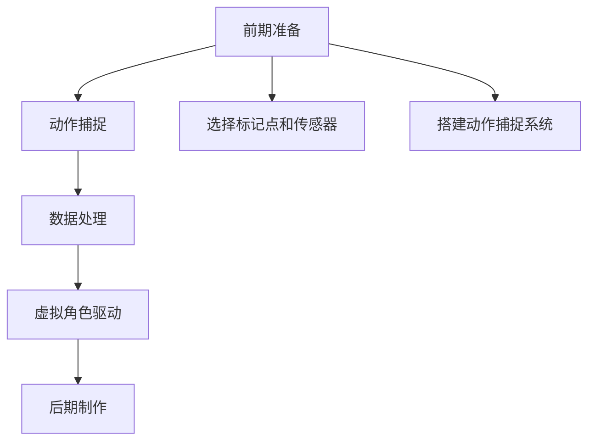

                 

 在当今这个数字时代，虚拟偶像已经成为一个引人注目的娱乐领域，吸引了无数粉丝。随着技术的不断进步，动作捕捉技术（Motion Capture）在虚拟偶像的制作中扮演着越来越重要的角色。本文旨在为您提供一个全面的指南，帮助您准备bilibili 2025虚拟偶像社招的动作捕捉面试题。我们将从背景介绍、核心概念、算法原理、数学模型、项目实践和实际应用等多个方面进行详细阐述。

## 关键词

- 虚拟偶像
- 动作捕捉
- 面试攻略
- 技术原理
- 实际应用

## 摘要

本文围绕bilibili 2025虚拟偶像社招的动作捕捉面试题展开，系统性地介绍了动作捕捉技术的发展背景、核心概念、算法原理、数学模型以及实际应用。通过本文，您将能够全面了解动作捕捉技术的各个方面，为应对面试做好准备。同时，文章还提供了实用的项目实践和工具资源推荐，以帮助您在实际操作中更好地运用所学知识。

## 1. 背景介绍

### 动作捕捉技术的发展历程

动作捕捉技术（Motion Capture，简称MoCap）起源于20世纪70年代，最初用于军事和科学领域，如飞行模拟和人体运动分析。随着时间的推移，这项技术逐渐应用于电影制作、游戏开发、虚拟现实和增强现实等领域。

在电影制作中，动作捕捉技术被广泛用于制作特效场景，如《指环王》和《阿凡达》等电影中的奇幻生物和动作场景。在游戏开发领域，动作捕捉技术可以帮助游戏角色实现更加真实和流畅的动作表现，提升玩家的沉浸体验。虚拟现实（VR）和增强现实（AR）技术的兴起，也为动作捕捉技术提供了更广阔的应用空间，使其成为构建沉浸式体验的关键技术之一。

### 虚拟偶像的兴起

随着人工智能技术和虚拟现实技术的发展，虚拟偶像逐渐成为了一种新兴的娱乐形式。虚拟偶像通过结合人工智能、动作捕捉和图形渲染等技术，实现了对真实人物动作和表情的模拟，为观众带来了全新的视觉和听觉体验。

bilibili作为国内知名的视频平台，早在2018年就推出了虚拟偶像A-SOUL，引起了广泛关注。此后，bilibili持续在虚拟偶像领域进行探索和投入，推出了多个虚拟偶像项目，如Kizuna AI、Hololive等。这些虚拟偶像不仅在粉丝群体中拥有极高的人气，还为平台带来了大量的流量和商业价值。

### 动作捕捉技术在虚拟偶像中的应用

在虚拟偶像的制作过程中，动作捕捉技术扮演着至关重要的角色。通过动作捕捉，虚拟偶像可以实时捕捉和模拟真实人物的动作和表情，使其在舞台表演、视频制作等场景中更加生动和自然。

动作捕捉技术可以分为两大类：基于标记系统的动作捕捉和基于惯性传感器的动作捕捉。前者通过在演员身体上附着标记点，利用摄像头或红外线传感器捕捉标记点的运动，从而实现动作的实时追踪。后者则通过佩戴在演员身上的惯性传感器（如加速度计和陀螺仪），直接测量身体各部分的运动状态。

在虚拟偶像的制作过程中，动作捕捉技术通常与图形渲染、虚拟现实和增强现实等技术相结合，共同构建出一个逼真的虚拟世界。通过精确的动作捕捉，虚拟偶像可以展现出与真实人物相似的动作和表情，为观众带来更加真实的感受。

## 2. 核心概念与联系

### 动作捕捉的基本原理

动作捕捉技术的基本原理是通过实时捕捉和记录人体动作，并将其转化为计算机可处理的数字信号。具体来说，动作捕捉技术主要涉及以下几个核心概念：

1. **标记点（Marker）**：在演员身体的关键部位（如头部、四肢等）附着标记点，这些标记点通常为反光球或红外线发射器。

2. **传感器（Sensor）**：用于捕捉标记点运动状态的设备，包括摄像头、红外线传感器、惯性传感器等。

3. **跟踪算法（Tracking Algorithm）**：通过对传感器获取的数据进行处理，实现对标记点运动轨迹的追踪和计算。

4. **数据处理（Data Processing）**：将追踪结果转化为三维坐标，生成运动轨迹，进而用于驱动虚拟角色。

### 动作捕捉系统的架构

一个典型的动作捕捉系统通常由以下几部分组成：

1. **标记点装备**：在演员身体的关键部位附着标记点，确保能够准确捕捉到各个部位的运动。

2. **传感器设备**：根据不同的捕捉需求，选择合适的传感器设备。常见的有红外线摄像头、立体摄像头、惯性传感器等。

3. **捕捉软件**：负责处理传感器数据，进行标记点的追踪和运动轨迹的计算。常见的捕捉软件有MotionBuilder、Capturespace等。

4. **数据处理软件**：将捕捉到的运动数据进行处理，生成可用于驱动虚拟角色的三维运动轨迹。常见的处理软件有Blender、Maya等。

### 动作捕捉技术的应用流程

动作捕捉技术的应用流程主要包括以下几个步骤：

1. **前期准备**：确定动作捕捉的需求，选择合适的标记点和传感器设备，搭建动作捕捉系统。

2. **动作捕捉**：在导演的指导下，演员按照预设的动作进行表演，传感器设备实时捕捉标记点的运动状态。

3. **数据处理**：通过捕捉软件将传感器数据转化为运动轨迹，并进行处理和优化。

4. **虚拟角色驱动**：将处理后的运动轨迹应用于虚拟角色，实现真实动作的模拟。

5. **后期制作**：对虚拟角色进行渲染、剪辑等后期处理，生成最终的视频或动画作品。

### Mermaid流程图



## 3. 核心算法原理 & 具体操作步骤

### 3.1 算法原理概述

动作捕捉技术涉及多个核心算法，主要包括标记点追踪算法、运动轨迹生成算法和运动补偿算法等。这些算法共同作用于传感器数据，实现对演员动作的精确捕捉和模拟。

1. **标记点追踪算法**：通过对传感器数据进行分析和处理，实时追踪标记点的运动轨迹。常见的追踪算法有光流法、粒子滤波等。

2. **运动轨迹生成算法**：将追踪结果转化为三维坐标，生成运动轨迹。常见的生成算法有基于贝塞尔曲线的轨迹生成、基于关键帧的轨迹生成等。

3. **运动补偿算法**：对捕捉到的动作进行补偿和优化，以消除由于传感器误差、演员动作不连贯等因素导致的运动失真。常见的补偿算法有滤波算法、插值算法等。

### 3.2 算法步骤详解

1. **标记点追踪算法**

   - **输入**：传感器数据
   - **输出**：标记点坐标
   - **步骤**：
     1. 数据预处理：对传感器数据进行滤波、去噪等处理，提高数据质量。
     2. 特征提取：从传感器数据中提取关键特征，如标记点的位置、速度等。
     3. 追踪算法：使用光流法或粒子滤波等算法对特征进行匹配和追踪，计算标记点的运动轨迹。
     4. 结果验证：对追踪结果进行验证，确保标记点轨迹的准确性和连贯性。

2. **运动轨迹生成算法**

   - **输入**：标记点坐标
   - **输出**：运动轨迹
   - **步骤**：
     1. 建立坐标系：根据标记点坐标建立三维坐标系。
     2. 提取关键帧：从标记点轨迹中提取关键帧，确定虚拟角色的关键姿态。
     3. 轨迹生成：使用贝塞尔曲线或关键帧插值等方法，生成虚拟角色的运动轨迹。
     4. 轨迹优化：对生成的轨迹进行优化，消除抖动、平滑过渡等。

3. **运动补偿算法**

   - **输入**：原始运动轨迹
   - **输出**：补偿后运动轨迹
   - **步骤**：
     1. 运动分析：对原始运动轨迹进行分析，识别异常或失真的部分。
     2. 补偿策略：根据运动分析结果，选择合适的补偿策略，如滤波、插值等。
     3. 补偿计算：对运动轨迹进行补偿计算，消除异常和失真。
     4. 补偿验证：对补偿后的运动轨迹进行验证，确保补偿效果的准确性和有效性。

### 3.3 算法优缺点

1. **标记点追踪算法**

   - 优点：能够实时捕捉标记点运动，实时性较高。
   - 缺点：易受环境光照、传感器误差等因素影响，准确性和稳定性有待提高。

2. **运动轨迹生成算法**

   - 优点：能够生成平滑、连续的运动轨迹，满足虚拟角色动作的自然性。
   - 缺点：对初始标记点坐标的准确性要求较高，否则可能导致轨迹生成失真。

3. **运动补偿算法**

   - 优点：能够对运动轨迹进行优化和补偿，消除异常和失真，提高轨迹质量。
   - 缺点：补偿策略的选择和计算复杂度较高，对算法实现和优化要求较高。

### 3.4 算法应用领域

动作捕捉技术广泛应用于电影制作、游戏开发、虚拟现实、增强现实等领域。以下是一些典型的应用案例：

1. **电影制作**：在电影特效制作中，动作捕捉技术被用于捕捉演员的动作和表情，生成特效场景中的虚拟角色。如《阿凡达》中的纳美族人、电影《特种部队：狼群》中的战斗场景等。

2. **游戏开发**：在游戏开发中，动作捕捉技术被用于制作角色动作，提高游戏角色的动作流畅性和自然性。如游戏《战地》中的角色动作捕捉、游戏《刺客信条》中的战斗动作捕捉等。

3. **虚拟现实**：在虚拟现实中，动作捕捉技术被用于捕捉用户的动作，实现与现实世界的互动。如VR游戏、VR培训、VR医疗等领域。

4. **增强现实**：在增强现实中，动作捕捉技术被用于捕捉用户动作，增强虚拟内容与现实世界的交互。如AR游戏、AR教育、AR娱乐等领域。

## 4. 数学模型和公式 & 详细讲解 & 举例说明

### 4.1 数学模型构建

动作捕捉技术的数学模型主要包括标记点运动模型、运动轨迹模型和补偿模型。以下是这些模型的详细描述：

1. **标记点运动模型**

   标记点运动模型描述了标记点在空间中的运动规律。假设标记点 \( P \) 在三维空间中的位置由 \( x \), \( y \), \( z \) 三个坐标表示，则标记点 \( P \) 的运动模型可以表示为：
   
   $$ P(t) = (x(t), y(t), z(t)) $$
   
   其中 \( t \) 表示时间，\( P(t) \) 表示标记点在时间 \( t \) 的位置。

2. **运动轨迹模型**

   运动轨迹模型描述了虚拟角色的运动轨迹。假设虚拟角色在三维空间中的位置由 \( X \), \( Y \), \( Z \) 三个坐标表示，则运动轨迹模型可以表示为：
   
   $$ X(t) = x(t), \quad Y(t) = y(t), \quad Z(t) = z(t) $$
   
   其中 \( x(t) \), \( y(t) \), \( z(t) \) 分别表示虚拟角色在三维空间中 \( x \), \( y \), \( z \) 方向上的运动轨迹。

3. **补偿模型**

   补偿模型用于对捕捉到的动作进行补偿和优化。常见的补偿模型包括滤波模型和插值模型。滤波模型通过对运动轨迹进行滤波，消除抖动和噪声。插值模型通过对运动轨迹进行插值，平滑过渡和消除失真。

### 4.2 公式推导过程

以下是动作捕捉技术中一些关键公式的推导过程：

1. **标记点追踪算法中的光流法**

   光流法是一种基于图像序列的运动估计方法。假设连续两帧图像分别为 \( I(t) \) 和 \( I(t+\Delta t) \)，则标记点 \( P \) 在这两帧图像中的位置分别为 \( P(t) \) 和 \( P(t+\Delta t) \)。根据光流法的基本原理，可以推导出以下公式：
   
   $$ \frac{dx}{dt} = \frac{\partial u}{\partial x} + \frac{\partial v}{\partial y} $$
   $$ \frac{dy}{dt} = \frac{\partial u}{\partial y} + \frac{\partial v}{\partial x} $$
   
   其中 \( u \) 和 \( v \) 分别表示图像序列中的水平和垂直方向的光流速度，\( \frac{\partial u}{\partial x} \)，\( \frac{\partial u}{\partial y} \)，\( \frac{\partial v}{\partial x} \)，\( \frac{\partial v}{\partial y} \) 分别表示光流速度对 \( x \) 和 \( y \) 方向的偏导数。

2. **运动轨迹生成算法中的贝塞尔曲线**

   贝塞尔曲线是一种参数曲线，可以用于描述虚拟角色的运动轨迹。假设贝塞尔曲线的控制点分别为 \( P_0 \), \( P_1 \), \( P_2 \), 则贝塞尔曲线的参数方程可以表示为：
   
   $$ X(t) = (1-t)^3 P_0 + 3t(1-t)^2 P_1 + 3t^2(1-t) P_2 + t^3 $$
   $$ Y(t) = (1-t)^3 P_0 + 3t(1-t)^2 P_1 + 3t^2(1-t) P_2 + t^3 $$
   
   其中 \( t \) 表示参数，取值范围为 \( [0, 1] \)。

### 4.3 案例分析与讲解

以下是一个关于动作捕捉技术在虚拟偶像中的应用案例：

**案例背景**：某虚拟偶像团队计划制作一部舞蹈视频，需要通过动作捕捉技术捕捉演员的舞蹈动作，并将其应用于虚拟角色。

**实施步骤**：

1. **前期准备**：选择合适的动作捕捉设备和标记点，搭建动作捕捉系统。确定舞蹈动作的流程和节奏，安排演员进行表演。

2. **动作捕捉**：在导演的指导下，演员按照预设的舞蹈动作进行表演。传感器设备实时捕捉标记点的运动状态，生成传感器数据。

3. **数据处理**：通过捕捉软件将传感器数据转化为运动轨迹，并进行处理和优化。使用贝塞尔曲线等算法生成虚拟角色的运动轨迹，确保动作的流畅性和自然性。

4. **虚拟角色驱动**：将处理后的运动轨迹应用于虚拟角色，实现真实舞蹈动作的模拟。通过图形渲染等技术，将虚拟角色呈现在视频中。

5. **后期制作**：对虚拟角色进行渲染、剪辑等后期处理，生成最终的视频作品。对舞蹈动作进行调色、特效等处理，提升视频质量。

**数据分析**：

- **准确度**：通过对捕捉到的动作数据进行对比分析，评估动作捕捉技术的准确度。通过对虚拟角色的运动轨迹进行分析，评估轨迹的流畅性和自然性。

- **稳定性**：评估动作捕捉系统在长时间、多场景下的稳定性。通过对比不同场景下的运动轨迹，分析系统对环境变化的适应性。

- **实时性**：评估动作捕捉系统的实时性，即从表演开始到虚拟角色动作呈现的时间延迟。通过实时性分析，优化系统的处理速度和算法。

## 5. 项目实践：代码实例和详细解释说明

### 5.1 开发环境搭建

为了更好地理解动作捕捉技术在虚拟偶像中的应用，我们将使用Python编程语言结合OpenPose库来实现一个简单的动作捕捉项目。以下是开发环境的搭建步骤：

1. **安装Python**：确保您的系统中安装了Python 3.x版本。

2. **安装OpenPose**：通过以下命令安装OpenPose：

   ```bash
   pip install opencv-python
   pip install openpose
   ```

3. **配置OpenPose**：根据您的系统配置，编辑OpenPose的配置文件`openpose.config`，设置合适的参数。

### 5.2 源代码详细实现

以下是一个简单的动作捕捉项目的源代码实现：

```python
import cv2
import openpose as op

# 初始化OpenPose
params = op Params()
params.set_number_people(1)
params.set_net_resolution("128x128")

opWrapper = op.WrapperPythonкрытый(params)
opWrapper.start()

# 打开视频文件
cap = cv2.VideoCapture("dance_video.mp4")

while cap.isOpened():
    ret, frame = cap.read()
    if not ret:
        print("Failed to read frame")
        break

    # 使用OpenPose进行动作捕捉
    opWrapper.emplaceCurrent(frame)
    outputData = opWrapper尧.outAll()

    # 提取动作数据
    keypoints = outputData[0]

    # 显示捕捉到的动作
    for person in keypoints:
        for joint in person:
            x, y = joint[0], joint[1]
            cv2.circle(frame, (x, y), 5, (0, 0, 255), -1)

    cv2.imshow('Motion Capture', frame)
    if cv2.waitKey(1) & 0xFF == ord('q'):
        break

# 释放资源
cap.release()
cv2.destroyAllWindows()
opWrapper.stop()
```

### 5.3 代码解读与分析

1. **初始化OpenPose**：首先，我们需要创建一个OpenPose的Wrapper对象，并设置相关的参数。在本例中，我们设置了仅捕捉一个人物的动作。

2. **打开视频文件**：使用OpenCV的`VideoCapture`类打开视频文件。这将允许我们逐帧读取视频。

3. **动作捕捉**：使用OpenPose的`emplaceCurrent`方法将当前帧传递给OpenPose进行动作捕捉。这将返回包含关键点的数据。

4. **提取动作数据**：从返回的数据中提取关键点数据。这些关键点将用于驱动虚拟角色。

5. **显示捕捉到的动作**：使用OpenCV的`circle`方法在原始帧上绘制关键点。这将帮助我们直观地查看动作捕捉的结果。

6. **释放资源**：最后，释放OpenPose和视频文件占用的资源。

### 5.4 运行结果展示

运行上述代码，将显示一个包含捕捉到的关键点的视频帧。这些关键点可以用于驱动虚拟角色，实现真实动作的模拟。

## 6. 实际应用场景

动作捕捉技术在虚拟偶像的制作中具有广泛的应用场景。以下是一些典型的实际应用场景：

1. **舞蹈动作捕捉**：通过动作捕捉技术，可以精确捕捉演员的舞蹈动作，并将其应用于虚拟角色。这有助于提高虚拟偶像舞蹈动作的流畅性和真实性。

2. **武术动作捕捉**：武术动作具有高度复杂性和复杂性，动作捕捉技术可以帮助捕捉这些动作，并将其应用于虚拟角色。这有助于提升虚拟偶像的武术表演效果。

3. **表情捕捉**：通过动作捕捉技术，可以捕捉演员的表情动作，将其应用于虚拟偶像。这有助于增强虚拟偶像的情感表现，提升观众的沉浸感。

4. **运动分析**：在体育领域，动作捕捉技术可以用于分析运动员的动作，提供改进建议。这有助于虚拟偶像在体育表演中展现更加专业的运动技巧。

5. **医疗康复**：动作捕捉技术可以帮助医生和康复治疗师分析患者的康复进度，提供个性化的康复方案。这有助于虚拟偶像在康复训练中发挥积极作用。

## 7. 工具和资源推荐

为了更好地掌握动作捕捉技术，以下是一些建议的学习资源、开发工具和相关论文：

### 7.1 学习资源推荐

- **《动作捕捉技术原理与应用》**：一本全面介绍动作捕捉技术原理和应用的专业书籍，适合初学者和进阶者。
- **动作捕捉技术教程**：许多在线教程和课程，如Coursera、Udacity等，提供有关动作捕捉技术的详细教程和实例。
- **动作捕捉论坛和社区**：如Stack Overflow、Reddit等，可以在这里找到动作捕捉技术的问题和解决方案。

### 7.2 开发工具推荐

- **OpenPose**：一个强大的开源动作捕捉库，适用于各种动作捕捉项目。
- **MotionBuilder**：一款专业的动作捕捉和动画软件，提供丰富的功能，适合制作高精度的虚拟角色动画。
- **Unity**：一款流行的游戏开发引擎，支持动作捕捉技术的集成和应用。

### 7.3 相关论文推荐

- **“Real-Time Motion Capture Using Inertial Measurement Units”**：一篇关于使用惯性传感器进行实时动作捕捉的研究论文，介绍了一种基于惯性传感器的新型动作捕捉方法。
- **“Action Recognition Using Deep Learning”**：一篇关于使用深度学习进行动作识别的研究论文，探讨了如何通过深度学习技术提高动作识别的准确性和实时性。
- **“Performance Analysis of Motion Capture Systems”**：一篇关于动作捕捉系统性能分析的研究论文，分析了不同类型动作捕捉系统的性能表现和优缺点。

## 8. 总结：未来发展趋势与挑战

### 8.1 研究成果总结

近年来，动作捕捉技术在虚拟偶像等领域取得了显著的进展。随着人工智能和虚拟现实技术的不断发展，动作捕捉技术逐渐从电影制作和游戏开发领域扩展到更多的应用场景。研究人员提出了多种新的算法和技术，如基于深度学习的动作捕捉、基于惯性传感器的动作捕捉等，提高了动作捕捉的准确性和实时性。此外，动作捕捉系统的集成度和易用性也不断提高，使得更多非专业人士能够轻松掌握和应用动作捕捉技术。

### 8.2 未来发展趋势

未来，动作捕捉技术将继续在虚拟偶像、游戏开发、虚拟现实和增强现实等领域发挥重要作用。以下是一些可能的发展趋势：

1. **深度学习和人工智能的融合**：深度学习和人工智能技术将在动作捕捉中发挥更大的作用，提高动作捕捉的准确性和智能化水平。
2. **低延迟和高精度**：随着虚拟现实和增强现实技术的快速发展，动作捕捉技术将朝着低延迟和高精度的方向发展，以满足实时互动的需求。
3. **多模态融合**：结合多种传感器（如摄像头、惯性传感器、深度传感器等）进行多模态融合，提高动作捕捉的准确性和鲁棒性。
4. **小型化和便携化**：随着技术的发展，动作捕捉设备将变得更加小型化和便携化，方便用户在各种场景下进行动作捕捉。

### 8.3 面临的挑战

尽管动作捕捉技术在虚拟偶像等领域取得了显著进展，但仍面临一些挑战：

1. **准确性**：在复杂环境中，动作捕捉的准确性仍需提高。环境光照变化、传感器噪声等因素可能导致动作捕捉结果失真。
2. **实时性**：提高动作捕捉的实时性是一个重要挑战。在高分辨率和高帧率下，实时处理大量的动作捕捉数据仍具有挑战性。
3. **成本和易用性**：目前，高端的动作捕捉系统价格较高，且需要专业的技术人员进行操作。降低成本、提高易用性是动作捕捉技术普及的关键。
4. **跨领域应用**：动作捕捉技术在不同领域的应用需求差异较大，如何实现跨领域的通用性和适应性仍是一个挑战。

### 8.4 研究展望

未来，动作捕捉技术的研究将朝着更精准、更实时、更高效、更普及的方向发展。以下是一些建议的研究方向：

1. **基于深度学习的动作捕捉**：利用深度学习技术，进一步提高动作捕捉的准确性和实时性。
2. **多模态动作捕捉**：结合多种传感器，实现多模态动作捕捉，提高捕捉的准确性和鲁棒性。
3. **可穿戴动作捕捉设备**：研究小型化、便携化的可穿戴动作捕捉设备，满足不同应用场景的需求。
4. **动作捕捉系统的优化**：研究动作捕捉系统的优化算法，提高处理速度和效率，降低成本。

## 9. 附录：常见问题与解答

### 9.1 动作捕捉的基本原理是什么？

动作捕捉技术通过传感器实时捕捉演员的动作和表情，将其转化为计算机可处理的数字信号。主要涉及标记点追踪、传感器数据处理、运动轨迹生成和补偿等环节。

### 9.2 动作捕捉技术在虚拟偶像中的具体应用是什么？

动作捕捉技术可以用于捕捉虚拟偶像的舞蹈动作、武术动作、表情等，并将其应用于虚拟角色的动画制作中，提高虚拟偶像的动作流畅性和自然性。

### 9.3 动作捕捉系统需要哪些硬件和软件？

动作捕捉系统需要硬件设备（如摄像头、红外线传感器、惯性传感器等）和相应的软件（如OpenPose、MotionBuilder、Unity等）。

### 9.4 动作捕捉技术有哪些优缺点？

优点：实时捕捉、精确度高、适用于多种场景。缺点：对环境要求较高、准确性有待提高、实时性仍有挑战。

### 9.5 动作捕捉技术在其他领域有哪些应用？

动作捕捉技术在电影制作、游戏开发、虚拟现实、增强现实、医疗康复等领域具有广泛的应用。如电影特效制作、游戏角色动画、体育训练分析、康复治疗等。


----------------------------------------------------------------
### 作者署名
本文由禅与计算机程序设计艺术 / Zen and the Art of Computer Programming 编写。

