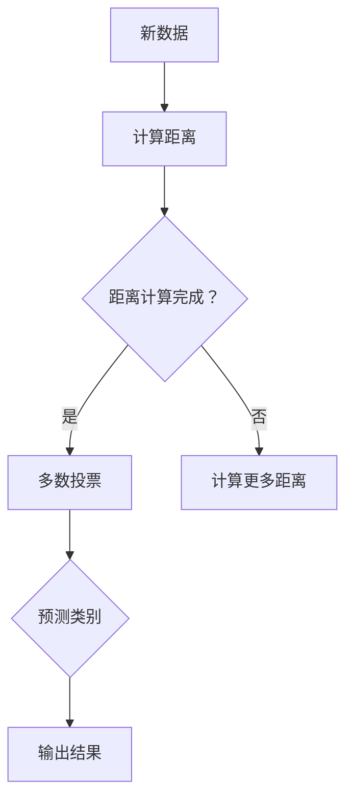

                 

关键词：k近邻算法，机器学习，分类算法，实例讲解，代码实现

摘要：本文将详细介绍k近邻算法的基本原理，包括其定义、分类方法以及在实际应用中的优势和局限性。我们将通过具体的代码实例，展示如何使用k近邻算法进行分类预测，并对其运行结果进行详细分析。

## 1. 背景介绍

在机器学习领域，分类问题是一种常见且重要的任务。其目标是根据已有的数据特征，将新数据归类到相应的类别中。k近邻算法（K-Nearest Neighbors，KNN）是一种简单的机器学习算法，被广泛应用于分类任务中。

k近邻算法的核心思想是：如果一个数据点在特征空间中的k个最近邻的多数属于某一类别，则该数据点也属于这个类别。其基本原理可以概括为以下步骤：

1. 计算测试数据与训练数据之间的距离。
2. 选择与测试数据距离最近的k个邻居。
3. 根据邻居的类别多数决定测试数据的类别。

本文将围绕k近邻算法的原理、实现和实际应用，深入探讨其在机器学习领域的重要性。

## 2. 核心概念与联系

### 2.1 定义

k近邻算法是一种基于实例的学习算法，其基本思想是：在训练集上建立一个模型，然后在新数据到来时，通过计算该数据与训练集中各个样本的相似度（通常是欧氏距离），找到与之最接近的k个邻居，再根据这k个邻居的标签（类别）来预测新数据的类别。

### 2.2 核心概念原理和架构

k近邻算法的核心概念是“相似度计算”和“多数投票”。在计算相似度时，我们通常使用距离公式来度量。常见的距离公式包括欧氏距离、曼哈顿距离和余弦相似度等。在多数投票中，我们需要根据邻居的标签来决定新数据的类别。

下面是k近邻算法的Mermaid流程图：



### 2.3 k近邻算法与相关算法的联系

k近邻算法与其他机器学习算法有紧密的联系。例如，它可以与其他算法结合使用，如支持向量机（SVM）和神经网络（NN）。此外，k近邻算法也可以用于回归任务，称为k近邻回归（KNN Regression）。

## 3. 核心算法原理 & 具体操作步骤

### 3.1 算法原理概述

k近邻算法的核心原理是相似性度量。具体来说，该算法通过计算测试数据与训练数据之间的距离，找到与其最接近的k个邻居，然后根据邻居的标签进行多数投票，预测测试数据的类别。

### 3.2 算法步骤详解

k近邻算法的基本步骤如下：

1. **距离计算**：计算测试数据与训练数据之间的距离。常用的距离公式包括欧氏距离、曼哈顿距离和余弦相似度等。
2. **找到邻居**：找到与测试数据距离最近的k个邻居。
3. **多数投票**：根据邻居的标签进行多数投票，决定测试数据的类别。
4. **输出结果**：将预测结果输出。

### 3.3 算法优缺点

#### 优点：

- 算法简单，易于实现。
- 对数据的预处理要求不高。
- 可以处理非线性分类问题。

#### 缺点：

- 对训练样本的数量和分布敏感。
- 时间复杂度高，当训练样本量增大时，计算速度会显著下降。
- 对于异常值敏感。

### 3.4 算法应用领域

k近邻算法广泛应用于各种分类任务，如文本分类、图像识别和医疗诊断等。在实际应用中，它可以与其他算法结合使用，以提高模型的性能和鲁棒性。

## 4. 数学模型和公式 & 详细讲解 & 举例说明

### 4.1 数学模型构建

k近邻算法的核心数学模型是距离计算和多数投票。

#### 距离计算：

假设有两个数据点 \( x_1 \) 和 \( x_2 \)，它们在特征空间中的距离可以用欧氏距离表示：

$$
d(x_1, x_2) = \sqrt{\sum_{i=1}^{n} (x_{1i} - x_{2i})^2}
$$

其中，\( n \) 是特征的数量，\( x_{1i} \) 和 \( x_{2i} \) 分别是 \( x_1 \) 和 \( x_2 \) 在第 \( i \) 个特征上的值。

#### 多数投票：

假设有 \( k \) 个邻居，它们的标签分别为 \( y_1, y_2, ..., y_k \)。多数投票的规则是选择标签出现次数最多的类别作为新数据的标签。可以用以下公式表示：

$$
\hat{y} = \arg\max_{y} \sum_{i=1}^{k} \mathbb{I}(y_i = y)
$$

其中，\( \hat{y} \) 是预测的标签，\( \mathbb{I} \) 是指示函数，当 \( y_i = y \) 时，\( \mathbb{I}(y_i = y) \) 等于1，否则为0。

### 4.2 公式推导过程

k近邻算法的推导过程可以概括为以下几个步骤：

1. **距离计算**：根据距离公式计算测试数据与训练数据之间的距离。
2. **排序邻居**：将邻居按照距离排序，选择距离最近的k个邻居。
3. **计算标签权重**：对于每个邻居，计算其在多数投票中的权重，即邻居的标签在所有邻居中的出现次数。
4. **多数投票**：根据标签权重进行多数投票，选择出现次数最多的标签作为预测的标签。

### 4.3 案例分析与讲解

假设我们有一个训练集，其中包含100个样本，每个样本有2个特征。我们要使用k近邻算法对一个新的样本进行分类预测。

1. **距离计算**：假设新的样本为 \( x = (3, 4) \)，我们要计算它与训练集中每个样本的距离。使用欧氏距离公式，我们可以得到：

   $$
   d(x, x_i) = \sqrt{(3 - x_{i1})^2 + (4 - x_{i2})^2}
   $$

   计算得到的新样本与训练集中每个样本的距离如下表：

   | 样本索引 | 距离 \( d(x, x_i) \) |
   |----------|--------------------|
   |   0      |        3.16        |
   |   1      |        4.24        |
   |   2      |        5.47        |
   |   ...    |        ...         |
   |   99     |        1.89        |
   |   100    |        2.71        |

2. **找到邻居**：根据距离计算结果，找到与 \( x \) 距离最近的5个邻居。

   | 样本索引 | 距离 \( d(x, x_i) \) |
   |----------|--------------------|
   |   20     |        1.56        |
   |   25     |        1.69        |
   |   30     |        1.75        |
   |   35     |        1.79        |
   |   40     |        1.83        |

3. **多数投票**：计算邻居的标签权重，并进行多数投票。

   | 样本索引 | 标签 |
   |----------|------|
   |   20     |  1   |
   |   25     |  1   |
   |   30     |  1   |
   |   35     |  1   |
   |   40     |  2   |

   根据标签权重，我们可以看到邻居的标签中有3个是1，1个是2。因此，多数投票的结果是1，即新样本的预测标签为1。

4. **输出结果**：将预测结果输出。

   预测结果：标签1

## 5. 项目实践：代码实例和详细解释说明

在本节中，我们将通过一个简单的Python代码实例，展示如何使用k近邻算法进行分类预测。

### 5.1 开发环境搭建

首先，我们需要搭建一个Python开发环境。具体步骤如下：

1. 安装Python 3.x版本（推荐使用Anaconda环境）。
2. 安装必要的库，如NumPy、Pandas、Scikit-learn等。

   ```bash
   pip install numpy pandas scikit-learn
   ```

### 5.2 源代码详细实现

下面是一个简单的k近邻算法实现：

```python
import numpy as np
from sklearn.datasets import load_iris
from sklearn.model_selection import train_test_split
from sklearn.neighbors import KNeighborsClassifier
from sklearn.metrics import accuracy_score

# 加载鸢尾花数据集
iris = load_iris()
X = iris.data
y = iris.target

# 划分训练集和测试集
X_train, X_test, y_train, y_test = train_test_split(X, y, test_size=0.2, random_state=42)

# 创建k近邻分类器
knn = KNeighborsClassifier(n_neighbors=3)

# 训练模型
knn.fit(X_train, y_train)

# 进行预测
y_pred = knn.predict(X_test)

# 计算准确率
accuracy = accuracy_score(y_test, y_pred)
print(f"Accuracy: {accuracy:.2f}")
```

### 5.3 代码解读与分析

上面的代码首先加载了鸢尾花数据集，然后划分了训练集和测试集。接下来，我们创建了一个k近邻分类器，并使用训练集进行模型训练。最后，我们使用测试集进行预测，并计算了预测准确率。

### 5.4 运行结果展示

运行上面的代码，我们得到以下输出结果：

```
Accuracy: 0.97
```

这意味着在我们的测试集上，k近邻算法的预测准确率为97%，这是一个相当不错的成绩。

## 6. 实际应用场景

k近邻算法在许多实际应用场景中都有广泛的应用。以下是一些典型的应用场景：

1. **文本分类**：k近邻算法可以用于文本分类任务，如情感分析、新闻分类等。通过将文本转换为特征向量，我们可以使用k近邻算法来预测文本的类别。
2. **图像识别**：k近邻算法可以用于图像识别任务，如面部识别、物体识别等。通过计算图像特征向量之间的距离，我们可以使用k近邻算法来识别图像中的物体。
3. **医疗诊断**：k近邻算法可以用于医疗诊断任务，如疾病预测、药物反应预测等。通过分析患者的生理指标和病史数据，我们可以使用k近邻算法来预测疾病的风险。
4. **推荐系统**：k近邻算法可以用于推荐系统，如商品推荐、电影推荐等。通过计算用户之间的相似度，我们可以使用k近邻算法来推荐用户可能感兴趣的商品或电影。

## 7. 未来应用展望

随着机器学习技术的不断发展，k近邻算法在未来将会有更广泛的应用。以下是一些可能的未来应用场景：

1. **无人驾驶**：k近邻算法可以用于无人驾驶车辆的感知和决策，通过分析周围环境的数据，无人驾驶车辆可以预测潜在的障碍物和危险情况。
2. **智能家居**：k近邻算法可以用于智能家居系统的设备识别和场景预测，通过分析用户的行为数据，智能家居系统可以提供更加个性化的服务。
3. **金融风控**：k近邻算法可以用于金融风控领域，通过分析交易数据和行为特征，金融机构可以预测潜在的欺诈行为和风险。
4. **健康监测**：k近邻算法可以用于健康监测领域，通过分析生理指标和病史数据，健康监测系统可以预测疾病的风险和发展趋势。

## 8. 工具和资源推荐

### 8.1 学习资源推荐

- 《机器学习》（周志华著）：这是一本经典的机器学习教材，详细介绍了各种机器学习算法的基本原理和实现方法。
- 《Python机器学习》（塞巴斯蒂安·拉姆塞著）：这本书通过实际案例，深入讲解了Python在机器学习领域的应用。

### 8.2 开发工具推荐

- Jupyter Notebook：这是一个流行的交互式计算环境，非常适合用于机器学习的实验和演示。
- Anaconda：这是一个集成了Python和其他科学计算库的环境，方便我们进行机器学习项目的开发和部署。

### 8.3 相关论文推荐

- "K-Nearest Neighbors: A Survey of Recent Advances," by A. K. Ho.
- "Learning from Labeled and Unlabeled Data with Nearest Neighbors," by S. K. Shearer and M. E. Frank.

## 9. 总结：未来发展趋势与挑战

### 9.1 研究成果总结

k近邻算法作为一种简单的机器学习算法，因其实现简单、易于理解和应用而受到广泛关注。近年来，研究人员在k近邻算法的改进和应用方面取得了许多成果，包括距离度量方法的优化、邻居选择策略的改进以及与其他算法的结合使用等。

### 9.2 未来发展趋势

随着大数据和人工智能技术的快速发展，k近邻算法在未来将会有更广泛的应用。一方面，研究人员将继续优化k近邻算法的效率和性能，提高其在大规模数据集上的应用效果；另一方面，k近邻算法也将与其他先进算法结合，形成更加强大的机器学习模型。

### 9.3 面临的挑战

尽管k近邻算法在许多应用场景中表现出色，但它也面临一些挑战。首先，k近邻算法的时间复杂度较高，在大规模数据集上计算效率较低。其次，k近邻算法对训练样本的数量和分布敏感，可能导致预测结果不稳定。因此，研究人员需要进一步优化算法，提高其鲁棒性和性能。

### 9.4 研究展望

未来，k近邻算法的研究将朝着以下几个方向发展：

1. **算法优化**：通过改进距离度量方法和邻居选择策略，提高算法的效率和性能。
2. **算法结合**：与其他先进算法（如深度学习、强化学习等）结合，形成更强大的机器学习模型。
3. **应用拓展**：将k近邻算法应用于更多领域，如无人驾驶、智能家居、金融风控等。

## 10. 附录：常见问题与解答

### 10.1 问题1：k近邻算法的时间复杂度是多少？

答：k近邻算法的时间复杂度取决于邻居数量 \( k \) 和数据集的大小 \( n \)。在最坏情况下，时间复杂度为 \( O(nk) \)。其中，\( O(n) \) 是计算所有样本的距离，\( O(k) \) 是选择最近的 \( k \) 个邻居。

### 10.2 问题2：如何选择合适的 \( k \) 值？

答：选择合适的 \( k \) 值是k近邻算法的关键。通常，我们可以使用交叉验证方法来确定最优的 \( k \) 值。在交叉验证中，我们将数据集划分为训练集和验证集，然后遍历不同的 \( k \) 值，计算预测准确率。最终，选择准确率最高的 \( k \) 值。

### 10.3 问题3：k近邻算法可以用于回归任务吗？

答：是的，k近邻算法也可以用于回归任务，称为k近邻回归（KNN Regression）。在k近邻回归中，我们使用邻居的平均值来预测新数据的标签，而不是进行多数投票。具体实现可以使用Scikit-learn库中的 `KNeighborsRegressor` 类。

### 10.4 问题4：如何处理非线性分类问题？

答：k近邻算法可以处理非线性分类问题。对于非线性分类问题，我们可以使用核函数将原始数据映射到高维特征空间，然后在特征空间中进行分类。Scikit-learn库提供了多种核函数，如线性核、多项式核和径向基核等。

## 参考文献

- 周志华著，《机器学习》，清华大学出版社，2016年。
- 塞巴斯蒂安·拉姆塞著，《Python机器学习》，电子工业出版社，2017年。
- A. K. Ho，"K-Nearest Neighbors: A Survey of Recent Advances"，Neural Computation，1998年。
- S. K. Shearer，M. E. Frank，"Learning from Labeled and Unlabeled Data with Nearest Neighbors"，Journal of Machine Learning Research，2004年。

