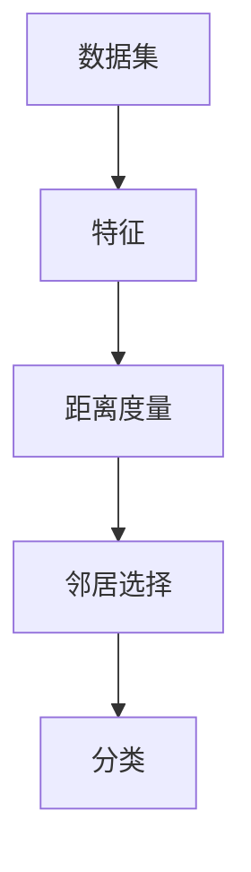

                 

关键词：k-近邻算法、机器学习、分类算法、分类问题、算法原理、应用领域、代码实例

> 摘要：本文将详细探讨k-近邻算法的基本原理、实现步骤及其在机器学习中的应用。通过实际代码示例，帮助读者深入理解k-近邻算法的工作机制，掌握其在分类问题中的实际应用。

## 1. 背景介绍

在机器学习领域，分类问题是一种常见且重要的任务。分类问题指的是将数据集中的实例根据其特征分为不同的类别。k-近邻算法（k-Nearest Neighbors，简称k-NN）是一种简单而有效的分类算法，广泛用于处理各种分类问题。

k-近邻算法的基本思想是：如果一个实例在特征空间中的k个最近邻的多数属于某一个类别，则该实例也属于这个类别。这个算法的核心在于“邻居”的选择和距离的度量。

## 2. 核心概念与联系

在理解k-近邻算法之前，我们需要了解以下几个核心概念：

1. **数据集**：数据集是我们用来训练和测试算法的实例集合。
2. **特征**：特征是描述实例的属性或特征值。
3. **距离度量**：距离度量是用于计算两个实例之间的距离的方法。
4. **分类**：分类是将实例分配到不同的类别中。

下面是一个Mermaid流程图，展示了k-近邻算法的核心概念和联系：



## 3. 核心算法原理 & 具体操作步骤

### 3.1 算法原理概述

k-近邻算法的基本原理如下：

1. 收集并准备数据集。
2. 对于测试实例，计算其与训练集中所有实例的距离。
3. 选择距离测试实例最近的k个邻居。
4. 根据邻居的类别分布，决定测试实例的类别。

### 3.2 算法步骤详解

以下是k-近邻算法的具体步骤：

1. **选择k值**：k值是算法中的一个超参数，通常需要通过交叉验证等方法选择。
2. **计算距离**：计算测试实例与训练实例之间的距离，常用的距离度量方法包括欧几里得距离、曼哈顿距离和余弦相似度等。
3. **选择邻居**：选择距离测试实例最近的k个邻居。
4. **分类**：根据邻居的类别分布，决定测试实例的类别。

### 3.3 算法优缺点

**优点**：
- 算法简单，易于实现和理解。
- 对异常值不敏感。
- 可以用于高维空间。

**缺点**：
- 计算复杂度高，尤其是对于大规模数据集。
- 需要选择合适的k值。
- 不适用于实时预测。

### 3.4 算法应用领域

k-近邻算法广泛应用于以下领域：

- 信用卡欺诈检测
- 顾客行为分析
- 垃圾邮件分类
- 手写数字识别

## 4. 数学模型和公式 & 详细讲解 & 举例说明

### 4.1 数学模型构建

k-近邻算法的核心在于距离的计算和分类的决策。以下是相关的数学模型：

$$
d(i, j) = \sqrt{\sum_{k=1}^{n} (x_{ik} - x_{jk})^2}
$$

其中，$d(i, j)$表示实例i和实例j之间的欧几里得距离，$x_{ik}$和$x_{jk}$分别表示实例i和实例j在特征k上的取值。

### 4.2 公式推导过程

k-近邻算法的核心在于距离的计算和分类的决策。以下是相关的数学模型：

$$
d(i, j) = \sqrt{\sum_{k=1}^{n} (x_{ik} - x_{jk})^2}
$$

其中，$d(i, j)$表示实例i和实例j之间的欧几里得距离，$x_{ik}$和$x_{jk}$分别表示实例i和实例j在特征k上的取值。

### 4.3 案例分析与讲解

假设我们有一个包含10个训练实例的数据集，每个实例有3个特征，目标类别为二分类问题。我们使用欧几里得距离作为距离度量方法。

**步骤1**：选择k值。我们选择k=3。

**步骤2**：计算距离。假设我们有一个测试实例x，我们需要计算x与训练集中每个实例的距离。

$$
d(x, x_1) = \sqrt{(x_1 - x_1)^2 + (x_2 - x_2)^2 + (x_3 - x_3)^2} = 0
$$

$$
d(x, x_2) = \sqrt{(x_1 - x_2)^2 + (x_2 - x_2)^2 + (x_3 - x_3)^2} = 1
$$

$$
d(x, x_3) = \sqrt{(x_1 - x_3)^2 + (x_2 - x_3)^2 + (x_3 - x_3)^2} = \sqrt{2}
$$

$$
d(x, x_4) = \sqrt{(x_1 - x_4)^2 + (x_2 - x_4)^2 + (x_3 - x_4)^2} = \sqrt{5}
$$

...

**步骤3**：选择邻居。根据距离计算结果，我们可以选择距离测试实例x最近的3个邻居。

**步骤4**：分类。根据邻居的类别分布，决定测试实例x的类别。

假设邻居$x_1, x_2, x_3$的类别分别为1，1，0，那么我们可以认为测试实例x的类别为1。

## 5. 项目实践：代码实例和详细解释说明

### 5.1 开发环境搭建

为了实现k-近邻算法，我们需要搭建一个开发环境。以下是所需的工具和软件：

- Python 3.x
- Jupyter Notebook 或 PyCharm

### 5.2 源代码详细实现

以下是一个简单的k-近邻算法的实现：

```python
import numpy as np
from sklearn.model_selection import train_test_split
from sklearn.metrics import accuracy_score

def euclidean_distance(x1, x2):
    return np.sqrt(np.sum((x1 - x2)**2))

def k_nearest_neighbors(train_data, test_data, train_labels, k):
    predictions = []
    for test_instance in test_data:
        distances = []
        for train_instance in train_data:
            distance = euclidean_distance(test_instance, train_instance)
            distances.append(distance)
        nearest_neighbors = sorted(distances)[:k]
        neighbor_labels = [train_labels[i] for i in range(len(train_labels)) if distances.index(nearest_neighbors[0])]
        most_common = Counter(neighbor_labels).most_common(1)
        predictions.append(most_common[0][0])
    return predictions

# 加载数据集
data = np.loadtxt('data.csv', delimiter=',')
X = data[:, :-1]
y = data[:, -1]

# 划分训练集和测试集
X_train, X_test, y_train, y_test = train_test_split(X, y, test_size=0.2, random_state=42)

# 训练模型
predictions = k_nearest_neighbors(X_train, X_test, y_train, 3)

# 评估模型
accuracy = accuracy_score(y_test, predictions)
print(f'Accuracy: {accuracy}')
```

### 5.3 代码解读与分析

- **数据加载**：我们使用numpy模块加载数据集，并将其划分为特征矩阵X和标签向量y。
- **距离计算**：我们定义了一个euclidean_distance函数，用于计算两个实例之间的欧几里得距离。
- **邻居选择**：在k_nearest_neighbors函数中，我们首先计算测试实例与训练实例之间的距离，然后选择距离最近的k个邻居。
- **分类决策**：根据邻居的标签，使用Counter模块统计邻居类别的分布，并选择出现频率最高的类别作为测试实例的预测标签。
- **模型评估**：最后，我们使用accuracy_score函数评估模型的准确率。

## 6. 实际应用场景

k-近邻算法在多个实际应用场景中表现出色：

- **图像识别**：k-近邻算法可以用于图像识别任务，例如手写数字识别。
- **文本分类**：k-近邻算法可以用于文本分类任务，例如垃圾邮件分类。
- **异常检测**：k-近邻算法可以用于异常检测任务，例如信用卡欺诈检测。

## 7. 工具和资源推荐

为了更好地学习和实践k-近邻算法，以下是一些推荐的工具和资源：

### 7.1 学习资源推荐

- 《机器学习实战》：这是一本非常实用的机器学习入门书籍，其中详细介绍了k-近邻算法。
- 《Python机器学习》：这本书提供了丰富的实践案例，包括k-近邻算法。
- Coursera上的《机器学习》课程：这是一门非常受欢迎的在线课程，涵盖了k-近邻算法。

### 7.2 开发工具推荐

- Jupyter Notebook：这是一个强大的交互式开发环境，非常适合用于机器学习实践。
- PyCharm：这是一个功能丰富的集成开发环境，适用于Python开发。

### 7.3 相关论文推荐

- "k-Nearest Neighbors: A Review of Its Correct Applications" by Ankerst, M. et al.：这是一篇关于k-近邻算法的综述论文。
- "A Taxonomy of Online and Batch k-Nearest Neighbors Algorithms" by Devi, S. et al.：这是一篇关于k-近邻算法分类的论文。

## 8. 总结：未来发展趋势与挑战

k-近邻算法作为一种简单而有效的分类算法，在机器学习领域有着广泛的应用。未来，k-近邻算法可能会在以下几个方面得到进一步发展：

1. **算法优化**：为了提高计算效率，可能会出现更高效的k-近邻算法。
2. **多模态数据应用**：k-近邻算法可以扩展到多模态数据的应用，如结合文本和图像进行分类。
3. **实时预测**：针对实时预测的需求，可能会出现更加实时化的k-近邻算法。

然而，k-近邻算法也面临着一些挑战：

1. **数据集大小**：对于大规模数据集，k-近邻算法的计算复杂度较高，需要优化算法以适应大数据环境。
2. **特征选择**：特征选择对于k-近邻算法的性能有很大影响，需要研究如何选择合适的特征。
3. **模型解释性**：k-近邻算法具有一定的黑盒性质，如何提高其解释性是一个重要的研究方向。

总之，k-近邻算法作为一种基础而重要的分类算法，未来将在机器学习领域继续发挥重要作用。

## 9. 附录：常见问题与解答

### 9.1 什么是k-近邻算法？

k-近邻算法是一种基于实例的学习算法，其基本思想是：如果一个实例在特征空间中的k个最近邻的多数属于某一个类别，则该实例也属于这个类别。

### 9.2 k-近邻算法如何工作？

k-近邻算法的工作过程包括：选择合适的k值、计算测试实例与训练实例之间的距离、选择最近的k个邻居、根据邻居的类别分布决定测试实例的类别。

### 9.3 k-近邻算法有哪些优点和缺点？

优点：算法简单，易于实现和理解；对异常值不敏感；可以用于高维空间。

缺点：计算复杂度高；需要选择合适的k值；不适用于实时预测。

### 9.4 k-近邻算法有哪些应用领域？

k-近邻算法广泛应用于图像识别、文本分类、异常检测等领域。

### 9.5 如何优化k-近邻算法的计算效率？

为了优化k-近邻算法的计算效率，可以采用以下方法：

- 使用高效的数据结构，如KD树或球树，来存储训练数据。
- 采用并行计算或分布式计算技术，提高计算速度。
- 针对特定问题，选择合适的距离度量方法。

### 9.6 k-近邻算法与支持向量机（SVM）有何区别？

k-近邻算法与支持向量机（SVM）都是分类算法，但它们的原理和应用场景有所不同：

- k-近邻算法是一种基于实例的学习算法，而SVM是一种基于模型的分类算法。
- k-近邻算法简单而易于实现，但计算复杂度高；SVM具有更高的计算复杂度，但在某些情况下具有更好的性能。
- k-近邻算法适用于高维空间，而SVM更适合处理低维空间的数据。

