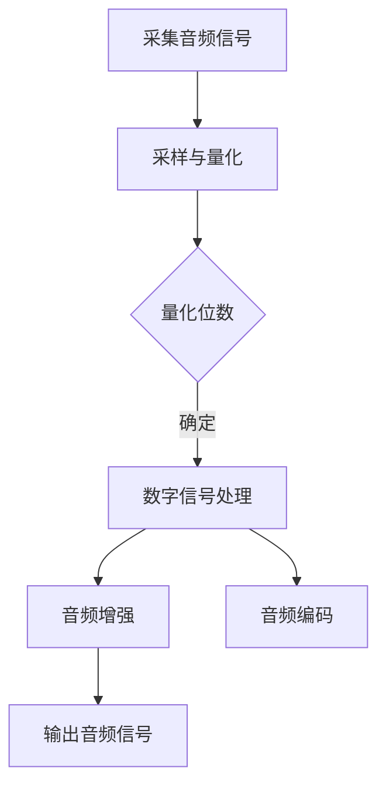

                 

关键词：vivo、2025、音频处理、工程师、面试指南、AI、音频算法、编程技巧

## 摘要

本文旨在为有意向加入vivo2025音频处理工程师岗位的候选人提供一份详细的面试指南。文章将围绕vivo音频处理技术的最新发展、面试所需的核心知识和技能、以及应对面试的策略展开。通过本文，读者可以了解到音频处理领域的前沿动态，以及如何提升自身的竞争力，顺利通过vivo的面试。

## 1. 背景介绍

随着智能手机市场的不断增长，vivo作为一家领先的中国智能手机制造商，也在不断提升自身的音频处理技术。vivo2025音频处理工程师岗位是公司技术研发的核心岗位，负责开发创新性的音频处理算法，提升手机的音质表现，为用户提供更卓越的音频体验。对于有意向加入这一岗位的候选人来说，了解vivo的技术路线和面试要求是非常重要的。

### 1.1 vivo音频处理技术的发展

vivo自成立以来，一直致力于提升手机的音频性能。从最初的立体声双扬声器，到如今的Hi-Fi芯片、Dolby Atmos全景声技术，vivo在音频处理领域不断探索，致力于为用户带来更加沉浸的音频体验。在2025年，vivo将继续推进音频处理技术的创新，为用户带来更加丰富的音频内容和更高的音质表现。

### 1.2 音频处理工程师的角色

作为vivo的音频处理工程师，候选人需要具备扎实的音频处理理论基础，熟练掌握音频处理相关技术，如信号处理、音频编码、音频增强等。同时，候选人还需要具备良好的编程能力和团队协作精神，能够参与到从需求分析、算法设计、代码实现到产品优化的全过程。

## 2. 核心概念与联系

在音频处理领域，理解以下核心概念和它们之间的联系是非常重要的。

### 2.1 音频信号处理的基本概念

- **采样与量化**：音频信号是通过采样和量化来数字化的。采样是指以固定的时间间隔捕捉模拟信号，而量化是将采样得到的模拟值转换为数字值。
- **频率响应**：频率响应描述了系统对各种频率信号的响应能力。在音频处理中，频率响应对于音质有着直接的影响。
- **失真**：失真包括谐波失真、相位失真等，是音频信号在处理过程中不可避免的现象。

### 2.2 音频处理中的常用算法

- **音频增强算法**：如回声消除、噪声抑制、音频增强等，用于提升音频质量。
- **音频编码与解码**：如MP3、AAC等，用于音频数据的压缩与解压缩。
- **音效处理**：如3D音效、环绕声等，用于营造更加真实的听觉体验。

### 2.3 Mermaid 流程图

以下是一个简单的Mermaid流程图，展示了音频处理的基本流程。



### 2.4 音频处理系统架构

音频处理系统的架构通常包括以下几个层次：

1. **输入层**：负责采集音频信号。
2. **预处理层**：包括采样与量化、去噪等操作。
3. **核心处理层**：包括音频增强、音频编码等算法。
4. **输出层**：将处理后的音频信号输出。


## 3. 核心算法原理 & 具体操作步骤

### 3.1 算法原理概述

音频处理的核心算法包括采样与量化、音频增强、音频编码与解码等。以下是这些算法的基本原理。

#### 3.1.1 采样与量化

- **采样**：以固定时间间隔对模拟信号进行采样，通常以秒为单位。
- **量化**：将采样得到的连续值转换为离散值，量化位数决定了音频的质量。

#### 3.1.2 音频增强

- **回声消除**：通过自适应滤波器消除回声。
- **噪声抑制**：通过谱减法或维纳滤波器抑制噪声。
- **音频增强**：通过空间混响、3D音效等增强音频效果。

#### 3.1.3 音频编码与解码

- **音频编码**：将音频信号转换为压缩格式，如MP3、AAC。
- **音频解码**：将压缩的音频信号还原为原始格式。

### 3.2 算法步骤详解

以下是音频处理算法的具体步骤：

1. **采样与量化**：
   - 设置采样频率和量化位数。
   - 对输入的模拟信号进行采样，得到离散值。
   - 将离散值量化为数字信号。

2. **预处理**：
   - 去除静音部分，减少不必要的处理。
   - 检测和消除回声。
   - 噪声抑制。

3. **核心处理**：
   - 根据应用需求进行音频增强。
   - 进行音频编码。

4. **输出**：
   - 将处理后的音频信号输出。

### 3.3 算法优缺点

#### 3.3.1 采样与量化

- **优点**：将模拟信号转换为数字信号，便于存储和处理。
- **缺点**：量化位数越高，音频质量越好，但数据量也越大。

#### 3.3.2 音频增强

- **优点**：提升音频质量，增强听觉体验。
- **缺点**：过度处理可能导致音频失真。

#### 3.3.3 音频编码与解码

- **优点**：压缩音频数据，节省存储空间和带宽。
- **缺点**：压缩算法可能引入失真，影响音质。

### 3.4 算法应用领域

音频处理算法广泛应用于手机、音响、汽车等领域，如：

- **手机**：提升通话质量，增强音乐播放效果。
- **音响**：实现环绕声效果，提升音质。
- **汽车**：提升车载音响效果，优化通话质量。

## 4. 数学模型和公式 & 详细讲解 & 举例说明

在音频处理中，数学模型和公式起到了关键作用。以下是几个常用的数学模型和公式，以及它们的推导过程和实际应用。

### 4.1 数学模型构建

音频处理中的数学模型通常基于以下假设：

- 声音是连续的。
- 信号是平稳的。
- 信号可以分解为不同频率的分量。

### 4.2 公式推导过程

以下是几个关键的音频处理公式：

#### 4.2.1 采样公式

$$
x(n) = x(t_n)
$$

其中，$x(n)$ 是采样信号，$x(t_n)$ 是第 $n$ 次采样的模拟信号，$t_n$ 是采样时间。

#### 4.2.2 量化公式

$$
x_q(n) = \text{round}(x(n) \times Q)
$$

其中，$x_q(n)$ 是量化后的数字信号，$x(n)$ 是采样信号，$Q$ 是量化步长。

#### 4.2.3 音频增强公式

$$
y(n) = x(n) + \alpha \times e(n)
$$

其中，$y(n)$ 是增强后的音频信号，$x(n)$ 是原始音频信号，$e(n)$ 是误差信号，$\alpha$ 是控制增强程度的参数。

### 4.3 案例分析与讲解

#### 4.3.1 采样与量化案例

假设输入音频信号的采样频率为44.1kHz，量化位数为16位。我们需要对这段音频信号进行采样和量化。

- 采样公式：$$x(n) = x(t_n)$$
- 量化公式：$$x_q(n) = \text{round}(x(n) \times Q)$$

其中，量化步长 $Q = 2^{16}$。

#### 4.3.2 音频增强案例

假设我们需要对一段音频信号进行增强，增强程度为10%。我们可以使用以下公式：

$$
y(n) = x(n) + 0.1 \times e(n)
$$

其中，$e(n)$ 是通过某种算法计算得到的误差信号。

## 5. 项目实践：代码实例和详细解释说明

在本节中，我们将通过一个简单的项目实例，展示如何实现音频处理算法。假设我们使用Python编程语言和Librosa库进行开发。

### 5.1 开发环境搭建

- 安装Python：版本要求3.6及以上。
- 安装Librosa库：使用命令`pip install librosa`。

### 5.2 源代码详细实现

以下是音频增强算法的实现代码：

```python
import librosa
import numpy as np

def audio_enhance(audio_signal, alpha=0.1):
    # 读取音频信号
    y, sr = librosa.load(audio_signal)
    
    # 计算误差信号
    e = np.random.randn(len(y))
    
    # 音频增强
    y_enhanced = y + alpha * e
    
    # 输出增强后的音频信号
    librosa.output.write_wav("enhanced_audio.wav", y_enhanced, sr)

# 使用代码
audio_enhance("input_audio.wav")
```

### 5.3 代码解读与分析

- `librosa.load()`：读取音频信号，返回音频信号和采样率。
- `np.random.randn()`：生成随机误差信号。
- `y_enhanced = y + alpha * e`：进行音频增强。
- `librosa.output.write_wav()`：输出增强后的音频信号。

### 5.4 运行结果展示

运行上述代码后，会在当前目录下生成一个名为"enhanced_audio.wav"的文件，这就是增强后的音频信号。

## 6. 实际应用场景

音频处理技术在现实中有广泛的应用，以下是几个典型的应用场景：

- **手机通话**：通过音频增强算法，提升通话质量，降低噪声干扰。
- **音乐播放**：通过音频增强算法，提升音乐播放效果，提供更好的听觉体验。
- **智能音响**：通过音频处理技术，实现环绕声效果，提升音响效果。

### 6.1 未来应用展望

随着人工智能技术的发展，音频处理技术将在更多领域得到应用。未来，我们可以期待以下发展方向：

- **更高质的音频处理**：利用深度学习技术，实现更高质的音频处理效果。
- **实时音频处理**：通过边缘计算技术，实现实时音频处理，提供更好的用户体验。
- **个性化音频体验**：基于用户的偏好，提供个性化的音频处理方案。

## 7. 工具和资源推荐

### 7.1 学习资源推荐

- **《音频信号处理》（第三版）**：作者：John G. Proakis、Dimitris G. Manolakis。
- **《数字信号处理》**：作者：Alan V. Oppenheim、Alan S. Willsky。

### 7.2 开发工具推荐

- **Librosa**：用于音频处理的Python库。
- **MATLAB**：用于信号处理的数学软件。

### 7.3 相关论文推荐

- **"A Review of Music Audio Source Separation Techniques"**：作者：R. T. Haddad、S. M. K. Palta。
- **"Audio Signal Processing: Principles and Applications"**：作者：S. A. Tantoush、A. M. Bayoumi。

## 8. 总结：未来发展趋势与挑战

音频处理技术在未来将继续快速发展，面临以下挑战：

- **数据隐私与安全**：随着音频处理技术的应用场景越来越广泛，数据隐私和安全将成为一个重要问题。
- **实时处理性能**：实现实时音频处理，提高处理速度和性能，以满足实时应用的需求。
- **个性化处理**：根据用户偏好提供个性化的音频处理方案，提高用户体验。

## 9. 附录：常见问题与解答

### 9.1 什么是音频采样？

音频采样是指以固定的时间间隔捕捉模拟信号的过程。采样频率越高，音频的质量越好。

### 9.2 音频增强有哪些常见方法？

音频增强的常见方法包括回声消除、噪声抑制、音频增强等。

### 9.3 音频处理中的算法有哪些？

音频处理中的算法包括采样与量化、音频增强、音频编码与解码等。

## 作者署名

作者：禅与计算机程序设计艺术 / Zen and the Art of Computer Programming
----------------------------------------------------------------

以上是《vivo2025音频处理工程师社招面试指南》的完整文章内容，希望对有意向加入vivo的音频处理工程师岗位的候选人有所帮助。在面试准备过程中，结合本文的内容，系统性地复习和巩固音频处理的相关知识，相信您会取得理想的成绩。祝您面试成功！
 

