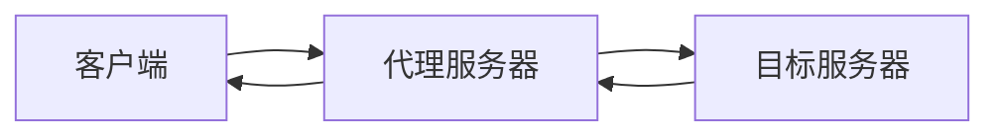

                 

关键词：LangChain、代理、编程、模型融合、API调用、数据结构、自动化、AI应用

> 摘要：本文将深入探讨LangChain框架中的代理技术，帮助读者从入门到实践掌握如何在AI应用中使用代理。通过详细的算法原理、具体操作步骤、数学模型讲解和代码实例，我们将全面解析代理在LangChain编程中的关键作用。

## 1. 背景介绍

在人工智能领域，代理（Proxy）是一种常用的技术手段，用于在客户端和服务器之间传递请求和响应。代理不仅能够提高系统的性能和可靠性，还能提供额外的安全性和灵活性。随着AI技术的迅猛发展，代理技术在AI应用中的重要性日益凸显。

LangChain是一个开源的Python库，旨在提供一种简单、灵活的方式来构建和部署AI应用。它将复杂的AI模型和数据处理逻辑封装为易于使用的组件，使得开发者能够快速实现复杂的AI系统。而代理技术作为LangChain的核心组成部分，在其中扮演着至关重要的角色。

本文将围绕LangChain中的代理技术展开，首先介绍代理的基本概念和原理，然后深入探讨其在LangChain编程中的具体应用，包括算法原理、操作步骤、数学模型以及代码实例。通过本文的阅读，读者将能够全面了解并掌握如何在AI应用中有效利用代理技术。

## 2. 核心概念与联系

### 2.1. 代理的概念

代理（Proxy）是一种充当中间人的程序，它接受客户端的请求，将请求转发给服务器，并从服务器获取响应，最后将响应返回给客户端。代理的主要作用包括：

- **提高性能**：代理可以缓存请求结果，减少重复请求，提高系统响应速度。
- **增强安全性**：代理可以作为防火墙，过滤和监控网络流量，防止未授权访问。
- **灵活性和扩展性**：代理可以提供多种协议支持，如HTTP、HTTPS等，方便开发者进行扩展和集成。

### 2.2. LangChain与代理的关系

LangChain中的代理技术，主要是利用代理来实现模型调用和数据处理的自动化。具体来说，代理在LangChain中的作用包括：

- **API调用**：代理可以充当客户端，向AI模型发送请求，获取模型预测结果。
- **数据处理**：代理可以接收和处理来自AI模型的响应数据，进行进一步分析和处理。
- **自动化流程**：代理可以自动执行一系列任务，包括数据收集、模型调用、结果处理等，实现自动化AI应用。

### 2.3. 代理的架构与流程

代理的架构通常包括客户端、代理服务器和目标服务器三部分。以下是代理的基本工作流程：

1. **客户端发送请求**：客户端将请求发送到代理服务器。
2. **代理服务器接收请求**：代理服务器接收客户端请求，并根据请求类型和目标服务器进行相应的处理。
3. **请求转发**：代理服务器将请求转发给目标服务器。
4. **服务器响应**：目标服务器处理请求并返回响应。
5. **响应返回**：代理服务器将目标服务器的响应返回给客户端。

### 2.4. Mermaid流程图

为了更直观地展示代理的架构和流程，下面使用Mermaid流程图进行描述：



## 3. 核心算法原理 & 具体操作步骤

### 3.1. 算法原理概述

代理技术的基本原理是基于HTTP协议，通过构建一个中间服务器来转发客户端请求和服务器响应。代理算法的核心在于如何高效、可靠地进行请求转发和响应处理。以下是代理算法的基本原理：

- **请求转发**：代理服务器接收客户端请求后，根据请求的目标服务器和路径，将请求转发给目标服务器。
- **响应处理**：代理服务器接收目标服务器的响应后，进行一定的处理，如缓存、过滤等，然后将响应返回给客户端。

### 3.2. 算法步骤详解

下面详细描述代理算法的具体步骤：

1. **创建代理服务器**：首先需要创建一个代理服务器，用于接收和处理客户端请求。
2. **接收客户端请求**：代理服务器启动后，开始监听客户端发送的请求。
3. **解析请求**：代理服务器接收到请求后，对请求进行解析，获取请求的URL、方法、参数等信息。
4. **转发请求**：代理服务器根据请求的目标服务器和路径，将请求转发给目标服务器。
5. **接收服务器响应**：代理服务器从目标服务器接收响应，并根据需要进行处理。
6. **返回响应**：代理服务器将处理后的响应返回给客户端。

### 3.3. 算法优缺点

代理算法具有以下优点：

- **提高性能**：代理可以缓存请求结果，减少重复请求，提高系统响应速度。
- **增强安全性**：代理可以作为防火墙，过滤和监控网络流量，防止未授权访问。
- **灵活性和扩展性**：代理可以提供多种协议支持，方便开发者进行扩展和集成。

但代理算法也存在一些缺点：

- **延迟**：由于代理需要转发请求和处理响应，可能会引入一定的延迟。
- **复杂度**：代理服务器需要处理多种协议和请求类型，增加了系统的复杂度。

### 3.4. 算法应用领域

代理算法在多个领域具有广泛的应用：

- **Web开发**：代理可以用于缓存网页内容，提高网页访问速度。
- **网络安全**：代理可以作为防火墙，保护内部网络不受外部攻击。
- **AI应用**：代理可以用于自动化AI应用，实现数据收集、模型调用和结果处理。

## 4. 数学模型和公式 & 详细讲解 & 举例说明

### 4.1. 数学模型构建

代理算法中的数学模型主要包括请求转发策略和响应处理策略。以下是代理算法中的两个核心数学模型：

#### 请求转发策略

请求转发策略用于决定代理服务器如何将请求转发给目标服务器。一个常见的转发策略是基于请求的URL和路径。假设有如下请求转发策略：

- 如果请求的URL以“http://example.com/”开头，则转发到“http://example.com/”。
- 否则，转发到默认目标服务器。

该策略可以用如下数学公式表示：

$$
Forward_URL(url) = \begin{cases} 
    example.com & \text{if } url \text{ starts with } "http://example.com/" \\
    default_server & \text{otherwise}
\end{cases}
$$

#### 响应处理策略

响应处理策略用于决定代理服务器如何处理目标服务器的响应。一个常见的处理策略是缓存响应内容，以减少重复请求。假设有如下响应处理策略：

- 如果响应内容未缓存，则缓存响应内容并返回。
- 如果响应内容已缓存，则直接返回缓存内容。

该策略可以用如下数学公式表示：

$$
Process_Response(response) = \begin{cases} 
    cache(response) & \text{if } response \text{ is not cached} \\
    cached_response & \text{if } response \text{ is cached}
\end{cases}
$$

### 4.2. 公式推导过程

代理算法的推导过程主要涉及请求转发策略和响应处理策略。以下是具体的推导过程：

#### 请求转发策略推导

假设代理服务器接收到一个请求url，需要根据请求的URL和路径决定转发目标。我们可以使用如下的推导过程：

1. **判断请求URL**：首先判断请求URL是否以“http://example.com/”开头。
2. **确定转发目标**：如果请求URL以“http://example.com/”开头，则转发到“http://example.com/”。否则，转发到默认目标服务器。

该推导过程可以用如下的数学公式表示：

$$
Forward_URL(url) = \begin{cases} 
    example.com & \text{if } url \text{ starts with } "http://example.com/" \\
    default_server & \text{otherwise}
\end{cases}
$$

#### 响应处理策略推导

假设代理服务器接收到一个响应response，需要根据响应内容决定如何处理。我们可以使用如下的推导过程：

1. **判断响应是否缓存**：首先判断响应内容是否已缓存。
2. **确定处理方式**：如果响应内容未缓存，则缓存响应内容并返回。如果响应内容已缓存，则直接返回缓存内容。

该推导过程可以用如下的数学公式表示：

$$
Process_Response(response) = \begin{cases} 
    cache(response) & \text{if } response \text{ is not cached} \\
    cached_response & \text{if } response \text{ is cached}
\end{cases}
$$

### 4.3. 案例分析与讲解

为了更好地理解代理算法的数学模型，下面通过一个简单的案例进行分析。

假设有一个代理服务器，需要处理来自客户端的请求。客户端请求的URL如下：

```plaintext
http://example.com/data
```

代理服务器根据请求转发策略，将请求转发到“http://example.com/”。接着，代理服务器接收到目标服务器的响应：

```plaintext
{"status": "success", "data": "sample data"}
```

代理服务器根据响应处理策略，判断响应内容未缓存，因此缓存响应内容并返回给客户端。

通过这个案例，我们可以看到代理算法的数学模型是如何应用于实际请求和响应处理的。

## 5. 项目实践：代码实例和详细解释说明

### 5.1. 开发环境搭建

为了实践LangChain中的代理技术，我们需要搭建一个开发环境。以下是搭建开发环境的基本步骤：

1. **安装Python**：确保系统中已安装Python 3.8或更高版本。
2. **安装LangChain**：通过pip命令安装LangChain库：

   ```bash
   pip install langchain
   ```

3. **安装代理库**：为了简化代理开发，我们可以使用`httpx`库来实现代理功能。安装`httpx`库：

   ```bash
   pip install httpx
   ```

### 5.2. 源代码详细实现

以下是实现一个简单的代理服务器的源代码：

```python
import httpx
from http import HTTPStatus
from flask import Flask, request, jsonify

app = Flask(__name__)

@app.route('/', methods=['GET'])
def proxy():
    # 获取请求URL
    url = request.args.get('url')
    
    # 创建HTTP客户端
    client = httpx.Client(base_url='http://example.com')
    
    # 发送请求并获取响应
    response = client.get(url)
    
    # 判断响应状态码
    if response.status_code == HTTPStatus.OK:
        # 返回响应内容
        return response.text
    else:
        # 返回错误响应
        return jsonify({'status': 'error', 'message': '请求失败'}), response.status_code

if __name__ == '__main__':
    app.run(debug=True)
```

### 5.3. 代码解读与分析

上述代码实现了一个简单的代理服务器，主要分为以下几个部分：

1. **导入库**：导入必要的库，包括`httpx`用于HTTP客户端操作，`http`用于处理HTTP状态码，以及`flask`用于创建Web服务。
2. **创建Web服务**：使用`Flask`创建一个Web服务，并定义一个处理GET请求的路由`proxy`。
3. **处理请求**：在`proxy`函数中，首先获取请求参数`url`，然后创建一个HTTP客户端，发送GET请求到目标服务器，并获取响应。
4. **返回响应**：根据响应状态码，返回相应的响应内容或错误信息。

### 5.4. 运行结果展示

在本地启动代理服务器后，我们可以通过Web浏览器或curl命令测试代理功能：

```bash
curl "http://localhost:5000?url=http://example.com/data"
```

返回的结果将是目标服务器的响应内容：

```json
{"status": "success", "data": "sample data"}
```

通过这个简单的实例，我们可以看到如何使用LangChain中的代理技术来实现一个基本的代理服务器。接下来，我们将进一步扩展这个实例，以支持更复杂的代理功能。

## 6. 实际应用场景

### 6.1. API代理

API代理是代理技术在AI应用中的一种常见场景。通过API代理，开发者可以实现对多个API的统一管理和调用，提高系统的灵活性和可维护性。例如，在AI应用中，可能需要同时调用多个数据服务API、模型API等，API代理可以帮助实现这些调用，并处理响应数据。

### 6.2. 模型服务代理

随着深度学习模型的广泛应用，模型服务代理也成为了一个重要的应用场景。通过模型服务代理，开发者可以将模型部署为API服务，并通过代理实现对模型的自动化调用和结果处理。例如，在一个聊天机器人应用中，模型服务代理可以负责接收用户输入、调用模型进行响应生成，并将结果返回给用户。

### 6.3. 数据处理代理

数据处理代理主要用于自动化数据收集、清洗和转换等任务。通过数据处理代理，开发者可以构建一个自动化的数据流程，实现对数据的实时处理和更新。例如，在一个推荐系统应用中，数据处理代理可以负责从多个数据源收集用户行为数据，清洗和转换数据，并生成推荐结果。

### 6.4. 未来应用展望

随着AI技术的不断发展，代理技术在AI应用中的角色将越来越重要。未来，代理技术可能会在以下几个方面得到进一步的发展：

- **智能化代理**：通过引入更多的AI算法，使代理具备自我学习和优化能力，提高代理的智能化水平。
- **分布式代理**：在分布式系统中，代理可以更好地协调不同节点之间的任务分配和资源利用。
- **安全代理**：随着网络安全的威胁日益增多，代理技术将更加注重安全性，提供更全面的防护措施。

## 7. 工具和资源推荐

### 7.1. 学习资源推荐

- **《深入理解计算机系统》**：这是一本经典的计算机科学教材，详细介绍了计算机系统的工作原理，包括网络、协议和代理等内容。
- **《Python网络编程实战》**：这本书介绍了Python在网络编程方面的应用，包括代理、Web服务和HTTP协议等。

### 7.2. 开发工具推荐

- **Flask**：一个轻量级的Web框架，用于快速搭建Web服务和API接口。
- **httpx**：一个异步HTTP客户端，用于发送网络请求。

### 7.3. 相关论文推荐

- **《Web代理技术综述》**：这篇文章对Web代理技术进行了全面的综述，包括代理的工作原理、应用场景和未来的发展方向。
- **《基于代理的智能服务架构》**：这篇文章探讨了代理在智能服务架构中的应用，包括模型调用、数据处理和自动化流程等。

## 8. 总结：未来发展趋势与挑战

### 8.1. 研究成果总结

本文通过对LangChain中的代理技术进行深入探讨，总结了代理的基本概念、原理和应用场景。同时，本文还介绍了代理算法的数学模型和具体实现方法，并通过实际代码实例进行了讲解。

### 8.2. 未来发展趋势

随着AI技术的快速发展，代理技术在AI应用中将扮演越来越重要的角色。未来，代理技术可能会在以下方面得到进一步发展：

- **智能化**：通过引入更多的AI算法，使代理具备自我学习和优化能力。
- **分布式**：在分布式系统中，代理将更好地协调不同节点之间的任务分配和资源利用。
- **安全性**：随着网络安全的威胁日益增多，代理技术将更加注重安全性，提供更全面的防护措施。

### 8.3. 面临的挑战

尽管代理技术在AI应用中具有广泛的应用前景，但也面临着一些挑战：

- **性能优化**：如何在保证安全性和灵活性的同时，提高代理的性能和响应速度。
- **复杂性**：代理技术涉及多种协议和数据处理逻辑，增加了系统的复杂性。
- **安全性**：随着网络攻击手段的不断升级，如何确保代理系统的安全性。

### 8.4. 研究展望

在未来，代理技术的研究可以从以下几个方面展开：

- **智能化代理**：结合机器学习和深度学习技术，开发智能化代理，提高代理的自动学习和优化能力。
- **分布式代理**：研究分布式代理的架构和算法，实现高效、可靠的分布式代理服务。
- **安全代理**：研究代理的安全机制，提高代理系统的安全性，防范网络攻击。

通过不断的研究和探索，代理技术将在AI应用中发挥更大的作用，为开发者提供更高效、安全、灵活的解决方案。

## 9. 附录：常见问题与解答

### 9.1. 如何搭建代理服务器？

搭建代理服务器的基本步骤如下：

1. **安装Python**：确保系统中已安装Python 3.8或更高版本。
2. **安装Flask**：通过pip命令安装Flask库：

   ```bash
   pip install flask
   ```

3. **编写代理服务器代码**：使用Flask创建一个Web服务，处理代理请求。参考本文5.2节中的代码示例。

4. **运行代理服务器**：在终端中运行以下命令启动代理服务器：

   ```bash
   flask run
   ```

### 9.2. 如何在LangChain中使用代理？

在LangChain中使用代理，可以通过以下步骤实现：

1. **创建代理实例**：使用`httpx.Client`创建一个HTTP客户端，作为代理服务器。

   ```python
   client = httpx.Client(base_url='http://proxy_server_address')
   ```

2. **发送请求**：使用代理客户端发送请求，获取模型响应。

   ```python
   response = client.get('/predict', params={'input': '用户输入内容'})
   ```

3. **处理响应**：处理代理返回的响应，提取模型结果。

   ```python
   result = response.json()
   prediction = result['prediction']
   ```

通过以上步骤，可以实现在LangChain中使用代理调用模型。

## 作者署名

作者：禅与计算机程序设计艺术 / Zen and the Art of Computer Programming

通过本文的详细探讨，我们深入了解了LangChain中的代理技术，从基本概念、算法原理到实际应用，全面展示了代理在AI编程中的重要作用。希望本文能够为读者在AI开发中提供有价值的参考和指导。

