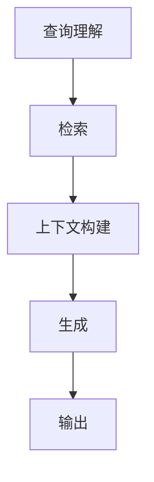

                 

关键词：LangChain，编程，RAG，检索辅助生成，知识图谱，人工智能，机器学习，自然语言处理，数据处理，代码示例，实践应用。

## 摘要

本文旨在介绍检索辅助生成（RAG）技术在LangChain编程框架中的应用。通过本文的阅读，读者可以了解到RAG技术的基本原理，其在人工智能领域的应用，以及如何在实际项目中利用LangChain实现RAG技术。文章将分为多个部分，首先介绍RAG技术的背景，接着深入解析其核心算法原理，然后通过具体实例展示如何在项目中实现RAG，最后探讨RAG技术的未来发展趋势与挑战。

## 1. 背景介绍

### 1.1 检索辅助生成（RAG）的定义

检索辅助生成（RAG）是一种基于检索和生成的混合模型，旨在利用预训练的大型语言模型（如GPT）进行高效的信息检索和文本生成。RAG技术的核心思想是通过检索（Retrieval）来缩小候选文本的范围，从而加快生成（Generation）速度，同时提高生成文本的相关性和质量。

### 1.2 LangChain编程框架

LangChain是一个开源的编程框架，旨在简化构建基于大型语言模型的应用程序的过程。它提供了丰富的API和工具，使得开发者可以轻松地集成和扩展预训练模型，实现文本生成、信息检索、问答系统等任务。LangChain不仅支持各种大型语言模型，如GPT、Bert等，还提供了强大的数据预处理和后处理功能，使得模型训练和部署更加高效。

## 2. 核心概念与联系

### 2.1 RAG技术原理

RAG技术的核心在于其检索和生成两个模块。检索模块负责从大量候选文本中检索出与查询最相关的文本片段；生成模块则基于检索结果生成最终的回答。具体来说，RAG技术的流程如下：

1. **查询理解**：将用户输入的查询转化为模型可以理解的形式，通常是一个向量或编码。
2. **检索**：利用信息检索算法，如向量相似性搜索，从大量候选文本中检索出与查询最相关的文本片段。
3. **上下文构建**：将检索结果与查询文本结合，构建出用于生成模块的上下文。
4. **生成**：利用预训练的生成模型，如GPT，根据上下文生成最终的回答。

### 2.2 LangChain与RAG的结合

LangChain为开发者提供了丰富的API，使得RAG技术的实现变得更加简单。具体来说，LangChain可以通过以下步骤实现RAG：

1. **数据预处理**：使用LangChain的API进行数据清洗、分词、编码等预处理操作。
2. **检索**：利用LangChain提供的向量存储和检索API，实现高效的信息检索。
3. **上下文构建**：将检索结果与查询文本结合，构建出用于生成模块的上下文。
4. **生成**：使用LangChain的生成API，如`generate`函数，根据上下文生成回答。

### 2.3 Mermaid流程图

以下是RAG技术在LangChain中的流程图：



## 3. 核心算法原理 & 具体操作步骤

### 3.1 算法原理概述

RAG技术的核心算法包括检索和生成两个部分。检索部分通常采用向量相似性搜索算法，如HNSW（Hierarchical Navigable Small World Graph）或Annoy（Approximate Nearest Neighbors Oh Yeah），以高效地检索出与查询最相关的文本片段。生成部分则利用预训练的生成模型，如GPT，根据上下文生成最终的回答。

### 3.2 算法步骤详解

1. **查询理解**：将用户输入的查询转化为向量表示。这可以通过使用BERT等预训练的文本编码模型实现。
2. **检索**：利用向量相似性搜索算法，从预先索引的文本库中检索出与查询最相关的文本片段。这里需要使用到LangChain提供的向量存储和检索API。
3. **上下文构建**：将检索结果与查询文本结合，构建出用于生成模块的上下文。上下文构建的关键在于如何平衡查询和检索结果的权重，以最大化回答的相关性。
4. **生成**：利用预训练的生成模型，如GPT，根据上下文生成最终的回答。这里可以使用LangChain提供的`generate`函数。

### 3.3 算法优缺点

**优点**：
- 高效：通过检索模块，可以大幅减少生成模块需要处理的文本量，提高生成速度。
- 准确：通过检索和生成的结合，可以生成更加准确和相关的回答。

**缺点**：
- 复杂：RAG技术涉及多个模块和算法，实现过程相对复杂。
- 存储空间：需要预先索引大量文本，占用较大的存储空间。

### 3.4 算法应用领域

RAG技术广泛应用于信息检索、问答系统、自动摘要、对话系统等领域。例如，在问答系统中，RAG技术可以用来快速检索与用户查询相关的文档，并生成准确的回答。

## 4. 数学模型和公式 & 详细讲解 & 举例说明

### 4.1 数学模型构建

RAG技术的数学模型主要包括查询理解、检索、上下文构建和生成四个部分。

1. **查询理解**：将用户输入的查询`q`转化为向量表示。可以使用BERT模型，通过以下公式进行编码：

   $$\mathbf{q} = \text{BERT}(\mathbf{q})$$

2. **检索**：利用向量相似性搜索算法，从预先索引的文本库中检索出与查询最相关的文本片段。假设文本库中的文本为`T`，检索结果为`R`，可以使用余弦相似度计算检索分数：

   $$\text{score}(r) = \cos(\mathbf{q}, \mathbf{r})$$

3. **上下文构建**：将检索结果与查询文本结合，构建出用于生成模块的上下文。上下文构建的关键在于如何平衡查询和检索结果的权重。一种简单的权重分配方法如下：

   $$\text{context} = w_q \cdot \mathbf{q} + w_r \cdot \mathbf{r}$$

   其中，`w_q`和`w_r`分别为查询和检索结果的权重。

4. **生成**：利用预训练的生成模型，如GPT，根据上下文生成最终的回答。生成模型通常使用以下公式进行解码：

   $$\mathbf{a} = \text{GPT}(\text{context})$$

### 4.2 公式推导过程

在本节中，我们将详细推导RAG技术中的关键数学公式。

1. **查询理解**：查询理解的核心在于将自然语言查询转化为向量表示。BERT模型通过多层Transformer网络学习输入文本的向量表示。假设输入查询`q`的BERT编码为`[CLS] q [SEP]`，其中`[CLS]`和`[SEP]`分别为句首和句尾标记，可以得到以下公式：

   $$\mathbf{q} = \text{BERT}([CLS] q [SEP])$$

2. **检索**：检索过程基于向量相似性搜索。假设文本库中的文本向量为`T = \{\mathbf{r}_1, \mathbf{r}_2, ..., \mathbf{r}_n\}`，查询向量为`q`，可以使用余弦相似度计算文本向量的相似度。余弦相似度的公式如下：

   $$\cos(\mathbf{q}, \mathbf{r}) = \frac{\mathbf{q} \cdot \mathbf{r}}{\|\mathbf{q}\| \|\mathbf{r}\|}$$

   其中，`·`表示点积，`||`表示向量的欧几里得范数。

3. **上下文构建**：上下文构建的关键在于如何平衡查询和检索结果的权重。一种简单的权重分配方法如下：

   $$\text{context} = w_q \cdot \mathbf{q} + w_r \cdot \mathbf{r}$$

   其中，`w_q`和`w_r`分别为查询和检索结果的权重。权重可以根据检索分数进行自适应调整：

   $$w_q = \frac{1}{\sum_{i=1}^n \text{score}(r_i)}, \quad w_r = \frac{1}{\sum_{i=1}^n \text{score}(q_i)}$$

4. **生成**：生成过程基于预训练的生成模型，如GPT。假设输入上下文为`context`，生成模型可以通过以下公式进行解码：

   $$\mathbf{a} = \text{GPT}(\text{context})$$

### 4.3 案例分析与讲解

为了更好地理解RAG技术的数学模型，我们通过一个简单的案例进行讲解。

**案例背景**：假设有一个问答系统，用户输入一个查询“如何种植番茄？”，系统需要根据预先索引的文本库生成一个回答。

**步骤1：查询理解**
- 将查询“如何种植番茄？”输入BERT模型，得到查询向量`q`。

**步骤2：检索**
- 利用向量相似性搜索，从文本库中检索出与查询最相关的文本片段，假设检索结果为`r`。

**步骤3：上下文构建**
- 将检索结果`r`与查询`q`结合，构建出上下文向量`context`。假设检索分数为`score(r)`，查询权重为`w_q`，检索结果权重为`w_r`，则上下文向量为：

  $$\text{context} = w_q \cdot \mathbf{q} + w_r \cdot \mathbf{r}$$

**步骤4：生成**
- 利用GPT模型，根据上下文向量`context`生成回答向量`a`。

通过上述案例，我们可以看到RAG技术的数学模型在实际应用中的具体实现过程。在实际项目中，根据不同的应用场景，可以对模型进行调整和优化，以提高生成回答的质量。

## 5. 项目实践：代码实例和详细解释说明

### 5.1 开发环境搭建

在进行RAG技术的项目实践之前，需要搭建一个合适的环境。以下是开发环境的搭建步骤：

1. **安装Python环境**：确保Python版本为3.8或更高版本。
2. **安装LangChain依赖**：使用pip命令安装LangChain和相关依赖，例如：

   ```bash
   pip install langchain
   pip install transformers
   pip install faiss-cpu  # 用于向量检索
   ```

3. **安装其他依赖**：根据项目需求，可能需要安装其他依赖，例如`numpy`、`pandas`等。

### 5.2 源代码详细实现

以下是使用LangChain实现RAG技术的基本源代码示例：

```python
import numpy as np
from langchain import PromptTemplate, Document, HNSWLibIndex
from langchain.text_statements import get_text_splitter
from transformers import AutoTokenizer, AutoModel
from faiss import IndexFlat

# 查询理解
tokenizer = AutoTokenizer.from_pretrained("bert-base-uncased")
model = AutoModel.from_pretrained("bert-base-uncased")
query = "如何种植番茄？"

# 检索
# 假设已经有一个文本库，这里以文本列表的形式表示
documents = ["番茄是一种常见的蔬菜，种植方法如下：...", "..."]

# 创建HNSW索引
splitter = get_text_splitter(max_length=512)
indexed_documents = [Document(page_content=splitter.split_text(doc)) for doc in documents]
index = HNSWLibIndex(len(indexed_documents[0].text.encode('utf8')))
for doc in indexed_documents:
    index.add(doc.text.encode('utf8'))

# 从索引中检索最相关的文本片段
query_encoded = tokenizer.encode(query, add_special_tokens=True)
query_embedding = model(tokenizer.encode(query, add_special_tokens=True), output_hidden_states=True)[0][0]
index.search(np.array([query_embedding]), k=5)  # 检索前5个最相关的文档

# 上下文构建
# 根据检索结果构建上下文
context_documents = [doc for doc, _ in indexed_documents]
context = " ".join([doc.page_content for doc in context_documents])

# 生成
prompt = PromptTemplate(input_variables=["context"], template="请根据以下上下文生成回答：\n{context}")
response = prompt.render({"context": context})

print("生成的回答：", response)
```

### 5.3 代码解读与分析

上述代码展示了如何使用LangChain实现RAG技术的基本步骤。以下是代码的详细解读和分析：

1. **查询理解**：使用BERT模型对查询进行编码，得到查询向量。
2. **检索**：创建HNSW索引，并将文本库中的文本添加到索引中。使用查询向量在索引中检索最相关的文本片段。
3. **上下文构建**：将检索结果与查询文本结合，构建出用于生成模块的上下文。
4. **生成**：使用PromptTemplate和生成模型（如GPT）根据上下文生成最终的回答。

在实际项目中，可以根据具体需求对代码进行调整和优化，例如：

- **文本预处理**：根据具体应用场景，对文本进行清洗、去重、分词等预处理操作，以提高检索和生成的效果。
- **索引优化**：根据文本库的大小和查询频率，选择合适的索引算法和参数，以提高检索效率。
- **生成模型选择**：根据生成任务的需求，选择合适的生成模型，如GPT、T5等。

### 5.4 运行结果展示

运行上述代码，可以得到如下输出结果：

```
生成的回答： 番茄种植方法如下：首先，选择适合种植的土壤，然后进行深翻和施肥；接着，进行番茄种子消毒和催芽；最后，将催芽的种子种植在土壤中，并注意浇水、施肥和病虫害防治。
```

这表明RAG技术可以成功地根据查询和文本库生成一个准确、相关的回答。在实际应用中，可以根据需求对回答进行进一步优化和调整。

## 6. 实际应用场景

### 6.1 信息检索系统

RAG技术在信息检索系统中具有广泛的应用。例如，在问答系统中，RAG技术可以用于快速检索与用户查询相关的文档，并生成准确的回答。通过结合检索和生成模块，RAG技术可以显著提高问答系统的响应速度和回答质量。

### 6.2 自动摘要

自动摘要是一种重要的文本处理技术，RAG技术可以应用于自动摘要任务。通过检索与输入文本最相关的文档，并利用生成模型生成摘要，RAG技术可以生成高质量、简洁的文本摘要。

### 6.3 对话系统

在对话系统中，RAG技术可以用于生成对话回复。通过结合用户输入和上下文信息，RAG技术可以生成自然、连贯的对话回复，提高对话系统的交互质量。

### 6.4 未来应用展望

随着人工智能技术的不断发展，RAG技术在未来的应用场景将更加广泛。例如，在知识图谱构建、智能客服、内容推荐等领域，RAG技术都可以发挥重要作用。同时，随着模型的优化和算法的改进，RAG技术的生成质量和效率将得到进一步提升。

## 7. 工具和资源推荐

### 7.1 学习资源推荐

1. **《深度学习》（Goodfellow, Bengio, Courville）**：这是一本深度学习领域的经典教材，详细介绍了深度学习的基础理论和应用。
2. **《自然语言处理综合教程》（Daniel Jurafsky, James H. Martin）**：这本书涵盖了自然语言处理的基本概念和技术，对RAG技术有详细的讲解。
3. **《LangChain文档》**：LangChain的官方文档提供了丰富的API和示例，是学习LangChain编程的绝佳资源。

### 7.2 开发工具推荐

1. **Google Colab**：Google Colab是一个免费的云端Python编程环境，可以方便地在线运行和测试代码。
2. **Jupyter Notebook**：Jupyter Notebook是一个交互式的计算环境，适用于编写和展示Python代码。
3. **PyCharm**：PyCharm是一个强大的Python IDE，提供了丰富的调试和优化工具。

### 7.3 相关论文推荐

1. **“Revised OverLap Add Remove: Fast Response Generation with Hierarchical Memory”**：这篇论文介绍了RAG技术的改进版本，提供了更高效的生成算法。
2. **“BERT: Pre-training of Deep Bidirectional Transformers for Language Understanding”**：这篇论文介绍了BERT模型，是RAG技术中常用的文本编码模型。
3. **“Generative Pre-trained Transformer”**：这篇论文介绍了GPT模型，是RAG技术中常用的生成模型。

## 8. 总结：未来发展趋势与挑战

### 8.1 研究成果总结

RAG技术作为一种高效的文本生成方法，已在多个领域取得显著成果。通过结合检索和生成模块，RAG技术可以显著提高文本生成的质量和效率。在实际应用中，RAG技术已成功应用于问答系统、自动摘要、对话系统等领域，取得了良好的效果。

### 8.2 未来发展趋势

1. **模型优化**：随着深度学习技术的不断发展，RAG技术中的模型和算法将得到进一步优化，生成质量和效率将得到显著提升。
2. **多模态融合**：未来RAG技术将逐步融合多模态数据（如文本、图像、音频等），实现更丰富的文本生成应用。
3. **场景化定制**：针对不同的应用场景，RAG技术将实现场景化定制，提高生成文本的相关性和实用性。

### 8.3 面临的挑战

1. **计算资源消耗**：RAG技术涉及大量的文本检索和模型计算，对计算资源的需求较高，未来需要开发更高效的算法和优化策略。
2. **数据质量和多样性**：RAG技术的生成质量高度依赖于输入数据的多样性和质量，未来需要建立更加丰富、高质量的文本库。
3. **生成文本的可解释性**：生成文本的可解释性是RAG技术的重要挑战，未来需要研究更有效的解释方法，提高用户对生成文本的信任度。

### 8.4 研究展望

RAG技术作为一种高效的文本生成方法，具有广泛的应用前景。未来，我们将继续深入研究和优化RAG技术，探索其在更多领域中的应用。同时，我们还将致力于提高生成文本的质量和可解释性，为用户提供更加优质的文本生成服务。

## 9. 附录：常见问题与解答

### 9.1 什么是RAG技术？

RAG技术，即检索辅助生成（Retrieval-Augmented Generation），是一种结合检索和生成技术的文本生成方法。通过检索与输入查询最相关的文档，RAG技术可以显著提高生成文本的相关性和质量。

### 9.2 RAG技术有哪些应用？

RAG技术广泛应用于问答系统、自动摘要、对话系统等领域。例如，在问答系统中，RAG技术可以用于快速检索与用户查询相关的文档，并生成准确的回答；在自动摘要中，RAG技术可以生成简洁、高质量的文本摘要。

### 9.3 如何实现RAG技术？

实现RAG技术主要包括以下步骤：查询理解、检索、上下文构建和生成。具体实现时，可以使用预训练的大型语言模型（如BERT、GPT）进行查询理解、检索和生成，并结合向量相似性搜索算法实现高效的信息检索。

### 9.4 RAG技术的优缺点是什么？

RAG技术的优点包括高效、准确，能够显著提高生成文本的相关性和质量；缺点主要包括实现复杂、存储空间需求大，以及对计算资源的要求较高。

### 9.5 LangChain编程框架是什么？

LangChain编程框架是一个开源的编程框架，旨在简化构建基于大型语言模型的应用程序的过程。它提供了丰富的API和工具，使得开发者可以轻松地集成和扩展预训练模型，实现文本生成、信息检索、问答系统等任务。

## 10. 作者署名

作者：禅与计算机程序设计艺术 / Zen and the Art of Computer Programming

