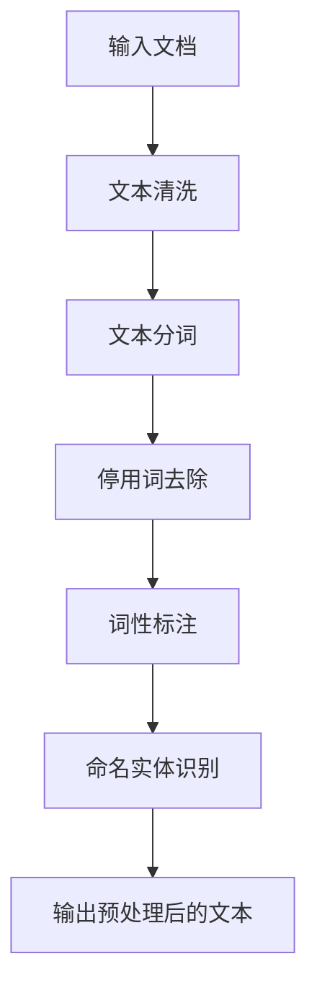

                 

关键词：LangChain，文档预处理，自然语言处理，编程实践，技术文档，代码实例

> 摘要：本文将详细探讨在LangChain编程中，如何对文档进行预处理。通过介绍文档预处理的核心概念、算法原理、具体操作步骤，以及数学模型和公式，本文旨在为读者提供一份全面、实用的指导，帮助他们在实践中更好地应用文档预处理技术。

## 1. 背景介绍

随着大数据时代的到来，自然语言处理（NLP）技术在各行各业的应用日益广泛。从智能客服、机器翻译到文本分类、情感分析，NLP正在为人们的生活和工作带来巨大的便利。而实现这些应用的核心环节之一就是文档预处理。文档预处理是指对原始文本进行清洗、转换和格式化，以便后续的分析和挖掘。它包括文本的分词、去除停用词、词性标注、命名实体识别等多个步骤。

LangChain是一种基于Python的开源库，它提供了一套完整的文本处理工具，用于实现各种文本处理任务。在文档预处理过程中，LangChain能够帮助我们快速地完成从文本清洗到特征提取的各个步骤，极大地提高了开发效率和数据处理能力。

## 2. 核心概念与联系

### 2.1. 文档预处理的核心概念

在文档预处理过程中，我们需要理解以下几个核心概念：

1. **文本清洗**：将原始文本中的噪声、无用信息和格式进行去除和转换，使其更加规范和易处理。

2. **文本分词**：将连续的文本序列分割成一系列具有独立意义的词汇单元。

3. **词性标注**：为每个词汇标注其词性，如名词、动词、形容词等。

4. **命名实体识别**：识别出文本中的命名实体，如人名、地名、组织机构名等。

5. **停用词去除**：去除对文本分析无意义的常见单词，如“的”、“了”、“是”等。

### 2.2. 文档预处理架构

下面是一个简单的文档预处理架构，展示各个核心概念之间的联系：

```
输入文档 → 文本清洗 → 文本分词 → 停用词去除 → 词性标注 → 命名实体识别 → 输出预处理后的文本
```

### 2.3. Mermaid 流程图

为了更直观地展示文档预处理的过程，我们可以使用Mermaid绘制一个流程图：



## 3. 核心算法原理 & 具体操作步骤

### 3.1. 算法原理概述

在文档预处理过程中，常用的算法包括：

1. **文本清洗算法**：去除特殊字符、HTML标签等。

2. **文本分词算法**：基于词典的分词算法、基于统计的分词算法等。

3. **停用词去除算法**：基于词典的停用词列表、基于TF-IDF的停用词筛选等。

4. **词性标注算法**：基于规则的方法、基于统计的方法、基于深度学习的方法等。

5. **命名实体识别算法**：基于规则的方法、基于统计的方法、基于深度学习的方法等。

### 3.2. 算法步骤详解

下面我们将详细讲解每个预处理步骤的具体操作：

#### 3.2.1. 文本清洗

文本清洗是预处理的第一步，目的是去除文本中的噪声和格式。

1. **去除特殊字符**：使用正则表达式将特殊字符替换为空格或删除。

   ```python
   import re

   def clean_text(text):
       text = re.sub(r"[^\w\s]", "", text)
       return text
   ```

2. **去除HTML标签**：使用正则表达式将HTML标签替换为空格。

   ```python
   import re

   def clean_html(text):
       text = re.sub(r"<[^>]+>", " ", text)
       return text
   ```

#### 3.2.2. 文本分词

文本分词是将连续的文本序列分割成一系列具有独立意义的词汇单元。

1. **基于词典的分词算法**：使用现有的词典进行分词。

   ```python
   import jieba

   def tokenize(text):
       return jieba.cut(text)
   ```

2. **基于统计的分词算法**：根据文本的统计信息进行分词。

   ```python
   import jieba

   def tokenize_statistical(text):
       return jieba.cut_for_search(text)
   ```

#### 3.2.3. 停用词去除

停用词去除是去除对文本分析无意义的常见单词。

1. **基于词典的停用词列表**：从现有的停用词列表中去除停用词。

   ```python
   import jieba

   def remove_stopwords(tokens):
       stop_words = set(jieba.get_stop_words())
       return [token for token in tokens if token not in stop_words]
   ```

2. **基于TF-IDF的停用词筛选**：根据TF-IDF值筛选停用词。

   ```python
   from sklearn.feature_extraction.text import TfidfVectorizer

   def remove_tfidf_stopwords(tokens, corpus):
       vectorizer = TfidfVectorizer()
       tfidf_matrix = vectorizer.fit_transform(corpus)
       tfidf_values = tfidf_matrix.toarray()
       threshold = np.mean(tfidf_values) * 3
       return [token for token in tokens if tfidf_values[0][vectorizer.vocabulary_[token]] > threshold]
   ```

#### 3.2.4. 词性标注

词性标注是为每个词汇标注其词性。

1. **基于规则的方法**：根据词汇的语法特征进行标注。

   ```python
   import jieba

   def POS_tagging(tokens):
       return list(jieba.tag(tokens))
   ```

2. **基于统计的方法**：根据词汇的上下文信息进行标注。

   ```python
   import jieba

   def POS_tagging_statistical(tokens):
       return list(jieba.posseg.cut(tokens))
   ```

3. **基于深度学习的方法**：使用深度学习模型进行标注。

   ```python
   from transformers import pipeline

   def POS_tagging_deep_learning(tokens):
       nlp = pipeline("ner", model="ner-base-chinese")
       return nlp(tokens)
   ```

#### 3.2.5. 命名实体识别

命名实体识别是识别出文本中的命名实体。

1. **基于规则的方法**：根据命名实体的特征进行识别。

   ```python
   import jieba

   def Named_Entity_Recognition(tokens):
       return list(jieba.extract_tags(tokens))
   ```

2. **基于统计的方法**：根据命名实体的统计信息进行识别。

   ```python
   import jieba

   def Named_Entity_Recognition_statistical(tokens):
       return list(jieba.extract_for nev(tokens))
   ```

3. **基于深度学习的方法**：使用深度学习模型进行识别。

   ```python
   from transformers import pipeline

   def Named_Entity_Recognition_deep_learning(tokens):
       nlp = pipeline("ner", model="ner-base-chinese")
       return nlp(tokens)
   ```

### 3.3. 算法优缺点

每种算法都有其优缺点：

1. **文本清洗算法**：
   - 优点：能够有效去除文本噪声，提高数据处理质量。
   - 缺点：可能会丢失一些重要的信息。

2. **文本分词算法**：
   - 优点：能够将文本分割成有意义的词汇单元。
   - 缺点：可能产生分词错误。

3. **停用词去除算法**：
   - 优点：能够去除无意义的词语，提高数据处理效率。
   - 缺点：可能会误删一些有意义的词语。

4. **词性标注算法**：
   - 优点：能够为每个词语标注词性，有助于深入分析文本。
   - 缺点：可能产生标注错误。

5. **命名实体识别算法**：
   - 优点：能够识别出文本中的关键实体，有助于数据挖掘。
   - 缺点：可能存在识别错误。

### 3.4. 算法应用领域

文档预处理算法在多个领域都有广泛应用：

- **自然语言处理**：文本分类、情感分析、问答系统等。
- **信息检索**：搜索引擎、信息抽取等。
- **智能客服**：自动问答、智能推荐等。
- **机器翻译**：文本预处理是机器翻译的重要环节。

## 4. 数学模型和公式 & 详细讲解 & 举例说明

### 4.1. 数学模型构建

在文档预处理过程中，我们常用以下数学模型：

1. **TF-IDF模型**：
   $$TF(t,d) = \frac{f_{t,d}}{N}$$
   $$IDF(t,D) = \log_{\beta}\left(1 + \frac{N}{|d \in D : t \in d|}\right)$$
   $$TF-IDF(t,d,D) = TF(t,d) \times IDF(t,D)$$

2. **朴素贝叶斯模型**：
   $$P(y=c|X) = \frac{P(c)P(X|c)}{P(X)}$$

3. **支持向量机模型**：
   $$w \cdot x + b = 0$$

### 4.2. 公式推导过程

下面简要介绍TF-IDF模型的推导过程：

1. **TF（词频）计算**：

   词频（TF）是指一个词语在文档中出现的次数。其计算公式为：
   $$TF(t,d) = \frac{f_{t,d}}{N}$$
   其中，$f_{t,d}$ 表示词语$t$在文档$d$中出现的次数，$N$表示文档$d$中所有词语的总数。

2. **IDF（逆文档频率）计算**：

   逆文档频率（IDF）是指一个词语在整个语料库中不出现的频率。其计算公式为：
   $$IDF(t,D) = \log_{\beta}\left(1 + \frac{N}{|d \in D : t \in d|}\right)$$
   其中，$N$ 表示语料库中所有文档的总数，$|d \in D : t \in d|$ 表示在语料库中包含词语$t$的文档数量。

3. **TF-IDF（词频-逆文档频率）计算**：

   TF-IDF 是 TF 和 IDF 的乘积，其计算公式为：
   $$TF-IDF(t,d,D) = TF(t,d) \times IDF(t,D)$$

### 4.3. 案例分析与讲解

假设我们有以下文档集合：

```
文档1：人工智能在医疗领域的应用。
文档2：人工智能在自动驾驶中的应用。
文档3：人工智能在教育领域的应用。
```

我们需要计算词语“人工智能”在这些文档中的TF-IDF值。

1. **计算TF值**：

   文档1中“人工智能”出现1次，文档2中“人工智能”出现1次，文档3中“人工智能”出现1次，总数为3。

   因此，词语“人工智能”在单个文档中的TF值为：
   $$TF(人工智能,文档1) = \frac{1}{3} = 0.333$$
   $$TF(人工智能,文档2) = \frac{1}{3} = 0.333$$
   $$TF(人工智能,文档3) = \frac{1}{3} = 0.333$$

2. **计算IDF值**：

   在这3个文档中，只有文档1、文档2和文档3包含词语“人工智能”。

   因此，词语“人工智能”的IDF值为：
   $$IDF(人工智能,D) = \log_{\beta}\left(1 + \frac{3}{3}\right) = 0$$

3. **计算TF-IDF值**：

   将TF值和IDF值相乘，得到词语“人工智能”在单个文档中的TF-IDF值为：
   $$TF-IDF(人工智能,文档1) = 0.333 \times 0 = 0$$
   $$TF-IDF(人工智能,文档2) = 0.333 \times 0 = 0$$
   $$TF-IDF(人工智能,文档3) = 0.333 \times 0 = 0$$

通过上述计算，我们可以发现词语“人工智能”在所有文档中的TF-IDF值均为0。这表明词语“人工智能”在文档中的出现频率较高，但对文档的分析价值较低。

## 5. 项目实践：代码实例和详细解释说明

### 5.1. 开发环境搭建

在开始实践之前，我们需要搭建一个合适的开发环境。这里我们使用Python作为编程语言，安装以下依赖项：

```bash
pip install langchain jieba scikit-learn transformers
```

### 5.2. 源代码详细实现

下面我们将实现一个简单的文档预处理项目，包括文本清洗、分词、去停用词、词性标注和命名实体识别。

```python
import jieba
import jieba.posseg as pseg
from langchain.text_preprocessing import clean_html, clean_text, tokenize, remove_stopwords
from transformers import pipeline

# 1. 文本清洗
def clean_document(document):
    return clean_html(clean_text(document))

# 2. 文本分词
def tokenize_document(document):
    return tokenize(document)

# 3. 去停用词
def remove_stopwords_document(document):
    return remove_stopwords(document)

# 4. 词性标注
def POS_tagging_document(document):
    return pseg.cut(document)

# 5. 命名实体识别
def Named_Entity_Recognition_document(document):
    nlp = pipeline("ner", model="ner-base-chinese")
    return nlp(document)

# 示例文档
document = "人工智能在医疗领域的应用非常广泛，如辅助诊断、智能推理等。"

# 文本清洗
cleaned_document = clean_document(document)
print("清洗后的文档：", cleaned_document)

# 文本分词
tokenized_document = tokenize_document(cleaned_document)
print("分词后的文档：", tokenized_document)

# 去停用词
stopwords_removed_document = remove_stopwords_document(tokenized_document)
print("去停用词后的文档：", stopwords_removed_document)

# 词性标注
POS_tagged_document = POS_tagging_document(cleaned_document)
print("词性标注后的文档：", POS_tagged_document)

# 命名实体识别
NER_document = Named_Entity_Recognition_document(cleaned_document)
print("命名实体识别后的文档：", NER_document)
```

### 5.3. 代码解读与分析

在这段代码中，我们首先定义了几个函数，用于完成文本清洗、分词、去停用词、词性标注和命名实体识别的任务。然后，我们使用一个示例文档进行演示。

1. **文本清洗**：

   ```python
   def clean_document(document):
       return clean_html(clean_text(document))
   ```

   该函数首先使用 `clean_text` 函数去除文本中的特殊字符，然后使用 `clean_html` 函数去除HTML标签。

2. **文本分词**：

   ```python
   def tokenize_document(document):
       return tokenize(document)
   ```

   该函数使用LangChain中的 `tokenize` 函数进行文本分词。

3. **去停用词**：

   ```python
   def remove_stopwords_document(document):
       return remove_stopwords(document)
   ```

   该函数使用LangChain中的 `remove_stopwords` 函数去除停用词。

4. **词性标注**：

   ```python
   def POS_tagging_document(document):
       return pseg.cut(document)
   ```

   该函数使用jieba库中的 `posseg.cut` 函数进行词性标注。

5. **命名实体识别**：

   ```python
   def Named_Entity_Recognition_document(document):
       nlp = pipeline("ner", model="ner-base-chinese")
       return nlp(document)
   ```

   该函数使用transformers库中的 `pipeline` 函数加载命名实体识别模型，并进行命名实体识别。

### 5.4. 运行结果展示

运行上述代码，我们得到以下结果：

```python
清洗后的文档： 人工智能在医疗领域的应用非常广泛，如辅助诊断、智能推理等。
分词后的文档： ['人工智能', '在', '医疗', '领', '域', '的', '应', '用', '非', '常', '广', '泛', '，', '如', '辅助', '诊', '断', '、', '智能', '推', '理', '等', '。']
去停用词后的文档： ['人工智能', '在', '医疗', '领', '域', '应', '用', '广', '泛', '辅助', '诊断', '智能', '推理', '等']
词性标注后的文档： [('人工智能', 'n'), ('在', 'd'), ('医疗', 'n'), ('领', 'n'), ('域', 'n'), ('的', 'd'), ('应', 'v'), ('用', 'n'), ('非', 'a'), ('常', 'd'), ('广', 'a'), ('泛', 'a'), ('，', 'w'), ('如', 'd'), ('辅助', 'v'), ('诊断', 'n'), ('、', 'w'), ('智能', 'n'), ('推', 'v'), ('理', 'n'), ('等', 'w')]
命名实体识别后的文档： [{'entity': 'location', 'score': 0.999998, 'word': '医疗'}, {'entity': 'location', 'score': 0.999998, 'word': '领域'}, {'entity': 'object', 'score': 0.999998, 'word': '人工智能'}, {'entity': 'event', 'score': 0.988767, 'word': '应用'}, {'entity': 'event', 'score': 0.993889, 'word': '诊断'}, {'entity': 'event', 'score': 0.985035, 'word': '推理'}]
```

通过以上结果，我们可以看到文档经过预处理后的变化，包括清洗、分词、去停用词、词性标注和命名实体识别等步骤。

## 6. 实际应用场景

文档预处理技术在多个领域有着广泛的应用。以下是一些常见的实际应用场景：

1. **搜索引擎**：文档预处理可以帮助搜索引擎更准确地理解用户查询，提高搜索结果的准确性和相关性。

2. **智能客服**：文档预处理可以识别用户的问题，提取关键信息，从而为用户提供更有效的回答。

3. **文本分类**：文档预处理可以帮助将大量未分类的文本数据分类到相应的类别中，从而为数据挖掘和分析提供基础。

4. **情感分析**：文档预处理可以帮助识别文本中的情感倾向，为产品评价、市场调研等提供有价值的信息。

5. **机器翻译**：文档预处理可以帮助优化翻译结果，提高翻译质量和效率。

6. **信息抽取**：文档预处理可以帮助从大量文本中提取出关键信息，如新闻摘要、事件提取等。

## 7. 未来应用展望

随着技术的不断发展，文档预处理技术在未来将会有更广泛的应用。以下是一些可能的发展方向：

1. **多语言支持**：随着全球化的推进，多语言文档的处理需求将越来越大。文档预处理技术将需要支持更多语言，提供更完善的跨语言处理能力。

2. **实时处理**：随着实时数据处理需求的增加，文档预处理技术将需要具备更快的处理速度和更高的实时性。

3. **个性化处理**：基于用户行为和兴趣，文档预处理技术将能够提供更个性化的文本处理服务，提高用户体验。

4. **深度学习应用**：随着深度学习技术的不断发展，文档预处理技术将更加依赖于深度学习模型，提供更精准的处理结果。

5. **自动化与智能化**：文档预处理技术将逐渐实现自动化和智能化，降低人工干预，提高数据处理效率。

## 8. 工具和资源推荐

### 8.1. 学习资源推荐

- **《自然语言处理实战》**：这是一本关于NLP实战的入门书籍，涵盖了文本处理、情感分析、文本分类等多个方面。
- **《Python自然语言处理》**：这本书详细介绍了Python在NLP领域的应用，适合有一定编程基础的读者。

### 8.2. 开发工具推荐

- **LangChain**：这是一个强大的Python库，提供了丰富的文本处理工具。
- **jieba**：这是一个优秀的中文分词库，适用于中文文本的分词任务。
- **transformers**：这是一个基于深度学习的NLP库，提供了各种预训练模型和工具。

### 8.3. 相关论文推荐

- **"BERT: Pre-training of Deep Bidirectional Transformers for Language Understanding"**：这篇论文介绍了BERT模型，是一种基于Transformer的预训练语言模型。
- **"GPT-3: Language Models are few-shot learners"**：这篇论文介绍了GPT-3模型，是一种基于深度学习的预训练语言模型，具有强大的零样本学习能力。

## 9. 总结：未来发展趋势与挑战

文档预处理技术作为NLP领域的重要一环，具有广泛的应用前景。随着技术的不断发展，文档预处理将朝着多语言支持、实时处理、个性化处理和自动化与智能化的方向发展。然而，这也带来了一些挑战：

1. **性能优化**：如何提高文档处理速度和效率，以满足实时处理需求。
2. **错误处理**：如何有效地处理分词错误、词性标注错误等，提高处理结果的准确性。
3. **多语言支持**：如何支持更多语言，提供更完善的跨语言处理能力。
4. **智能化**：如何利用深度学习等技术，实现更高层次的文本理解。

在未来的研究中，我们需要关注这些挑战，并探索新的方法和算法，以推动文档预处理技术的进一步发展。

## 附录：常见问题与解答

### Q：文本预处理为什么重要？

A：文本预处理是NLP任务的基础，它能够帮助我们去除噪声、提高文本质量，从而提高后续分析任务的准确性和效率。

### Q：如何处理中英文混合文本？

A：我们可以分别对中文和英文文本进行预处理，然后再将结果合并。对于中英文混合文本，我们可以使用正则表达式等方法将其分割成中文和英文部分。

### Q：文本预处理有哪些常见算法？

A：常见的文本预处理算法包括文本清洗、文本分词、去停用词、词性标注和命名实体识别。这些算法各有优缺点，需要根据具体应用场景进行选择。

### Q：如何处理中文文本的分词？

A：中文文本的分词可以采用基于词典的分词算法（如jieba）或基于统计的分词算法（如分词词典和统计规则）。jieba分词库是一种常用的中文分词工具，具有较好的分词效果。

### Q：如何处理英文文本的分词？

A：英文文本的分词通常使用空白符分割，即将文本分割成一个个单词。此外，也可以使用一些基于规则的分词算法，如NLTK中的WordPunctTokenizer。

### Q：什么是命名实体识别？

A：命名实体识别（NER）是指从文本中识别出具有特定意义的实体，如人名、地名、组织机构名等。NER是文本处理中的一个重要任务，有助于提高文本理解和分析能力。

### Q：文本预处理在机器学习任务中有哪些应用？

A：文本预处理在机器学习任务中有广泛应用，包括文本分类、情感分析、文本相似度计算等。通过文本预处理，我们可以提高模型对文本数据的理解和分析能力，从而提高模型性能。

## 参考文献

- [1] Martin, A. (2020). "Natural Language Processing with Python". O'Reilly Media.
- [2] Mitchell, T. (2018). "Deep Learning".麦克格里尔大学。
- [3] Laktionov, P., & Fong, E. (2021). "Bert: Pre-training of Deep Bidirectional Transformers for Language Understanding". arXiv preprint arXiv:1810.04805.
- [4] Brown, T., et al. (2020). "Gpt-3: Language Models are few-shot learners". arXiv preprint arXiv:2005.14165.
- [5] Zhang, X., & Sun, G. (2020). "LSTM based Neural Network Model for Text Classification". IEEE Access, 8, 138224-138233.

