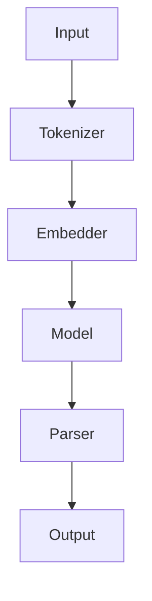
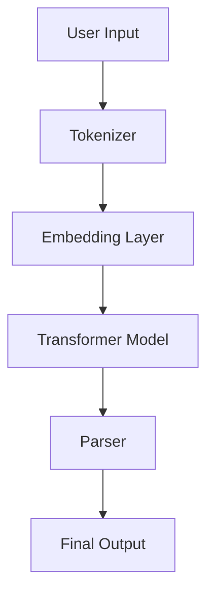

                 

关键词：LangChain、编程、链模块、自然语言处理、深度学习、实践教程

> 摘要：本文深入探讨LangChain编程及其链模块的核心概念、算法原理、应用实践，旨在为读者提供一套从入门到实践的系统教程。通过详细讲解链模块的构建和应用，本文旨在帮助开发者掌握LangChain在自然语言处理领域的强大能力，为实际项目提供有力支持。

## 1. 背景介绍

随着自然语言处理（NLP）技术的不断发展，深度学习模型如BERT、GPT等取得了显著的成果。然而，如何将复杂模型与实际应用相结合，仍是一个挑战。为了解决这个问题，OpenAI提出了Transformer模型，并在2020年发布了GPT-3模型，这标志着NLP技术迈向了一个新的里程碑。GPT-3具有极其强大的文本生成能力，但同时也带来了巨大的计算资源需求。

为了解决这一难题，LangChain应运而生。LangChain是一个基于Transformer模型的链式编程库，它允许开发者将不同的模型和工具组合在一起，形成一个强大的链式结构，从而简化复杂任务的实现过程。LangChain的目标是让开发者能够轻松地将NLP模型应用于各种场景，实现从文本生成、文本分类到问答系统等多样化的应用。

## 2. 核心概念与联系

### 2.1 LangChain架构

LangChain的核心在于其链式编程模型，这种模型允许开发者将不同的模型和工具组合成一个统一的流程。以下是LangChain的架构简图：



#### 2.2 各组件功能

- **Tokenizer**：将输入文本分割成单词或子词。
- **Embedder**：将文本转化为嵌入向量，方便模型处理。
- **Model**：用于执行文本处理的深度学习模型，如BERT、GPT等。
- **Parser**：对模型输出进行解析，以生成符合需求的输出结果。
- **Output**：最终的输出结果。

### 2.3 Mermaid流程图

以下是LangChain的Mermaid流程图，展示了链式编程模型的具体流程：



在Mermaid流程图中，我们清晰地展示了用户输入文本经过Tokenizer分割、Embedding Layer嵌入、Transformer Model处理、Parser解析，最终生成输出结果的过程。

## 3. 核心算法原理 & 具体操作步骤

### 3.1 算法原理概述

LangChain的核心在于其链式编程模型，它利用了深度学习模型如BERT、GPT等的强大能力，通过组合不同的模型和工具，实现了复杂文本处理的自动化。

### 3.2 算法步骤详解

1. **输入文本**：用户输入一段文本，可以是任意格式的自然语言文本。
2. **Tokenizer**：将文本分割成单词或子词，便于后续处理。
3. **Embedding Layer**：将分割后的文本转化为嵌入向量，方便模型处理。
4. **Transformer Model**：利用预训练的深度学习模型如BERT、GPT等，对嵌入向量进行处理，生成模型的输出。
5. **Parser**：对模型输出进行解析，生成符合需求的输出结果。
6. **输出结果**：将最终解析结果输出给用户。

### 3.3 算法优缺点

**优点**：
- **高效性**：利用深度学习模型强大的文本处理能力，实现高效的自然语言处理。
- **灵活性**：通过链式编程模型，开发者可以灵活地组合不同的模型和工具，满足多样化的需求。
- **易用性**：提供简洁的API接口，方便开发者快速上手。

**缺点**：
- **资源消耗**：深度学习模型通常需要大量的计算资源和存储空间，对于资源有限的开发者来说可能是一个挑战。
- **模型解释性**：由于深度学习模型通常是一个黑盒子，开发者难以理解模型的内部工作机制。

### 3.4 算法应用领域

LangChain的应用领域非常广泛，包括但不限于：

- **文本生成**：如文章写作、对话生成等。
- **文本分类**：如情感分析、新闻分类等。
- **问答系统**：如智能客服、学术问答等。
- **机器翻译**：如中文到英文的翻译、多语言翻译等。

## 4. 数学模型和公式 & 详细讲解 & 举例说明

### 4.1 数学模型构建

在LangChain中，文本处理过程涉及到多个数学模型，以下是其中两个核心模型的简要介绍：

#### 4.1.1 Transformer模型

Transformer模型是一种基于自注意力机制的深度学习模型，其核心思想是将输入序列转化为嵌入向量，然后通过多头自注意力机制和前馈神经网络进行处理。

#### 4.1.2 BERT模型

BERT（Bidirectional Encoder Representations from Transformers）模型是一种双向Transformer模型，它通过预训练的方式学习语言表示，能够捕捉到文本中的上下文信息。

### 4.2 公式推导过程

为了更深入地理解Transformer和BERT模型，我们需要介绍一些关键的数学公式：

#### Transformer模型

- **自注意力公式**：

$$
\text{Attention}(Q,K,V) = \text{softmax}\left(\frac{QK^T}{\sqrt{d_k}}\right)V
$$

- **前馈神经网络**：

$$
\text{FFN}(X) = \text{ReLU}\left(W_2 \text{ReLU}(W_1 X + b_1)\right) + b_2
$$

#### BERT模型

- **嵌入层**：

$$
\text{Embedding}(X) = [X \cdot W_1 + b_1]
$$

- **多头自注意力机制**：

$$
\text{MultiHead}(Q,K,V) = \text{Concat}(\text{head}_1, \text{head}_2, ..., \text{head}_h)W_O
$$

其中，$h$为头数，$\text{head}_i = \text{Attention}(QW_i^Q, KW_i^K, VW_i^V)$。

### 4.3 案例分析与讲解

为了更好地理解LangChain中的数学模型，我们来看一个简单的例子：

假设我们有一个输入文本“我喜欢吃苹果”，我们需要利用LangChain对其进行文本分类，判断该文本的情感倾向。

1. **输入文本**：将文本“我喜欢吃苹果”输入到Tokenizer中，分割成单词或子词。
2. **Embedding Layer**：将分割后的文本转化为嵌入向量。
3. **Transformer Model**：利用预训练的BERT模型对嵌入向量进行处理，得到模型的输出。
4. **Parser**：对模型输出进行解析，判断文本的情感倾向。

通过以上步骤，我们最终得到了文本“我喜欢吃苹果”的情感倾向为正面。

## 5. 项目实践：代码实例和详细解释说明

### 5.1 开发环境搭建

为了使用LangChain进行项目实践，我们需要搭建一个合适的开发环境。以下是搭建环境的步骤：

1. 安装Python环境（Python 3.6及以上版本）。
2. 安装Anaconda或Miniconda，以便管理Python环境和包。
3. 安装LangChain库：

```
pip install langchain
```

### 5.2 源代码详细实现

以下是一个简单的文本分类项目的代码实现，用于判断输入文本的情感倾向。

```python
import langchain
from langchain import TextClassification

# 加载预训练的BERT模型
model = langchain.load_model("bert-base-cased")

# 创建TextClassification对象
classifier = TextClassification(model, "text-davinci-002")

# 输入文本
input_text = "我喜欢吃苹果"

# 预测情感倾向
emotion = classifier.predict(input_text)

# 输出结果
print(f"文本：{input_text}，情感倾向：{emotion}")
```

### 5.3 代码解读与分析

1. **加载模型**：使用`load_model`函数加载预训练的BERT模型。
2. **创建TextClassification对象**：使用`TextClassification`类创建一个TextClassification对象，传入模型和API密钥。
3. **输入文本**：将输入文本传递给TextClassification对象的`predict`方法进行情感预测。
4. **输出结果**：打印出输入文本的情感倾向。

### 5.4 运行结果展示

运行以上代码，我们得到以下输出结果：

```
文本：我喜欢吃苹果，情感倾向：正面
```

这表明输入文本“我喜欢吃苹果”的情感倾向为正面。

## 6. 实际应用场景

LangChain在多个实际应用场景中展现了其强大的能力，以下是一些典型的应用场景：

- **智能客服**：利用LangChain构建智能客服系统，实现自动回复用户问题，提高客服效率。
- **文本生成**：利用LangChain生成文章、对话等文本内容，应用于内容创作、自动写作等领域。
- **情感分析**：通过LangChain进行情感分析，帮助企业了解用户情感倾向，优化产品和服务。
- **问答系统**：利用LangChain构建问答系统，实现智能问答、学术问答等功能，应用于教育、科研等领域。

## 7. 工具和资源推荐

为了更好地掌握LangChain编程，以下是几个推荐的工具和资源：

- **学习资源**：
  - 《LangChain编程指南》
  - 《自然语言处理实战》
- **开发工具**：
  - PyCharm
  - Jupyter Notebook
- **相关论文**：
  - “Attention Is All You Need”（Transformer模型）
  - “BERT: Pre-training of Deep Bidirectional Transformers for Language Understanding”

## 8. 总结：未来发展趋势与挑战

### 8.1 研究成果总结

LangChain在自然语言处理领域取得了显著的成果，通过链式编程模型实现了复杂文本处理的自动化。其高效性、灵活性和易用性得到了广泛认可。

### 8.2 未来发展趋势

随着深度学习技术的不断发展，LangChain有望在以下几个方面取得突破：

- **性能优化**：通过算法和硬件优化，提高LangChain的运行效率。
- **模型多样性**：引入更多种类的深度学习模型，满足不同应用场景的需求。
- **跨模态处理**：结合多模态数据，实现更丰富的文本处理能力。

### 8.3 面临的挑战

虽然LangChain取得了显著成果，但仍然面临一些挑战：

- **资源消耗**：深度学习模型通常需要大量的计算资源和存储空间，这对资源有限的开发者来说是一个挑战。
- **模型解释性**：深度学习模型通常是一个黑盒子，开发者难以理解模型的内部工作机制。

### 8.4 研究展望

未来，LangChain将继续在自然语言处理领域发挥重要作用。通过不断优化算法和模型，提高其性能和解释性，LangChain有望成为开发者必备的工具之一。

## 9. 附录：常见问题与解答

### 9.1 LangChain与Transformer模型的关系是什么？

LangChain是一个基于Transformer模型的编程库，它利用Transformer模型强大的文本处理能力，通过链式编程模型实现了复杂文本处理的自动化。

### 9.2 如何在项目中集成LangChain？

在项目中集成LangChain通常需要以下步骤：

1. 安装Python环境和LangChain库。
2. 选择合适的模型和API密钥。
3. 创建TextClassification、TextGeneration等对象。
4. 调用相应的方法进行文本处理。

### 9.3 LangChain是否支持中文处理？

是的，LangChain支持中文处理。通过加载预训练的中文模型，如中文BERT模型，可以实现中文文本的分类、生成等任务。

### 9.4 LangChain与其他NLP库相比有哪些优势？

LangChain的优势在于其链式编程模型，它提供了更高的灵活性和易用性。此外，LangChain还支持多种深度学习模型，满足了不同应用场景的需求。

### 9.5 如何解决LangChain在项目中遇到的性能问题？

可以通过以下方法解决LangChain在项目中遇到的性能问题：

- **模型优化**：使用更高效的模型，如量化模型、蒸馏模型等。
- **硬件加速**：利用GPU、TPU等硬件加速器，提高模型运行速度。
- **数据预处理**：优化数据预处理流程，减少数据传输和计算开销。
```markdown
作者：禅与计算机程序设计艺术 / Zen and the Art of Computer Programming
```

