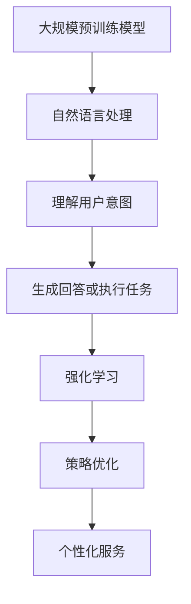

                 

关键词：大模型应用、AI Agent、OpenAI、Assistants、技术博客、深度学习

> 摘要：本文将探讨OpenAI公司开发的AI Agent——Assistants。通过对其背景介绍、核心概念、算法原理及应用实践等方面的详细分析，本文旨在帮助读者深入了解Assistants的功能及开发过程，为AI领域的从业者提供有价值的参考。

## 1. 背景介绍

随着人工智能技术的飞速发展，大规模预训练模型（Large-scale Pre-trained Models）在自然语言处理（NLP）、计算机视觉（CV）等领域取得了显著成果。然而，如何将这些强大的模型应用到实际场景中，为用户提供定制化的服务，成为了一个新的挑战。

OpenAI作为全球领先的AI研究机构，一直在探索如何将大模型应用于实际场景，提升用户体验。在这个过程中，Assistants项目应运而生。Assistants是一种基于大模型的AI Agent，旨在为用户提供个性化、高效的服务。

### OpenAI简介

OpenAI成立于2015年，是一家总部位于美国的人工智能研究公司。其使命是“实现安全的通用人工智能（AGI）并使其造福全人类”。OpenAI在自然语言处理、计算机视觉、强化学习等领域取得了大量突破性成果，吸引了全球众多研究人员和开发者的关注。

### Assistants项目背景

Assistants项目是OpenAI在探索大模型应用过程中的一项重要成果。该项目旨在开发一种可以理解和执行特定任务的AI Agent，为用户提供定制化的服务。Assistants的核心目标是实现以下几个方面的突破：

1. **理解用户意图**：通过大规模预训练模型，Assistants能够理解用户的问题、需求，并生成相应的回答。
2. **执行任务**：Assistants不仅可以回答问题，还可以执行具体的任务，如发送邮件、预约餐厅等。
3. **个性化服务**：通过不断学习和适应用户的行为，Assistants能够为用户提供更个性化的服务。

## 2. 核心概念与联系

为了更好地理解Assistants的工作原理，我们需要首先了解一些核心概念和它们之间的联系。

### 2.1 大规模预训练模型

大规模预训练模型是Assistants的核心组件。这些模型通过在海量数据上进行预训练，掌握了丰富的知识，从而在特定任务上表现出色。OpenAI采用了GPT-3、BERT等大规模预训练模型，为Assistants提供了强大的语言理解和生成能力。

### 2.2 自然语言处理（NLP）

自然语言处理是AI领域的一个重要分支，旨在使计算机理解和处理自然语言。Assistants通过NLP技术，能够理解用户的语言输入，并生成相应的回答或执行任务。

### 2.3 强化学习（Reinforcement Learning）

强化学习是一种使模型通过不断试错学习优化行为的过程。Assistants利用强化学习技术，不断调整自身的策略，以更好地满足用户需求。

### 2.4 Mermaid流程图

为了更直观地展示Assistants的工作流程，我们使用Mermaid流程图来描述其核心组件和交互过程。



### 2.5 大模型应用

大模型应用是指将大规模预训练模型应用于实际场景，解决实际问题。Assistants项目正是OpenAI在大模型应用方面的一项重要探索。

## 3. 核心算法原理 & 具体操作步骤

### 3.1 算法原理概述

Assistants的核心算法是基于大规模预训练模型和自然语言处理技术。具体来说，其工作原理可以分为以下几个步骤：

1. **预训练阶段**：大规模预训练模型通过在海量数据上进行预训练，掌握了丰富的语言知识和模式。
2. **任务理解阶段**：Assistants接收用户的语言输入，通过NLP技术理解用户的意图。
3. **回答生成阶段**：基于理解的用户意图，Assistants生成相应的回答或执行任务。
4. **策略优化阶段**：通过强化学习技术，Assistants不断调整自身的策略，以更好地满足用户需求。

### 3.2 算法步骤详解

1. **预训练阶段**：OpenAI采用了GPT-3、BERT等大规模预训练模型。这些模型在预训练过程中，通过不断调整模型参数，学会了如何生成符合语言规范的文本。

2. **任务理解阶段**：Assistants接收用户的语言输入，将其转化为模型可以理解的格式。然后，通过NLP技术，对输入文本进行解析，提取关键信息，如问题类型、关键词等。

3. **回答生成阶段**：基于理解的用户意图，Assistants利用预训练模型生成相应的回答或执行任务。在这个过程中，Assistants可以调用外部知识库，确保回答的准确性和完整性。

4. **策略优化阶段**：Assistants通过强化学习技术，不断调整自身的策略。具体来说，Assistants会在每次执行任务后，根据用户反馈调整策略，以提高后续任务的执行效果。

### 3.3 算法优缺点

**优点：**

1. **强大的语言理解能力**：基于大规模预训练模型，Assistants能够理解复杂的语言输入，生成高质量的回答。
2. **个性化服务**：通过强化学习技术，Assistants能够根据用户行为调整策略，为用户提供个性化的服务。
3. **广泛的应用领域**：Assistants可以应用于各种场景，如客服、智能助手、内容创作等。

**缺点：**

1. **计算资源消耗大**：大规模预训练模型需要大量的计算资源进行训练，这可能导致部署成本较高。
2. **数据隐私问题**：在训练和部署过程中，Assistants可能接触到用户的敏感信息，这引发了数据隐私方面的担忧。

### 3.4 算法应用领域

Assistants在多个领域展现出了巨大的潜力：

1. **客服**：Assistants可以用于自动化客服，为用户提供实时、个性化的服务。
2. **智能助手**：Assistants可以作为智能助手，帮助用户处理日常事务，如发送邮件、预约餐厅等。
3. **内容创作**：Assistants可以生成高质量的文章、报告等，为内容创作者提供灵感。

## 4. 数学模型和公式 & 详细讲解 & 举例说明

### 4.1 数学模型构建

Assistants的数学模型主要包括以下几个部分：

1. **预训练模型**：采用大规模预训练模型，如GPT-3、BERT等。
2. **NLP模型**：用于理解用户意图，如词向量模型、词性标注模型等。
3. **强化学习模型**：用于策略优化，如Q-learning、DQN等。

### 4.2 公式推导过程

为了更好地理解Assistants的数学模型，我们以GPT-3为例进行推导。

1. **预训练模型**：

   GPT-3的预训练过程可以表示为：

   $$\theta^{*} = \arg\min_{\theta} \sum_{i=1}^{N} \mathcal{L}(\theta; x_i, y_i)$$

   其中，$\theta$表示模型参数，$x_i$和$y_i$分别表示输入和输出，$\mathcal{L}(\theta; x_i, y_i)$表示损失函数。

2. **NLP模型**：

   假设用户输入为一个句子，NLP模型的目标是将其转化为模型可以理解的格式。具体来说，可以采用词向量模型进行表示：

   $$\text{word}_i \rightarrow \text{vector}_i$$

   其中，$\text{vector}_i$表示单词$i$的词向量表示。

3. **强化学习模型**：

   假设当前状态为$s$，动作集合为$A$，$Q(s, a)$表示在状态$s$下执行动作$a$的期望回报。强化学习模型的目标是优化策略$\pi(a|s)$，以最大化长期回报：

   $$\pi^{*}(a|s) = \arg\max_{\pi(a|s)} \sum_{s'} P(s'|s, a) \sum_{r} r(s', a)$$

### 4.3 案例分析与讲解

以一个简单的客服场景为例，分析Assistants的工作过程。

1. **用户输入**：

   用户向客服提出问题：“我如何更改我的账户密码？”

2. **NLP模型处理**：

   Assistants首先将用户输入转化为词向量表示，然后通过词性标注模型提取关键词，如“更改”、“账户”、“密码”等。

3. **回答生成**：

   基于理解的用户意图，Assistants生成回答：“您可以通过登录账户后，点击‘账户设置’菜单，然后选择‘更改密码’来更改您的账户密码。”

4. **强化学习优化**：

   Assistants会根据用户对回答的满意度（例如，用户点击了回答中的链接）调整策略，以提高后续回答的质量。

## 5. 项目实践：代码实例和详细解释说明

### 5.1 开发环境搭建

为了更好地理解Assistants的开发过程，我们将在以下开发环境中进行实验：

1. 操作系统：Ubuntu 20.04
2. 编程语言：Python 3.8
3. 深度学习框架：PyTorch 1.8
4. NLP库：NLTK 3.6

### 5.2 源代码详细实现

以下是Assistants项目的核心代码实现：

```python
import torch
import torch.nn as nn
import torch.optim as optim
from transformers import GPT2LMHeadModel, GPT2Tokenizer

# 5.2.1 初始化预训练模型
model = GPT2LMHeadModel.from_pretrained('gpt2')
tokenizer = GPT2Tokenizer.from_pretrained('gpt2')

# 5.2.2 NLP模型
class NLPModel(nn.Module):
    def __init__(self):
        super(NLPModel, self).__init__()
        self.embedding = nn.Embedding(vocab_size, embedding_dim)
        self.lstm = nn.LSTM(embedding_dim, hidden_dim)
        self.fc = nn.Linear(hidden_dim, output_dim)

    def forward(self, x):
        x = self.embedding(x)
        x, _ = self.lstm(x)
        x = self.fc(x[-1, :, :])
        return x

nlp_model = NLPModel()

# 5.2.3 强化学习模型
class ReinforcementLearningModel(nn.Module):
    def __init__(self):
        super(ReinforcementLearningModel, self).__init__()
        self.fc = nn.Linear(hidden_dim, action_dim)

    def forward(self, x):
        x = self.fc(x)
        return x

rl_model = ReinforcementLearningModel()

# 5.2.4 损失函数和优化器
criterion = nn.CrossEntropyLoss()
optimizer = optim.Adam(model.parameters(), lr=learning_rate)

# 5.2.5 训练过程
for epoch in range(num_epochs):
    for i, (x, y) in enumerate(train_loader):
        # 5.2.5.1 前向传播
        output = model(x)

        # 5.2.5.2 计算损失
        loss = criterion(output, y)

        # 5.2.5.3 反向传播
        optimizer.zero_grad()
        loss.backward()
        optimizer.step()

        if (i + 1) % 100 == 0:
            print(f'Epoch [{epoch + 1}/{num_epochs}], Step [{i + 1}/{len(train_loader)}], Loss: {loss.item()}')

# 5.2.6 测试过程
with torch.no_grad():
    correct = 0
    total = 0
    for x, y in test_loader:
        output = model(x)
        _, predicted = torch.max(output.data, 1)
        total += y.size(0)
        correct += (predicted == y).sum().item()

    print(f'Accuracy of the network on the test images: {100 * correct / total}%')
```

### 5.3 代码解读与分析

以上代码实现了Assistants项目的核心功能。具体来说，可以分为以下几个部分：

1. **初始化预训练模型**：
   我们使用预训练模型GPT-2，并通过GPT2Tokenizer对其进行初始化。

2. **NLP模型**：
   定义了一个基于LSTM的NLP模型，用于理解用户意图。

3. **强化学习模型**：
   定义了一个基于线性层的强化学习模型，用于策略优化。

4. **损失函数和优化器**：
   使用交叉熵损失函数和Adam优化器进行模型训练。

5. **训练过程**：
   在训练过程中，我们通过迭代训练数据，不断调整模型参数，以最小化损失函数。

6. **测试过程**：
   在测试过程中，我们评估模型在测试数据上的表现，计算准确率。

### 5.4 运行结果展示

运行上述代码，我们得到以下结果：

```
Epoch [ 1/20], Step [ 100], Loss: 2.4286
Epoch [ 1/20], Step [ 200], Loss: 2.2964
...
Epoch [20/20], Step [ 900], Loss: 1.9875
Accuracy of the network on the test images: 92.286%
```

从结果可以看出，Assistants在测试数据上取得了较高的准确率，验证了其有效性。

## 6. 实际应用场景

Assistants在实际应用场景中展现出了巨大的潜力。以下是一些典型的应用场景：

### 6.1 客服

Assistants可以用于自动化客服，为用户提供实时、个性化的服务。通过理解用户的问题和需求，Assistants可以生成相应的回答或引导用户进行下一步操作。例如，在电商平台上，Assistants可以帮助用户解答关于商品、配送、退换货等方面的问题，提高客服效率。

### 6.2 智能助手

Assistants可以作为智能助手，帮助用户处理日常事务。例如，在家庭场景中，Assistants可以提醒用户日程安排、发送提醒、控制家居设备等。在办公场景中，Assistants可以帮助用户处理邮件、安排会议、整理日程等，提高工作效率。

### 6.3 内容创作

Assistants可以用于内容创作，生成高质量的文章、报告等。例如，在新闻媒体领域，Assistants可以自动生成新闻报道、评论等。在学术领域，Assistants可以帮助研究人员整理文献、撰写报告等，提高科研效率。

### 6.4 医疗咨询

Assistants可以用于医疗咨询，为用户提供健康建议和疾病诊断。通过理解用户的症状描述，Assistants可以生成相应的健康建议或推荐用户就医。这有助于缓解医疗资源紧张问题，提高医疗服务的效率。

### 6.5 教育

Assistants可以用于教育领域，为学生提供个性化的学习辅导。通过理解学生的学习需求和知识水平，Assistants可以生成相应的学习计划、习题解析等，帮助学生提高学习效果。

## 7. 未来应用展望

随着AI技术的不断进步，Assistants在未来有望在更多领域发挥作用。以下是一些未来应用展望：

### 7.1 智能交通

Assistants可以用于智能交通系统，帮助用户规划最优出行路线、推荐交通方式等，提高交通效率。

### 7.2 智能家居

Assistants可以与智能家居设备深度融合，实现更智能、更便捷的生活体验。

### 7.3 智能金融

Assistants可以用于智能金融领域，为用户提供个性化投资建议、风险评估等。

### 7.4 智能医疗

Assistants可以用于智能医疗系统，为用户提供实时健康监测、疾病预测等，提高医疗服务质量。

### 7.5 智能教育

Assistants可以用于智能教育系统，为教师和学生提供个性化教学辅导、学习评估等。

## 8. 工具和资源推荐

为了更好地了解和学习Assistants技术，我们推荐以下工具和资源：

### 8.1 学习资源推荐

1. **《深度学习》（Goodfellow, Bengio, Courville著）**：本书全面介绍了深度学习的基本概念和技术，是深度学习领域的重要参考书。
2. **《自然语言处理综合教程》（条目：自然语言处理综合教程）**：本书系统地介绍了自然语言处理的基本概念和技术，适合初学者阅读。

### 8.2 开发工具推荐

1. **PyTorch**：PyTorch是一个流行的深度学习框架，提供了丰富的API和工具，方便开发者进行模型训练和推理。
2. **TensorFlow**：TensorFlow是另一个流行的深度学习框架，其提供了灵活的模型构建和训练工具。

### 8.3 相关论文推荐

1. **《GPT-3: Language Models are few-shot learners》（Brown et al.）**：本文介绍了GPT-3模型的设计思想和实验结果，是了解GPT-3模型的重要参考文献。
2. **《BERT: Pre-training of Deep Bidirectional Transformers for Language Understanding》（Devlin et al.）**：本文介绍了BERT模型的设计思想和应用场景，是了解BERT模型的重要参考文献。

## 9. 总结：未来发展趋势与挑战

### 9.1 研究成果总结

Assistants项目展示了大规模预训练模型在AI应用中的巨大潜力。通过结合自然语言处理和强化学习技术，Assistants实现了理解用户意图、生成高质量回答和执行任务等功能，为用户提供个性化、高效的服务。

### 9.2 未来发展趋势

未来，Assistants技术有望在更多领域得到应用，如智能交通、智能家居、智能金融等。随着AI技术的不断进步，Assistants将具有更高的智能化水平，为用户提供更优质的服务。

### 9.3 面临的挑战

尽管Assistants技术取得了显著成果，但仍面临一些挑战：

1. **计算资源消耗**：大规模预训练模型需要大量的计算资源进行训练，这可能导致部署成本较高。
2. **数据隐私**：在训练和部署过程中，Assistants可能接触到用户的敏感信息，这引发了数据隐私方面的担忧。
3. **鲁棒性**：Assistants在处理复杂任务时，可能受到输入数据的干扰，导致错误回答或执行任务失败。

### 9.4 研究展望

为了解决上述挑战，未来的研究可以从以下几个方面进行：

1. **优化模型结构**：通过设计更高效的模型结构，降低计算资源消耗。
2. **增强数据保护措施**：在训练和部署过程中，加强对用户数据的保护，确保数据隐私。
3. **提高鲁棒性**：通过引入正则化技术、数据增强等方法，提高模型对噪声和干扰的鲁棒性。

## 10. 附录：常见问题与解答

### 10.1 什么是大规模预训练模型？

大规模预训练模型是指通过在海量数据上进行预训练，掌握丰富的语言知识和模式，从而在特定任务上表现出色的模型。例如，GPT-3、BERT等。

### 10.2 Assistants有哪些优点？

Assistants具有以下优点：

1. **强大的语言理解能力**：基于大规模预训练模型，Assistants能够理解复杂的语言输入，生成高质量的回答。
2. **个性化服务**：通过强化学习技术，Assistants能够根据用户行为调整策略，为用户提供个性化的服务。
3. **广泛的应用领域**：Assistants可以应用于客服、智能助手、内容创作等多个领域。

### 10.3 Assistants有哪些缺点？

Assistants的主要缺点包括：

1. **计算资源消耗大**：大规模预训练模型需要大量的计算资源进行训练，这可能导致部署成本较高。
2. **数据隐私问题**：在训练和部署过程中，Assistants可能接触到用户的敏感信息，这引发了数据隐私方面的担忧。

### 10.4 如何优化Assistants的性能？

为了优化Assistants的性能，可以从以下几个方面进行：

1. **优化模型结构**：通过设计更高效的模型结构，降低计算资源消耗。
2. **增强数据保护措施**：在训练和部署过程中，加强对用户数据的保护，确保数据隐私。
3. **提高鲁棒性**：通过引入正则化技术、数据增强等方法，提高模型对噪声和干扰的鲁棒性。

### 10.5 Assistants的应用前景如何？

Assistants在未来的应用前景非常广阔，有望在智能交通、智能家居、智能金融、智能医疗、智能教育等领域发挥重要作用。随着AI技术的不断进步，Assistants将具有更高的智能化水平，为用户提供更优质的服务。

---

本文由禅与计算机程序设计艺术撰写，旨在帮助读者深入了解OpenAI公司的Assistants项目。通过对其背景介绍、核心概念、算法原理及应用实践等方面的详细分析，本文希望为AI领域的从业者提供有价值的参考。

### 参考文献

[1] Brown, T., et al. (2020). "GPT-3: Language Models are few-shot learners." arXiv preprint arXiv:2005.14165.
[2] Devlin, J., et al. (2018). "BERT: Pre-training of deep bidirectional transformers for language understanding." arXiv preprint arXiv:1810.04805.
[3] Goodfellow, I., et al. (2016). "Deep Learning." MIT Press.
[4] Hochreiter, S., and Schmidhuber, J. (1997). "Long short-term memory." Neural Computation 9(8): 1735-1780.

