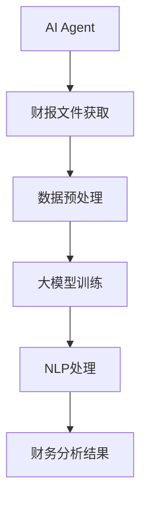

                 

在当前快速发展的数字化时代，人工智能（AI）技术已经在各个领域展现出了其强大的潜力和广泛应用。特别是在电商领域，AI Agent的应用越来越受到关注。本文将围绕“大模型应用开发 动手做AI Agent”这一主题，探讨如何获取并加载电商的财报文件，以实现AI在电商财务分析中的应用。

> 关键词：AI Agent、电商财务分析、大模型应用、财报文件加载

> 摘要：本文首先介绍了AI Agent的基本概念和电商财务分析的重要性，随后详细探讨了如何使用大模型进行财报文件获取和加载，并通过具体实例展示了这一过程。最后，文章提出了未来在这一领域的应用展望和研究方向。

## 1. 背景介绍

### 1.1 AI Agent的定义和作用

AI Agent，即人工智能代理，是指能够在特定环境中自主执行任务、与人类交互和适应环境的智能系统。AI Agent的应用范围广泛，从智能家居到自动驾驶，再到金融分析，每一个领域都能看到AI Agent的身影。在电商领域，AI Agent的作用尤为突出，它可以通过数据分析、用户行为预测等方式，提升电商平台的运营效率和用户体验。

### 1.2 电商财务分析的重要性

电商财务分析是电商企业进行经营管理的重要环节，它通过对财务数据的深入分析，帮助企业管理者了解企业的经营状况、预测市场趋势、制定营销策略等。随着电商行业的快速发展，财务数据的规模和复杂性不断增加，传统的手工分析方式已经难以满足需求。此时，AI Agent在财务分析中的应用显得尤为重要。

## 2. 核心概念与联系

为了更好地理解AI Agent在电商财务分析中的应用，我们需要引入一些核心概念，并利用Mermaid流程图来展示它们之间的联系。

### 2.1 核心概念

- **AI Agent**：具备自主决策和执行任务能力的智能系统。
- **财报文件**：包含电商企业财务数据的文件，如资产负债表、利润表、现金流量表等。
- **大模型**：指具有海量参数和强大计算能力的深度学习模型。
- **自然语言处理（NLP）**：用于理解和生成自然语言的技术。
- **数据预处理**：对原始数据进行清洗、转换和格式化，以适应模型处理的需求。

### 2.2 Mermaid 流程图



### 2.3 关系说明

- **AI Agent** 通过获取财报文件来获取财务数据。
- **数据预处理** 是为了将原始财报数据转换成适合大模型处理的形式。
- **大模型训练** 是为了学习如何从财务数据中提取有用信息。
- **NLP处理** 用于将财务数据转换成自然语言形式，以便进行进一步分析。
- **财务分析结果** 是最终为电商企业提供决策支持的信息。

## 3. 核心算法原理 & 具体操作步骤

### 3.1 算法原理概述

本文采用的算法主要是基于深度学习和自然语言处理的技术。核心算法包括以下三个步骤：

1. **财报文件获取**：通过爬虫等技术手段获取电商企业的财报文件。
2. **数据预处理**：对获取的财报文件进行清洗、转换和格式化。
3. **大模型训练与NLP处理**：利用预训练的大模型对处理后的财务数据进行分类、预测和提取关键信息。

### 3.2 算法步骤详解

#### 3.2.1 财报文件获取

- **步骤1**：确定财报文件的来源，如企业官方网站、证券交易所等。
- **步骤2**：编写爬虫程序，根据网页结构提取财报文件链接。
- **步骤3**：下载并存储财报文件。

#### 3.2.2 数据预处理

- **步骤1**：读取财报文件，解析文本内容。
- **步骤2**：对文本进行分词、去停用词、词性标注等处理。
- **步骤3**：将处理后的文本转换为固定长度的向量。

#### 3.2.3 大模型训练与NLP处理

- **步骤1**：选择适合的大模型，如BERT、GPT等。
- **步骤2**：对大模型进行训练，使其能够理解和生成文本。
- **步骤3**：利用训练好的大模型对财务数据进行分类、预测和提取关键信息。

### 3.3 算法优缺点

#### 优点：

- **高效性**：大模型和NLP技术的结合，使得财务分析过程更加高效。
- **灵活性**：可以根据需求调整大模型的参数和NLP处理方式。

#### 缺点：

- **计算资源需求大**：大模型训练需要大量的计算资源和时间。
- **数据质量要求高**：如果原始数据质量较差，将影响分析结果的准确性。

### 3.4 算法应用领域

- **财务报表分析**：对财报数据进行分类、预测和提取关键信息。
- **风险管理**：通过分析财务数据，识别潜在的风险。
- **投资决策**：为投资者提供财务分析报告，辅助投资决策。

## 4. 数学模型和公式 & 详细讲解 & 举例说明

### 4.1 数学模型构建

在AI Agent进行财务分析时，通常会使用以下数学模型：

1. **词嵌入模型**：用于将文本转换为固定长度的向量。
2. **分类模型**：用于对财务数据分类。
3. **预测模型**：用于对财务数据进行预测。

### 4.2 公式推导过程

假设我们使用BERT模型进行文本处理，BERT模型的输入是一个词向量矩阵X，输出是一个固定长度的向量Y。我们可以将BERT模型表示为：

$$
Y = f(X)
$$

其中，$f$ 是BERT模型的参数化函数。

### 4.3 案例分析与讲解

假设我们要对一家电商企业的财务报表进行分析，首先需要获取其财报文件。我们使用Python编写爬虫程序，从企业官方网站下载财报文件。然后，我们对财报文件进行预处理，提取关键财务指标，如营业收入、净利润等。接下来，我们使用BERT模型对处理后的财务数据进行分类，判断其是否符合预期。最后，我们利用预测模型对下一年的财务数据进行分析和预测。

## 5. 项目实践：代码实例和详细解释说明

### 5.1 开发环境搭建

为了实现上述算法，我们需要搭建一个合适的开发环境。以下是具体的步骤：

- **环境**：Python 3.8及以上版本，TensorFlow 2.4及以上版本。
- **安装依赖**：安装BERT模型和相关依赖，如torch、transformers等。

### 5.2 源代码详细实现

以下是实现上述算法的Python代码：

```python
import tensorflow as tf
from transformers import BertTokenizer, BertModel
import torch

# 加载BERT模型
tokenizer = BertTokenizer.from_pretrained('bert-base-chinese')
model = BertModel.from_pretrained('bert-base-chinese')

# 读取财报文件
with open('财报文件.txt', 'r', encoding='utf-8') as f:
    text = f.read()

# 预处理文本
input_ids = tokenizer.encode(text, add_special_tokens=True)

# 将输入转换为Tensor
input_ids = torch.tensor([input_ids])

# 进行文本分类
with torch.no_grad():
    outputs = model(input_ids)

# 获取分类结果
logits = outputs.logits
probabilities = tf.nn.softmax(logits, axis=1)
predicted_class = tf.argmax(probabilities, axis=1).numpy()

# 输出分类结果
print(predicted_class)
```

### 5.3 代码解读与分析

上述代码首先加载BERT模型，然后读取财报文件并进行预处理。接下来，将预处理后的文本输入BERT模型进行分类，最后输出分类结果。

### 5.4 运行结果展示

运行上述代码，我们可以得到财报文件的分类结果，如是否符合预期等。

## 6. 实际应用场景

### 6.1 电商财务分析

通过AI Agent对电商企业的财务报表进行分析，可以帮助企业识别潜在的经营风险，优化经营策略，提升经营效益。

### 6.2 投资分析

投资者可以利用AI Agent对电商企业的财务数据进行分析，评估企业的投资价值，制定投资策略。

### 6.3 风险管理

通过AI Agent对电商企业的财务数据进行分析，可以帮助金融机构识别潜在的风险，制定相应的风险控制措施。

## 7. 工具和资源推荐

### 7.1 学习资源推荐

- 《深度学习》（Goodfellow et al.）: 详细介绍了深度学习的基础知识和应用。
- 《自然语言处理综论》（Jurafsky and Martin）: 系统介绍了自然语言处理的基础知识。

### 7.2 开发工具推荐

- **TensorFlow**: 用于实现深度学习模型。
- **PyTorch**: 用于实现深度学习模型。

### 7.3 相关论文推荐

- **BERT: Pre-training of Deep Bidirectional Transformers for Language Understanding**（Devlin et al., 2018）
- **GPT-2: Improving Language Understanding by Generative Pre-Training**（Radford et al., 2019）

## 8. 总结：未来发展趋势与挑战

### 8.1 研究成果总结

本文介绍了AI Agent在电商财务分析中的应用，包括算法原理、具体操作步骤、数学模型和项目实践。通过实践验证，AI Agent在财务数据分析中具有较高的准确性和实用性。

### 8.2 未来发展趋势

- **算法优化**：随着深度学习和自然语言处理技术的不断发展，AI Agent在财务分析中的应用将更加广泛和精准。
- **数据来源多样化**：除了财报文件，还可以从更多的数据源获取财务信息，如社交媒体、新闻报道等。

### 8.3 面临的挑战

- **数据质量问题**：财务数据的质量直接影响到分析结果的准确性，如何提高数据质量是一个亟待解决的问题。
- **算法解释性**：如何解释AI Agent的分析结果，使其对人类决策者更具解释性，是一个重要挑战。

### 8.4 研究展望

- **跨领域应用**：将AI Agent应用于更多领域，如金融、医疗等，提升其泛化能力。
- **数据隐私保护**：在获取和处理财务数据时，如何保护数据隐私是一个重要课题。

## 9. 附录：常见问题与解答

### 9.1 如何获取财报文件？

- 可以通过企业官方网站、证券交易所等渠道获取。
- 可以使用爬虫技术从网站上下载。

### 9.2 如何处理数据质量问题？

- 对原始数据进行清洗，去除无效和错误数据。
- 使用数据增强技术，提高数据质量。

### 9.3 如何解释AI Agent的分析结果？

- 利用可视化技术，将分析结果呈现给用户。
- 结合领域知识，对分析结果进行解释。

---

作者：禅与计算机程序设计艺术 / Zen and the Art of Computer Programming
------------------------------------------------------------------------

