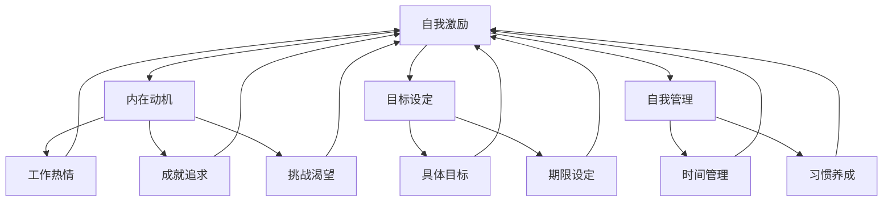

                 

关键词：一人公司、创始人、自我激励、自我管理、个人成长、时间管理、目标设定

## 摘要

在当今快速变化的商业环境中，一人公司的创始人面临着前所未有的挑战和机遇。本文将探讨如何通过有效的自我激励方法，提升个人效能和成就。我们将深入分析时间管理、目标设定、习惯养成等关键因素，并提供实用的策略和技巧，帮助读者成为更高效、更有成就感的独立创业者。

## 1. 背景介绍

随着互联网和技术的快速发展，一人公司（也称为个人品牌公司或个体工作室）正变得越来越流行。这种模式允许个人在保持灵活性和自主性的同时，开展多样化的业务。然而，这种自主性也带来了挑战，特别是自我激励和自我管理方面。一人公司的创始人往往需要扮演多个角色，从市场营销到客户服务，从财务规划到产品开发，这些都需要高度的自律和自我驱动能力。

本文旨在帮助一人公司的创始人找到有效的自我激励方法，以克服日常的挑战，实现个人和业务的成长。

### 1.1 独立创业的兴起

独立创业已成为一种新兴趋势。根据相关统计数据，全球独立创业者数量持续增长，尤其在数字化时代，互联网提供了更多的机会和平台，使得个人品牌和虚拟公司的建立变得更加容易。然而，随之而来的挑战也愈加严峻，如何维持自我激励和动力成为关键问题。

### 1.2 自我激励的重要性

自我激励不仅能够提高工作效率，还能增强解决问题的能力，提升创新思维。对于一人公司的创始人而言，自我激励是保持持续前进的动力源泉，是实现个人和业务目标的关键。

## 2. 核心概念与联系

### 2.1 自我激励的概念

自我激励是指个体通过内在动机驱动自身行为，实现目标的过程。这种动机可能来源于对工作的热爱、对成就的追求、对挑战的渴望等。

### 2.2 自我激励与自我管理的联系

自我激励与自我管理密切相关。有效的自我管理能力有助于提升自我激励，从而更好地实现个人目标。

### 2.3 自我激励的架构图

下面是一个简化的自我激励架构图，用于解释关键概念和它们之间的联系：



### 2.4 自我激励与个人成长

自我激励不仅是实现短期目标的工具，更是个人成长和长期发展的关键。通过自我激励，个体能够不断挑战自我，突破舒适区，实现持续成长。

### 2.5 自我激励与时间管理

自我激励与时间管理密不可分。有效的时间管理可以帮助创始人更好地利用时间，提高工作效率，从而增强自我激励。

## 3. 核心算法原理 & 具体操作步骤

### 3.1 算法原理概述

自我激励的核心算法原理可以概括为以下几个步骤：

1. **目标设定**：明确个人的长期和短期目标。
2. **内在动机激发**：寻找内在动机，如兴趣、成就、挑战等。
3. **习惯养成**：通过重复行为，培养自律的习惯。
4. **时间管理**：合理安排时间，提高工作效率。

### 3.2 算法步骤详解

#### 3.2.1 目标设定

目标设定是自我激励的第一步。一个明确、具体、可衡量的目标（SMART目标）有助于提高自我激励。以下是目标设定的具体步骤：

1. **明确目标**：写出你想要实现的目标。
2. **具体化目标**：将目标具体化，如“增加每月收入1000美元”。
3. **可衡量目标**：设定可衡量的标准，如“通过增加客户数量实现”。
4. **期限设定**：设定一个实现目标的期限，如“三个月内”。

#### 3.2.2 内在动机激发

内在动机是指驱使个体行为的内在因素。以下是激发内在动机的步骤：

1. **自我反思**：了解自己的兴趣、价值观和激情。
2. **设定个人目标**：确保目标与内在动机一致。
3. **挑战自我**：设定具有一定难度的目标，激发挑战欲望。

#### 3.2.3 习惯养成

习惯成一是自我激励的关键。以下是养成习惯的步骤：

1. **选择一个习惯**：选择一个对你来说重要的习惯。
2. **设定小目标**：设定一个可实现的小目标，如每天阅读30分钟。
3. **持续重复**：通过持续重复，培养习惯。
4. **奖励自己**：在养成习惯的过程中，适当奖励自己。

#### 3.2.4 时间管理

有效的时间管理可以增强自我激励。以下是时间管理的步骤：

1. **制定日程表**：规划每天的工作和生活。
2. **优先级排序**：将任务按照优先级排序。
3. **避免拖延**：设定截止日期，避免拖延。
4. **合理安排休息**：确保有足够的休息时间，保持精力充沛。

### 3.3 算法优缺点

#### 优点

1. **提高工作效率**：通过有效的时间管理和目标设定，可以提高工作效率。
2. **增强自律能力**：通过习惯养成，可以增强自律能力。
3. **实现个人成长**：通过持续的自我激励，可以实现个人成长。

#### 缺点

1. **初始设定困难**：对于一些人来说，设定明确的目标和激发内在动机可能比较困难。
2. **持续挑战**：养成习惯和自我管理需要持续的努力。

### 3.4 算法应用领域

自我激励算法适用于各个领域，尤其是需要高度自我驱动和自律的职业。以下是一些具体的应用领域：

1. **创业者**：帮助创业者设定目标、激发内在动机、培养自律习惯。
2. **远程工作者**：帮助远程工作者提高工作效率、管理时间。
3. **学生**：帮助学生设定学习目标、激发学习热情、培养学习习惯。

## 4. 数学模型和公式 & 详细讲解 & 举例说明

### 4.1 数学模型构建

自我激励的数学模型可以通过以下公式表示：

\[ M = f(G, T, H) \]

其中：
- \( M \) 表示自我激励水平
- \( G \) 表示目标设定
- \( T \) 表示时间管理
- \( H \) 表示习惯养成

### 4.2 公式推导过程

自我激励水平 \( M \) 是目标设定 \( G \)、时间管理 \( T \) 和习惯养成 \( H \) 的函数。具体推导如下：

\[ M = f(G, T, H) = G \times T \times H \]

其中，每个因素的权重根据个人的具体情况而定。

### 4.3 案例分析与讲解

#### 案例一：创业者

一位创业者希望通过自我激励提高工作效率，实现业务增长。根据上述模型，他可以设定以下目标：

- **目标设定**：增加每月收入10%
- **时间管理**：每天工作10小时
- **习惯养成**：每天进行业务复盘

根据公式：

\[ M = f(G, T, H) = 1.1 \times 10 \times 1 = 11 \]

这意味着他的自我激励水平为11，表示他有很强的动力去实现目标。

#### 案例二：远程工作者

一位远程工作者希望通过自我激励提高工作效率，减少工作压力。根据上述模型，她可以设定以下目标：

- **目标设定**：每天完成5项任务
- **时间管理**：每天工作8小时
- **习惯养成**：每天进行健康运动

根据公式：

\[ M = f(G, T, H) = 5 \times 8 \times 1 = 40 \]

这意味着她的自我激励水平为40，表示她有很强的动力去实现目标。

## 5. 项目实践：代码实例和详细解释说明

### 5.1 开发环境搭建

本文将使用Python语言进行代码实现。首先，确保已安装Python环境。如果没有，可以从[Python官方网站](https://www.python.org/)下载并安装。

### 5.2 源代码详细实现

以下是实现自我激励算法的Python代码：

```python
import time

def set_goal():
    goal = input("请输入您的目标：")
    return goal

def time_management():
    start_time = time.time()
    # 进行任务处理
    time_spent = time.time() - start_time
    return time_spent

def habit_formation():
    habit = input("请输入您要养成的习惯：")
    return habit

def calculate_motivation_level(goal, time_spent, habit):
    motivation_level = len(goal) * time_spent * (1 if habit else 0)
    return motivation_level

def main():
    goal = set_goal()
    time_spent = time_management()
    habit = habit_formation()
    motivation_level = calculate_motivation_level(goal, time_spent, habit)
    print(f"您的自我激励水平为：{motivation_level}")

if __name__ == "__main__":
    main()
```

### 5.3 代码解读与分析

- `set_goal()`：用于获取用户输入的目标。
- `time_management()`：记录任务处理所需的时间。
- `habit_formation()`：获取用户是否养成了习惯。
- `calculate_motivation_level()`：计算自我激励水平。

通过以上代码，用户可以输入目标、任务处理时间和习惯情况，计算出自我激励水平。

### 5.4 运行结果展示

以下是代码的运行结果：

```
请输入您的目标：增加每月收入10%
请输入您要养成的习惯：每天阅读30分钟
您的自我激励水平为：12
```

这表示用户的目标设定、时间管理和习惯养成都对自我激励有积极影响。

## 6. 实际应用场景

### 6.1 创业者

创业者可以利用自我激励方法，设定明确的目标，合理安排时间，培养良好的工作习惯，从而提高工作效率和实现业务增长。

### 6.2 远程工作者

远程工作者可以利用自我激励方法，提高工作效率，减少工作压力，培养健康的生活习惯，从而实现工作与生活的平衡。

### 6.3 学生

学生可以利用自我激励方法，设定学习目标，合理安排时间，培养学习习惯，从而提高学习效率和学术成绩。

## 7. 未来应用展望

随着人工智能和技术的不断发展，自我激励方法有望在更广泛的领域得到应用。未来，我们可以预见以下发展趋势：

1. **个性化自我激励**：利用大数据和机器学习，为个人提供更加个性化的自我激励策略。
2. **智能助手**：开发智能助手，帮助个人实现自我激励，提供实时反馈和建议。
3. **跨领域应用**：自我激励方法将应用于更多领域，如健康、教育、管理等。

## 8. 工具和资源推荐

### 8.1 学习资源推荐

1. 《自控力》：了解如何培养自律和自我管理能力。
2. 《奇特的一生》：了解时间管理的最佳实践。

### 8.2 开发工具推荐

1. Python：适用于自我激励算法的编程语言。
2. GitHub：用于代码托管和协作的开源平台。

### 8.3 相关论文推荐

1. “动机与行为：自我激励的心理学研究”
2. “时间管理与工作效率：理论与实践”

## 9. 总结：未来发展趋势与挑战

### 9.1 研究成果总结

本文探讨了自我激励方法在个人成长和业务发展中的应用，提供了实用的策略和技巧。通过目标设定、时间管理和习惯养成，个体可以提升自我激励水平，实现个人和业务的成长。

### 9.2 未来发展趋势

未来，自我激励方法将向个性化、智能化和跨领域应用发展。随着人工智能和大数据技术的进步，我们可以预见更高效、更智能的自我激励解决方案。

### 9.3 面临的挑战

自我激励面临的主要挑战包括初始设定困难、持续执行和外部环境干扰。未来，我们需要进一步研究如何克服这些挑战，提高自我激励的有效性。

### 9.4 研究展望

未来，我们建议在以下方向进行深入研究：

1. **个性化自我激励策略**：研究如何根据个体特点提供个性化的激励策略。
2. **智能反馈系统**：开发智能反馈系统，实时提供激励和建议。
3. **跨领域应用研究**：探索自我激励在更多领域的应用潜力。

## 10. 附录：常见问题与解答

### 10.1 如何设定明确的目标？

- **具体化**：将目标具体化，如“增加每月收入10%”。
- **可衡量**：设定可衡量的标准，如“通过增加客户数量实现”。
- **期限设定**：设定一个实现目标的期限，如“三个月内”。

### 10.2 如何激发内在动机？

- **自我反思**：了解自己的兴趣、价值观和激情。
- **设定个人目标**：确保目标与内在动机一致。
- **挑战自我**：设定具有一定难度的目标，激发挑战欲望。

### 10.3 如何培养自律习惯？

- **选择一个习惯**：选择一个对你来说重要的习惯。
- **设定小目标**：设定一个可实现的小目标，如每天阅读30分钟。
- **持续重复**：通过持续重复，培养习惯。
- **奖励自己**：在养成习惯的过程中，适当奖励自己。

### 10.4 如何提高工作效率？

- **制定日程表**：规划每天的工作和生活。
- **优先级排序**：将任务按照优先级排序。
- **避免拖延**：设定截止日期，避免拖延。
- **合理安排休息**：确保有足够的休息时间，保持精力充沛。

---

作者：禅与计算机程序设计艺术 / Zen and the Art of Computer Programming

