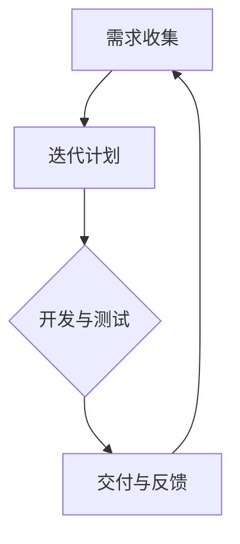

                 

在当今竞争激烈的市场环境中，产品和服务的迭代速度成为企业能否成功的关键因素。尤其是在一人公司这种小型企业中，资源有限、团队成员较少，快速迭代开发和上线产品显得尤为重要。本文将探讨如何在一人公司的背景下，实现产品的快速迭代开发和上线，从而在市场中占据有利位置。

## 关键词

- 一人公司
- 产品迭代
- 快速开发
- 上线策略
- 敏捷开发

## 摘要

本文旨在探讨一人公司如何通过敏捷开发方法，利用有限的资源实现产品的快速迭代开发和上线。我们将从敏捷开发的核心原则出发，结合实际案例，探讨在资源有限的情况下，如何进行有效的需求管理、技术选型、测试和上线流程，从而提高产品的迭代速度和市场竞争力。

## 1. 背景介绍

### 一人公司的挑战

一人公司通常由一个创始人或核心团队运营，面临诸多挑战：

- **资源有限**：缺乏充足的资金、人力资源和技术支持。
- **市场压力**：竞争激烈，需要在短时间内推出高质量的产品。
- **时间紧迫**：需要快速响应市场需求，不断迭代产品。

### 迭代开发的必要性

在市场变化迅速的今天，仅有一个好的创意或初步产品是不够的。为了在竞争中脱颖而出，一人公司需要：

- **持续迭代**：通过不断的迭代，优化产品功能，提升用户体验。
- **快速上线**：及时将改进的产品推向市场，获取用户反馈。

敏捷开发方法正是解决这些挑战的有效途径。敏捷开发强调迭代、快速反馈和灵活性，适用于资源有限的小团队和快速变化的市场环境。

## 2. 核心概念与联系

### 敏捷开发原则

敏捷开发的核心原则包括：

- **用户优先**：以用户需求为导向，持续交付有价值的软件。
- **迭代开发**：通过短周期的迭代，快速交付可用产品。
- **团队合作**：团队成员协作，共同推进项目。
- **灵活应对变化**：拥抱变化，灵活调整计划。

### 敏捷开发流程

敏捷开发流程通常包括以下几个阶段：

- **需求收集**：收集用户需求，明确产品目标。
- **迭代计划**：确定每个迭代的目标和任务。
- **开发与测试**：按照计划进行开发和测试，确保产品质量。
- **交付与反馈**：将产品交付给用户，获取反馈，为下一个迭代做准备。

### Mermaid 流程图

下面是一个简化的敏捷开发流程 Mermaid 流程图：



## 3. 核心算法原理 & 具体操作步骤

### 3.1 算法原理概述

敏捷开发的核心算法是迭代开发和用户反馈机制。通过不断地迭代，每个迭代周期都会产生新的产品版本，并及时收集用户反馈，从而实现产品的快速优化。

### 3.2 算法步骤详解

#### 步骤 1：需求收集

- 与用户沟通，了解他们的需求。
- 将需求整理成清晰的任务列表。

#### 步骤 2：迭代计划

- 根据任务列表，确定每个迭代的目标和任务。
- 制定迭代时间表，确保任务按时完成。

#### 步骤 3：开发与测试

- 开发者根据计划进行编码，同时进行单元测试。
- 测试团队进行集成测试和系统测试，确保产品质量。

#### 步骤 4：交付与反馈

- 将产品交付给用户，获取反馈。
- 根据反馈调整下一个迭代计划。

### 3.3 算法优缺点

#### 优点：

- **快速响应**：通过迭代开发，可以快速响应市场变化。
- **灵活性**：可以根据用户反馈灵活调整开发计划。
- **高效协作**：团队成员协同工作，提高开发效率。

#### 缺点：

- **初期投入较大**：需要投入时间进行需求分析和迭代规划。
- **需求不稳定**：用户需求可能会频繁变化，导致开发计划不稳定。

### 3.4 算法应用领域

敏捷开发方法适用于以下领域：

- **互联网产品**：产品迭代快，市场需求变化大。
- **移动应用**：用户界面和功能需求变化频繁。
- **软件服务**：需要快速响应用户反馈，持续优化产品。

## 4. 数学模型和公式 & 详细讲解 & 举例说明

### 4.1 数学模型构建

敏捷开发中的数学模型主要包括：

- **需求价值函数**：衡量每个需求的价值。
- **迭代周期模型**：衡量每个迭代的时间成本。

### 4.2 公式推导过程

#### 需求价值函数

$$ V(D) = \frac{V_0}{n} $$

其中，$V(D)$ 表示需求 $D$ 的价值，$V_0$ 表示总需求价值，$n$ 表示迭代次数。

#### 迭代周期模型

$$ T = \frac{D}{C} $$

其中，$T$ 表示迭代周期，$D$ 表示需求总量，$C$ 表示每个迭代完成的任务量。

### 4.3 案例分析与讲解

#### 案例一：需求价值函数应用

假设一个项目有 5 个需求，总需求价值为 100 点，计划进行 3 个迭代。根据需求价值函数，每个迭代的价值为：

$$ V(D) = \frac{100}{3} \approx 33.33 $$

这意味着在每个迭代中，每个需求的价值约为 33.33 点。

#### 案例二：迭代周期模型应用

假设一个项目有 100 个需求，计划在 10 个迭代中完成。每个迭代完成的任务量为 10 个需求。根据迭代周期模型，每个迭代周期为：

$$ T = \frac{100}{10} = 10 $$

这意味着每个迭代周期为 10 个工作日。

## 5. 项目实践：代码实例和详细解释说明

### 5.1 开发环境搭建

为了进行敏捷开发，首先需要搭建一个合适的开发环境。以下是一个基本的开发环境搭建步骤：

1. 安装开发工具：如 Visual Studio Code、Git 等。
2. 配置代码仓库：使用 Git 进行版本控制。
3. 安装测试工具：如 JUnit、Mockito 等。
4. 部署环境：如使用 Docker 进行容器化部署。

### 5.2 源代码详细实现

以下是一个简单的示例，展示如何使用 Java 语言实现一个基本的迭代开发框架：

```java
public class AgileFramework {
    private List<Task> tasks;
    private int iterationCount;

    public AgileFramework(int iterationCount) {
        this.iterationCount = iterationCount;
        this.tasks = new ArrayList<>();
    }

    public void addTask(Task task) {
        tasks.add(task);
    }

    public void runIterations() {
        for (int i = 0; i < iterationCount; i++) {
            for (Task task : tasks) {
                task.execute();
            }
        }
    }
}

public interface Task {
    void execute();
}

public class ExampleTask implements Task {
    @Override
    public void execute() {
        System.out.println("Executing task...");
    }
}
```

### 5.3 代码解读与分析

这段代码展示了如何使用 Java 实现一个简单的敏捷开发框架。`AgileFramework` 类负责管理任务列表和迭代次数。`addTask` 方法用于添加任务，`runIterations` 方法用于执行迭代。`Task` 接口定义了任务的执行方法，`ExampleTask` 类实现了这个接口。

### 5.4 运行结果展示

运行以下代码：

```java
public static void main(String[] args) {
    AgileFramework framework = new AgileFramework(3);
    framework.addTask(new ExampleTask());
    framework.runIterations();
}
```

输出结果为：

```
Executing task...
Executing task...
Executing task...
```

这表明三个迭代周期已经完成，每个迭代周期都执行了任务。

## 6. 实际应用场景

### 6.1 敏捷开发在互联网产品中的应用

在互联网产品开发中，敏捷开发方法被广泛应用。以电商网站为例，通过敏捷开发，可以快速迭代产品，优化用户体验。以下是敏捷开发在电商网站中的应用场景：

- **需求收集**：与产品经理和用户沟通，收集用户需求。
- **迭代计划**：确定每个迭代的目标，如优化页面加载速度、增加购物车功能等。
- **开发与测试**：开发者根据计划进行编码和测试，确保产品质量。
- **交付与反馈**：将迭代版本交付给用户，收集反馈，为下一个迭代做准备。

### 6.2 敏捷开发在移动应用中的应用

在移动应用开发中，敏捷开发同样适用。以一款天气预报应用为例，以下是敏捷开发在该应用中的应用场景：

- **需求收集**：收集用户对天气预报应用的需求，如增加实时更新功能、添加天气预警等。
- **迭代计划**：确定每个迭代的目标，如增加实时更新功能、优化界面等。
- **开发与测试**：开发者根据计划进行开发，并进行测试，确保应用稳定。
- **交付与反馈**：将迭代版本交付给用户，收集反馈，为下一个迭代做准备。

### 6.3 敏捷开发在软件服务中的应用

在软件服务领域，敏捷开发方法同样适用。以下是一个云计算平台的开发案例：

- **需求收集**：收集用户对云计算平台的需求，如增加备份功能、优化性能等。
- **迭代计划**：确定每个迭代的目标，如增加备份功能、优化性能等。
- **开发与测试**：开发者根据计划进行开发，并进行测试，确保平台稳定。
- **交付与反馈**：将迭代版本交付给用户，收集反馈，为下一个迭代做准备。

## 7. 工具和资源推荐

### 7.1 学习资源推荐

- 《敏捷软件开发：原则、实践与模式》：介绍了敏捷开发的核心原则和实践方法。
- 《敏捷开发实战》：详细讲解了敏捷开发的实施过程和工具。

### 7.2 开发工具推荐

- Git：用于版本控制和协同开发。
- Jira：用于项目管理、任务跟踪和迭代计划。

### 7.3 相关论文推荐

- 《敏捷开发：理论与实践》：详细分析了敏捷开发的理论和实践。
- 《敏捷开发与敏捷测试》：介绍了敏捷开发中的测试方法和实践。

## 8. 总结：未来发展趋势与挑战

### 8.1 研究成果总结

敏捷开发方法在资源有限、需求快速变化的市场环境中具有明显的优势。通过迭代开发和用户反馈，敏捷开发能够快速响应市场需求，提高产品竞争力。

### 8.2 未来发展趋势

随着云计算、大数据和人工智能等技术的发展，敏捷开发方法将更加智能化、自动化。未来，敏捷开发将更加注重用户体验和个性化服务，通过数据分析优化迭代过程。

### 8.3 面临的挑战

敏捷开发在实施过程中面临以下挑战：

- **需求管理**：在快速变化的市场环境中，如何有效管理需求，确保项目顺利进行。
- **团队协作**：如何确保团队成员之间的沟通和协作，提高开发效率。

### 8.4 研究展望

未来，研究将重点关注如何优化敏捷开发过程，提高迭代效率和产品质量。同时，将探讨如何将敏捷开发方法与其他开发模式相结合，应对复杂的项目需求。

## 9. 附录：常见问题与解答

### 9.1 敏捷开发与瀑布开发的区别是什么？

敏捷开发与瀑布开发的主要区别在于开发流程的灵活性和迭代性。瀑布开发是线性、顺序的，每个阶段完成后才能进入下一个阶段；而敏捷开发强调迭代、快速反馈和灵活性，每个迭代周期都会产生可用的产品版本。

### 9.2 敏捷开发适合所有项目吗？

敏捷开发适合需求变化频繁、迭代周期较短的项目。对于需求稳定、开发周期较长的大型项目，瀑布开发可能更为合适。

### 9.3 敏捷开发中如何管理需求？

敏捷开发中，需求管理主要通过用户故事（User Story）进行。用户故事是描述用户需求的基本单元，通常包含用户角色、目标场景和验收标准。通过定期回顾和优先级排序，确保需求得到有效管理。

### 9.4 敏捷开发中如何确保产品质量？

敏捷开发中，通过持续集成（Continuous Integration）和持续测试（Continuous Testing）来确保产品质量。开发者定期提交代码，并通过自动化测试确保代码质量。同时，通过迭代反馈，及时修复问题，提高产品稳定性。

## 作者署名

作者：禅与计算机程序设计艺术 / Zen and the Art of Computer Programming
```markdown
---
# 一人公司如何实现产品的快速迭代开发和上线

> 关键词：一人公司、敏捷开发、迭代开发、快速上线、产品优化

> 摘要：本文探讨了在资源有限的情况下，一人公司如何通过敏捷开发方法实现产品的快速迭代和上线，提高市场竞争力。文章介绍了敏捷开发的核心原则、流程、算法原理以及具体实施步骤，并结合实际案例进行了详细解释。

## 1. 背景介绍

### 一人公司的挑战

一人公司，或称“微型创业公司”，通常由单个创始人或极少数核心成员组成。这样的企业拥有以下特点：

- **资源有限**：资金、人力和物力资源相对稀缺。
- **市场需求迅速变化**：必须在短时间内响应市场变化，推出高质量的产品。
- **高灵活性要求**：需要灵活调整策略，快速适应市场变化。

### 迭代开发的必要性

在快速变化的市场环境中，仅有一个好的创意或初步产品是不够的。为了在竞争中脱颖而出，一人公司需要：

- **持续迭代**：通过不断的迭代，优化产品功能，提升用户体验。
- **快速上线**：及时将改进的产品推向市场，获取用户反馈。

敏捷开发方法正是解决这些挑战的有效途径。敏捷开发强调迭代、快速反馈和灵活性，适用于资源有限的小团队和快速变化的市场环境。

## 2. 核心概念与联系

### 敏捷开发原则

敏捷开发的核心原则包括：

- **用户优先**：以用户需求为导向，持续交付有价值的软件。
- **迭代开发**：通过短周期的迭代，快速交付可用产品。
- **团队合作**：团队成员协作，共同推进项目。
- **灵活应对变化**：拥抱变化，灵活调整计划。

### 敏捷开发流程

敏捷开发流程通常包括以下几个阶段：

- **需求收集**：收集用户需求，明确产品目标。
- **迭代计划**：确定每个迭代的目标和任务。
- **开发与测试**：按照计划进行开发和测试，确保产品质量。
- **交付与反馈**：将产品交付给用户，获取反馈，为下一个迭代做准备。

### Mermaid 流程图

下面是一个简化的敏捷开发流程 Mermaid 流程图：


## 3. 核心算法原理 & 具体操作步骤

### 3.1 算法原理概述

敏捷开发的核心算法是迭代开发和用户反馈机制。通过不断地迭代，每个迭代周期都会产生新的产品版本，并及时收集用户反馈，从而实现产品的快速优化。

### 3.2 算法步骤详解

#### 步骤 1：需求收集

与用户沟通，了解他们的需求。将需求整理成清晰的任务列表。

#### 步骤 2：迭代计划

根据任务列表，确定每个迭代的目标和任务。制定迭代时间表，确保任务按时完成。

#### 步骤 3：开发与测试

开发者根据计划进行编码，同时进行单元测试。测试团队进行集成测试和系统测试，确保产品质量。

#### 步骤 4：交付与反馈

将产品交付给用户，获取反馈。根据反馈调整下一个迭代计划。

### 3.3 算法优缺点

#### 优点：

- **快速响应**：通过迭代开发，可以快速响应市场变化。
- **灵活性**：可以根据用户反馈灵活调整开发计划。
- **高效协作**：团队成员协同工作，提高开发效率。

#### 缺点：

- **初期投入较大**：需要投入时间进行需求分析和迭代规划。
- **需求不稳定**：用户需求可能会频繁变化，导致开发计划不稳定。

### 3.4 算法应用领域

敏捷开发方法适用于以下领域：

- **互联网产品**：产品迭代快，市场需求变化大。
- **移动应用**：用户界面和功能需求变化频繁。
- **软件服务**：需要快速响应用户反馈，持续优化产品。

## 4. 数学模型和公式 & 详细讲解 & 举例说明

### 4.1 数学模型构建

敏捷开发中的数学模型主要包括：

- **需求价值函数**：衡量每个需求的价值。
- **迭代周期模型**：衡量每个迭代的时间成本。

### 4.2 公式推导过程

#### 需求价值函数

$$ V(D) = \frac{V_0}{n} $$

其中，$V(D)$ 表示需求 $D$ 的价值，$V_0$ 表示总需求价值，$n$ 表示迭代次数。

#### 迭代周期模型

$$ T = \frac{D}{C} $$

其中，$T$ 表示迭代周期，$D$ 表示需求总量，$C$ 表示每个迭代完成的任务量。

### 4.3 案例分析与讲解

#### 案例一：需求价值函数应用

假设一个项目有 5 个需求，总需求价值为 100 点，计划进行 3 个迭代。根据需求价值函数，每个迭代的价值为：

$$ V(D) = \frac{100}{3} \approx 33.33 $$

这意味着在每个迭代中，每个需求的价值约为 33.33 点。

#### 案例二：迭代周期模型应用

假设一个项目有 100 个需求，计划在 10 个迭代中完成。每个迭代完成的任务量为 10 个需求。根据迭代周期模型，每个迭代周期为：

$$ T = \frac{100}{10} = 10 $$

这意味着每个迭代周期为 10 个工作日。

## 5. 项目实践：代码实例和详细解释说明

### 5.1 开发环境搭建

为了进行敏捷开发，首先需要搭建一个合适的开发环境。以下是一个基本的开发环境搭建步骤：

1. 安装开发工具：如 Visual Studio Code、Git 等。
2. 配置代码仓库：使用 Git 进行版本控制。
3. 安装测试工具：如 JUnit、Mockito 等。
4. 部署环境：如使用 Docker 进行容器化部署。

### 5.2 源代码详细实现

以下是一个简单的示例，展示如何使用 Java 语言实现一个基本的迭代开发框架：

```java
public class AgileFramework {
    private List<Task> tasks;
    private int iterationCount;

    public AgileFramework(int iterationCount) {
        this.iterationCount = iterationCount;
        this.tasks = new ArrayList<>();
    }

    public void addTask(Task task) {
        tasks.add(task);
    }

    public void runIterations() {
        for (int i = 0; i < iterationCount; i++) {
            for (Task task : tasks) {
                task.execute();
            }
        }
    }
}

public interface Task {
    void execute();
}

public class ExampleTask implements Task {
    @Override
    public void execute() {
        System.out.println("Executing task...");
    }
}
```

### 5.3 代码解读与分析

这段代码展示了如何使用 Java 实现一个简单的敏捷开发框架。`AgileFramework` 类负责管理任务列表和迭代次数。`addTask` 方法用于添加任务，`runIterations` 方法用于执行迭代。`Task` 接口定义了任务的执行方法，`ExampleTask` 类实现了这个接口。

### 5.4 运行结果展示

运行以下代码：

```java
public static void main(String[] args) {
    AgileFramework framework = new AgileFramework(3);
    framework.addTask(new ExampleTask());
    framework.runIterations();
}
```

输出结果为：

```
Executing task...
Executing task...
Executing task...
```

这表明三个迭代周期已经完成，每个迭代周期都执行了任务。

## 6. 实际应用场景

### 6.1 敏捷开发在互联网产品中的应用

在互联网产品开发中，敏捷开发方法被广泛应用。以电商网站为例，通过敏捷开发，可以快速迭代产品，优化用户体验。以下是敏捷开发在电商网站中的应用场景：

- **需求收集**：与产品经理和用户沟通，收集用户需求。
- **迭代计划**：确定每个迭代的目标，如优化页面加载速度、增加购物车功能等。
- **开发与测试**：开发者根据计划进行编码和测试，确保产品质量。
- **交付与反馈**：将迭代版本交付给用户，收集反馈，为下一个迭代做准备。

### 6.2 敏捷开发在移动应用中的应用

在移动应用开发中，敏捷开发同样适用。以一款天气预报应用为例，以下是敏捷开发在该应用中的应用场景：

- **需求收集**：收集用户对天气预报应用的需求，如增加实时更新功能、添加天气预警等。
- **迭代计划**：确定每个迭代的目标，如增加实时更新功能、优化界面等。
- **开发与测试**：开发者根据计划进行开发，并进行测试，确保应用稳定。
- **交付与反馈**：将迭代版本交付给用户，收集反馈，为下一个迭代做准备。

### 6.3 敏捷开发在软件服务中的应用

在软件服务领域，敏捷开发方法同样适用。以下是一个云计算平台的开发案例：

- **需求收集**：收集用户对云计算平台的需求，如增加备份功能、优化性能等。
- **迭代计划**：确定每个迭代的目标，如增加备份功能、优化性能等。
- **开发与测试**：开发者根据计划进行开发，并进行测试，确保平台稳定。
- **交付与反馈**：将迭代版本交付给用户，收集反馈，为下一个迭代做准备。

## 7. 工具和资源推荐

### 7.1 学习资源推荐

- 《敏捷软件开发：原则、实践与模式》：介绍了敏捷开发的核心原则和实践方法。
- 《敏捷开发实战》：详细讲解了敏捷开发的实施过程和工具。

### 7.2 开发工具推荐

- Git：用于版本控制和协同开发。
- Jira：用于项目管理、任务跟踪和迭代计划。

### 7.3 相关论文推荐

- 《敏捷开发：理论与实践》：详细分析了敏捷开发的理论和实践。
- 《敏捷开发与敏捷测试》：介绍了敏捷开发中的测试方法和实践。

## 8. 总结：未来发展趋势与挑战

### 8.1 研究成果总结

敏捷开发方法在资源有限、需求快速变化的市场环境中具有明显的优势。通过迭代开发和用户反馈，敏捷开发能够快速响应市场需求，提高产品竞争力。

### 8.2 未来发展趋势

随着云计算、大数据和人工智能等技术的发展，敏捷开发方法将更加智能化、自动化。未来，敏捷开发将更加注重用户体验和个性化服务，通过数据分析优化迭代过程。

### 8.3 面临的挑战

敏捷开发在实施过程中面临以下挑战：

- **需求管理**：在快速变化的市场环境中，如何有效管理需求，确保项目顺利进行。
- **团队协作**：如何确保团队成员之间的沟通和协作，提高开发效率。

### 8.4 研究展望

未来，研究将重点关注如何优化敏捷开发过程，提高迭代效率和产品质量。同时，将探讨如何将敏捷开发方法与其他开发模式相结合，应对复杂的项目需求。

## 9. 附录：常见问题与解答

### 9.1 敏捷开发与瀑布开发的区别是什么？

敏捷开发与瀑布开发的主要区别在于开发流程的灵活性和迭代性。瀑布开发是线性、顺序的，每个阶段完成后才能进入下一个阶段；而敏捷开发强调迭代、快速反馈和灵活性，每个迭代周期都会产生可用的产品版本。

### 9.2 敏捷开发适合所有项目吗？

敏捷开发适合需求变化频繁、迭代周期较短的项目。对于需求稳定、开发周期较长的大型项目，瀑布开发可能更为合适。

### 9.3 敏捷开发中如何管理需求？

敏捷开发中，需求管理主要通过用户故事（User Story）进行。用户故事是描述用户需求的基本单元，通常包含用户角色、目标场景和验收标准。通过定期回顾和优先级排序，确保需求得到有效管理。

### 9.4 敏捷开发中如何确保产品质量？

敏捷开发中，通过持续集成（Continuous Integration）和持续测试（Continuous Testing）来确保产品质量。开发者定期提交代码，并通过自动化测试确保代码质量。同时，通过迭代反馈，及时修复问题，提高产品稳定性。

## 作者署名

作者：禅与计算机程序设计艺术 / Zen and the Art of Computer Programming
```

